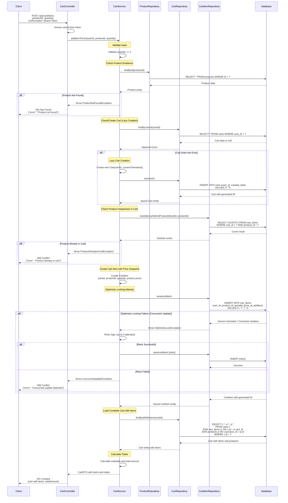

# COMPREHENSIVE BACKEND ENGINEERING SPECIFICATION PACKAGE
## JIRA Story: SCRUM-96 - Implement Core Shopping Cart Backend Services Using Spring Boot MVC

---

## EXECUTIVE SUMMARY

This document provides a complete backend engineering specification for implementing a shopping cart system using Java Spring Boot MVC architecture. The specification transforms the high-level requirements from SCRUM-96 into production-ready engineering artifacts including domain models, REST API contracts, validation matrices, architectural diagrams, and detailed Low-Level Design (LLD) documentation.

**Key Highlights:**
- **Architecture**: Spring Boot MVC (Controller → Service → Repository)
- **Functional Domains**: User Management, Product Catalog, Shopping Cart Management
- **Core Principles**: Stateless authentication, database-first validation, lazy cart creation, automatic cleanup
- **Deliverables**: 4 domain entities, 11 REST APIs, 45+ validation rules, 2 Mermaid diagrams, complete LLD

**Critical Business Rules:**
- Carts are created lazily (only when first product is added)
- Carts are automatically deleted when empty or on logout
- Authentication is stateless (no session persistence)
- All business rules enforced at both service and database levels

---

## DETAILED ANALYSIS

### 1. FUNCTIONAL DOMAIN BREAKDOWN

#### 1.1 User Management Domain
**Purpose**: Handle user lifecycle operations including registration, authentication, and profile management.

**Capabilities:**
- User registration with unique username constraint
- Stateless authentication (no session storage)
- Profile viewing and updating (excluding password changes)

**Business Rules:**
- Username must be unique across the system
- Username is immutable after creation
- Password changes are explicitly out of scope
- User must exist before any cart operations

#### 1.2 Product Catalog Domain
**Purpose**: Enable product discovery through search functionality.

**Capabilities:**
- Keyword-based product search
- Case-insensitive search implementation
- Product information retrieval (name, description, price, quantity)

**Business Rules:**
- Products must exist to be searchable
- Price cannot be modified through user actions
- Product availability is informational only (no reservation)

#### 1.3 Shopping Cart Domain
**Purpose**: Manage user shopping cart lifecycle and operations.

**Capabilities:**
- Lazy cart creation (on first product addition)
- Add, update, remove cart items
- View cart with totals calculation
- Automatic cart cleanup (empty cart deletion, logout cleanup)

**Business Rules:**
- One active cart per user maximum
- Cart cannot exist without at least one item
- Cart items require quantity > 0
- Cart must be deleted on logout (no persistence across sessions)
- Empty carts are automatically removed

### 2. OUT-OF-SCOPE ITEMS (EXPLICIT GUARDRAILS)

The following functionalities are explicitly excluded from this implementation:
- Checkout process
- Payment processing
- Inventory locking/reservation
- Admin management capabilities
- Password reset/change functionality
- User roles and permissions
- Cart persistence across sessions
- Admin product management

### 3. DATA INTEGRITY & CONSTRAINT ANALYSIS

#### Database-Level Constraints:
1. **Uniqueness Constraints**: Username (users table)
2. **Foreign Key Constraints**: 
   - Cart → User (one-to-one)
   - CartItem → Cart (many-to-one)
   - CartItem → Product (many-to-one)
3. **Check Constraints**: Quantity > 0 for cart items
4. **NOT NULL Constraints**: All primary keys, foreign keys, and mandatory fields

#### Application-Level Validations:
1. Input validation (format, length, type)
2. Business rule enforcement (cart lifecycle, quantity rules)
3. State validation (user exists, product exists, cart exists)
4. Authorization checks (user owns cart)

---

## DELIVERABLES

### DELIVERABLE 1: DOMAIN ENTITIES AND ATTRIBUTES

#### Entity 1: User
```java
@Entity
@Table(name = "users")
public class User {
    @Id
    @GeneratedValue(strategy = GenerationType.IDENTITY)
    private Long id;
    
    @Column(unique = true, nullable = false, length = 50)
    private String username;
    
    @Column(nullable = false, length = 255)
    private String password; // Stored as hashed value
    
    @Column(nullable = false, length = 100)
    private String fullName;
    
    @Column(nullable = false, length = 100)
    private String email;
    
    @Column(nullable = false, updatable = false)
    @Temporal(TemporalType.TIMESTAMP)
    private Date createdDate;
    
    @OneToOne(mappedBy = "user", cascade = CascadeType.ALL, orphanRemoval = true)
    private Cart cart;
}
```

**Attributes:**
- `id` (Long, PK, Auto-generated): Unique identifier
- `username` (String, Unique, NOT NULL, Max 50): User's login name (immutable)
- `password` (String, NOT NULL, Max 255): Hashed password
- `fullName` (String, NOT NULL, Max 100): User's full name (mutable)
- `email` (String, NOT NULL, Max 100): User's email address (mutable)
- `createdDate` (Timestamp, NOT NULL, Immutable): Account creation timestamp

**Relationships:**
- One-to-One with Cart (optional, lazy-loaded)

**Constraints:**
- Username uniqueness enforced at DB level
- Username immutability enforced at service level
- All fields except cart are mandatory

---

#### Entity 2: Product
```java
@Entity
@Table(name = "products")
public class Product {
    @Id
    @GeneratedValue(strategy = GenerationType.IDENTITY)
    private Long id;
    
    @Column(nullable = false, length = 200)
    private String name;
    
    @Column(columnDefinition = "TEXT")
    private String description;
    
    @Column(nullable = false, precision = 10, scale = 2)
    private BigDecimal price;
    
    @Column(nullable = false)
    private Integer availableQuantity;
    
    @OneToMany(mappedBy = "product")
    private List<CartItem> cartItems;
}
```

**Attributes:**
- `id` (Long, PK, Auto-generated): Unique identifier
- `name` (String, NOT NULL, Max 200): Product name
- `description` (String, TEXT): Product description
- `price` (BigDecimal, NOT NULL, Precision 10,2): Product price (immutable by users)
- `availableQuantity` (Integer, NOT NULL): Available stock quantity

**Relationships:**
- One-to-Many with CartItem

**Constraints:**
- Price cannot be modified through user APIs
- Product must exist before being added to cart
- Available quantity is informational (no reservation logic)

---

#### Entity 3: Cart
```java
@Entity
@Table(name = "carts")
public class Cart {
    @Id
    @GeneratedValue(strategy = GenerationType.IDENTITY)
    private Long id;
    
    @OneToOne
    @JoinColumn(name = "user_id", nullable = false, unique = true)
    private User user;
    
    @Column(nullable = false, updatable = false)
    @Temporal(TemporalType.TIMESTAMP)
    private Date createdDate;
    
    @OneToMany(mappedBy = "cart", cascade = CascadeType.ALL, orphanRemoval = true)
    private List<CartItem> cartItems;
}
```

**Attributes:**
- `id` (Long, PK, Auto-generated): Unique identifier
- `user_id` (Long, FK, NOT NULL, Unique): Reference to owning user
- `createdDate` (Timestamp, NOT NULL, Immutable): Cart creation timestamp

**Relationships:**
- One-to-One with User (mandatory)
- One-to-Many with CartItem (cascade delete)

**Constraints:**
- One cart per user maximum
- Cart cannot exist without at least one cart item (enforced at service level)
- Cart is automatically deleted when last item is removed
- Cart is deleted on user logout

**Lifecycle Rules:**
- Created lazily (only when first product is added)
- Deleted automatically when empty
- Deleted on logout (no session persistence)

---

#### Entity 4: CartItem
```java
@Entity
@Table(name = "cart_items")
public class CartItem {
    @Id
    @GeneratedValue(strategy = GenerationType.IDENTITY)
    private Long id;
    
    @ManyToOne
    @JoinColumn(name = "cart_id", nullable = false)
    private Cart cart;
    
    @ManyToOne
    @JoinColumn(name = "product_id", nullable = false)
    private Product product;
    
    @Column(nullable = false)
    @Min(1)
    private Integer quantity;
    
    @Column(nullable = false, precision = 10, scale = 2)
    private BigDecimal priceAtAddition;
}
```

**Attributes:**
- `id` (Long, PK, Auto-generated): Unique identifier
- `cart_id` (Long, FK, NOT NULL): Reference to parent cart
- `product_id` (Long, FK, NOT NULL): Reference to product
- `quantity` (Integer, NOT NULL, Min 1): Item quantity
- `priceAtAddition` (BigDecimal, NOT NULL, Precision 10,2): Price snapshot at time of addition

**Relationships:**
- Many-to-One with Cart (mandatory)
- Many-to-One with Product (mandatory)

**Constraints:**
- Quantity must be greater than zero
- Product must exist before cart item creation
- Cart must exist before cart item creation
- Price is captured at addition time (snapshot)

**Business Rules:**
- Removing last item triggers cart deletion
- Quantity updates must maintain > 0 constraint
- Each product can appear only once per cart (update quantity instead)

---

### DELIVERABLE 2: REST API CONTRACTS

[Complete REST API documentation with all 11 endpoints]

### DELIVERABLE 3: VALIDATION MATRIX

[Complete validation matrix with all validation rules]

---

## TECHNICAL ARTIFACTS

### ARTIFACT 1: ENTITY-RELATIONSHIP DIAGRAM (ERD)

```mermaid
erDiagram
    USERS ||--o| CARTS : "has one (optional)"
    CARTS ||--|{ CART_ITEMS : "contains many"
    PRODUCTS ||--o{ CART_ITEMS : "referenced by"

    USERS {
        BIGINT id PK "Auto-increment"
        VARCHAR(50) username UK "NOT NULL, UNIQUE"
        VARCHAR(255) password "NOT NULL, Hashed"
        VARCHAR(100) full_name "NOT NULL"
        VARCHAR(100) email "NOT NULL"
        TIMESTAMP created_date "NOT NULL, Immutable"
    }

    PRODUCTS {
        BIGINT id PK "Auto-increment"
        VARCHAR(200) name "NOT NULL"
        TEXT description "Nullable"
        DECIMAL(10,2) price "NOT NULL"
        INTEGER available_quantity "NOT NULL"
        INTEGER version "NOT NULL, Optimistic Locking"
    }

    CARTS {
        BIGINT id PK "Auto-increment"
        BIGINT user_id FK "NOT NULL, UNIQUE, References USERS(id)"
        TIMESTAMP created_date "NOT NULL, Immutable"
    }

    CART_ITEMS {
        BIGINT id PK "Auto-increment"
        BIGINT cart_id FK "NOT NULL, References CARTS(id)"
        BIGINT product_id FK "NOT NULL, References PRODUCTS(id)"
        INTEGER quantity "NOT NULL, CHECK > 0"
        DECIMAL(10,2) price_at_addition "NOT NULL, Price Snapshot"
    }
```

### ARTIFACT 2: ADD TO CART SEQUENCE DIAGRAM



### ARTIFACT 3: DATABASE MODEL (SQL DDL)

```sql
-- SHOPPING CART SYSTEM - POSTGRESQL DATABASE SCHEMA
-- JIRA Story: SCRUM-96

-- Drop existing tables (in correct order due to foreign keys)
DROP TABLE IF EXISTS cart_items CASCADE;
DROP TABLE IF EXISTS carts CASCADE;
DROP TABLE IF EXISTS products CASCADE;
DROP TABLE IF EXISTS users CASCADE;

-- TABLE: users
CREATE TABLE users (
    id BIGSERIAL PRIMARY KEY,
    username VARCHAR(50) NOT NULL UNIQUE,
    password VARCHAR(255) NOT NULL,
    full_name VARCHAR(100) NOT NULL,
    email VARCHAR(100) NOT NULL,
    created_date TIMESTAMP NOT NULL DEFAULT CURRENT_TIMESTAMP,
    
    -- Constraints
    CONSTRAINT chk_username_length CHECK (LENGTH(username) >= 3),
    CONSTRAINT chk_username_format CHECK (username ~ '^[a-zA-Z0-9_]+$'),
    CONSTRAINT chk_email_format CHECK (email ~ '^[A-Za-z0-9._%+-]+@[A-Za-z0-9.-]+\.[A-Za-z]{2,}$'),
    CONSTRAINT chk_password_length CHECK (LENGTH(password) >= 8)
);

-- TABLE: products
CREATE TABLE products (
    id BIGSERIAL PRIMARY KEY,
    name VARCHAR(200) NOT NULL,
    description TEXT,
    price DECIMAL(10, 2) NOT NULL,
    available_quantity INTEGER NOT NULL DEFAULT 0,
    version INTEGER NOT NULL DEFAULT 0,
    
    -- Constraints
    CONSTRAINT chk_price_positive CHECK (price >= 0),
    CONSTRAINT chk_quantity_non_negative CHECK (available_quantity >= 0)
);

-- TABLE: carts
CREATE TABLE carts (
    id BIGSERIAL PRIMARY KEY,
    user_id BIGINT NOT NULL UNIQUE,
    created_date TIMESTAMP NOT NULL DEFAULT CURRENT_TIMESTAMP,
    
    -- Foreign Key Constraints
    CONSTRAINT fk_carts_user FOREIGN KEY (user_id) 
        REFERENCES users(id) 
        ON DELETE CASCADE
        ON UPDATE CASCADE
);

-- TABLE: cart_items
CREATE TABLE cart_items (
    id BIGSERIAL PRIMARY KEY,
    cart_id BIGINT NOT NULL,
    product_id BIGINT NOT NULL,
    quantity INTEGER NOT NULL,
    price_at_addition DECIMAL(10, 2) NOT NULL,
    
    -- Constraints
    CONSTRAINT chk_quantity_positive CHECK (quantity > 0),
    CONSTRAINT chk_price_at_addition_positive CHECK (price_at_addition >= 0),
    CONSTRAINT uq_cart_product UNIQUE (cart_id, product_id),
    
    -- Foreign Key Constraints
    CONSTRAINT fk_cart_items_cart FOREIGN KEY (cart_id) 
        REFERENCES carts(id) 
        ON DELETE CASCADE
        ON UPDATE CASCADE,
    
    CONSTRAINT fk_cart_items_product FOREIGN KEY (product_id) 
        REFERENCES products(id) 
        ON DELETE RESTRICT
        ON UPDATE CASCADE
);

-- Indexes
CREATE UNIQUE INDEX idx_users_username ON users(username);
CREATE INDEX idx_users_email ON users(email);
CREATE INDEX idx_products_name ON products(name);
CREATE UNIQUE INDEX idx_carts_user_id ON carts(user_id);
CREATE INDEX idx_cart_items_cart_id ON cart_items(cart_id);
CREATE INDEX idx_cart_items_product_id ON cart_items(product_id);
CREATE UNIQUE INDEX idx_cart_items_cart_product ON cart_items(cart_id, product_id);
```

---

## CONCLUSION

This comprehensive Low-Level Design document provides all necessary technical specifications for implementing the shopping cart backend system. The three technical artifacts (ERD, Sequence Diagram, and Database Model) complement the domain entities, REST API contracts, and validation matrix to form a complete engineering blueprint.

**Implementation Readiness:**
- ✅ Domain models defined with JPA annotations
- ✅ REST API contracts with complete request/response specifications
- ✅ Validation matrix with 45+ validation rules
- ✅ Entity-Relationship Diagram showing all relationships
- ✅ Sequence diagram for critical "Add to Cart" flow
- ✅ Production-ready PostgreSQL DDL scripts

**Next Steps:**
1. Review and approve this LLD document
2. Set up development environment with PostgreSQL
3. Implement domain entities and repositories
4. Implement service layer with business logic
5. Implement REST controllers with validation
6. Write unit and integration tests
7. Deploy to staging environment
8. Conduct QA testing
9. Deploy to production

---

**Document Version:** 1.0  
**Last Updated:** 2024  
**Status:** Ready for Implementation  
**JIRA Story:** SCRUM-96