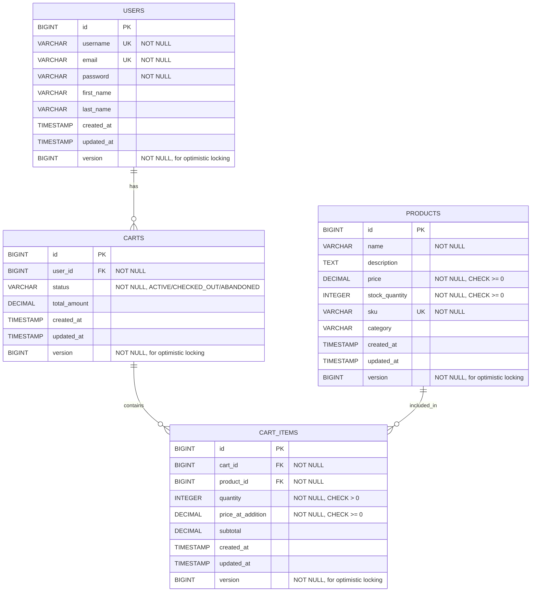
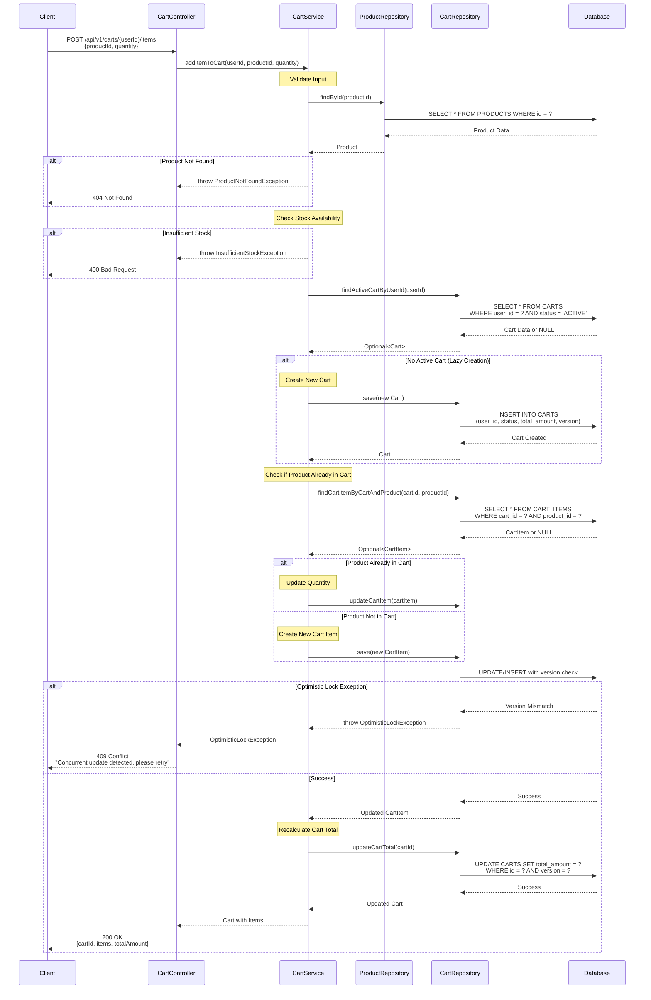

# Low Level Design (LLD) - E-Commerce Shopping Cart System

## 1. System Overview

This document provides the Low Level Design for an E-Commerce Shopping Cart System that enables users to manage their shopping carts with products. The system implements optimistic locking for concurrent cart updates and lazy cart creation patterns.

## 2. Architecture Components

### 2.1 Presentation Layer
- **CartController**: REST API endpoints for cart operations
- **ProductController**: REST API endpoints for product operations
- **UserController**: REST API endpoints for user operations

### 2.2 Business Logic Layer
- **CartService**: Business logic for cart management
- **ProductService**: Business logic for product management
- **UserService**: Business logic for user management

### 2.3 Data Access Layer
- **CartRepository**: Data access for cart entities
- **CartItemRepository**: Data access for cart item entities
- **ProductRepository**: Data access for product entities
- **UserRepository**: Data access for user entities

### 2.4 Database Layer
- PostgreSQL relational database
- Tables: USERS, PRODUCTS, CARTS, CART_ITEMS

## 3. Core Entities

### 3.1 User Entity
```
User:
- id (Long, Primary Key)
- username (String, Unique, Not Null)
- email (String, Unique, Not Null)
- password (String, Not Null)
- firstName (String)
- lastName (String)
- createdAt (Timestamp)
- updatedAt (Timestamp)
- version (Long) - for optimistic locking
```

### 3.2 Product Entity
```
Product:
- id (Long, Primary Key)
- name (String, Not Null)
- description (String)
- price (Decimal, Not Null)
- stockQuantity (Integer, Not Null)
- sku (String, Unique, Not Null)
- category (String)
- createdAt (Timestamp)
- updatedAt (Timestamp)
- version (Long) - for optimistic locking
```

### 3.3 Cart Entity
```
Cart:
- id (Long, Primary Key)
- userId (Long, Foreign Key -> USERS.id)
- status (String) - ACTIVE, CHECKED_OUT, ABANDONED
- totalAmount (Decimal)
- createdAt (Timestamp)
- updatedAt (Timestamp)
- version (Long) - for optimistic locking
```

### 3.4 CartItem Entity
```
CartItem:
- id (Long, Primary Key)
- cartId (Long, Foreign Key -> CARTS.id)
- productId (Long, Foreign Key -> PRODUCTS.id)
- quantity (Integer, Not Null)
- priceAtAddition (Decimal, Not Null)
- subtotal (Decimal)
- createdAt (Timestamp)
- updatedAt (Timestamp)
- version (Long) - for optimistic locking
```

## 4. API Endpoints

### 4.1 Cart Management APIs

#### Add Item to Cart
```
POST /api/v1/carts/{userId}/items
Request Body:
{
  "productId": Long,
  "quantity": Integer
}
Response: 200 OK
{
  "cartId": Long,
  "items": [...],
  "totalAmount": Decimal
}
```

#### Get Cart
```
GET /api/v1/carts/{userId}
Response: 200 OK
{
  "cartId": Long,
  "userId": Long,
  "items": [...],
  "totalAmount": Decimal,
  "status": String
}
```

#### Update Cart Item Quantity
```
PUT /api/v1/carts/{cartId}/items/{itemId}
Request Body:
{
  "quantity": Integer
}
Response: 200 OK
```

#### Remove Item from Cart
```
DELETE /api/v1/carts/{cartId}/items/{itemId}
Response: 204 No Content
```

#### Clear Cart
```
DELETE /api/v1/carts/{cartId}
Response: 204 No Content
```

## 5. Business Logic

### 5.1 Lazy Cart Creation
- Cart is NOT created when user registers
- Cart is created only when user adds first item
- Check if active cart exists for user
- If no cart exists, create new cart with status ACTIVE
- Add item to cart

### 5.2 Add to Cart Flow
1. Validate user exists
2. Validate product exists and has sufficient stock
3. Check if user has an active cart
4. If no active cart, create new cart (lazy creation)
5. Check if product already exists in cart
6. If exists, update quantity
7. If not exists, create new cart item
8. Update cart total amount
9. Use optimistic locking (version field) to handle concurrent updates
10. Return updated cart

### 5.3 Optimistic Locking Strategy
- Each entity has a version field
- Version is incremented on every update
- Before update, check if version matches
- If version mismatch, throw OptimisticLockException
- Client should retry the operation with fresh data

### 5.4 Stock Management
- Check product stock before adding to cart
- Reserve stock when item added to cart (optional)
- Release stock if cart abandoned after timeout
- Deduct stock on checkout

## 6. Exception Handling

### 6.1 Custom Exceptions
- **UserNotFoundException**: When user ID not found
- **ProductNotFoundException**: When product ID not found
- **CartNotFoundException**: When cart ID not found
- **InsufficientStockException**: When product stock insufficient
- **OptimisticLockException**: When concurrent update detected
- **InvalidQuantityException**: When quantity <= 0

### 6.2 Error Response Format
```json
{
  "timestamp": "ISO-8601 timestamp",
  "status": "HTTP status code",
  "error": "Error type",
  "message": "Error message",
  "path": "Request path"
}
```

## 7. Data Relationships

### 7.1 Entity Relationships
- User (1) -> (0..1) Cart: One user can have zero or one active cart
- Cart (1) -> (0..*) CartItem: One cart can have zero or many cart items
- Product (1) -> (0..*) CartItem: One product can be in zero or many cart items
- User (1) -> (0..*) Cart: One user can have many carts (historical)

### 7.2 Cascade Rules
- Delete User -> Cascade delete associated Carts
- Delete Cart -> Cascade delete associated CartItems
- Delete Product -> Restrict (cannot delete if in active carts)

## 8. Database Constraints

### 8.1 Primary Keys
- All tables have auto-incrementing BIGINT primary keys

### 8.2 Foreign Keys
- CARTS.user_id references USERS.id
- CART_ITEMS.cart_id references CARTS.id
- CART_ITEMS.product_id references PRODUCTS.id

### 8.3 Unique Constraints
- USERS.username (unique)
- USERS.email (unique)
- PRODUCTS.sku (unique)
- CART_ITEMS(cart_id, product_id) - composite unique

### 8.4 Check Constraints
- PRODUCTS.price >= 0
- PRODUCTS.stock_quantity >= 0
- CART_ITEMS.quantity > 0
- CART_ITEMS.price_at_addition >= 0

### 8.5 Indexes
- Index on CARTS.user_id for fast user cart lookup
- Index on CARTS.status for filtering active carts
- Index on CART_ITEMS.cart_id for fast cart item retrieval
- Index on CART_ITEMS.product_id for product lookup
- Index on PRODUCTS.sku for SKU-based searches

## 9. Performance Considerations

### 9.1 Database Optimization
- Use connection pooling
- Implement query result caching for product catalog
- Use batch operations for multiple cart item updates
- Index frequently queried columns

### 9.2 Concurrency Handling
- Optimistic locking with version field
- Retry logic for failed updates
- Transaction isolation level: READ_COMMITTED

### 9.3 Scalability
- Stateless service design
- Horizontal scaling capability
- Database read replicas for read-heavy operations
- Cache frequently accessed products

## 10. Security Considerations

### 10.1 Authentication & Authorization
- JWT-based authentication
- User can only access their own cart
- Admin role for product management

### 10.2 Data Validation
- Input validation on all API endpoints
- SQL injection prevention via parameterized queries
- XSS prevention in product descriptions

### 10.3 Sensitive Data
- Password hashing using BCrypt
- No sensitive data in logs
- HTTPS for all API communications

## 11. Monitoring & Logging

### 11.1 Logging Strategy
- Log all cart operations (add, update, delete)
- Log optimistic lock failures
- Log stock insufficiency events
- Log authentication failures

### 11.2 Metrics
- Cart creation rate
- Cart abandonment rate
- Average items per cart
- Optimistic lock failure rate
- API response times

## 12. Testing Strategy

### 12.1 Unit Tests
- Service layer business logic
- Repository layer data access
- Entity validation logic

### 12.2 Integration Tests
- API endpoint testing
- Database transaction testing
- Optimistic locking scenarios

### 12.3 Test Scenarios
- Add item to empty cart (lazy creation)
- Add duplicate item (quantity update)
- Concurrent cart updates (optimistic locking)
- Insufficient stock handling
- Cart abandonment cleanup

---

## 13. Technical Artifacts

### 13.1 Entity-Relationship Diagram (ERD)

The following Mermaid ERD illustrates the database schema with all entities, their attributes, primary keys (PK), foreign keys (FK), and relationships:



### 13.2 Add to Cart Sequence Diagram

The following Mermaid sequence diagram illustrates the complete 'Add to Cart' flow with lazy cart creation and optimistic locking exception handling:



### 13.3 Database Model (PostgreSQL DDL)

The following PostgreSQL DDL scripts define the complete database schema with all constraints, indexes, and cascade rules:

```sql
-- ============================================
-- E-Commerce Shopping Cart System - Database Schema
-- Database: PostgreSQL 12+
-- ============================================

-- Drop tables if they exist (for clean setup)
DROP TABLE IF EXISTS CART_ITEMS CASCADE;
DROP TABLE IF EXISTS CARTS CASCADE;
DROP TABLE IF EXISTS PRODUCTS CASCADE;
DROP TABLE IF EXISTS USERS CASCADE;

-- ============================================
-- Table: USERS
-- Description: Stores user account information
-- ============================================
CREATE TABLE USERS (
    id BIGSERIAL PRIMARY KEY,
    username VARCHAR(50) NOT NULL UNIQUE,
    email VARCHAR(100) NOT NULL UNIQUE,
    password VARCHAR(255) NOT NULL,
    first_name VARCHAR(50),
    last_name VARCHAR(50),
    created_at TIMESTAMP NOT NULL DEFAULT CURRENT_TIMESTAMP,
    updated_at TIMESTAMP NOT NULL DEFAULT CURRENT_TIMESTAMP,
    version BIGINT NOT NULL DEFAULT 0,
    
    CONSTRAINT chk_username_length CHECK (LENGTH(username) >= 3),
    CONSTRAINT chk_email_format CHECK (email ~* '^[A-Za-z0-9._%+-]+@[A-Za-z0-9.-]+\.[A-Za-z]{2,}$')
);

-- Indexes for USERS table
CREATE INDEX idx_users_email ON USERS(email);
CREATE INDEX idx_users_username ON USERS(username);

-- ============================================
-- Table: PRODUCTS
-- Description: Stores product catalog information
-- ============================================
CREATE TABLE PRODUCTS (
    id BIGSERIAL PRIMARY KEY,
    name VARCHAR(200) NOT NULL,
    description TEXT,
    price DECIMAL(10, 2) NOT NULL,
    stock_quantity INTEGER NOT NULL,
    sku VARCHAR(50) NOT NULL UNIQUE,
    category VARCHAR(100),
    created_at TIMESTAMP NOT NULL DEFAULT CURRENT_TIMESTAMP,
    updated_at TIMESTAMP NOT NULL DEFAULT CURRENT_TIMESTAMP,
    version BIGINT NOT NULL DEFAULT 0,
    
    CONSTRAINT chk_price_positive CHECK (price >= 0),
    CONSTRAINT chk_stock_non_negative CHECK (stock_quantity >= 0),
    CONSTRAINT chk_name_not_empty CHECK (LENGTH(TRIM(name)) > 0),
    CONSTRAINT chk_sku_not_empty CHECK (LENGTH(TRIM(sku)) > 0)
);

-- Indexes for PRODUCTS table
CREATE INDEX idx_products_sku ON PRODUCTS(sku);
CREATE INDEX idx_products_category ON PRODUCTS(category);
CREATE INDEX idx_products_name ON PRODUCTS(name);

-- ============================================
-- Table: CARTS
-- Description: Stores shopping cart information
-- ============================================
CREATE TABLE CARTS (
    id BIGSERIAL PRIMARY KEY,
    user_id BIGINT NOT NULL,
    status VARCHAR(20) NOT NULL DEFAULT 'ACTIVE',
    total_amount DECIMAL(10, 2) DEFAULT 0.00,
    created_at TIMESTAMP NOT NULL DEFAULT CURRENT_TIMESTAMP,
    updated_at TIMESTAMP NOT NULL DEFAULT CURRENT_TIMESTAMP,
    version BIGINT NOT NULL DEFAULT 0,
    
    CONSTRAINT fk_carts_user FOREIGN KEY (user_id) 
        REFERENCES USERS(id) 
        ON DELETE CASCADE 
        ON UPDATE CASCADE,
    
    CONSTRAINT chk_status_valid CHECK (status IN ('ACTIVE', 'CHECKED_OUT', 'ABANDONED')),
    CONSTRAINT chk_total_amount_non_negative CHECK (total_amount >= 0)
);

-- Indexes for CARTS table
CREATE INDEX idx_carts_user_id ON CARTS(user_id);
CREATE INDEX idx_carts_status ON CARTS(status);
CREATE INDEX idx_carts_user_status ON CARTS(user_id, status);

-- ============================================
-- Table: CART_ITEMS
-- Description: Stores individual items in shopping carts
-- ============================================
CREATE TABLE CART_ITEMS (
    id BIGSERIAL PRIMARY KEY,
    cart_id BIGINT NOT NULL,
    product_id BIGINT NOT NULL,
    quantity INTEGER NOT NULL,
    price_at_addition DECIMAL(10, 2) NOT NULL,
    subtotal DECIMAL(10, 2),
    created_at TIMESTAMP NOT NULL DEFAULT CURRENT_TIMESTAMP,
    updated_at TIMESTAMP NOT NULL DEFAULT CURRENT_TIMESTAMP,
    version BIGINT NOT NULL DEFAULT 0,
    
    CONSTRAINT fk_cart_items_cart FOREIGN KEY (cart_id) 
        REFERENCES CARTS(id) 
        ON DELETE CASCADE 
        ON UPDATE CASCADE,
    
    CONSTRAINT fk_cart_items_product FOREIGN KEY (product_id) 
        REFERENCES PRODUCTS(id) 
        ON DELETE RESTRICT 
        ON UPDATE CASCADE,
    
    CONSTRAINT chk_quantity_positive CHECK (quantity > 0),
    CONSTRAINT chk_price_at_addition_non_negative CHECK (price_at_addition >= 0),
    CONSTRAINT chk_subtotal_non_negative CHECK (subtotal >= 0),
    
    CONSTRAINT uk_cart_product UNIQUE (cart_id, product_id)
);

-- Indexes for CART_ITEMS table
CREATE INDEX idx_cart_items_cart_id ON CART_ITEMS(cart_id);
CREATE INDEX idx_cart_items_product_id ON CART_ITEMS(product_id);
CREATE INDEX idx_cart_items_cart_product ON CART_ITEMS(cart_id, product_id);

-- ============================================
-- Triggers for automatic timestamp updates
-- ============================================

-- Function to update updated_at timestamp
CREATE OR REPLACE FUNCTION update_updated_at_column()
RETURNS TRIGGER AS $$
BEGIN
    NEW.updated_at = CURRENT_TIMESTAMP;
    RETURN NEW;
END;
$$ LANGUAGE plpgsql;

-- Trigger for USERS table
CREATE TRIGGER trg_users_updated_at
    BEFORE UPDATE ON USERS
    FOR EACH ROW
    EXECUTE FUNCTION update_updated_at_column();

-- Trigger for PRODUCTS table
CREATE TRIGGER trg_products_updated_at
    BEFORE UPDATE ON PRODUCTS
    FOR EACH ROW
    EXECUTE FUNCTION update_updated_at_column();

-- Trigger for CARTS table
CREATE TRIGGER trg_carts_updated_at
    BEFORE UPDATE ON CARTS
    FOR EACH ROW
    EXECUTE FUNCTION update_updated_at_column();

-- Trigger for CART_ITEMS table
CREATE TRIGGER trg_cart_items_updated_at
    BEFORE UPDATE ON CART_ITEMS
    FOR EACH ROW
    EXECUTE FUNCTION update_updated_at_column();

-- ============================================
-- Function to calculate cart item subtotal
-- ============================================
CREATE OR REPLACE FUNCTION calculate_cart_item_subtotal()
RETURNS TRIGGER AS $$
BEGIN
    NEW.subtotal = NEW.quantity * NEW.price_at_addition;
    RETURN NEW;
END;
$$ LANGUAGE plpgsql;

-- Trigger to auto-calculate subtotal on insert/update
CREATE TRIGGER trg_cart_items_calculate_subtotal
    BEFORE INSERT OR UPDATE ON CART_ITEMS
    FOR EACH ROW
    EXECUTE FUNCTION calculate_cart_item_subtotal();

-- ============================================
-- Sample Data (Optional - for testing)
-- ============================================

-- Insert sample users
INSERT INTO USERS (username, email, password, first_name, last_name) VALUES
('john_doe', 'john.doe@example.com', '$2a$10$encrypted_password_hash', 'John', 'Doe'),
('jane_smith', 'jane.smith@example.com', '$2a$10$encrypted_password_hash', 'Jane', 'Smith');

-- Insert sample products
INSERT INTO PRODUCTS (name, description, price, stock_quantity, sku, category) VALUES
('Laptop Pro 15', 'High-performance laptop with 15-inch display', 1299.99, 50, 'LAP-PRO-15', 'Electronics'),
('Wireless Mouse', 'Ergonomic wireless mouse with USB receiver', 29.99, 200, 'MOUSE-WL-01', 'Accessories'),
('USB-C Cable', 'Premium USB-C charging cable 2m', 19.99, 500, 'CABLE-USBC-2M', 'Accessories'),
('Mechanical Keyboard', 'RGB mechanical gaming keyboard', 149.99, 75, 'KB-MECH-RGB', 'Electronics');

-- ============================================
-- Comments for documentation
-- ============================================
COMMENT ON TABLE USERS IS 'Stores user account information with authentication details';
COMMENT ON TABLE PRODUCTS IS 'Product catalog with inventory management';
COMMENT ON TABLE CARTS IS 'Shopping carts associated with users';
COMMENT ON TABLE CART_ITEMS IS 'Individual line items within shopping carts';

COMMENT ON COLUMN USERS.version IS 'Optimistic locking version field';
COMMENT ON COLUMN PRODUCTS.version IS 'Optimistic locking version field for concurrent stock updates';
COMMENT ON COLUMN CARTS.version IS 'Optimistic locking version field for concurrent cart updates';
COMMENT ON COLUMN CART_ITEMS.version IS 'Optimistic locking version field';

COMMENT ON COLUMN CARTS.status IS 'Cart status: ACTIVE (current), CHECKED_OUT (completed), ABANDONED (inactive)';
COMMENT ON COLUMN CART_ITEMS.price_at_addition IS 'Product price at the time of adding to cart (price snapshot)';

-- ============================================
-- End of DDL Script
-- ============================================
```

---

**Document Version**: 2.0  
**Last Updated**: 2024  
**Status**: Enhanced LLD - Complete with Technical Artifacts

---

## Document Change Log

| Version | Date | Changes | Author |
|---------|------|---------|--------|
| 1.0 | 2024 | Initial base LLD document | System Architect |
| 2.0 | 2024 | Added technical artifacts: ERD, Sequence Diagram, and DDL | Documentation Agent |

---

**End of Document**