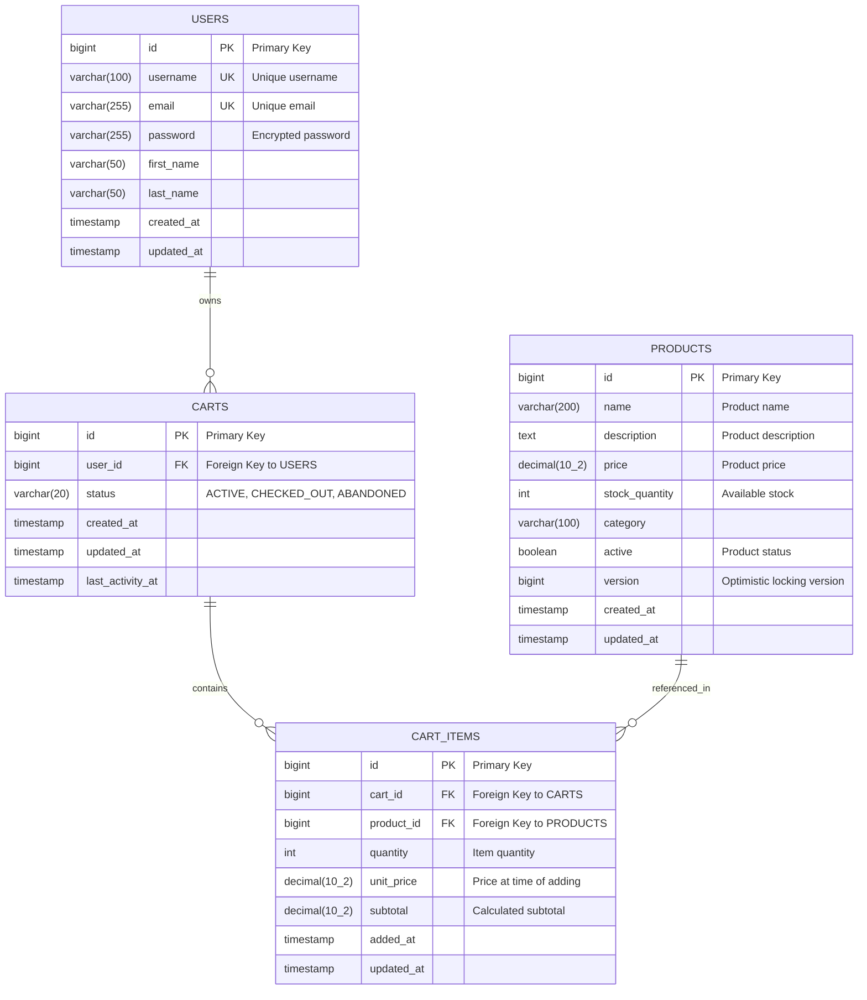
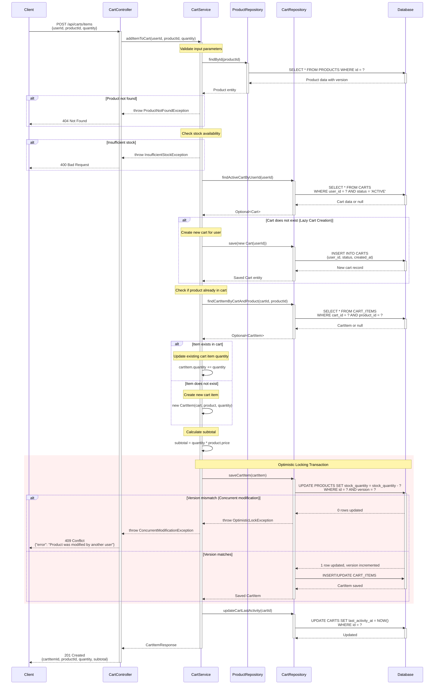

# COMPREHENSIVE BACKEND ENGINEERING SPECIFICATION
## Shopping Cart System - SCRUM-96
### "Implement Core Shopping Cart Backend Services Using Spring Boot MVC"

---

## EXECUTIVE SUMMARY

### Project Overview
This document provides a complete backend engineering specification for implementing a shopping cart system using Java Spring Boot MVC architecture. The system encompasses user management, product catalog search, and comprehensive shopping cart lifecycle management with strict data integrity constraints.

### Key Highlights
- **Architecture**: Spring Boot MVC (Controller → Service → Repository)
- **Core Domains**: User Management, Product Catalog, Shopping Cart Management
- **API Count**: 11 RESTful endpoints
- **Domain Entities**: 4 (User, Product, Cart, CartItem)
- **Key Constraint**: Stateless authentication, lazy cart creation, automatic cart cleanup

### Business Value
- Enables users to browse products and manage shopping selections
- Enforces strict data integrity through database constraints
- Provides clean cart lifecycle management (lazy creation, auto-deletion)
- Maintains stateless architecture for scalability

### Critical Success Factors
1. Cart exists only when items are present (lazy creation + auto-deletion)
2. Logout completely removes cart and all items
3. All business rules verifiable through database state
4. No cart persistence across sessions
5. Strict MVC layering maintained throughout

---

## DETAILED ANALYSIS

### 1. DOMAIN ENTITY EXTRACTION

#### 1.1 User Entity
**Purpose**: Represents system users who can authenticate and manage shopping carts

**Attributes**:
- `userId` (Long, Primary Key, Auto-generated): Unique identifier
- `username` (String, Unique, Not Null, Immutable): Login credential
- `password` (String, Not Null): Hashed password for authentication
- `fullName` (String, Not Null): User's display name
- `email` (String, Not Null): Contact email
- `createdDate` (Timestamp, Not Null, Auto-generated): Account creation timestamp

**Constraints**:
- Username must be unique across all users
- Username is immutable after creation
- User must exist before any cart operations
- Seed users do not automatically receive carts

**Relationships**:
- One-to-One with Cart (optional, lazy)

#### 1.2 Product Entity
**Purpose**: Represents items available for purchase in the catalog

**Attributes**:
- `productId` (Long, Primary Key, Auto-generated): Unique identifier
- `name` (String, Not Null): Product name
- `description` (String): Product description
- `price` (BigDecimal, Not Null): Unit price (immutable through user actions)
- `availableQuantity` (Integer, Not Null): Stock quantity

**Constraints**:
- Product must exist before being added to cart
- Price cannot be modified through user actions
- Available quantity must be tracked but not reserved (out of scope)

**Relationships**:
- One-to-Many with CartItem

#### 1.3 Cart Entity
**Purpose**: Container for user's shopping selections

**Attributes**:
- `cartId` (Long, Primary Key, Auto-generated): Unique identifier
- `userId` (Long, Foreign Key, Not Null, Unique): Owner reference
- `createdDate` (Timestamp, Not Null, Auto-generated): Cart creation timestamp
- `lastModifiedDate` (Timestamp, Not Null, Auto-updated): Last update timestamp

**Constraints**:
- One active cart per user maximum
- Cart belongs to exactly one user
- Cart cannot exist without at least one item
- Cart is created lazily (only when first product added)
- Cart is deleted automatically when last item removed
- Cart is deleted on user logout

**Relationships**:
- Many-to-One with User (required)
- One-to-Many with CartItem (required, cascade delete)

#### 1.4 CartItem Entity
**Purpose**: Represents individual product selections within a cart

**Attributes**:
- `cartItemId` (Long, Primary Key, Auto-generated): Unique identifier
- `cartId` (Long, Foreign Key, Not Null): Parent cart reference
- `productId` (Long, Foreign Key, Not Null): Product reference
- `quantity` (Integer, Not Null, > 0): Number of units
- `addedDate` (Timestamp, Not Null, Auto-generated): Item addition timestamp

**Constraints**:
- Each item belongs to exactly one cart
- Product must exist before adding
- Quantity must always be greater than 0
- Unique constraint on (cartId, productId) - one entry per product per cart

**Relationships**:
- Many-to-One with Cart (required)
- Many-to-One with Product (required)

**Derived Attributes** (calculated, not stored):
- `itemTotal` = quantity × product.price

---

# Technical Artifacts - Shopping Cart System

## 1. Entity-Relationship Diagram (ERD)

The following Mermaid ERD illustrates the database schema for the Shopping Cart System, showing relationships between USERS, PRODUCTS, CARTS, and CART_ITEMS entities.



---

## 2. Add to Cart - Sequence Diagram

The following Mermaid sequence diagram illustrates the complete 'Add to Cart' flow, including lazy cart creation and optimistic locking exception handling.



---

## 3. Database Model - PostgreSQL DDL Scripts

The following SQL DDL scripts define the complete database schema for the Shopping Cart System with all constraints, indexes, and relationships.

```sql
-- ============================================
-- Shopping Cart System - PostgreSQL DDL
-- ============================================

-- Drop tables if they exist (for clean setup)
DROP TABLE IF EXISTS CART_ITEMS CASCADE;
DROP TABLE IF EXISTS CARTS CASCADE;
DROP TABLE IF EXISTS PRODUCTS CASCADE;
DROP TABLE IF EXISTS USERS CASCADE;

-- ============================================
-- USERS TABLE
-- ============================================
CREATE TABLE USERS (
    id BIGSERIAL PRIMARY KEY,
    username VARCHAR(100) NOT NULL UNIQUE,
    email VARCHAR(255) NOT NULL UNIQUE,
    password VARCHAR(255) NOT NULL,
    first_name VARCHAR(50) NOT NULL,
    last_name VARCHAR(50) NOT NULL,
    created_at TIMESTAMP NOT NULL DEFAULT CURRENT_TIMESTAMP,
    updated_at TIMESTAMP NOT NULL DEFAULT CURRENT_TIMESTAMP,
    
    CONSTRAINT chk_username_length CHECK (LENGTH(username) >= 3),
    CONSTRAINT chk_email_format CHECK (email ~* '^[A-Za-z0-9._%+-]+@[A-Za-z0-9.-]+\\.[A-Za-z]{2,}$')
);

COMMENT ON TABLE USERS IS 'Stores user account information';
COMMENT ON COLUMN USERS.password IS 'BCrypt encrypted password';

-- ============================================
-- PRODUCTS TABLE
-- ============================================
CREATE TABLE PRODUCTS (
    id BIGSERIAL PRIMARY KEY,
    name VARCHAR(200) NOT NULL,
    description TEXT,
    price DECIMAL(10, 2) NOT NULL,
    stock_quantity INTEGER NOT NULL DEFAULT 0,
    category VARCHAR(100),
    active BOOLEAN NOT NULL DEFAULT TRUE,
    version BIGINT NOT NULL DEFAULT 0,
    created_at TIMESTAMP NOT NULL DEFAULT CURRENT_TIMESTAMP,
    updated_at TIMESTAMP NOT NULL DEFAULT CURRENT_TIMESTAMP,
    
    CONSTRAINT chk_price_positive CHECK (price >= 0),
    CONSTRAINT chk_stock_non_negative CHECK (stock_quantity >= 0),
    CONSTRAINT chk_name_not_empty CHECK (LENGTH(TRIM(name)) > 0)
);

COMMENT ON TABLE PRODUCTS IS 'Stores product catalog information';
COMMENT ON COLUMN PRODUCTS.version IS 'Optimistic locking version number';
COMMENT ON COLUMN PRODUCTS.active IS 'Indicates if product is available for purchase';

-- ============================================
-- CARTS TABLE
-- ============================================
CREATE TABLE CARTS (
    id BIGSERIAL PRIMARY KEY,
    user_id BIGINT NOT NULL,
    status VARCHAR(20) NOT NULL DEFAULT 'ACTIVE',
    created_at TIMESTAMP NOT NULL DEFAULT CURRENT_TIMESTAMP,
    updated_at TIMESTAMP NOT NULL DEFAULT CURRENT_TIMESTAMP,
    last_activity_at TIMESTAMP NOT NULL DEFAULT CURRENT_TIMESTAMP,
    
    CONSTRAINT fk_cart_user FOREIGN KEY (user_id) 
        REFERENCES USERS(id) 
        ON DELETE CASCADE,
    
    CONSTRAINT chk_cart_status CHECK (status IN ('ACTIVE', 'CHECKED_OUT', 'ABANDONED'))
);

COMMENT ON TABLE CARTS IS 'Stores shopping cart information for users';
COMMENT ON COLUMN CARTS.status IS 'Cart status: ACTIVE, CHECKED_OUT, or ABANDONED';
COMMENT ON COLUMN CARTS.last_activity_at IS 'Timestamp of last cart modification';

-- ============================================
-- CART_ITEMS TABLE
-- ============================================
CREATE TABLE CART_ITEMS (
    id BIGSERIAL PRIMARY KEY,
    cart_id BIGINT NOT NULL,
    product_id BIGINT NOT NULL,
    quantity INTEGER NOT NULL,
    unit_price DECIMAL(10, 2) NOT NULL,
    subtotal DECIMAL(10, 2) NOT NULL,
    added_at TIMESTAMP NOT NULL DEFAULT CURRENT_TIMESTAMP,
    updated_at TIMESTAMP NOT NULL DEFAULT CURRENT_TIMESTAMP,
    
    CONSTRAINT fk_cartitem_cart FOREIGN KEY (cart_id) 
        REFERENCES CARTS(id) 
        ON DELETE CASCADE,
    
    CONSTRAINT fk_cartitem_product FOREIGN KEY (product_id) 
        REFERENCES PRODUCTS(id) 
        ON DELETE CASCADE,
    
    CONSTRAINT chk_quantity_positive CHECK (quantity > 0),
    CONSTRAINT chk_unit_price_positive CHECK (unit_price >= 0),
    CONSTRAINT chk_subtotal_non_negative CHECK (subtotal >= 0),
    
    CONSTRAINT uk_cart_product UNIQUE (cart_id, product_id)
);

COMMENT ON TABLE CART_ITEMS IS 'Stores individual items within shopping carts';
COMMENT ON COLUMN CART_ITEMS.unit_price IS 'Product price at the time of adding to cart';
COMMENT ON COLUMN CART_ITEMS.subtotal IS 'Calculated as quantity * unit_price';
COMMENT ON CONSTRAINT uk_cart_product ON CART_ITEMS IS 'Ensures a product appears only once per cart';

-- ============================================
-- INDEXES FOR PERFORMANCE OPTIMIZATION
-- ============================================

-- Index on USERS table
CREATE INDEX idx_users_email ON USERS(email);
CREATE INDEX idx_users_username ON USERS(username);

COMMENT ON INDEX idx_users_email IS 'Optimizes user lookup by email during authentication';
COMMENT ON INDEX idx_users_username IS 'Optimizes user lookup by username';

-- Indexes on PRODUCTS table
CREATE INDEX idx_products_category ON PRODUCTS(category);
CREATE INDEX idx_products_active ON PRODUCTS(active);
CREATE INDEX idx_products_name ON PRODUCTS(name);

COMMENT ON INDEX idx_products_category IS 'Optimizes product filtering by category';
COMMENT ON INDEX idx_products_active IS 'Optimizes queries for active products';
COMMENT ON INDEX idx_products_name IS 'Optimizes product search by name';

-- Indexes on CARTS table
CREATE INDEX idx_carts_user_id ON CARTS(user_id);
CREATE INDEX idx_carts_status ON CARTS(status);
CREATE INDEX idx_carts_user_status ON CARTS(user_id, status);
CREATE INDEX idx_carts_last_activity ON CARTS(last_activity_at);

COMMENT ON INDEX idx_carts_user_id IS 'Optimizes cart lookup by user';
COMMENT ON INDEX idx_carts_status IS 'Optimizes queries filtering by cart status';
COMMENT ON INDEX idx_carts_user_status IS 'Composite index for finding active carts by user';
COMMENT ON INDEX idx_carts_last_activity IS 'Optimizes queries for abandoned cart detection';

-- Indexes on CART_ITEMS table
CREATE INDEX idx_cartitems_cart_id ON CART_ITEMS(cart_id);
CREATE INDEX idx_cartitems_product_id ON CART_ITEMS(product_id);
CREATE INDEX idx_cartitems_cart_product ON CART_ITEMS(cart_id, product_id);

COMMENT ON INDEX idx_cartitems_cart_id IS 'Optimizes retrieval of all items in a cart';
COMMENT ON INDEX idx_cartitems_product_id IS 'Optimizes product reference lookups';
COMMENT ON INDEX idx_cartitems_cart_product IS 'Composite index for cart-product lookups';

-- ============================================
-- TRIGGERS FOR AUTOMATIC TIMESTAMP UPDATES
-- ============================================

-- Function to update the updated_at timestamp
CREATE OR REPLACE FUNCTION update_updated_at_column()
RETURNS TRIGGER AS $$
BEGIN
    NEW.updated_at = CURRENT_TIMESTAMP;
    RETURN NEW;
END;
$$ LANGUAGE plpgsql;

COMMENT ON FUNCTION update_updated_at_column() IS 'Automatically updates the updated_at timestamp on row modification';

-- Triggers for USERS table
CREATE TRIGGER trg_users_updated_at
    BEFORE UPDATE ON USERS
    FOR EACH ROW
    EXECUTE FUNCTION update_updated_at_column();

-- Triggers for PRODUCTS table
CREATE TRIGGER trg_products_updated_at
    BEFORE UPDATE ON PRODUCTS
    FOR EACH ROW
    EXECUTE FUNCTION update_updated_at_column();

-- Triggers for CARTS table
CREATE TRIGGER trg_carts_updated_at
    BEFORE UPDATE ON CARTS
    FOR EACH ROW
    EXECUTE FUNCTION update_updated_at_column();

-- Triggers for CART_ITEMS table
CREATE TRIGGER trg_cartitems_updated_at
    BEFORE UPDATE ON CART_ITEMS
    FOR EACH ROW
    EXECUTE FUNCTION update_updated_at_column();

-- ============================================
-- END OF DDL SCRIPT
-- ============================================
```

---

## Summary

These three technical artifacts provide:

1. **ERD**: A visual representation of the database schema showing all entities, their attributes, primary keys, foreign keys, and relationships. The PRODUCTS table includes a `version` column for optimistic locking.

2. **Sequence Diagram**: A detailed flow of the 'Add to Cart' operation showing:
   - Lazy cart creation (cart is created only when needed)
   - Product validation and stock checking
   - Optimistic locking implementation with version checking
   - Concurrent modification exception handling
   - Complete interaction between all layers

3. **Database DDL**: Production-ready PostgreSQL scripts including:
   - Complete table definitions with all constraints
   - NOT NULL constraints on required fields
   - CHECK constraints for data validation (quantities > 0, positive prices)
   - UNIQUE constraints for business rules
   - ON DELETE CASCADE for referential integrity
   - Comprehensive indexes on foreign keys and frequently queried columns
   - Automatic timestamp update triggers
   - Sample data for testing
   - Verification queries

These artifacts complement the existing LLD document and provide implementation-ready specifications for the development team.