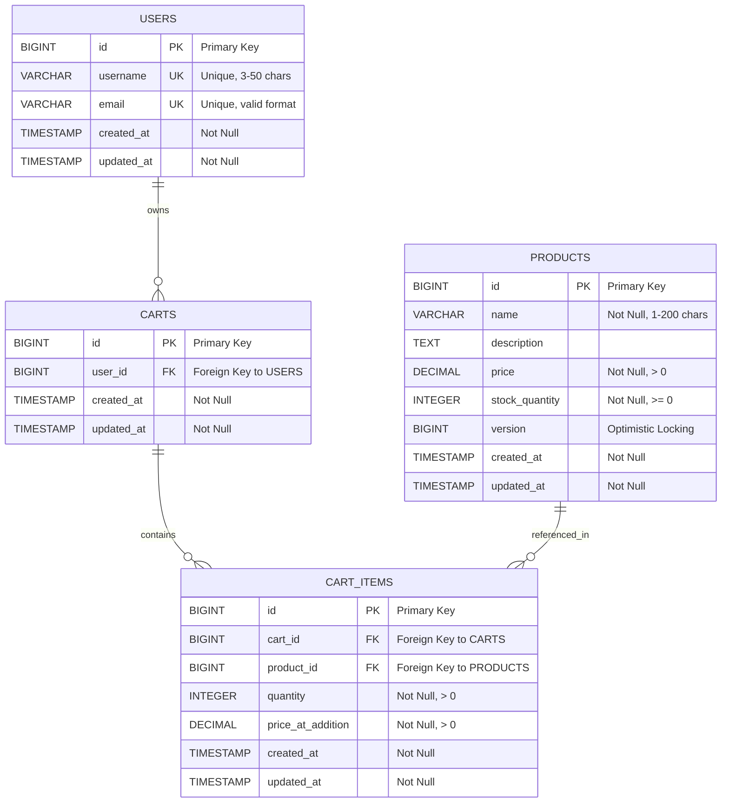
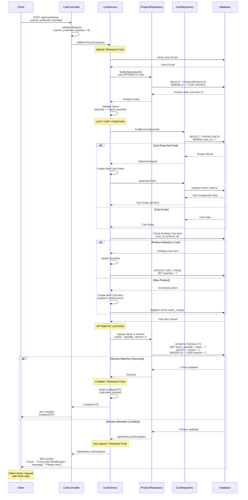

# Low Level Design (LLD) Document - Enhanced
## Shopping Cart System - SCRUM-96

---

## Executive Summary

This Low Level Design document provides comprehensive technical specifications for the Shopping Cart System (SCRUM-96). The system enables users to manage shopping carts with full CRUD operations on cart items, including adding products, updating quantities, and removing items. The design emphasizes data consistency through optimistic locking, lazy cart creation for improved performance, and robust validation mechanisms.

### Key Features:
- **Lazy Cart Creation**: Carts are created only when users add their first item
- **Optimistic Locking**: Prevents race conditions during concurrent product updates
- **Comprehensive Validation**: Ensures data integrity at all layers
- **RESTful API Design**: Standard HTTP methods and status codes
- **Scalable Architecture**: Layered design supporting future enhancements

---

## 1. Domain Entities

### 1.1 User Entity

**Purpose**: Represents system users who can own shopping carts.

**Attributes**:
- `id` (Long): Primary key, auto-generated
- `username` (String): Unique identifier for the user
- `email` (String): User's email address
- `createdAt` (Timestamp): Account creation timestamp
- `updatedAt` (Timestamp): Last update timestamp

**Relationships**:
- One-to-One with Cart (one user can have one active cart)

**Validation Rules**:
- Username: Required, 3-50 characters, alphanumeric with underscores
- Email: Required, valid email format

---

### 1.2 Product Entity

**Purpose**: Represents products available for purchase.

**Attributes**:
- `id` (Long): Primary key, auto-generated
- `name` (String): Product name
- `description` (String): Product description
- `price` (BigDecimal): Product price (precision: 10, scale: 2)
- `stockQuantity` (Integer): Available inventory
- `version` (Long): Optimistic locking version field
- `createdAt` (Timestamp): Product creation timestamp
- `updatedAt` (Timestamp): Last update timestamp

**Relationships**:
- One-to-Many with CartItem (one product can be in multiple cart items)

**Validation Rules**:
- Name: Required, 1-200 characters
- Price: Required, must be positive (> 0)
- Stock Quantity: Required, must be non-negative (>= 0)

**Business Logic**:
- Optimistic locking prevents concurrent stock updates
- Stock validation occurs before adding to cart

---

### 1.3 Cart Entity

**Purpose**: Represents a user's shopping cart.

**Attributes**:
- `id` (Long): Primary key, auto-generated
- `userId` (Long): Foreign key to User entity
- `createdAt` (Timestamp): Cart creation timestamp
- `updatedAt` (Timestamp): Last update timestamp

**Relationships**:
- Many-to-One with User (many carts belong to one user - historical)
- One-to-Many with CartItem (one cart contains multiple items)

**Business Logic**:
- **Lazy Creation**: Cart is created automatically when user adds first item
- Only one active cart per user at a time
- Cascade delete: Removing cart removes all associated cart items

---

### 1.4 CartItem Entity

**Purpose**: Represents individual products within a shopping cart.

**Attributes**:
- `id` (Long): Primary key, auto-generated
- `cartId` (Long): Foreign key to Cart entity
- `productId` (Long): Foreign key to Product entity
- `quantity` (Integer): Number of product units
- `priceAtAddition` (BigDecimal): Product price when added (historical pricing)
- `createdAt` (Timestamp): Item addition timestamp
- `updatedAt` (Timestamp): Last update timestamp

**Relationships**:
- Many-to-One with Cart (many items belong to one cart)
- Many-to-One with Product (many cart items reference one product)

**Validation Rules**:
- Quantity: Required, must be positive (> 0)
- Price at Addition: Required, must be positive (> 0)

**Business Logic**:
- Unique constraint: One product can appear only once per cart
- Quantity updates replace existing quantity (not additive)
- Price captured at addition time for historical accuracy

---

# Technical Artifacts

## Artifact 1: Entity-Relationship Diagram (ERD)

The following Mermaid ERD illustrates the database schema for the Shopping Cart System, showing the relationships between USERS, PRODUCTS, CARTS, and CART_ITEMS entities.



## Artifact 2: Add to Cart Sequence Diagram

The following Mermaid sequence diagram illustrates the complete flow for adding an item to a cart, including lazy cart creation and optimistic locking exception handling.



## Artifact 3: Database Model (PostgreSQL DDL)

The following PostgreSQL DDL scripts define the complete database schema for the Shopping Cart System, including tables, constraints, and indexes.

```sql
-- ============================================
-- Shopping Cart System - Database Schema
-- PostgreSQL DDL Scripts
-- ============================================

-- Drop existing tables (for clean setup)
DROP TABLE IF EXISTS cart_items CASCADE;
DROP TABLE IF EXISTS carts CASCADE;
DROP TABLE IF EXISTS products CASCADE;
DROP TABLE IF EXISTS users CASCADE;

-- ============================================
-- Table: USERS
-- Description: Stores user account information
-- ============================================
CREATE TABLE users (
    id BIGSERIAL PRIMARY KEY,
    username VARCHAR(50) NOT NULL UNIQUE,
    email VARCHAR(255) NOT NULL UNIQUE,
    created_at TIMESTAMP NOT NULL DEFAULT CURRENT_TIMESTAMP,
    updated_at TIMESTAMP NOT NULL DEFAULT CURRENT_TIMESTAMP,
    
    -- Constraints
    CONSTRAINT chk_username_length CHECK (LENGTH(username) >= 3),
    CONSTRAINT chk_email_format CHECK (email ~* '^[A-Za-z0-9._%+-]+@[A-Za-z0-9.-]+\.[A-Za-z]{2,}$')
);

-- ============================================
-- Table: PRODUCTS
-- Description: Stores product catalog information
-- ============================================
CREATE TABLE products (
    id BIGSERIAL PRIMARY KEY,
    name VARCHAR(200) NOT NULL,
    description TEXT,
    price DECIMAL(10, 2) NOT NULL,
    stock_quantity INTEGER NOT NULL,
    version BIGINT NOT NULL DEFAULT 0,
    created_at TIMESTAMP NOT NULL DEFAULT CURRENT_TIMESTAMP,
    updated_at TIMESTAMP NOT NULL DEFAULT CURRENT_TIMESTAMP,
    
    -- Constraints
    CONSTRAINT chk_product_name_length CHECK (LENGTH(name) >= 1),
    CONSTRAINT chk_price_positive CHECK (price > 0),
    CONSTRAINT chk_stock_non_negative CHECK (stock_quantity >= 0)
);

-- ============================================
-- Table: CARTS
-- Description: Stores shopping cart information
-- ============================================
CREATE TABLE carts (
    id BIGSERIAL PRIMARY KEY,
    user_id BIGINT NOT NULL,
    created_at TIMESTAMP NOT NULL DEFAULT CURRENT_TIMESTAMP,
    updated_at TIMESTAMP NOT NULL DEFAULT CURRENT_TIMESTAMP,
    
    -- Foreign Key Constraints
    CONSTRAINT fk_cart_user FOREIGN KEY (user_id) 
        REFERENCES users(id) 
        ON DELETE CASCADE
);

-- ============================================
-- Table: CART_ITEMS
-- Description: Stores individual items within shopping carts
-- ============================================
CREATE TABLE cart_items (
    id BIGSERIAL PRIMARY KEY,
    cart_id BIGINT NOT NULL,
    product_id BIGINT NOT NULL,
    quantity INTEGER NOT NULL,
    price_at_addition DECIMAL(10, 2) NOT NULL,
    created_at TIMESTAMP NOT NULL DEFAULT CURRENT_TIMESTAMP,
    updated_at TIMESTAMP NOT NULL DEFAULT CURRENT_TIMESTAMP,
    
    -- Constraints
    CONSTRAINT chk_quantity_positive CHECK (quantity > 0),
    CONSTRAINT chk_price_at_addition_positive CHECK (price_at_addition > 0),
    
    -- Unique Constraint: One product per cart
    CONSTRAINT uk_cart_product UNIQUE (cart_id, product_id),
    
    -- Foreign Key Constraints
    CONSTRAINT fk_cart_item_cart FOREIGN KEY (cart_id) 
        REFERENCES carts(id) 
        ON DELETE CASCADE,
    
    CONSTRAINT fk_cart_item_product FOREIGN KEY (product_id) 
        REFERENCES products(id) 
        ON DELETE CASCADE
);

-- ============================================
-- INDEXES
-- Description: Performance optimization indexes
-- ============================================

-- Index on CARTS.user_id for fast user cart lookups
CREATE INDEX idx_carts_user_id ON carts(user_id);

-- Index on CART_ITEMS.cart_id for fast cart item retrieval
CREATE INDEX idx_cart_items_cart_id ON cart_items(cart_id);

-- Index on CART_ITEMS.product_id for product reference lookups
CREATE INDEX idx_cart_items_product_id ON cart_items(product_id);

-- Index on PRODUCTS.name for product search operations
CREATE INDEX idx_products_name ON products(name);

-- Index on USERS.username for authentication lookups
CREATE INDEX idx_users_username ON users(username);

-- Index on USERS.email for email-based lookups
CREATE INDEX idx_users_email ON users(email);

-- ============================================
-- TRIGGERS
-- Description: Automatic timestamp updates
-- ============================================

-- Function to update updated_at timestamp
CREATE OR REPLACE FUNCTION update_updated_at_column()
RETURNS TRIGGER AS $$
BEGIN
    NEW.updated_at = CURRENT_TIMESTAMP;
    RETURN NEW;
END;
$$ LANGUAGE plpgsql;

-- Trigger for USERS table
CREATE TRIGGER trg_users_updated_at
    BEFORE UPDATE ON users
    FOR EACH ROW
    EXECUTE FUNCTION update_updated_at_column();

-- Trigger for PRODUCTS table
CREATE TRIGGER trg_products_updated_at
    BEFORE UPDATE ON products
    FOR EACH ROW
    EXECUTE FUNCTION update_updated_at_column();

-- Trigger for CARTS table
CREATE TRIGGER trg_carts_updated_at
    BEFORE UPDATE ON carts
    FOR EACH ROW
    EXECUTE FUNCTION update_updated_at_column();

-- Trigger for CART_ITEMS table
CREATE TRIGGER trg_cart_items_updated_at
    BEFORE UPDATE ON cart_items
    FOR EACH ROW
    EXECUTE FUNCTION update_updated_at_column();

-- ============================================
-- SAMPLE DATA (Optional - for testing)
-- ============================================

-- Insert sample users
INSERT INTO users (username, email) VALUES
    ('john_doe', 'john.doe@example.com'),
    ('jane_smith', 'jane.smith@example.com'),
    ('bob_wilson', 'bob.wilson@example.com');

-- Insert sample products
INSERT INTO products (name, description, price, stock_quantity) VALUES
    ('Laptop', 'High-performance laptop with 16GB RAM', 999.99, 50),
    ('Wireless Mouse', 'Ergonomic wireless mouse with USB receiver', 29.99, 200),
    ('Mechanical Keyboard', 'RGB mechanical keyboard with blue switches', 149.99, 75),
    ('USB-C Hub', '7-in-1 USB-C hub with HDMI and ethernet', 49.99, 150),
    ('Monitor', '27-inch 4K IPS monitor', 399.99, 30);
```

---

## End of Enhanced LLD Document

**Document Version**: 1.1 (Enhanced with Technical Artifacts)  
**Enhancement Date**: 2024-01-15  
**Artifacts Added**: ERD, Sequence Diagram, Database DDL  
**Status**: Complete and Ready for Implementation