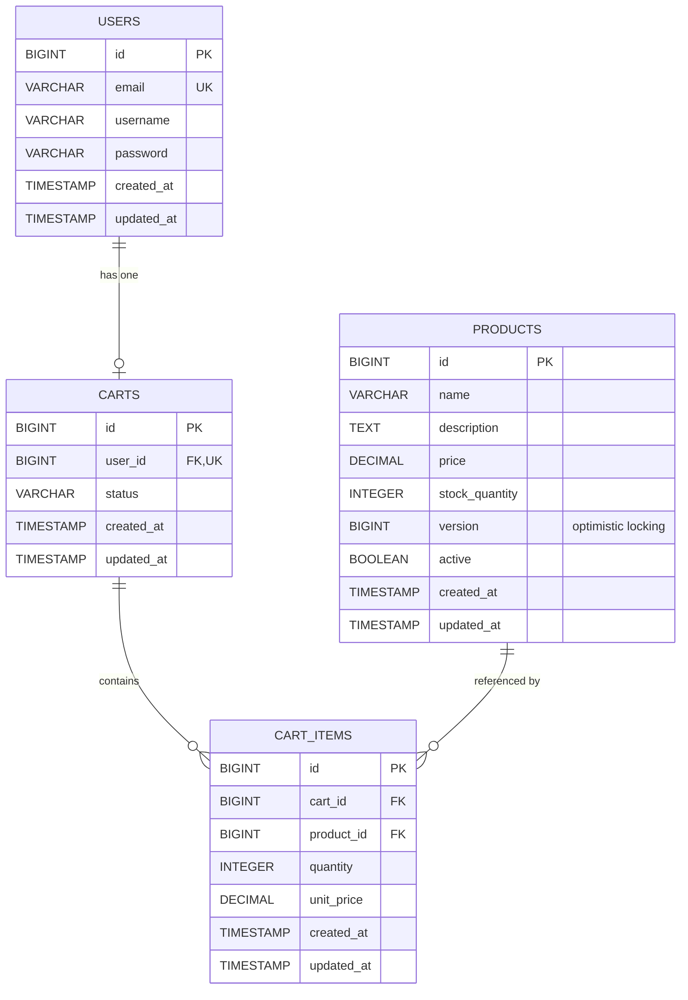
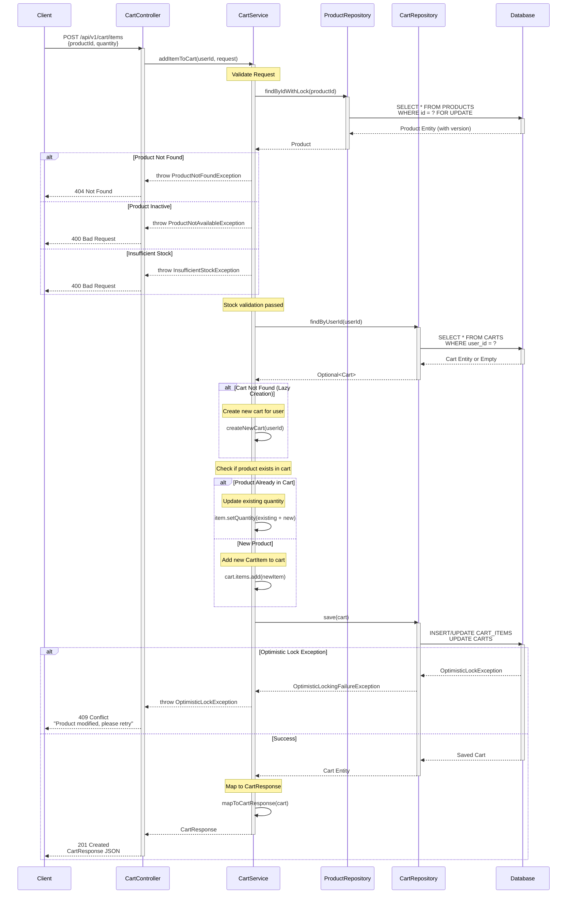

# COMPREHENSIVE BACKEND ENGINEERING SPECIFICATION PACKAGE
## SCRUM-96: Implement Core Shopping Cart Backend Services Using Spring Boot MVC

---

## EXECUTIVE SUMMARY

### Project Overview
This specification document provides a complete backend engineering blueprint for implementing a shopping cart system using Java Spring Boot MVC architecture. The system encompasses user management, product catalog search, and shopping cart lifecycle management with strict business rules and database-first validation.

### Key Highlights
- **Architecture**: Spring Boot MVC (Controller → Service → Repository)
- **Persistence**: Relational database with enforced constraints
- **API Style**: RESTful endpoints
- **Authentication**: Stateless (no session persistence at DB level)
- **Cart Lifecycle**: Lazy creation, auto-deletion on empty, cleanup on logout

### Scope Boundaries
**In Scope:**
- User registration, authentication, and profile management
- Product search functionality
- Shopping cart CRUD operations with business rule enforcement
- Database-level constraint validation

**Out of Scope:**
- Checkout and payment processing
- Inventory locking mechanisms
- Administrative management interfaces
- Password change functionality

### Critical Business Rules
1. **Cart Lifecycle**: Carts are created lazily (only when first product is added) and deleted automatically when empty or on logout
2. **Data Integrity**: All constraints enforced at both service and database levels
3. **Stateless Authentication**: No session data persisted at database level
4. **One-to-One Cart Mapping**: Each user can have at most one active cart

---

## DETAILED ANALYSIS

### 1. FUNCTIONAL DOMAIN IDENTIFICATION

#### Domain 1: User Management
**Purpose**: Handle user lifecycle from registration through authentication and profile management

**Functional Requirements:**
- User registration with unique username constraint
- Authentication using username/password credentials
- Profile viewing (read-only access to user data)
- Profile updates (full name and email only)

**Business Rules:**
- Username must be globally unique
- Username is immutable after creation
- Password changes are explicitly out of scope
- User must exist before any cart operations

**Database Effects:**
- INSERT into users table on registration
- SELECT from users table on authentication and profile view
- UPDATE users table on profile modification

#### Domain 2: Product Catalog
**Purpose**: Enable product discovery through search functionality

**Functional Requirements:**
- Keyword-based product search
- Case-insensitive matching
- Return product details (name, description, price, available quantity)

**Business Rules:**
- Product must exist in database to be searchable
- Price is read-only (cannot be modified through user actions)
- Search operates on product name and description fields

**Database Effects:**
- SELECT from products table with LIKE/ILIKE operations

#### Domain 3: Shopping Cart Management
**Purpose**: Manage cart lifecycle and cart item operations

**Functional Requirements:**
- Lazy cart creation (on first product addition)
- Add products to cart with specified quantity
- Update cart item quantities
- Remove individual products from cart
- View complete cart with totals
- Auto-delete empty carts
- Cart cleanup on user logout

**Business Rules:**
- One active cart per user maximum
- Cart cannot exist without at least one cart item
- Quantity must always be greater than zero
- Cart and all items deleted on logout
- Cart auto-created if missing when adding first product
- Last item removal triggers cart deletion

**Database Effects:**
- INSERT into carts table (lazy creation)
- INSERT into cart_items table (add product)
- UPDATE cart_items table (quantity modification)
- DELETE from cart_items table (remove product)
- DELETE from carts table (when empty or on logout)
- SELECT from carts and cart_items for cart viewing

---

## TECHNICAL ARTIFACTS

### 18.1 Entity-Relationship Diagram (ERD)



### 18.2 Sequence Diagram - Add to Cart Flow



### 18.3 Database Model (SQL DDL)

```sql
-- ============================================
-- PostgreSQL DDL for Shopping Cart System
-- Database: ecommerce
-- Version: 1.0
-- ============================================

-- Drop tables if they exist (for clean setup)
DROP TABLE IF EXISTS cart_items CASCADE;
DROP TABLE IF EXISTS carts CASCADE;
DROP TABLE IF EXISTS products CASCADE;
DROP TABLE IF EXISTS users CASCADE;

-- ============================================
-- Table: USERS
-- Description: Stores user account information
-- ============================================
CREATE TABLE users (
    id BIGSERIAL PRIMARY KEY,
    email VARCHAR(255) NOT NULL UNIQUE,
    username VARCHAR(100) NOT NULL,
    password VARCHAR(255) NOT NULL,
    created_at TIMESTAMP NOT NULL DEFAULT CURRENT_TIMESTAMP,
    updated_at TIMESTAMP NOT NULL DEFAULT CURRENT_TIMESTAMP,
    
    CONSTRAINT users_email_check CHECK (email ~* '^[A-Za-z0-9._%+-]+@[A-Za-z0-9.-]+\.[A-Z|a-z]{2,}$')
);

COMMENT ON TABLE users IS 'User account information';
COMMENT ON COLUMN users.email IS 'Unique email address for user authentication';

-- ============================================
-- Table: PRODUCTS
-- Description: Stores product catalog information
-- ============================================
CREATE TABLE products (
    id BIGSERIAL PRIMARY KEY,
    name VARCHAR(255) NOT NULL,
    description TEXT,
    price DECIMAL(10, 2) NOT NULL,
    stock_quantity INTEGER NOT NULL DEFAULT 0,
    version BIGINT NOT NULL DEFAULT 0,
    active BOOLEAN NOT NULL DEFAULT TRUE,
    created_at TIMESTAMP NOT NULL DEFAULT CURRENT_TIMESTAMP,
    updated_at TIMESTAMP NOT NULL DEFAULT CURRENT_TIMESTAMP,
    
    CONSTRAINT products_price_check CHECK (price > 0),
    CONSTRAINT products_stock_check CHECK (stock_quantity >= 0)
);

COMMENT ON TABLE products IS 'Product catalog with inventory management';
COMMENT ON COLUMN products.version IS 'Version number for optimistic locking on stock updates';
COMMENT ON COLUMN products.stock_quantity IS 'Available inventory quantity';
COMMENT ON COLUMN products.active IS 'Product availability status';

-- ============================================
-- Table: CARTS
-- Description: Stores shopping cart information
-- ============================================
CREATE TABLE carts (
    id BIGSERIAL PRIMARY KEY,
    user_id BIGINT NOT NULL UNIQUE,
    status VARCHAR(20) NOT NULL DEFAULT 'ACTIVE',
    created_at TIMESTAMP NOT NULL DEFAULT CURRENT_TIMESTAMP,
    updated_at TIMESTAMP NOT NULL DEFAULT CURRENT_TIMESTAMP,
    
    CONSTRAINT fk_carts_user FOREIGN KEY (user_id) 
        REFERENCES users(id) 
        ON DELETE CASCADE 
        ON UPDATE CASCADE,
    
    CONSTRAINT carts_status_check CHECK (status IN ('ACTIVE', 'ABANDONED', 'CONVERTED'))
);

COMMENT ON TABLE carts IS 'Shopping carts for users';
COMMENT ON COLUMN carts.user_id IS 'Foreign key to users table (one cart per user)';
COMMENT ON COLUMN carts.status IS 'Cart status: ACTIVE, ABANDONED, or CONVERTED';

-- ============================================
-- Table: CART_ITEMS
-- Description: Stores individual items in shopping carts
-- ============================================
CREATE TABLE cart_items (
    id BIGSERIAL PRIMARY KEY,
    cart_id BIGINT NOT NULL,
    product_id BIGINT NOT NULL,
    quantity INTEGER NOT NULL,
    unit_price DECIMAL(10, 2) NOT NULL,
    created_at TIMESTAMP NOT NULL DEFAULT CURRENT_TIMESTAMP,
    updated_at TIMESTAMP NOT NULL DEFAULT CURRENT_TIMESTAMP,
    
    CONSTRAINT fk_cart_items_cart FOREIGN KEY (cart_id) 
        REFERENCES carts(id) 
        ON DELETE CASCADE 
        ON UPDATE CASCADE,
    
    CONSTRAINT fk_cart_items_product FOREIGN KEY (product_id) 
        REFERENCES products(id) 
        ON DELETE RESTRICT 
        ON UPDATE CASCADE,
    
    CONSTRAINT cart_items_quantity_check CHECK (quantity > 0),
    CONSTRAINT cart_items_unit_price_check CHECK (unit_price > 0),
    CONSTRAINT cart_items_unique_product UNIQUE (cart_id, product_id)
);

COMMENT ON TABLE cart_items IS 'Individual items within shopping carts';
COMMENT ON COLUMN cart_items.cart_id IS 'Foreign key to carts table';
COMMENT ON COLUMN cart_items.product_id IS 'Foreign key to products table';
COMMENT ON COLUMN cart_items.quantity IS 'Quantity of product in cart (must be > 0)';
COMMENT ON COLUMN cart_items.unit_price IS 'Price per unit at time of adding to cart';

-- ============================================
-- INDEXES
-- Description: Performance optimization indexes
-- ============================================

-- Index on users email for fast authentication lookups
CREATE INDEX idx_users_email ON users(email);

-- Index on products for active product queries
CREATE INDEX idx_products_active ON products(active) WHERE active = TRUE;

-- Index on products name for search functionality
CREATE INDEX idx_products_name ON products(name);

-- Index on carts user_id for fast cart retrieval (already unique, but explicit)
CREATE INDEX idx_carts_user_id ON carts(user_id);

-- Index on carts status for filtering by cart status
CREATE INDEX idx_carts_status ON carts(status);

-- Index on cart_items cart_id for fast item retrieval
CREATE INDEX idx_cart_items_cart_id ON cart_items(cart_id);

-- Index on cart_items product_id for product reference lookups
CREATE INDEX idx_cart_items_product_id ON cart_items(product_id);

-- Composite index for checking product existence in cart
CREATE INDEX idx_cart_items_cart_product ON cart_items(cart_id, product_id);

-- ============================================
-- TRIGGERS
-- Description: Automatic timestamp updates
-- ============================================

-- Function to update updated_at timestamp
CREATE OR REPLACE FUNCTION update_updated_at_column()
RETURNS TRIGGER AS $$
BEGIN
    NEW.updated_at = CURRENT_TIMESTAMP;
    RETURN NEW;
END;
$$ LANGUAGE plpgsql;

-- Trigger for users table
CREATE TRIGGER update_users_updated_at
    BEFORE UPDATE ON users
    FOR EACH ROW
    EXECUTE FUNCTION update_updated_at_column();

-- Trigger for products table
CREATE TRIGGER update_products_updated_at
    BEFORE UPDATE ON products
    FOR EACH ROW
    EXECUTE FUNCTION update_updated_at_column();

-- Trigger for carts table
CREATE TRIGGER update_carts_updated_at
    BEFORE UPDATE ON carts
    FOR EACH ROW
    EXECUTE FUNCTION update_updated_at_column();

-- Trigger for cart_items table
CREATE TRIGGER update_cart_items_updated_at
    BEFORE UPDATE ON cart_items
    FOR EACH ROW
    EXECUTE FUNCTION update_updated_at_column();

-- ============================================
-- SAMPLE DATA (Optional - for testing)
-- ============================================

-- Insert sample users
INSERT INTO users (email, username, password) VALUES
('john.doe@example.com', 'johndoe', '$2a$10$encrypted_password_hash_1'),
('jane.smith@example.com', 'janesmith', '$2a$10$encrypted_password_hash_2'),
('bob.wilson@example.com', 'bobwilson', '$2a$10$encrypted_password_hash_3');

-- Insert sample products
INSERT INTO products (name, description, price, stock_quantity, active) VALUES
('Laptop Pro 15', 'High-performance laptop with 16GB RAM', 1299.99, 50, TRUE),
('Wireless Mouse', 'Ergonomic wireless mouse with USB receiver', 29.99, 200, TRUE),
('USB-C Hub', '7-in-1 USB-C hub with HDMI and card reader', 49.99, 150, TRUE),
('Mechanical Keyboard', 'RGB mechanical keyboard with blue switches', 89.99, 75, TRUE),
('Monitor 27"', '4K UHD monitor with HDR support', 399.99, 30, TRUE);

-- Insert sample carts
INSERT INTO carts (user_id, status) VALUES
(1, 'ACTIVE'),
(2, 'ACTIVE');

-- Insert sample cart items
INSERT INTO cart_items (cart_id, product_id, quantity, unit_price) VALUES
(1, 1, 1, 1299.99),  -- John's cart: 1 Laptop
(1, 2, 2, 29.99),    -- John's cart: 2 Wireless Mice
(1, 3, 1, 49.99),    -- John's cart: 1 USB-C Hub
(2, 5, 1, 399.99);   -- Jane's cart: 1 Monitor

-- ============================================
-- END OF DDL SCRIPT
-- ============================================
```