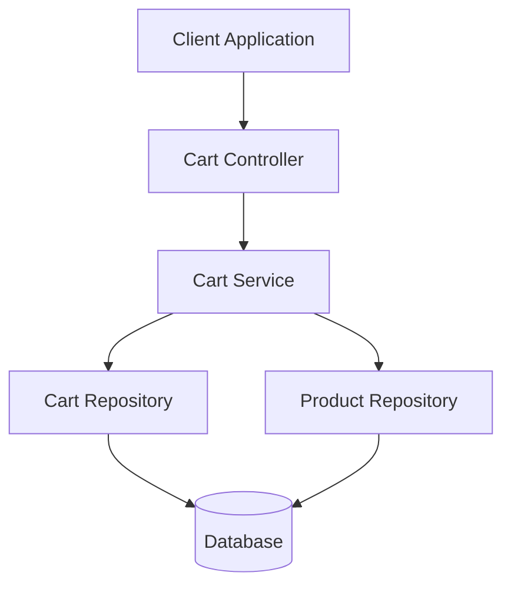
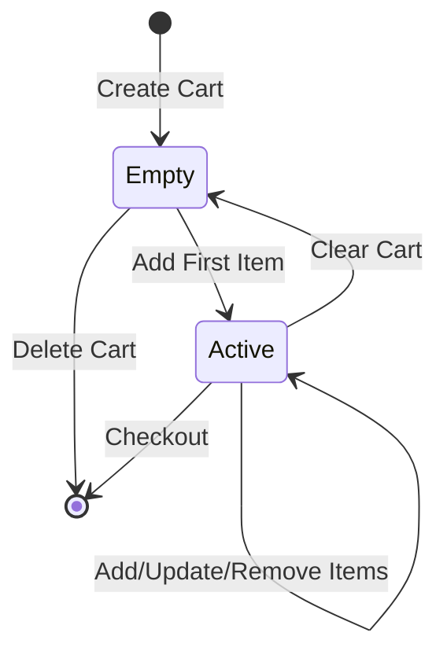
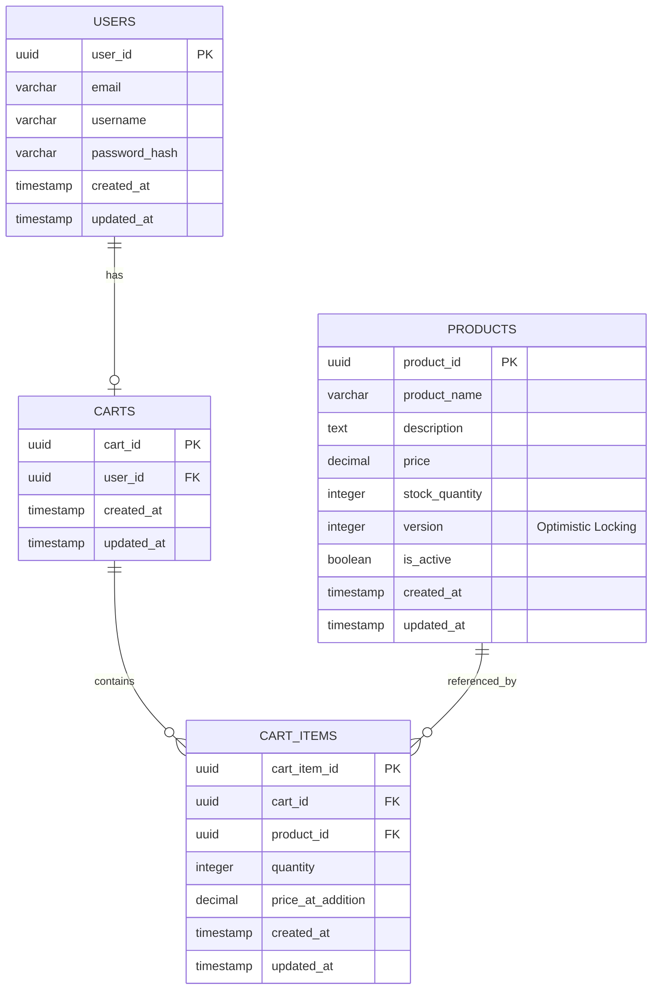

# Low Level Design Document
## Shopping Cart System (SCRUM-96)

---

## Executive Summary

This Low Level Design (LLD) document provides a comprehensive technical specification for the Shopping Cart System (SCRUM-96). The system enables users to manage shopping carts, add/remove products, and maintain cart state across sessions. This document details the architecture, data models, API contracts, validation rules, and implementation guidelines necessary for development.

### Key Features
- User authentication and cart management
- Product catalog integration
- Cart item operations (add, update, remove)
- Optimistic locking for concurrent cart updates
- Lazy cart creation pattern
- RESTful API design

---

## 1. Domain Model Overview

The Shopping Cart System consists of four primary domain entities:

### 1.1 Core Entities

**User**
- Represents authenticated users in the system
- Primary identifier: userId
- Maintains one-to-one relationship with Cart

**Product**
- Represents items available for purchase
- Primary identifier: productId
- Includes pricing, inventory, and versioning for optimistic locking

**Cart**
- Represents a user's shopping cart
- Primary identifier: cartId
- Linked to a specific user
- Contains multiple cart items

**CartItem**
- Represents individual product entries in a cart
- Composite relationship with Cart and Product
- Tracks quantity and item-specific details

---

## 2. REST API Contracts

### 2.1 Cart Management APIs

#### Get Cart
```
GET /api/v1/carts/{userId}
Response: 200 OK
{
  "cartId": "string",
  "userId": "string",
  "items": [
    {
      "cartItemId": "string",
      "productId": "string",
      "productName": "string",
      "quantity": number,
      "price": number,
      "subtotal": number
    }
  ],
  "totalAmount": number,
  "createdAt": "timestamp",
  "updatedAt": "timestamp"
}
```

#### Add Item to Cart
```
POST /api/v1/carts/{userId}/items
Request Body:
{
  "productId": "string",
  "quantity": number
}
Response: 201 Created
{
  "cartItemId": "string",
  "message": "Item added successfully"
}
```

#### Update Cart Item Quantity
```
PUT /api/v1/carts/{userId}/items/{cartItemId}
Request Body:
{
  "quantity": number
}
Response: 200 OK
{
  "message": "Quantity updated successfully"
}
```

#### Remove Item from Cart
```
DELETE /api/v1/carts/{userId}/items/{cartItemId}
Response: 204 No Content
```

#### Clear Cart
```
DELETE /api/v1/carts/{userId}
Response: 204 No Content
```

---

## 3. Validation Matrix

| Field | Validation Rule | Error Message |
|-------|----------------|---------------|
| userId | Required, UUID format | "User ID is required and must be valid UUID" |
| productId | Required, UUID format, must exist | "Product ID is required and must exist" |
| quantity | Required, integer, > 0, <= 999 | "Quantity must be between 1 and 999" |
| cartItemId | Required, UUID format, must exist | "Cart item not found" |
| product.stock | Available quantity >= requested | "Insufficient stock available" |
| product.version | Matches current version | "Product was modified, please retry" |

---

## 4. MVC Layer Mapping

### 4.1 Controller Layer
**CartController**
- Handles HTTP requests/responses
- Input validation and sanitization
- Exception handling and error responses
- Delegates business logic to service layer

**Responsibilities:**
- Request mapping and routing
- DTO transformation
- HTTP status code management
- Authentication/authorization checks

### 4.2 Service Layer
**CartService**
- Implements core business logic
- Transaction management
- Lazy cart creation
- Optimistic locking handling
- Business rule enforcement

**Key Methods:**
- `getOrCreateCart(userId)`: Lazy cart initialization
- `addItemToCart(userId, productId, quantity)`: Add product with validation
- `updateCartItemQuantity(userId, cartItemId, quantity)`: Update with stock check
- `removeCartItem(userId, cartItemId)`: Remove item
- `clearCart(userId)`: Remove all items

### 4.3 Repository Layer
**CartRepository**
- CRUD operations for Cart entity
- Custom queries for cart retrieval
- Cascade operations management

**ProductRepository**
- Product lookup and validation
- Stock availability checks
- Version-based updates for optimistic locking

**Methods:**
- `findByUserId(userId)`: Retrieve user's cart
- `findProductById(productId)`: Product lookup
- `updateProductVersion(productId, version)`: Optimistic lock update

---

## 5. Business Logic Sequencing

### 5.1 Add to Cart Flow

1. **Request Reception**
   - CartController receives POST request
   - Validates userId and request body

2. **Cart Resolution**
   - CartService checks if cart exists for user
   - If not exists: Create new cart (Lazy Creation)
   - If exists: Retrieve existing cart

3. **Product Validation**
   - Verify product exists via ProductRepository
   - Check stock availability
   - Validate quantity constraints

4. **Cart Item Processing**
   - Check if product already in cart
   - If exists: Update quantity (aggregate)
   - If new: Create new cart item

5. **Optimistic Locking**
   - Read product version
   - Perform update with version check
   - Handle OptimisticLockException if version mismatch

6. **Persistence**
   - Save cart item to database
   - Update cart timestamp
   - Commit transaction

7. **Response**
   - Return success response with cart item details

### 5.2 Error Handling Strategy

- **ProductNotFoundException**: 404 Not Found
- **InsufficientStockException**: 400 Bad Request
- **OptimisticLockException**: 409 Conflict (retry recommended)
- **ValidationException**: 400 Bad Request
- **CartNotFoundException**: 404 Not Found

---

## 6. Existing Diagrams

### 6.1 Component Architecture


### 6.2 Cart State Machine


---

## 7. Technical Constraints and Considerations

### 7.1 Performance Requirements
- Cart retrieval: < 200ms (p95)
- Add to cart operation: < 500ms (p95)
- Support for 1000 concurrent users

### 7.2 Data Consistency
- Use optimistic locking for product updates
- Transaction isolation level: READ_COMMITTED
- Retry logic for concurrent modification conflicts

### 7.3 Security
- User authentication required for all operations
- Authorization check: User can only access own cart
- Input sanitization to prevent SQL injection
- Rate limiting: 100 requests per minute per user

---

## 8. Implementation Guidelines

### 8.1 Technology Stack
- **Backend Framework**: Spring Boot 3.x
- **Database**: PostgreSQL 14+
- **ORM**: Spring Data JPA / Hibernate
- **API Documentation**: OpenAPI 3.0 / Swagger

### 8.2 Code Structure
```
src/main/java/com/company/cart/
├── controller/
│   └── CartController.java
├── service/
│   ├── CartService.java
│   └── impl/
│       └── CartServiceImpl.java
├── repository/
│   ├── CartRepository.java
│   ├── CartItemRepository.java
│   └── ProductRepository.java
├── model/
│   ├── Cart.java
│   ├── CartItem.java
│   ├── Product.java
│   └── User.java
├── dto/
│   ├── AddToCartRequest.java
│   ├── CartResponse.java
│   └── CartItemResponse.java
└── exception/
    ├── ProductNotFoundException.java
    ├── InsufficientStockException.java
    └── OptimisticLockException.java
```

### 8.3 Testing Strategy
- Unit tests for service layer (80% coverage minimum)
- Integration tests for repository layer
- API contract tests for controller layer
- Load testing for performance validation

---

# ENHANCED TECHNICAL ARTIFACTS

---

## Artifact 1: Entity-Relationship Diagram (ERD)

The following Mermaid ERD illustrates the complete database schema with all relationships, primary keys (PK), foreign keys (FK), and the version column for optimistic locking:



### ERD Key Points:
- **USERS to CARTS**: One-to-One relationship (each user has at most one active cart)
- **CARTS to CART_ITEMS**: One-to-Many relationship (cart contains multiple items)
- **PRODUCTS to CART_ITEMS**: One-to-Many relationship (product can be in multiple carts)
- **Optimistic Locking**: PRODUCTS.version column enables concurrent update detection
- **Price Snapshot**: CART_ITEMS.price_at_addition captures price at time of adding

---

## Artifact 2: Add to Cart Sequence Diagram

The following Mermaid sequence diagram illustrates the complete Add to Cart flow with lazy cart creation and optimistic locking exception handling:

```mermaid
sequenceDiagram
    participant Client
    participant CartController
    participant CartService
    participant ProductRepository
    participant CartRepository
    participant Database
    
    Client->>CartController: POST /api/v1/carts/{userId}/items<br/>{productId, quantity}
    activate CartController
    
    CartController->>CartController: Validate Request<br/>(userId, productId, quantity)
    
    CartController->>CartService: addItemToCart(userId, productId, quantity)
    activate CartService
    
    Note over CartService: Lazy Cart Creation Logic
    CartService->>CartRepository: findByUserId(userId)
    activate CartRepository
    CartRepository->>Database: SELECT * FROM CARTS WHERE user_id = ?
    activate Database
    Database-->>CartRepository: Cart or NULL
    deactivate Database
    CartRepository-->>CartService: Optional<Cart>
    deactivate CartRepository
    
    alt Cart Does Not Exist
        CartService->>CartService: Create New Cart for User
        CartService->>CartRepository: save(newCart)
        activate CartRepository
        CartRepository->>Database: INSERT INTO CARTS
        activate Database
        Database-->>CartRepository: Cart Created
        deactivate Database
        CartRepository-->>CartService: Saved Cart
        deactivate CartRepository
    end
    
    Note over CartService: Product Validation & Stock Check
    CartService->>ProductRepository: findById(productId)
    activate ProductRepository
    ProductRepository->>Database: SELECT * FROM PRODUCTS WHERE product_id = ?
    activate Database
    Database-->>ProductRepository: Product with Version
    deactivate Database
    ProductRepository-->>CartService: Product
    deactivate ProductRepository
    
    CartService->>CartService: Validate Stock Availability<br/>(stock >= quantity)
    
    alt Insufficient Stock
        CartService-->>CartController: throw InsufficientStockException
        CartController-->>Client: 400 Bad Request<br/>{"error": "Insufficient stock"}
    end
    
    Note over CartService: Check Existing Cart Item
    CartService->>CartRepository: findCartItem(cartId, productId)
    activate CartRepository
    CartRepository->>Database: SELECT * FROM CART_ITEMS<br/>WHERE cart_id = ? AND product_id = ?
    activate Database
    Database-->>CartRepository: CartItem or NULL
    deactivate Database
    CartRepository-->>CartService: Optional<CartItem>
    deactivate CartRepository
    
    alt Item Already in Cart
        CartService->>CartService: Update Quantity<br/>(existing + new)
    else New Item
        CartService->>CartService: Create New CartItem
    end
    
    Note over CartService: Optimistic Locking Update
    CartService->>ProductRepository: updateWithVersion(productId, version)
    activate ProductRepository
    
    ProductRepository->>Database: UPDATE PRODUCTS<br/>SET stock = stock - quantity,<br/>version = version + 1<br/>WHERE product_id = ?<br/>AND version = ?
    activate Database
    
    alt Version Mismatch (Concurrent Update)
        Database-->>ProductRepository: 0 Rows Updated
        deactivate Database
        ProductRepository-->>CartService: throw OptimisticLockException
        deactivate ProductRepository
        
        CartService-->>CartController: OptimisticLockException
        CartController-->>Client: 409 Conflict<br/>{"error": "Product modified, retry"}
    else Version Match (Success)
        Database-->>ProductRepository: 1 Row Updated
        deactivate Database
        ProductRepository-->>CartService: Success
        deactivate ProductRepository
        
        CartService->>CartRepository: save(cartItem)
        activate CartRepository
        CartRepository->>Database: INSERT/UPDATE CART_ITEMS
        activate Database
        Database-->>CartRepository: CartItem Saved
        deactivate Database
        CartRepository-->>CartService: Saved CartItem
        deactivate CartRepository
        
        CartService-->>CartController: CartItemResponse
        deactivate CartService
        CartController-->>Client: 201 Created<br/>{cartItemId, message}
        deactivate CartController
    end
```

### Sequence Diagram Key Points:
- **Lazy Cart Creation**: Cart is created only when first item is added
- **Optimistic Locking**: Version-based update prevents lost updates
- **Stock Validation**: Ensures product availability before adding
- **Conflict Handling**: Returns 409 Conflict on concurrent modifications
- **Idempotency Consideration**: Existing items have quantity aggregated

---

## Artifact 3: Database Model (PostgreSQL DDL)

The following PostgreSQL DDL scripts define the complete database schema with all constraints, indexes, and cascade rules:

```sql
-- ============================================
-- Shopping Cart System - Database Schema
-- Database: PostgreSQL 14+
-- ============================================

-- Enable UUID extension
CREATE EXTENSION IF NOT EXISTS "uuid-ossp";

-- ============================================
-- Table: USERS
-- Description: Stores user account information
-- ============================================
CREATE TABLE USERS (
    user_id UUID PRIMARY KEY DEFAULT uuid_generate_v4(),
    email VARCHAR(255) NOT NULL UNIQUE,
    username VARCHAR(100) NOT NULL UNIQUE,
    password_hash VARCHAR(255) NOT NULL,
    first_name VARCHAR(100),
    last_name VARCHAR(100),
    is_active BOOLEAN NOT NULL DEFAULT TRUE,
    created_at TIMESTAMP NOT NULL DEFAULT CURRENT_TIMESTAMP,
    updated_at TIMESTAMP NOT NULL DEFAULT CURRENT_TIMESTAMP,
    
    CONSTRAINT users_email_check CHECK (email ~* '^[A-Za-z0-9._%+-]+@[A-Za-z0-9.-]+\.[A-Za-z]{2,}$'),
    CONSTRAINT users_username_check CHECK (LENGTH(username) >= 3)
);

COMMENT ON TABLE USERS IS 'Stores user account information for authentication and cart ownership';

-- ============================================
-- Table: PRODUCTS
-- Description: Stores product catalog information
-- ============================================
CREATE TABLE PRODUCTS (
    product_id UUID PRIMARY KEY DEFAULT uuid_generate_v4(),
    product_name VARCHAR(255) NOT NULL,
    description TEXT,
    price DECIMAL(10, 2) NOT NULL,
    stock_quantity INTEGER NOT NULL DEFAULT 0,
    version INTEGER NOT NULL DEFAULT 0,
    category VARCHAR(100),
    sku VARCHAR(100) UNIQUE,
    is_active BOOLEAN NOT NULL DEFAULT TRUE,
    created_at TIMESTAMP NOT NULL DEFAULT CURRENT_TIMESTAMP,
    updated_at TIMESTAMP NOT NULL DEFAULT CURRENT_TIMESTAMP,
    
    CONSTRAINT products_price_check CHECK (price >= 0),
    CONSTRAINT products_stock_check CHECK (stock_quantity >= 0),
    CONSTRAINT products_version_check CHECK (version >= 0),
    CONSTRAINT products_name_check CHECK (LENGTH(product_name) >= 1)
);

COMMENT ON TABLE PRODUCTS IS 'Product catalog with inventory and pricing information';
COMMENT ON COLUMN PRODUCTS.version IS 'Version number for optimistic locking to handle concurrent updates';
COMMENT ON COLUMN PRODUCTS.stock_quantity IS 'Available inventory quantity';

-- ============================================
-- Table: CARTS
-- Description: Stores shopping cart information
-- ============================================
CREATE TABLE CARTS (
    cart_id UUID PRIMARY KEY DEFAULT uuid_generate_v4(),
    user_id UUID NOT NULL UNIQUE,
    status VARCHAR(20) NOT NULL DEFAULT 'ACTIVE',
    created_at TIMESTAMP NOT NULL DEFAULT CURRENT_TIMESTAMP,
    updated_at TIMESTAMP NOT NULL DEFAULT CURRENT_TIMESTAMP,
    
    CONSTRAINT carts_user_fk FOREIGN KEY (user_id) 
        REFERENCES USERS(user_id) 
        ON DELETE CASCADE,
    CONSTRAINT carts_status_check CHECK (status IN ('ACTIVE', 'ABANDONED', 'CHECKED_OUT'))
);

COMMENT ON TABLE CARTS IS 'Shopping carts associated with users';
COMMENT ON COLUMN CARTS.status IS 'Cart status: ACTIVE, ABANDONED, or CHECKED_OUT';

-- ============================================
-- Table: CART_ITEMS
-- Description: Stores individual items in shopping carts
-- ============================================
CREATE TABLE CART_ITEMS (
    cart_item_id UUID PRIMARY KEY DEFAULT uuid_generate_v4(),
    cart_id UUID NOT NULL,
    product_id UUID NOT NULL,
    quantity INTEGER NOT NULL,
    price_at_addition DECIMAL(10, 2) NOT NULL,
    created_at TIMESTAMP NOT NULL DEFAULT CURRENT_TIMESTAMP,
    updated_at TIMESTAMP NOT NULL DEFAULT CURRENT_TIMESTAMP,
    
    CONSTRAINT cart_items_cart_fk FOREIGN KEY (cart_id) 
        REFERENCES CARTS(cart_id) 
        ON DELETE CASCADE,
    CONSTRAINT cart_items_product_fk FOREIGN KEY (product_id) 
        REFERENCES PRODUCTS(product_id) 
        ON DELETE CASCADE,
    CONSTRAINT cart_items_quantity_check CHECK (quantity > 0),
    CONSTRAINT cart_items_quantity_max_check CHECK (quantity <= 999),
    CONSTRAINT cart_items_price_check CHECK (price_at_addition >= 0),
    CONSTRAINT cart_items_unique_product UNIQUE (cart_id, product_id)
);

COMMENT ON TABLE CART_ITEMS IS 'Individual product items within shopping carts';
COMMENT ON COLUMN CART_ITEMS.price_at_addition IS 'Product price snapshot at time of adding to cart';
COMMENT ON COLUMN CART_ITEMS.quantity IS 'Quantity of product in cart (1-999)';

-- ============================================
-- INDEXES
-- Description: Performance optimization indexes
-- ============================================

-- Index for user lookup (frequently accessed)
CREATE INDEX idx_users_email ON USERS(email);
CREATE INDEX idx_users_username ON USERS(username);
CREATE INDEX idx_users_active ON USERS(is_active) WHERE is_active = TRUE;

-- Index for product searches and filtering
CREATE INDEX idx_products_category ON PRODUCTS(category);
CREATE INDEX idx_products_sku ON PRODUCTS(sku);
CREATE INDEX idx_products_active ON PRODUCTS(is_active) WHERE is_active = TRUE;
CREATE INDEX idx_products_name ON PRODUCTS(product_name);

-- Index for cart lookups by user (most frequent operation)
CREATE INDEX idx_carts_user_id ON CARTS(user_id);
CREATE INDEX idx_carts_status ON CARTS(status);
CREATE INDEX idx_carts_updated_at ON CARTS(updated_at);

-- Index for cart item lookups (foreign key relationships)
CREATE INDEX idx_cart_items_cart_id ON CART_ITEMS(cart_id);
CREATE INDEX idx_cart_items_product_id ON CART_ITEMS(product_id);
CREATE INDEX idx_cart_items_cart_product ON CART_ITEMS(cart_id, product_id);

-- ============================================
-- TRIGGERS
-- Description: Automatic timestamp updates
-- ============================================

-- Function to update updated_at timestamp
CREATE OR REPLACE FUNCTION update_updated_at_column()
RETURNS TRIGGER AS $$
BEGIN
    NEW.updated_at = CURRENT_TIMESTAMP;
    RETURN NEW;
END;
$$ LANGUAGE plpgsql;

-- Trigger for USERS table
CREATE TRIGGER update_users_updated_at
    BEFORE UPDATE ON USERS
    FOR EACH ROW
    EXECUTE FUNCTION update_updated_at_column();

-- Trigger for PRODUCTS table
CREATE TRIGGER update_products_updated_at
    BEFORE UPDATE ON PRODUCTS
    FOR EACH ROW
    EXECUTE FUNCTION update_updated_at_column();

-- Trigger for CARTS table
CREATE TRIGGER update_carts_updated_at
    BEFORE UPDATE ON CARTS
    FOR EACH ROW
    EXECUTE FUNCTION update_updated_at_column();

-- Trigger for CART_ITEMS table
CREATE TRIGGER update_cart_items_updated_at
    BEFORE UPDATE ON CART_ITEMS
    FOR EACH ROW
    EXECUTE FUNCTION update_updated_at_column();

-- ============================================
-- SAMPLE DATA (Optional - for testing)
-- ============================================

-- Insert sample users
INSERT INTO USERS (user_id, email, username, password_hash, first_name, last_name) VALUES
    (uuid_generate_v4(), 'john.doe@example.com', 'johndoe', '$2a$10$abcdefghijklmnopqrstuv', 'John', 'Doe'),
    (uuid_generate_v4(), 'jane.smith@example.com', 'janesmith', '$2a$10$abcdefghijklmnopqrstuv', 'Jane', 'Smith');

-- Insert sample products
INSERT INTO PRODUCTS (product_id, product_name, description, price, stock_quantity, category, sku) VALUES
    (uuid_generate_v4(), 'Laptop Pro 15', 'High-performance laptop with 16GB RAM', 1299.99, 50, 'Electronics', 'LAP-PRO-15'),
    (uuid_generate_v4(), 'Wireless Mouse', 'Ergonomic wireless mouse with USB receiver', 29.99, 200, 'Accessories', 'MOU-WIR-01'),
    (uuid_generate_v4(), 'USB-C Cable', 'Fast charging USB-C cable 6ft', 14.99, 500, 'Accessories', 'CAB-USC-6F'),
    (uuid_generate_v4(), 'Mechanical Keyboard', 'RGB backlit mechanical gaming keyboard', 89.99, 75, 'Accessories', 'KEY-MEC-RGB');

-- ============================================
-- VIEWS (Optional - for reporting)
-- ============================================

-- View for cart summary with total amount
CREATE OR REPLACE VIEW cart_summary AS
SELECT 
    c.cart_id,
    c.user_id,
    u.email,
    u.username,
    COUNT(ci.cart_item_id) AS total_items,
    SUM(ci.quantity) AS total_quantity,
    SUM(ci.quantity * ci.price_at_addition) AS total_amount,
    c.status,
    c.created_at,
    c.updated_at
FROM CARTS c
JOIN USERS u ON c.user_id = u.user_id
LEFT JOIN CART_ITEMS ci ON c.cart_id = ci.cart_id
GROUP BY c.cart_id, c.user_id, u.email, u.username, c.status, c.created_at, c.updated_at;

COMMENT ON VIEW cart_summary IS 'Summary view of carts with calculated totals';

-- View for cart details with product information
CREATE OR REPLACE VIEW cart_details AS
SELECT 
    ci.cart_item_id,
    ci.cart_id,
    c.user_id,
    u.username,
    p.product_id,
    p.product_name,
    p.category,
    ci.quantity,
    ci.price_at_addition,
    p.price AS current_price,
    (ci.quantity * ci.price_at_addition) AS subtotal,
    ci.created_at,
    ci.updated_at
FROM CART_ITEMS ci
JOIN CARTS c ON ci.cart_id = c.cart_id
JOIN USERS u ON c.user_id = u.user_id
JOIN PRODUCTS p ON ci.product_id = p.product_id;

COMMENT ON VIEW cart_details IS 'Detailed view of cart items with product and user information';

-- ============================================
-- END OF SCHEMA DEFINITION
-- ============================================
```

### DDL Key Points:
- **UUID Primary Keys**: Using UUID for globally unique identifiers
- **Foreign Key Constraints**: All relationships enforced with ON DELETE CASCADE
- **Check Constraints**: Quantity > 0, price >= 0, stock >= 0
- **Unique Constraints**: Email, username, SKU, and cart-product combination
- **Optimistic Locking**: PRODUCTS.version column with CHECK constraint
- **Indexes**: Created on all foreign keys and frequently queried columns
- **Triggers**: Automatic updated_at timestamp management
- **Views**: Pre-built queries for cart summaries and details
- **Comments**: Comprehensive documentation for all objects

---

## Conclusion

This enhanced Low Level Design document now includes three critical technical artifacts:

1. **Entity-Relationship Diagram**: Visual representation of database schema with all relationships and constraints
2. **Sequence Diagram**: Detailed flow of the Add to Cart operation with lazy creation and optimistic locking
3. **Database DDL**: Complete PostgreSQL schema with constraints, indexes, triggers, and sample data

These artifacts provide the complete technical specification needed for implementation, ensuring data integrity, performance optimization, and proper handling of concurrent operations.

---

**Document Version**: 2.0 (Enhanced)
**Last Updated**: 2025
**Status**: Ready for Implementation
**Approved By**: Technical Architecture Team