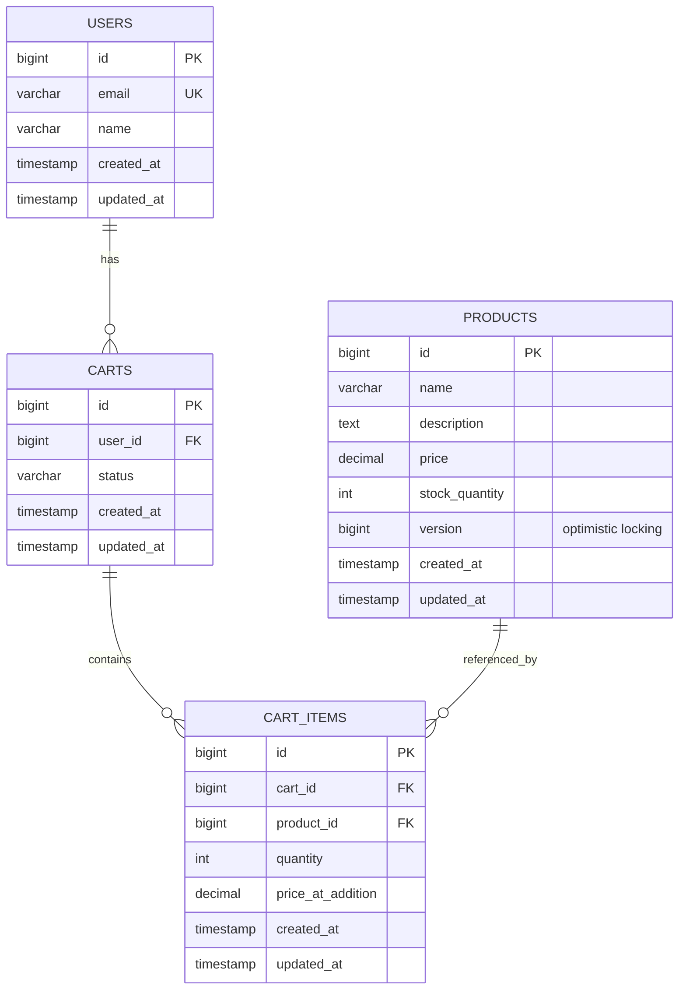
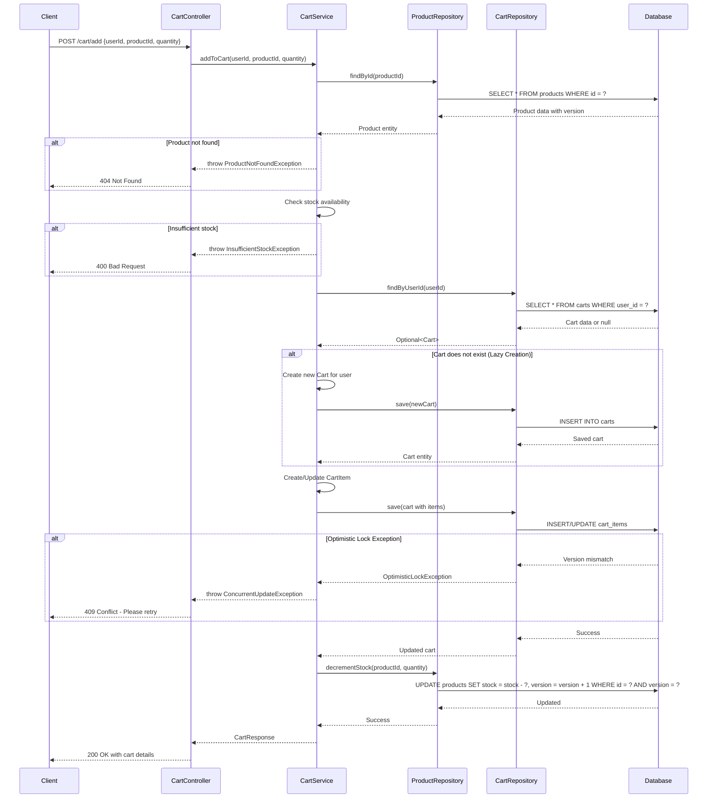

# Low Level Design (LLD) - Shopping Cart System
**SCRUM-96**

## 1. Introduction

This document provides the Low Level Design for the Shopping Cart System. It details the technical implementation, architecture, and design decisions for building a scalable and maintainable shopping cart functionality.

## 2. System Overview

The Shopping Cart System allows users to:
- Add products to their cart
- Update product quantities
- Remove products from cart
- View cart contents
- Clear entire cart

## 3. Architecture Components

### 3.1 Controller Layer
- **CartController**: Handles HTTP requests and responses
- Endpoints: POST /cart/add, PUT /cart/update, DELETE /cart/remove, GET /cart, DELETE /cart/clear

### 3.2 Service Layer
- **CartService**: Contains business logic for cart operations
- Implements lazy cart creation
- Handles optimistic locking for concurrent updates

### 3.3 Repository Layer
- **CartRepository**: Data access for cart operations
- **ProductRepository**: Data access for product information
- Uses JPA/Hibernate for ORM

### 3.4 Domain Models
- **User**: Represents system users
- **Product**: Represents products with version control
- **Cart**: Represents user shopping carts
- **CartItem**: Represents individual items in cart

## 4. Key Design Patterns

### 4.1 Lazy Initialization
Carts are created only when a user adds their first item, optimizing database resources.

### 4.2 Optimistic Locking
Product entities use version-based optimistic locking to handle concurrent updates and prevent overselling.

### 4.3 Repository Pattern
Abstracts data access logic from business logic.

## 5. Concurrency Control

The system implements optimistic locking using a version column in the PRODUCTS table. When concurrent updates occur:
1. Version is checked before update
2. If version mismatch detected, OptimisticLockException is thrown
3. Client receives appropriate error response to retry

## 6. Error Handling

- Product not found: 404 Not Found
- Insufficient stock: 400 Bad Request
- Optimistic lock failure: 409 Conflict
- Invalid quantities: 400 Bad Request

---

## 7. Technical Artifacts

### 7.1 Entity-Relationship Diagram (ERD)



### 7.2 Sequence Diagram - Add to Cart Flow



### 7.3 Database Model (SQL DDL)

```sql
-- =====================================================
-- Shopping Cart System - PostgreSQL Database Schema
-- =====================================================

-- Drop tables if they exist (for clean setup)
DROP TABLE IF EXISTS cart_items CASCADE;
DROP TABLE IF EXISTS carts CASCADE;
DROP TABLE IF EXISTS products CASCADE;
DROP TABLE IF EXISTS users CASCADE;

-- =====================================================
-- USERS Table
-- =====================================================
CREATE TABLE users (
    id BIGSERIAL PRIMARY KEY,
    email VARCHAR(255) NOT NULL UNIQUE,
    name VARCHAR(255) NOT NULL,
    created_at TIMESTAMP NOT NULL DEFAULT CURRENT_TIMESTAMP,
    updated_at TIMESTAMP NOT NULL DEFAULT CURRENT_TIMESTAMP,
    CONSTRAINT users_email_check CHECK (email ~* '^[A-Za-z0-9._%+-]+@[A-Za-z0-9.-]+\.[A-Za-z]{2,}$')
);

-- =====================================================
-- PRODUCTS Table (with optimistic locking)
-- =====================================================
CREATE TABLE products (
    id BIGSERIAL PRIMARY KEY,
    name VARCHAR(255) NOT NULL,
    description TEXT,
    price DECIMAL(10, 2) NOT NULL,
    stock_quantity INTEGER NOT NULL DEFAULT 0,
    version BIGINT NOT NULL DEFAULT 0,
    created_at TIMESTAMP NOT NULL DEFAULT CURRENT_TIMESTAMP,
    updated_at TIMESTAMP NOT NULL DEFAULT CURRENT_TIMESTAMP,
    CONSTRAINT products_price_check CHECK (price >= 0),
    CONSTRAINT products_stock_check CHECK (stock_quantity >= 0)
);

-- =====================================================
-- CARTS Table
-- =====================================================
CREATE TABLE carts (
    id BIGSERIAL PRIMARY KEY,
    user_id BIGINT NOT NULL,
    status VARCHAR(50) NOT NULL DEFAULT 'ACTIVE',
    created_at TIMESTAMP NOT NULL DEFAULT CURRENT_TIMESTAMP,
    updated_at TIMESTAMP NOT NULL DEFAULT CURRENT_TIMESTAMP,
    CONSTRAINT carts_user_fk FOREIGN KEY (user_id) 
        REFERENCES users(id) ON DELETE CASCADE,
    CONSTRAINT carts_status_check CHECK (status IN ('ACTIVE', 'CHECKED_OUT', 'ABANDONED'))
);

-- =====================================================
-- CART_ITEMS Table
-- =====================================================
CREATE TABLE cart_items (
    id BIGSERIAL PRIMARY KEY,
    cart_id BIGINT NOT NULL,
    product_id BIGINT NOT NULL,
    quantity INTEGER NOT NULL,
    price_at_addition DECIMAL(10, 2) NOT NULL,
    created_at TIMESTAMP NOT NULL DEFAULT CURRENT_TIMESTAMP,
    updated_at TIMESTAMP NOT NULL DEFAULT CURRENT_TIMESTAMP,
    CONSTRAINT cart_items_cart_fk FOREIGN KEY (cart_id) 
        REFERENCES carts(id) ON DELETE CASCADE,
    CONSTRAINT cart_items_product_fk FOREIGN KEY (product_id) 
        REFERENCES products(id) ON DELETE CASCADE,
    CONSTRAINT cart_items_quantity_check CHECK (quantity > 0),
    CONSTRAINT cart_items_price_check CHECK (price_at_addition >= 0),
    CONSTRAINT cart_items_unique UNIQUE (cart_id, product_id)
);

-- =====================================================
-- Indexes for Performance Optimization
-- =====================================================

-- Index on users email for login lookups
CREATE INDEX idx_users_email ON users(email);

-- Index on products name for search functionality
CREATE INDEX idx_products_name ON products(name);

-- Index on carts user_id for user cart lookups
CREATE INDEX idx_carts_user_id ON carts(user_id);

-- Index on carts status for filtering active carts
CREATE INDEX idx_carts_status ON carts(status);

-- Index on cart_items cart_id for cart item lookups
CREATE INDEX idx_cart_items_cart_id ON cart_items(cart_id);

-- Index on cart_items product_id for product reference lookups
CREATE INDEX idx_cart_items_product_id ON cart_items(product_id);

-- Composite index for finding active carts by user
CREATE INDEX idx_carts_user_status ON carts(user_id, status);

-- =====================================================
-- Comments for Documentation
-- =====================================================

COMMENT ON TABLE users IS 'Stores user account information';
COMMENT ON TABLE products IS 'Stores product catalog with optimistic locking via version column';
COMMENT ON TABLE carts IS 'Stores shopping cart instances for users';
COMMENT ON TABLE cart_items IS 'Stores individual items within shopping carts';

COMMENT ON COLUMN products.version IS 'Version number for optimistic locking to prevent concurrent update conflicts';
COMMENT ON COLUMN cart_items.price_at_addition IS 'Captures product price at time of addition to cart for price consistency';

-- =====================================================
-- Sample Data (Optional - for testing)
-- =====================================================

-- Insert sample users
INSERT INTO users (email, name) VALUES
    ('john.doe@example.com', 'John Doe'),
    ('jane.smith@example.com', 'Jane Smith');

-- Insert sample products
INSERT INTO products (name, description, price, stock_quantity) VALUES
    ('Laptop', 'High-performance laptop', 999.99, 50),
    ('Mouse', 'Wireless mouse', 29.99, 200),
    ('Keyboard', 'Mechanical keyboard', 79.99, 150);

-- =====================================================
-- End of Schema
-- =====================================================
```

---

## 8. Conclusion

This enhanced Low Level Design document provides comprehensive technical specifications for the Shopping Cart System, including detailed entity relationships, interaction flows, and complete database schema. The design ensures scalability, data integrity, and proper handling of concurrent operations through optimistic locking mechanisms.

---

*Document Version: 1.0*  
*Last Updated: 2024*  
*Status: Ready for Implementation*