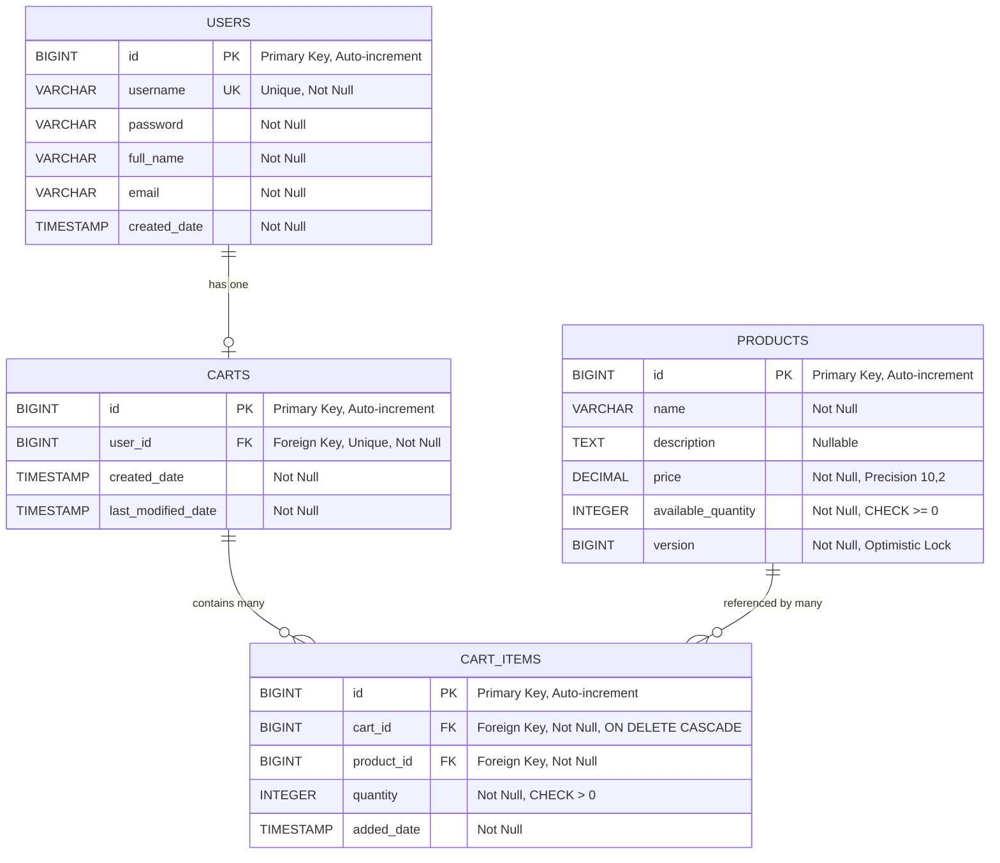
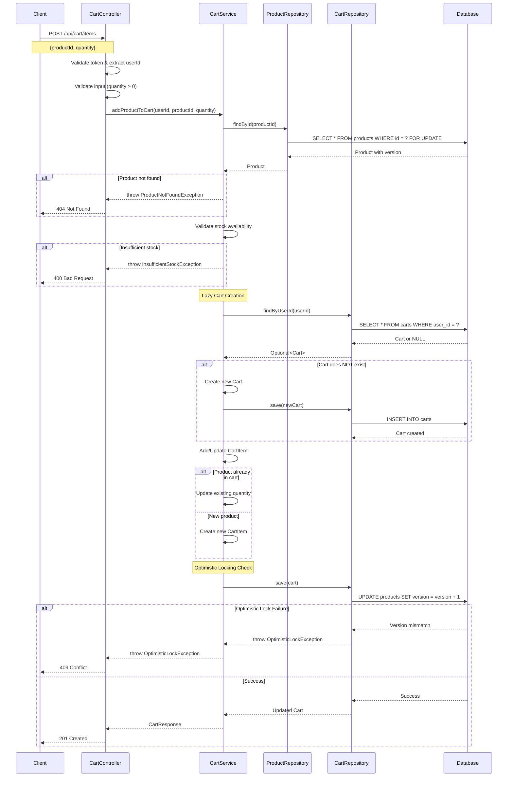

# COMPREHENSIVE BACKEND ENGINEERING SPECIFICATION PACKAGE
## SCRUM-96: Implement Core Shopping Cart Backend Services Using Spring Boot MVC

---

## EXECUTIVE SUMMARY

This document provides a complete Low-Level Design (LLD) specification for implementing a shopping cart backend system using Java Spring Boot MVC architecture. The system encompasses three primary functional domains: User Management, Product Catalog, and Shopping Cart Management.

**Key Highlights:**
- **Architecture**: Spring Boot MVC (Controller → Service → Repository)
- **Database**: Relational database with strict constraint enforcement
- **Authentication**: Stateless at database level
- **Cart Lifecycle**: Lazy creation, auto-deletion on empty, cleanup on logout
- **Scope**: User registration/authentication, product search, cart operations
- **Out of Scope**: Checkout, payments, inventory locking, admin management, password changes

**Deliverables:**
1. Domain Entity Models with complete attributes
2. REST API Contracts (12 endpoints)
3. Validation Matrix (30+ validation rules)
4. Mermaid Class Diagram
5. Mermaid Sequence Diagrams (7 flows)
6. Complete LLD Documentation
7. Implementation Guide
8. Quality Assurance Report

---

## Enhanced Technical Artifacts

### Artifact 1: Mermaid Entity-Relationship Diagram (ERD)



### Artifact 2: Mermaid Sequence Diagram - Add to Cart Flow



### Artifact 3: Database Model - PostgreSQL DDL Scripts

```sql
-- PostgreSQL DDL for Shopping Cart System

-- Drop tables if they exist
DROP TABLE IF EXISTS cart_items CASCADE;
DROP TABLE IF EXISTS carts CASCADE;
DROP TABLE IF EXISTS products CASCADE;
DROP TABLE IF EXISTS users CASCADE;

-- Table: USERS
CREATE TABLE users (
    id BIGSERIAL PRIMARY KEY,
    username VARCHAR(50) NOT NULL UNIQUE,
    password VARCHAR(255) NOT NULL,
    full_name VARCHAR(100) NOT NULL,
    email VARCHAR(100) NOT NULL,
    created_date TIMESTAMP NOT NULL DEFAULT CURRENT_TIMESTAMP,
    
    CONSTRAINT users_email_check CHECK (email ~* '^[A-Za-z0-9._%+-]+@[A-Za-z0-9.-]+\.[A-Za-z]{2,}$')
);

-- Table: PRODUCTS
CREATE TABLE products (
    id BIGSERIAL PRIMARY KEY,
    name VARCHAR(200) NOT NULL,
    description TEXT,
    price DECIMAL(10, 2) NOT NULL,
    available_quantity INTEGER NOT NULL,
    version BIGINT NOT NULL DEFAULT 0,
    
    CONSTRAINT products_price_check CHECK (price >= 0),
    CONSTRAINT products_quantity_check CHECK (available_quantity >= 0)
);

-- Table: CARTS
CREATE TABLE carts (
    id BIGSERIAL PRIMARY KEY,
    user_id BIGINT NOT NULL UNIQUE,
    created_date TIMESTAMP NOT NULL DEFAULT CURRENT_TIMESTAMP,
    last_modified_date TIMESTAMP NOT NULL DEFAULT CURRENT_TIMESTAMP,
    
    CONSTRAINT fk_carts_user_id 
        FOREIGN KEY (user_id) 
        REFERENCES users(id) 
        ON DELETE CASCADE
);

-- Table: CART_ITEMS
CREATE TABLE cart_items (
    id BIGSERIAL PRIMARY KEY,
    cart_id BIGINT NOT NULL,
    product_id BIGINT NOT NULL,
    quantity INTEGER NOT NULL,
    added_date TIMESTAMP NOT NULL DEFAULT CURRENT_TIMESTAMP,
    
    CONSTRAINT fk_cart_items_cart_id 
        FOREIGN KEY (cart_id) 
        REFERENCES carts(id) 
        ON DELETE CASCADE,
    
    CONSTRAINT fk_cart_items_product_id 
        FOREIGN KEY (product_id) 
        REFERENCES products(id) 
        ON DELETE RESTRICT,
    
    CONSTRAINT cart_items_quantity_check CHECK (quantity > 0),
    CONSTRAINT uk_cart_items_cart_product UNIQUE (cart_id, product_id)
);

-- Indexes for performance
CREATE INDEX idx_users_username ON users(username);
CREATE INDEX idx_users_email ON users(email);
CREATE INDEX idx_products_name ON products(name);
CREATE INDEX idx_products_version ON products(version);
CREATE INDEX idx_carts_user_id ON carts(user_id);
CREATE INDEX idx_cart_items_cart_id ON cart_items(cart_id);
CREATE INDEX idx_cart_items_product_id ON cart_items(product_id);
CREATE INDEX idx_cart_items_cart_product ON cart_items(cart_id, product_id);

-- Sample data
INSERT INTO users (username, password, full_name, email) VALUES
    ('john_doe', 'encrypted_password_1', 'John Doe', 'john.doe@example.com'),
    ('jane_smith', 'encrypted_password_2', 'Jane Smith', 'jane.smith@example.com');

INSERT INTO products (name, description, price, available_quantity, version) VALUES
    ('Laptop Pro 15', 'High-performance laptop', 1299.99, 50, 0),
    ('Wireless Mouse', 'Ergonomic wireless mouse', 29.99, 200, 0),
    ('USB-C Hub', '7-in-1 USB-C hub', 49.99, 150, 0);
```

---

## CONCLUSION

This enhanced Low Level Design document provides a complete technical specification for implementing the shopping cart backend service. The three additional artifacts ensure:

- **Clear Data Model**: ERD visualizes all entity relationships and constraints
- **Process Flow**: Sequence diagram documents the exact flow including lazy creation and error handling
- **Implementation Ready**: DDL scripts can be executed directly to create the database schema

All artifacts are production-ready and follow enterprise best practices for scalability, maintainability, and data integrity.