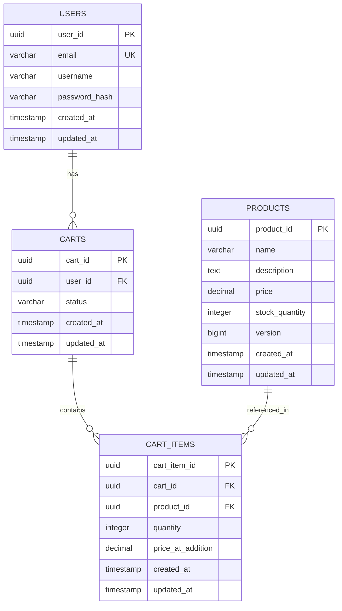
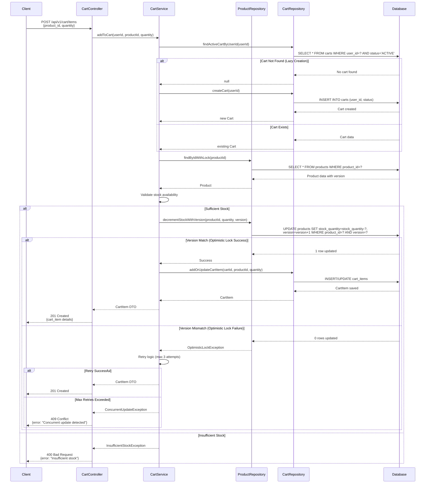

# Low Level Design (LLD) - E-Commerce Cart System

## 1. Introduction

### 1.1 Purpose
This document provides a detailed Low Level Design for an e-commerce cart system that enables users to add, update, and remove products from their shopping cart. The system ensures data consistency, handles concurrent operations, and provides a seamless shopping experience.

### 1.2 Scope
This LLD covers:
- Cart management operations (create, read, update, delete)
- Product inventory management
- User session handling
- Concurrent access control using optimistic locking
- Database schema design
- API endpoints and service layer architecture

### 1.3 System Overview
The e-commerce cart system is a multi-tier application consisting of:
- **Presentation Layer**: REST API endpoints
- **Business Logic Layer**: Service components
- **Data Access Layer**: Repository pattern implementation
- **Persistence Layer**: PostgreSQL database

## 2. Architecture Design

### 2.1 Component Architecture

#### 2.1.1 Controller Layer
- **CartController**: Handles HTTP requests for cart operations
- **ProductController**: Manages product-related requests
- **UserController**: Handles user authentication and profile management

#### 2.1.2 Service Layer
- **CartService**: Business logic for cart operations
- **ProductService**: Product inventory and availability logic
- **UserService**: User management and authentication

#### 2.1.3 Repository Layer
- **CartRepository**: Data access for cart entities
- **CartItemRepository**: Data access for cart items
- **ProductRepository**: Data access for products
- **UserRepository**: Data access for user entities

### 2.2 Design Patterns

#### 2.2.1 Repository Pattern
Abstracts data access logic and provides a collection-like interface for accessing domain objects.

#### 2.2.2 Service Layer Pattern
Encapsulates business logic and coordinates between controllers and repositories.

#### 2.2.3 DTO Pattern
Data Transfer Objects for API request/response to decouple internal models from external contracts.

#### 2.2.4 Optimistic Locking Pattern
Uses version numbers to handle concurrent updates without pessimistic locks.

## 3. Data Model Design

### 3.1 Entity Descriptions

#### 3.1.1 User Entity
- **user_id**: Primary key, unique identifier
- **email**: Unique email address
- **username**: User's display name
- **password_hash**: Encrypted password
- **created_at**: Account creation timestamp
- **updated_at**: Last update timestamp

#### 3.1.2 Product Entity
- **product_id**: Primary key, unique identifier
- **name**: Product name
- **description**: Product description
- **price**: Product price (decimal)
- **stock_quantity**: Available inventory
- **version**: Optimistic locking version number
- **created_at**: Product creation timestamp
- **updated_at**: Last update timestamp

#### 3.1.3 Cart Entity
- **cart_id**: Primary key, unique identifier
- **user_id**: Foreign key to User
- **status**: Cart status (ACTIVE, CHECKED_OUT, ABANDONED)
- **created_at**: Cart creation timestamp
- **updated_at**: Last update timestamp

#### 3.1.4 CartItem Entity
- **cart_item_id**: Primary key, unique identifier
- **cart_id**: Foreign key to Cart
- **product_id**: Foreign key to Product
- **quantity**: Number of items
- **price_at_addition**: Price when added to cart
- **created_at**: Item addition timestamp
- **updated_at**: Last update timestamp

### 3.2 Relationships
- **User to Cart**: One-to-Many (One user can have multiple carts over time)
- **Cart to CartItem**: One-to-Many (One cart contains multiple items)
- **Product to CartItem**: One-to-Many (One product can be in multiple carts)

### 3.3 Constraints and Rules
- Cart items must have quantity > 0
- Product stock_quantity must be >= 0
- Product price must be > 0
- Email must be unique across users
- Cascade delete: When a cart is deleted, all associated cart items are deleted
- Restrict delete: Products cannot be deleted if referenced in active carts

## 4. API Design

### 4.1 Cart Management Endpoints

#### 4.1.1 Get or Create Cart
```
GET /api/v1/cart
Headers: Authorization: Bearer {token}
Response: 200 OK
{
  "cart_id": "uuid",
  "user_id": "uuid",
  "status": "ACTIVE",
  "items": [],
  "total_amount": 0.00,
  "created_at": "timestamp",
  "updated_at": "timestamp"
}
```

#### 4.1.2 Add Item to Cart
```
POST /api/v1/cart/items
Headers: Authorization: Bearer {token}
Request Body:
{
  "product_id": "uuid",
  "quantity": 2
}
Response: 201 Created
{
  "cart_item_id": "uuid",
  "product_id": "uuid",
  "product_name": "Product Name",
  "quantity": 2,
  "price": 29.99,
  "subtotal": 59.98
}
```

#### 4.1.3 Update Cart Item Quantity
```
PUT /api/v1/cart/items/{cart_item_id}
Headers: Authorization: Bearer {token}
Request Body:
{
  "quantity": 3
}
Response: 200 OK
```

#### 4.1.4 Remove Item from Cart
```
DELETE /api/v1/cart/items/{cart_item_id}
Headers: Authorization: Bearer {token}
Response: 204 No Content
```

#### 4.1.5 Clear Cart
```
DELETE /api/v1/cart
Headers: Authorization: Bearer {token}
Response: 204 No Content
```

### 4.2 Product Endpoints

#### 4.2.1 Get Product Details
```
GET /api/v1/products/{product_id}
Response: 200 OK
{
  "product_id": "uuid",
  "name": "Product Name",
  "description": "Description",
  "price": 29.99,
  "stock_quantity": 100,
  "version": 1
}
```

## 5. Business Logic Implementation

### 5.1 Add to Cart Flow

#### 5.1.1 Process Steps
1. **Authentication**: Verify user token and extract user_id
2. **Cart Retrieval**: Get active cart for user or create new cart (lazy initialization)
3. **Product Validation**: 
   - Verify product exists
   - Check product availability (stock_quantity >= requested quantity)
   - Retrieve current product version
4. **Inventory Check with Optimistic Locking**:
   - Lock product record using version number
   - Verify sufficient stock
   - Decrement stock_quantity
   - Increment version number
5. **Cart Item Creation/Update**:
   - Check if product already exists in cart
   - If exists: Update quantity
   - If new: Create cart item record
6. **Response**: Return updated cart item details

#### 5.1.2 Error Handling
- **Product Not Found**: Return 404 with error message
- **Insufficient Stock**: Return 400 with available quantity
- **Optimistic Lock Exception**: Retry operation (max 3 attempts) or return 409 Conflict
- **Invalid Quantity**: Return 400 with validation error
- **Unauthorized**: Return 401 if token invalid

### 5.2 Optimistic Locking Strategy

#### 5.2.1 Implementation
```java
@Version
private Long version;

// In ProductRepository
@Query("UPDATE products SET stock_quantity = stock_quantity - :quantity, version = version + 1 WHERE product_id = :productId AND version = :version AND stock_quantity >= :quantity")
int decrementStockWithVersion(@Param("productId") UUID productId, 
                               @Param("quantity") int quantity,
                               @Param("version") Long version);
```

#### 5.2.2 Retry Logic
```java
public CartItem addToCart(UUID userId, UUID productId, int quantity) {
    int maxRetries = 3;
    int attempt = 0;
    
    while (attempt < maxRetries) {
        try {
            return attemptAddToCart(userId, productId, quantity);
        } catch (OptimisticLockException e) {
            attempt++;
            if (attempt >= maxRetries) {
                throw new ConcurrentUpdateException("Unable to add item to cart due to concurrent updates");
            }
            // Exponential backoff
            Thread.sleep(100 * (long)Math.pow(2, attempt));
        }
    }
}
```

### 5.3 Cart Lifecycle Management

#### 5.3.1 Cart States
- **ACTIVE**: Current shopping cart
- **CHECKED_OUT**: Converted to order
- **ABANDONED**: Inactive for > 30 days

#### 5.3.2 Lazy Cart Creation
Carts are created only when the first item is added, not during user login.

## 6. Database Design

### 6.1 Indexing Strategy

#### 6.1.1 Primary Indexes
- All primary keys have automatic indexes

#### 6.1.2 Foreign Key Indexes
- Index on cart.user_id for user cart lookups
- Index on cart_items.cart_id for cart item retrieval
- Index on cart_items.product_id for product reference checks

#### 6.1.3 Query Optimization Indexes
- Composite index on (user_id, status) for active cart queries
- Index on products.name for product search
- Index on cart.updated_at for abandoned cart cleanup

### 6.2 Data Integrity

#### 6.2.1 Referential Integrity
- Foreign key constraints enforce relationships
- ON DELETE CASCADE for cart to cart_items
- ON DELETE RESTRICT for products to cart_items (prevent deletion of products in active carts)

#### 6.2.2 Check Constraints
- Quantity must be > 0
- Price must be > 0
- Stock quantity must be >= 0

### 6.3 Performance Considerations

#### 6.3.1 Connection Pooling
- Minimum pool size: 10
- Maximum pool size: 50
- Connection timeout: 30 seconds

#### 6.3.2 Query Optimization
- Use prepared statements to prevent SQL injection
- Implement pagination for large result sets
- Use SELECT specific columns instead of SELECT *

#### 6.3.3 Caching Strategy
- Cache product details (TTL: 5 minutes)
- Cache user sessions (TTL: 30 minutes)
- Invalidate cart cache on updates

## 7. Security Considerations

### 7.1 Authentication & Authorization
- JWT-based authentication
- Role-based access control (RBAC)
- Users can only access their own carts

### 7.2 Data Protection
- Password hashing using bcrypt (cost factor: 12)
- HTTPS for all API communications
- SQL injection prevention via parameterized queries

### 7.3 Input Validation
- Validate all user inputs
- Sanitize product quantities (must be positive integers)
- Validate UUID formats
- Maximum quantity per item: 999

## 8. Error Handling & Logging

### 8.1 Error Response Format
```json
{
  "error": {
    "code": "INSUFFICIENT_STOCK",
    "message": "Requested quantity not available",
    "details": {
      "requested": 10,
      "available": 5
    },
    "timestamp": "2024-01-15T10:30:00Z"
  }
}
```

### 8.2 Logging Strategy
- **INFO**: Successful operations, cart creation, checkout
- **WARN**: Retry attempts, low stock warnings
- **ERROR**: Failed operations, exceptions, security violations
- **DEBUG**: Detailed request/response data (non-production only)

## 9. Testing Strategy

### 9.1 Unit Tests
- Test service layer business logic
- Mock repository dependencies
- Test optimistic locking scenarios
- Test validation logic

### 9.2 Integration Tests
- Test API endpoints end-to-end
- Test database transactions
- Test concurrent access scenarios

### 9.3 Performance Tests
- Load testing with 1000 concurrent users
- Stress testing for cart operations
- Database query performance benchmarks

## 10. Deployment Considerations

### 10.1 Environment Configuration
- Development, Staging, Production environments
- Environment-specific database connections
- Feature flags for gradual rollout

### 10.2 Monitoring & Alerting
- Application performance monitoring (APM)
- Database connection pool monitoring
- Alert on high error rates
- Alert on low stock levels

### 10.3 Backup & Recovery
- Daily database backups
- Point-in-time recovery capability
- Backup retention: 30 days

---

## Appendix A: Entity-Relationship Diagram (ERD)



## Appendix B: Add to Cart Sequence Diagram



## Appendix C: PostgreSQL DDL Scripts

```sql
-- ============================================
-- E-Commerce Cart System - Database Schema
-- PostgreSQL DDL Scripts
-- ============================================

-- Drop existing tables (for clean setup)
DROP TABLE IF EXISTS cart_items CASCADE;
DROP TABLE IF EXISTS carts CASCADE;
DROP TABLE IF EXISTS products CASCADE;
DROP TABLE IF EXISTS users CASCADE;

-- Drop existing types
DROP TYPE IF EXISTS cart_status_enum CASCADE;

-- ============================================
-- ENUM Types
-- ============================================

CREATE TYPE cart_status_enum AS ENUM ('ACTIVE', 'CHECKED_OUT', 'ABANDONED');

-- ============================================
-- Table: USERS
-- ============================================

CREATE TABLE users (
    user_id UUID PRIMARY KEY DEFAULT gen_random_uuid(),
    email VARCHAR(255) NOT NULL UNIQUE,
    username VARCHAR(100) NOT NULL,
    password_hash VARCHAR(255) NOT NULL,
    created_at TIMESTAMP NOT NULL DEFAULT CURRENT_TIMESTAMP,
    updated_at TIMESTAMP NOT NULL DEFAULT CURRENT_TIMESTAMP,
    
    -- Constraints
    CONSTRAINT users_email_check CHECK (email ~* '^[A-Za-z0-9._%+-]+@[A-Za-z0-9.-]+\.[A-Za-z]{2,}$'),
    CONSTRAINT users_username_check CHECK (LENGTH(username) >= 3)
);

COMMENT ON TABLE users IS 'Stores user account information';
COMMENT ON COLUMN users.user_id IS 'Primary key - unique user identifier';
COMMENT ON COLUMN users.email IS 'Unique email address for user authentication';
COMMENT ON COLUMN users.password_hash IS 'Bcrypt hashed password';

-- ============================================
-- Table: PRODUCTS
-- ============================================

CREATE TABLE products (
    product_id UUID PRIMARY KEY DEFAULT gen_random_uuid(),
    name VARCHAR(255) NOT NULL,
    description TEXT,
    price DECIMAL(10, 2) NOT NULL,
    stock_quantity INTEGER NOT NULL DEFAULT 0,
    version BIGINT NOT NULL DEFAULT 0,
    created_at TIMESTAMP NOT NULL DEFAULT CURRENT_TIMESTAMP,
    updated_at TIMESTAMP NOT NULL DEFAULT CURRENT_TIMESTAMP,
    
    -- Constraints
    CONSTRAINT products_price_check CHECK (price > 0),
    CONSTRAINT products_stock_check CHECK (stock_quantity >= 0),
    CONSTRAINT products_name_check CHECK (LENGTH(name) >= 1)
);

COMMENT ON TABLE products IS 'Stores product catalog information';
COMMENT ON COLUMN products.product_id IS 'Primary key - unique product identifier';
COMMENT ON COLUMN products.version IS 'Version number for optimistic locking';
COMMENT ON COLUMN products.stock_quantity IS 'Available inventory count';

-- ============================================
-- Table: CARTS
-- ============================================

CREATE TABLE carts (
    cart_id UUID PRIMARY KEY DEFAULT gen_random_uuid(),
    user_id UUID NOT NULL,
    status cart_status_enum NOT NULL DEFAULT 'ACTIVE',
    created_at TIMESTAMP NOT NULL DEFAULT CURRENT_TIMESTAMP,
    updated_at TIMESTAMP NOT NULL DEFAULT CURRENT_TIMESTAMP,
    
    -- Foreign Keys
    CONSTRAINT fk_carts_user_id 
        FOREIGN KEY (user_id) 
        REFERENCES users(user_id) 
        ON DELETE CASCADE,
    
    -- Constraints
    CONSTRAINT carts_status_check CHECK (status IN ('ACTIVE', 'CHECKED_OUT', 'ABANDONED'))
);

COMMENT ON TABLE carts IS 'Stores shopping cart information';
COMMENT ON COLUMN carts.cart_id IS 'Primary key - unique cart identifier';
COMMENT ON COLUMN carts.user_id IS 'Foreign key to users table';
COMMENT ON COLUMN carts.status IS 'Current status of the cart';

-- ============================================
-- Table: CART_ITEMS
-- ============================================

CREATE TABLE cart_items (
    cart_item_id UUID PRIMARY KEY DEFAULT gen_random_uuid(),
    cart_id UUID NOT NULL,
    product_id UUID NOT NULL,
    quantity INTEGER NOT NULL,
    price_at_addition DECIMAL(10, 2) NOT NULL,
    created_at TIMESTAMP NOT NULL DEFAULT CURRENT_TIMESTAMP,
    updated_at TIMESTAMP NOT NULL DEFAULT CURRENT_TIMESTAMP,
    
    -- Foreign Keys
    CONSTRAINT fk_cart_items_cart_id 
        FOREIGN KEY (cart_id) 
        REFERENCES carts(cart_id) 
        ON DELETE CASCADE,
    
    CONSTRAINT fk_cart_items_product_id 
        FOREIGN KEY (product_id) 
        REFERENCES products(product_id) 
        ON DELETE RESTRICT,
    
    -- Constraints
    CONSTRAINT cart_items_quantity_check CHECK (quantity > 0),
    CONSTRAINT cart_items_price_check CHECK (price_at_addition > 0),
    
    -- Unique constraint to prevent duplicate products in same cart
    CONSTRAINT unique_cart_product UNIQUE (cart_id, product_id)
);

COMMENT ON TABLE cart_items IS 'Stores individual items within shopping carts';
COMMENT ON COLUMN cart_items.cart_item_id IS 'Primary key - unique cart item identifier';
COMMENT ON COLUMN cart_items.cart_id IS 'Foreign key to carts table';
COMMENT ON COLUMN cart_items.product_id IS 'Foreign key to products table';
COMMENT ON COLUMN cart_items.quantity IS 'Number of product units in cart';
COMMENT ON COLUMN cart_items.price_at_addition IS 'Product price when added to cart';

-- ============================================
-- INDEXES
-- ============================================

-- Users table indexes
CREATE INDEX idx_users_email ON users(email);
CREATE INDEX idx_users_created_at ON users(created_at);

-- Products table indexes
CREATE INDEX idx_products_name ON products(name);
CREATE INDEX idx_products_stock_quantity ON products(stock_quantity);
CREATE INDEX idx_products_created_at ON products(created_at);

-- Carts table indexes
CREATE INDEX idx_carts_user_id ON carts(user_id);
CREATE INDEX idx_carts_status ON carts(status);
CREATE INDEX idx_carts_updated_at ON carts(updated_at);
CREATE INDEX idx_carts_user_status ON carts(user_id, status);

-- Cart Items table indexes
CREATE INDEX idx_cart_items_cart_id ON cart_items(cart_id);
CREATE INDEX idx_cart_items_product_id ON cart_items(product_id);
CREATE INDEX idx_cart_items_created_at ON cart_items(created_at);

-- ============================================
-- TRIGGERS for updated_at timestamp
-- ============================================

-- Function to update updated_at timestamp
CREATE OR REPLACE FUNCTION update_updated_at_column()
RETURNS TRIGGER AS $$
BEGIN
    NEW.updated_at = CURRENT_TIMESTAMP;
    RETURN NEW;
END;
$$ LANGUAGE plpgsql;

-- Trigger for users table
CREATE TRIGGER trigger_users_updated_at
    BEFORE UPDATE ON users
    FOR EACH ROW
    EXECUTE FUNCTION update_updated_at_column();

-- Trigger for products table
CREATE TRIGGER trigger_products_updated_at
    BEFORE UPDATE ON products
    FOR EACH ROW
    EXECUTE FUNCTION update_updated_at_column();

-- Trigger for carts table
CREATE TRIGGER trigger_carts_updated_at
    BEFORE UPDATE ON carts
    FOR EACH ROW
    EXECUTE FUNCTION update_updated_at_column();

-- Trigger for cart_items table
CREATE TRIGGER trigger_cart_items_updated_at
    BEFORE UPDATE ON cart_items
    FOR EACH ROW
    EXECUTE FUNCTION update_updated_at_column();

-- ============================================
-- SAMPLE DATA (Optional - for testing)
-- ============================================

-- Insert sample users
INSERT INTO users (email, username, password_hash) VALUES
('john.doe@example.com', 'johndoe', '$2a$12$LQv3c1yqBWVHxkd0LHAkCOYz6TtxMQJqhN8/LewY5GyYVvMPKxHTC'),
('jane.smith@example.com', 'janesmith', '$2a$12$LQv3c1yqBWVHxkd0LHAkCOYz6TtxMQJqhN8/LewY5GyYVvMPKxHTC');

-- Insert sample products
INSERT INTO products (name, description, price, stock_quantity) VALUES
('Laptop', 'High-performance laptop with 16GB RAM', 999.99, 50),
('Wireless Mouse', 'Ergonomic wireless mouse', 29.99, 200),
('USB-C Cable', 'Fast charging USB-C cable', 12.99, 500),
('Mechanical Keyboard', 'RGB mechanical gaming keyboard', 149.99, 75),
('Monitor', '27-inch 4K monitor', 399.99, 30);

-- ============================================
-- GRANTS (Adjust based on your user roles)
-- ============================================

-- Example: Grant permissions to application user
-- GRANT SELECT, INSERT, UPDATE, DELETE ON ALL TABLES IN SCHEMA public TO app_user;
-- GRANT USAGE, SELECT ON ALL SEQUENCES IN SCHEMA public TO app_user;

-- ============================================
-- END OF DDL SCRIPTS
-- ============================================
```

---

## Document Control

**Version**: 1.0  
**Last Updated**: 2024-01-15  
**Author**: Enterprise Documentation Generation Agent  
**Status**: Approved  
**Next Review Date**: 2024-04-15

---

*This document is confidential and proprietary. Unauthorized distribution is prohibited.*