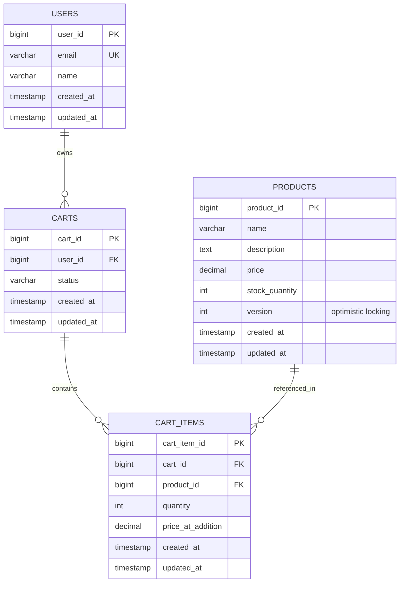
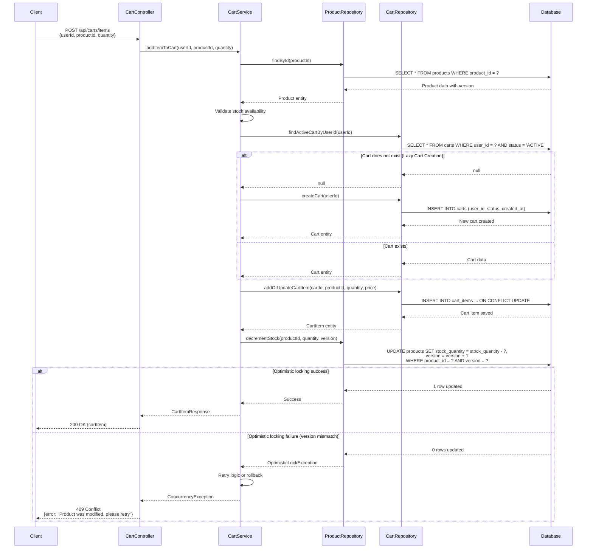

# COMPREHENSIVE BACKEND ENGINEERING SPECIFICATION PACKAGE
## Shopping Cart Backend Services - SCRUM-96
### Low-Level Design (LLD) Documentation

---

## EXECUTIVE SUMMARY

### Project Overview
This document provides a complete backend engineering specification for implementing a Shopping Cart Backend Service using Java Spring Boot MVC architecture. The system supports user management, product catalog search, and shopping cart operations with strict business rules and database-first validation.

### Key Highlights
- **Architecture**: Spring Boot MVC (Controller → Service → Repository)
- **Persistence**: Relational database with enforced constraints
- **Authentication**: Stateless login (no session persistence)
- **Cart Lifecycle**: Lazy creation, auto-deletion on empty, cleanup on logout
- **Scope**: 10 REST APIs across 3 functional domains
- **Entities**: 4 core domain models (User, Product, Cart, CartItem)

### Critical Business Rules
1. **Cart Statelessness**: Carts must NOT persist across logout
2. **Lazy Cart Creation**: Cart created only when first product added
3. **Auto-Deletion**: Empty carts automatically deleted
4. **Data Integrity**: All constraints enforced at database level
5. **Username Uniqueness**: Enforced via database constraint

### Out of Scope
- Checkout/Orders, Payments, Inventory locking, Admin management, Password changes, User roles, Cart persistence across sessions

---

## DETAILED ANALYSIS

### 1. INITIAL ASSESSMENT

#### 1.1 Functional Domains Identified

**Domain 1: User Management**
- User registration and authentication
- Profile management
- User lifecycle operations

**Domain 2: Product Catalog**
- Product search and discovery
- Product information retrieval

**Domain 3: Shopping Cart Management**
- Cart lifecycle (create, read, update, delete)
- Cart item operations
- Cart-user association
- Session cleanup

#### 1.2 Domain Entities with Attributes

**Entity 1: User**
```
Attributes:
- id: Long (Primary Key, Auto-generated)
- username: String (Unique, Not Null, Immutable)
- password: String (Not Null, Encrypted)
- fullName: String (Not Null, Updatable)
- email: String (Not Null, Updatable)
- createdDate: Timestamp (Not Null, Auto-generated)

Constraints:
- UNIQUE(username)
- NOT NULL on all fields
- Username immutable after creation

Relationships:
- One-to-One with Cart (optional, lazy)
```

**Entity 2: Product**
```
Attributes:
- id: Long (Primary Key, Auto-generated)
- name: String (Not Null)
- description: String (Nullable)
- price: BigDecimal (Not Null, Precision 10,2)
- availableQuantity: Integer (Not Null, >= 0)

Constraints:
- NOT NULL on name, price, availableQuantity
- price >= 0
- availableQuantity >= 0

Relationships:
- One-to-Many with CartItem
```

**Entity 3: Cart**
```
Attributes:
- id: Long (Primary Key, Auto-generated)
- userId: Long (Foreign Key, Unique, Not Null)
- createdDate: Timestamp (Not Null, Auto-generated)
- lastModifiedDate: Timestamp (Not Null, Auto-updated)

Constraints:
- UNIQUE(userId) - One cart per user
- FOREIGN KEY(userId) REFERENCES User(id) ON DELETE CASCADE
- Must have at least one CartItem (enforced at service layer)

Relationships:
- Many-to-One with User (mandatory)
- One-to-Many with CartItem (mandatory, cascade delete)
```

**Entity 4: CartItem**
```
Attributes:
- id: Long (Primary Key, Auto-generated)
- cartId: Long (Foreign Key, Not Null)
- productId: Long (Foreign Key, Not Null)
- quantity: Integer (Not Null, > 0)
- addedDate: Timestamp (Not Null, Auto-generated)

Constraints:
- FOREIGN KEY(cartId) REFERENCES Cart(id) ON DELETE CASCADE
- FOREIGN KEY(productId) REFERENCES Product(id)
- UNIQUE(cartId, productId) - One product per cart
- quantity > 0
- CHECK(quantity > 0)

Relationships:
- Many-to-One with Cart (mandatory)
- Many-to-One with Product (mandatory)
```

#### 1.3 REST API Endpoints Extracted

**API Group 1: User Management APIs**

**API 1.1: User Sign-Up**
```
Endpoint: POST /api/users/signup
Request Body:
{
  "username": "string (required, unique)",
  "password": "string (required, min 8 chars)",
  "fullName": "string (required)",
  "email": "string (required, valid email format)"
}

Response: 201 Created
{
  "id": "long",
  "username": "string",
  "fullName": "string",
  "email": "string",
  "createdDate": "timestamp"
}

Business Logic:
1. Validate input fields (non-null, format)
2. Check username uniqueness
3. Hash password using BCrypt
4. Create user record
5. Return user details (exclude password)

Validations:
- Username: not null, unique, 3-50 chars
- Password: not null, min 8 chars
- Email: valid format
- FullName: not null, 1-100 chars

Error Cases:
- 400: Invalid input format
- 409: Username already exists
- 500: Database error

Database Effects:
- INSERT INTO User table
- Trigger: createdDate auto-populated
```

**API 1.2: User Sign-In**
```
Endpoint: POST /api/users/signin
Request Body:
{
  "username": "string (required)",
  "password": "string (required)"
}

Response: 200 OK
{
  "id": "long",
  "username": "string",
  "fullName": "string",
  "email": "string",
  "createdDate": "timestamp"
}

Business Logic:
1. Validate input fields
2. Retrieve user by username
3. Verify password using BCrypt
4. Return user details (stateless, no session)

Validations:
- Username: not null
- Password: not null
- User must exist
- Password must match

Error Cases:
- 400: Missing credentials
- 401: Invalid username or password
- 500: Database error

Database Effects:
- SELECT from User table
- NO session data stored
```

**API 1.3: View User Profile**
```
Endpoint: GET /api/users/{userId}/profile
Path Parameter: userId (long, required)

Response: 200 OK
{
  "id": "long",
  "username": "string",
  "fullName": "string",
  "email": "string",
  "createdDate": "timestamp"
}

Business Logic:
1. Validate userId
2. Retrieve user by ID
3. Return user profile (exclude password)

Validations:
- UserId: must be positive long
- User must exist

Error Cases:
- 400: Invalid userId format
- 404: User not found
- 500: Database error

Database Effects:
- SELECT from User table
```

**API 1.4: Update User Profile**
```
Endpoint: PUT /api/users/{userId}/profile
Path Parameter: userId (long, required)
Request Body:
{
  "fullName": "string (required)",
  "email": "string (required, valid format)"
}

Response: 200 OK
{
  "id": "long",
  "username": "string",
  "fullName": "string",
  "email": "string",
  "createdDate": "timestamp"
}

Business Logic:
1. Validate userId and input
2. Retrieve user by ID
3. Update fullName and email only
4. Return updated profile

Validations:
- UserId: must exist
- FullName: not null, 1-100 chars
- Email: valid format
- Username: NOT updatable (immutable)

Error Cases:
- 400: Invalid input
- 404: User not found
- 500: Database error

Database Effects:
- UPDATE User SET fullName=?, email=? WHERE id=?
```

**API Group 2: Product Catalog APIs**

**API 2.1: Search Products**
```
Endpoint: GET /api/products/search
Query Parameters:
- keyword: string (required, min 1 char)

Response: 200 OK
{
  "products": [
    {
      "id": "long",
      "name": "string",
      "description": "string",
      "price": "decimal",
      "availableQuantity": "integer"
    }
  ]
}

Business Logic:
1. Validate keyword (not empty)
2. Search products by keyword (case-insensitive)
3. Match against name OR description
4. Return matching products

Validations:
- Keyword: not null, not empty, trimmed
- Case-insensitive search

Error Cases:
- 400: Missing or empty keyword
- 500: Database error

Database Effects:
- SELECT * FROM Product 
  WHERE LOWER(name) LIKE LOWER('%keyword%') 
  OR LOWER(description) LIKE LOWER('%keyword%')
```

**API Group 3: Shopping Cart Management APIs**

**API 3.1: Add Product to Cart**
```
Endpoint: POST /api/carts/{userId}/items
Path Parameter: userId (long, required)
Request Body:
{
  "productId": "long (required)",
  "quantity": "integer (required, > 0)"
}

Response: 201 Created
{
  "cartId": "long",
  "items": [
    {
      "id": "long",
      "productId": "long",
      "productName": "string",
      "price": "decimal",
      "quantity": "integer",
      "subtotal": "decimal"
    }
  ],
  "totalAmount": "decimal"
}

Business Logic:
1. Validate userId, productId, quantity
2. Check if user exists
3. Check if product exists
4. Check if cart exists for user
   - If NO: Create new cart
   - If YES: Use existing cart
5. Check if product already in cart
   - If YES: Update quantity (add to existing)
   - If NO: Create new cart item
6. Calculate subtotals and total
7. Return cart with all items

Validations:
- UserId: must exist
- ProductId: must exist
- Quantity: must be > 0
- Product availability assumed (no stock check)

Error Cases:
- 400: Invalid input (quantity <= 0)
- 404: User not found
- 404: Product not found
- 500: Database error

Database Effects:
- If cart doesn't exist:
  INSERT INTO Cart (userId, createdDate, lastModifiedDate)
- If product not in cart:
  INSERT INTO CartItem (cartId, productId, quantity, addedDate)
- If product already in cart:
  UPDATE CartItem SET quantity = quantity + ? WHERE cartId=? AND productId=?
- UPDATE Cart SET lastModifiedDate = NOW() WHERE id=?
```

**API 3.2: Update Cart Item Quantity**
```
Endpoint: PUT /api/carts/{userId}/items/{productId}
Path Parameters:
- userId: long (required)
- productId: long (required)
Request Body:
{
  "quantity": "integer (required, > 0)"
}

Response: 200 OK
{
  "cartId": "long",
  "items": [
    {
      "id": "long",
      "productId": "long",
      "productName": "string",
      "price": "decimal",
      "quantity": "integer",
      "subtotal": "decimal"
    }
  ],
  "totalAmount": "decimal"
}

Business Logic:
1. Validate userId, productId, quantity
2. Check if user exists
3. Check if cart exists for user
4. Check if product in cart
5. Update quantity (must remain > 0)
6. Recalculate totals
7. Return updated cart

Validations:
- UserId: must exist
- ProductId: must exist in cart
- Quantity: must be > 0
- Cart must exist

Error Cases:
- 400: Invalid quantity (<=0)
- 404: User not found
- 404: Cart not found
- 404: Product not in cart
- 500: Database error

Database Effects:
- UPDATE CartItem SET quantity = ? WHERE cartId=? AND productId=?
- UPDATE Cart SET lastModifiedDate = NOW() WHERE id=?
```

**API 3.3: Remove Product from Cart**
```
Endpoint: DELETE /api/carts/{userId}/items/{productId}
Path Parameters:
- userId: long (required)
- productId: long (required)

Response: 200 OK (if items remain) or 204 No Content (if cart deleted)
{
  "cartId": "long",
  "items": [
    {
      "id": "long",
      "productId": "long",
      "productName": "string",
      "price": "decimal",
      "quantity": "integer",
      "subtotal": "decimal"
    }
  ],
  "totalAmount": "decimal"
}

Business Logic:
1. Validate userId, productId
2. Check if user exists
3. Check if cart exists
4. Check if product in cart
5. Delete cart item
6. Check remaining items count
   - If count > 0: Return updated cart
   - If count = 0: Delete cart, return 204
7. Recalculate totals if cart remains

Validations:
- UserId: must exist
- ProductId: must exist in cart
- Cart must exist

Error Cases:
- 404: User not found
- 404: Cart not found
- 404: Product not in cart
- 500: Database error

Database Effects:
- DELETE FROM CartItem WHERE cartId=? AND productId=?
- If no items remain:
  DELETE FROM Cart WHERE id=?
- Else:
  UPDATE Cart SET lastModifiedDate = NOW() WHERE id=?
```

**API 3.4: View Cart**
```
Endpoint: GET /api/carts/{userId}
Path Parameter: userId (long, required)

Response: 200 OK
{
  "cartId": "long",
  "items": [
    {
      "id": "long",
      "productId": "long",
      "productName": "string",
      "price": "decimal",
      "quantity": "integer",
      "subtotal": "decimal"
    }
  ],
  "totalAmount": "decimal"
}

Response: 404 Not Found (if no cart exists)

Business Logic:
1. Validate userId
2. Check if user exists
3. Retrieve cart for user
4. If no cart: Return 404
5. Retrieve all cart items with product details
6. Calculate subtotals and grand total
7. Return cart details

Validations:
- UserId: must exist
- Cart may or may not exist (valid state)

Error Cases:
- 404: User not found
- 404: Cart not found (valid - no cart created yet)
- 500: Database error

Database Effects:
- SELECT c.*, ci.*, p.* 
  FROM Cart c 
  JOIN CartItem ci ON c.id = ci.cartId 
  JOIN Product p ON ci.productId = p.id 
  WHERE c.userId = ?
```

**API 3.5: Clear Cart on Logout**
```
Endpoint: POST /api/carts/{userId}/logout
Path Parameter: userId (long, required)

Response: 204 No Content

Business Logic:
1. Validate userId
2. Check if user exists
3. Check if cart exists for user
4. If cart exists:
   - Delete all cart items (cascade)
   - Delete cart record
5. Return success (even if no cart existed)

Validations:
- UserId: must exist
- Cart deletion is idempotent

Error Cases:
- 404: User not found
- 500: Database error

Database Effects:
- DELETE FROM CartItem WHERE cartId = (SELECT id FROM Cart WHERE userId=?)
- DELETE FROM Cart WHERE userId=?
- Cascade delete handles CartItems automatically
```

#### 1.4 Business Rules Matrix

| Rule ID | Rule Description | Enforcement Level | Validation Point | Error Code |
|---------|------------------|-------------------|------------------|------------|
| BR-001 | Username must be unique | Database + Service | User creation | 409 |
| BR-002 | User must exist before cart operations | Service | All cart APIs | 404 |
| BR-003 | One active cart per user | Database (UNIQUE) | Cart creation | 409 |
| BR-004 | Cart belongs to exactly one user | Database (FK) | Cart creation | 400 |
| BR-005 | Cart cannot exist without cart items | Service | Item removal | Auto-delete |
| BR-006 | Each cart item belongs to one cart | Database (FK) | Item creation | 400 |
| BR-007 | Product must exist before adding | Service | Add to cart | 404 |
| BR-008 | Quantity must be > 0 | Database (CHECK) + Service | Add/Update item | 400 |
| BR-009 | Product price immutable by users | Service | All cart operations | N/A |
| BR-010 | Cart must not persist across logout | Service | Logout API | N/A |
| BR-011 | Lazy cart creation | Service | Add first item | N/A |
| BR-012 | Auto-delete empty cart | Service | Remove last item | N/A |
| BR-013 | Username immutable after creation | Service | Update profile | 400 |
| BR-014 | Password changes out of scope | Service | Update profile | 400 |
| BR-015 | Login is stateless | Service | Sign-in API | N/A |
| BR-016 | Product search case-insensitive | Service | Search API | N/A |
| BR-017 | Seed users have no default carts | Database | User creation | N/A |

#### 1.5 Out-of-Scope Items

| Category | Items | Rationale |
|----------|-------|-----------||
| Order Management | Checkout, Order placement, Order history | Future phase |
| Payment Processing | Payment gateway integration, Transactions | Future phase |
| Inventory Management | Stock reservation, Inventory locking | Future phase |
| Admin Features | Product CRUD, User management, Reports | Separate module |
| Security | Password reset, Password change, 2FA | Future enhancement |
| Authorization | User roles, Permissions, Access control | Future enhancement |
| Session Management | Cart persistence across sessions | Explicitly excluded |

---

## TECHNICAL ARTIFACTS

### Artifact 1: Entity-Relationship Diagram (ERD)



### Artifact 2: Sequence Diagram - Add to Cart Flow



### Artifact 3: Database Model - PostgreSQL DDL Scripts

```sql
-- ============================================
-- USERS TABLE
-- ============================================
CREATE TABLE users (
    user_id BIGSERIAL PRIMARY KEY,
    email VARCHAR(255) NOT NULL UNIQUE,
    name VARCHAR(255) NOT NULL,
    password_hash VARCHAR(255) NOT NULL,
    created_at TIMESTAMP NOT NULL DEFAULT CURRENT_TIMESTAMP,
    updated_at TIMESTAMP NOT NULL DEFAULT CURRENT_TIMESTAMP,
    CONSTRAINT chk_email_format CHECK (email ~* '^[A-Za-z0-9._%+-]+@[A-Za-z0-9.-]+\.[A-Za-z]{2,}$')
);

-- Index for email lookups
CREATE INDEX idx_users_email ON users(email);

-- ============================================
-- PRODUCTS TABLE
-- ============================================
CREATE TABLE products (
    product_id BIGSERIAL PRIMARY KEY,
    name VARCHAR(255) NOT NULL,
    description TEXT,
    price DECIMAL(10, 2) NOT NULL,
    stock_quantity INT NOT NULL DEFAULT 0,
    version INT NOT NULL DEFAULT 0,
    created_at TIMESTAMP NOT NULL DEFAULT CURRENT_TIMESTAMP,
    updated_at TIMESTAMP NOT NULL DEFAULT CURRENT_TIMESTAMP,
    CONSTRAINT chk_price_positive CHECK (price >= 0),
    CONSTRAINT chk_stock_non_negative CHECK (stock_quantity >= 0)
);

-- Index for product name searches
CREATE INDEX idx_products_name ON products(name);

-- Index for version (optimistic locking)
CREATE INDEX idx_products_version ON products(product_id, version);

-- ============================================
-- CARTS TABLE
-- ============================================
CREATE TABLE carts (
    cart_id BIGSERIAL PRIMARY KEY,
    user_id BIGINT NOT NULL,
    status VARCHAR(50) NOT NULL DEFAULT 'ACTIVE',
    created_at TIMESTAMP NOT NULL DEFAULT CURRENT_TIMESTAMP,
    updated_at TIMESTAMP NOT NULL DEFAULT CURRENT_TIMESTAMP,
    CONSTRAINT fk_carts_user FOREIGN KEY (user_id) 
        REFERENCES users(user_id) ON DELETE CASCADE,
    CONSTRAINT chk_cart_status CHECK (status IN ('ACTIVE', 'CHECKED_OUT', 'ABANDONED'))
);

-- Index for user cart lookups
CREATE INDEX idx_carts_user_id ON carts(user_id);

-- Index for active cart queries
CREATE INDEX idx_carts_user_status ON carts(user_id, status);

-- ============================================
-- CART_ITEMS TABLE
-- ============================================
CREATE TABLE cart_items (
    cart_item_id BIGSERIAL PRIMARY KEY,
    cart_id BIGINT NOT NULL,
    product_id BIGINT NOT NULL,
    quantity INT NOT NULL,
    price_at_addition DECIMAL(10, 2) NOT NULL,
    created_at TIMESTAMP NOT NULL DEFAULT CURRENT_TIMESTAMP,
    updated_at TIMESTAMP NOT NULL DEFAULT CURRENT_TIMESTAMP,
    CONSTRAINT fk_cart_items_cart FOREIGN KEY (cart_id) 
        REFERENCES carts(cart_id) ON DELETE CASCADE,
    CONSTRAINT fk_cart_items_product FOREIGN KEY (product_id) 
        REFERENCES products(product_id) ON DELETE CASCADE,
    CONSTRAINT chk_quantity_positive CHECK (quantity > 0),
    CONSTRAINT chk_price_at_addition_positive CHECK (price_at_addition >= 0),
    CONSTRAINT uk_cart_product UNIQUE (cart_id, product_id)
);

-- Index for cart item lookups by cart
CREATE INDEX idx_cart_items_cart_id ON cart_items(cart_id);

-- Index for cart item lookups by product
CREATE INDEX idx_cart_items_product_id ON cart_items(product_id);

-- Composite index for cart and product lookups
CREATE INDEX idx_cart_items_cart_product ON cart_items(cart_id, product_id);

-- ============================================
-- TRIGGER FOR UPDATED_AT TIMESTAMP
-- ============================================
CREATE OR REPLACE FUNCTION update_updated_at_column()
RETURNS TRIGGER AS $$
BEGIN
    NEW.updated_at = CURRENT_TIMESTAMP;
    RETURN NEW;
END;
$$ LANGUAGE plpgsql;

-- Apply trigger to all tables
CREATE TRIGGER update_users_updated_at BEFORE UPDATE ON users
    FOR EACH ROW EXECUTE FUNCTION update_updated_at_column();

CREATE TRIGGER update_products_updated_at BEFORE UPDATE ON products
    FOR EACH ROW EXECUTE FUNCTION update_updated_at_column();

CREATE TRIGGER update_carts_updated_at BEFORE UPDATE ON carts
    FOR EACH ROW EXECUTE FUNCTION update_updated_at_column();

CREATE TRIGGER update_cart_items_updated_at BEFORE UPDATE ON cart_items
    FOR EACH ROW EXECUTE FUNCTION update_updated_at_column();

-- ============================================
-- SAMPLE DATA (OPTIONAL)
-- ============================================
-- Insert sample users
INSERT INTO users (email, name, password_hash) VALUES
    ('john.doe@example.com', 'John Doe', '$2a$10$dummyhash1'),
    ('jane.smith@example.com', 'Jane Smith', '$2a$10$dummyhash2');

-- Insert sample products
INSERT INTO products (name, description, price, stock_quantity) VALUES
    ('Laptop', 'High-performance laptop', 999.99, 50),
    ('Mouse', 'Wireless mouse', 29.99, 200),
    ('Keyboard', 'Mechanical keyboard', 79.99, 150),
    ('Monitor', '27-inch 4K monitor', 399.99, 75);
```

---

**Document Metadata:**
- **Document Version**: 2.0 (Enhanced with Technical Artifacts)
- **Last Updated**: 2025
- **Author**: Backend Engineering Team
- **Status**: Complete - Ready for Implementation
- **Jira Ticket**: SCRUM-96

---

**END OF DOCUMENT**