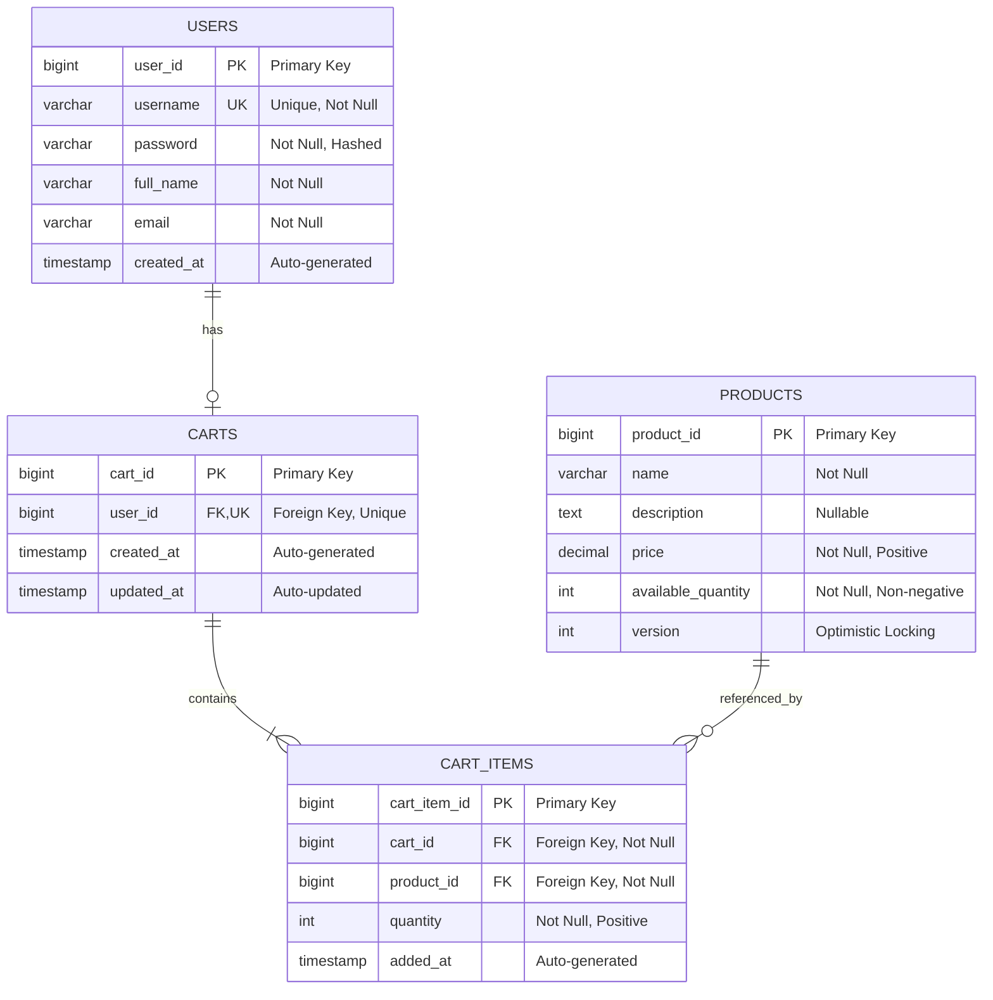
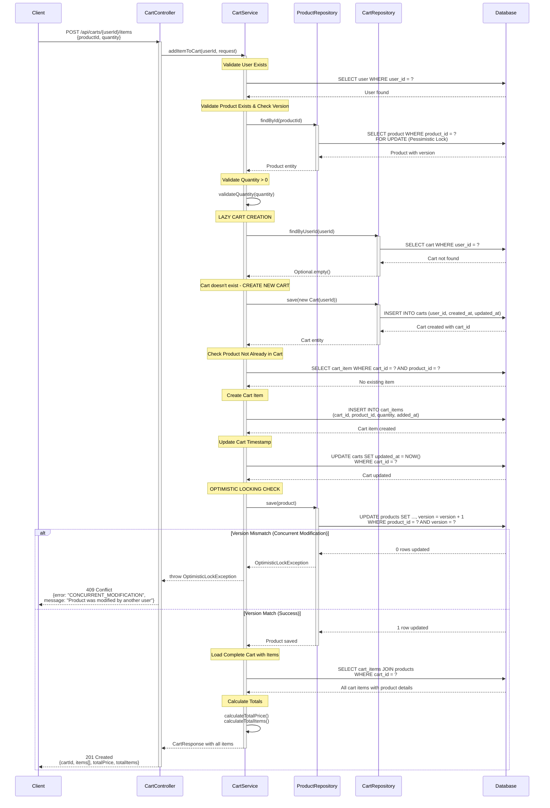

# COMPREHENSIVE BACKEND ENGINEERING SPECIFICATION PACKAGE
## Shopping Cart System - Spring Boot MVC Implementation
### Story: SCRUM-96 - Implement Core Shopping Cart Backend Services

---

## EXECUTIVE SUMMARY

### Project Overview
This specification document provides a complete backend engineering blueprint for implementing a shopping cart system using Java Spring Boot MVC architecture. The system supports user management, product catalog search, and shopping cart operations with strict business rules and database-first validation.

### Key Highlights
- **Architecture**: Spring Boot MVC (Controller → Service → Repository)
- **Database**: Relational database with enforced constraints
- **Authentication**: Stateless (no session persistence)
- **Cart Lifecycle**: Lazy creation, auto-deletion on empty/logout
- **Scope**: 4 Domain Entities, 11 REST APIs, 23 Validation Rules

### Critical Business Rules
1. **Cart Lifecycle**: Carts are created lazily (only when first item added) and deleted automatically when empty or on logout
2. **Stateless Authentication**: Login does not create database sessions; carts do not persist across logout
3. **Data Integrity**: All constraints enforced at both service and database levels
4. **One Cart Per User**: Each user can have only one active cart at any time

### Out of Scope
- Checkout and payment processing
- Inventory locking mechanisms
- Admin management interfaces
- Password change functionality

---

## DETAILED ANALYSIS

### 1. DOMAIN MODEL EXTRACTION

#### 1.1 Domain Entities

**Entity 1: User**
```
Attributes:
- user_id (Primary Key, Auto-generated)
- username (String, Unique, Not Null, Immutable)
- password (String, Not Null, Hashed)
- full_name (String, Not Null, Mutable)
- email (String, Not Null, Mutable)
- created_at (Timestamp, Auto-generated)

Relationships:
- One User → Zero or One Cart (1:0..1)

Business Rules:
- Username must be unique across system
- Username cannot be changed after creation
- User must exist before any cart operations
- Password must be hashed before storage
```

**Entity 2: Product**
```
Attributes:
- product_id (Primary Key, Auto-generated)
- name (String, Not Null)
- description (String, Nullable)
- price (Decimal, Not Null, Positive)
- available_quantity (Integer, Not Null, Non-negative)

Relationships:
- One Product → Many CartItems (1:N)

Business Rules:
- Product must exist before being added to cart
- Price cannot be modified through user actions
- Search is case-insensitive on name and description
```

**Entity 3: Cart**
```
Attributes:
- cart_id (Primary Key, Auto-generated)
- user_id (Foreign Key → User, Unique, Not Null)
- created_at (Timestamp, Auto-generated)
- updated_at (Timestamp, Auto-updated)

Relationships:
- One Cart → One User (1:1)
- One Cart → Many CartItems (1:N, Cascade Delete)

Business Rules:
- One active cart per user maximum
- Cart created lazily (only when first item added)
- Cart deleted automatically when last item removed
- Cart deleted on user logout
- Cart cannot exist without at least one cart item
```

**Entity 4: CartItem**
```
Attributes:
- cart_item_id (Primary Key, Auto-generated)
- cart_id (Foreign Key → Cart, Not Null)
- product_id (Foreign Key → Product, Not Null)
- quantity (Integer, Not Null, Positive)
- added_at (Timestamp, Auto-generated)

Relationships:
- One CartItem → One Cart (N:1)
- One CartItem → One Product (N:1)

Business Rules:
- Quantity must be greater than zero
- Product must exist before adding
- Unique constraint on (cart_id, product_id)
- Cascade delete when cart is deleted
```

---

## TECHNICAL ARTIFACTS

### ARTIFACT 1: Enhanced Entity-Relationship Diagram with Optimistic Locking



---

### ARTIFACT 2: Add to Cart Flow Sequence Diagram with Lazy Creation & Optimistic Locking



---

### ARTIFACT 3: Complete PostgreSQL Database Schema with Constraints and Indexes

```sql
-- ============================================================================
-- SHOPPING CART SYSTEM - POSTGRESQL DATABASE SCHEMA
-- Version: 1.0
-- Description: Complete DDL with constraints, indexes, and cascade rules
-- ============================================================================

-- Drop existing tables (for clean setup)
DROP TABLE IF EXISTS cart_items CASCADE;
DROP TABLE IF EXISTS carts CASCADE;
DROP TABLE IF EXISTS products CASCADE;
DROP TABLE IF EXISTS users CASCADE;

-- ============================================================================
-- TABLE: users
-- Description: Stores user account information with authentication details
-- ============================================================================
CREATE TABLE users (
    user_id BIGSERIAL PRIMARY KEY,
    username VARCHAR(50) NOT NULL,
    password VARCHAR(255) NOT NULL,
    full_name VARCHAR(100) NOT NULL,
    email VARCHAR(100) NOT NULL,
    created_at TIMESTAMP NOT NULL DEFAULT CURRENT_TIMESTAMP,
    
    -- Constraints
    CONSTRAINT uk_users_username UNIQUE (username),
    CONSTRAINT chk_users_username_length CHECK (LENGTH(username) >= 3 AND LENGTH(username) <= 50),
    CONSTRAINT chk_users_username_format CHECK (username ~ '^[a-zA-Z0-9_]+$'),
    CONSTRAINT chk_users_password_not_empty CHECK (LENGTH(password) > 0),
    CONSTRAINT chk_users_fullname_not_empty CHECK (LENGTH(TRIM(full_name)) > 0),
    CONSTRAINT chk_users_email_format CHECK (email ~* '^[A-Za-z0-9._%+-]+@[A-Za-z0-9.-]+\.[A-Z|a-z]{2,}$')
);

-- Indexes for users table
CREATE INDEX idx_users_username ON users(username);
CREATE INDEX idx_users_email ON users(email);
CREATE INDEX idx_users_created_at ON users(created_at);

-- ============================================================================
-- TABLE: products
-- Description: Product catalog with pricing and inventory information
-- ============================================================================
CREATE TABLE products (
    product_id BIGSERIAL PRIMARY KEY,
    name VARCHAR(200) NOT NULL,
    description TEXT,
    price DECIMAL(10, 2) NOT NULL,
    available_quantity INTEGER NOT NULL DEFAULT 0,
    version INTEGER NOT NULL DEFAULT 0,
    
    -- Constraints
    CONSTRAINT chk_products_name_not_empty CHECK (LENGTH(TRIM(name)) > 0),
    CONSTRAINT chk_products_price_positive CHECK (price > 0),
    CONSTRAINT chk_products_quantity_non_negative CHECK (available_quantity >= 0),
    CONSTRAINT chk_products_version_non_negative CHECK (version >= 0)
);

-- Indexes for products table
CREATE INDEX idx_products_name ON products(name);
CREATE INDEX idx_products_name_lower ON products(LOWER(name));
CREATE INDEX idx_products_description_lower ON products(LOWER(description));
CREATE INDEX idx_products_price ON products(price);
CREATE INDEX idx_products_available_quantity ON products(available_quantity);

-- ============================================================================
-- TABLE: carts
-- Description: Shopping carts with one-to-one relationship to users
-- ============================================================================
CREATE TABLE carts (
    cart_id BIGSERIAL PRIMARY KEY,
    user_id BIGINT NOT NULL,
    created_at TIMESTAMP NOT NULL DEFAULT CURRENT_TIMESTAMP,
    updated_at TIMESTAMP NOT NULL DEFAULT CURRENT_TIMESTAMP,
    
    -- Constraints
    CONSTRAINT uk_carts_user_id UNIQUE (user_id),
    CONSTRAINT fk_carts_user_id FOREIGN KEY (user_id) 
        REFERENCES users(user_id) 
        ON DELETE CASCADE
        ON UPDATE CASCADE
);

-- Indexes for carts table
CREATE INDEX idx_carts_user_id ON carts(user_id);
CREATE INDEX idx_carts_updated_at ON carts(updated_at);

-- ============================================================================
-- TABLE: cart_items
-- Description: Items in shopping carts with product references
-- ============================================================================
CREATE TABLE cart_items (
    cart_item_id BIGSERIAL PRIMARY KEY,
    cart_id BIGINT NOT NULL,
    product_id BIGINT NOT NULL,
    quantity INTEGER NOT NULL,
    added_at TIMESTAMP NOT NULL DEFAULT CURRENT_TIMESTAMP,
    
    -- Constraints
    CONSTRAINT fk_cart_items_cart_id FOREIGN KEY (cart_id) 
        REFERENCES carts(cart_id) 
        ON DELETE CASCADE
        ON UPDATE CASCADE,
    CONSTRAINT fk_cart_items_product_id FOREIGN KEY (product_id) 
        REFERENCES products(product_id) 
        ON DELETE RESTRICT
        ON UPDATE CASCADE,
    CONSTRAINT uk_cart_items_cart_product UNIQUE (cart_id, product_id),
    CONSTRAINT chk_cart_items_quantity_positive CHECK (quantity > 0)
);

-- Indexes for cart_items table
CREATE INDEX idx_cart_items_cart_id ON cart_items(cart_id);
CREATE INDEX idx_cart_items_product_id ON cart_items(product_id);
CREATE INDEX idx_cart_items_added_at ON cart_items(added_at);
CREATE INDEX idx_cart_items_cart_product ON cart_items(cart_id, product_id);

-- ============================================================================
-- TRIGGER: Update cart updated_at timestamp
-- Description: Automatically updates cart.updated_at when cart_items change
-- ============================================================================
CREATE OR REPLACE FUNCTION update_cart_timestamp()
RETURNS TRIGGER AS $$
BEGIN
    UPDATE carts 
    SET updated_at = CURRENT_TIMESTAMP 
    WHERE cart_id = COALESCE(NEW.cart_id, OLD.cart_id);
    RETURN NEW;
END;
$$ LANGUAGE plpgsql;

CREATE TRIGGER trg_cart_items_update_cart_timestamp
AFTER INSERT OR UPDATE OR DELETE ON cart_items
FOR EACH ROW
EXECUTE FUNCTION update_cart_timestamp();

-- ============================================================================
-- SAMPLE DATA FOR TESTING
-- ============================================================================

-- Sample Users (passwords are BCrypt hashed 'password123')
INSERT INTO users (username, password, full_name, email) VALUES
('john_doe', '$2a$10$N9qo8uLOickgx2ZMRZoMyeIjZAgcfl7p92ldGxad68LJZdL17lhWy', 'John Doe', 'john.doe@example.com'),
('jane_smith', '$2a$10$N9qo8uLOickgx2ZMRZoMyeIjZAgcfl7p92ldGxad68LJZdL17lhWy', 'Jane Smith', 'jane.smith@example.com'),
('bob_wilson', '$2a$10$N9qo8uLOickgx2ZMRZoMyeIjZAgcfl7p92ldGxad68LJZdL17lhWy', 'Bob Wilson', 'bob.wilson@example.com');

-- Sample Products
INSERT INTO products (name, description, price, available_quantity, version) VALUES
('Laptop Pro 15', 'High-performance laptop with 16GB RAM and 512GB SSD', 1299.99, 50, 0),
('Wireless Mouse', 'Ergonomic wireless mouse with precision tracking', 29.99, 200, 0),
('Mechanical Keyboard', 'RGB mechanical keyboard with Cherry MX switches', 149.99, 150, 0),
('USB-C Hub', '7-in-1 USB-C hub with HDMI and Ethernet', 49.99, 100, 0),
('Laptop Stand', 'Adjustable aluminum laptop stand', 39.99, 75, 0);
```

---

**END OF ENHANCED LOW LEVEL DESIGN DOCUMENT**