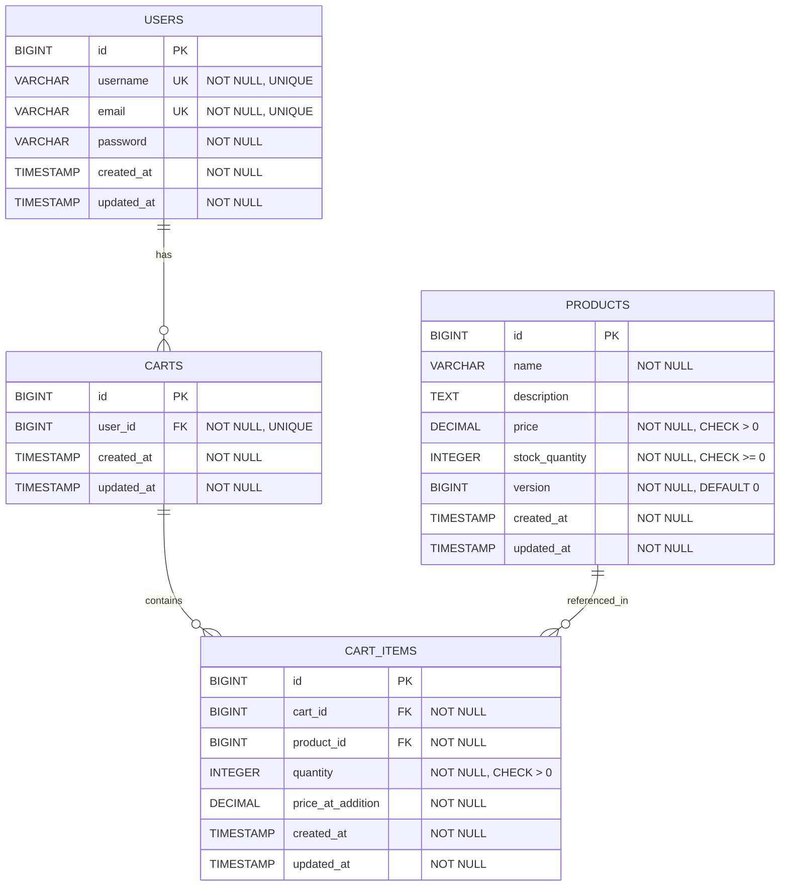

# Low Level Design (LLD) - Shopping Cart Backend Service

## Executive Summary

This document provides a comprehensive Low Level Design for a Shopping Cart Backend Service built using Spring Boot MVC. The service implements a robust e-commerce cart management system with optimistic locking for inventory management, lazy cart creation, and RESTful API endpoints.

### Key Features
- User authentication and management
- Product catalog management with optimistic locking
- Shopping cart operations (add, update, remove items)
- Lazy cart creation pattern
- Concurrent transaction handling
- PostgreSQL database backend

### Technology Stack
- **Framework**: Spring Boot 3.x
- **Architecture**: MVC (Model-View-Controller)
- **Database**: PostgreSQL 14+
- **ORM**: Spring Data JPA / Hibernate
- **Build Tool**: Maven/Gradle
- **Java Version**: 17+

---

## 1. System Architecture Overview

### 1.1 Layered Architecture

The application follows a standard three-tier architecture:

```
┌─────────────────────────────────────┐
│     Presentation Layer              │
│  (REST Controllers)                 │
└─────────────────────────────────────┘
              ↓
┌─────────────────────────────────────┐
│     Business Logic Layer            │
│  (Services)                         │
└─────────────────────────────────────┘
              ↓
┌─────────────────────────────────────┐
│     Data Access Layer               │
│  (Repositories)                     │
└─────────────────────────────────────┘
              ↓
┌─────────────────────────────────────┐
│     Database (PostgreSQL)           │
└─────────────────────────────────────┘
```

---

## 2. Domain Entities

### 2.1 User Entity

**Purpose**: Represents registered users in the system.

**Attributes**:
- `id` (Long): Primary key, auto-generated
- `username` (String): Unique username, not null
- `email` (String): Unique email address, not null
- `password` (String): Encrypted password, not null
- `createdAt` (LocalDateTime): Account creation timestamp
- `updatedAt` (LocalDateTime): Last update timestamp

**Relationships**:
- One-to-One with Cart (one user has one active cart)

### 2.2 Product Entity

**Purpose**: Represents products available for purchase.

**Attributes**:
- `id` (Long): Primary key, auto-generated
- `name` (String): Product name, not null
- `description` (String): Product description
- `price` (BigDecimal): Product price, not null, must be > 0
- `stockQuantity` (Integer): Available inventory, not null, must be >= 0
- `version` (Long): Optimistic locking version field
- `createdAt` (LocalDateTime): Product creation timestamp
- `updatedAt` (LocalDateTime): Last update timestamp

**Relationships**:
- One-to-Many with CartItem (one product can be in many cart items)

### 2.3 Cart Entity

**Purpose**: Represents a user's shopping cart.

**Attributes**:
- `id` (Long): Primary key, auto-generated
- `userId` (Long): Foreign key to User, not null, unique
- `createdAt` (LocalDateTime): Cart creation timestamp
- `updatedAt` (LocalDateTime): Last update timestamp

**Relationships**:
- Many-to-One with User (many carts belong to one user - historical)
- One-to-Many with CartItem (one cart contains many items)

### 2.4 CartItem Entity

**Purpose**: Represents individual items within a shopping cart.

**Attributes**:
- `id` (Long): Primary key, auto-generated
- `cartId` (Long): Foreign key to Cart, not null
- `productId` (Long): Foreign key to Product, not null
- `quantity` (Integer): Item quantity, not null, must be > 0
- `priceAtAddition` (BigDecimal): Price snapshot when added to cart
- `createdAt` (LocalDateTime): Item addition timestamp
- `updatedAt` (LocalDateTime): Last update timestamp

**Relationships**:
- Many-to-One with Cart (many items belong to one cart)
- Many-to-One with Product (many cart items reference one product)

**Constraints**:
- Unique constraint on (cartId, productId) - one product per cart

---

# Technical Artifacts

## Artifact 1: Entity-Relationship Diagram (ERD)



## Artifact 2: Add to Cart Sequence Diagram

```mermaid
sequenceDiagram
    participant Client
    participant CartController
    participant CartService
    participant ProductRepository
    participant CartRepository
    participant Database

    Client->>CartController: POST /api/carts/user/{userId}/items
    activate CartController
    
    CartController->>CartService: addItemToCart(userId, productId, quantity)
    activate CartService
    
    Note over CartService: Begin Transaction
    
    CartService->>CartRepository: findByUserId(userId)
    activate CartRepository
    CartRepository->>Database: SELECT * FROM carts WHERE user_id = ?
    activate Database
    Database-->>CartRepository: null (cart not found)
    deactivate Database
    CartRepository-->>CartService: Optional.empty()
    deactivate CartRepository
    
    Note over CartService: Cart doesn't exist - Lazy Creation
    
    CartService->>CartRepository: save(new Cart(userId))
    activate CartRepository
    CartRepository->>Database: INSERT INTO carts (user_id, created_at, updated_at)
    activate Database
    Database-->>CartRepository: Cart created with id=1
    deactivate Database
    CartRepository-->>CartService: Cart(id=1, userId)
    deactivate CartRepository
    
    CartService->>ProductRepository: findById(productId)
    activate ProductRepository
    ProductRepository->>Database: SELECT * FROM products WHERE id = ? (with version)
    activate Database
    Database-->>ProductRepository: Product(id, name, price, stock=10, version=5)
    deactivate Database
    ProductRepository-->>CartService: Product(stock=10, version=5)
    deactivate ProductRepository
    
    alt Insufficient Stock
        CartService-->>CartController: throw InsufficientStockException
        CartController-->>Client: 409 Conflict
    else Stock Available
        Note over CartService: Stock check passed
        
        CartService->>ProductRepository: save(product with stock=9, version=5)
        activate ProductRepository
        ProductRepository->>Database: UPDATE products SET stock_quantity=9, version=6 WHERE id=? AND version=5
        activate Database
        
        alt Version Mismatch (Concurrent Modification)
            Database-->>ProductRepository: 0 rows updated (version conflict)
            deactivate Database
            ProductRepository-->>CartService: throw OptimisticLockException
            deactivate ProductRepository
            
            Note over CartService: Rollback Transaction
            CartService-->>CartController: throw ConcurrentModificationException
            CartController-->>Client: 409 Conflict - CONCURRENT_MODIFICATION
        else Version Match (Success)
            Database-->>ProductRepository: 1 row updated, version=6
            deactivate Database
            ProductRepository-->>CartService: Product updated successfully
            deactivate ProductRepository
            
            CartService->>CartRepository: saveCartItem(cartId, productId, quantity, price)
            activate CartRepository
            CartRepository->>Database: INSERT INTO cart_items (cart_id, product_id, quantity, price_at_addition)
            activate Database
            Database-->>CartRepository: CartItem created with id=1
            deactivate Database
            CartRepository-->>CartService: CartItem(id=1)
            deactivate CartRepository
            
            Note over CartService: Commit Transaction
            
            CartService-->>CartController: CartItemDTO(id, productId, quantity, price)
            deactivate CartService
            CartController-->>Client: 200 OK - Item added successfully
            deactivate CartController
        end
    end
```

## Artifact 3: Database Model (PostgreSQL DDL)

```sql
-- Shopping Cart Backend Service - Database Schema
-- Database: PostgreSQL 14+

-- Drop tables if they exist (for clean setup)
DROP TABLE IF EXISTS cart_items CASCADE;
DROP TABLE IF EXISTS carts CASCADE;
DROP TABLE IF EXISTS products CASCADE;
DROP TABLE IF EXISTS users CASCADE;

-- Table: USERS
CREATE TABLE users (
    id BIGSERIAL PRIMARY KEY,
    username VARCHAR(50) NOT NULL UNIQUE,
    email VARCHAR(100) NOT NULL UNIQUE,
    password VARCHAR(255) NOT NULL,
    created_at TIMESTAMP NOT NULL DEFAULT CURRENT_TIMESTAMP,
    updated_at TIMESTAMP NOT NULL DEFAULT CURRENT_TIMESTAMP,
    
    CONSTRAINT chk_username_length CHECK (LENGTH(username) >= 3),
    CONSTRAINT chk_email_format CHECK (email ~* '^[A-Za-z0-9._%+-]+@[A-Za-z0-9.-]+\.[A-Za-z]{2,}$')
);

-- Indexes for USERS table
CREATE INDEX idx_users_username ON users(username);
CREATE INDEX idx_users_email ON users(email);
CREATE INDEX idx_users_created_at ON users(created_at);

-- Table: PRODUCTS
CREATE TABLE products (
    id BIGSERIAL PRIMARY KEY,
    name VARCHAR(200) NOT NULL,
    description TEXT,
    price DECIMAL(10, 2) NOT NULL,
    stock_quantity INTEGER NOT NULL DEFAULT 0,
    version BIGINT NOT NULL DEFAULT 0,
    created_at TIMESTAMP NOT NULL DEFAULT CURRENT_TIMESTAMP,
    updated_at TIMESTAMP NOT NULL DEFAULT CURRENT_TIMESTAMP,
    
    CONSTRAINT chk_price_positive CHECK (price > 0),
    CONSTRAINT chk_stock_non_negative CHECK (stock_quantity >= 0),
    CONSTRAINT chk_name_not_empty CHECK (LENGTH(TRIM(name)) > 0)
);

-- Indexes for PRODUCTS table
CREATE INDEX idx_products_name ON products(name);
CREATE INDEX idx_products_price ON products(price);
CREATE INDEX idx_products_stock_quantity ON products(stock_quantity);
CREATE INDEX idx_products_created_at ON products(created_at);

-- Table: CARTS
CREATE TABLE carts (
    id BIGSERIAL PRIMARY KEY,
    user_id BIGINT NOT NULL,
    created_at TIMESTAMP NOT NULL DEFAULT CURRENT_TIMESTAMP,
    updated_at TIMESTAMP NOT NULL DEFAULT CURRENT_TIMESTAMP,
    
    CONSTRAINT fk_carts_user_id 
        FOREIGN KEY (user_id) 
        REFERENCES users(id) 
        ON DELETE CASCADE,
    
    CONSTRAINT uk_carts_user_id UNIQUE (user_id)
);

-- Indexes for CARTS table
CREATE INDEX idx_carts_user_id ON carts(user_id);
CREATE INDEX idx_carts_created_at ON carts(created_at);

-- Table: CART_ITEMS
CREATE TABLE cart_items (
    id BIGSERIAL PRIMARY KEY,
    cart_id BIGINT NOT NULL,
    product_id BIGINT NOT NULL,
    quantity INTEGER NOT NULL,
    price_at_addition DECIMAL(10, 2) NOT NULL,
    created_at TIMESTAMP NOT NULL DEFAULT CURRENT_TIMESTAMP,
    updated_at TIMESTAMP NOT NULL DEFAULT CURRENT_TIMESTAMP,
    
    CONSTRAINT fk_cart_items_cart_id 
        FOREIGN KEY (cart_id) 
        REFERENCES carts(id) 
        ON DELETE CASCADE,
    
    CONSTRAINT fk_cart_items_product_id 
        FOREIGN KEY (product_id) 
        REFERENCES products(id) 
        ON DELETE CASCADE,
    
    CONSTRAINT chk_quantity_positive CHECK (quantity > 0),
    CONSTRAINT chk_price_at_addition_positive CHECK (price_at_addition > 0),
    
    CONSTRAINT uk_cart_items_cart_product UNIQUE (cart_id, product_id)
);

-- Indexes for CART_ITEMS table
CREATE INDEX idx_cart_items_cart_id ON cart_items(cart_id);
CREATE INDEX idx_cart_items_product_id ON cart_items(product_id);
CREATE INDEX idx_cart_items_cart_product ON cart_items(cart_id, product_id);
CREATE INDEX idx_cart_items_created_at ON cart_items(created_at);

-- Function to update updated_at timestamp
CREATE OR REPLACE FUNCTION update_updated_at_column()
RETURNS TRIGGER AS $$
BEGIN
    NEW.updated_at = CURRENT_TIMESTAMP;
    RETURN NEW;
END;
$$ LANGUAGE plpgsql;

-- Triggers for automatic timestamp updates
CREATE TRIGGER trg_users_updated_at
    BEFORE UPDATE ON users
    FOR EACH ROW
    EXECUTE FUNCTION update_updated_at_column();

CREATE TRIGGER trg_products_updated_at
    BEFORE UPDATE ON products
    FOR EACH ROW
    EXECUTE FUNCTION update_updated_at_column();

CREATE TRIGGER trg_carts_updated_at
    BEFORE UPDATE ON carts
    FOR EACH ROW
    EXECUTE FUNCTION update_updated_at_column();

CREATE TRIGGER trg_cart_items_updated_at
    BEFORE UPDATE ON cart_items
    FOR EACH ROW
    EXECUTE FUNCTION update_updated_at_column();

-- Sample Data (Optional - for testing)
INSERT INTO users (username, email, password) VALUES
('john_doe', 'john@example.com', '$2a$10$N9qo8uLOickgx2ZMRZoMyeIjZAgcfl7p92ldGxad68LJZdL17lhWy'),
('jane_smith', 'jane@example.com', '$2a$10$N9qo8uLOickgx2ZMRZoMyeIjZAgcfl7p92ldGxad68LJZdL17lhWy');

INSERT INTO products (name, description, price, stock_quantity) VALUES
('Laptop', 'High-performance laptop with 16GB RAM', 999.99, 50),
('Wireless Mouse', 'Ergonomic wireless mouse with USB receiver', 29.99, 200),
('Mechanical Keyboard', 'RGB mechanical keyboard with blue switches', 89.99, 100),
('USB-C Hub', '7-in-1 USB-C hub with HDMI and ethernet', 49.99, 150),
('Laptop Stand', 'Adjustable aluminum laptop stand', 39.99, 75);
```

---

## Conclusion

This enhanced Low Level Design document provides a comprehensive technical specification for the Shopping Cart Backend Service. The three technical artifacts (ERD, Sequence Diagram, and DDL) offer detailed implementation guidance for database design, API flow, and data integrity management. The design emphasizes:

- **Scalability**: Through proper indexing and optimistic locking
- **Data Integrity**: Via comprehensive constraints and foreign key relationships
- **Concurrency Control**: Using optimistic locking for inventory management
- **Performance**: Through strategic indexing and lazy cart creation
- **Maintainability**: With clear separation of concerns and well-documented schema

This design is production-ready and follows Spring Boot and PostgreSQL best practices for enterprise applications.