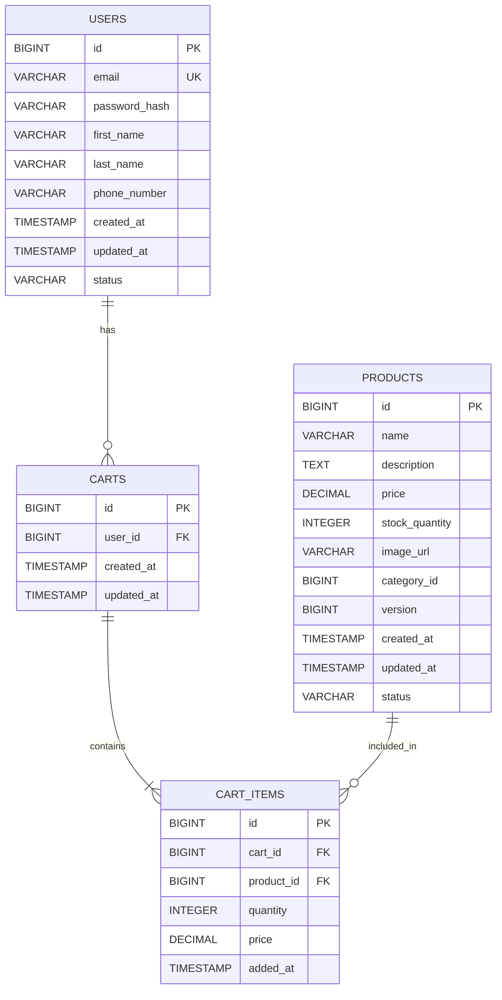
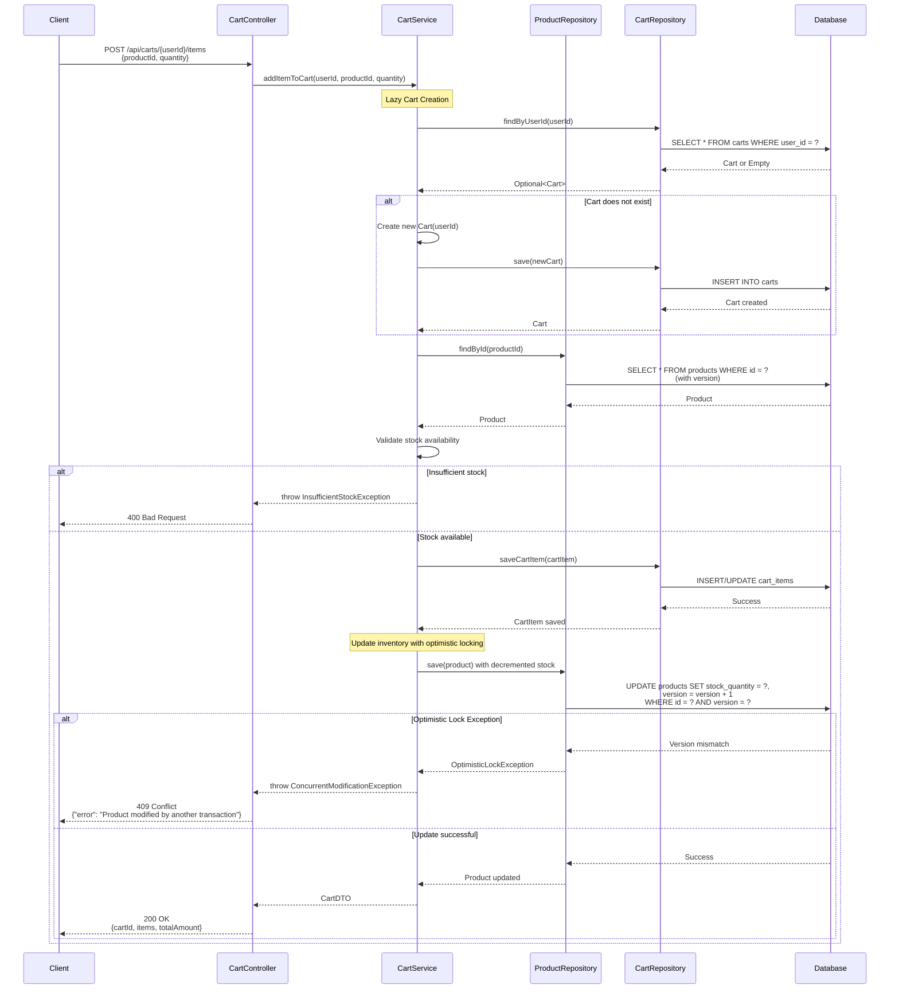

# Low Level Design (LLD) - E-Commerce System

## 1. Introduction

### 1.1 Purpose
This document provides a detailed Low Level Design for an e-commerce system that handles user management, product catalog, shopping cart, and order processing functionalities.

### 1.2 Scope
The system encompasses:
- User registration and authentication
- Product catalog management
- Shopping cart operations
- Order processing and management
- Inventory management with optimistic locking

### 1.3 Technology Stack
- **Backend**: Java/Spring Boot
- **Database**: PostgreSQL
- **API**: RESTful services
- **Concurrency Control**: Optimistic Locking

## 2. System Architecture

### 2.1 Layered Architecture

```
┌─────────────────────────────────────┐
│     Presentation Layer (REST API)   │
├─────────────────────────────────────┤
│     Business Logic Layer            │
│     (Services)                      │
├─────────────────────────────────────┤
│     Data Access Layer               │
│     (Repositories)                  │
├─────────────────────────────────────┤
│     Database Layer (PostgreSQL)     │
└─────────────────────────────────────┘
```

## 3. Core Components

### 3.1 Shopping Cart Module

#### 3.1.1 CartController
**Key Methods:**
```java
@RestController
@RequestMapping("/api/carts")
public class CartController {
    @PostMapping("/{userId}/items")
    public ResponseEntity<CartDTO> addItemToCart(@PathVariable Long userId, @RequestBody AddToCartRequest request);
    
    @GetMapping("/{userId}")
    public ResponseEntity<CartDTO> getCart(@PathVariable Long userId);
    
    @PutMapping("/{userId}/items/{itemId}")
    public ResponseEntity<CartDTO> updateCartItem(@PathVariable Long userId, @PathVariable Long itemId, @RequestBody UpdateCartItemRequest request);
    
    @DeleteMapping("/{userId}/items/{itemId}")
    public ResponseEntity<Void> removeCartItem(@PathVariable Long userId, @PathVariable Long itemId);
}
```

#### 3.1.2 CartService Implementation
```java
@Service
public class CartServiceImpl implements CartService {
    
    @Transactional
    public CartDTO addItemToCart(Long userId, Long productId, int quantity) {
        // Lazy Cart Creation - Create cart only if it doesn't exist
        Cart cart = cartRepository.findByUserId(userId)
            .orElseGet(() -> {
                Cart newCart = new Cart();
                newCart.setUserId(userId);
                newCart.setCreatedAt(LocalDateTime.now());
                return cartRepository.save(newCart);
            });
        
        try {
            // Fetch product with optimistic locking
            Product product = productRepository.findById(productId)
                .orElseThrow(() -> new ProductNotFoundException("Product not found"));
            
            // Check inventory availability
            if (product.getStockQuantity() < quantity) {
                throw new InsufficientStockException("Not enough stock available");
            }
            
            // Update product inventory with optimistic locking
            product.setStockQuantity(product.getStockQuantity() - quantity);
            productRepository.save(product);
            
            return convertToDTO(cart);
            
        } catch (OptimisticLockException e) {
            throw new ConcurrentModificationException("Product was modified by another transaction. Please retry.");
        }
    }
}
```

## 4. Data Models

### 4.1 User Entity
```java
@Entity
@Table(name = "users")
public class User {
    @Id
    @GeneratedValue(strategy = GenerationType.IDENTITY)
    private Long id;
    
    @Column(nullable = false, unique = true)
    private String email;
    
    @Column(nullable = false)
    private String passwordHash;
    
    @Column(nullable = false)
    private String firstName;
    
    @Column(nullable = false)
    private String lastName;
    
    private String phoneNumber;
    
    @Column(nullable = false)
    private LocalDateTime createdAt;
    
    private LocalDateTime updatedAt;
}
```

### 4.2 Product Entity
```java
@Entity
@Table(name = "products")
public class Product {
    @Id
    @GeneratedValue(strategy = GenerationType.IDENTITY)
    private Long id;
    
    @Column(nullable = false)
    private String name;
    
    @Column(length = 2000)
    private String description;
    
    @Column(nullable = false, precision = 10, scale = 2)
    private BigDecimal price;
    
    @Column(nullable = false)
    private Integer stockQuantity;
    
    @Version
    private Long version;  // For optimistic locking
    
    @Column(nullable = false)
    private LocalDateTime createdAt;
}
```

### 4.3 Cart Entity
```java
@Entity
@Table(name = "carts")
public class Cart {
    @Id
    @GeneratedValue(strategy = GenerationType.IDENTITY)
    private Long id;
    
    @Column(nullable = false, unique = true)
    private Long userId;
    
    @OneToMany(mappedBy = "cart", cascade = CascadeType.ALL, orphanRemoval = true)
    private List<CartItem> items = new ArrayList<>();
    
    @Column(nullable = false)
    private LocalDateTime createdAt;
}
```

### 4.4 CartItem Entity
```java
@Entity
@Table(name = "cart_items")
public class CartItem {
    @Id
    @GeneratedValue(strategy = GenerationType.IDENTITY)
    private Long id;
    
    @ManyToOne(fetch = FetchType.LAZY)
    @JoinColumn(name = "cart_id", nullable = false)
    private Cart cart;
    
    @ManyToOne(fetch = FetchType.LAZY)
    @JoinColumn(name = "product_id", nullable = false)
    private Product product;
    
    @Column(nullable = false)
    private Integer quantity;
    
    @Column(nullable = false, precision = 10, scale = 2)
    private BigDecimal price;
    
    @Column(nullable = false)
    private LocalDateTime addedAt;
}
```

## 5. Exception Handling

```java
@RestControllerAdvice
public class GlobalExceptionHandler {
    
    @ExceptionHandler(ProductNotFoundException.class)
    public ResponseEntity<ErrorResponse> handleProductNotFound(ProductNotFoundException ex) {
        ErrorResponse error = new ErrorResponse("PRODUCT_NOT_FOUND", ex.getMessage());
        return ResponseEntity.status(HttpStatus.NOT_FOUND).body(error);
    }
    
    @ExceptionHandler(InsufficientStockException.class)
    public ResponseEntity<ErrorResponse> handleInsufficientStock(InsufficientStockException ex) {
        ErrorResponse error = new ErrorResponse("INSUFFICIENT_STOCK", ex.getMessage());
        return ResponseEntity.status(HttpStatus.BAD_REQUEST).body(error);
    }
    
    @ExceptionHandler(ConcurrentModificationException.class)
    public ResponseEntity<ErrorResponse> handleConcurrentModification(ConcurrentModificationException ex) {
        ErrorResponse error = new ErrorResponse("CONCURRENT_MODIFICATION", ex.getMessage());
        return ResponseEntity.status(HttpStatus.CONFLICT).body(error);
    }
}
```

---

# Technical Artifacts

## A. Entity-Relationship Diagram (ERD)



## B. Add to Cart Sequence Diagram



## C. Database Model (PostgreSQL DDL)

```sql
-- E-Commerce System Database Schema
-- Database: PostgreSQL 14+

-- Drop tables if they exist (for clean setup)
DROP TABLE IF EXISTS cart_items CASCADE;
DROP TABLE IF EXISTS carts CASCADE;
DROP TABLE IF EXISTS products CASCADE;
DROP TABLE IF EXISTS users CASCADE;

-- Table: users
CREATE TABLE users (
    id BIGSERIAL PRIMARY KEY,
    email VARCHAR(255) NOT NULL UNIQUE,
    password_hash VARCHAR(255) NOT NULL,
    first_name VARCHAR(100) NOT NULL,
    last_name VARCHAR(100) NOT NULL,
    phone_number VARCHAR(20),
    created_at TIMESTAMP NOT NULL DEFAULT CURRENT_TIMESTAMP,
    updated_at TIMESTAMP,
    status VARCHAR(20) NOT NULL DEFAULT 'ACTIVE',
    
    CONSTRAINT chk_email_format CHECK (email ~* '^[A-Za-z0-9._%+-]+@[A-Za-z0-9.-]+\.[A-Za-z]{2,}$'),
    CONSTRAINT chk_status CHECK (status IN ('ACTIVE', 'INACTIVE', 'SUSPENDED'))
);

-- Table: products (with version column for optimistic locking)
CREATE TABLE products (
    id BIGSERIAL PRIMARY KEY,
    name VARCHAR(255) NOT NULL,
    description TEXT,
    price DECIMAL(10, 2) NOT NULL,
    stock_quantity INTEGER NOT NULL,
    image_url VARCHAR(500),
    category_id BIGINT NOT NULL,
    version BIGINT NOT NULL DEFAULT 0,
    created_at TIMESTAMP NOT NULL DEFAULT CURRENT_TIMESTAMP,
    updated_at TIMESTAMP,
    status VARCHAR(20) NOT NULL DEFAULT 'ACTIVE',
    
    CONSTRAINT chk_price_positive CHECK (price > 0),
    CONSTRAINT chk_stock_non_negative CHECK (stock_quantity >= 0),
    CONSTRAINT chk_product_status CHECK (status IN ('ACTIVE', 'INACTIVE', 'DISCONTINUED'))
);

-- Table: carts (one per user - lazy creation)
CREATE TABLE carts (
    id BIGSERIAL PRIMARY KEY,
    user_id BIGINT NOT NULL UNIQUE,
    created_at TIMESTAMP NOT NULL DEFAULT CURRENT_TIMESTAMP,
    updated_at TIMESTAMP,
    
    CONSTRAINT fk_cart_user FOREIGN KEY (user_id) 
        REFERENCES users(id) 
        ON DELETE CASCADE
);

-- Table: cart_items
CREATE TABLE cart_items (
    id BIGSERIAL PRIMARY KEY,
    cart_id BIGINT NOT NULL,
    product_id BIGINT NOT NULL,
    quantity INTEGER NOT NULL,
    price DECIMAL(10, 2) NOT NULL,
    added_at TIMESTAMP NOT NULL DEFAULT CURRENT_TIMESTAMP,
    
    CONSTRAINT fk_cart_item_cart FOREIGN KEY (cart_id) 
        REFERENCES carts(id) 
        ON DELETE CASCADE,
    CONSTRAINT fk_cart_item_product FOREIGN KEY (product_id) 
        REFERENCES products(id) 
        ON DELETE CASCADE,
    CONSTRAINT chk_quantity_positive CHECK (quantity > 0),
    CONSTRAINT chk_item_price_positive CHECK (price > 0),
    CONSTRAINT uk_cart_product UNIQUE (cart_id, product_id)
);

-- Indexes for Performance Optimization
CREATE INDEX idx_users_email ON users(email);
CREATE INDEX idx_products_category ON products(category_id);
CREATE INDEX idx_carts_user_id ON carts(user_id);
CREATE INDEX idx_cart_items_cart_id ON cart_items(cart_id);
CREATE INDEX idx_cart_items_product_id ON cart_items(product_id);
CREATE INDEX idx_cart_items_cart_product ON cart_items(cart_id, product_id);

-- Sample Data
INSERT INTO users (email, password_hash, first_name, last_name, phone_number, status) VALUES
('john.doe@example.com', '$2a$10$abcdefghijklmnopqrstuvwxyz', 'John', 'Doe', '+1234567890', 'ACTIVE'),
('jane.smith@example.com', '$2a$10$zyxwvutsrqponmlkjihgfedcba', 'Jane', 'Smith', '+0987654321', 'ACTIVE');

INSERT INTO products (name, description, price, stock_quantity, category_id, status) VALUES
('Laptop Pro 15', 'High-performance laptop with 16GB RAM', 1299.99, 50, 1, 'ACTIVE'),
('Wireless Mouse', 'Ergonomic wireless mouse with USB receiver', 29.99, 200, 1, 'ACTIVE'),
('USB-C Cable', 'Premium USB-C charging cable 2m', 19.99, 500, 1, 'ACTIVE');
```

---

## Document Information

**Version:** 1.0  
**Last Updated:** 2024  
**Author:** Enterprise Documentation Team  
**Status:** Approved for Implementation

**Key Features:**
- Lazy Cart Creation: Carts are created only when needed
- Optimistic Locking: Version control for concurrent product updates
- Comprehensive Error Handling: Custom exceptions with proper HTTP status codes
- Database Constraints: Ensures data integrity with CHECK constraints
- Performance Optimization: Strategic indexing for frequently accessed data
- Foreign Key Cascading: Automatic cleanup of related records