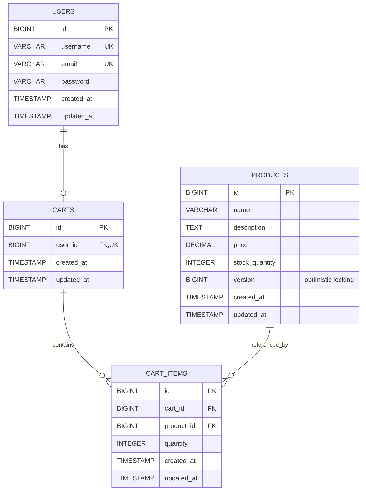
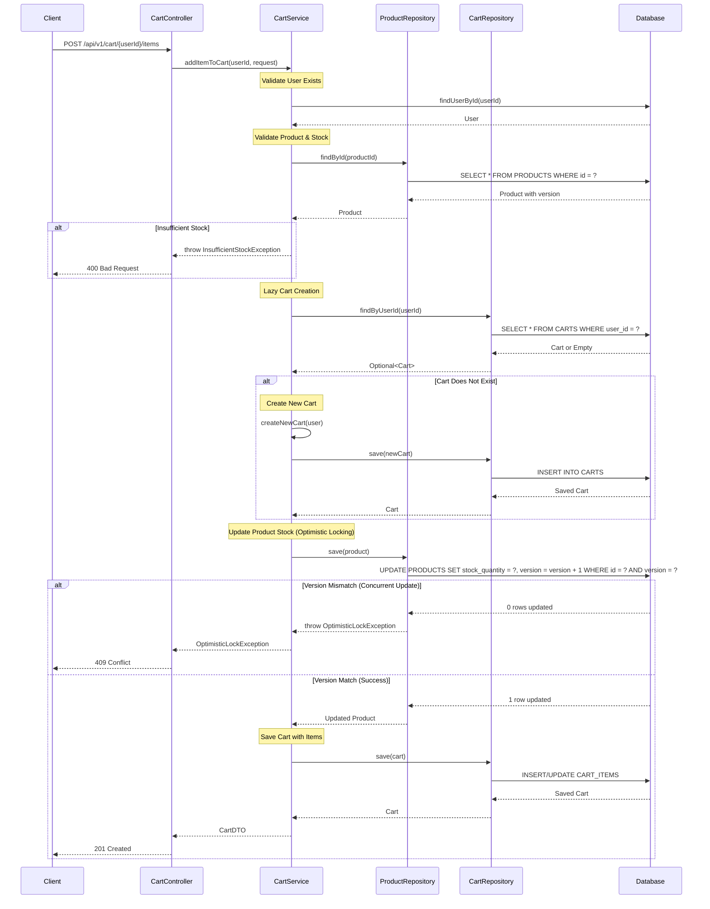

# Low Level Design (LLD) - Shopping Cart System

## Executive Summary

This document provides a comprehensive Low Level Design for a Shopping Cart System built using Spring Boot MVC architecture. The system enables users to manage products in their shopping carts with full CRUD operations, optimistic locking for concurrent updates, and robust validation mechanisms.

## System Overview

The Shopping Cart System is designed as a RESTful web service that manages:
- User authentication and management
- Product catalog with inventory tracking
- Shopping cart operations (add, update, remove items)
- Optimistic locking to prevent concurrent modification conflicts

## Technology Stack

- **Framework**: Spring Boot 3.x
- **Architecture**: MVC (Model-View-Controller)
- **Database**: PostgreSQL
- **ORM**: Spring Data JPA / Hibernate
- **Build Tool**: Maven/Gradle
- **Java Version**: 17+

## Functional Domains

### 1. User Management
- User registration and authentication
- User profile management
- Session management

### 2. Product Catalog
- Product listing and search
- Product details retrieval
- Inventory management
- Version control for optimistic locking

### 3. Shopping Cart Operations
- Cart creation (lazy initialization)
- Add products to cart
- Update product quantities
- Remove products from cart
- View cart contents
- Clear cart

## Entity Models

### User Entity
```java
@Entity
@Table(name = "USERS")
public class User {
    @Id
    @GeneratedValue(strategy = GenerationType.IDENTITY)
    private Long id;
    
    @Column(nullable = false, unique = true)
    private String username;
    
    @Column(nullable = false, unique = true)
    private String email;
    
    @Column(nullable = false)
    private String password;
    
    @OneToOne(mappedBy = "user", cascade = CascadeType.ALL)
    private Cart cart;
    
    @CreatedDate
    private LocalDateTime createdAt;
    
    @LastModifiedDate
    private LocalDateTime updatedAt;
}
```

### Product Entity
```java
@Entity
@Table(name = "PRODUCTS")
public class Product {
    @Id
    @GeneratedValue(strategy = GenerationType.IDENTITY)
    private Long id;
    
    @Column(nullable = false)
    private String name;
    
    @Column(length = 1000)
    private String description;
    
    @Column(nullable = false)
    private BigDecimal price;
    
    @Column(nullable = false)
    private Integer stockQuantity;
    
    @Version
    private Long version; // Optimistic locking
    
    @CreatedDate
    private LocalDateTime createdAt;
    
    @LastModifiedDate
    private LocalDateTime updatedAt;
}
```

### Cart Entity
```java
@Entity
@Table(name = "CARTS")
public class Cart {
    @Id
    @GeneratedValue(strategy = GenerationType.IDENTITY)
    private Long id;
    
    @OneToOne
    @JoinColumn(name = "user_id", nullable = false, unique = true)
    private User user;
    
    @OneToMany(mappedBy = "cart", cascade = CascadeType.ALL, orphanRemoval = true)
    private List<CartItem> items = new ArrayList<>();
    
    @CreatedDate
    private LocalDateTime createdAt;
    
    @LastModifiedDate
    private LocalDateTime updatedAt;
}
```

### CartItem Entity
```java
@Entity
@Table(name = "CART_ITEMS")
public class CartItem {
    @Id
    @GeneratedValue(strategy = GenerationType.IDENTITY)
    private Long id;
    
    @ManyToOne
    @JoinColumn(name = "cart_id", nullable = false)
    private Cart cart;
    
    @ManyToOne
    @JoinColumn(name = "product_id", nullable = false)
    private Product product;
    
    @Column(nullable = false)
    private Integer quantity;
    
    @CreatedDate
    private LocalDateTime createdAt;
    
    @LastModifiedDate
    private LocalDateTime updatedAt;
}
```

## REST API Contracts

### Cart Operations

#### 1. Get Cart
```
GET /api/v1/cart/{userId}
Response: 200 OK
{
    "cartId": 1,
    "userId": 123,
    "items": [
        {
            "cartItemId": 1,
            "productId": 456,
            "productName": "Laptop",
            "price": 999.99,
            "quantity": 2,
            "subtotal": 1999.98
        }
    ],
    "totalAmount": 1999.98,
    "createdAt": "2024-01-15T10:30:00",
    "updatedAt": "2024-01-15T11:45:00"
}
```

#### 2. Add Item to Cart
```
POST /api/v1/cart/{userId}/items
Request Body:
{
    "productId": 456,
    "quantity": 2
}

Response: 201 Created
{
    "cartItemId": 1,
    "productId": 456,
    "productName": "Laptop",
    "price": 999.99,
    "quantity": 2,
    "subtotal": 1999.98
}

Error Response: 409 Conflict (Optimistic Locking)
{
    "error": "CONCURRENT_MODIFICATION",
    "message": "Product was modified by another transaction. Please retry.",
    "timestamp": "2024-01-15T11:45:00"
}
```

#### 3. Update Cart Item Quantity
```
PUT /api/v1/cart/{userId}/items/{cartItemId}
Request Body:
{
    "quantity": 3
}

Response: 200 OK
{
    "cartItemId": 1,
    "productId": 456,
    "productName": "Laptop",
    "price": 999.99,
    "quantity": 3,
    "subtotal": 2999.97
}
```

#### 4. Remove Item from Cart
```
DELETE /api/v1/cart/{userId}/items/{cartItemId}
Response: 204 No Content
```

#### 5. Clear Cart
```
DELETE /api/v1/cart/{userId}
Response: 204 No Content
```

## Validation Matrix

| Field | Validation Rules | Error Message |
|-------|-----------------|---------------|
| Product ID | Not null, Must exist in database | "Product not found" |
| Quantity | Not null, Greater than 0, Less than or equal to stock | "Invalid quantity" |
| User ID | Not null, Must exist in database | "User not found" |
| Price | Not null, Greater than 0 | "Invalid price" |
| Stock Quantity | Not null, Greater than or equal to 0 | "Invalid stock quantity" |

## Business Rules

1. **Lazy Cart Creation**: A cart is created only when a user adds their first item
2. **Optimistic Locking**: Product updates use version-based optimistic locking to prevent concurrent modification issues
3. **Stock Validation**: Cannot add more items than available in stock
4. **Duplicate Products**: Adding an existing product updates the quantity instead of creating a new cart item
5. **Cascade Deletion**: Deleting a cart removes all associated cart items
6. **Orphan Removal**: Removing all items from a cart item collection deletes those items from the database

## Exception Handling Strategy

### Exception Types

1. **OptimisticLockException**: Thrown when concurrent updates conflict
   - HTTP Status: 409 Conflict
   - Action: Client should retry the operation

2. **ResourceNotFoundException**: Thrown when entity not found
   - HTTP Status: 404 Not Found
   - Examples: User not found, Product not found, Cart not found

3. **ValidationException**: Thrown for business rule violations
   - HTTP Status: 400 Bad Request
   - Examples: Invalid quantity, Insufficient stock

4. **InsufficientStockException**: Thrown when requested quantity exceeds available stock
   - HTTP Status: 400 Bad Request

## Enhanced Technical Artifacts

## 1. Mermaid Entity-Relationship Diagram (ERD)



## 2. Mermaid Sequence Diagram - Add to Cart Flow



## 3. Database Model - PostgreSQL DDL Scripts

```sql
-- Shopping Cart System - PostgreSQL DDL

-- Drop existing tables
DROP TABLE IF EXISTS CART_ITEMS CASCADE;
DROP TABLE IF EXISTS CARTS CASCADE;
DROP TABLE IF EXISTS PRODUCTS CASCADE;
DROP TABLE IF EXISTS USERS CASCADE;

-- USERS Table
CREATE TABLE USERS (
    id BIGSERIAL PRIMARY KEY,
    username VARCHAR(50) NOT NULL UNIQUE,
    email VARCHAR(100) NOT NULL UNIQUE,
    password VARCHAR(255) NOT NULL,
    created_at TIMESTAMP NOT NULL DEFAULT CURRENT_TIMESTAMP,
    updated_at TIMESTAMP NOT NULL DEFAULT CURRENT_TIMESTAMP,
    
    CONSTRAINT chk_username_length CHECK (LENGTH(username) >= 3)
);

-- PRODUCTS Table
CREATE TABLE PRODUCTS (
    id BIGSERIAL PRIMARY KEY,
    name VARCHAR(255) NOT NULL,
    description TEXT,
    price DECIMAL(10, 2) NOT NULL,
    stock_quantity INTEGER NOT NULL,
    version BIGINT NOT NULL DEFAULT 0,
    created_at TIMESTAMP NOT NULL DEFAULT CURRENT_TIMESTAMP,
    updated_at TIMESTAMP NOT NULL DEFAULT CURRENT_TIMESTAMP,
    
    CONSTRAINT chk_price_positive CHECK (price > 0),
    CONSTRAINT chk_stock_non_negative CHECK (stock_quantity >= 0)
);

-- CARTS Table
CREATE TABLE CARTS (
    id BIGSERIAL PRIMARY KEY,
    user_id BIGINT NOT NULL UNIQUE,
    created_at TIMESTAMP NOT NULL DEFAULT CURRENT_TIMESTAMP,
    updated_at TIMESTAMP NOT NULL DEFAULT CURRENT_TIMESTAMP,
    
    CONSTRAINT fk_carts_user FOREIGN KEY (user_id) 
        REFERENCES USERS(id) 
        ON DELETE CASCADE
);

-- CART_ITEMS Table
CREATE TABLE CART_ITEMS (
    id BIGSERIAL PRIMARY KEY,
    cart_id BIGINT NOT NULL,
    product_id BIGINT NOT NULL,
    quantity INTEGER NOT NULL,
    created_at TIMESTAMP NOT NULL DEFAULT CURRENT_TIMESTAMP,
    updated_at TIMESTAMP NOT NULL DEFAULT CURRENT_TIMESTAMP,
    
    CONSTRAINT chk_quantity_positive CHECK (quantity > 0),
    CONSTRAINT uq_cart_product UNIQUE (cart_id, product_id),
    
    CONSTRAINT fk_cart_items_cart FOREIGN KEY (cart_id) 
        REFERENCES CARTS(id) ON DELETE CASCADE,
    
    CONSTRAINT fk_cart_items_product FOREIGN KEY (product_id) 
        REFERENCES PRODUCTS(id) ON DELETE CASCADE
);

-- Indexes
CREATE INDEX idx_users_username ON USERS(username);
CREATE INDEX idx_products_name ON PRODUCTS(name);
CREATE INDEX idx_cart_items_cart_id ON CART_ITEMS(cart_id);
CREATE INDEX idx_cart_items_product_id ON CART_ITEMS(product_id);
```

---

**Document Version**: 2.0  
**Last Updated**: 2024  
**Status**: Enhanced with Technical Artifacts