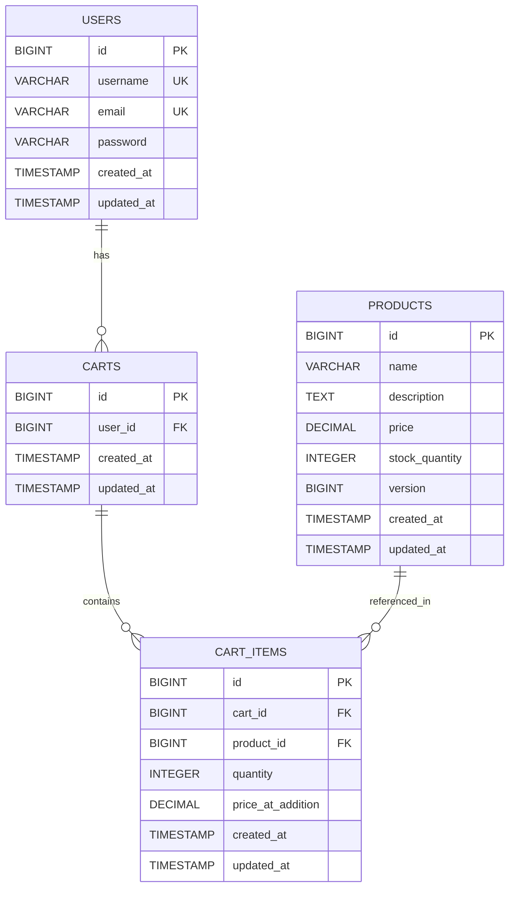
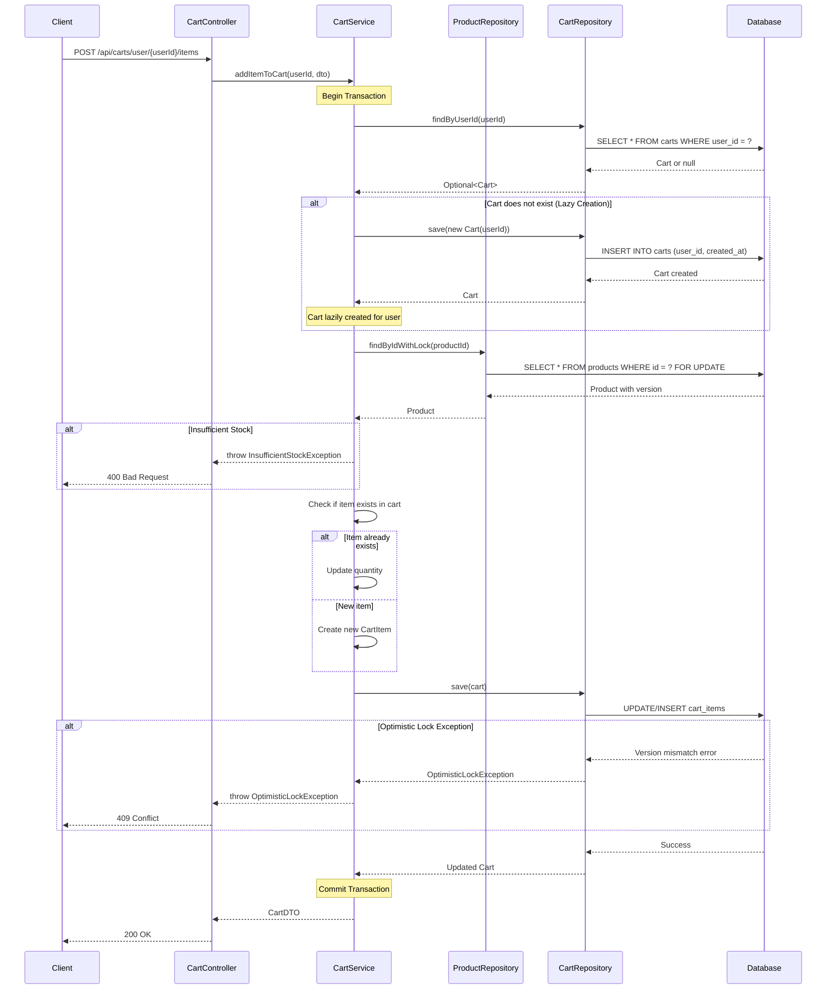

# Low Level Design (LLD) - Shopping Cart System

## 1. System Overview

This document provides a comprehensive Low Level Design for a Shopping Cart System built using Java Spring Boot MVC architecture. The system manages user authentication, product catalog, and shopping cart operations with a focus on scalability, security, and data consistency.

## 2. Technology Stack

- **Backend Framework**: Java Spring Boot 3.x
- **Architecture Pattern**: MVC (Model-View-Controller)
- **Database**: PostgreSQL 14+
- **ORM**: Spring Data JPA / Hibernate
- **Build Tool**: Maven
- **Java Version**: Java 17+

## 3. System Architecture

### 3.1 Layered Architecture

```
┌─────────────────────────────────────┐
│     Presentation Layer              │
│  (REST Controllers)                 │
└─────────────────────────────────────┘
              ↓
┌─────────────────────────────────────┐
│     Service Layer                   │
│  (Business Logic)                   │
└─────────────────────────────────────┘
              ↓
┌─────────────────────────────────────┐
│     Data Access Layer               │
│  (Repositories)                     │
└─────────────────────────────────────┘
              ↓
┌─────────────────────────────────────┐
│     Database Layer                  │
│  (PostgreSQL)                       │
└─────────────────────────────────────┘
```

## 4. Domain Model

### 4.1 Core Entities

#### 4.1.1 User Entity

**Purpose**: Represents system users with authentication credentials.

**Attributes**:
- `id` (Long): Primary key, auto-generated
- `username` (String): Unique username, max 50 characters
- `email` (String): Unique email address, max 100 characters
- `password` (String): Encrypted password, max 255 characters
- `createdAt` (LocalDateTime): Account creation timestamp
- `updatedAt` (LocalDateTime): Last update timestamp

**Relationships**:
- One-to-One with Cart (one user has one active cart)

#### 4.1.2 Product Entity

**Purpose**: Represents products available in the catalog.

**Attributes**:
- `id` (Long): Primary key, auto-generated
- `name` (String): Product name, max 200 characters
- `description` (String): Product description, max 1000 characters
- `price` (BigDecimal): Product price, precision 10, scale 2
- `stockQuantity` (Integer): Available stock quantity
- `version` (Long): Optimistic locking version field
- `createdAt` (LocalDateTime): Product creation timestamp
- `updatedAt` (LocalDateTime): Last update timestamp

**Relationships**:
- One-to-Many with CartItem (one product can be in multiple cart items)

#### 4.1.3 Cart Entity

**Purpose**: Represents a user's shopping cart.

**Attributes**:
- `id` (Long): Primary key, auto-generated
- `userId` (Long): Foreign key to User
- `createdAt` (LocalDateTime): Cart creation timestamp
- `updatedAt` (LocalDateTime): Last update timestamp

**Relationships**:
- Many-to-One with User (many carts belong to one user over time)
- One-to-Many with CartItem (one cart contains multiple items)

#### 4.1.4 CartItem Entity

**Purpose**: Represents individual items within a shopping cart.

**Attributes**:
- `id` (Long): Primary key, auto-generated
- `cartId` (Long): Foreign key to Cart
- `productId` (Long): Foreign key to Product
- `quantity` (Integer): Quantity of the product
- `priceAtAddition` (BigDecimal): Price when added to cart
- `createdAt` (LocalDateTime): Item addition timestamp
- `updatedAt` (LocalDateTime): Last update timestamp

**Relationships**:
- Many-to-One with Cart (many items belong to one cart)
- Many-to-One with Product (many cart items reference one product)

---

# Enhanced Technical Artifacts

## Artifact 1: Entity-Relationship Diagram (ERD)



## Artifact 2: Add to Cart Sequence Diagram



## Artifact 3: Database Model (PostgreSQL DDL)

```sql
-- Shopping Cart System - PostgreSQL DDL

-- Drop tables if they exist
DROP TABLE IF EXISTS cart_items CASCADE;
DROP TABLE IF EXISTS carts CASCADE;
DROP TABLE IF EXISTS products CASCADE;
DROP TABLE IF EXISTS users CASCADE;

-- Table: USERS
CREATE TABLE users (
    id BIGSERIAL PRIMARY KEY,
    username VARCHAR(50) NOT NULL UNIQUE,
    email VARCHAR(100) NOT NULL UNIQUE,
    password VARCHAR(255) NOT NULL,
    created_at TIMESTAMP NOT NULL DEFAULT CURRENT_TIMESTAMP,
    updated_at TIMESTAMP NOT NULL DEFAULT CURRENT_TIMESTAMP,
    
    CONSTRAINT chk_username_length CHECK (LENGTH(username) >= 3),
    CONSTRAINT chk_email_format CHECK (email ~* '^[A-Za-z0-9._%+-]+@[A-Za-z0-9.-]+\\.[A-Za-z]{2,}$')
);

CREATE INDEX idx_users_username ON users(username);
CREATE INDEX idx_users_email ON users(email);

-- Table: PRODUCTS
CREATE TABLE products (
    id BIGSERIAL PRIMARY KEY,
    name VARCHAR(200) NOT NULL,
    description TEXT,
    price DECIMAL(10, 2) NOT NULL,
    stock_quantity INTEGER NOT NULL DEFAULT 0,
    version BIGINT NOT NULL DEFAULT 0,
    created_at TIMESTAMP NOT NULL DEFAULT CURRENT_TIMESTAMP,
    updated_at TIMESTAMP NOT NULL DEFAULT CURRENT_TIMESTAMP,
    
    CONSTRAINT chk_price_positive CHECK (price > 0),
    CONSTRAINT chk_stock_non_negative CHECK (stock_quantity >= 0),
    CONSTRAINT chk_name_not_empty CHECK (LENGTH(TRIM(name)) > 0)
);

CREATE INDEX idx_products_name ON products(name);
CREATE INDEX idx_products_price ON products(price);

-- Table: CARTS
CREATE TABLE carts (
    id BIGSERIAL PRIMARY KEY,
    user_id BIGINT NOT NULL,
    created_at TIMESTAMP NOT NULL DEFAULT CURRENT_TIMESTAMP,
    updated_at TIMESTAMP NOT NULL DEFAULT CURRENT_TIMESTAMP,
    
    CONSTRAINT fk_carts_user FOREIGN KEY (user_id) 
        REFERENCES users(id) 
        ON DELETE CASCADE
);

CREATE INDEX idx_carts_user_id ON carts(user_id);

-- Table: CART_ITEMS
CREATE TABLE cart_items (
    id BIGSERIAL PRIMARY KEY,
    cart_id BIGINT NOT NULL,
    product_id BIGINT NOT NULL,
    quantity INTEGER NOT NULL,
    price_at_addition DECIMAL(10, 2) NOT NULL,
    created_at TIMESTAMP NOT NULL DEFAULT CURRENT_TIMESTAMP,
    updated_at TIMESTAMP NOT NULL DEFAULT CURRENT_TIMESTAMP,
    
    CONSTRAINT fk_cart_items_cart FOREIGN KEY (cart_id) 
        REFERENCES carts(id) 
        ON DELETE CASCADE,
    
    CONSTRAINT fk_cart_items_product FOREIGN KEY (product_id) 
        REFERENCES products(id) 
        ON DELETE CASCADE,
    
    CONSTRAINT chk_quantity_positive CHECK (quantity > 0),
    CONSTRAINT chk_price_at_addition_positive CHECK (price_at_addition > 0),
    
    CONSTRAINT uk_cart_product UNIQUE (cart_id, product_id)
);

CREATE INDEX idx_cart_items_cart_id ON cart_items(cart_id);
CREATE INDEX idx_cart_items_product_id ON cart_items(product_id);
CREATE INDEX idx_cart_items_cart_product ON cart_items(cart_id, product_id);
```