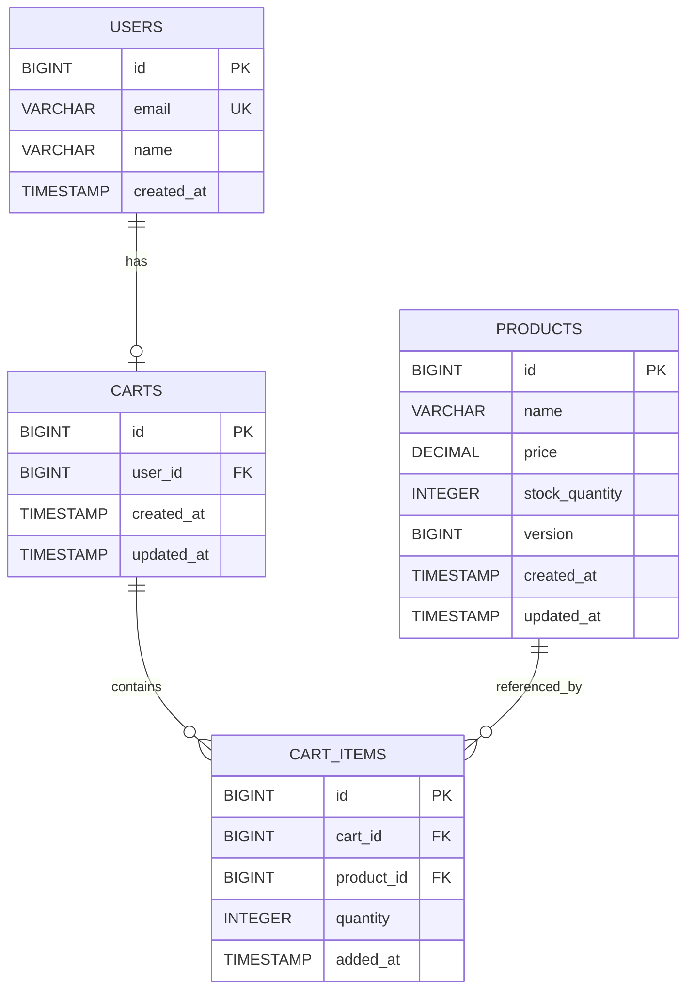
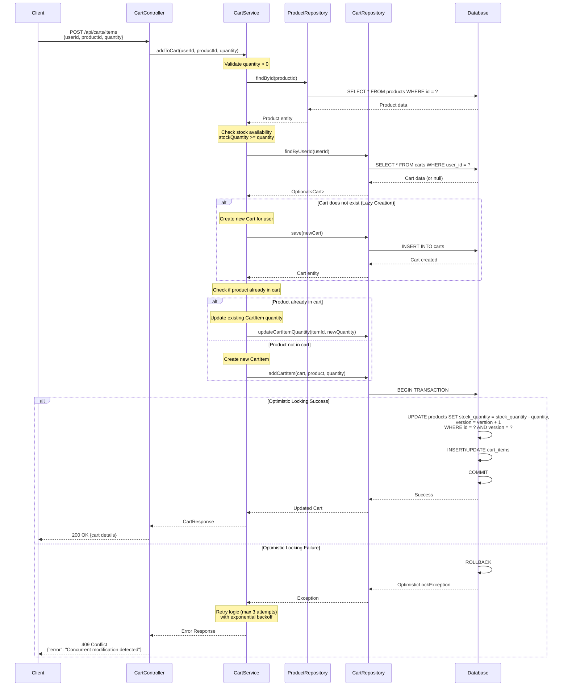

# Low Level Design (LLD) - E-Commerce Cart Management System

## 1. Overview

This document provides the Low Level Design for the E-Commerce Cart Management System. The system enables users to manage shopping carts, add/remove products, and maintain cart state across sessions.

## 2. System Architecture

### 2.1 Technology Stack
- **Backend Framework**: Spring Boot 3.x
- **Database**: PostgreSQL 15+
- **ORM**: Spring Data JPA / Hibernate
- **API Style**: RESTful
- **Authentication**: JWT-based (assumed)

### 2.2 Core Components

#### 2.2.1 Controller Layer
- `CartController`: Handles HTTP requests for cart operations
- Endpoints:
  - `POST /api/carts/items` - Add item to cart
  - `GET /api/carts/{userId}` - Retrieve user's cart
  - `PUT /api/carts/items/{itemId}` - Update cart item quantity
  - `DELETE /api/carts/items/{itemId}` - Remove item from cart
  - `DELETE /api/carts/{cartId}` - Clear entire cart

#### 2.2.2 Service Layer
- `CartService`: Business logic for cart operations
- `ProductService`: Product validation and inventory checks
- Key Methods:
  - `addToCart(userId, productId, quantity)`
  - `getCartByUserId(userId)`
  - `updateCartItemQuantity(itemId, quantity)`
  - `removeCartItem(itemId)`
  - `clearCart(cartId)`

#### 2.2.3 Repository Layer
- `CartRepository`: JPA repository for Cart entity
- `CartItemRepository`: JPA repository for CartItem entity
- `ProductRepository`: JPA repository for Product entity
- `UserRepository`: JPA repository for User entity

#### 2.2.4 Entity Layer
- `User`: User account information
- `Product`: Product catalog details
- `Cart`: Shopping cart container
- `CartItem`: Individual items in cart

## 3. Data Model

### 3.1 Entity Definitions

#### User Entity
```java
@Entity
@Table(name = "users")
public class User {
    @Id
    @GeneratedValue(strategy = GenerationType.IDENTITY)
    private Long id;
    
    @Column(nullable = false, unique = true)
    private String email;
    
    @Column(nullable = false)
    private String name;
    
    @OneToOne(mappedBy = "user", cascade = CascadeType.ALL)
    private Cart cart;
}
```

#### Product Entity
```java
@Entity
@Table(name = "products")
public class Product {
    @Id
    @GeneratedValue(strategy = GenerationType.IDENTITY)
    private Long id;
    
    @Column(nullable = false)
    private String name;
    
    @Column(nullable = false)
    private BigDecimal price;
    
    @Column(nullable = false)
    private Integer stockQuantity;
    
    @Version
    private Long version; // For optimistic locking
}
```

#### Cart Entity
```java
@Entity
@Table(name = "carts")
public class Cart {
    @Id
    @GeneratedValue(strategy = GenerationType.IDENTITY)
    private Long id;
    
    @OneToOne
    @JoinColumn(name = "user_id", nullable = false, unique = true)
    private User user;
    
    @OneToMany(mappedBy = "cart", cascade = CascadeType.ALL, orphanRemoval = true)
    private List<CartItem> items = new ArrayList<>();
    
    @Column(nullable = false)
    private LocalDateTime createdAt;
    
    @Column(nullable = false)
    private LocalDateTime updatedAt;
}
```

#### CartItem Entity
```java
@Entity
@Table(name = "cart_items")
public class CartItem {
    @Id
    @GeneratedValue(strategy = GenerationType.IDENTITY)
    private Long id;
    
    @ManyToOne
    @JoinColumn(name = "cart_id", nullable = false)
    private Cart cart;
    
    @ManyToOne
    @JoinColumn(name = "product_id", nullable = false)
    private Product product;
    
    @Column(nullable = false)
    private Integer quantity;
    
    @Column(nullable = false)
    private LocalDateTime addedAt;
}
```

## 4. Business Logic

### 4.1 Add to Cart Flow

**Lazy Cart Creation Strategy**:
1. Check if user has an existing cart
2. If no cart exists, create a new cart for the user
3. Validate product exists and has sufficient stock
4. Check if product already exists in cart
   - If exists: Update quantity
   - If new: Create new cart item
5. Apply optimistic locking on product to prevent overselling
6. Save cart and return updated cart state

**Optimistic Locking Implementation**:
- Use `@Version` annotation on Product entity
- Handle `OptimisticLockException` when concurrent updates occur
- Retry logic with exponential backoff (max 3 attempts)

### 4.2 Validation Rules

- Quantity must be greater than 0
- Product must be in stock
- User must be authenticated
- Cart item quantity cannot exceed product stock
- Maximum items per cart: 100 (configurable)

### 4.3 Error Handling

- `ProductNotFoundException`: Product ID not found
- `InsufficientStockException`: Requested quantity exceeds available stock
- `CartItemNotFoundException`: Cart item ID not found
- `OptimisticLockException`: Concurrent modification detected
- `InvalidQuantityException`: Quantity <= 0 or exceeds limits

## 5. API Specifications

### 5.1 Add Item to Cart

**Endpoint**: `POST /api/carts/items`

**Request Body**:
```json
{
  "userId": 1,
  "productId": 101,
  "quantity": 2
}
```

**Response** (200 OK):
```json
{
  "cartId": 1,
  "userId": 1,
  "items": [
    {
      "itemId": 1,
      "productId": 101,
      "productName": "Laptop",
      "price": 999.99,
      "quantity": 2,
      "subtotal": 1999.98
    }
  ],
  "totalItems": 2,
  "totalPrice": 1999.98,
  "updatedAt": "2024-01-15T10:30:00Z"
}
```

### 5.2 Get Cart

**Endpoint**: `GET /api/carts/{userId}`

**Response** (200 OK):
```json
{
  "cartId": 1,
  "userId": 1,
  "items": [...],
  "totalItems": 5,
  "totalPrice": 2999.95,
  "createdAt": "2024-01-15T09:00:00Z",
  "updatedAt": "2024-01-15T10:30:00Z"
}
```

## 6. Performance Considerations

### 6.1 Database Indexing
- Index on `carts.user_id` for fast cart lookup
- Index on `cart_items.cart_id` for efficient item retrieval
- Index on `cart_items.product_id` for product-based queries
- Composite index on `(cart_id, product_id)` for duplicate detection

### 6.2 Caching Strategy
- Cache product details (Redis) with 1-hour TTL
- Cache user cart summary with 5-minute TTL
- Invalidate cache on cart modifications

### 6.3 Concurrency Control
- Optimistic locking on Product entity (version column)
- Pessimistic locking for critical stock updates (if needed)
- Transaction isolation level: READ_COMMITTED

## 7. Security Considerations

- Validate user ownership of cart before modifications
- Sanitize all input parameters
- Rate limiting on cart operations (100 requests/minute per user)
- SQL injection prevention via parameterized queries (JPA)
- CSRF protection on state-changing operations

## 8. Monitoring and Logging

### 8.1 Logging Points
- Cart creation events
- Item addition/removal with user and product IDs
- Optimistic lock failures
- Stock validation failures
- Performance metrics for database queries

### 8.2 Metrics
- Average cart size
- Cart abandonment rate
- Add-to-cart success rate
- Optimistic lock retry rate
- API response times (p50, p95, p99)

---

## 9. Technical Artifacts

### 9.1 Entity-Relationship Diagram (ERD)



### 9.2 Add to Cart Sequence Diagram



### 9.3 Database Model (PostgreSQL DDL)

```sql
-- ============================================
-- E-Commerce Cart Management System
-- PostgreSQL Database Schema
-- ============================================

-- Drop existing tables (for clean setup)
DROP TABLE IF EXISTS cart_items CASCADE;
DROP TABLE IF EXISTS carts CASCADE;
DROP TABLE IF EXISTS products CASCADE;
DROP TABLE IF EXISTS users CASCADE;

-- ============================================
-- Table: users
-- ============================================
CREATE TABLE users (
    id BIGSERIAL PRIMARY KEY,
    email VARCHAR(255) NOT NULL UNIQUE,
    name VARCHAR(255) NOT NULL,
    password_hash VARCHAR(255) NOT NULL,
    created_at TIMESTAMP NOT NULL DEFAULT CURRENT_TIMESTAMP,
    updated_at TIMESTAMP NOT NULL DEFAULT CURRENT_TIMESTAMP,
    
    CONSTRAINT chk_email_format CHECK (email ~* '^[A-Za-z0-9._%+-]+@[A-Za-z0-9.-]+\.[A-Za-z]{2,}$')
);

COMMENT ON TABLE users IS 'Stores user account information';
COMMENT ON COLUMN users.email IS 'Unique email address for user authentication';
COMMENT ON COLUMN users.password_hash IS 'Bcrypt hashed password';

-- ============================================
-- Table: products
-- ============================================
CREATE TABLE products (
    id BIGSERIAL PRIMARY KEY,
    name VARCHAR(500) NOT NULL,
    description TEXT,
    price DECIMAL(10, 2) NOT NULL,
    stock_quantity INTEGER NOT NULL DEFAULT 0,
    version BIGINT NOT NULL DEFAULT 0,
    created_at TIMESTAMP NOT NULL DEFAULT CURRENT_TIMESTAMP,
    updated_at TIMESTAMP NOT NULL DEFAULT CURRENT_TIMESTAMP,
    
    CONSTRAINT chk_price_positive CHECK (price >= 0),
    CONSTRAINT chk_stock_non_negative CHECK (stock_quantity >= 0)
);

COMMENT ON TABLE products IS 'Product catalog with inventory tracking';
COMMENT ON COLUMN products.version IS 'Optimistic locking version number';
COMMENT ON COLUMN products.stock_quantity IS 'Available inventory count';

-- ============================================
-- Table: carts
-- ============================================
CREATE TABLE carts (
    id BIGSERIAL PRIMARY KEY,
    user_id BIGINT NOT NULL UNIQUE,
    created_at TIMESTAMP NOT NULL DEFAULT CURRENT_TIMESTAMP,
    updated_at TIMESTAMP NOT NULL DEFAULT CURRENT_TIMESTAMP,
    
    CONSTRAINT fk_cart_user FOREIGN KEY (user_id) 
        REFERENCES users(id) 
        ON DELETE CASCADE
);

COMMENT ON TABLE carts IS 'Shopping cart container for each user';
COMMENT ON COLUMN carts.user_id IS 'One-to-one relationship with users table';

-- ============================================
-- Table: cart_items
-- ============================================
CREATE TABLE cart_items (
    id BIGSERIAL PRIMARY KEY,
    cart_id BIGINT NOT NULL,
    product_id BIGINT NOT NULL,
    quantity INTEGER NOT NULL,
    added_at TIMESTAMP NOT NULL DEFAULT CURRENT_TIMESTAMP,
    
    CONSTRAINT fk_cartitem_cart FOREIGN KEY (cart_id) 
        REFERENCES carts(id) 
        ON DELETE CASCADE,
    
    CONSTRAINT fk_cartitem_product FOREIGN KEY (product_id) 
        REFERENCES products(id) 
        ON DELETE CASCADE,
    
    CONSTRAINT chk_quantity_positive CHECK (quantity > 0),
    CONSTRAINT uk_cart_product UNIQUE (cart_id, product_id)
);

COMMENT ON TABLE cart_items IS 'Individual items within shopping carts';
COMMENT ON COLUMN cart_items.quantity IS 'Number of units of this product in cart';
COMMENT ON CONSTRAINT uk_cart_product ON cart_items IS 'Prevents duplicate products in same cart';

-- ============================================
-- Indexes for Performance Optimization
-- ============================================

-- Index on users table
CREATE INDEX idx_users_email ON users(email);

-- Indexes on products table
CREATE INDEX idx_products_name ON products(name);
CREATE INDEX idx_products_stock ON products(stock_quantity) WHERE stock_quantity > 0;

-- Indexes on carts table
CREATE INDEX idx_carts_user_id ON carts(user_id);
CREATE INDEX idx_carts_updated_at ON carts(updated_at);

-- Indexes on cart_items table
CREATE INDEX idx_cartitems_cart_id ON cart_items(cart_id);
CREATE INDEX idx_cartitems_product_id ON cart_items(product_id);
CREATE INDEX idx_cartitems_cart_product ON cart_items(cart_id, product_id);

-- ============================================
-- Triggers for automatic timestamp updates
-- ============================================

-- Function to update updated_at timestamp
CREATE OR REPLACE FUNCTION update_updated_at_column()
RETURNS TRIGGER AS $$
BEGIN
    NEW.updated_at = CURRENT_TIMESTAMP;
    RETURN NEW;
END;
$$ LANGUAGE plpgsql;

-- Trigger for users table
CREATE TRIGGER trg_users_updated_at
    BEFORE UPDATE ON users
    FOR EACH ROW
    EXECUTE FUNCTION update_updated_at_column();

-- Trigger for products table
CREATE TRIGGER trg_products_updated_at
    BEFORE UPDATE ON products
    FOR EACH ROW
    EXECUTE FUNCTION update_updated_at_column();

-- Trigger for carts table
CREATE TRIGGER trg_carts_updated_at
    BEFORE UPDATE ON carts
    FOR EACH ROW
    EXECUTE FUNCTION update_updated_at_column();

-- ============================================
-- Sample Data for Testing
-- ============================================

-- Insert sample users
INSERT INTO users (email, name, password_hash) VALUES
('john.doe@example.com', 'John Doe', '$2a$10$abcdefghijklmnopqrstuvwxyz123456'),
('jane.smith@example.com', 'Jane Smith', '$2a$10$abcdefghijklmnopqrstuvwxyz789012');

-- Insert sample products
INSERT INTO products (name, description, price, stock_quantity) VALUES
('Laptop', 'High-performance laptop with 16GB RAM', 999.99, 50),
('Wireless Mouse', 'Ergonomic wireless mouse', 29.99, 200),
('USB-C Cable', 'Fast charging USB-C cable', 12.99, 500),
('Mechanical Keyboard', 'RGB mechanical gaming keyboard', 149.99, 75),
('Monitor', '27-inch 4K monitor', 399.99, 30);

-- ============================================
-- Views for Common Queries
-- ============================================

-- View: Cart summary with total items and price
CREATE OR REPLACE VIEW v_cart_summary AS
SELECT 
    c.id AS cart_id,
    c.user_id,
    u.email AS user_email,
    COUNT(ci.id) AS total_items,
    COALESCE(SUM(ci.quantity * p.price), 0) AS total_price,
    c.created_at,
    c.updated_at
FROM carts c
INNER JOIN users u ON c.user_id = u.id
LEFT JOIN cart_items ci ON c.id = ci.cart_id
LEFT JOIN products p ON ci.product_id = p.id
GROUP BY c.id, c.user_id, u.email, c.created_at, c.updated_at;

COMMENT ON VIEW v_cart_summary IS 'Provides cart summary with item count and total price';

-- View: Detailed cart items
CREATE OR REPLACE VIEW v_cart_details AS
SELECT 
    ci.id AS cart_item_id,
    c.id AS cart_id,
    c.user_id,
    u.email AS user_email,
    p.id AS product_id,
    p.name AS product_name,
    p.price AS unit_price,
    ci.quantity,
    (ci.quantity * p.price) AS subtotal,
    ci.added_at
FROM cart_items ci
INNER JOIN carts c ON ci.cart_id = c.id
INNER JOIN users u ON c.user_id = u.id
INNER JOIN products p ON ci.product_id = p.id;

COMMENT ON VIEW v_cart_details IS 'Detailed view of all cart items with calculated subtotals';

-- ============================================
-- Stored Procedures
-- ============================================

-- Procedure: Clear abandoned carts (older than 30 days)
CREATE OR REPLACE PROCEDURE sp_clear_abandoned_carts(days_threshold INTEGER DEFAULT 30)
LANGUAGE plpgsql
AS $$
BEGIN
    DELETE FROM carts
    WHERE updated_at < CURRENT_TIMESTAMP - (days_threshold || ' days')::INTERVAL;
    
    RAISE NOTICE 'Abandoned carts cleared successfully';
END;
$$;

COMMENT ON PROCEDURE sp_clear_abandoned_carts IS 'Removes carts not updated within specified days';

-- ============================================
-- Grant Permissions (adjust as needed)
-- ============================================

-- GRANT SELECT, INSERT, UPDATE, DELETE ON ALL TABLES IN SCHEMA public TO app_user;
-- GRANT USAGE, SELECT ON ALL SEQUENCES IN SCHEMA public TO app_user;
-- GRANT EXECUTE ON ALL FUNCTIONS IN SCHEMA public TO app_user;
-- GRANT EXECUTE ON ALL PROCEDURES IN SCHEMA public TO app_user;

-- ============================================
-- End of Schema Definition
-- ============================================
```

---

## 10. Deployment Considerations

### 10.1 Database Migration
- Use Flyway or Liquibase for version-controlled migrations
- Apply DDL scripts in development → staging → production sequence
- Backup database before applying migrations

### 10.2 Configuration
- Database connection pool size: 20-50 connections
- Transaction timeout: 30 seconds
- Query timeout: 10 seconds
- Enable query logging in non-production environments

### 10.3 Rollback Strategy
- Maintain rollback scripts for each migration
- Test rollback procedures in staging environment
- Document data migration steps for major schema changes

---

## 11. Testing Strategy

### 11.1 Unit Tests
- Service layer methods (CartService, ProductService)
- Repository custom queries
- Entity validation logic
- Optimistic locking scenarios

### 11.2 Integration Tests
- End-to-end cart operations
- Concurrent add-to-cart requests
- Database constraint validation
- Transaction rollback scenarios

### 11.3 Performance Tests
- Load testing with 1000 concurrent users
- Database query performance benchmarks
- Cache hit/miss ratios
- Response time under peak load

---

## 12. Future Enhancements

- **Cart Persistence**: Save cart for guest users using session/cookie
- **Cart Expiry**: Auto-clear carts after configurable period
- **Wishlist Integration**: Move items between cart and wishlist
- **Price History**: Track price changes for cart items
- **Inventory Reservation**: Reserve stock when items added to cart
- **Multi-currency Support**: Handle international pricing
- **Discount Codes**: Apply promotional codes to cart

---

**Document Version**: 1.0  
**Last Updated**: 2024-01-15  
**Author**: Enterprise Documentation Generation Agent  
**Status**: Final
