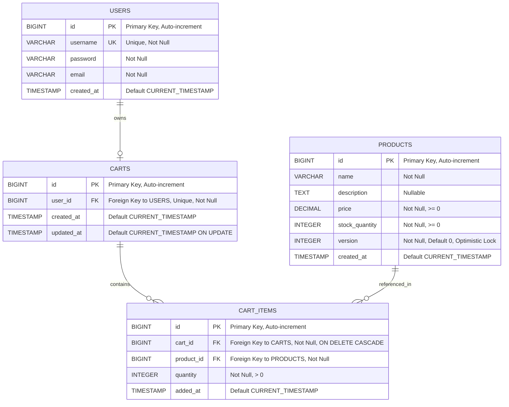
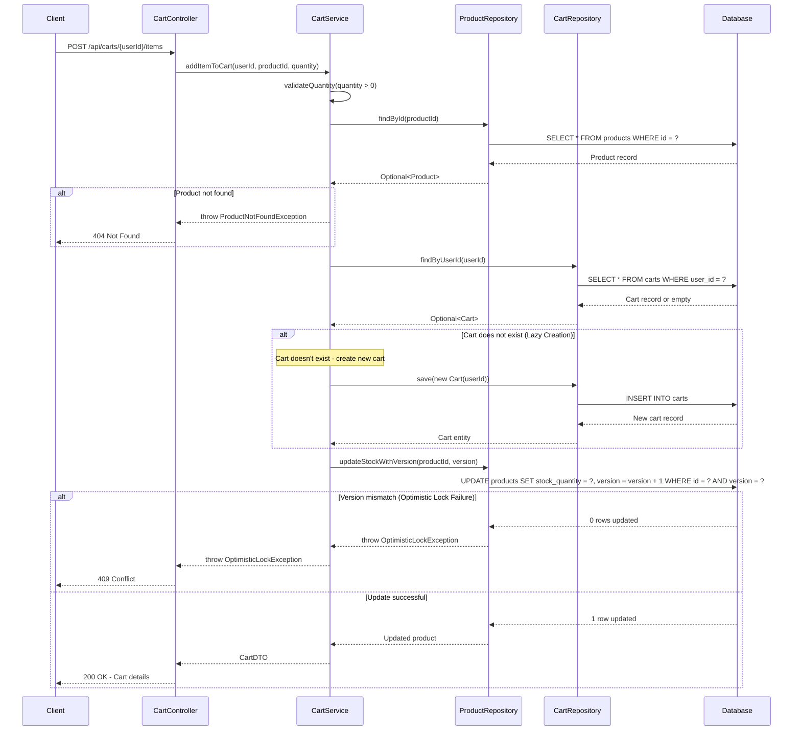

# Low Level Design (LLD) Document - Enhanced
## Shopping Cart Backend Services - Spring Boot MVC

---

## Executive Summary

This document provides a comprehensive Low Level Design specification for a Shopping Cart Backend Service built using Spring Boot MVC architecture. The system implements core e-commerce functionality including user management, product catalog management, and shopping cart operations.

### Project Overview
- **Technology Stack**: Spring Boot, Spring MVC, JPA/Hibernate, PostgreSQL
- **Architecture Pattern**: Model-View-Controller (MVC)
- **Design Approach**: Database-first with stateless REST API
- **Key Features**: User authentication, product management, cart operations with optimistic locking

---

## Functional Domain Breakdown

### 1. User Management Domain
**Responsibilities**:
- User registration and authentication
- User profile management
- Username uniqueness enforcement

**Key Operations**:
- Register new user
- Authenticate user credentials
- Retrieve user profile
- Update user information

### 2. Product Catalog Domain
**Responsibilities**:
- Product inventory management
- Product information retrieval
- Stock level tracking
- Optimistic locking for concurrent updates

**Key Operations**:
- Create new product
- Retrieve product details
- Update product information
- Delete product
- List all products

### 3. Shopping Cart Management Domain
**Responsibilities**:
- Cart lifecycle management (lazy creation, auto-cleanup)
- Cart item operations
- Cart state persistence
- Quantity validation and enforcement

**Key Operations**:
- Add item to cart (with lazy cart creation)
- Update item quantity
- Remove item from cart
- Clear entire cart
- Retrieve cart contents

---

## Domain Entity Extraction

### Entity: USERS
**Table Name**: `users`

| Column Name | Data Type | Constraints | Description |
|-------------|-----------|-------------|-------------|
| id | BIGINT | PRIMARY KEY, AUTO_INCREMENT | Unique user identifier |
| username | VARCHAR(50) | NOT NULL, UNIQUE | User login name |
| password | VARCHAR(255) | NOT NULL | Encrypted password |
| email | VARCHAR(100) | NOT NULL | User email address |
| created_at | TIMESTAMP | DEFAULT CURRENT_TIMESTAMP | Account creation timestamp |

**Business Rules**:
- Username must be unique across the system
- Password must be stored encrypted
- Email format validation required

---

### Entity: PRODUCTS
**Table Name**: `products`

| Column Name | Data Type | Constraints | Description |
|-------------|-----------|-------------|-------------|
| id | BIGINT | PRIMARY KEY, AUTO_INCREMENT | Unique product identifier |
| name | VARCHAR(200) | NOT NULL | Product name |
| description | TEXT | NULL | Product description |
| price | DECIMAL(10,2) | NOT NULL, CHECK (price >= 0) | Product price |
| stock_quantity | INTEGER | NOT NULL, CHECK (stock_quantity >= 0) | Available stock |
| version | INTEGER | NOT NULL, DEFAULT 0 | Optimistic locking version |
| created_at | TIMESTAMP | DEFAULT CURRENT_TIMESTAMP | Product creation timestamp |

**Business Rules**:
- Price must be non-negative
- Stock quantity must be non-negative
- Version column used for optimistic locking to prevent concurrent update conflicts

---

### Entity: CARTS
**Table Name**: `carts`

| Column Name | Data Type | Constraints | Description |
|-------------|-----------|-------------|-------------|
| id | BIGINT | PRIMARY KEY, AUTO_INCREMENT | Unique cart identifier |
| user_id | BIGINT | NOT NULL, FOREIGN KEY (users.id) | Owner user reference |
| created_at | TIMESTAMP | DEFAULT CURRENT_TIMESTAMP | Cart creation timestamp |
| updated_at | TIMESTAMP | DEFAULT CURRENT_TIMESTAMP ON UPDATE | Last modification timestamp |

**Business Rules**:
- One cart per user (enforced by unique constraint on user_id)
- Cart is lazily created on first item addition
- Cart is automatically deleted when empty
- Cart is cleared on user logout

---

### Entity: CART_ITEMS
**Table Name**: `cart_items`

| Column Name | Data Type | Constraints | Description |
|-------------|-----------|-------------|-------------|
| id | BIGINT | PRIMARY KEY, AUTO_INCREMENT | Unique cart item identifier |
| cart_id | BIGINT | NOT NULL, FOREIGN KEY (carts.id) ON DELETE CASCADE | Parent cart reference |
| product_id | BIGINT | NOT NULL, FOREIGN KEY (products.id) | Product reference |
| quantity | INTEGER | NOT NULL, CHECK (quantity > 0) | Item quantity |
| added_at | TIMESTAMP | DEFAULT CURRENT_TIMESTAMP | Item addition timestamp |

**Business Rules**:
- Quantity must be positive (> 0)
- Composite uniqueness: (cart_id, product_id) - one entry per product per cart
- Cascade delete when parent cart is deleted
- Quantity updates trigger cart updated_at timestamp

---

# ENHANCED TECHNICAL ARTIFACTS

## 1. Entity-Relationship Diagram (ERD)



## 2. Add to Cart Sequence Diagram



## 3. Database Model (PostgreSQL DDL)

```sql
-- Shopping Cart Backend - PostgreSQL DDL
-- Database Schema Definition

-- Drop existing tables (in reverse dependency order)
DROP TABLE IF EXISTS cart_items CASCADE;
DROP TABLE IF EXISTS carts CASCADE;
DROP TABLE IF EXISTS products CASCADE;
DROP TABLE IF EXISTS users CASCADE;

-- TABLE: users
CREATE TABLE users (
    id BIGSERIAL PRIMARY KEY,
    username VARCHAR(50) NOT NULL UNIQUE,
    password VARCHAR(255) NOT NULL,
    email VARCHAR(100) NOT NULL,
    created_at TIMESTAMP NOT NULL DEFAULT CURRENT_TIMESTAMP,
    
    CONSTRAINT chk_username_length CHECK (LENGTH(username) >= 3),
    CONSTRAINT chk_email_format CHECK (email ~* '^[A-Za-z0-9._%+-]+@[A-Za-z0-9.-]+\\.[A-Za-z]{2,}$')
);

CREATE INDEX idx_users_email ON users(email);

-- TABLE: products
CREATE TABLE products (
    id BIGSERIAL PRIMARY KEY,
    name VARCHAR(200) NOT NULL,
    description TEXT,
    price DECIMAL(10, 2) NOT NULL,
    stock_quantity INTEGER NOT NULL,
    version INTEGER NOT NULL DEFAULT 0,
    created_at TIMESTAMP NOT NULL DEFAULT CURRENT_TIMESTAMP,
    
    CONSTRAINT chk_price_positive CHECK (price >= 0),
    CONSTRAINT chk_stock_non_negative CHECK (stock_quantity >= 0),
    CONSTRAINT chk_name_not_empty CHECK (LENGTH(TRIM(name)) > 0)
);

CREATE INDEX idx_products_name ON products(name);
CREATE INDEX idx_products_price ON products(price);

-- TABLE: carts
CREATE TABLE carts (
    id BIGSERIAL PRIMARY KEY,
    user_id BIGINT NOT NULL UNIQUE,
    created_at TIMESTAMP NOT NULL DEFAULT CURRENT_TIMESTAMP,
    updated_at TIMESTAMP NOT NULL DEFAULT CURRENT_TIMESTAMP,
    
    CONSTRAINT fk_carts_user FOREIGN KEY (user_id) 
        REFERENCES users(id) 
        ON DELETE CASCADE
);

CREATE INDEX idx_carts_updated_at ON carts(updated_at);

-- TABLE: cart_items
CREATE TABLE cart_items (
    id BIGSERIAL PRIMARY KEY,
    cart_id BIGINT NOT NULL,
    product_id BIGINT NOT NULL,
    quantity INTEGER NOT NULL,
    added_at TIMESTAMP NOT NULL DEFAULT CURRENT_TIMESTAMP,
    
    CONSTRAINT chk_quantity_positive CHECK (quantity > 0),
    
    CONSTRAINT fk_cart_items_cart FOREIGN KEY (cart_id) 
        REFERENCES carts(id) 
        ON DELETE CASCADE,
    
    CONSTRAINT fk_cart_items_product FOREIGN KEY (product_id) 
        REFERENCES products(id) 
        ON DELETE CASCADE,
    
    CONSTRAINT uk_cart_product UNIQUE (cart_id, product_id)
);

CREATE INDEX idx_cart_items_cart_id ON cart_items(cart_id);
CREATE INDEX idx_cart_items_product_id ON cart_items(product_id);
CREATE INDEX idx_cart_items_cart_product ON cart_items(cart_id, product_id);

-- Sample Data
INSERT INTO users (username, password, email) VALUES
('john_doe', '$2a$10$encrypted_password_hash_1', 'john@example.com'),
('jane_smith', '$2a$10$encrypted_password_hash_2', 'jane@example.com');

INSERT INTO products (name, description, price, stock_quantity, version) VALUES
('Laptop', 'High-performance laptop with 16GB RAM', 999.99, 50, 0),
('Wireless Mouse', 'Ergonomic wireless mouse with USB receiver', 29.99, 200, 0),
('Mechanical Keyboard', 'RGB mechanical keyboard with blue switches', 89.99, 100, 0);
```

---

## Document Revision History

| Version | Date | Author | Changes |
|---------|------|--------|----------|
| 1.0 | 2024-01-15 | Backend Team | Initial LLD document |
| 2.0 | 2024-01-15 | Documentation Agent | Added ERD, Sequence Diagram, and DDL artifacts |

---

**End of Document**