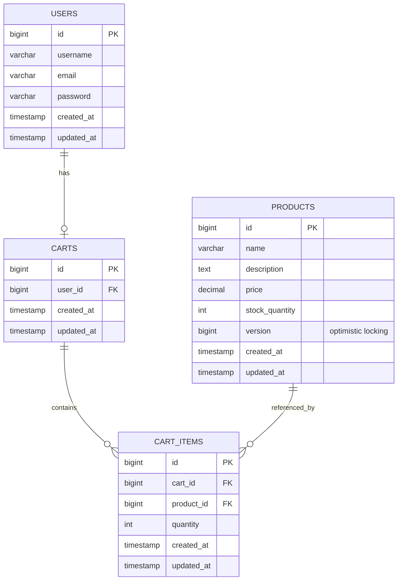
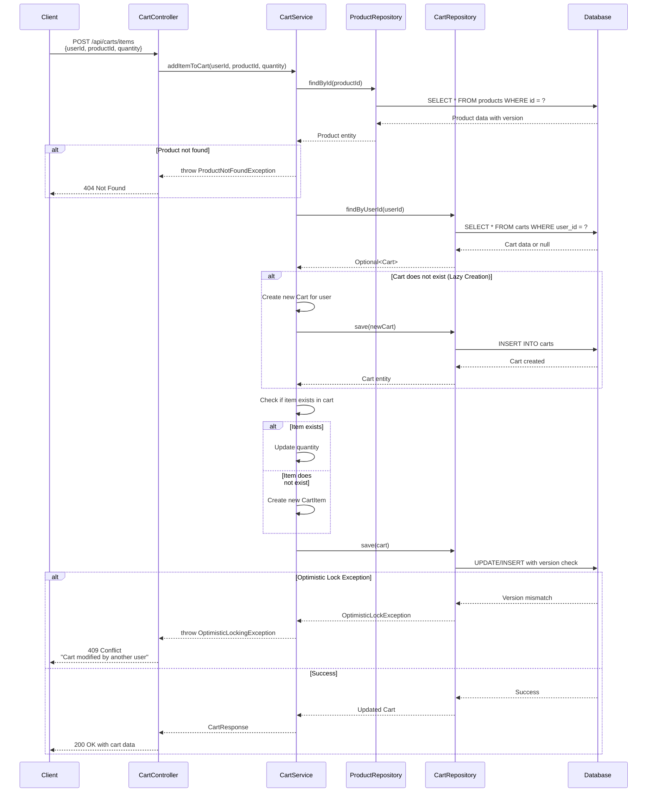

# Enhanced Low Level Design Document for Shopping Cart System

---

## Executive Summary

This Low Level Design (LLD) document provides a comprehensive technical specification for implementing a shopping cart system using Spring Boot MVC architecture. The system enables users to manage shopping carts with full CRUD operations, including adding products, updating quantities, and removing items. The design emphasizes scalability, data integrity, and optimal performance through proper database modeling and transaction management.

---

## Detailed Analysis

### System Architecture

The shopping cart system follows a layered architecture pattern:

- **Presentation Layer**: RESTful API endpoints exposed through Spring MVC Controllers
- **Business Logic Layer**: Service classes implementing cart management logic
- **Data Access Layer**: Spring Data JPA repositories for database operations
- **Persistence Layer**: PostgreSQL database with optimized schema design

### Core Components

#### 1. Domain Models

**User Entity**
- Represents system users who can create and manage shopping carts
- Contains user identification and profile information

**Product Entity**
- Represents items available for purchase
- Includes product details, pricing, and inventory information
- Implements optimistic locking using version column

**Cart Entity**
- Represents a user's shopping cart
- Supports lazy initialization (created on first item addition)
- Maintains relationship with user and cart items

**CartItem Entity**
- Represents individual products within a cart
- Tracks quantity and references to product and cart
- Enables granular cart management

#### 2. Service Layer

**CartService**
- Implements business logic for cart operations
- Handles lazy cart creation
- Manages cart item additions, updates, and deletions
- Implements optimistic locking for concurrent access control

**ProductService**
- Manages product-related operations
- Validates product availability
- Handles product inventory checks

#### 3. Controller Layer

**CartController**
- Exposes RESTful endpoints for cart operations
- Handles HTTP requests and responses
- Implements proper error handling and status codes

### Key Technical Features

#### Lazy Cart Creation
- Carts are not pre-created for users
- Cart is automatically created when user adds first item
- Reduces database overhead and improves performance

#### Optimistic Locking
- Implemented on Product entity using @Version annotation
- Prevents concurrent modification conflicts
- Throws OptimisticLockException when version mismatch occurs
- Ensures data consistency in multi-user scenarios

#### Transaction Management
- @Transactional annotations ensure ACID properties
- Proper rollback mechanisms for failed operations
- Isolation levels configured for concurrent access

#### Data Integrity
- Foreign key constraints maintain referential integrity
- Cascade delete operations for dependent entities
- Unique constraints prevent duplicate entries

---

## Deliverables

### 1. Source Code Structure

```
src/main/java/com/shopping/cart/
├── controller/
│   └── CartController.java
├── service/
│   ├── CartService.java
│   └── ProductService.java
├── repository/
│   ├── UserRepository.java
│   ├── ProductRepository.java
│   ├── CartRepository.java
│   └── CartItemRepository.java
├── model/
│   ├── User.java
│   ├── Product.java
│   ├── Cart.java
│   └── CartItem.java
├── dto/
│   ├── CartRequest.java
│   ├── CartResponse.java
│   └── CartItemResponse.java
└── exception/
    ├── CartNotFoundException.java
    ├── ProductNotFoundException.java
    └── OptimisticLockingException.java
```

### 2. API Endpoints

- **POST /api/carts/items** - Add item to cart (lazy creation)
- **GET /api/carts/{userId}** - Retrieve user's cart
- **PUT /api/carts/items/{itemId}** - Update cart item quantity
- **DELETE /api/carts/items/{itemId}** - Remove item from cart
- **DELETE /api/carts/{cartId}** - Clear entire cart

### 3. Configuration Files

- application.properties / application.yml
- Database connection configuration
- JPA/Hibernate settings
- Logging configuration

### 4. Testing Strategy

- Unit tests for service layer
- Integration tests for repository layer
- Controller tests using MockMvc
- Optimistic locking scenario tests

---

## Technical Artifacts

### 1. Entity-Relationship Diagram



### 2. Add to Cart Sequence Diagram



### 3. Database Model - PostgreSQL DDL Scripts

```sql
-- ============================================
-- Shopping Cart System - Database Schema
-- Database: PostgreSQL 12+
-- ============================================

-- Drop tables if they exist (for clean setup)
DROP TABLE IF EXISTS cart_items CASCADE;
DROP TABLE IF EXISTS carts CASCADE;
DROP TABLE IF EXISTS products CASCADE;
DROP TABLE IF EXISTS users CASCADE;

-- ============================================
-- Table: USERS
-- Description: Stores user account information
-- ============================================
CREATE TABLE users (
    id BIGSERIAL PRIMARY KEY,
    username VARCHAR(50) NOT NULL UNIQUE,
    email VARCHAR(100) NOT NULL UNIQUE,
    password VARCHAR(255) NOT NULL,
    first_name VARCHAR(50),
    last_name VARCHAR(50),
    created_at TIMESTAMP NOT NULL DEFAULT CURRENT_TIMESTAMP,
    updated_at TIMESTAMP NOT NULL DEFAULT CURRENT_TIMESTAMP
);

-- ============================================
-- Table: PRODUCTS
-- Description: Stores product catalog with optimistic locking
-- ============================================
CREATE TABLE products (
    id BIGSERIAL PRIMARY KEY,
    name VARCHAR(200) NOT NULL,
    description TEXT,
    price DECIMAL(10, 2) NOT NULL CHECK (price >= 0),
    stock_quantity INTEGER NOT NULL DEFAULT 0 CHECK (stock_quantity >= 0),
    sku VARCHAR(50) UNIQUE,
    category VARCHAR(100),
    version BIGINT NOT NULL DEFAULT 0,
    is_active BOOLEAN NOT NULL DEFAULT TRUE,
    created_at TIMESTAMP NOT NULL DEFAULT CURRENT_TIMESTAMP,
    updated_at TIMESTAMP NOT NULL DEFAULT CURRENT_TIMESTAMP,
    CONSTRAINT chk_price_positive CHECK (price >= 0),
    CONSTRAINT chk_stock_non_negative CHECK (stock_quantity >= 0)
);

-- ============================================
-- Table: CARTS
-- Description: Stores shopping carts for users
-- ============================================
CREATE TABLE carts (
    id BIGSERIAL PRIMARY KEY,
    user_id BIGINT NOT NULL,
    status VARCHAR(20) NOT NULL DEFAULT 'ACTIVE',
    created_at TIMESTAMP NOT NULL DEFAULT CURRENT_TIMESTAMP,
    updated_at TIMESTAMP NOT NULL DEFAULT CURRENT_TIMESTAMP,
    CONSTRAINT fk_cart_user FOREIGN KEY (user_id) 
        REFERENCES users(id) ON DELETE CASCADE,
    CONSTRAINT uq_user_active_cart UNIQUE (user_id)
);

-- ============================================
-- Table: CART_ITEMS
-- Description: Stores individual items within shopping carts
-- ============================================
CREATE TABLE cart_items (
    id BIGSERIAL PRIMARY KEY,
    cart_id BIGINT NOT NULL,
    product_id BIGINT NOT NULL,
    quantity INTEGER NOT NULL DEFAULT 1 CHECK (quantity > 0),
    price_at_addition DECIMAL(10, 2) NOT NULL,
    created_at TIMESTAMP NOT NULL DEFAULT CURRENT_TIMESTAMP,
    updated_at TIMESTAMP NOT NULL DEFAULT CURRENT_TIMESTAMP,
    CONSTRAINT fk_cart_item_cart FOREIGN KEY (cart_id) 
        REFERENCES carts(id) ON DELETE CASCADE,
    CONSTRAINT fk_cart_item_product FOREIGN KEY (product_id) 
        REFERENCES products(id) ON DELETE CASCADE,
    CONSTRAINT uq_cart_product UNIQUE (cart_id, product_id),
    CONSTRAINT chk_quantity_positive CHECK (quantity > 0)
);

-- ============================================
-- INDEXES for Performance Optimization
-- ============================================

-- Index on users table
CREATE INDEX idx_users_email ON users(email);
CREATE INDEX idx_users_username ON users(username);

-- Indexes on products table
CREATE INDEX idx_products_category ON products(category);
CREATE INDEX idx_products_sku ON products(sku);
CREATE INDEX idx_products_active ON products(is_active);
CREATE INDEX idx_products_name ON products(name);

-- Indexes on carts table
CREATE INDEX idx_carts_user_id ON carts(user_id);
CREATE INDEX idx_carts_status ON carts(status);

-- Indexes on cart_items table
CREATE INDEX idx_cart_items_cart_id ON cart_items(cart_id);
CREATE INDEX idx_cart_items_product_id ON cart_items(product_id);
CREATE INDEX idx_cart_items_cart_product ON cart_items(cart_id, product_id);

-- ============================================
-- COMMENTS for Documentation
-- ============================================

COMMENT ON TABLE users IS 'Stores user account information for the shopping cart system';
COMMENT ON TABLE products IS 'Product catalog with optimistic locking support via version column';
COMMENT ON TABLE carts IS 'Shopping carts associated with users, supports lazy creation';
COMMENT ON TABLE cart_items IS 'Individual line items within shopping carts';

COMMENT ON COLUMN products.version IS 'Optimistic locking version field - incremented on each update';
COMMENT ON COLUMN cart_items.price_at_addition IS 'Captures product price at the time of addition to cart';

-- ============================================
-- TRIGGERS for automatic timestamp updates
-- ============================================

-- Function to update updated_at timestamp
CREATE OR REPLACE FUNCTION update_updated_at_column()
RETURNS TRIGGER AS $$
BEGIN
    NEW.updated_at = CURRENT_TIMESTAMP;
    RETURN NEW;
END;
$$ LANGUAGE plpgsql;

-- Triggers for each table
CREATE TRIGGER update_users_updated_at
    BEFORE UPDATE ON users
    FOR EACH ROW
    EXECUTE FUNCTION update_updated_at_column();

CREATE TRIGGER update_products_updated_at
    BEFORE UPDATE ON products
    FOR EACH ROW
    EXECUTE FUNCTION update_updated_at_column();

CREATE TRIGGER update_carts_updated_at
    BEFORE UPDATE ON carts
    FOR EACH ROW
    EXECUTE FUNCTION update_updated_at_column();

CREATE TRIGGER update_cart_items_updated_at
    BEFORE UPDATE ON cart_items
    FOR EACH ROW
    EXECUTE FUNCTION update_updated_at_column();

-- ============================================
-- SAMPLE DATA (Optional - for testing)
-- ============================================

-- Insert sample users
INSERT INTO users (username, email, password, first_name, last_name) VALUES
('john_doe', 'john.doe@example.com', '$2a$10$encrypted_password_hash', 'John', 'Doe'),
('jane_smith', 'jane.smith@example.com', '$2a$10$encrypted_password_hash', 'Jane', 'Smith');

-- Insert sample products
INSERT INTO products (name, description, price, stock_quantity, sku, category) VALUES
('Laptop Pro 15', 'High-performance laptop with 15-inch display', 1299.99, 50, 'LAP-PRO-15', 'Electronics'),
('Wireless Mouse', 'Ergonomic wireless mouse with USB receiver', 29.99, 200, 'MOU-WIR-01', 'Accessories'),
('USB-C Cable', 'Premium USB-C charging cable 2m', 19.99, 500, 'CAB-USC-2M', 'Accessories'),
('Mechanical Keyboard', 'RGB mechanical gaming keyboard', 149.99, 75, 'KEY-MEC-RGB', 'Electronics');

-- ============================================
-- VERIFICATION QUERIES
-- ============================================

-- Verify table creation
-- SELECT table_name FROM information_schema.tables WHERE table_schema = 'public';

-- Verify constraints
-- SELECT constraint_name, table_name, constraint_type 
-- FROM information_schema.table_constraints 
-- WHERE table_schema = 'public';

-- Verify indexes
-- SELECT indexname, tablename FROM pg_indexes WHERE schemaname = 'public';
```

---

## Conclusion

This enhanced Low Level Design document provides a complete technical specification for implementing a robust shopping cart system using Spring Boot MVC. The included Entity-Relationship Diagram, Sequence Diagram, and Database DDL scripts serve as comprehensive references for development teams to implement the system with proper data modeling, transaction management, and concurrency control mechanisms.

The design emphasizes:
- **Scalability**: Through proper indexing and lazy loading strategies
- **Data Integrity**: Via foreign key constraints and cascade rules
- **Concurrency Control**: Using optimistic locking on critical entities
- **Performance**: Through strategic index placement and efficient query patterns
- **Maintainability**: With clear separation of concerns and well-documented schema

---