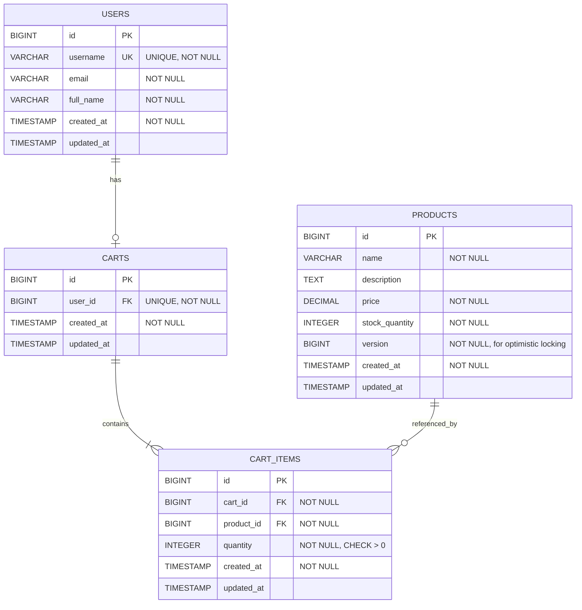
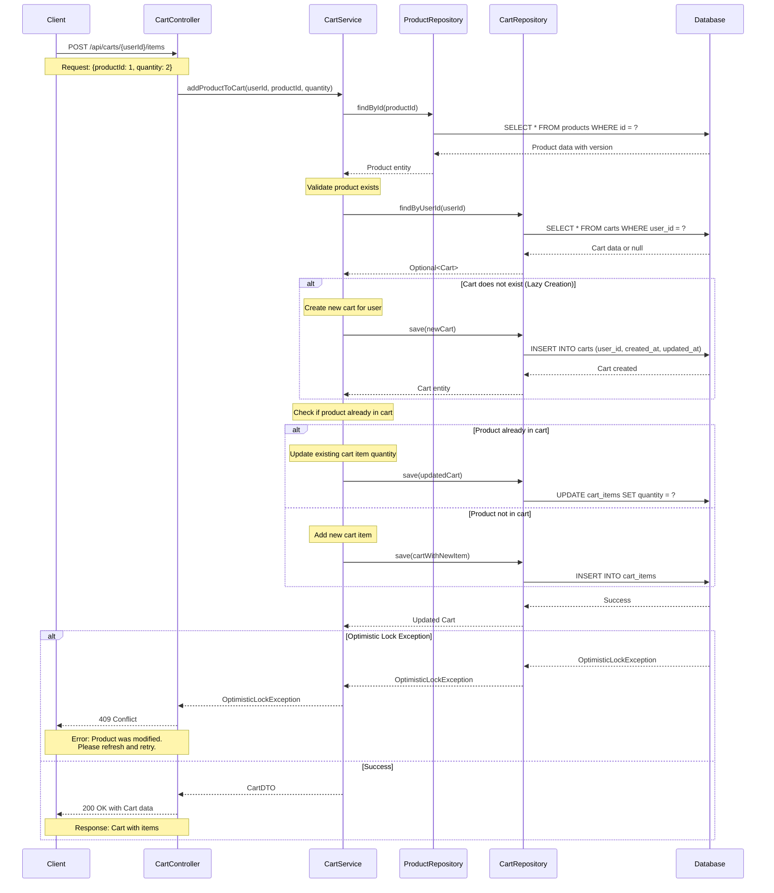

# Low Level Design (LLD) Document
## SCRUM-96: Implement Core Shopping Cart Backend Services Using Spring Boot MVC

---

## Executive Summary

### Project Overview
This document provides the Low Level Design for implementing core shopping cart backend services using Spring Boot MVC architecture. The system will support user management, product catalog management, and shopping cart operations with a focus on scalability, maintainability, and adherence to RESTful principles.

### Objectives
- Implement a robust backend service for managing users, products, and shopping carts
- Ensure data consistency and integrity through proper database design
- Provide RESTful APIs for frontend integration
- Implement optimistic locking for concurrent product updates
- Support lazy cart creation and automatic cleanup

### Technical Stack
- **Framework**: Spring Boot 3.x
- **Architecture**: MVC (Model-View-Controller)
- **Database**: PostgreSQL
- **ORM**: Spring Data JPA / Hibernate
- **Build Tool**: Maven/Gradle
- **Java Version**: 17+

### Scope Boundaries
**In Scope:**
- User registration and management
- Product catalog CRUD operations
- Shopping cart operations (add, update, remove items)
- Lazy cart creation
- Automatic cart cleanup on logout
- Optimistic locking for product updates

**Out of Scope:**
- Authentication and authorization mechanisms
- Payment processing
- Order management
- Inventory management
- Email notifications

### Critical Business Rules
1. **Lazy Cart Creation**: Cart is created only when the first product is added
2. **Empty Cart Deletion**: Empty carts are automatically deleted
3. **Logout Cart Cleanup**: All cart data is deleted on user logout
4. **Single Active Cart**: One active cart per user maximum
5. **Username Uniqueness**: Enforced at database level
6. **Positive Quantities**: All quantities must be greater than zero

---

## Detailed Analysis

### Functional Requirements

#### 1. User Management
- **FR-UM-01**: System shall allow user registration with unique username
- **FR-UM-02**: System shall store user information (id, username, email, full name)
- **FR-UM-03**: System shall support user logout with cart cleanup

#### 2. Product Catalog
- **FR-PC-01**: System shall support CRUD operations for products
- **FR-PC-02**: System shall maintain product information (id, name, description, price, stock quantity)
- **FR-PC-03**: System shall implement optimistic locking using version field
- **FR-PC-04**: System shall prevent concurrent update conflicts

#### 3. Shopping Cart
- **FR-SC-01**: System shall create cart lazily on first product addition
- **FR-SC-02**: System shall allow adding products to cart with specified quantity
- **FR-SC-03**: System shall allow updating product quantity in cart
- **FR-SC-04**: System shall allow removing products from cart
- **FR-SC-05**: System shall automatically delete empty carts
- **FR-SC-06**: System shall delete all cart data on user logout
- **FR-SC-07**: System shall enforce one active cart per user

### Non-Functional Requirements

#### Performance
- **NFR-P-01**: API response time shall be < 200ms for 95th percentile
- **NFR-P-02**: System shall support concurrent requests using optimistic locking

#### Scalability
- **NFR-S-01**: Database design shall support horizontal scaling
- **NFR-S-02**: Stateless service design for easy horizontal scaling

#### Reliability
- **NFR-R-01**: Data consistency shall be maintained through ACID transactions
- **NFR-R-02**: Proper exception handling and error responses

#### Maintainability
- **NFR-M-01**: Clean separation of concerns (Controller-Service-Repository)
- **NFR-M-02**: Comprehensive code documentation
- **NFR-M-03**: Adherence to Spring Boot best practices

### Data Model Analysis

#### Entity Relationships
1. **User ←→ Cart**: One-to-Zero-or-One (1:0..1)
   - A user can have at most one active cart
   - A cart belongs to exactly one user

2. **Cart ←→ CartItem**: One-to-Many (1:1..*)
   - A cart contains one or more cart items
   - A cart item belongs to exactly one cart

3. **Product ←→ CartItem**: One-to-Many (1:0..*)
   - A product can be in zero or more cart items
   - A cart item references exactly one product

#### Key Constraints
- Username must be unique (UNIQUE constraint)
- All quantities must be positive (CHECK constraint)
- Foreign key cascading for cart deletion
- Version field for optimistic locking on products

### Business Logic Analysis

#### Lazy Cart Creation Flow
1. User attempts to add product to cart
2. System checks if user has an active cart
3. If no cart exists, system creates new cart
4. Product is added to cart as cart item

#### Empty Cart Cleanup Flow
1. User removes last item from cart
2. System detects cart is empty
3. System automatically deletes the empty cart

#### Logout Cart Cleanup Flow
1. User initiates logout
2. System identifies user's active cart
3. System deletes all cart items
4. System deletes the cart

#### Optimistic Locking Flow
1. User A and User B read product with version=1
2. User A updates product, version increments to 2
3. User B attempts update with version=1
4. System detects version mismatch
5. System throws OptimisticLockException
6. User B must retry with latest version

---

## Deliverables

### 1. Domain Entities

#### User Entity
```java
package com.example.cart.domain;

import jakarta.persistence.*;
import lombok.AllArgsConstructor;
import lombok.Data;
import lombok.NoArgsConstructor;

import java.time.LocalDateTime;

@Entity
@Table(name = "users")
@Data
@NoArgsConstructor
@AllArgsConstructor
public class User {
    
    @Id
    @GeneratedValue(strategy = GenerationType.IDENTITY)
    private Long id;
    
    @Column(nullable = false, unique = true, length = 50)
    private String username;
    
    @Column(nullable = false, length = 100)
    private String email;
    
    @Column(name = "full_name", nullable = false, length = 100)
    private String fullName;
    
    @Column(name = "created_at", nullable = false, updatable = false)
    private LocalDateTime createdAt;
    
    @Column(name = "updated_at")
    private LocalDateTime updatedAt;
    
    @OneToOne(mappedBy = "user", cascade = CascadeType.ALL, orphanRemoval = true)
    private Cart cart;
    
    @PrePersist
    protected void onCreate() {
        createdAt = LocalDateTime.now();
        updatedAt = LocalDateTime.now();
    }
    
    @PreUpdate
    protected void onUpdate() {
        updatedAt = LocalDateTime.now();
    }
}
```

#### Product Entity
```java
package com.example.cart.domain;

import jakarta.persistence.*;
import lombok.AllArgsConstructor;
import lombok.Data;
import lombok.NoArgsConstructor;

import java.math.BigDecimal;
import java.time.LocalDateTime;

@Entity
@Table(name = "products")
@Data
@NoArgsConstructor
@AllArgsConstructor
public class Product {
    
    @Id
    @GeneratedValue(strategy = GenerationType.IDENTITY)
    private Long id;
    
    @Column(nullable = false, length = 200)
    private String name;
    
    @Column(columnDefinition = "TEXT")
    private String description;
    
    @Column(nullable = false, precision = 10, scale = 2)
    private BigDecimal price;
    
    @Column(name = "stock_quantity", nullable = false)
    private Integer stockQuantity;
    
    @Version
    @Column(nullable = false)
    private Long version;
    
    @Column(name = "created_at", nullable = false, updatable = false)
    private LocalDateTime createdAt;
    
    @Column(name = "updated_at")
    private LocalDateTime updatedAt;
    
    @PrePersist
    protected void onCreate() {
        createdAt = LocalDateTime.now();
        updatedAt = LocalDateTime.now();
    }
    
    @PreUpdate
    protected void onUpdate() {
        updatedAt = LocalDateTime.now();
    }
}
```

#### Cart Entity
```java
package com.example.cart.domain;

import jakarta.persistence.*;
import lombok.AllArgsConstructor;
import lombok.Data;
import lombok.NoArgsConstructor;

import java.time.LocalDateTime;
import java.util.ArrayList;
import java.util.List;

@Entity
@Table(name = "carts")
@Data
@NoArgsConstructor
@AllArgsConstructor
public class Cart {
    
    @Id
    @GeneratedValue(strategy = GenerationType.IDENTITY)
    private Long id;
    
    @OneToOne
    @JoinColumn(name = "user_id", nullable = false, unique = true)
    private User user;
    
    @OneToMany(mappedBy = "cart", cascade = CascadeType.ALL, orphanRemoval = true)
    private List<CartItem> cartItems = new ArrayList<>();
    
    @Column(name = "created_at", nullable = false, updatable = false)
    private LocalDateTime createdAt;
    
    @Column(name = "updated_at")
    private LocalDateTime updatedAt;
    
    @PrePersist
    protected void onCreate() {
        createdAt = LocalDateTime.now();
        updatedAt = LocalDateTime.now();
    }
    
    @PreUpdate
    protected void onUpdate() {
        updatedAt = LocalDateTime.now();
    }
    
    public void addCartItem(CartItem cartItem) {
        cartItems.add(cartItem);
        cartItem.setCart(this);
    }
    
    public void removeCartItem(CartItem cartItem) {
        cartItems.remove(cartItem);
        cartItem.setCart(null);
    }
    
    public boolean isEmpty() {
        return cartItems == null || cartItems.isEmpty();
    }
}
```

#### CartItem Entity
```java
package com.example.cart.domain;

import jakarta.persistence.*;
import lombok.AllArgsConstructor;
import lombok.Data;
import lombok.NoArgsConstructor;

import java.time.LocalDateTime;

@Entity
@Table(name = "cart_items")
@Data
@NoArgsConstructor
@AllArgsConstructor
public class CartItem {
    
    @Id
    @GeneratedValue(strategy = GenerationType.IDENTITY)
    private Long id;
    
    @ManyToOne(fetch = FetchType.LAZY)
    @JoinColumn(name = "cart_id", nullable = false)
    private Cart cart;
    
    @ManyToOne(fetch = FetchType.LAZY)
    @JoinColumn(name = "product_id", nullable = false)
    private Product product;
    
    @Column(nullable = false)
    private Integer quantity;
    
    @Column(name = "created_at", nullable = false, updatable = false)
    private LocalDateTime createdAt;
    
    @Column(name = "updated_at")
    private LocalDateTime updatedAt;
    
    @PrePersist
    protected void onCreate() {
        createdAt = LocalDateTime.now();
        updatedAt = LocalDateTime.now();
    }
    
    @PreUpdate
    protected void onUpdate() {
        updatedAt = LocalDateTime.now();
    }
}
```

### 2. REST API Contracts

#### User Management APIs

##### Create User
```
POST /api/users
Content-Type: application/json

Request Body:
{
  "username": "john_doe",
  "email": "john.doe@example.com",
  "fullName": "John Doe"
}

Response: 201 Created
{
  "id": 1,
  "username": "john_doe",
  "email": "john.doe@example.com",
  "fullName": "John Doe",
  "createdAt": "2024-01-15T10:30:00",
  "updatedAt": "2024-01-15T10:30:00"
}

Error Response: 400 Bad Request
{
  "error": "Username already exists",
  "timestamp": "2024-01-15T10:30:00"
}
```

##### Get User by ID
```
GET /api/users/{id}

Response: 200 OK
{
  "id": 1,
  "username": "john_doe",
  "email": "john.doe@example.com",
  "fullName": "John Doe",
  "createdAt": "2024-01-15T10:30:00",
  "updatedAt": "2024-01-15T10:30:00"
}

Error Response: 404 Not Found
{
  "error": "User not found",
  "timestamp": "2024-01-15T10:30:00"
}
```

##### User Logout (with Cart Cleanup)
```
POST /api/users/{id}/logout

Response: 200 OK
{
  "message": "User logged out successfully. Cart data cleared.",
  "timestamp": "2024-01-15T10:30:00"
}
```

#### Product Catalog APIs

##### Create Product
```
POST /api/products
Content-Type: application/json

Request Body:
{
  "name": "Laptop",
  "description": "High-performance laptop",
  "price": 999.99,
  "stockQuantity": 50
}

Response: 201 Created
{
  "id": 1,
  "name": "Laptop",
  "description": "High-performance laptop",
  "price": 999.99,
  "stockQuantity": 50,
  "version": 0,
  "createdAt": "2024-01-15T10:30:00",
  "updatedAt": "2024-01-15T10:30:00"
}
```

##### Get Product by ID
```
GET /api/products/{id}

Response: 200 OK
{
  "id": 1,
  "name": "Laptop",
  "description": "High-performance laptop",
  "price": 999.99,
  "stockQuantity": 50,
  "version": 0,
  "createdAt": "2024-01-15T10:30:00",
  "updatedAt": "2024-01-15T10:30:00"
}
```

##### Update Product
```
PUT /api/products/{id}
Content-Type: application/json

Request Body:
{
  "name": "Laptop",
  "description": "High-performance laptop - Updated",
  "price": 899.99,
  "stockQuantity": 45,
  "version": 0
}

Response: 200 OK
{
  "id": 1,
  "name": "Laptop",
  "description": "High-performance laptop - Updated",
  "price": 899.99,
  "stockQuantity": 45,
  "version": 1,
  "createdAt": "2024-01-15T10:30:00",
  "updatedAt": "2024-01-15T11:00:00"
}

Error Response: 409 Conflict (Optimistic Lock Exception)
{
  "error": "Product was modified by another user. Please refresh and try again.",
  "timestamp": "2024-01-15T11:00:00"
}
```

##### Delete Product
```
DELETE /api/products/{id}

Response: 204 No Content
```

##### List All Products
```
GET /api/products?page=0&size=10

Response: 200 OK
{
  "content": [
    {
      "id": 1,
      "name": "Laptop",
      "description": "High-performance laptop",
      "price": 999.99,
      "stockQuantity": 50,
      "version": 0,
      "createdAt": "2024-01-15T10:30:00",
      "updatedAt": "2024-01-15T10:30:00"
    }
  ],
  "page": 0,
  "size": 10,
  "totalElements": 1,
  "totalPages": 1
}
```

---

## Technical Artifacts

### 1. Entity-Relationship Diagram (ERD)



### 2. Add to Cart Sequence Diagram



### 3. Database Model (PostgreSQL DDL)

```sql
-- ============================================
-- PostgreSQL DDL for Shopping Cart System
-- SCRUM-96: Core Shopping Cart Backend Services
-- ============================================

-- Drop tables if they exist (for clean setup)
DROP TABLE IF EXISTS cart_items CASCADE;
DROP TABLE IF EXISTS carts CASCADE;
DROP TABLE IF EXISTS products CASCADE;
DROP TABLE IF EXISTS users CASCADE;

-- ============================================
-- USERS Table
-- ============================================
CREATE TABLE users (
    id BIGSERIAL PRIMARY KEY,
    username VARCHAR(50) NOT NULL UNIQUE,
    email VARCHAR(100) NOT NULL,
    full_name VARCHAR(100) NOT NULL,
    created_at TIMESTAMP NOT NULL DEFAULT CURRENT_TIMESTAMP,
    updated_at TIMESTAMP DEFAULT CURRENT_TIMESTAMP,
    
    CONSTRAINT users_username_unique UNIQUE (username),
    CONSTRAINT users_email_not_empty CHECK (email <> ''),
    CONSTRAINT users_username_not_empty CHECK (username <> '')
);

-- Index for username lookups
CREATE INDEX idx_users_username ON users(username);

-- ============================================
-- PRODUCTS Table
-- ============================================
CREATE TABLE products (
    id BIGSERIAL PRIMARY KEY,
    name VARCHAR(200) NOT NULL,
    description TEXT,
    price DECIMAL(10, 2) NOT NULL,
    stock_quantity INTEGER NOT NULL,
    version BIGINT NOT NULL DEFAULT 0,
    created_at TIMESTAMP NOT NULL DEFAULT CURRENT_TIMESTAMP,
    updated_at TIMESTAMP DEFAULT CURRENT_TIMESTAMP,
    
    CONSTRAINT products_name_not_empty CHECK (name <> ''),
    CONSTRAINT products_price_positive CHECK (price > 0),
    CONSTRAINT products_stock_non_negative CHECK (stock_quantity >= 0)
);

-- Index for product name searches
CREATE INDEX idx_products_name ON products(name);

-- ============================================
-- CARTS Table
-- ============================================
CREATE TABLE carts (
    id BIGSERIAL PRIMARY KEY,
    user_id BIGINT NOT NULL UNIQUE,
    created_at TIMESTAMP NOT NULL DEFAULT CURRENT_TIMESTAMP,
    updated_at TIMESTAMP DEFAULT CURRENT_TIMESTAMP,
    
    CONSTRAINT fk_carts_user_id 
        FOREIGN KEY (user_id) 
        REFERENCES users(id) 
        ON DELETE CASCADE,
    
    CONSTRAINT carts_user_id_unique UNIQUE (user_id)
);

-- Index for user_id lookups (foreign key)
CREATE INDEX idx_carts_user_id ON carts(user_id);

-- ============================================
-- CART_ITEMS Table
-- ============================================
CREATE TABLE cart_items (
    id BIGSERIAL PRIMARY KEY,
    cart_id BIGINT NOT NULL,
    product_id BIGINT NOT NULL,
    quantity INTEGER NOT NULL,
    created_at TIMESTAMP NOT NULL DEFAULT CURRENT_TIMESTAMP,
    updated_at TIMESTAMP DEFAULT CURRENT_TIMESTAMP,
    
    CONSTRAINT fk_cart_items_cart_id 
        FOREIGN KEY (cart_id) 
        REFERENCES carts(id) 
        ON DELETE CASCADE,
    
    CONSTRAINT fk_cart_items_product_id 
        FOREIGN KEY (product_id) 
        REFERENCES products(id) 
        ON DELETE CASCADE,
    
    CONSTRAINT cart_items_quantity_positive CHECK (quantity > 0),
    CONSTRAINT cart_items_unique_product_per_cart UNIQUE (cart_id, product_id)
);

-- Index for cart_id lookups (foreign key)
CREATE INDEX idx_cart_items_cart_id ON cart_items(cart_id);

-- Index for product_id lookups (foreign key)
CREATE INDEX idx_cart_items_product_id ON cart_items(product_id);

-- Composite index for cart and product lookups
CREATE INDEX idx_cart_items_cart_product ON cart_items(cart_id, product_id);

-- ============================================
-- Comments for Documentation
-- ============================================
COMMENT ON TABLE users IS 'Stores user account information';
COMMENT ON COLUMN users.username IS 'Unique username for user login';
COMMENT ON COLUMN users.email IS 'User email address';

COMMENT ON TABLE products IS 'Product catalog with inventory tracking';
COMMENT ON COLUMN products.version IS 'Version field for optimistic locking to handle concurrent updates';
COMMENT ON COLUMN products.stock_quantity IS 'Available inventory quantity';

COMMENT ON TABLE carts IS 'Shopping carts - one per user, created lazily';
COMMENT ON COLUMN carts.user_id IS 'Foreign key to users table - enforces one cart per user';

COMMENT ON TABLE cart_items IS 'Items in shopping carts with quantities';
COMMENT ON COLUMN cart_items.quantity IS 'Quantity of product in cart - must be greater than zero';

-- ============================================
-- Sample Data (Optional - for testing)
-- ============================================

-- Insert sample users
INSERT INTO users (username, email, full_name) VALUES
('john_doe', 'john.doe@example.com', 'John Doe'),
('jane_smith', 'jane.smith@example.com', 'Jane Smith');

-- Insert sample products
INSERT INTO products (name, description, price, stock_quantity, version) VALUES
('Laptop', 'High-performance laptop with 16GB RAM', 999.99, 50, 0),
('Mouse', 'Wireless optical mouse', 29.99, 200, 0),
('Keyboard', 'Mechanical keyboard with RGB lighting', 79.99, 150, 0),
('Monitor', '27-inch 4K display', 399.99, 75, 0);

-- ============================================
-- End of DDL Script
-- ============================================
```

---

## Document Control

**Document Version**: 1.1 (Enhanced with Technical Artifacts)  
**Last Updated**: 2024-01-15  
**Author**: Backend Engineering Team  
**Status**: Ready for Implementation  
**JIRA Ticket**: SCRUM-96

---

## Appendix

### Key Design Decisions

1. **Lazy Cart Creation**: Carts are created only when needed to reduce database overhead
2. **Optimistic Locking**: Version field in products table prevents lost updates in concurrent scenarios
3. **Cascade Deletion**: ON DELETE CASCADE ensures referential integrity and automatic cleanup
4. **Unique Constraints**: Enforced at database level for data integrity
5. **Check Constraints**: Ensure business rules (positive quantities) at database level
6. **Indexing Strategy**: Indexes on foreign keys and frequently queried columns for performance

### Technology Justification

- **Spring Boot MVC**: Industry-standard framework with excellent ecosystem
- **PostgreSQL**: Robust RDBMS with excellent support for constraints and transactions
- **JPA/Hibernate**: Simplifies database operations while maintaining flexibility
- **Optimistic Locking**: Better performance than pessimistic locking for read-heavy workloads

### Future Enhancements (Out of Current Scope)

- Order processing and checkout flow
- Payment gateway integration
- Inventory reservation system
- Product search and filtering
- User authentication and authorization
- Cart persistence across sessions
- Wishlist functionality
- Product recommendations

---

**End of Document**