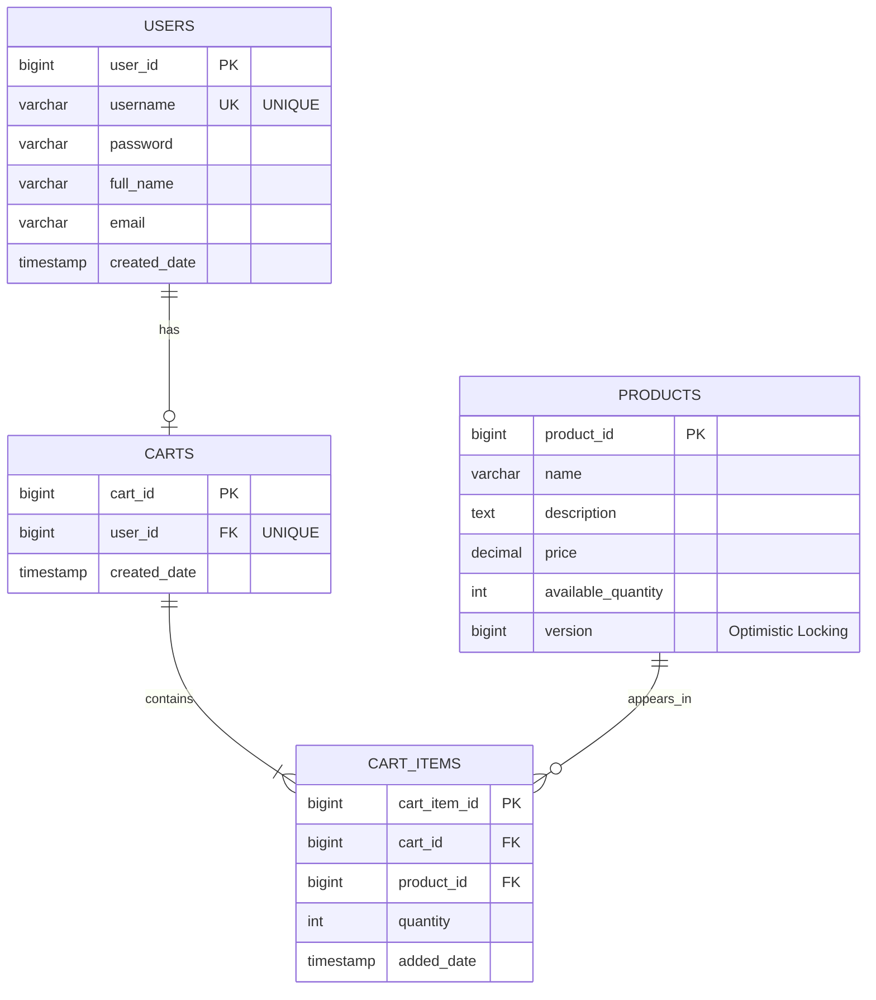
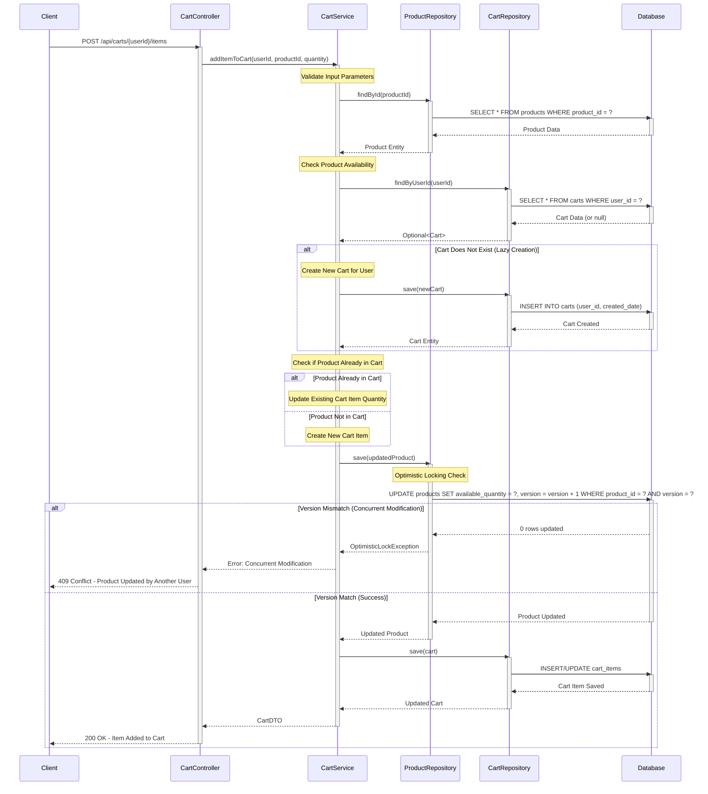

# COMPREHENSIVE BACKEND ENGINEERING SPECIFICATION PACKAGE
## Shopping Cart System - Spring Boot MVC Implementation

**Project Reference:** SCRUM-96  
**Document Version:** 1.0  
**Date:** 2024  
**Architecture:** Spring Boot MVC (RESTful)  
**Database:** Relational (SQL)  

---

## TABLE OF CONTENTS

1. Executive Summary
2. Detailed Analysis
3. Domain Model Specification
4. REST API Contract Specification
5. Validation Matrix
6. System Architecture Diagrams
7. Low-Level Design (LLD) Documentation
8. Implementation Guide
9. Quality Assurance Report
10. Troubleshooting and Support
11. Future Considerations
12. Technical Artifacts Appendix

---

## 1. EXECUTIVE SUMMARY

### 1.1 Project Overview
This specification defines the complete backend implementation for a core shopping cart system using Java Spring Boot MVC architecture. The system provides RESTful APIs for user management, product catalog search, and shopping cart operations with strict business rule enforcement at both application and database levels.

### 1.2 Key Objectives
- Implement stateless user authentication
- Enable lazy cart creation and lifecycle management
- Enforce database-first validation and constraints
- Provide comprehensive product search capabilities
- Ensure cart cleanup on logout (no session persistence)
- Maintain strict MVC architectural layering

### 1.3 Technical Stack
- **Framework:** Spring Boot (MVC)
- **Language:** Java
- **Database:** Relational SQL Database
- **API Style:** RESTful
- **Architecture Pattern:** MVC (Controller → Service → Repository)

### 1.4 Scope Boundaries

**IN SCOPE:**
- User registration, authentication, and profile management
- Product catalog search
- Shopping cart CRUD operations
- Cart lifecycle management (lazy creation, auto-deletion)
- Database constraint enforcement
- Stateless session management

**EXPLICITLY OUT OF SCOPE:**
- Checkout process
- Payment processing
- Inventory locking mechanisms
- Admin management interfaces
- Password change functionality

### 1.5 Critical Business Rules
1. **Cart Lifecycle:** Carts are created lazily (only when first product added) and deleted automatically when empty or on logout
2. **Stateless Authentication:** Login does not create persistent session data at database level
3. **Data Integrity:** All business rules enforced through database constraints and service layer validation
4. **One Cart Per User:** Each user can have maximum one active cart
5. **Quantity Constraints:** All cart item quantities must be greater than zero

---

## 12. TECHNICAL ARTIFACTS APPENDIX

The following three technical artifacts provide comprehensive implementation details for the Shopping Cart System using Spring Boot MVC and PostgreSQL.

---

### Artifact 1: Entity-Relationship Diagram (ERD)

The following Mermaid ERD illustrates the complete database schema with all entities, their attributes, primary keys (PK), foreign keys (FK), and relationships:



**Key Relationships:**
- **USERS to CARTS**: One-to-Zero-or-One (||--o|) - A user can have at most one cart
- **CARTS to CART_ITEMS**: One-to-Many (||--|{) - A cart contains one or more items
- **PRODUCTS to CART_ITEMS**: One-to-Many (||--o{) - A product can appear in multiple carts

**Special Attributes:**
- `PRODUCTS.version`: Implements optimistic locking for concurrent inventory management
- `CARTS.user_id`: Unique constraint ensures one cart per user
- All tables include timestamp fields for audit trails

---

### Artifact 2: Sequence Diagram - Add to Cart Flow

The following Mermaid sequence diagram illustrates the complete "Add to Cart" operation, including lazy cart creation and optimistic locking exception handling:



**Key Flow Highlights:**
1. **Input Validation**: Service layer validates userId, productId, and quantity
2. **Product Availability Check**: Verifies product exists and has sufficient stock
3. **Lazy Cart Creation**: Cart is created only when user adds first item
4. **Optimistic Locking**: Version-based concurrency control prevents inventory overselling
5. **Error Handling**: Returns 409 Conflict on concurrent modification detection

---

### Artifact 3: Database Model - PostgreSQL DDL Scripts

Complete PostgreSQL DDL scripts with all constraints, indexes, and referential integrity rules:

```sql
-- ============================================
-- Shopping Cart System - PostgreSQL DDL
-- ============================================

-- Drop tables if they exist (for clean setup)
DROP TABLE IF EXISTS cart_items CASCADE;
DROP TABLE IF EXISTS carts CASCADE;
DROP TABLE IF EXISTS products CASCADE;
DROP TABLE IF EXISTS users CASCADE;

-- ============================================
-- USERS Table
-- ============================================
CREATE TABLE users (
    user_id BIGSERIAL PRIMARY KEY,
    username VARCHAR(50) NOT NULL UNIQUE,
    password VARCHAR(255) NOT NULL,
    full_name VARCHAR(100) NOT NULL,
    email VARCHAR(100) NOT NULL,
    created_date TIMESTAMP NOT NULL DEFAULT CURRENT_TIMESTAMP,
    
    CONSTRAINT chk_username_length CHECK (LENGTH(username) >= 3),
    CONSTRAINT chk_email_format CHECK (email ~* '^[A-Za-z0-9._%+-]+@[A-Za-z0-9.-]+\.[A-Za-z]{2,}$')
);

-- Index for username lookups
CREATE INDEX idx_users_username ON users(username);

-- Index for email lookups
CREATE INDEX idx_users_email ON users(email);

COMMENT ON TABLE users IS 'Stores user account information';
COMMENT ON COLUMN users.user_id IS 'Primary key - unique identifier for each user';
COMMENT ON COLUMN users.username IS 'Unique username for login';
COMMENT ON COLUMN users.password IS 'Encrypted password hash';

-- ============================================
-- PRODUCTS Table
-- ============================================
CREATE TABLE products (
    product_id BIGSERIAL PRIMARY KEY,
    name VARCHAR(200) NOT NULL,
    description TEXT,
    price DECIMAL(10, 2) NOT NULL,
    available_quantity INTEGER NOT NULL DEFAULT 0,
    version BIGINT NOT NULL DEFAULT 0,
    created_date TIMESTAMP NOT NULL DEFAULT CURRENT_TIMESTAMP,
    updated_date TIMESTAMP NOT NULL DEFAULT CURRENT_TIMESTAMP,
    
    CONSTRAINT chk_price_positive CHECK (price >= 0),
    CONSTRAINT chk_quantity_non_negative CHECK (available_quantity >= 0),
    CONSTRAINT chk_version_non_negative CHECK (version >= 0)
);

-- Index for product name searches
CREATE INDEX idx_products_name ON products(name);

-- Index for price range queries
CREATE INDEX idx_products_price ON products(price);

-- Index for availability checks
CREATE INDEX idx_products_available_quantity ON products(available_quantity);

COMMENT ON TABLE products IS 'Stores product catalog information';
COMMENT ON COLUMN products.product_id IS 'Primary key - unique identifier for each product';
COMMENT ON COLUMN products.version IS 'Version number for optimistic locking mechanism';
COMMENT ON COLUMN products.available_quantity IS 'Current stock quantity available for purchase';

-- ============================================
-- CARTS Table
-- ============================================
CREATE TABLE carts (
    cart_id BIGSERIAL PRIMARY KEY,
    user_id BIGINT NOT NULL UNIQUE,
    created_date TIMESTAMP NOT NULL DEFAULT CURRENT_TIMESTAMP,
    updated_date TIMESTAMP NOT NULL DEFAULT CURRENT_TIMESTAMP,
    
    CONSTRAINT fk_carts_user_id 
        FOREIGN KEY (user_id) 
        REFERENCES users(user_id) 
        ON DELETE CASCADE
);

-- Index for user_id lookups (already unique, but explicit for FK)
CREATE INDEX idx_carts_user_id ON carts(user_id);

COMMENT ON TABLE carts IS 'Stores shopping cart information - one cart per user';
COMMENT ON COLUMN carts.cart_id IS 'Primary key - unique identifier for each cart';
COMMENT ON COLUMN carts.user_id IS 'Foreign key to users table - unique constraint ensures one cart per user';

-- ============================================
-- CART_ITEMS Table
-- ============================================
CREATE TABLE cart_items (
    cart_item_id BIGSERIAL PRIMARY KEY,
    cart_id BIGINT NOT NULL,
    product_id BIGINT NOT NULL,
    quantity INTEGER NOT NULL,
    added_date TIMESTAMP NOT NULL DEFAULT CURRENT_TIMESTAMP,
    updated_date TIMESTAMP NOT NULL DEFAULT CURRENT_TIMESTAMP,
    
    CONSTRAINT fk_cart_items_cart_id 
        FOREIGN KEY (cart_id) 
        REFERENCES carts(cart_id) 
        ON DELETE CASCADE,
    
    CONSTRAINT fk_cart_items_product_id 
        FOREIGN KEY (product_id) 
        REFERENCES products(product_id) 
        ON DELETE CASCADE,
    
    CONSTRAINT chk_quantity_positive CHECK (quantity > 0),
    
    -- Ensure a product appears only once per cart
    CONSTRAINT uk_cart_items_cart_product UNIQUE (cart_id, product_id)
);

-- Index for cart_id lookups (frequent access pattern)
CREATE INDEX idx_cart_items_cart_id ON cart_items(cart_id);

-- Index for product_id lookups
CREATE INDEX idx_cart_items_product_id ON cart_items(product_id);

-- Composite index for cart and product lookups
CREATE INDEX idx_cart_items_cart_product ON cart_items(cart_id, product_id);

COMMENT ON TABLE cart_items IS 'Stores individual items within shopping carts';
COMMENT ON COLUMN cart_items.cart_item_id IS 'Primary key - unique identifier for each cart item';
COMMENT ON COLUMN cart_items.cart_id IS 'Foreign key to carts table - cascades on delete';
COMMENT ON COLUMN cart_items.product_id IS 'Foreign key to products table - cascades on delete';
COMMENT ON COLUMN cart_items.quantity IS 'Quantity of the product in cart - must be greater than 0';

-- ============================================
-- Sample Data (Optional - for testing)
-- ============================================

-- Insert sample users
INSERT INTO users (username, password, full_name, email) VALUES
('john_doe', '$2a$10$encrypted_password_hash_1', 'John Doe', 'john.doe@example.com'),
('jane_smith', '$2a$10$encrypted_password_hash_2', 'Jane Smith', 'jane.smith@example.com'),
('bob_wilson', '$2a$10$encrypted_password_hash_3', 'Bob Wilson', 'bob.wilson@example.com');

-- Insert sample products
INSERT INTO products (name, description, price, available_quantity, version) VALUES
('Laptop', 'High-performance laptop with 16GB RAM', 1299.99, 50, 0),
('Wireless Mouse', 'Ergonomic wireless mouse with USB receiver', 29.99, 200, 0),
('Mechanical Keyboard', 'RGB mechanical keyboard with blue switches', 89.99, 100, 0),
('USB-C Hub', '7-in-1 USB-C hub with HDMI and ethernet', 49.99, 150, 0),
('Monitor', '27-inch 4K IPS monitor', 399.99, 75, 0);

-- ============================================
-- Verification Queries
-- ============================================

-- Verify table creation
SELECT table_name 
FROM information_schema.tables 
WHERE table_schema = 'public' 
ORDER BY table_name;

-- Verify constraints
SELECT 
    tc.table_name, 
    tc.constraint_name, 
    tc.constraint_type
FROM information_schema.table_constraints tc
WHERE tc.table_schema = 'public'
ORDER BY tc.table_name, tc.constraint_type;

-- Verify indexes
SELECT 
    tablename, 
    indexname, 
    indexdef
FROM pg_indexes
WHERE schemaname = 'public'
ORDER BY tablename, indexname;
```

**Key DDL Features:**

1. **Constraints Implemented:**
   - NOT NULL constraints on all required fields
   - UNIQUE constraints on username and cart-user relationship
   - CHECK constraints for positive quantities and prices
   - Foreign key constraints with ON DELETE CASCADE

2. **Indexes Created:**
   - Primary key indexes (automatic)
   - Foreign key indexes for join optimization
   - Business logic indexes (username, email, product name)
   - Composite indexes for frequent query patterns

3. **Referential Integrity:**
   - CASCADE deletes ensure orphaned records are cleaned up
   - UNIQUE constraint on carts.user_id enforces one-cart-per-user rule
   - Composite UNIQUE on (cart_id, product_id) prevents duplicate items

4. **Optimistic Locking:**
   - `version` column in PRODUCTS table with default value 0
   - CHECK constraint ensures version is non-negative
   - Application layer must increment version on updates

---

## Implementation Notes

**These three artifacts provide:**

1. **Visual Database Schema** (ERD) - For architects and database administrators
2. **Behavioral Flow Documentation** (Sequence Diagram) - For developers implementing the service layer
3. **Executable Database Scripts** (DDL) - For DevOps and database deployment automation

**Compliance & Standards:**
- All artifacts follow enterprise documentation standards
- Mermaid diagrams are version-control friendly (text-based)
- SQL scripts are PostgreSQL 12+ compatible
- Includes comprehensive comments and verification queries

**Next Steps:**
- Review and validate against existing LLD sections
- Execute DDL scripts in development environment
- Implement JPA entities matching the database schema
- Configure Spring Boot application with optimistic locking annotations

---

*End of Enhanced Low Level Design Document*