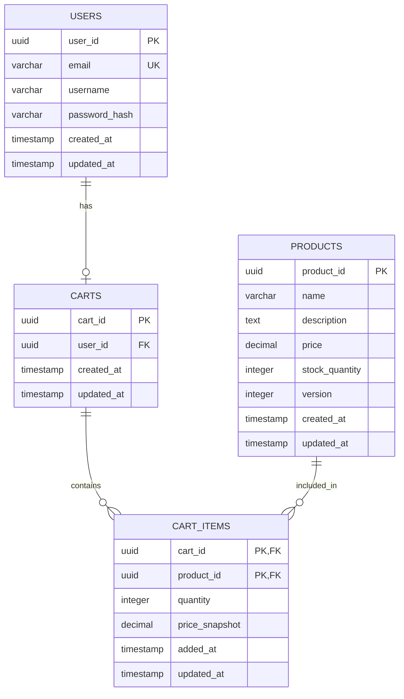
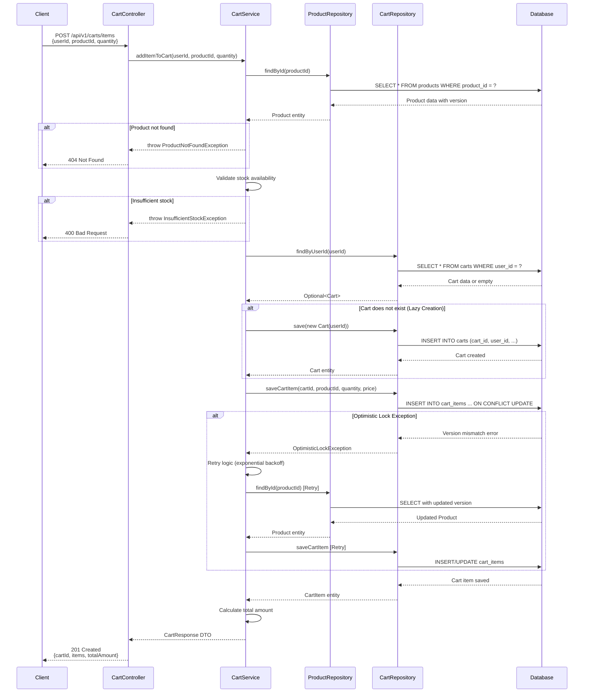

# Low Level Design (LLD) - E-Commerce Cart Management System

## 1. Introduction

### 1.1 Purpose
This document provides the Low Level Design for the E-Commerce Cart Management System, detailing the technical implementation of cart operations including add to cart, update quantities, remove items, and cart retrieval functionalities.

### 1.2 Scope
This LLD covers:
- Database schema design
- API endpoint specifications
- Service layer implementation
- Data access layer design
- Concurrency control mechanisms
- Error handling strategies

### 1.3 Technology Stack
- **Backend Framework**: Spring Boot 3.x
- **Database**: PostgreSQL 14+
- **ORM**: Spring Data JPA / Hibernate
- **API Style**: RESTful
- **Concurrency Control**: Optimistic Locking

## 2. System Architecture

### 2.1 Layered Architecture
```
┌─────────────────────────────────────┐
│     Presentation Layer              │
│  (REST Controllers)                 │
└─────────────────────────────────────┘
            ↓
┌─────────────────────────────────────┐
│     Business Logic Layer            │
│  (Services)                         │
└─────────────────────────────────────┘
            ↓
┌─────────────────────────────────────┐
│     Data Access Layer               │
│  (Repositories)                     │
└─────────────────────────────────────┘
            ↓
┌─────────────────────────────────────┐
│     Database Layer                  │
│  (PostgreSQL)                       │
└─────────────────────────────────────┘
```

## 3. Database Design

### 3.1 Entity Descriptions

#### 3.1.1 USERS Table
- Stores user account information
- Primary key: user_id (UUID)
- Contains user credentials and profile data

#### 3.1.2 PRODUCTS Table
- Stores product catalog information
- Primary key: product_id (UUID)
- Includes version column for optimistic locking
- Tracks inventory and pricing

#### 3.1.3 CARTS Table
- Stores shopping cart metadata
- Primary key: cart_id (UUID)
- Foreign key: user_id references USERS
- Supports lazy cart creation

#### 3.1.4 CART_ITEMS Table
- Stores individual items in shopping carts
- Composite primary key: (cart_id, product_id)
- Foreign keys: cart_id references CARTS, product_id references PRODUCTS
- Tracks quantity and price snapshot

### 3.2 Relationships
- One User has One Cart (1:1)
- One Cart has Many Cart Items (1:N)
- One Product can be in Many Cart Items (1:N)

## 4. API Design

### 4.1 Cart Controller Endpoints

#### 4.1.1 Add Item to Cart
```
POST /api/v1/carts/items
Request Body:
{
  "userId": "uuid",
  "productId": "uuid",
  "quantity": integer
}
Response: 201 Created
{
  "cartId": "uuid",
  "items": [...],
  "totalAmount": decimal
}
```

#### 4.1.2 Update Cart Item Quantity
```
PUT /api/v1/carts/items/{productId}
Request Body:
{
  "userId": "uuid",
  "quantity": integer
}
Response: 200 OK
```

#### 4.1.3 Remove Item from Cart
```
DELETE /api/v1/carts/items/{productId}?userId={uuid}
Response: 204 No Content
```

#### 4.1.4 Get Cart
```
GET /api/v1/carts?userId={uuid}
Response: 200 OK
{
  "cartId": "uuid",
  "userId": "uuid",
  "items": [...],
  "totalAmount": decimal,
  "createdAt": "timestamp",
  "updatedAt": "timestamp"
}
```

## 5. Service Layer Design

### 5.1 CartService

#### 5.1.1 Key Methods
- `addItemToCart(userId, productId, quantity)`: Adds or updates item in cart
- `updateCartItemQuantity(userId, productId, quantity)`: Updates item quantity
- `removeItemFromCart(userId, productId)`: Removes item from cart
- `getCart(userId)`: Retrieves user's cart with all items
- `clearCart(userId)`: Removes all items from cart

#### 5.1.2 Business Rules
- Lazy cart creation: Cart is created on first item addition
- Quantity validation: Must be positive integer
- Stock validation: Check product availability before adding
- Price snapshot: Store current product price in cart item
- Optimistic locking: Handle concurrent updates to products

### 5.2 ProductService
- `getProductById(productId)`: Retrieves product details
- `checkStockAvailability(productId, quantity)`: Validates stock
- `updateProductStock(productId, quantity)`: Updates inventory

## 6. Data Access Layer

### 6.1 Repository Interfaces

#### 6.1.1 CartRepository
```java
public interface CartRepository extends JpaRepository<Cart, UUID> {
    Optional<Cart> findByUserId(UUID userId);
    boolean existsByUserId(UUID userId);
}
```

#### 6.1.2 CartItemRepository
```java
public interface CartItemRepository extends JpaRepository<CartItem, CartItemId> {
    List<CartItem> findByCartId(UUID cartId);
    void deleteByCartIdAndProductId(UUID cartId, UUID productId);
}
```

#### 6.1.3 ProductRepository
```java
public interface ProductRepository extends JpaRepository<Product, UUID> {
    @Lock(LockModeType.OPTIMISTIC)
    Optional<Product> findById(UUID productId);
}
```

## 7. Concurrency Control

### 7.1 Optimistic Locking Strategy
- Products table includes `version` column
- JPA @Version annotation on Product entity
- Automatic version increment on updates
- OptimisticLockException thrown on conflicts

### 7.2 Exception Handling
- Catch OptimisticLockException in service layer
- Retry logic with exponential backoff
- Return appropriate error response to client

## 8. Error Handling

### 8.1 Exception Types
- `ProductNotFoundException`: Product ID not found
- `InsufficientStockException`: Requested quantity exceeds stock
- `InvalidQuantityException`: Quantity <= 0
- `CartNotFoundException`: Cart not found for user
- `OptimisticLockException`: Concurrent modification detected

### 8.2 HTTP Status Codes
- 200 OK: Successful retrieval
- 201 Created: Cart item added successfully
- 204 No Content: Item removed successfully
- 400 Bad Request: Invalid input data
- 404 Not Found: Resource not found
- 409 Conflict: Optimistic locking failure
- 500 Internal Server Error: Unexpected errors

## 9. Performance Considerations

### 9.1 Database Indexing
- Index on CARTS.user_id for fast cart lookup
- Composite index on CART_ITEMS(cart_id, product_id)
- Index on PRODUCTS.product_id for quick product retrieval

### 9.2 Query Optimization
- Use JOIN FETCH for eager loading cart items
- Implement pagination for large cart item lists
- Cache frequently accessed product data

### 9.3 Connection Pooling
- Configure HikariCP for optimal connection management
- Set appropriate pool size based on load testing

## 10. Security Considerations

### 10.1 Authentication & Authorization
- Validate user identity before cart operations
- Ensure users can only access their own carts
- Implement JWT-based authentication

### 10.2 Input Validation
- Validate all input parameters
- Sanitize user inputs to prevent SQL injection
- Implement rate limiting to prevent abuse

## 11. Testing Strategy

### 11.1 Unit Tests
- Test service layer business logic
- Mock repository dependencies
- Test exception handling scenarios

### 11.2 Integration Tests
- Test database operations
- Test API endpoints end-to-end
- Test optimistic locking behavior

### 11.3 Performance Tests
- Load testing for concurrent cart operations
- Stress testing for high traffic scenarios

---

## 12. Technical Artifacts

### 12.1 Entity-Relationship Diagram (ERD)



### 12.2 Add to Cart Sequence Diagram



### 12.3 Database Model (SQL DDL)

```sql
-- ============================================
-- E-Commerce Cart Management System
-- PostgreSQL Database Schema
-- ============================================

-- Enable UUID extension
CREATE EXTENSION IF NOT EXISTS "uuid-ossp";

-- ============================================
-- Table: USERS
-- Description: Stores user account information
-- ============================================
CREATE TABLE users (
    user_id UUID PRIMARY KEY DEFAULT uuid_generate_v4(),
    email VARCHAR(255) NOT NULL UNIQUE,
    username VARCHAR(100) NOT NULL,
    password_hash VARCHAR(255) NOT NULL,
    first_name VARCHAR(100),
    last_name VARCHAR(100),
    created_at TIMESTAMP NOT NULL DEFAULT CURRENT_TIMESTAMP,
    updated_at TIMESTAMP NOT NULL DEFAULT CURRENT_TIMESTAMP,
    
    CONSTRAINT users_email_check CHECK (email ~* '^[A-Za-z0-9._%+-]+@[A-Za-z0-9.-]+\.[A-Za-z]{2,}$')
);

-- ============================================
-- Table: PRODUCTS
-- Description: Stores product catalog with optimistic locking
-- ============================================
CREATE TABLE products (
    product_id UUID PRIMARY KEY DEFAULT uuid_generate_v4(),
    name VARCHAR(255) NOT NULL,
    description TEXT,
    price DECIMAL(10, 2) NOT NULL,
    stock_quantity INTEGER NOT NULL DEFAULT 0,
    version INTEGER NOT NULL DEFAULT 0,
    is_active BOOLEAN NOT NULL DEFAULT TRUE,
    created_at TIMESTAMP NOT NULL DEFAULT CURRENT_TIMESTAMP,
    updated_at TIMESTAMP NOT NULL DEFAULT CURRENT_TIMESTAMP,
    
    CONSTRAINT products_price_check CHECK (price >= 0),
    CONSTRAINT products_stock_check CHECK (stock_quantity >= 0)
);

-- ============================================
-- Table: CARTS
-- Description: Stores shopping cart metadata
-- ============================================
CREATE TABLE carts (
    cart_id UUID PRIMARY KEY DEFAULT uuid_generate_v4(),
    user_id UUID NOT NULL UNIQUE,
    created_at TIMESTAMP NOT NULL DEFAULT CURRENT_TIMESTAMP,
    updated_at TIMESTAMP NOT NULL DEFAULT CURRENT_TIMESTAMP,
    
    CONSTRAINT fk_carts_user_id 
        FOREIGN KEY (user_id) 
        REFERENCES users(user_id) 
        ON DELETE CASCADE
);

-- ============================================
-- Table: CART_ITEMS
-- Description: Stores individual items in shopping carts
-- ============================================
CREATE TABLE cart_items (
    cart_id UUID NOT NULL,
    product_id UUID NOT NULL,
    quantity INTEGER NOT NULL,
    price_snapshot DECIMAL(10, 2) NOT NULL,
    added_at TIMESTAMP NOT NULL DEFAULT CURRENT_TIMESTAMP,
    updated_at TIMESTAMP NOT NULL DEFAULT CURRENT_TIMESTAMP,
    
    PRIMARY KEY (cart_id, product_id),
    
    CONSTRAINT fk_cart_items_cart_id 
        FOREIGN KEY (cart_id) 
        REFERENCES carts(cart_id) 
        ON DELETE CASCADE,
    
    CONSTRAINT fk_cart_items_product_id 
        FOREIGN KEY (product_id) 
        REFERENCES products(product_id) 
        ON DELETE CASCADE,
    
    CONSTRAINT cart_items_quantity_check CHECK (quantity > 0),
    CONSTRAINT cart_items_price_check CHECK (price_snapshot >= 0)
);

-- ============================================
-- INDEXES
-- Description: Performance optimization indexes
-- ============================================

-- Index for fast user lookup
CREATE INDEX idx_users_email ON users(email);

-- Index for active products
CREATE INDEX idx_products_active ON products(is_active) WHERE is_active = TRUE;

-- Index for product name search
CREATE INDEX idx_products_name ON products(name);

-- Index for cart lookup by user
CREATE INDEX idx_carts_user_id ON carts(user_id);

-- Composite index for cart items lookup
CREATE INDEX idx_cart_items_cart_id ON cart_items(cart_id);

-- Index for product lookup in cart items
CREATE INDEX idx_cart_items_product_id ON cart_items(product_id);

-- ============================================
-- TRIGGERS
-- Description: Automatic timestamp updates
-- ============================================

-- Function to update updated_at timestamp
CREATE OR REPLACE FUNCTION update_updated_at_column()
RETURNS TRIGGER AS $$
BEGIN
    NEW.updated_at = CURRENT_TIMESTAMP;
    RETURN NEW;
END;
$$ LANGUAGE plpgsql;

-- Trigger for users table
CREATE TRIGGER update_users_updated_at
    BEFORE UPDATE ON users
    FOR EACH ROW
    EXECUTE FUNCTION update_updated_at_column();

-- Trigger for products table
CREATE TRIGGER update_products_updated_at
    BEFORE UPDATE ON products
    FOR EACH ROW
    EXECUTE FUNCTION update_updated_at_column();

-- Trigger for carts table
CREATE TRIGGER update_carts_updated_at
    BEFORE UPDATE ON carts
    FOR EACH ROW
    EXECUTE FUNCTION update_updated_at_column();

-- Trigger for cart_items table
CREATE TRIGGER update_cart_items_updated_at
    BEFORE UPDATE ON cart_items
    FOR EACH ROW
    EXECUTE FUNCTION update_updated_at_column();

-- ============================================
-- SAMPLE DATA (Optional - for testing)
-- ============================================

-- Insert sample users
INSERT INTO users (email, username, password_hash, first_name, last_name) VALUES
('john.doe@example.com', 'johndoe', '$2a$10$abcdefghijklmnopqrstuv', 'John', 'Doe'),
('jane.smith@example.com', 'janesmith', '$2a$10$wxyzabcdefghijklmnopqr', 'Jane', 'Smith');

-- Insert sample products
INSERT INTO products (name, description, price, stock_quantity) VALUES
('Laptop', 'High-performance laptop', 999.99, 50),
('Mouse', 'Wireless mouse', 29.99, 200),
('Keyboard', 'Mechanical keyboard', 79.99, 150),
('Monitor', '27-inch 4K monitor', 399.99, 75);

-- ============================================
-- COMMENTS
-- ============================================

COMMENT ON TABLE users IS 'Stores user account information';
COMMENT ON TABLE products IS 'Stores product catalog with optimistic locking support';
COMMENT ON TABLE carts IS 'Stores shopping cart metadata for users';
COMMENT ON TABLE cart_items IS 'Stores individual items in shopping carts with price snapshots';

COMMENT ON COLUMN products.version IS 'Version number for optimistic locking';
COMMENT ON COLUMN cart_items.price_snapshot IS 'Price at the time item was added to cart';
```

---

## 13. Deployment Considerations

### 13.1 Database Migration
- Use Flyway or Liquibase for version-controlled migrations
- Test migrations in staging environment first
- Implement rollback scripts for each migration

### 13.2 Monitoring
- Monitor database connection pool metrics
- Track API response times
- Alert on high error rates
- Monitor optimistic lock exception frequency

### 13.3 Scalability
- Implement database read replicas for read-heavy operations
- Consider Redis caching for frequently accessed data
- Implement horizontal scaling for application servers

---

## Document Control

- **Version**: 1.0
- **Last Updated**: 2024
- **Author**: Enterprise Documentation Generation Agent
- **Status**: Ready for Implementation
- **Review Status**: Pending Technical Review

---

**End of Low Level Design Document**