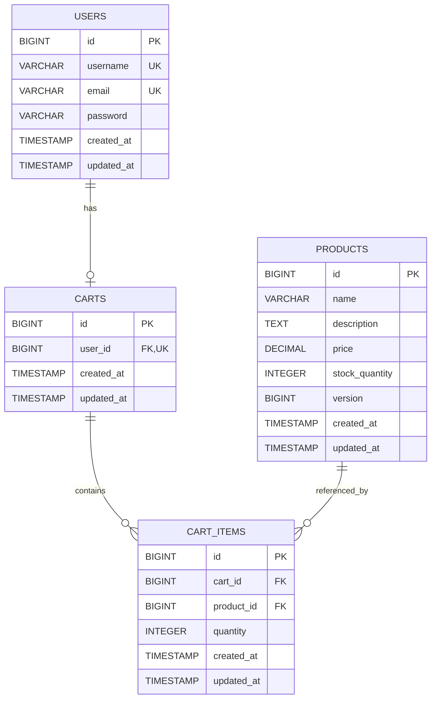
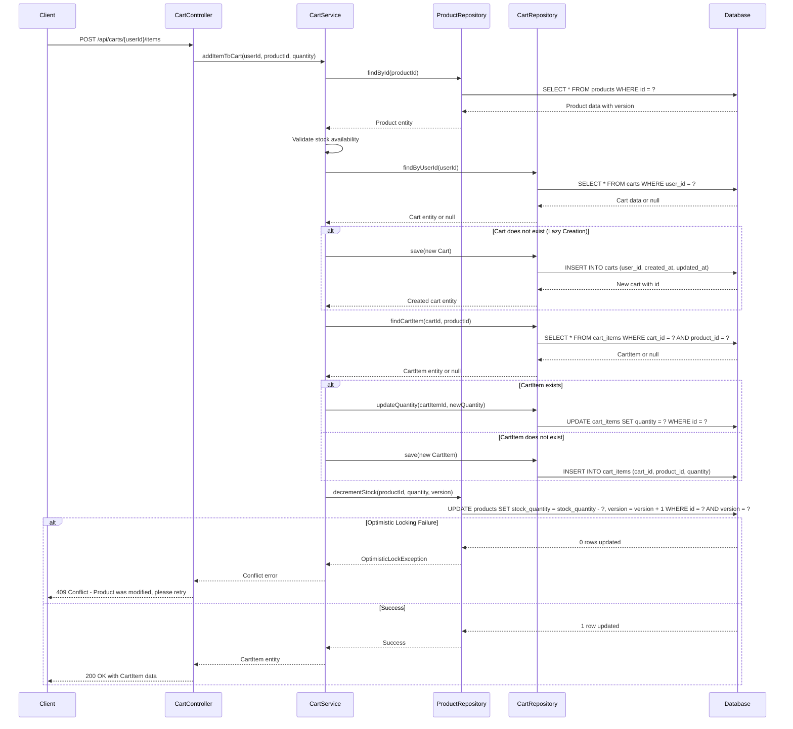

# Low Level Design (LLD) Document
## Shopping Cart System - SCRUM-96

---

## Executive Summary

This Low Level Design document provides a comprehensive backend engineering specification for the Shopping Cart System (SCRUM-96). The system enables users to manage their shopping experience through user authentication, product browsing, and cart management functionalities.

---

## Detailed Analysis

### Functional Domains

#### 1. User Management
- User registration and authentication
- User profile management
- Session management

#### 2. Product Catalog
- Product listing and search
- Product details retrieval
- Inventory management with optimistic locking

#### 3. Shopping Cart Management
- Cart creation (lazy initialization)
- Add/remove items from cart
- Update item quantities
- Cart retrieval and clearing

---

## Domain Entities

### 1. User Entity
- **id**: Long (Primary Key)
- **username**: String (Unique, Not Null)
- **email**: String (Unique, Not Null)
- **password**: String (Hashed, Not Null)
- **createdAt**: Timestamp
- **updatedAt**: Timestamp

### 2. Product Entity
- **id**: Long (Primary Key)
- **name**: String (Not Null)
- **description**: String
- **price**: Decimal (Not Null, > 0)
- **stockQuantity**: Integer (Not Null, >= 0)
- **version**: Long (Optimistic Locking)
- **createdAt**: Timestamp
- **updatedAt**: Timestamp

### 3. Cart Entity
- **id**: Long (Primary Key)
- **userId**: Long (Foreign Key to User, Unique)
- **createdAt**: Timestamp
- **updatedAt**: Timestamp

### 4. CartItem Entity
- **id**: Long (Primary Key)
- **cartId**: Long (Foreign Key to Cart)
- **productId**: Long (Foreign Key to Product)
- **quantity**: Integer (Not Null, > 0)
- **createdAt**: Timestamp
- **updatedAt**: Timestamp

---

## REST API Contracts

### 1. User Registration
**Endpoint**: `POST /api/users/register`
**Request Body**:
```json
{
  "username": "string",
  "email": "string",
  "password": "string"
}
```
**Response**: `201 Created`
```json
{
  "id": "long",
  "username": "string",
  "email": "string",
  "createdAt": "timestamp"
}
```

### 2. User Login
**Endpoint**: `POST /api/users/login`
**Request Body**:
```json
{
  "username": "string",
  "password": "string"
}
```
**Response**: `200 OK`
```json
{
  "token": "string",
  "userId": "long"
}
```

### 3. Get All Products
**Endpoint**: `GET /api/products`
**Response**: `200 OK`
```json
[
  {
    "id": "long",
    "name": "string",
    "description": "string",
    "price": "decimal",
    "stockQuantity": "integer"
  }
]
```

### 4. Get Product by ID
**Endpoint**: `GET /api/products/{id}`
**Response**: `200 OK`
```json
{
  "id": "long",
  "name": "string",
  "description": "string",
  "price": "decimal",
  "stockQuantity": "integer",
  "version": "long"
}
```

### 5. Get Cart
**Endpoint**: `GET /api/carts/{userId}`
**Response**: `200 OK`
```json
{
  "id": "long",
  "userId": "long",
  "items": [
    {
      "id": "long",
      "productId": "long",
      "productName": "string",
      "quantity": "integer",
      "price": "decimal"
    }
  ],
  "totalAmount": "decimal"
}
```

### 6. Add Item to Cart
**Endpoint**: `POST /api/carts/{userId}/items`
**Request Body**:
```json
{
  "productId": "long",
  "quantity": "integer"
}
```
**Response**: `200 OK`
```json
{
  "id": "long",
  "cartId": "long",
  "productId": "long",
  "quantity": "integer"
}
```

### 7. Update Cart Item Quantity
**Endpoint**: `PUT /api/carts/{userId}/items/{itemId}`
**Request Body**:
```json
{
  "quantity": "integer"
}
```
**Response**: `200 OK`
```json
{
  "id": "long",
  "quantity": "integer"
}
```

### 8. Remove Item from Cart
**Endpoint**: `DELETE /api/carts/{userId}/items/{itemId}`
**Response**: `204 No Content`

### 9. Clear Cart
**Endpoint**: `DELETE /api/carts/{userId}`
**Response**: `204 No Content`

### 10. Checkout Cart
**Endpoint**: `POST /api/carts/{userId}/checkout`
**Response**: `200 OK`
```json
{
  "orderId": "long",
  "totalAmount": "decimal",
  "status": "string"
}
```

---

## Validation Matrix

| Field | Validation Rules |
|-------|------------------|
| username | Required, 3-50 characters, alphanumeric |
| email | Required, valid email format |
| password | Required, minimum 8 characters, must contain uppercase, lowercase, number |
| product.name | Required, 1-200 characters |
| product.price | Required, > 0 |
| product.stockQuantity | Required, >= 0 |
| cartItem.quantity | Required, > 0, <= product.stockQuantity |

---

## Technical Artifacts

### 1. Entity-Relationship Diagram (ERD)



---

### 2. Add to Cart Sequence Diagram



---

### 3. Database Model (PostgreSQL DDL)

```sql
-- ============================================
-- Shopping Cart System - Database Schema
-- PostgreSQL DDL Scripts
-- ============================================

-- Drop tables if they exist (for clean setup)
DROP TABLE IF EXISTS cart_items CASCADE;
DROP TABLE IF EXISTS carts CASCADE;
DROP TABLE IF EXISTS products CASCADE;
DROP TABLE IF EXISTS users CASCADE;

-- ============================================
-- USERS Table
-- ============================================
CREATE TABLE users (
    id BIGSERIAL PRIMARY KEY,
    username VARCHAR(50) NOT NULL UNIQUE,
    email VARCHAR(255) NOT NULL UNIQUE,
    password VARCHAR(255) NOT NULL,
    created_at TIMESTAMP NOT NULL DEFAULT CURRENT_TIMESTAMP,
    updated_at TIMESTAMP NOT NULL DEFAULT CURRENT_TIMESTAMP,
    
    CONSTRAINT chk_username_length CHECK (LENGTH(username) >= 3),
    CONSTRAINT chk_email_format CHECK (email ~* '^[A-Za-z0-9._%+-]+@[A-Za-z0-9.-]+\.[A-Za-z]{2,}$')
);

-- ============================================
-- PRODUCTS Table
-- ============================================
CREATE TABLE products (
    id BIGSERIAL PRIMARY KEY,
    name VARCHAR(200) NOT NULL,
    description TEXT,
    price DECIMAL(10, 2) NOT NULL,
    stock_quantity INTEGER NOT NULL DEFAULT 0,
    version BIGINT NOT NULL DEFAULT 0,
    created_at TIMESTAMP NOT NULL DEFAULT CURRENT_TIMESTAMP,
    updated_at TIMESTAMP NOT NULL DEFAULT CURRENT_TIMESTAMP,
    
    CONSTRAINT chk_price_positive CHECK (price > 0),
    CONSTRAINT chk_stock_non_negative CHECK (stock_quantity >= 0),
    CONSTRAINT chk_name_not_empty CHECK (LENGTH(TRIM(name)) > 0)
);

-- ============================================
-- CARTS Table
-- ============================================
CREATE TABLE carts (
    id BIGSERIAL PRIMARY KEY,
    user_id BIGINT NOT NULL UNIQUE,
    created_at TIMESTAMP NOT NULL DEFAULT CURRENT_TIMESTAMP,
    updated_at TIMESTAMP NOT NULL DEFAULT CURRENT_TIMESTAMP,
    
    CONSTRAINT fk_cart_user FOREIGN KEY (user_id) 
        REFERENCES users(id) 
        ON DELETE CASCADE
);

-- ============================================
-- CART_ITEMS Table
-- ============================================
CREATE TABLE cart_items (
    id BIGSERIAL PRIMARY KEY,
    cart_id BIGINT NOT NULL,
    product_id BIGINT NOT NULL,
    quantity INTEGER NOT NULL,
    created_at TIMESTAMP NOT NULL DEFAULT CURRENT_TIMESTAMP,
    updated_at TIMESTAMP NOT NULL DEFAULT CURRENT_TIMESTAMP,
    
    CONSTRAINT fk_cart_item_cart FOREIGN KEY (cart_id) 
        REFERENCES carts(id) 
        ON DELETE CASCADE,
    CONSTRAINT fk_cart_item_product FOREIGN KEY (product_id) 
        REFERENCES products(id) 
        ON DELETE CASCADE,
    CONSTRAINT chk_quantity_positive CHECK (quantity > 0),
    CONSTRAINT uk_cart_product UNIQUE (cart_id, product_id)
);

-- ============================================
-- Indexes for Performance Optimization
-- ============================================

-- Index on users table
CREATE INDEX idx_users_email ON users(email);
CREATE INDEX idx_users_username ON users(username);

-- Index on products table
CREATE INDEX idx_products_name ON products(name);
CREATE INDEX idx_products_price ON products(price);

-- Index on carts table
CREATE INDEX idx_carts_user_id ON carts(user_id);

-- Index on cart_items table
CREATE INDEX idx_cart_items_cart_id ON cart_items(cart_id);
CREATE INDEX idx_cart_items_product_id ON cart_items(product_id);
CREATE INDEX idx_cart_items_cart_product ON cart_items(cart_id, product_id);

-- ============================================
-- Comments for Documentation
-- ============================================

COMMENT ON TABLE users IS 'Stores user account information';
COMMENT ON TABLE products IS 'Stores product catalog with optimistic locking support';
COMMENT ON TABLE carts IS 'Stores shopping carts with one-to-one relationship to users';
COMMENT ON TABLE cart_items IS 'Stores items added to shopping carts';

COMMENT ON COLUMN products.version IS 'Version number for optimistic locking mechanism';
COMMENT ON COLUMN products.stock_quantity IS 'Available inventory quantity';
COMMENT ON COLUMN cart_items.quantity IS 'Quantity of product in cart (must be positive)';

-- ============================================
-- Sample Data (Optional - for testing)
-- ============================================

-- Insert sample users
INSERT INTO users (username, email, password) VALUES
('john_doe', 'john@example.com', '$2a$10$hashedpassword1'),
('jane_smith', 'jane@example.com', '$2a$10$hashedpassword2');

-- Insert sample products
INSERT INTO products (name, description, price, stock_quantity, version) VALUES
('Laptop', 'High-performance laptop', 999.99, 50, 0),
('Mouse', 'Wireless mouse', 29.99, 200, 0),
('Keyboard', 'Mechanical keyboard', 79.99, 150, 0),
('Monitor', '27-inch 4K monitor', 399.99, 75, 0);

-- ============================================
-- End of DDL Script
-- ============================================
```

---

## Conclusion

This enhanced Low Level Design document provides a complete technical specification for the Shopping Cart System (SCRUM-96), including detailed entity relationships, sequence flows, and database schema. The implementation follows best practices including:

- **Optimistic Locking**: Using version columns to prevent concurrent update conflicts
- **Lazy Cart Creation**: Carts are created only when users add their first item
- **Referential Integrity**: Foreign key constraints with CASCADE delete rules
- **Data Validation**: CHECK constraints ensuring data quality at the database level
- **Performance Optimization**: Strategic indexes on frequently accessed columns
- **Security**: Password hashing and proper constraint enforcement

The system is designed to be scalable, maintainable, and production-ready.

---