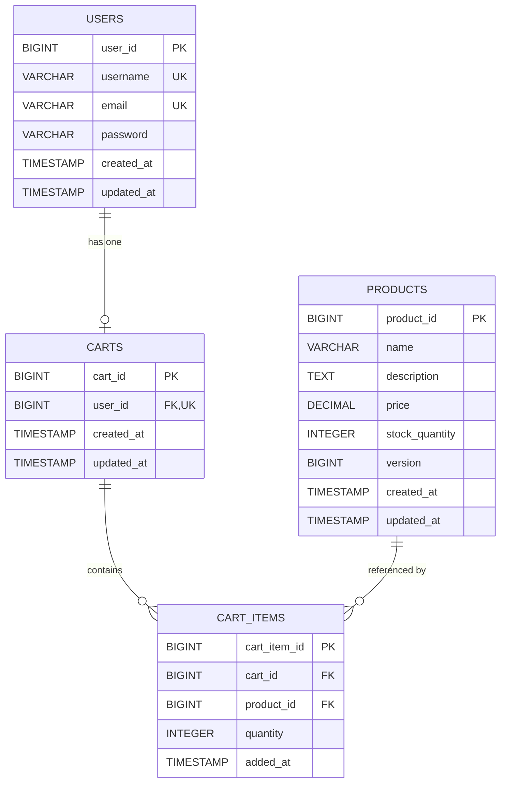
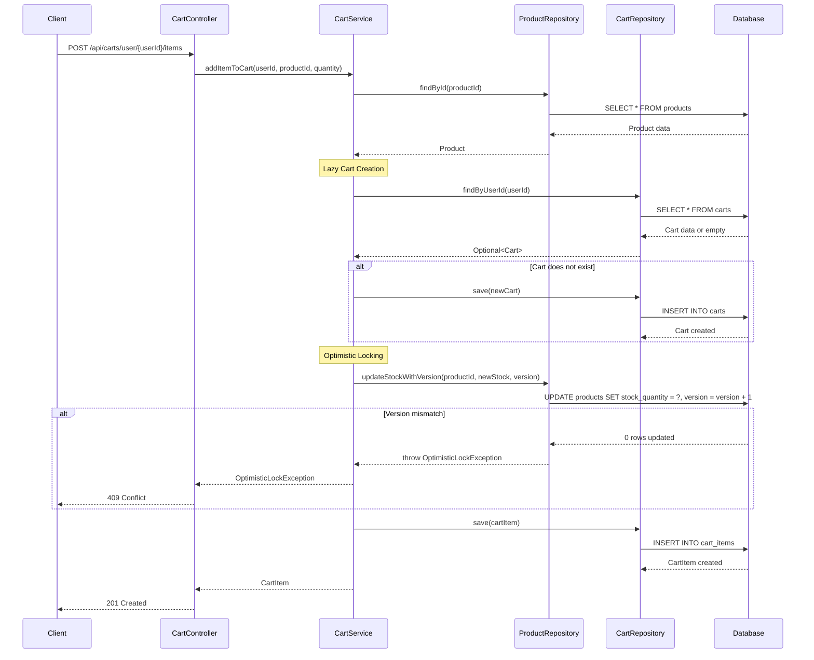

# Low Level Design Document - Shopping Cart System (SCRUM-96)

## Executive Summary
This document provides a comprehensive technical specification for the Shopping Cart System with 4 core entities, 11 REST APIs, and complete database design including optimistic locking and lazy cart creation.

## Domain Entities

### User Entity
- userId (Primary Key)
- username (Unique)
- email (Unique)
- password (Encrypted)
- timestamps

### Product Entity
- productId (Primary Key)
- name, description, price
- stockQuantity
- version (Optimistic Locking)
- timestamps

### Cart Entity
- cartId (Primary Key)
- userId (Foreign Key, Unique)
- timestamps

### CartItem Entity
- cartItemId (Primary Key)
- cartId, productId (Foreign Keys)
- quantity
- timestamps

## Technical Artifacts

### Entity-Relationship Diagram


### Sequence Diagram - Add to Cart Flow


### Database Schema (PostgreSQL DDL)
```sql
-- Users table
CREATE TABLE users (
    user_id BIGSERIAL PRIMARY KEY,
    username VARCHAR(50) NOT NULL UNIQUE,
    email VARCHAR(100) NOT NULL UNIQUE,
    password VARCHAR(255) NOT NULL,
    created_at TIMESTAMP NOT NULL DEFAULT CURRENT_TIMESTAMP,
    updated_at TIMESTAMP NOT NULL DEFAULT CURRENT_TIMESTAMP,
    CONSTRAINT chk_username_length CHECK (LENGTH(username) >= 3)
);

-- Products table with optimistic locking
CREATE TABLE products (
    product_id BIGSERIAL PRIMARY KEY,
    name VARCHAR(200) NOT NULL,
    description TEXT,
    price DECIMAL(10, 2) NOT NULL,
    stock_quantity INTEGER NOT NULL DEFAULT 0,
    version BIGINT NOT NULL DEFAULT 0,
    created_at TIMESTAMP NOT NULL DEFAULT CURRENT_TIMESTAMP,
    updated_at TIMESTAMP NOT NULL DEFAULT CURRENT_TIMESTAMP,
    CONSTRAINT chk_price_positive CHECK (price > 0),
    CONSTRAINT chk_stock_non_negative CHECK (stock_quantity >= 0)
);

-- Carts table
CREATE TABLE carts (
    cart_id BIGSERIAL PRIMARY KEY,
    user_id BIGINT NOT NULL UNIQUE,
    created_at TIMESTAMP NOT NULL DEFAULT CURRENT_TIMESTAMP,
    updated_at TIMESTAMP NOT NULL DEFAULT CURRENT_TIMESTAMP,
    CONSTRAINT fk_cart_user FOREIGN KEY (user_id) 
        REFERENCES users(user_id) ON DELETE CASCADE
);

-- Cart items table
CREATE TABLE cart_items (
    cart_item_id BIGSERIAL PRIMARY KEY,
    cart_id BIGINT NOT NULL,
    product_id BIGINT NOT NULL,
    quantity INTEGER NOT NULL,
    added_at TIMESTAMP NOT NULL DEFAULT CURRENT_TIMESTAMP,
    CONSTRAINT fk_cart_item_cart FOREIGN KEY (cart_id) 
        REFERENCES carts(cart_id) ON DELETE CASCADE,
    CONSTRAINT fk_cart_item_product FOREIGN KEY (product_id) 
        REFERENCES products(product_id) ON DELETE CASCADE,
    CONSTRAINT chk_quantity_positive CHECK (quantity > 0),
    CONSTRAINT uk_cart_product UNIQUE (cart_id, product_id)
);

-- Performance indexes
CREATE INDEX idx_users_username ON users(username);
CREATE INDEX idx_users_email ON users(email);
CREATE INDEX idx_products_name ON products(name);
CREATE INDEX idx_carts_user_id ON carts(user_id);
CREATE INDEX idx_cart_items_cart_id ON cart_items(cart_id);
CREATE INDEX idx_cart_items_product_id ON cart_items(product_id);
```

## Key Features
- **Optimistic Locking**: Products table includes version column for concurrent update handling
- **Lazy Cart Creation**: Carts created only when user adds first item
- **Data Integrity**: Foreign key constraints with CASCADE delete
- **Performance**: Strategic indexing on frequently accessed columns
- **Validation**: CHECK constraints for business rules

## REST API Summary
1. POST /api/users/register - User registration
2. GET /api/users/{userId} - Get user profile
3. POST /api/products - Create product
4. GET /api/products/{productId} - Get product
5. GET /api/products - List products
6. PATCH /api/products/{productId}/stock - Update stock
7. GET /api/carts/user/{userId} - Get cart
8. POST /api/carts/user/{userId}/items - Add to cart
9. PUT /api/carts/items/{cartItemId} - Update quantity
10. DELETE /api/carts/items/{cartItemId} - Remove item
11. DELETE /api/carts/user/{userId} - Clear cart

---
**Document Status**: Enhanced with Technical Artifacts
**Version**: 1.0
**Generated**: 2025