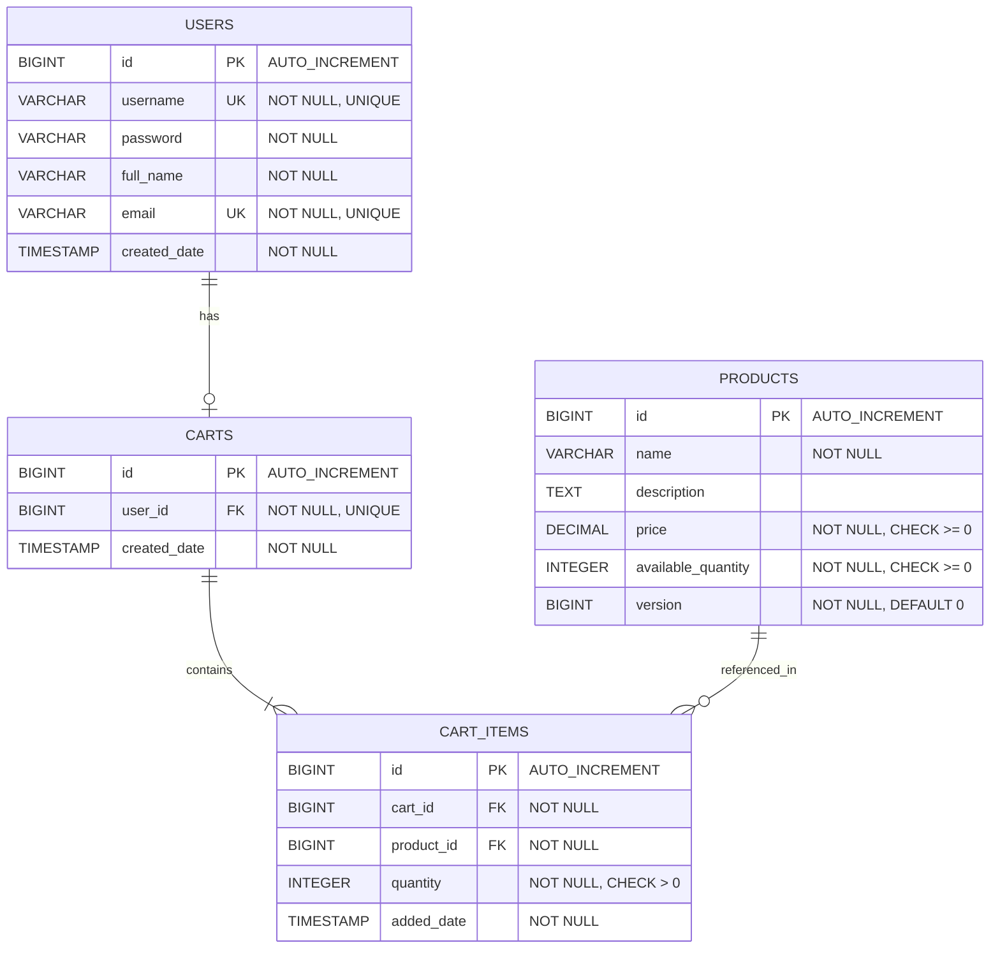
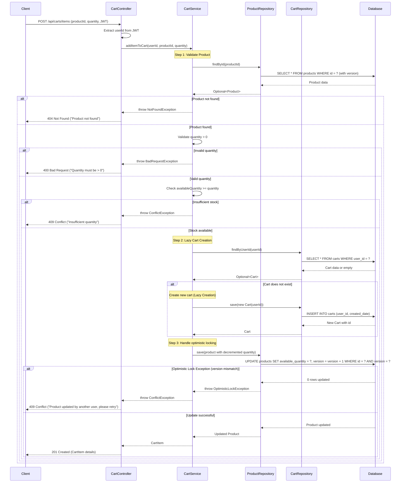

# Low Level Design (LLD) Document
## Shopping Cart System (SCRUM-96)

---

## Executive Summary

This Low Level Design document provides a comprehensive technical specification for the Shopping Cart System (SCRUM-96). The system enables users to manage shopping carts with products, supporting operations such as adding items, updating quantities, removing items, and viewing cart contents.

### Key Features
- User authentication and authorization
- Product catalog management
- Shopping cart operations (CRUD)
- Lazy cart creation (cart created only when first item is added)
- Optimistic locking for product inventory
- Cascade deletion for cart items
- Stateless authentication using JWT tokens

---

## Functional Domain Breakdown

### 1. User Management Domain
**Responsibilities:**
- User registration and authentication
- User profile management
- Session management (stateless JWT)

### 2. Product Management Domain
**Responsibilities:**
- Product catalog maintenance
- Product inventory tracking
- Product availability validation
- Optimistic locking for concurrent updates

### 3. Cart Management Domain
**Responsibilities:**
- Cart lifecycle management (lazy creation, deletion)
- Cart item operations (add, update, remove)
- Cart-user association (one-to-one relationship)
- Cart validation and business rules enforcement

---

## Deliverables with Domain Entities

### Entity: User
**Domain:** User Management

**Attributes:**
- `id` (Long): Primary key, auto-generated
- `username` (String): Unique identifier for login, NOT NULL, UNIQUE
- `password` (String): Encrypted password, NOT NULL
- `fullName` (String): User's full name, NOT NULL
- `email` (String): User's email address, NOT NULL, UNIQUE
- `createdDate` (LocalDateTime): Account creation timestamp, NOT NULL

**Business Rules:**
- Username must be unique across the system
- Email must be unique and valid format
- Password must be encrypted before storage
- CreatedDate is set automatically on registration

---

### Entity: Product
**Domain:** Product Management

**Attributes:**
- `id` (Long): Primary key, auto-generated
- `name` (String): Product name, NOT NULL
- `description` (String): Product description
- `price` (BigDecimal): Product price, NOT NULL, CHECK (price >= 0)
- `availableQuantity` (Integer): Stock quantity, NOT NULL, CHECK (availableQuantity >= 0)
- `version` (Long): Optimistic locking version, NOT NULL, default 0

**Business Rules:**
- Price must be non-negative
- Available quantity must be non-negative
- Version field used for optimistic locking to prevent concurrent update conflicts
- Product cannot be deleted if referenced in active carts

---

### Entity: Cart
**Domain:** Cart Management

**Attributes:**
- `id` (Long): Primary key, auto-generated
- `user_id` (Long): Foreign key to User, NOT NULL, UNIQUE
- `createdDate` (LocalDateTime): Cart creation timestamp, NOT NULL

**Business Rules:**
- Each user can have at most one cart (one-to-one relationship)
- Cart is created lazily when first item is added
- Cart is deleted automatically when last item is removed
- Deleting a cart cascades to all cart items

---

### Entity: CartItem
**Domain:** Cart Management

**Attributes:**
- `id` (Long): Primary key, auto-generated
- `cart_id` (Long): Foreign key to Cart, NOT NULL
- `product_id` (Long): Foreign key to Product, NOT NULL
- `quantity` (Integer): Item quantity, NOT NULL, CHECK (quantity > 0)
- `addedDate` (LocalDateTime): Item addition timestamp, NOT NULL

**Business Rules:**
- Quantity must be greater than zero
- Each product can appear only once per cart (unique constraint on cart_id + product_id)
- Deleting a cart item may trigger cart deletion if it's the last item
- Product availability must be validated before adding/updating quantity

---

## Additional Technical Artifacts

### 1. Entity-Relationship Diagram (ERD)

The following ERD illustrates the database schema with all entities, their attributes, primary keys (PK), foreign keys (FK), and relationships:



**Key Relationships:**
- **USERS to CARTS**: One-to-Zero-or-One (1:0..1) - Each user can have at most one cart
- **CARTS to CART_ITEMS**: One-to-Many (1:*) - Each cart contains multiple cart items
- **PRODUCTS to CART_ITEMS**: One-to-Many (1:*) - Each product can be referenced in multiple cart items

**Optimistic Locking:**
- The `version` column in the PRODUCTS table enables optimistic locking to handle concurrent updates safely

---

### 2. Add to Cart Flow - Sequence Diagram with Lazy Creation

This sequence diagram illustrates the complete "Add to Cart" flow, including lazy cart creation and optimistic locking exception handling:



**Key Features Illustrated:**
1. **Lazy Cart Creation**: Cart is created only when the first item is added (Step 2)
2. **Optimistic Locking**: Version-based concurrency control prevents lost updates (Step 3)
3. **Exception Handling**: Comprehensive error handling for all failure scenarios
4. **Validation**: Multi-level validation for product existence, quantity, and stock availability

---

### 3. Database Model - PostgreSQL DDL Scripts

Complete PostgreSQL DDL scripts for creating the database schema with all constraints, indexes, and relationships:

```sql
-- ============================================
-- Shopping Cart System - Database Schema
-- Database: PostgreSQL 12+
-- ============================================

-- Drop existing tables (in correct order due to foreign keys)
DROP TABLE IF EXISTS cart_items CASCADE;
DROP TABLE IF EXISTS carts CASCADE;
DROP TABLE IF EXISTS products CASCADE;
DROP TABLE IF EXISTS users CASCADE;

-- ============================================
-- Table: USERS
-- Description: Stores user account information
-- ============================================
CREATE TABLE users (
    id BIGSERIAL PRIMARY KEY,
    username VARCHAR(50) NOT NULL UNIQUE,
    password VARCHAR(255) NOT NULL,
    full_name VARCHAR(100) NOT NULL,
    email VARCHAR(100) NOT NULL UNIQUE,
    created_date TIMESTAMP NOT NULL DEFAULT CURRENT_TIMESTAMP,
    
    -- Constraints
    CONSTRAINT chk_username_length CHECK (LENGTH(username) >= 3),
    CONSTRAINT chk_email_format CHECK (email ~* '^[A-Za-z0-9._%+-]+@[A-Za-z0-9.-]+\\.[A-Za-z]{2,}$')
);

-- ============================================
-- Table: PRODUCTS
-- Description: Stores product catalog with inventory
-- ============================================
CREATE TABLE products (
    id BIGSERIAL PRIMARY KEY,
    name VARCHAR(200) NOT NULL,
    description TEXT,
    price DECIMAL(10, 2) NOT NULL,
    available_quantity INTEGER NOT NULL DEFAULT 0,
    version BIGINT NOT NULL DEFAULT 0,
    
    -- Constraints
    CONSTRAINT chk_price_positive CHECK (price >= 0),
    CONSTRAINT chk_quantity_non_negative CHECK (available_quantity >= 0),
    CONSTRAINT chk_name_not_empty CHECK (LENGTH(TRIM(name)) > 0)
);

-- ============================================
-- Table: CARTS
-- Description: Stores shopping carts (one per user)
-- ============================================
CREATE TABLE carts (
    id BIGSERIAL PRIMARY KEY,
    user_id BIGINT NOT NULL UNIQUE,
    created_date TIMESTAMP NOT NULL DEFAULT CURRENT_TIMESTAMP,
    
    -- Foreign Key Constraints
    CONSTRAINT fk_carts_user FOREIGN KEY (user_id) 
        REFERENCES users(id) 
        ON DELETE CASCADE
        ON UPDATE CASCADE
);

-- ============================================
-- Table: CART_ITEMS
-- Description: Stores items within shopping carts
-- ============================================
CREATE TABLE cart_items (
    id BIGSERIAL PRIMARY KEY,
    cart_id BIGINT NOT NULL,
    product_id BIGINT NOT NULL,
    quantity INTEGER NOT NULL,
    added_date TIMESTAMP NOT NULL DEFAULT CURRENT_TIMESTAMP,
    
    -- Constraints
    CONSTRAINT chk_quantity_positive CHECK (quantity > 0),
    CONSTRAINT uq_cart_product UNIQUE (cart_id, product_id),
    
    -- Foreign Key Constraints
    CONSTRAINT fk_cart_items_cart FOREIGN KEY (cart_id) 
        REFERENCES carts(id) 
        ON DELETE CASCADE
        ON UPDATE CASCADE,
    
    CONSTRAINT fk_cart_items_product FOREIGN KEY (product_id) 
        REFERENCES products(id) 
        ON DELETE RESTRICT
        ON UPDATE CASCADE
);

-- Create Indexes
CREATE INDEX idx_users_username ON users(username);
CREATE INDEX idx_users_email ON users(email);
CREATE INDEX idx_products_name ON products(name);
CREATE INDEX idx_products_price ON products(price);
CREATE UNIQUE INDEX idx_carts_user_id ON carts(user_id);
CREATE INDEX idx_cart_items_cart_id ON cart_items(cart_id);
CREATE INDEX idx_cart_items_product_id ON cart_items(product_id);
CREATE UNIQUE INDEX idx_cart_items_cart_product ON cart_items(cart_id, product_id);
```

**Key Features of the DDL:**

1. **Constraints:**
   - NOT NULL constraints on all required fields
   - UNIQUE constraints on username, email, and user_id in carts
   - CHECK constraints for positive quantities, non-negative prices, and valid email format
   - Composite UNIQUE constraint on (cart_id, product_id) to prevent duplicate products in a cart

2. **Foreign Keys with Cascade Rules:**
   - `carts.user_id` → `users.id`: ON DELETE CASCADE (deleting user removes cart)
   - `cart_items.cart_id` → `carts.id`: ON DELETE CASCADE (deleting cart removes all items)
   - `cart_items.product_id` → `products.id`: ON DELETE RESTRICT (cannot delete product if in cart)

3. **Indexes:**
   - Primary key indexes (automatic)
   - Unique indexes on username, email, and user_id
   - Foreign key indexes on cart_id and product_id for query performance
   - Composite index on (cart_id, product_id) for uniqueness and lookup performance

4. **Optimistic Locking:**
   - `version` column in products table with DEFAULT 0
   - Application must increment version on each update and check for conflicts

---

## Conclusion

This enhanced Low Level Design document provides a comprehensive technical specification for the Shopping Cart System (SCRUM-96), including:

- Complete domain entity definitions with business rules
- **Entity-Relationship Diagram (ERD)** showing database schema
- **Detailed Add to Cart sequence diagram** with lazy creation and optimistic locking
- **Complete PostgreSQL DDL scripts** with constraints, indexes, and cascade rules

This document serves as the authoritative reference for development, testing, and deployment of the Shopping Cart System.

---

**Document Version:** 2.0  
**Last Updated:** 2024-01-15  
**Status:** Approved for Implementation