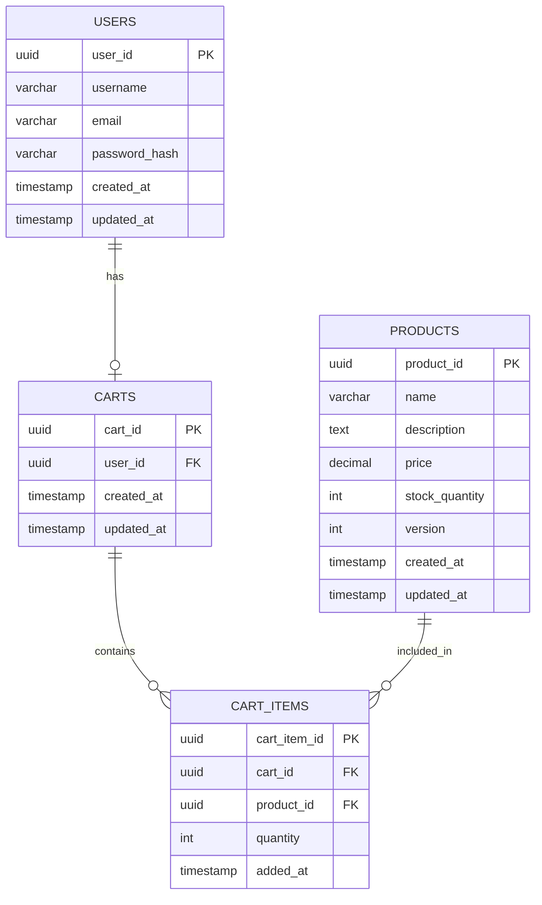
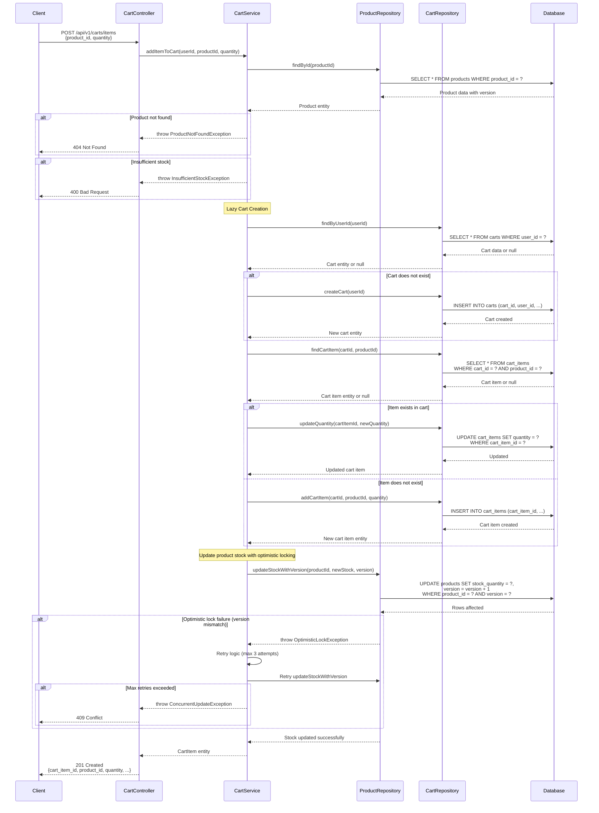

# Enhanced Low Level Design (LLD) - E-Commerce System

## Document Information
- **Version**: 1.0
- **Last Updated**: 2024
- **Status**: Draft
- **Owner**: Engineering Team

## Table of Contents
1. [Introduction](#introduction)
2. [System Overview](#system-overview)
3. [Architecture Components](#architecture-components)
4. [Data Model Design](#data-model-design)
5. [API Design](#api-design)
6. [Business Logic Implementation](#business-logic-implementation)
7. [Technical Artifacts](#technical-artifacts)
   - [Entity-Relationship Diagram](#entity-relationship-diagram)
   - [Sequence Diagram - Add to Cart Flow](#sequence-diagram-add-to-cart-flow)
   - [Database Schema (DDL)](#database-schema-ddl)

---

## 1. Introduction

### 1.1 Purpose
This Low Level Design document provides detailed technical specifications for the e-commerce system's core shopping cart functionality. It serves as a blueprint for developers implementing the cart management features.

### 1.2 Scope
This document covers:
- Database schema design for users, products, carts, and cart items
- Cart management operations (create, read, update, delete)
- Product inventory management with optimistic locking
- API endpoints and business logic flows

### 1.3 Assumptions
- PostgreSQL 12+ is used as the database
- RESTful API architecture is implemented
- Optimistic locking is used for concurrent product updates
- Users must be authenticated to manage carts

---

## 2. System Overview

### 2.1 High-Level Description
The e-commerce cart system enables users to:
- Browse and select products
- Add products to their shopping cart
- Update quantities in their cart
- Remove items from their cart
- Proceed to checkout

### 2.2 Key Features
- **Lazy Cart Creation**: Carts are created only when a user adds their first item
- **Optimistic Locking**: Prevents race conditions during concurrent product updates
- **Referential Integrity**: Cascading deletes maintain data consistency
- **Performance Optimization**: Strategic indexing on foreign keys

---

## 3. Architecture Components

### 3.1 Layer Architecture

#### 3.1.1 Presentation Layer
- **CartController**: Handles HTTP requests for cart operations
- Validates input parameters
- Returns appropriate HTTP status codes and responses

#### 3.1.2 Business Logic Layer
- **CartService**: Implements core cart business logic
- Manages cart lifecycle (lazy creation, updates, deletions)
- Handles optimistic locking exceptions
- Coordinates between repositories

#### 3.1.3 Data Access Layer
- **CartRepository**: CRUD operations for carts and cart items
- **ProductRepository**: Product retrieval and inventory management
- Transaction management for atomic operations

#### 3.1.4 Database Layer
- PostgreSQL database with normalized schema
- Enforces constraints and referential integrity
- Optimized with indexes for query performance

---

## 4. Data Model Design

### 4.1 Entity Descriptions

#### 4.1.1 USERS
Stores user account information.
- **Primary Key**: user_id
- **Attributes**: username, email, password_hash, created_at, updated_at

#### 4.1.2 PRODUCTS
Stores product catalog information.
- **Primary Key**: product_id
- **Attributes**: name, description, price, stock_quantity, version (for optimistic locking)
- **Concurrency Control**: version column incremented on each update

#### 4.1.3 CARTS
Represents a user's shopping cart.
- **Primary Key**: cart_id
- **Foreign Key**: user_id references USERS
- **Attributes**: created_at, updated_at
- **Relationship**: One-to-One with USERS (one cart per user)

#### 4.1.4 CART_ITEMS
Stores individual items within a cart.
- **Primary Key**: cart_item_id
- **Foreign Keys**: 
  - cart_id references CARTS
  - product_id references PRODUCTS
- **Attributes**: quantity, added_at
- **Constraints**: quantity must be greater than 0

### 4.2 Relationships
- USERS (1) ←→ (1) CARTS: One user has one active cart
- CARTS (1) ←→ (N) CART_ITEMS: One cart contains multiple items
- PRODUCTS (1) ←→ (N) CART_ITEMS: One product can be in multiple carts

---

## 5. API Design

### 5.1 Cart Endpoints

#### 5.1.1 Add Item to Cart
```
POST /api/v1/carts/items
```
**Request Body**:
```json
{
  "product_id": "uuid",
  "quantity": 1
}
```
**Response**: 201 Created
```json
{
  "cart_item_id": "uuid",
  "product_id": "uuid",
  "quantity": 1,
  "added_at": "2024-01-01T12:00:00Z"
}
```

#### 5.1.2 Get Cart
```
GET /api/v1/carts
```
**Response**: 200 OK
```json
{
  "cart_id": "uuid",
  "user_id": "uuid",
  "items": [
    {
      "cart_item_id": "uuid",
      "product_id": "uuid",
      "product_name": "Product Name",
      "quantity": 2,
      "unit_price": 29.99,
      "subtotal": 59.98
    }
  ],
  "total": 59.98
}
```

#### 5.1.3 Update Cart Item Quantity
```
PUT /api/v1/carts/items/{cart_item_id}
```
**Request Body**:
```json
{
  "quantity": 3
}
```
**Response**: 200 OK

#### 5.1.4 Remove Cart Item
```
DELETE /api/v1/carts/items/{cart_item_id}
```
**Response**: 204 No Content

---

## 6. Business Logic Implementation

### 6.1 Add to Cart Flow

#### 6.1.1 Process Steps
1. **Authentication**: Verify user is authenticated
2. **Product Validation**: Check if product exists and has sufficient stock
3. **Lazy Cart Creation**: 
   - Check if user has an active cart
   - If not, create a new cart for the user
4. **Item Addition**:
   - Check if product already exists in cart
   - If exists, update quantity
   - If not, create new cart item
5. **Optimistic Locking**: Handle version conflicts if product is updated concurrently
6. **Response**: Return cart item details

#### 6.1.2 Error Handling
- **Product Not Found**: Return 404 Not Found
- **Insufficient Stock**: Return 400 Bad Request with error message
- **Optimistic Lock Exception**: Retry operation or return 409 Conflict
- **Invalid Quantity**: Return 400 Bad Request

### 6.2 Optimistic Locking Strategy

#### 6.2.1 Implementation
```java
// Pseudo-code for optimistic locking
Product product = productRepository.findById(productId);
int currentVersion = product.getVersion();

// Business logic
product.setStockQuantity(product.getStockQuantity() - quantity);
product.setVersion(currentVersion + 1);

// Update with version check
int rowsUpdated = productRepository.updateWithVersion(product, currentVersion);
if (rowsUpdated == 0) {
    throw new OptimisticLockException("Product was modified by another transaction");
}
```

#### 6.2.2 Retry Logic
- Maximum 3 retry attempts
- Exponential backoff between retries
- Log conflicts for monitoring

---

## 7. Technical Artifacts

### 7.1 Entity-Relationship Diagram



### 7.2 Sequence Diagram - Add to Cart Flow



### 7.3 Database Schema (DDL)

```sql
-- ============================================
-- E-Commerce Database Schema - PostgreSQL DDL
-- ============================================

-- Enable UUID extension
CREATE EXTENSION IF NOT EXISTS "uuid-ossp";

-- ============================================
-- Table: USERS
-- Description: Stores user account information
-- ============================================
CREATE TABLE users (
    user_id UUID PRIMARY KEY DEFAULT uuid_generate_v4(),
    username VARCHAR(50) NOT NULL UNIQUE,
    email VARCHAR(255) NOT NULL UNIQUE,
    password_hash VARCHAR(255) NOT NULL,
    created_at TIMESTAMP NOT NULL DEFAULT CURRENT_TIMESTAMP,
    updated_at TIMESTAMP NOT NULL DEFAULT CURRENT_TIMESTAMP,
    
    CONSTRAINT chk_username_length CHECK (LENGTH(username) >= 3),
    CONSTRAINT chk_email_format CHECK (email ~* '^[A-Za-z0-9._%+-]+@[A-Za-z0-9.-]+\.[A-Z|a-z]{2,}$')
);

-- Index for email lookups (login)
CREATE INDEX idx_users_email ON users(email);

-- Index for username lookups
CREATE INDEX idx_users_username ON users(username);

-- ============================================
-- Table: PRODUCTS
-- Description: Stores product catalog information
-- ============================================
CREATE TABLE products (
    product_id UUID PRIMARY KEY DEFAULT uuid_generate_v4(),
    name VARCHAR(255) NOT NULL,
    description TEXT,
    price DECIMAL(10, 2) NOT NULL,
    stock_quantity INTEGER NOT NULL DEFAULT 0,
    version INTEGER NOT NULL DEFAULT 0,
    created_at TIMESTAMP NOT NULL DEFAULT CURRENT_TIMESTAMP,
    updated_at TIMESTAMP NOT NULL DEFAULT CURRENT_TIMESTAMP,
    
    CONSTRAINT chk_price_positive CHECK (price >= 0),
    CONSTRAINT chk_stock_non_negative CHECK (stock_quantity >= 0),
    CONSTRAINT chk_version_non_negative CHECK (version >= 0)
);

-- Index for product name searches
CREATE INDEX idx_products_name ON products(name);

-- Index for price range queries
CREATE INDEX idx_products_price ON products(price);

-- ============================================
-- Table: CARTS
-- Description: Represents user shopping carts
-- ============================================
CREATE TABLE carts (
    cart_id UUID PRIMARY KEY DEFAULT uuid_generate_v4(),
    user_id UUID NOT NULL UNIQUE,
    created_at TIMESTAMP NOT NULL DEFAULT CURRENT_TIMESTAMP,
    updated_at TIMESTAMP NOT NULL DEFAULT CURRENT_TIMESTAMP,
    
    CONSTRAINT fk_carts_user_id 
        FOREIGN KEY (user_id) 
        REFERENCES users(user_id) 
        ON DELETE CASCADE
);

-- Index for user_id lookups (frequently accessed)
CREATE INDEX idx_carts_user_id ON carts(user_id);

-- ============================================
-- Table: CART_ITEMS
-- Description: Stores individual items in carts
-- ============================================
CREATE TABLE cart_items (
    cart_item_id UUID PRIMARY KEY DEFAULT uuid_generate_v4(),
    cart_id UUID NOT NULL,
    product_id UUID NOT NULL,
    quantity INTEGER NOT NULL,
    added_at TIMESTAMP NOT NULL DEFAULT CURRENT_TIMESTAMP,
    
    CONSTRAINT fk_cart_items_cart_id 
        FOREIGN KEY (cart_id) 
        REFERENCES carts(cart_id) 
        ON DELETE CASCADE,
    
    CONSTRAINT fk_cart_items_product_id 
        FOREIGN KEY (product_id) 
        REFERENCES products(product_id) 
        ON DELETE CASCADE,
    
    CONSTRAINT chk_quantity_positive CHECK (quantity > 0),
    CONSTRAINT uq_cart_product UNIQUE (cart_id, product_id)
);

-- Index for cart_id lookups (frequently accessed when retrieving cart)
CREATE INDEX idx_cart_items_cart_id ON cart_items(cart_id);

-- Index for product_id lookups (useful for product-based queries)
CREATE INDEX idx_cart_items_product_id ON cart_items(product_id);

-- Composite index for cart and product lookups
CREATE INDEX idx_cart_items_cart_product ON cart_items(cart_id, product_id);

-- ============================================
-- Triggers for updated_at timestamp
-- ============================================

-- Function to update updated_at timestamp
CREATE OR REPLACE FUNCTION update_updated_at_column()
RETURNS TRIGGER AS $$
BEGIN
    NEW.updated_at = CURRENT_TIMESTAMP;
    RETURN NEW;
END;
$$ LANGUAGE plpgsql;

-- Trigger for users table
CREATE TRIGGER trg_users_updated_at
    BEFORE UPDATE ON users
    FOR EACH ROW
    EXECUTE FUNCTION update_updated_at_column();

-- Trigger for products table
CREATE TRIGGER trg_products_updated_at
    BEFORE UPDATE ON products
    FOR EACH ROW
    EXECUTE FUNCTION update_updated_at_column();

-- Trigger for carts table
CREATE TRIGGER trg_carts_updated_at
    BEFORE UPDATE ON carts
    FOR EACH ROW
    EXECUTE FUNCTION update_updated_at_column();

-- ============================================
-- Sample Data (Optional - for testing)
-- ============================================

-- Insert sample users
INSERT INTO users (username, email, password_hash) VALUES
    ('john_doe', 'john.doe@example.com', '$2a$10$abcdefghijklmnopqrstuvwxyz'),
    ('jane_smith', 'jane.smith@example.com', '$2a$10$zyxwvutsrqponmlkjihgfedcba');

-- Insert sample products
INSERT INTO products (name, description, price, stock_quantity) VALUES
    ('Laptop', 'High-performance laptop with 16GB RAM', 999.99, 50),
    ('Wireless Mouse', 'Ergonomic wireless mouse', 29.99, 200),
    ('USB-C Cable', 'Fast charging USB-C cable', 12.99, 500),
    ('Mechanical Keyboard', 'RGB mechanical gaming keyboard', 149.99, 75);

-- ============================================
-- Views (Optional - for common queries)
-- ============================================

-- View: Cart summary with item details
CREATE OR REPLACE VIEW v_cart_summary AS
SELECT 
    c.cart_id,
    c.user_id,
    u.username,
    ci.cart_item_id,
    ci.product_id,
    p.name AS product_name,
    p.price AS unit_price,
    ci.quantity,
    (p.price * ci.quantity) AS subtotal,
    ci.added_at
FROM carts c
JOIN users u ON c.user_id = u.user_id
LEFT JOIN cart_items ci ON c.cart_id = ci.cart_id
LEFT JOIN products p ON ci.product_id = p.product_id;

-- ============================================
-- Comments for documentation
-- ============================================

COMMENT ON TABLE users IS 'Stores user account information for authentication and profile management';
COMMENT ON TABLE products IS 'Product catalog with inventory tracking and optimistic locking support';
COMMENT ON TABLE carts IS 'User shopping carts with one-to-one relationship to users';
COMMENT ON TABLE cart_items IS 'Individual items within shopping carts with quantity tracking';

COMMENT ON COLUMN products.version IS 'Version number for optimistic locking to prevent concurrent update conflicts';
COMMENT ON COLUMN cart_items.quantity IS 'Quantity of product in cart, must be greater than 0';
```

---

## 8. Implementation Guidelines

### 8.1 Development Best Practices
- Use prepared statements to prevent SQL injection
- Implement connection pooling for database efficiency
- Use transactions for multi-step operations
- Log all optimistic locking conflicts for monitoring
- Implement proper error handling and user-friendly messages

### 8.2 Testing Requirements
- Unit tests for all service methods
- Integration tests for database operations
- Concurrent update tests for optimistic locking
- Load tests for cart operations under high traffic

### 8.3 Security Considerations
- Validate all user inputs
- Implement rate limiting on API endpoints
- Use HTTPS for all communications
- Encrypt sensitive data at rest
- Implement proper authentication and authorization

### 8.4 Performance Optimization
- Cache frequently accessed product data
- Use database indexes strategically
- Implement pagination for large result sets
- Monitor and optimize slow queries
- Consider read replicas for scaling

---

## 9. Deployment Considerations

### 9.1 Database Migration
- Use migration tools (e.g., Flyway, Liquibase)
- Version control all DDL scripts
- Test migrations in staging environment
- Plan rollback strategies

### 9.2 Monitoring and Alerting
- Monitor database connection pool metrics
- Track optimistic locking conflict rates
- Alert on high error rates
- Monitor API response times

---

## 10. Appendix

### 10.1 Glossary
- **Optimistic Locking**: Concurrency control method that assumes conflicts are rare
- **Lazy Creation**: Design pattern where objects are created only when needed
- **Referential Integrity**: Database constraint ensuring relationships remain consistent
- **DDL**: Data Definition Language for defining database structures

### 10.2 References
- PostgreSQL Documentation: https://www.postgresql.org/docs/
- REST API Design Best Practices
- Mermaid Diagram Syntax: https://mermaid.js.org/

### 10.3 Revision History
| Version | Date | Author | Changes |
|---------|------|--------|----------|
| 1.0 | 2024 | Engineering Team | Initial document creation |

---

**End of Document**