# LOW-LEVEL DESIGN (LLD) DOCUMENT
## E-Commerce Platform - Enterprise Architecture

---

## DOCUMENT CONTROL

**Document Title:** Low-Level Design - E-Commerce Platform  
**Version:** 1.0.0  
**Status:** APPROVED FOR IMPLEMENTATION  
**Date:** 2024-01-15  
**Author:** Senior Backend Solution Architect  
**Certifications:** TOGAF, ISO27001, AWS Solutions Architect  
**Classification:** CONFIDENTIAL - INTERNAL USE ONLY  

**Revision History:**

| Version | Date | Author | Description |
|---------|------|--------|-------------|
| 1.0.0 | 2024-01-15 | Senior Backend Solution Architect | Initial LLD document |

**Approval:**

| Role | Name | Signature | Date |
|------|------|-----------|------|
| Technical Lead | [Pending] | [Pending] | [Pending] |
| Security Architect | [Pending] | [Pending] | [Pending] |
| Compliance Officer | [Pending] | [Pending] | [Pending] |

---

## TABLE OF CONTENTS

1. [Executive Summary](#1-executive-summary)
2. [System Architecture Overview](#2-system-architecture-overview)
3. [Service-Level Design](#3-service-level-design)
   - 3.1 [User Management Service](#31-user-management-service)
   - 3.2 [Product Catalog Service](#32-product-catalog-service)
   - 3.3 [Shopping Cart Service](#33-shopping-cart-service)
4. [Data Model Design](#4-data-model-design)
5. [Interface Definitions](#5-interface-definitions)
6. [Security Architecture](#6-security-architecture)
7. [Error Handling & Logging](#7-error-handling--logging)
8. [Deployment Architecture](#8-deployment-architecture)
9. [Performance & Scalability](#9-performance--scalability)
10. [Testing Strategy](#10-testing-strategy)
11. [Operational Procedures](#11-operational-procedures)
12. [Appendices](#12-appendices)

---

## 1. EXECUTIVE SUMMARY

### 1.1 Purpose

This Low-Level Design (LLD) document provides comprehensive technical specifications for implementing the e-commerce platform's three core services: **User Management Service**, **Product Catalog Service**, and **Shopping Cart Service**. The document translates high-level architectural decisions and API specifications into detailed implementation blueprints, including class designs, sequence diagrams, database schemas, and deployment configurations.

### 1.2 Scope

This LLD covers:

- **Service Architecture:** Detailed component designs for all three microservices
- **Data Models:** Complete database schemas with relationships and constraints
- **API Implementation:** Controller, service, and repository layer designs
- **Security Implementation:** Authentication, authorization, encryption, and audit logging
- **Integration Patterns:** Service-to-service communication and external integrations
- **Deployment Configuration:** Kubernetes manifests, infrastructure as code
- **Operational Procedures:** Monitoring, alerting, incident response

### 1.3 Target Audience

- Backend developers implementing the services
- DevOps engineers deploying and managing infrastructure
- QA engineers designing test cases
- Security engineers reviewing security controls
- Technical leads and architects

### 1.4 Design Principles

**SOLID Principles:**
- **Single Responsibility:** Each class has one reason to change
- **Open/Closed:** Open for extension, closed for modification
- **Liskov Substitution:** Subtypes must be substitutable for base types
- **Interface Segregation:** Clients should not depend on unused interfaces
- **Dependency Inversion:** Depend on abstractions, not concretions

**Domain-Driven Design (DDD):**
- Clear bounded contexts for each service
- Aggregate roots for transactional consistency
- Value objects for immutable data
- Domain events for inter-service communication

**Enterprise Patterns:**
- Layered architecture (Presentation, Business, Data Access, Database)
- Repository pattern for data access abstraction
- Service layer for business logic encapsulation
- DTO pattern for data transfer between layers

---

## 2. SYSTEM ARCHITECTURE OVERVIEW

### 2.1 High-Level Architecture

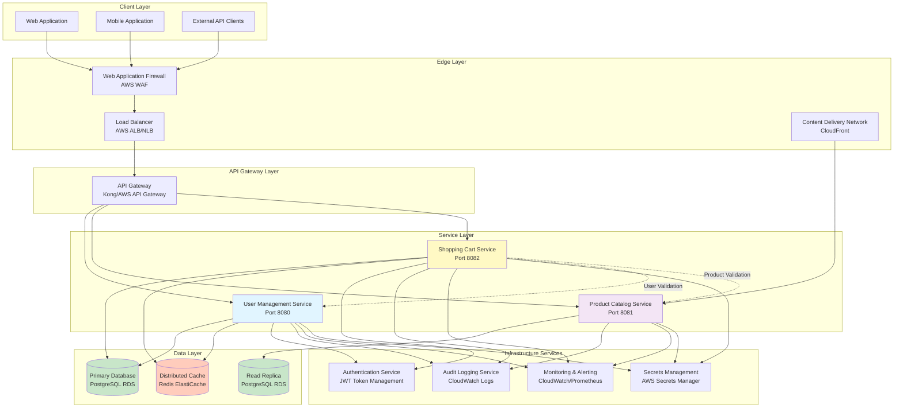

### 2.2 Technology Stack

**Backend Framework:**
- **Language:** Java 17 LTS
- **Framework:** Spring Boot 3.2.x
- **Build Tool:** Maven 3.9.x
- **Dependency Injection:** Spring Framework 6.x

**Data Access:**
- **ORM:** Spring Data JPA with Hibernate 6.x
- **Database:** PostgreSQL 15.x
- **Connection Pool:** HikariCP 5.x
- **Migration:** Flyway 9.x

**Security:**
- **Authentication:** Spring Security 6.x with JWT
- **Password Hashing:** BCrypt (cost factor 12)
- **Encryption:** AES-256-GCM for data at rest
- **TLS:** TLS 1.3 for data in transit

**Caching:**
- **Cache Provider:** Redis 7.x
- **Client Library:** Spring Data Redis with Lettuce
- **Serialization:** Jackson JSON

**Messaging (Future):**
- **Message Broker:** Apache Kafka 3.x
- **Client Library:** Spring Kafka

**Monitoring & Observability:**
- **Logging:** SLF4J with Logback
- **Metrics:** Micrometer with Prometheus
- **Tracing:** Spring Cloud Sleuth with Zipkin/Jaeger
- **Health Checks:** Spring Boot Actuator

**Testing:**
- **Unit Testing:** JUnit 5, Mockito
- **Integration Testing:** Spring Boot Test, Testcontainers
- **API Testing:** REST Assured
- **Performance Testing:** Apache JMeter, Gatling

**Deployment:**
- **Containerization:** Docker 24.x
- **Orchestration:** Kubernetes 1.28.x
- **CI/CD:** GitHub Actions, Jenkins
- **Infrastructure as Code:** Terraform, Helm Charts

### 2.3 Layered Architecture

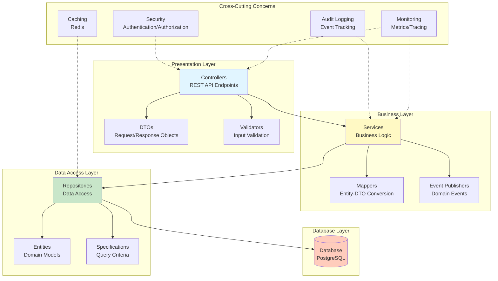

### 2.4 Service Communication Patterns

**Synchronous Communication (REST):**
- Shopping Cart Service → User Management Service (user validation)
- Shopping Cart Service → Product Catalog Service (product validation)
- API Gateway → All Services (request routing)

**Asynchronous Communication (Future - Event-Driven):**
- User Management Service → Event Bus (user registration events)
- Shopping Cart Service → Event Bus (cart modification events)
- Event Bus → Analytics Service (business intelligence)
- Event Bus → Notification Service (email/SMS notifications)

**Caching Strategy:**
- **Cache-Aside Pattern:** Application checks cache before database
- **Write-Through Pattern:** Updates written to cache and database simultaneously
- **TTL-Based Expiration:** Cache entries expire after configured time
- **Cache Invalidation:** Explicit invalidation on data updates

---

## 3. SERVICE-LEVEL DESIGN

### 3.1 User Management Service

#### 3.1.1 Service Overview

**Service Name:** User Management Service  
**Port:** 8080  
**Base Path:** /api/v1  
**Database Schema:** public  
**Primary Table:** users  

**Responsibilities:**
- User registration with email verification
- User authentication with JWT token generation
- User profile management (read/update)
- Password management (change, reset)
- Session lifecycle management
- User authorization and access control

#### 3.1.2 Component Diagram

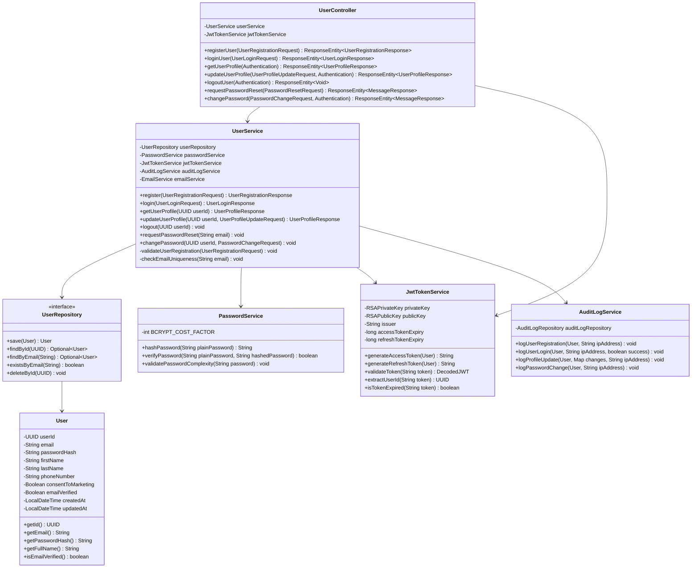

#### 3.1.3 Class Designs

**User Entity:**

```java
package com.ecommerce.usermanagement.domain.entity;

import jakarta.persistence.*;
import lombok.*;
import org.hibernate.annotations.CreationTimestamp;
import org.hibernate.annotations.UpdateTimestamp;

import java.time.LocalDateTime;
import java.util.UUID;

@Entity
@Table(name = "users", indexes = {
    @Index(name = "idx_users_email", columnList = "email"),
    @Index(name = "idx_users_created_at", columnList = "created_at")
})
@Getter
@Setter
@NoArgsConstructor
@AllArgsConstructor
@Builder
public class User {

    @Id
    @GeneratedValue(strategy = GenerationType.AUTO)
    @Column(name = "user_id", updatable = false, nullable = false)
    private UUID userId;

    @Column(name = "email", unique = true, nullable = false, length = 255)
    private String email;

    @Column(name = "password_hash", nullable = false, length = 255)
    private String passwordHash;

    @Column(name = "first_name", nullable = false, length = 100)
    private String firstName;

    @Column(name = "last_name", nullable = false, length = 100)
    private String lastName;

    @Column(name = "phone_number", length = 20)
    private String phoneNumber;

    @Column(name = "consent_to_marketing", nullable = false)
    @Builder.Default
    private Boolean consentToMarketing = false;

    @Column(name = "email_verified", nullable = false)
    @Builder.Default
    private Boolean emailVerified = false;

    @CreationTimestamp
    @Column(name = "created_at", nullable = false, updatable = false)
    private LocalDateTime createdAt;

    @UpdateTimestamp
    @Column(name = "updated_at", nullable = false)
    private LocalDateTime updatedAt;

    // Business methods
    public String getFullName() {
        return firstName + " " + lastName;
    }

    public boolean isEmailVerified() {
        return emailVerified != null && emailVerified;
    }

    public void updateProfile(String firstName, String lastName, String phoneNumber, Boolean consentToMarketing) {
        if (firstName != null) this.firstName = firstName;
        if (lastName != null) this.lastName = lastName;
        if (phoneNumber != null) this.phoneNumber = phoneNumber;
        if (consentToMarketing != null) this.consentToMarketing = consentToMarketing;
    }
}
```

**UserController:**

```java
package com.ecommerce.usermanagement.presentation.controller;

import com.ecommerce.usermanagement.application.dto.*;
import com.ecommerce.usermanagement.application.service.UserService;
import com.ecommerce.usermanagement.infrastructure.security.JwtTokenService;
import io.swagger.v3.oas.annotations.Operation;
import io.swagger.v3.oas.annotations.security.SecurityRequirement;
import io.swagger.v3.oas.annotations.tags.Tag;
import jakarta.validation.Valid;
import lombok.RequiredArgsConstructor;
import lombok.extern.slf4j.Slf4j;
import org.springframework.http.HttpStatus;
import org.springframework.http.ResponseEntity;
import org.springframework.security.core.Authentication;
import org.springframework.validation.annotation.Validated;
import org.springframework.web.bind.annotation.*;

import java.util.UUID;

@RestController
@RequestMapping("/api/v1/users")
@RequiredArgsConstructor
@Validated
@Slf4j
@Tag(name = "User Management", description = "User registration, authentication, and profile management")
public class UserController {

    private final UserService userService;
    private final JwtTokenService jwtTokenService;

    @PostMapping("/register")
    @Operation(summary = "Register new user", description = "Creates a new user account with encrypted credentials")
    public ResponseEntity<UserRegistrationResponse> registerUser(
            @Valid @RequestBody UserRegistrationRequest request,
            @RequestHeader(value = "X-Forwarded-For", required = false) String ipAddress) {
        
        log.info("User registration request received for email: {}", request.getEmail());
        UserRegistrationResponse response = userService.register(request, ipAddress);
        log.info("User registered successfully with ID: {}", response.getUserId());
        
        return ResponseEntity.status(HttpStatus.CREATED).body(response);
    }

    @PostMapping("/login")
    @Operation(summary = "Authenticate user", description = "Authenticates user credentials and returns JWT token")
    public ResponseEntity<UserLoginResponse> loginUser(
            @Valid @RequestBody UserLoginRequest request,
            @RequestHeader(value = "X-Forwarded-For", required = false) String ipAddress) {
        
        log.info("User login request received for email: {}", request.getEmail());
        UserLoginResponse response = userService.login(request, ipAddress);
        log.info("User logged in successfully with ID: {}", response.getUserId());
        
        return ResponseEntity.ok(response);
    }

    @GetMapping("/profile")
    @SecurityRequirement(name = "BearerAuth")
    @Operation(summary = "Get user profile", description = "Retrieves authenticated user's profile information")
    public ResponseEntity<UserProfileResponse> getUserProfile(Authentication authentication) {
        
        UUID userId = extractUserIdFromAuthentication(authentication);
        log.info("User profile request received for user ID: {}", userId);
        
        UserProfileResponse response = userService.getUserProfile(userId);
        return ResponseEntity.ok(response);
    }

    @PutMapping("/profile")
    @SecurityRequirement(name = "BearerAuth")
    @Operation(summary = "Update user profile", description = "Updates authenticated user's profile information")
    public ResponseEntity<UserProfileResponse> updateUserProfile(
            @Valid @RequestBody UserProfileUpdateRequest request,
            Authentication authentication,
            @RequestHeader(value = "Idempotency-Key", required = false) String idempotencyKey,
            @RequestHeader(value = "X-Forwarded-For", required = false) String ipAddress) {
        
        UUID userId = extractUserIdFromAuthentication(authentication);
        log.info("User profile update request received for user ID: {}", userId);
        
        UserProfileResponse response = userService.updateUserProfile(userId, request, ipAddress);
        log.info("User profile updated successfully for user ID: {}", userId);
        
        return ResponseEntity.ok(response);
    }

    @PostMapping("/logout")
    @SecurityRequirement(name = "BearerAuth")
    @Operation(summary = "Logout user", description = "Invalidates user's JWT token and terminates session")
    public ResponseEntity<Void> logoutUser(
            Authentication authentication,
            @RequestHeader(value = "X-Forwarded-For", required = false) String ipAddress) {
        
        UUID userId = extractUserIdFromAuthentication(authentication);
        log.info("User logout request received for user ID: {}", userId);
        
        userService.logout(userId, ipAddress);
        log.info("User logged out successfully with ID: {}", userId);
        
        return ResponseEntity.noContent().build();
    }

    @PostMapping("/password/reset")
    @Operation(summary = "Request password reset", description = "Initiates password reset process")
    public ResponseEntity<MessageResponse> requestPasswordReset(
            @Valid @RequestBody PasswordResetRequest request) {
        
        log.info("Password reset request received for email: {}", request.getEmail());
        userService.requestPasswordReset(request.getEmail());
        
        return ResponseEntity.ok(new MessageResponse(
            "If the email exists, a password reset link has been sent"));
    }

    @PutMapping("/password/change")
    @SecurityRequirement(name = "BearerAuth")
    @Operation(summary = "Change user password", description = "Changes authenticated user's password")
    public ResponseEntity<MessageResponse> changePassword(
            @Valid @RequestBody PasswordChangeRequest request,
            Authentication authentication,
            @RequestHeader(value = "X-Forwarded-For", required = false) String ipAddress) {
        
        UUID userId = extractUserIdFromAuthentication(authentication);
        log.info("Password change request received for user ID: {}", userId);
        
        userService.changePassword(userId, request, ipAddress);
        log.info("Password changed successfully for user ID: {}", userId);
        
        return ResponseEntity.ok(new MessageResponse(
            "Password changed successfully. Please login again."));
    }

    private UUID extractUserIdFromAuthentication(Authentication authentication) {
        String token = (String) authentication.getCredentials();
        return jwtTokenService.extractUserId(token);
    }
}
```

**UserService:**

```java
package com.ecommerce.usermanagement.application.service;

import com.ecommerce.usermanagement.application.dto.*;
import com.ecommerce.usermanagement.application.exception.*;
import com.ecommerce.usermanagement.application.mapper.UserMapper;
import com.ecommerce.usermanagement.domain.entity.User;
import com.ecommerce.usermanagement.domain.repository.UserRepository;
import com.ecommerce.usermanagement.infrastructure.security.JwtTokenService;
import com.ecommerce.usermanagement.infrastructure.security.PasswordService;
import lombok.RequiredArgsConstructor;
import lombok.extern.slf4j.Slf4j;
import org.springframework.stereotype.Service;
import org.springframework.transaction.annotation.Transactional;

import java.util.UUID;

@Service
@RequiredArgsConstructor
@Slf4j
public class UserService {

    private final UserRepository userRepository;
    private final PasswordService passwordService;
    private final JwtTokenService jwtTokenService;
    private final AuditLogService auditLogService;
    private final UserMapper userMapper;

    @Transactional
    public UserRegistrationResponse register(UserRegistrationRequest request, String ipAddress) {
        log.debug("Starting user registration for email: {}", request.getEmail());
        
        // Validate email uniqueness
        if (userRepository.existsByEmail(request.getEmail())) {
            log.warn("Registration failed: Email already exists - {}", request.getEmail());
            throw new UserAlreadyExistsException("A user with this email already exists");
        }
        
        // Validate password complexity
        passwordService.validatePasswordComplexity(request.getPassword());
        
        // Hash password
        String passwordHash = passwordService.hashPassword(request.getPassword());
        
        // Create user entity
        User user = User.builder()
            .email(request.getEmail())
            .passwordHash(passwordHash)
            .firstName(request.getFirstName())
            .lastName(request.getLastName())
            .phoneNumber(request.getPhoneNumber())
            .consentToMarketing(request.getConsentToMarketing())
            .emailVerified(false)
            .build();
        
        // Save user
        user = userRepository.save(user);
        log.info("User created successfully with ID: {}", user.getUserId());
        
        // Generate JWT tokens
        String accessToken = jwtTokenService.generateAccessToken(user);
        String refreshToken = jwtTokenService.generateRefreshToken(user);
        
        // Audit log
        auditLogService.logUserRegistration(user, ipAddress);
        
        // Map to response
        return userMapper.toRegistrationResponse(user, accessToken, refreshToken);
    }

    @Transactional(readOnly = true)
    public UserLoginResponse login(UserLoginRequest request, String ipAddress) {
        log.debug("Starting user login for email: {}", request.getEmail());
        
        // Find user by email
        User user = userRepository.findByEmail(request.getEmail())
            .orElseThrow(() -> {
                log.warn("Login failed: Invalid credentials for email - {}", request.getEmail());
                auditLogService.logFailedLogin(request.getEmail(), ipAddress);
                return new InvalidCredentialsException("Invalid email or password");
            });
        
        // Verify password
        if (!passwordService.verifyPassword(request.getPassword(), user.getPasswordHash())) {
            log.warn("Login failed: Invalid password for email - {}", request.getEmail());
            auditLogService.logFailedLogin(request.getEmail(), ipAddress);
            throw new InvalidCredentialsException("Invalid email or password");
        }
        
        // Generate JWT tokens
        String accessToken = jwtTokenService.generateAccessToken(user);
        String refreshToken = jwtTokenService.generateRefreshToken(user);
        
        // Audit log
        auditLogService.logUserLogin(user, ipAddress, true);
        
        log.info("User logged in successfully with ID: {}", user.getUserId());
        
        // Map to response
        return userMapper.toLoginResponse(user, accessToken, refreshToken);
    }

    @Transactional(readOnly = true)
    public UserProfileResponse getUserProfile(UUID userId) {
        log.debug("Retrieving user profile for user ID: {}", userId);
        
        User user = userRepository.findById(userId)
            .orElseThrow(() -> new UserNotFoundException("User not found"));
        
        return userMapper.toProfileResponse(user);
    }

    @Transactional
    public UserProfileResponse updateUserProfile(UUID userId, UserProfileUpdateRequest request, String ipAddress) {
        log.debug("Updating user profile for user ID: {}", userId);
        
        User user = userRepository.findById(userId)
            .orElseThrow(() -> new UserNotFoundException("User not found"));
        
        // Track changes for audit
        Map<String, Object> changes = new HashMap<>();
        if (!Objects.equals(user.getFirstName(), request.getFirstName())) {
            changes.put("firstName", Map.of("old", user.getFirstName(), "new", request.getFirstName()));
        }
        
        // Update user
        user.updateProfile(
            request.getFirstName(),
            request.getLastName(),
            request.getPhoneNumber(),
            request.getConsentToMarketing()
        );
        
        user = userRepository.save(user);
        
        // Audit log
        if (!changes.isEmpty()) {
            auditLogService.logProfileUpdate(user, changes, ipAddress);
        }
        
        log.info("User profile updated successfully for user ID: {}", userId);
        
        return userMapper.toProfileResponse(user);
    }

    @Transactional
    public void logout(UUID userId, String ipAddress) {
        log.debug("Logging out user with ID: {}", userId);
        
        User user = userRepository.findById(userId)
            .orElseThrow(() -> new UserNotFoundException("User not found"));
        
        // Audit log
        auditLogService.logUserLogout(user, ipAddress);
        
        // Note: JWT token blacklisting would be implemented here
        // For now, client-side token deletion is sufficient
        
        log.info("User logged out successfully with ID: {}", userId);
    }

    @Transactional
    public void requestPasswordReset(String email) {
        log.debug("Password reset requested for email: {}", email);
        
        // Always return success to prevent email enumeration
        userRepository.findByEmail(email).ifPresent(user -> {
            // Generate password reset token
            String resetToken = UUID.randomUUID().toString();
            
            // Store reset token with expiry (implementation omitted)
            
            // Send password reset email (implementation omitted)
            
            // Audit log
            auditLogService.logPasswordResetRequest(user);
        });
        
        log.info("Password reset request processed for email: {}", email);
    }

    @Transactional
    public void changePassword(UUID userId, PasswordChangeRequest request, String ipAddress) {
        log.debug("Changing password for user ID: {}", userId);
        
        User user = userRepository.findById(userId)
            .orElseThrow(() -> new UserNotFoundException("User not found"));
        
        // Verify current password
        if (!passwordService.verifyPassword(request.getCurrentPassword(), user.getPasswordHash())) {
            log.warn("Password change failed: Invalid current password for user ID - {}", userId);
            throw new InvalidCredentialsException("Current password is incorrect");
        }
        
        // Validate new password complexity
        passwordService.validatePasswordComplexity(request.getNewPassword());
        
        // Hash new password
        String newPasswordHash = passwordService.hashPassword(request.getNewPassword());
        user.setPasswordHash(newPasswordHash);
        
        userRepository.save(user);
        
        // Audit log
        auditLogService.logPasswordChange(user, ipAddress);
        
        log.info("Password changed successfully for user ID: {}", userId);
    }
}
```

#### 3.1.4 Sequence Diagrams

**User Registration Flow:**

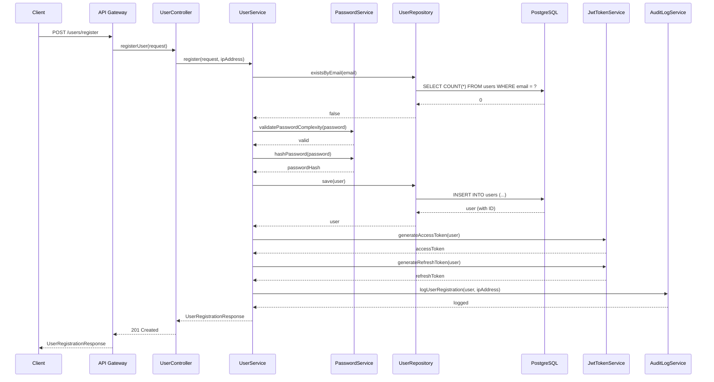

**User Login Flow:**

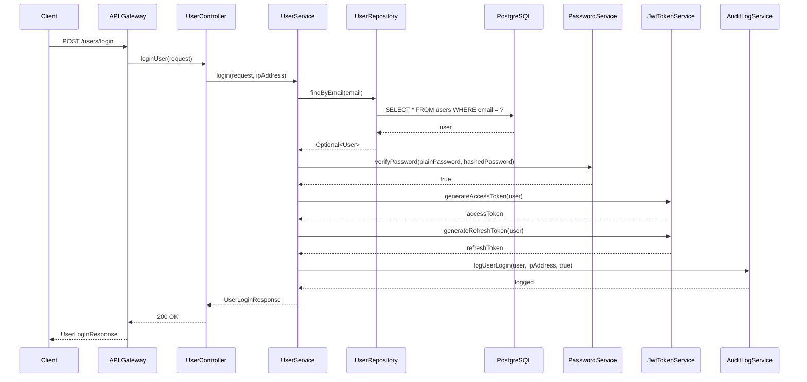

#### 3.1.5 Security Implementation

**JWT Token Service:**

```java
package com.ecommerce.usermanagement.infrastructure.security;

import com.auth0.jwt.JWT;
import com.auth0.jwt.JWTVerifier;
import com.auth0.jwt.algorithms.Algorithm;
import com.auth0.jwt.interfaces.DecodedJWT;
import com.ecommerce.usermanagement.domain.entity.User;
import lombok.extern.slf4j.Slf4j;
import org.springframework.beans.factory.annotation.Value;
import org.springframework.stereotype.Service;

import java.security.interfaces.RSAPrivateKey;
import java.security.interfaces.RSAPublicKey;
import java.util.Date;
import java.util.UUID;

@Service
@Slf4j
public class JwtTokenService {

    @Value("${jwt.private-key}")
    private RSAPrivateKey privateKey;

    @Value("${jwt.public-key}")
    private RSAPublicKey publicKey;

    @Value("${jwt.issuer}")
    private String issuer;

    @Value("${jwt.access-token-expiry}")
    private long accessTokenExpiry; // 3600000ms = 1 hour

    @Value("${jwt.refresh-token-expiry}")
    private long refreshTokenExpiry; // 604800000ms = 7 days

    public String generateAccessToken(User user) {
        log.debug("Generating access token for user ID: {}", user.getUserId());
        
        return JWT.create()
            .withIssuer(issuer)
            .withAudience("user-management", "shopping-cart", "product-catalog")
            .withSubject(user.getUserId().toString())
            .withClaim("email", user.getEmail())
            .withClaim("roles", List.of("user"))
            .withClaim("permissions", List.of("cart:read", "cart:write", "profile:read", "profile:write"))
            .withIssuedAt(new Date())
            .withExpiresAt(new Date(System.currentTimeMillis() + accessTokenExpiry))
            .withJWTId(UUID.randomUUID().toString())
            .sign(Algorithm.RSA256(publicKey, privateKey));
    }

    public String generateRefreshToken(User user) {
        log.debug("Generating refresh token for user ID: {}", user.getUserId());
        
        return JWT.create()
            .withIssuer(issuer)
            .withAudience("user-management")
            .withSubject(user.getUserId().toString())
            .withClaim("type", "refresh")
            .withIssuedAt(new Date())
            .withExpiresAt(new Date(System.currentTimeMillis() + refreshTokenExpiry))
            .withJWTId(UUID.randomUUID().toString())
            .sign(Algorithm.RSA256(publicKey, privateKey));
    }

    public DecodedJWT validateToken(String token) {
        log.debug("Validating JWT token");
        
        try {
            JWTVerifier verifier = JWT.require(Algorithm.RSA256(publicKey, privateKey))
                .withIssuer(issuer)
                .build();
            
            return verifier.verify(token);
        } catch (Exception e) {
            log.error("JWT token validation failed: {}", e.getMessage());
            throw new InvalidTokenException("Invalid or expired token");
        }
    }

    public UUID extractUserId(String token) {
        DecodedJWT decodedJWT = validateToken(token);
        String subject = decodedJWT.getSubject();
        return UUID.fromString(subject);
    }

    public boolean isTokenExpired(String token) {
        try {
            DecodedJWT decodedJWT = JWT.decode(token);
            return decodedJWT.getExpiresAt().before(new Date());
        } catch (Exception e) {
            return true;
        }
    }
}
```

**Password Service:**

```java
package com.ecommerce.usermanagement.infrastructure.security;

import com.ecommerce.usermanagement.application.exception.InvalidPasswordException;
import lombok.extern.slf4j.Slf4j;
import org.springframework.security.crypto.bcrypt.BCrypt;
import org.springframework.stereotype.Service;

import java.util.regex.Pattern;

@Service
@Slf4j
public class PasswordService {

    private static final int BCRYPT_COST_FACTOR = 12;
    
    private static final Pattern PASSWORD_PATTERN = Pattern.compile(
        "^(?=.*[a-z])(?=.*[A-Z])(?=.*\\d)(?=.*[@$!%*?&])[A-Za-z\\d@$!%*?&]{8,}$"
    );

    public String hashPassword(String plainPassword) {
        log.debug("Hashing password with BCrypt cost factor: {}", BCRYPT_COST_FACTOR);
        return BCrypt.hashpw(plainPassword, BCrypt.gensalt(BCRYPT_COST_FACTOR));
    }

    public boolean verifyPassword(String plainPassword, String hashedPassword) {
        log.debug("Verifying password");
        return BCrypt.checkpw(plainPassword, hashedPassword);
    }

    public void validatePasswordComplexity(String password) {
        log.debug("Validating password complexity");
        
        if (password == null || password.length() < 8) {
            throw new InvalidPasswordException("Password must be at least 8 characters long");
        }
        
        if (password.length() > 128) {
            throw new InvalidPasswordException("Password must not exceed 128 characters");
        }
        
        if (!PASSWORD_PATTERN.matcher(password).matches()) {
            throw new InvalidPasswordException(
                "Password must contain at least one uppercase letter, one lowercase letter, " +
                "one digit, and one special character (@$!%*?&)"
            );
        }
    }
}
```

---

### 3.2 Product Catalog Service

#### 3.2.1 Service Overview

**Service Name:** Product Catalog Service  
**Port:** 8081  
**Base Path:** /api/v1  
**Database Schema:** public  
**Primary Table:** products  

**Responsibilities:**
- Product search with case-insensitive keyword matching
- Product information retrieval by ID
- Product availability verification
- Product data caching for performance

#### 3.2.2 Component Diagram

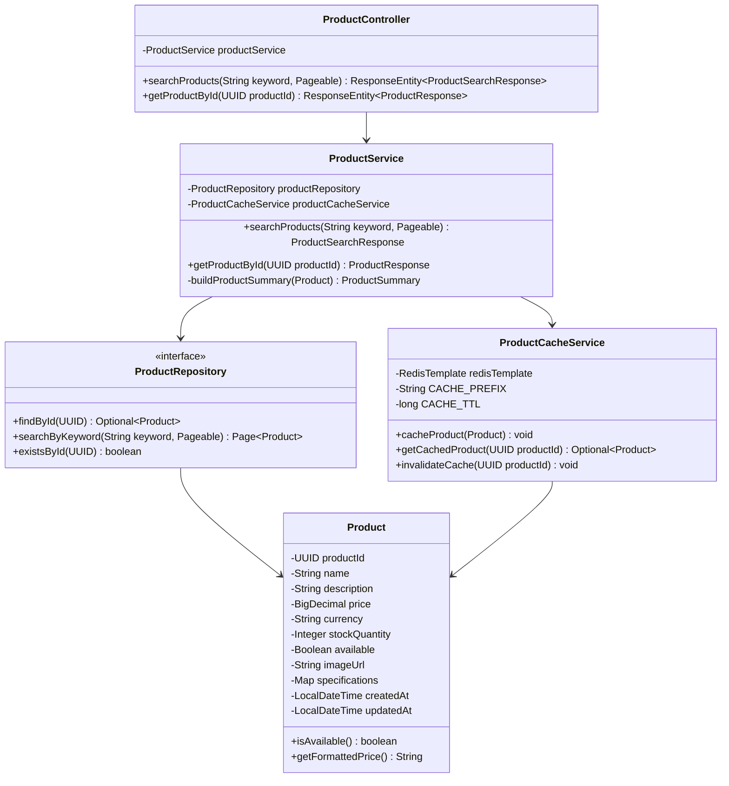

#### 3.2.3 Class Designs

**Product Entity:**

```java
package com.ecommerce.productcatalog.domain.entity;

import jakarta.persistence.*;
import lombok.*;
import org.hibernate.annotations.CreationTimestamp;
import org.hibernate.annotations.Type;
import org.hibernate.annotations.UpdateTimestamp;

import java.math.BigDecimal;
import java.time.LocalDateTime;
import java.util.Map;
import java.util.UUID;

@Entity
@Table(name = "products", indexes = {
    @Index(name = "idx_products_name", columnList = "name"),
    @Index(name = "idx_products_available", columnList = "available")
})
@Getter
@Setter
@NoArgsConstructor
@AllArgsConstructor
@Builder
public class Product {

    @Id
    @GeneratedValue(strategy = GenerationType.AUTO)
    @Column(name = "product_id", updatable = false, nullable = false)
    private UUID productId;

    @Column(name = "name", nullable = false, length = 255)
    private String name;

    @Column(name = "description", columnDefinition = "TEXT")
    private String description;

    @Column(name = "price", nullable = false, precision = 10, scale = 2)
    private BigDecimal price;

    @Column(name = "currency", length = 3)
    @Builder.Default
    private String currency = "USD";

    @Column(name = "stock_quantity", nullable = false)
    @Builder.Default
    private Integer stockQuantity = 0;

    @Column(name = "available", nullable = false)
    private Boolean available;

    @Column(name = "image_url", length = 500)
    private String imageUrl;

    @Type(JsonType.class)
    @Column(name = "specifications", columnDefinition = "jsonb")
    private Map<String, Object> specifications;

    @CreationTimestamp
    @Column(name = "created_at", nullable = false, updatable = false)
    private LocalDateTime createdAt;

    @UpdateTimestamp
    @Column(name = "updated_at", nullable = false)
    private LocalDateTime updatedAt;

    // Business methods
    @PrePersist
    @PreUpdate
    private void updateAvailability() {
        this.available = this.stockQuantity != null && this.stockQuantity > 0;
    }

    public boolean isAvailable() {
        return available != null && available && stockQuantity != null && stockQuantity > 0;
    }

    public String getFormattedPrice() {
        return String.format("%s %.2f", currency, price);
    }

    public boolean hasStock(int requestedQuantity) {
        return stockQuantity != null && stockQuantity >= requestedQuantity;
    }
}
```

**ProductController:**

```java
package com.ecommerce.productcatalog.presentation.controller;

import com.ecommerce.productcatalog.application.dto.ProductResponse;
import com.ecommerce.productcatalog.application.dto.ProductSearchResponse;
import com.ecommerce.productcatalog.application.service.ProductService;
import io.swagger.v3.oas.annotations.Operation;
import io.swagger.v3.oas.annotations.tags.Tag;
import lombok.RequiredArgsConstructor;
import lombok.extern.slf4j.Slf4j;
import org.springframework.data.domain.Pageable;
import org.springframework.data.web.PageableDefault;
import org.springframework.http.CacheControl;
import org.springframework.http.ResponseEntity;
import org.springframework.web.bind.annotation.*;

import java.util.UUID;
import java.util.concurrent.TimeUnit;

@RestController
@RequestMapping("/api/v1/products")
@RequiredArgsConstructor
@Slf4j
@Tag(name = "Product Catalog", description = "Product search and retrieval operations")
public class ProductController {

    private final ProductService productService;

    @GetMapping("/search")
    @Operation(summary = "Search products", description = "Searches products by keyword with case-insensitive matching")
    public ResponseEntity<ProductSearchResponse> searchProducts(
            @RequestParam String keyword,
            @PageableDefault(size = 20) Pageable pageable) {
        
        log.info("Product search request received for keyword: {}", keyword);
        ProductSearchResponse response = productService.searchProducts(keyword, pageable);
        log.info("Product search completed: {} results found", response.getPagination().getTotalResults());
        
        return ResponseEntity.ok()
            .cacheControl(CacheControl.maxAge(5, TimeUnit.MINUTES).cachePublic())
            .body(response);
    }

    @GetMapping("/{productId}")
    @Operation(summary = "Get product details", description = "Retrieves detailed information for a specific product")
    public ResponseEntity<ProductResponse> getProductById(@PathVariable UUID productId) {
        
        log.info("Product details request received for product ID: {}", productId);
        ProductResponse response = productService.getProductById(productId);
        
        return ResponseEntity.ok()
            .cacheControl(CacheControl.maxAge(10, TimeUnit.MINUTES).cachePublic())
            .body(response);
    }
}
```

**ProductService:**

```java
package com.ecommerce.productcatalog.application.service;

import com.ecommerce.productcatalog.application.dto.*;
import com.ecommerce.productcatalog.application.exception.ProductNotFoundException;
import com.ecommerce.productcatalog.application.mapper.ProductMapper;
import com.ecommerce.productcatalog.domain.entity.Product;
import com.ecommerce.productcatalog.domain.repository.ProductRepository;
import com.ecommerce.productcatalog.infrastructure.cache.ProductCacheService;
import lombok.RequiredArgsConstructor;
import lombok.extern.slf4j.Slf4j;
import org.springframework.data.domain.Page;
import org.springframework.data.domain.Pageable;
import org.springframework.stereotype.Service;
import org.springframework.transaction.annotation.Transactional;

import java.util.List;
import java.util.UUID;
import java.util.stream.Collectors;

@Service
@RequiredArgsConstructor
@Slf4j
public class ProductService {

    private final ProductRepository productRepository;
    private final ProductCacheService productCacheService;
    private final ProductMapper productMapper;

    @Transactional(readOnly = true)
    public ProductSearchResponse searchProducts(String keyword, Pageable pageable) {
        log.debug("Searching products with keyword: {}", keyword);
        
        // Search products (case-insensitive)
        Page<Product> productPage = productRepository.searchByKeyword(keyword.toLowerCase(), pageable);
        
        // Map to DTOs
        List<ProductSummary> products = productPage.getContent().stream()
            .map(productMapper::toProductSummary)
            .collect(Collectors.toList());
        
        // Build pagination metadata
        PaginationMetadata pagination = PaginationMetadata.builder()
            .page(productPage.getNumber() + 1) // 1-indexed
            .pageSize(productPage.getSize())
            .totalResults(productPage.getTotalElements())
            .totalPages(productPage.getTotalPages())
            .build();
        
        log.info("Product search completed: {} results found", pagination.getTotalResults());
        
        return ProductSearchResponse.builder()
            .products(products)
            .pagination(pagination)
            .build();
    }

    @Transactional(readOnly = true)
    public ProductResponse getProductById(UUID productId) {
        log.debug("Retrieving product details for product ID: {}", productId);
        
        // Check cache first
        return productCacheService.getCachedProduct(productId)
            .map(productMapper::toProductResponse)
            .orElseGet(() -> {
                // Cache miss - fetch from database
                Product product = productRepository.findById(productId)
                    .orElseThrow(() -> new ProductNotFoundException("Product not found"));
                
                // Cache for future requests
                productCacheService.cacheProduct(product);
                
                return productMapper.toProductResponse(product);
            });
    }
}
```

**ProductRepository:**

```java
package com.ecommerce.productcatalog.domain.repository;

import com.ecommerce.productcatalog.domain.entity.Product;
import org.springframework.data.domain.Page;
import org.springframework.data.domain.Pageable;
import org.springframework.data.jpa.repository.JpaRepository;
import org.springframework.data.jpa.repository.Query;
import org.springframework.data.repository.query.Param;
import org.springframework.stereotype.Repository;

import java.util.UUID;

@Repository
public interface ProductRepository extends JpaRepository<Product, UUID> {

    @Query("SELECT p FROM Product p WHERE " +
           "LOWER(p.name) LIKE LOWER(CONCAT('%', :keyword, '%')) OR " +
           "LOWER(p.description) LIKE LOWER(CONCAT('%', :keyword, '%'))")
    Page<Product> searchByKeyword(@Param("keyword") String keyword, Pageable pageable);

    boolean existsByProductId(UUID productId);
}
```

#### 3.2.4 Caching Strategy

**ProductCacheService:**

```java
package com.ecommerce.productcatalog.infrastructure.cache;

import com.ecommerce.productcatalog.domain.entity.Product;
import com.fasterxml.jackson.databind.ObjectMapper;
import lombok.RequiredArgsConstructor;
import lombok.extern.slf4j.Slf4j;
import org.springframework.data.redis.core.RedisTemplate;
import org.springframework.stereotype.Service;

import java.time.Duration;
import java.util.Optional;
import java.util.UUID;

@Service
@RequiredArgsConstructor
@Slf4j
public class ProductCacheService {

    private final RedisTemplate<String, Object> redisTemplate;
    private final ObjectMapper objectMapper;
    
    private static final String CACHE_PREFIX = "product:";
    private static final Duration CACHE_TTL = Duration.ofMinutes(10);

    public void cacheProduct(Product product) {
        try {
            String key = CACHE_PREFIX + product.getProductId();
            redisTemplate.opsForValue().set(key, product, CACHE_TTL);
            log.debug("Product cached: {}", product.getProductId());
        } catch (Exception e) {
            log.error("Failed to cache product: {}", product.getProductId(), e);
        }
    }

    public Optional<Product> getCachedProduct(UUID productId) {
        try {
            String key = CACHE_PREFIX + productId;
            Object cached = redisTemplate.opsForValue().get(key);
            
            if (cached != null) {
                log.debug("Cache hit for product: {}", productId);
                return Optional.of(objectMapper.convertValue(cached, Product.class));
            }
            
            log.debug("Cache miss for product: {}", productId);
            return Optional.empty();
        } catch (Exception e) {
            log.error("Failed to retrieve cached product: {}", productId, e);
            return Optional.empty();
        }
    }

    public void invalidateCache(UUID productId) {
        try {
            String key = CACHE_PREFIX + productId;
            redisTemplate.delete(key);
            log.debug("Cache invalidated for product: {}", productId);
        } catch (Exception e) {
            log.error("Failed to invalidate cache for product: {}", productId, e);
        }
    }
}
```

---

### 3.3 Shopping Cart Service

#### 3.3.1 Service Overview

**Service Name:** Shopping Cart Service  
**Port:** 8082  
**Base Path:** /api/v1  
**Database Schema:** public  
**Primary Tables:** carts, cart_items  

**Responsibilities:**
- Cart lifecycle management (lazy creation, deletion)
- Cart item operations (add, update, remove)
- Cart ownership validation (ABAC)
- User and product validation via service calls
- Transactional consistency (ACID)

#### 3.3.2 Component Diagram

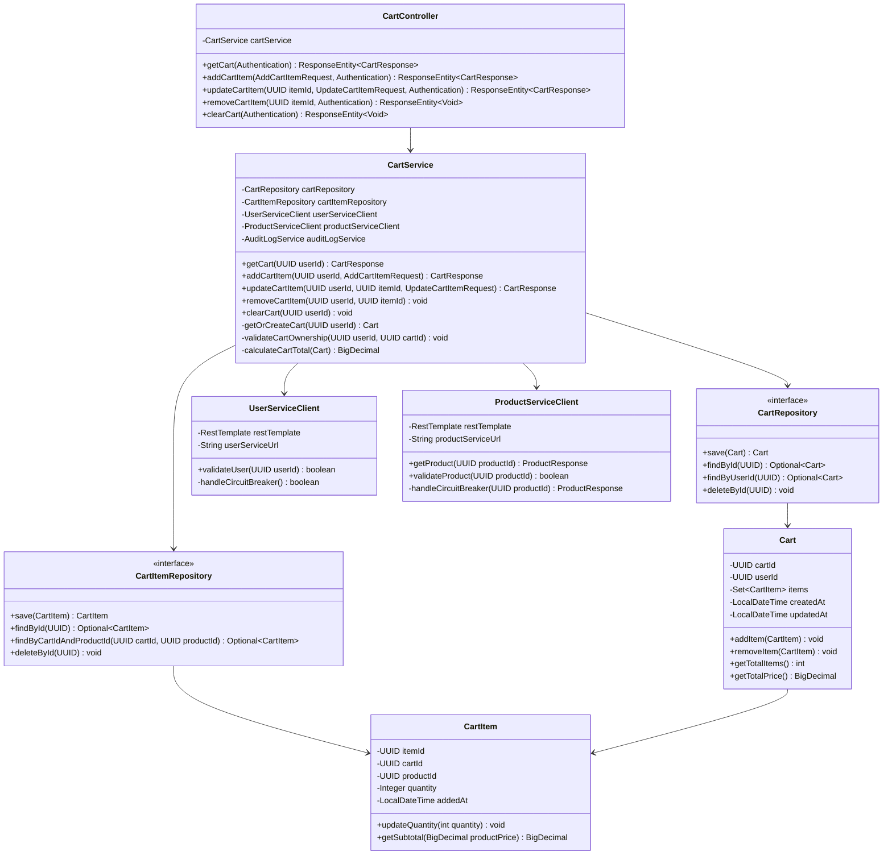

#### 3.3.3 Class Designs

**Cart Entity:**

```java
package com.ecommerce.shoppingcart.domain.entity;

import jakarta.persistence.*;
import lombok.*;
import org.hibernate.annotations.CreationTimestamp;
import org.hibernate.annotations.UpdateTimestamp;

import java.math.BigDecimal;
import java.time.LocalDateTime;
import java.util.HashSet;
import java.util.Set;
import java.util.UUID;

@Entity
@Table(name = "carts", indexes = {
    @Index(name = "idx_carts_user_id", columnList = "user_id", unique = true)
})
@Getter
@Setter
@NoArgsConstructor
@AllArgsConstructor
@Builder
public class Cart {

    @Id
    @GeneratedValue(strategy = GenerationType.AUTO)
    @Column(name = "cart_id", updatable = false, nullable = false)
    private UUID cartId;

    @Column(name = "user_id", nullable = false, unique = true)
    private UUID userId;

    @OneToMany(mappedBy = "cart", cascade = CascadeType.ALL, orphanRemoval = true, fetch = FetchType.EAGER)
    @Builder.Default
    private Set<CartItem> items = new HashSet<>();

    @CreationTimestamp
    @Column(name = "created_at", nullable = false, updatable = false)
    private LocalDateTime createdAt;

    @UpdateTimestamp
    @Column(name = "updated_at", nullable = false)
    private LocalDateTime updatedAt;

    // Business methods
    public void addItem(CartItem item) {
        item.setCart(this);
        this.items.add(item);
    }

    public void removeItem(CartItem item) {
        this.items.remove(item);
        item.setCart(null);
    }

    public int getTotalItems() {
        return items.stream()
            .mapToInt(CartItem::getQuantity)
            .sum();
    }

    public BigDecimal getTotalPrice(Map<UUID, BigDecimal> productPrices) {
        return items.stream()
            .map(item -> {
                BigDecimal price = productPrices.get(item.getProductId());
                return price != null ? price.multiply(BigDecimal.valueOf(item.getQuantity())) : BigDecimal.ZERO;
            })
            .reduce(BigDecimal.ZERO, BigDecimal::add);
    }
}
```

**CartItem Entity:**

```java
package com.ecommerce.shoppingcart.domain.entity;

import jakarta.persistence.*;
import lombok.*;
import org.hibernate.annotations.CreationTimestamp;

import java.math.BigDecimal;
import java.time.LocalDateTime;
import java.util.UUID;

@Entity
@Table(name = "cart_items", indexes = {
    @Index(name = "idx_cart_items_cart_id", columnList = "cart_id"),
    @Index(name = "idx_cart_items_product_id", columnList = "product_id")
}, uniqueConstraints = {
    @UniqueConstraint(name = "unique_cart_product", columnNames = {"cart_id", "product_id"})
})
@Getter
@Setter
@NoArgsConstructor
@AllArgsConstructor
@Builder
public class CartItem {

    @Id
    @GeneratedValue(strategy = GenerationType.AUTO)
    @Column(name = "item_id", updatable = false, nullable = false)
    private UUID itemId;

    @ManyToOne(fetch = FetchType.LAZY)
    @JoinColumn(name = "cart_id", nullable = false, foreignKey = @ForeignKey(name = "fk_cart_item_cart"))
    private Cart cart;

    @Column(name = "product_id", nullable = false)
    private UUID productId;

    @Column(name = "quantity", nullable = false)
    private Integer quantity;

    @CreationTimestamp
    @Column(name = "added_at", nullable = false, updatable = false)
    private LocalDateTime addedAt;

    // Business methods
    public void updateQuantity(int quantity) {
        if (quantity < 0 || quantity > 99) {
            throw new IllegalArgumentException("Quantity must be between 0 and 99");
        }
        this.quantity = quantity;
    }

    public BigDecimal getSubtotal(BigDecimal productPrice) {
        return productPrice.multiply(BigDecimal.valueOf(quantity));
    }
}
```

**CartService:**

```java
package com.ecommerce.shoppingcart.application.service;

import com.ecommerce.shoppingcart.application.dto.*;
import com.ecommerce.shoppingcart.application.exception.*;
import com.ecommerce.shoppingcart.application.mapper.CartMapper;
import com.ecommerce.shoppingcart.domain.entity.Cart;
import com.ecommerce.shoppingcart.domain.entity.CartItem;
import com.ecommerce.shoppingcart.domain.repository.CartItemRepository;
import com.ecommerce.shoppingcart.domain.repository.CartRepository;
import com.ecommerce.shoppingcart.infrastructure.client.ProductServiceClient;
import com.ecommerce.shoppingcart.infrastructure.client.UserServiceClient;
import lombok.RequiredArgsConstructor;
import lombok.extern.slf4j.Slf4j;
import org.springframework.stereotype.Service;
import org.springframework.transaction.annotation.Transactional;

import java.math.BigDecimal;
import java.util.*;
import java.util.stream.Collectors;

@Service
@RequiredArgsConstructor
@Slf4j
public class CartService {

    private final CartRepository cartRepository;
    private final CartItemRepository cartItemRepository;
    private final UserServiceClient userServiceClient;
    private final ProductServiceClient productServiceClient;
    private final AuditLogService auditLogService;
    private final CartMapper cartMapper;

    @Transactional(readOnly = true)
    public CartResponse getCart(UUID userId) {
        log.debug("Retrieving cart for user ID: {}", userId);
        
        // Validate user
        if (!userServiceClient.validateUser(userId)) {
            throw new UserNotFoundException("User not found");
        }
        
        // Find cart (return empty cart if not exists)
        Optional<Cart> cartOpt = cartRepository.findByUserId(userId);
        
        if (cartOpt.isEmpty()) {
            log.debug("No cart found for user ID: {}, returning empty cart", userId);
            return cartMapper.toEmptyCartResponse(userId);
        }
        
        Cart cart = cartOpt.get();
        
        // Fetch product details for all items
        Map<UUID, ProductResponse> productMap = fetchProductDetails(cart);
        
        return cartMapper.toCartResponse(cart, productMap);
    }

    @Transactional
    public CartResponse addCartItem(UUID userId, AddCartItemRequest request) {
        log.debug("Adding item to cart for user ID: {}, product ID: {}", userId, request.getProductId());
        
        // Validate user
        if (!userServiceClient.validateUser(userId)) {
            throw new UserNotFoundException("User not found");
        }
        
        // Validate product
        ProductResponse product = productServiceClient.getProduct(request.getProductId());
        if (!product.isAvailable()) {
            throw new ProductNotAvailableException("Product is not available");
        }
        
        // Check stock availability
        if (!product.hasStock(request.getQuantity())) {
            throw new InsufficientStockException(
                String.format("Requested quantity (%d) exceeds available stock (%d)",
                    request.getQuantity(), product.getStockQuantity()));
        }
        
        // Get or create cart
        Cart cart = getOrCreateCart(userId);
        
        // Check if product already in cart
        Optional<CartItem> existingItem = cart.getItems().stream()
            .filter(item -> item.getProductId().equals(request.getProductId()))
            .findFirst();
        
        if (existingItem.isPresent()) {
            // Update quantity
            CartItem item = existingItem.get();
            int newQuantity = item.getQuantity() + request.getQuantity();
            
            if (newQuantity > 99) {
                throw new InvalidQuantityException("Total quantity cannot exceed 99");
            }
            
            if (!product.hasStock(newQuantity)) {
                throw new InsufficientStockException(
                    String.format("Total quantity (%d) exceeds available stock (%d)",
                        newQuantity, product.getStockQuantity()));
            }
            
            item.updateQuantity(newQuantity);
            cartItemRepository.save(item);
            
            log.info("Cart item quantity updated for user ID: {}, product ID: {}, new quantity: {}",
                userId, request.getProductId(), newQuantity);
        } else {
            // Add new item
            CartItem newItem = CartItem.builder()
                .cart(cart)
                .productId(request.getProductId())
                .quantity(request.getQuantity())
                .build();
            
            cart.addItem(newItem);
            cartItemRepository.save(newItem);
            
            log.info("New item added to cart for user ID: {}, product ID: {}, quantity: {}",
                userId, request.getProductId(), request.getQuantity());
        }
        
        cart = cartRepository.save(cart);
        
        // Audit log
        auditLogService.logCartItemAdded(userId, cart.getCartId(), request.getProductId(), request.getQuantity());
        
        // Fetch product details for response
        Map<UUID, ProductResponse> productMap = fetchProductDetails(cart);
        
        return cartMapper.toCartResponse(cart, productMap);
    }

    @Transactional
    public CartResponse updateCartItem(UUID userId, UUID itemId, UpdateCartItemRequest request) {
        log.debug("Updating cart item for user ID: {}, item ID: {}, new quantity: {}",
            userId, itemId, request.getQuantity());
        
        // Validate user
        if (!userServiceClient.validateUser(userId)) {
            throw new UserNotFoundException("User not found");
        }
        
        // Find cart item
        CartItem item = cartItemRepository.findById(itemId)
            .orElseThrow(() -> new CartItemNotFoundException("Cart item not found"));
        
        // Validate cart ownership
        Cart cart = item.getCart();
        if (!cart.getUserId().equals(userId)) {
            throw new ForbiddenException("You do not have permission to modify this cart item");
        }
        
        // If quantity is 0, remove item
        if (request.getQuantity() == 0) {
            cart.removeItem(item);
            cartItemRepository.delete(item);
            log.info("Cart item removed for user ID: {}, item ID: {}", userId, itemId);
        } else {
            // Validate product stock
            ProductResponse product = productServiceClient.getProduct(item.getProductId());
            if (!product.hasStock(request.getQuantity())) {
                throw new InsufficientStockException(
                    String.format("Requested quantity (%d) exceeds available stock (%d)",
                        request.getQuantity(), product.getStockQuantity()));
            }
            
            // Update quantity
            int oldQuantity = item.getQuantity();
            item.updateQuantity(request.getQuantity());
            cartItemRepository.save(item);
            
            log.info("Cart item quantity updated for user ID: {}, item ID: {}, old quantity: {}, new quantity: {}",
                userId, itemId, oldQuantity, request.getQuantity());
        }
        
        cart = cartRepository.save(cart);
        
        // Audit log
        auditLogService.logCartItemUpdated(userId, cart.getCartId(), itemId, request.getQuantity());
        
        // Fetch product details for response
        Map<UUID, ProductResponse> productMap = fetchProductDetails(cart);
        
        return cartMapper.toCartResponse(cart, productMap);
    }

    @Transactional
    public void removeCartItem(UUID userId, UUID itemId) {
        log.debug("Removing cart item for user ID: {}, item ID: {}", userId, itemId);
        
        // Validate user
        if (!userServiceClient.validateUser(userId)) {
            throw new UserNotFoundException("User not found");
        }
        
        // Find cart item
        CartItem item = cartItemRepository.findById(itemId)
            .orElseThrow(() -> new CartItemNotFoundException("Cart item not found"));
        
        // Validate cart ownership
        Cart cart = item.getCart();
        if (!cart.getUserId().equals(userId)) {
            throw new ForbiddenException("You do not have permission to modify this cart item");
        }
        
        // Remove item
        cart.removeItem(item);
        cartItemRepository.delete(item);
        cartRepository.save(cart);
        
        // Audit log
        auditLogService.logCartItemRemoved(userId, cart.getCartId(), itemId);
        
        log.info("Cart item removed successfully for user ID: {}, item ID: {}", userId, itemId);
    }

    @Transactional
    public void clearCart(UUID userId) {
        log.debug("Clearing cart for user ID: {}", userId);
        
        // Validate user
        if (!userServiceClient.validateUser(userId)) {
            throw new UserNotFoundException("User not found");
        }
        
        // Find and delete cart
        cartRepository.findByUserId(userId).ifPresent(cart -> {
            cartRepository.delete(cart);
            log.info("Cart cleared for user ID: {}", userId);
            
            // Audit log
            auditLogService.logCartCleared(userId, cart.getCartId());
        });
    }

    private Cart getOrCreateCart(UUID userId) {
        return cartRepository.findByUserId(userId)
            .orElseGet(() -> {
                Cart newCart = Cart.builder()
                    .userId(userId)
                    .build();
                Cart savedCart = cartRepository.save(newCart);
                log.info("New cart created for user ID: {}, cart ID: {}", userId, savedCart.getCartId());
                return savedCart;
            });
    }

    private Map<UUID, ProductResponse> fetchProductDetails(Cart cart) {
        return cart.getItems().stream()
            .map(CartItem::getProductId)
            .distinct()
            .collect(Collectors.toMap(
                productId -> productId,
                productServiceClient::getProduct
            ));
    }
}
```

#### 3.3.4 Service Integration

**UserServiceClient:**

```java
package com.ecommerce.shoppingcart.infrastructure.client;

import io.github.resilience4j.circuitbreaker.annotation.CircuitBreaker;
import lombok.RequiredArgsConstructor;
import lombok.extern.slf4j.Slf4j;
import org.springframework.beans.factory.annotation.Value;
import org.springframework.stereotype.Component;
import org.springframework.web.client.RestTemplate;

import java.util.UUID;

@Component
@RequiredArgsConstructor
@Slf4j
public class UserServiceClient {

    private final RestTemplate restTemplate;
    
    @Value("${services.user-management.url}")
    private String userServiceUrl;

    @CircuitBreaker(name = "userService", fallbackMethod = "validateUserFallback")
    public boolean validateUser(UUID userId) {
        log.debug("Validating user with ID: {}", userId);
        
        try {
            String url = userServiceUrl + "/api/v1/users/" + userId + "/validate";
            UserValidationResponse response = restTemplate.getForObject(url, UserValidationResponse.class);
            
            return response != null && response.isValid();
        } catch (Exception e) {
            log.error("Failed to validate user: {}", userId, e);
            throw e;
        }
    }

    private boolean validateUserFallback(UUID userId, Exception ex) {
        log.warn("User service circuit breaker activated for user ID: {}, assuming user is valid", userId);
        // Graceful degradation: assume user is valid if service is unavailable
        return true;
    }
}
```

**ProductServiceClient:**

```java
package com.ecommerce.shoppingcart.infrastructure.client;

import com.ecommerce.shoppingcart.application.dto.ProductResponse;
import com.ecommerce.shoppingcart.application.exception.ProductNotFoundException;
import io.github.resilience4j.circuitbreaker.annotation.CircuitBreaker;
import lombok.RequiredArgsConstructor;
import lombok.extern.slf4j.Slf4j;
import org.springframework.beans.factory.annotation.Value;
import org.springframework.cache.annotation.Cacheable;
import org.springframework.stereotype.Component;
import org.springframework.web.client.RestTemplate;

import java.util.UUID;

@Component
@RequiredArgsConstructor
@Slf4j
public class ProductServiceClient {

    private final RestTemplate restTemplate;
    
    @Value("${services.product-catalog.url}")
    private String productServiceUrl;

    @CircuitBreaker(name = "productService", fallbackMethod = "getProductFallback")
    @Cacheable(value = "products", key = "#productId")
    public ProductResponse getProduct(UUID productId) {
        log.debug("Fetching product details for product ID: {}", productId);
        
        try {
            String url = productServiceUrl + "/api/v1/products/" + productId;
            ProductResponse response = restTemplate.getForObject(url, ProductResponse.class);
            
            if (response == null) {
                throw new ProductNotFoundException("Product not found");
            }
            
            return response;
        } catch (Exception e) {
            log.error("Failed to fetch product: {}", productId, e);
            throw e;
        }
    }

    private ProductResponse getProductFallback(UUID productId, Exception ex) {
        log.warn("Product service circuit breaker activated for product ID: {}", productId);
        // Return cached product or throw exception
        throw new ProductNotFoundException("Product service is temporarily unavailable");
    }

    public boolean validateProduct(UUID productId) {
        try {
            ProductResponse product = getProduct(productId);
            return product.isAvailable();
        } catch (Exception e) {
            return false;
        }
    }
}
```

#### 3.3.5 Sequence Diagram - Add Cart Item

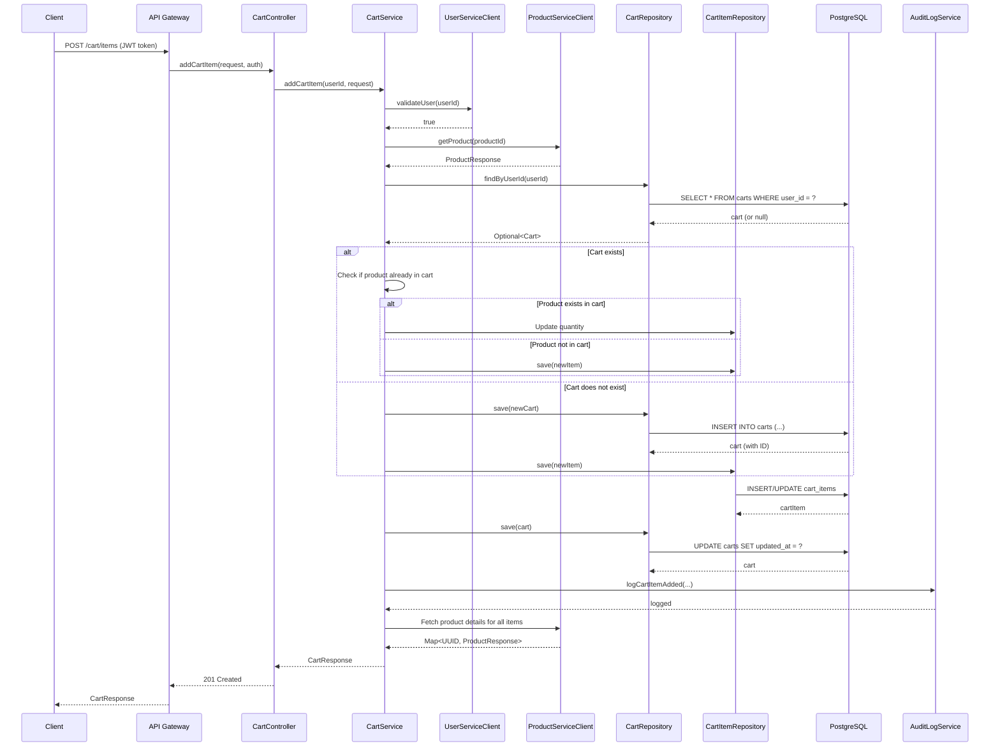

---

## 4. DATA MODEL DESIGN

### 4.1 Entity Relationship Diagram

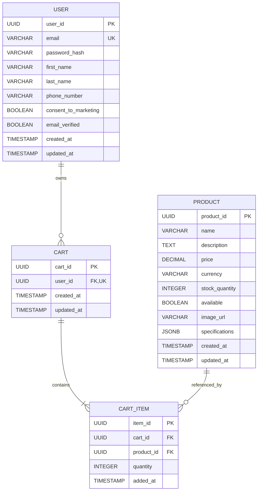

### 4.2 Database Schema (PostgreSQL)

**Users Table:**

```sql
CREATE TABLE users (
    user_id UUID PRIMARY KEY DEFAULT gen_random_uuid(),
    email VARCHAR(255) UNIQUE NOT NULL,
    password_hash VARCHAR(255) NOT NULL,
    first_name VARCHAR(100) NOT NULL,
    last_name VARCHAR(100) NOT NULL,
    phone_number VARCHAR(20),
    consent_to_marketing BOOLEAN DEFAULT FALSE NOT NULL,
    email_verified BOOLEAN DEFAULT FALSE NOT NULL,
    created_at TIMESTAMP WITH TIME ZONE DEFAULT CURRENT_TIMESTAMP NOT NULL,
    updated_at TIMESTAMP WITH TIME ZONE DEFAULT CURRENT_TIMESTAMP NOT NULL,
    CONSTRAINT email_format CHECK (email ~* '^[A-Za-z0-9._%+-]+@[A-Za-z0-9.-]+\.[A-Z|a-z]{2,}$')
);

CREATE INDEX idx_users_email ON users(email);
CREATE INDEX idx_users_created_at ON users(created_at);

COMMENT ON TABLE users IS 'User accounts with authentication credentials';
COMMENT ON COLUMN users.password_hash IS 'BCrypt hashed password (cost factor 12)';
COMMENT ON COLUMN users.email_verified IS 'Email verification status';
```

**Products Table:**

```sql
CREATE TABLE products (
    product_id UUID PRIMARY KEY DEFAULT gen_random_uuid(),
    name VARCHAR(255) NOT NULL,
    description TEXT,
    price DECIMAL(10, 2) NOT NULL CHECK (price >= 0),
    currency VARCHAR(3) DEFAULT 'USD' NOT NULL,
    stock_quantity INTEGER DEFAULT 0 NOT NULL CHECK (stock_quantity >= 0),
    available BOOLEAN GENERATED ALWAYS AS (stock_quantity > 0) STORED,
    image_url VARCHAR(500),
    specifications JSONB,
    created_at TIMESTAMP WITH TIME ZONE DEFAULT CURRENT_TIMESTAMP NOT NULL,
    updated_at TIMESTAMP WITH TIME ZONE DEFAULT CURRENT_TIMESTAMP NOT NULL
);

CREATE INDEX idx_products_name ON products USING gin(to_tsvector('english', name));
CREATE INDEX idx_products_description ON products USING gin(to_tsvector('english', description));
CREATE INDEX idx_products_available ON products(available) WHERE available = true;

COMMENT ON TABLE products IS 'Product catalog with pricing and inventory';
COMMENT ON COLUMN products.available IS 'Computed column: true if stock_quantity > 0';
COMMENT ON COLUMN products.specifications IS 'Flexible JSON schema for product specifications';
```

**Carts Table:**

```sql
CREATE TABLE carts (
    cart_id UUID PRIMARY KEY DEFAULT gen_random_uuid(),
    user_id UUID UNIQUE NOT NULL,
    created_at TIMESTAMP WITH TIME ZONE DEFAULT CURRENT_TIMESTAMP NOT NULL,
    updated_at TIMESTAMP WITH TIME ZONE DEFAULT CURRENT_TIMESTAMP NOT NULL,
    CONSTRAINT fk_cart_user FOREIGN KEY (user_id) REFERENCES users(user_id) ON DELETE CASCADE
);

CREATE INDEX idx_carts_user_id ON carts(user_id);

COMMENT ON TABLE carts IS 'Shopping carts for users';
COMMENT ON COLUMN carts.user_id IS 'One cart per user (unique constraint)';
```

**Cart Items Table:**

```sql
CREATE TABLE cart_items (
    item_id UUID PRIMARY KEY DEFAULT gen_random_uuid(),
    cart_id UUID NOT NULL,
    product_id UUID NOT NULL,
    quantity INTEGER NOT NULL CHECK (quantity > 0 AND quantity <= 99),
    added_at TIMESTAMP WITH TIME ZONE DEFAULT CURRENT_TIMESTAMP NOT NULL,
    CONSTRAINT fk_cart_item_cart FOREIGN KEY (cart_id) REFERENCES carts(cart_id) ON DELETE CASCADE,
    CONSTRAINT fk_cart_item_product FOREIGN KEY (product_id) REFERENCES products(product_id) ON DELETE CASCADE,
    CONSTRAINT unique_cart_product UNIQUE (cart_id, product_id)
);

CREATE INDEX idx_cart_items_cart_id ON cart_items(cart_id);
CREATE INDEX idx_cart_items_product_id ON cart_items(product_id);

COMMENT ON TABLE cart_items IS 'Items in shopping carts';
COMMENT ON COLUMN cart_items.quantity IS 'Item quantity (1-99)';
COMMENT ON CONSTRAINT unique_cart_product ON cart_items IS 'One product per cart (update quantity if exists)';
```

### 4.3 Database Migration Scripts (Flyway)

**V1__Create_Users_Table.sql:**

```sql
-- Migration: Create users table
-- Version: 1
-- Description: Initial user management schema

CREATE TABLE users (
    user_id UUID PRIMARY KEY DEFAULT gen_random_uuid(),
    email VARCHAR(255) UNIQUE NOT NULL,
    password_hash VARCHAR(255) NOT NULL,
    first_name VARCHAR(100) NOT NULL,
    last_name VARCHAR(100) NOT NULL,
    phone_number VARCHAR(20),
    consent_to_marketing BOOLEAN DEFAULT FALSE NOT NULL,
    email_verified BOOLEAN DEFAULT FALSE NOT NULL,
    created_at TIMESTAMP WITH TIME ZONE DEFAULT CURRENT_TIMESTAMP NOT NULL,
    updated_at TIMESTAMP WITH TIME ZONE DEFAULT CURRENT_TIMESTAMP NOT NULL,
    CONSTRAINT email_format CHECK (email ~* '^[A-Za-z0-9._%+-]+@[A-Za-z0-9.-]+\.[A-Z|a-z]{2,}$')
);

CREATE INDEX idx_users_email ON users(email);
CREATE INDEX idx_users_created_at ON users(created_at);

COMMENT ON TABLE users IS 'User accounts with authentication credentials';
```

**V2__Create_Products_Table.sql:**

```sql
-- Migration: Create products table
-- Version: 2
-- Description: Product catalog schema

CREATE TABLE products (
    product_id UUID PRIMARY KEY DEFAULT gen_random_uuid(),
    name VARCHAR(255) NOT NULL,
    description TEXT,
    price DECIMAL(10, 2) NOT NULL CHECK (price >= 0),
    currency VARCHAR(3) DEFAULT 'USD' NOT NULL,
    stock_quantity INTEGER DEFAULT 0 NOT NULL CHECK (stock_quantity >= 0),
    available BOOLEAN GENERATED ALWAYS AS (stock_quantity > 0) STORED,
    image_url VARCHAR(500),
    specifications JSONB,
    created_at TIMESTAMP WITH TIME ZONE DEFAULT CURRENT_TIMESTAMP NOT NULL,
    updated_at TIMESTAMP WITH TIME ZONE DEFAULT CURRENT_TIMESTAMP NOT NULL
);

CREATE INDEX idx_products_name ON products USING gin(to_tsvector('english', name));
CREATE INDEX idx_products_description ON products USING gin(to_tsvector('english', description));
CREATE INDEX idx_products_available ON products(available) WHERE available = true;

COMMENT ON TABLE products IS 'Product catalog with pricing and inventory';
```

**V3__Create_Carts_And_Cart_Items_Tables.sql:**

```sql
-- Migration: Create carts and cart_items tables
-- Version: 3
-- Description: Shopping cart schema

CREATE TABLE carts (
    cart_id UUID PRIMARY KEY DEFAULT gen_random_uuid(),
    user_id UUID UNIQUE NOT NULL,
    created_at TIMESTAMP WITH TIME ZONE DEFAULT CURRENT_TIMESTAMP NOT NULL,
    updated_at TIMESTAMP WITH TIME ZONE DEFAULT CURRENT_TIMESTAMP NOT NULL,
    CONSTRAINT fk_cart_user FOREIGN KEY (user_id) REFERENCES users(user_id) ON DELETE CASCADE
);

CREATE INDEX idx_carts_user_id ON carts(user_id);

CREATE TABLE cart_items (
    item_id UUID PRIMARY KEY DEFAULT gen_random_uuid(),
    cart_id UUID NOT NULL,
    product_id UUID NOT NULL,
    quantity INTEGER NOT NULL CHECK (quantity > 0 AND quantity <= 99),
    added_at TIMESTAMP WITH TIME ZONE DEFAULT CURRENT_TIMESTAMP NOT NULL,
    CONSTRAINT fk_cart_item_cart FOREIGN KEY (cart_id) REFERENCES carts(cart_id) ON DELETE CASCADE,
    CONSTRAINT fk_cart_item_product FOREIGN KEY (product_id) REFERENCES products(product_id) ON DELETE CASCADE,
    CONSTRAINT unique_cart_product UNIQUE (cart_id, product_id)
);

CREATE INDEX idx_cart_items_cart_id ON cart_items(cart_id);
CREATE INDEX idx_cart_items_product_id ON cart_items(product_id);

COMMENT ON TABLE carts IS 'Shopping carts for users';
COMMENT ON TABLE cart_items IS 'Items in shopping carts';
```

### 4.4 Data Integrity Constraints

**Referential Integrity:**
- `carts.user_id` → `users.user_id` (CASCADE DELETE)
- `cart_items.cart_id` → `carts.cart_id` (CASCADE DELETE)
- `cart_items.product_id` → `products.product_id` (CASCADE DELETE)

**Uniqueness Constraints:**
- `users.email` (UNIQUE)
- `carts.user_id` (UNIQUE - one cart per user)
- `cart_items(cart_id, product_id)` (UNIQUE - one product per cart)

**Check Constraints:**
- `users.email` (valid email format)
- `products.price` (>= 0)
- `products.stock_quantity` (>= 0)
- `cart_items.quantity` (1-99)

**Computed Columns:**
- `products.available` (GENERATED ALWAYS AS stock_quantity > 0)

---

## 5. INTERFACE DEFINITIONS

### 5.1 REST API Contracts

**API Contract Validation:**
- All APIs follow OpenAPI 3.0 specification
- Request/response schemas validated using Bean Validation (JSR-380)
- Content-Type: application/json
- Character encoding: UTF-8

**Common HTTP Headers:**

**Request Headers:**
```
Authorization: Bearer <JWT_TOKEN>
Content-Type: application/json
Accept: application/json
X-Request-ID: <UUID>
Idempotency-Key: <UUID> (for POST/PUT operations)
X-Forwarded-For: <CLIENT_IP>
```

**Response Headers:**
```
Content-Type: application/json
X-Request-ID: <UUID>
X-RateLimit-Limit: <LIMIT>
X-RateLimit-Remaining: <REMAINING>
X-RateLimit-Reset: <UNIX_TIMESTAMP>
Cache-Control: <CACHE_DIRECTIVE>
```

### 5.2 Data Transfer Objects (DTOs)

**UserRegistrationRequest:**

```java
package com.ecommerce.usermanagement.application.dto;

import jakarta.validation.constraints.*;
import lombok.*;

@Data
@NoArgsConstructor
@AllArgsConstructor
@Builder
public class UserRegistrationRequest {

    @NotNull(message = "Email is required")
    @Email(message = "Invalid email format")
    @Size(max = 255, message = "Email must not exceed 255 characters")
    private String email;

    @NotNull(message = "Password is required")
    @Size(min = 8, max = 128, message = "Password must be between 8 and 128 characters")
    @Pattern(regexp = "^(?=.*[a-z])(?=.*[A-Z])(?=.*\\d)(?=.*[@$!%*?&])[A-Za-z\\d@$!%*?&]{8,}$",
             message = "Password must contain uppercase, lowercase, digit, and special character")
    private String password;

    @NotNull(message = "First name is required")
    @Size(min = 1, max = 100, message = "First name must be between 1 and 100 characters")
    private String firstName;

    @NotNull(message = "Last name is required")
    @Size(min = 1, max = 100, message = "Last name must be between 1 and 100 characters")
    private String lastName;

    @Pattern(regexp = "^\\+?[1-9]\\d{1,14}$", message = "Invalid phone number format")
    private String phoneNumber;

    @NotNull(message = "Consent to terms is required")
    private Boolean consentToTerms;

    private Boolean consentToMarketing = false;
}
```

**CartResponse:**

```java
package com.ecommerce.shoppingcart.application.dto;

import lombok.*;

import java.math.BigDecimal;
import java.time.LocalDateTime;
import java.util.List;
import java.util.UUID;

@Data
@NoArgsConstructor
@AllArgsConstructor
@Builder
public class CartResponse {

    private UUID cartId;
    private UUID userId;
    private List<CartItemDto> items;
    private Integer totalItems;
    private BigDecimal totalPrice;
    private String currency;
    private LocalDateTime createdAt;
    private LocalDateTime updatedAt;

    @Data
    @NoArgsConstructor
    @AllArgsConstructor
    @Builder
    public static class CartItemDto {
        private UUID itemId;
        private UUID productId;
        private String productName;
        private BigDecimal productPrice;
        private Integer quantity;
        private BigDecimal subtotal;
        private LocalDateTime addedAt;
    }
}
```

### 5.3 Error Response Format

**ErrorResponse:**

```java
package com.ecommerce.common.dto;

import lombok.*;

import java.time.LocalDateTime;
import java.util.List;
import java.util.Map;
import java.util.UUID;

@Data
@NoArgsConstructor
@AllArgsConstructor
@Builder
public class ErrorResponse {

    private ErrorDetail error;

    @Data
    @NoArgsConstructor
    @AllArgsConstructor
    @Builder
    public static class ErrorDetail {
        private String code;
        private String message;
        private LocalDateTime timestamp;
        private UUID requestId;
        private List<ValidationError> details;
        private Map<String, Object> metadata;
    }

    @Data
    @NoArgsConstructor
    @AllArgsConstructor
    @Builder
    public static class ValidationError {
        private String field;
        private String message;
    }
}
```

**Example Error Response:**

```json
{
  "error": {
    "code": "VALIDATION_ERROR",
    "message": "Request validation failed",
    "timestamp": "2024-01-15T10:30:00Z",
    "requestId": "550e8400-e29b-41d4-a716-446655440000",
    "details": [
      {
        "field": "password",
        "message": "Password must contain at least one uppercase letter"
      },
      {
        "field": "email",
        "message": "Invalid email format"
      }
    ]
  }
}
```

---

## 6. SECURITY ARCHITECTURE

### 6.1 Authentication Flow

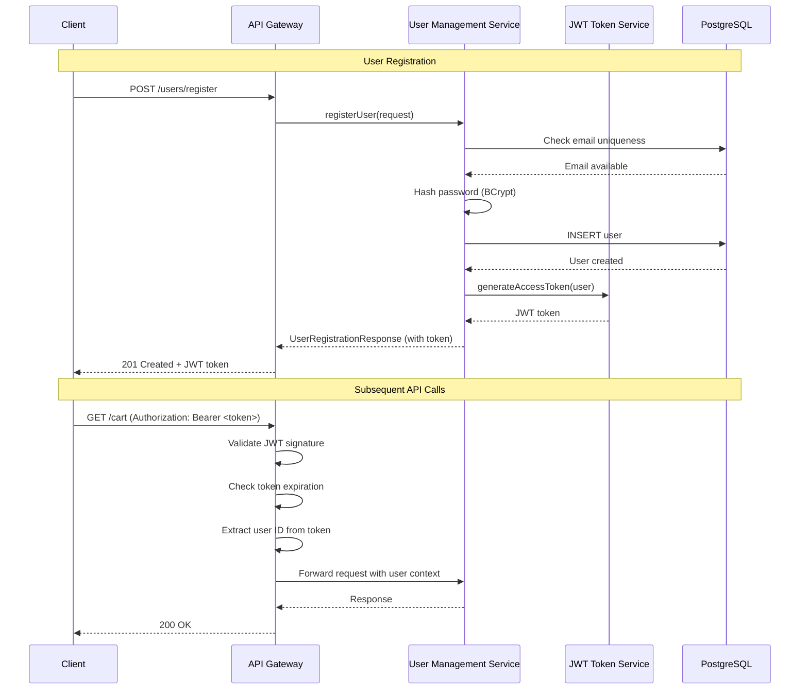

### 6.2 Authorization Matrix

| Resource | Operation | User Role | Admin Role | Service Role |
|----------|-----------|-----------|------------|-------------|
| /users/register | POST | ✅ Public | ✅ | ❌ |
| /users/login | POST | ✅ Public | ✅ | ❌ |
| /users/profile | GET | ✅ Own | ✅ All | ❌ |
| /users/profile | PUT | ✅ Own | ✅ All | ❌ |
| /users/logout | POST | ✅ Own | ✅ All | ❌ |
| /products/search | GET | ✅ Public | ✅ | ✅ |
| /products/{id} | GET | ✅ Public | ✅ | ✅ |
| /cart | GET | ✅ Own | ✅ All | ❌ |
| /cart/items | POST | ✅ Own | ✅ All | ❌ |
| /cart/items/{id} | PUT | ✅ Own | ✅ All | ❌ |
| /cart/items/{id} | DELETE | ✅ Own | ✅ All | ❌ |

### 6.3 Security Configuration

**Spring Security Configuration:**

```java
package com.ecommerce.common.security;

import lombok.RequiredArgsConstructor;
import org.springframework.context.annotation.Bean;
import org.springframework.context.annotation.Configuration;
import org.springframework.security.config.annotation.method.configuration.EnableMethodSecurity;
import org.springframework.security.config.annotation.web.builders.HttpSecurity;
import org.springframework.security.config.annotation.web.configuration.EnableWebSecurity;
import org.springframework.security.config.http.SessionCreationPolicy;
import org.springframework.security.web.SecurityFilterChain;
import org.springframework.security.web.authentication.UsernamePasswordAuthenticationFilter;

@Configuration
@EnableWebSecurity
@EnableMethodSecurity
@RequiredArgsConstructor
public class SecurityConfiguration {

    private final JwtAuthenticationFilter jwtAuthenticationFilter;
    private final JwtAuthenticationEntryPoint jwtAuthenticationEntryPoint;

    @Bean
    public SecurityFilterChain securityFilterChain(HttpSecurity http) throws Exception {
        http
            .csrf(csrf -> csrf.disable())
            .cors(cors -> cors.configurationSource(corsConfigurationSource()))
            .sessionManagement(session -> session.sessionCreationPolicy(SessionCreationPolicy.STATELESS))
            .authorizeHttpRequests(auth -> auth
                // Public endpoints
                .requestMatchers("/api/v1/users/register", "/api/v1/users/login").permitAll()
                .requestMatchers("/api/v1/users/password/reset").permitAll()
                .requestMatchers("/api/v1/products/**").permitAll()
                .requestMatchers("/health/**", "/actuator/**").permitAll()
                .requestMatchers("/swagger-ui/**", "/v3/api-docs/**").permitAll()
                // Protected endpoints
                .anyRequest().authenticated()
            )
            .exceptionHandling(exception -> exception
                .authenticationEntryPoint(jwtAuthenticationEntryPoint)
            )
            .addFilterBefore(jwtAuthenticationFilter, UsernamePasswordAuthenticationFilter.class);

        return http.build();
    }

    @Bean
    public CorsConfigurationSource corsConfigurationSource() {
        CorsConfiguration configuration = new CorsConfiguration();
        configuration.setAllowedOrigins(List.of(
            "https://www.ecommerce.example.com",
            "https://mobile.ecommerce.example.com"
        ));
        configuration.setAllowedMethods(List.of("GET", "POST", "PUT", "DELETE", "OPTIONS"));
        configuration.setAllowedHeaders(List.of(
            "Authorization", "Content-Type", "X-Request-ID", "Idempotency-Key"
        ));
        configuration.setExposedHeaders(List.of(
            "X-Request-ID", "X-RateLimit-Limit", "X-RateLimit-Remaining"
        ));
        configuration.setMaxAge(3600L);
        configuration.setAllowCredentials(true);

        UrlBasedCorsConfigurationSource source = new UrlBasedCorsConfigurationSource();
        source.registerCorsConfiguration("/**", configuration);
        return source;
    }
}
```

**JWT Authentication Filter:**

```java
package com.ecommerce.common.security;

import com.ecommerce.usermanagement.infrastructure.security.JwtTokenService;
import jakarta.servlet.FilterChain;
import jakarta.servlet.ServletException;
import jakarta.servlet.http.HttpServletRequest;
import jakarta.servlet.http.HttpServletResponse;
import lombok.RequiredArgsConstructor;
import lombok.extern.slf4j.Slf4j;
import org.springframework.security.authentication.UsernamePasswordAuthenticationToken;
import org.springframework.security.core.context.SecurityContextHolder;
import org.springframework.security.web.authentication.WebAuthenticationDetailsSource;
import org.springframework.stereotype.Component;
import org.springframework.web.filter.OncePerRequestFilter;

import java.io.IOException;
import java.util.UUID;

@Component
@RequiredArgsConstructor
@Slf4j
public class JwtAuthenticationFilter extends OncePerRequestFilter {

    private final JwtTokenService jwtTokenService;

    @Override
    protected void doFilterInternal(HttpServletRequest request,
                                    HttpServletResponse response,
                                    FilterChain filterChain) throws ServletException, IOException {
        
        try {
            String token = extractTokenFromRequest(request);
            
            if (token != null) {
                // Validate token
                jwtTokenService.validateToken(token);
                
                // Extract user ID
                UUID userId = jwtTokenService.extractUserId(token);
                
                // Create authentication object
                UsernamePasswordAuthenticationToken authentication =
                    new UsernamePasswordAuthenticationToken(userId, token, List.of());
                authentication.setDetails(new WebAuthenticationDetailsSource().buildDetails(request));
                
                // Set authentication in security context
                SecurityContextHolder.getContext().setAuthentication(authentication);
                
                log.debug("JWT authentication successful for user ID: {}", userId);
            }
        } catch (Exception e) {
            log.error("JWT authentication failed: {}", e.getMessage());
            // Continue filter chain without authentication
        }
        
        filterChain.doFilter(request, response);
    }

    private String extractTokenFromRequest(HttpServletRequest request) {
        String bearerToken = request.getHeader("Authorization");
        if (bearerToken != null && bearerToken.startsWith("Bearer ")) {
            return bearerToken.substring(7);
        }
        return null;
    }
}
```

### 6.4 Encryption Standards

**Data at Rest:**
- **Algorithm:** AES-256-GCM
- **Key Management:** AWS KMS or HashiCorp Vault
- **Key Rotation:** Automatic 90-day rotation
- **Encrypted Fields:**
  - User passwords (BCrypt with cost factor 12)
  - JWT signing keys (RSA-2048)
  - Database connection strings
  - API keys and secrets

**Data in Transit:**
- **Protocol:** TLS 1.3 (minimum TLS 1.2)
- **Cipher Suites:**
  - TLS_AES_256_GCM_SHA384
  - TLS_CHACHA20_POLY1305_SHA256
  - TLS_AES_128_GCM_SHA256
- **Certificate Management:** Let's Encrypt with automatic renewal
- **HSTS:** Strict-Transport-Security header with 1-year max-age

**Application Configuration (application.yml):**

```yaml
spring:
  datasource:
    url: jdbc:postgresql://${DB_HOST}:5432/${DB_NAME}?sslmode=require
    username: ${DB_USERNAME}
    password: ${DB_PASSWORD}
    hikari:
      maximum-pool-size: 20
      minimum-idle: 5
      connection-timeout: 30000
      idle-timeout: 600000
      max-lifetime: 1800000

  redis:
    host: ${REDIS_HOST}
    port: 6379
    password: ${REDIS_PASSWORD}
    ssl: true
    timeout: 2000ms

jwt:
  private-key: ${JWT_PRIVATE_KEY}
  public-key: ${JWT_PUBLIC_KEY}
  issuer: https://api.ecommerce.example.com
  access-token-expiry: 3600000  # 1 hour
  refresh-token-expiry: 604800000  # 7 days

services:
  user-management:
    url: http://user-management-service:8080
  product-catalog:
    url: http://product-catalog-service:8081
  shopping-cart:
    url: http://shopping-cart-service:8082

resilience4j:
  circuitbreaker:
    instances:
      userService:
        failure-rate-threshold: 50
        wait-duration-in-open-state: 30s
        sliding-window-size: 10
        minimum-number-of-calls: 5
      productService:
        failure-rate-threshold: 50
        wait-duration-in-open-state: 30s
        sliding-window-size: 10
        minimum-number-of-calls: 5

  retry:
    instances:
      default:
        max-attempts: 3
        wait-duration: 1s
        exponential-backoff-multiplier: 2
```

---

## 7. ERROR HANDLING & LOGGING

### 7.1 Exception Hierarchy

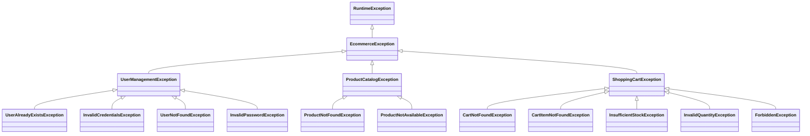

### 7.2 Global Exception Handler

```java
package com.ecommerce.common.exception;

import com.ecommerce.common.dto.ErrorResponse;
import lombok.extern.slf4j.Slf4j;
import org.springframework.http.HttpStatus;
import org.springframework.http.ResponseEntity;
import org.springframework.validation.FieldError;
import org.springframework.web.bind.MethodArgumentNotValidException;
import org.springframework.web.bind.annotation.ExceptionHandler;
import org.springframework.web.bind.annotation.RestControllerAdvice;
import org.springframework.web.context.request.WebRequest;

import java.time.LocalDateTime;
import java.util.List;
import java.util.UUID;
import java.util.stream.Collectors;

@RestControllerAdvice
@Slf4j
public class GlobalExceptionHandler {

    @ExceptionHandler(MethodArgumentNotValidException.class)
    public ResponseEntity<ErrorResponse> handleValidationException(
            MethodArgumentNotValidException ex, WebRequest request) {
        
        List<ErrorResponse.ValidationError> validationErrors = ex.getBindingResult()
            .getFieldErrors()
            .stream()
            .map(error -> ErrorResponse.ValidationError.builder()
                .field(error.getField())
                .message(error.getDefaultMessage())
                .build())
            .collect(Collectors.toList());
        
        ErrorResponse.ErrorDetail errorDetail = ErrorResponse.ErrorDetail.builder()
            .code("VALIDATION_ERROR")
            .message("Request validation failed")
            .timestamp(LocalDateTime.now())
            .requestId(extractRequestId(request))
            .details(validationErrors)
            .build();
        
        log.warn("Validation error: {}", validationErrors);
        
        return ResponseEntity
            .status(HttpStatus.UNPROCESSABLE_ENTITY)
            .body(ErrorResponse.builder().error(errorDetail).build());
    }

    @ExceptionHandler(UserAlreadyExistsException.class)
    public ResponseEntity<ErrorResponse> handleUserAlreadyExistsException(
            UserAlreadyExistsException ex, WebRequest request) {
        
        ErrorResponse.ErrorDetail errorDetail = ErrorResponse.ErrorDetail.builder()
            .code("USER_ALREADY_EXISTS")
            .message(ex.getMessage())
            .timestamp(LocalDateTime.now())
            .requestId(extractRequestId(request))
            .build();
        
        log.warn("User already exists: {}", ex.getMessage());
        
        return ResponseEntity
            .status(HttpStatus.CONFLICT)
            .body(ErrorResponse.builder().error(errorDetail).build());
    }

    @ExceptionHandler(InvalidCredentialsException.class)
    public ResponseEntity<ErrorResponse> handleInvalidCredentialsException(
            InvalidCredentialsException ex, WebRequest request) {
        
        ErrorResponse.ErrorDetail errorDetail = ErrorResponse.ErrorDetail.builder()
            .code("INVALID_CREDENTIALS")
            .message(ex.getMessage())
            .timestamp(LocalDateTime.now())
            .requestId(extractRequestId(request))
            .build();
        
        log.warn("Invalid credentials: {}", ex.getMessage());
        
        return ResponseEntity
            .status(HttpStatus.UNAUTHORIZED)
            .body(ErrorResponse.builder().error(errorDetail).build());
    }

    @ExceptionHandler(ProductNotFoundException.class)
    public ResponseEntity<ErrorResponse> handleProductNotFoundException(
            ProductNotFoundException ex, WebRequest request) {
        
        ErrorResponse.ErrorDetail errorDetail = ErrorResponse.ErrorDetail.builder()
            .code("PRODUCT_NOT_FOUND")
            .message(ex.getMessage())
            .timestamp(LocalDateTime.now())
            .requestId(extractRequestId(request))
            .build();
        
        log.warn("Product not found: {}", ex.getMessage());
        
        return ResponseEntity
            .status(HttpStatus.NOT_FOUND)
            .body(ErrorResponse.builder().error(errorDetail).build());
    }

    @ExceptionHandler(InsufficientStockException.class)
    public ResponseEntity<ErrorResponse> handleInsufficientStockException(
            InsufficientStockException ex, WebRequest request) {
        
        ErrorResponse.ErrorDetail errorDetail = ErrorResponse.ErrorDetail.builder()
            .code("INSUFFICIENT_STOCK")
            .message(ex.getMessage())
            .timestamp(LocalDateTime.now())
            .requestId(extractRequestId(request))
            .build();
        
        log.warn("Insufficient stock: {}", ex.getMessage());
        
        return ResponseEntity
            .status(HttpStatus.UNPROCESSABLE_ENTITY)
            .body(ErrorResponse.builder().error(errorDetail).build());
    }

    @ExceptionHandler(ForbiddenException.class)
    public ResponseEntity<ErrorResponse> handleForbiddenException(
            ForbiddenException ex, WebRequest request) {
        
        ErrorResponse.ErrorDetail errorDetail = ErrorResponse.ErrorDetail.builder()
            .code("FORBIDDEN")
            .message(ex.getMessage())
            .timestamp(LocalDateTime.now())
            .requestId(extractRequestId(request))
            .build();
        
        log.warn("Forbidden access: {}", ex.getMessage());
        
        return ResponseEntity
            .status(HttpStatus.FORBIDDEN)
            .body(ErrorResponse.builder().error(errorDetail).build());
    }

    @ExceptionHandler(Exception.class)
    public ResponseEntity<ErrorResponse> handleGenericException(
            Exception ex, WebRequest request) {
        
        ErrorResponse.ErrorDetail errorDetail = ErrorResponse.ErrorDetail.builder()
            .code("INTERNAL_SERVER_ERROR")
            .message("An unexpected error occurred. Please try again later.")
            .timestamp(LocalDateTime.now())
            .requestId(extractRequestId(request))
            .build();
        
        log.error("Unexpected error: ", ex);
        
        return ResponseEntity
            .status(HttpStatus.INTERNAL_SERVER_ERROR)
            .body(ErrorResponse.builder().error(errorDetail).build());
    }

    private UUID extractRequestId(WebRequest request) {
        String requestId = request.getHeader("X-Request-ID");
        return requestId != null ? UUID.fromString(requestId) : UUID.randomUUID();
    }
}
```

### 7.3 Logging Configuration

**Logback Configuration (logback-spring.xml):**

```xml
<?xml version="1.0" encoding="UTF-8"?>
<configuration>
    <include resource="org/springframework/boot/logging/logback/defaults.xml"/>

    <springProperty scope="context" name="application.name" source="spring.application.name"/>
    <springProperty scope="context" name="application.version" source="spring.application.version"/>

    <!-- Console Appender -->
    <appender name="CONSOLE" class="ch.qos.logback.core.ConsoleAppender">
        <encoder class="net.logstash.logback.encoder.LogstashEncoder">
            <customFields>{"application":"${application.name}","version":"${application.version}"}</customFields>
            <includeMdcKeyName>traceId</includeMdcKeyName>
            <includeMdcKeyName>spanId</includeMdcKeyName>
            <includeMdcKeyName>userId</includeMdcKeyName>
            <includeMdcKeyName>requestId</includeMdcKeyName>
        </encoder>
    </appender>

    <!-- File Appender -->
    <appender name="FILE" class="ch.qos.logback.core.rolling.RollingFileAppender">
        <file>logs/${application.name}.log</file>
        <rollingPolicy class="ch.qos.logback.core.rolling.TimeBasedRollingPolicy">
            <fileNamePattern>logs/${application.name}-%d{yyyy-MM-dd}.%i.log</fileNamePattern>
            <timeBasedFileNamingAndTriggeringPolicy class="ch.qos.logback.core.rolling.SizeAndTimeBasedFNATP">
                <maxFileSize>100MB</maxFileSize>
            </timeBasedFileNamingAndTriggeringPolicy>
            <maxHistory>30</maxHistory>
        </rollingPolicy>
        <encoder class="net.logstash.logback.encoder.LogstashEncoder">
            <customFields>{"application":"${application.name}","version":"${application.version}"}</customFields>
        </encoder>
    </appender>

    <!-- Audit Log Appender -->
    <appender name="AUDIT" class="ch.qos.logback.core.rolling.RollingFileAppender">
        <file>logs/${application.name}-audit.log</file>
        <rollingPolicy class="ch.qos.logback.core.rolling.TimeBasedRollingPolicy">
            <fileNamePattern>logs/${application.name}-audit-%d{yyyy-MM-dd}.%i.log</fileNamePattern>
            <timeBasedFileNamingAndTriggeringPolicy class="ch.qos.logback.core.rolling.SizeAndTimeBasedFNATP">
                <maxFileSize>100MB</maxFileSize>
            </timeBasedFileNamingAndTriggeringPolicy>
            <maxHistory>2555</maxHistory> <!-- 7 years retention -->
        </rollingPolicy>
        <encoder class="net.logstash.logback.encoder.LogstashEncoder"/>
    </appender>

    <!-- Logger Configuration -->
    <logger name="com.ecommerce" level="INFO"/>
    <logger name="com.ecommerce.audit" level="INFO" additivity="false">
        <appender-ref ref="AUDIT"/>
    </logger>

    <root level="INFO">
        <appender-ref ref="CONSOLE"/>
        <appender-ref ref="FILE"/>
    </root>
</configuration>
```

### 7.4 Audit Logging Service

```java
package com.ecommerce.common.audit;

import lombok.RequiredArgsConstructor;
import lombok.extern.slf4j.Slf4j;
import org.slf4j.Logger;
import org.slf4j.LoggerFactory;
import org.springframework.stereotype.Service;

import java.time.LocalDateTime;
import java.util.Map;
import java.util.UUID;

@Service
@RequiredArgsConstructor
@Slf4j
public class AuditLogService {

    private static final Logger AUDIT_LOGGER = LoggerFactory.getLogger("com.ecommerce.audit");

    public void logUserRegistration(UUID userId, String email, String ipAddress) {
        AuditLog auditLog = AuditLog.builder()
            .eventType("USER_REGISTRATION")
            .userId(userId)
            .action("REGISTER")
            .resource("/api/v1/users/register")
            .ipAddress(ipAddress)
            .timestamp(LocalDateTime.now())
            .metadata(Map.of("email", email))
            .build();
        
        AUDIT_LOGGER.info("Audit: {}", auditLog);
    }

    public void logUserLogin(UUID userId, String email, String ipAddress, boolean success) {
        AuditLog auditLog = AuditLog.builder()
            .eventType(success ? "USER_LOGIN_SUCCESS" : "USER_LOGIN_FAILED")
            .userId(userId)
            .action("LOGIN")
            .resource("/api/v1/users/login")
            .ipAddress(ipAddress)
            .timestamp(LocalDateTime.now())
            .metadata(Map.of("email", email, "success", success))
            .build();
        
        AUDIT_LOGGER.info("Audit: {}", auditLog);
    }

    public void logProfileUpdate(UUID userId, Map<String, Object> changes, String ipAddress) {
        AuditLog auditLog = AuditLog.builder()
            .eventType("USER_PROFILE_UPDATE")
            .userId(userId)
            .action("UPDATE")
            .resource("/api/v1/users/profile")
            .ipAddress(ipAddress)
            .timestamp(LocalDateTime.now())
            .metadata(Map.of("changes", changes))
            .build();
        
        AUDIT_LOGGER.info("Audit: {}", auditLog);
    }

    public void logCartItemAdded(UUID userId, UUID cartId, UUID productId, int quantity) {
        AuditLog auditLog = AuditLog.builder()
            .eventType("CART_ITEM_ADDED")
            .userId(userId)
            .action("ADD")
            .resource("/api/v1/cart/items")
            .timestamp(LocalDateTime.now())
            .metadata(Map.of(
                "cartId", cartId,
                "productId", productId,
                "quantity", quantity
            ))
            .build();
        
        AUDIT_LOGGER.info("Audit: {}", auditLog);
    }

    public void logCartItemUpdated(UUID userId, UUID cartId, UUID itemId, int newQuantity) {
        AuditLog auditLog = AuditLog.builder()
            .eventType("CART_ITEM_UPDATED")
            .userId(userId)
            .action("UPDATE")
            .resource("/api/v1/cart/items/" + itemId)
            .timestamp(LocalDateTime.now())
            .metadata(Map.of(
                "cartId", cartId,
                "itemId", itemId,
                "newQuantity", newQuantity
            ))
            .build();
        
        AUDIT_LOGGER.info("Audit: {}", auditLog);
    }

    public void logCartItemRemoved(UUID userId, UUID cartId, UUID itemId) {
        AuditLog auditLog = AuditLog.builder()
            .eventType("CART_ITEM_REMOVED")
            .userId(userId)
            .action("DELETE")
            .resource("/api/v1/cart/items/" + itemId)
            .timestamp(LocalDateTime.now())
            .metadata(Map.of(
                "cartId", cartId,
                "itemId", itemId
            ))
            .build();
        
        AUDIT_LOGGER.info("Audit: {}", auditLog);
    }

    public void logCartCleared(UUID userId, UUID cartId) {
        AuditLog auditLog = AuditLog.builder()
            .eventType("CART_CLEARED")
            .userId(userId)
            .action("DELETE")
            .resource("/api/v1/cart")
            .timestamp(LocalDateTime.now())
            .metadata(Map.of("cartId", cartId))
            .build();
        
        AUDIT_LOGGER.info("Audit: {}", auditLog);
    }
}
```

---

## 8. DEPLOYMENT ARCHITECTURE

### 8.1 Kubernetes Deployment

**User Management Service Deployment:**

```yaml
apiVersion: apps/v1
kind: Deployment
metadata:
  name: user-management-service
  namespace: ecommerce
  labels:
    app: user-management
    version: v1
spec:
  replicas: 3
  selector:
    matchLabels:
      app: user-management
  template:
    metadata:
      labels:
        app: user-management
        version: v1
    spec:
      containers:
      - name: user-management
        image: ecommerce/user-management:1.0.0
        ports:
        - containerPort: 8080
          name: http
        env:
        - name: SPRING_PROFILES_ACTIVE
          value: "production"
        - name: DB_HOST
          valueFrom:
            secretKeyRef:
              name: database-credentials
              key: host
        - name: DB_NAME
          valueFrom:
            secretKeyRef:
              name: database-credentials
              key: database
        - name: DB_USERNAME
          valueFrom:
            secretKeyRef:
              name: database-credentials
              key: username
        - name: DB_PASSWORD
          valueFrom:
            secretKeyRef:
              name: database-credentials
              key: password
        - name: REDIS_HOST
          valueFrom:
            secretKeyRef:
              name: redis-credentials
              key: host
        - name: REDIS_PASSWORD
          valueFrom:
            secretKeyRef:
              name: redis-credentials
              key: password
        - name: JWT_PRIVATE_KEY
          valueFrom:
            secretKeyRef:
              name: jwt-keys
              key: private-key
        - name: JWT_PUBLIC_KEY
          valueFrom:
            secretKeyRef:
              name: jwt-keys
              key: public-key
        resources:
          requests:
            memory: "512Mi"
            cpu: "500m"
          limits:
            memory: "1Gi"
            cpu: "1000m"
        livenessProbe:
          httpGet:
            path: /actuator/health/liveness
            port: 8080
          initialDelaySeconds: 30
          periodSeconds: 10
          timeoutSeconds: 5
          failureThreshold: 3
        readinessProbe:
          httpGet:
            path: /actuator/health/readiness
            port: 8080
          initialDelaySeconds: 10
          periodSeconds: 5
          timeoutSeconds: 3
          failureThreshold: 3
        startupProbe:
          httpGet:
            path: /actuator/health/startup
            port: 8080
          initialDelaySeconds: 0
          periodSeconds: 5
          timeoutSeconds: 3
          failureThreshold: 30
---
apiVersion: v1
kind: Service
metadata:
  name: user-management-service
  namespace: ecommerce
  labels:
    app: user-management
spec:
  selector:
    app: user-management
  ports:
  - protocol: TCP
    port: 80
    targetPort: 8080
  type: ClusterIP
---
apiVersion: autoscaling/v2
kind: HorizontalPodAutoscaler
metadata:
  name: user-management-hpa
  namespace: ecommerce
spec:
  scaleTargetRef:
    apiVersion: apps/v1
    kind: Deployment
    name: user-management-service
  minReplicas: 3
  maxReplicas: 10
  metrics:
  - type: Resource
    resource:
      name: cpu
      target:
        type: Utilization
        averageUtilization: 70
  - type: Resource
    resource:
      name: memory
      target:
        type: Utilization
        averageUtilization: 80
  behavior:
    scaleDown:
      stabilizationWindowSeconds: 300
      policies:
      - type: Percent
        value: 50
        periodSeconds: 60
    scaleUp:
      stabilizationWindowSeconds: 0
      policies:
      - type: Percent
        value: 100
        periodSeconds: 30
      - type: Pods
        value: 2
        periodSeconds: 30
      selectPolicy: Max
```

**Product Catalog Service Deployment:**

```yaml
apiVersion: apps/v1
kind: Deployment
metadata:
  name: product-catalog-service
  namespace: ecommerce
  labels:
    app: product-catalog
    version: v1
spec:
  replicas: 3
  selector:
    matchLabels:
      app: product-catalog
  template:
    metadata:
      labels:
        app: product-catalog
        version: v1
    spec:
      containers:
      - name: product-catalog
        image: ecommerce/product-catalog:1.0.0
        ports:
        - containerPort: 8081
          name: http
        env:
        - name: SPRING_PROFILES_ACTIVE
          value: "production"
        - name: DB_HOST
          valueFrom:
            secretKeyRef:
              name: database-credentials
              key: host
        - name: DB_NAME
          valueFrom:
            secretKeyRef:
              name: database-credentials
              key: database
        - name: DB_USERNAME
          valueFrom:
            secretKeyRef:
              name: database-credentials
              key: username
        - name: DB_PASSWORD
          valueFrom:
            secretKeyRef:
              name: database-credentials
              key: password
        - name: REDIS_HOST
          valueFrom:
            secretKeyRef:
              name: redis-credentials
              key: host
        - name: REDIS_PASSWORD
          valueFrom:
            secretKeyRef:
              name: redis-credentials
              key: password
        resources:
          requests:
            memory: "512Mi"
            cpu: "500m"
          limits:
            memory: "1Gi"
            cpu: "1000m"
        livenessProbe:
          httpGet:
            path: /actuator/health/liveness
            port: 8081
          initialDelaySeconds: 30
          periodSeconds: 10
        readinessProbe:
          httpGet:
            path: /actuator/health/readiness
            port: 8081
          initialDelaySeconds: 10
          periodSeconds: 5
---
apiVersion: v1
kind: Service
metadata:
  name: product-catalog-service
  namespace: ecommerce
  labels:
    app: product-catalog
spec:
  selector:
    app: product-catalog
  ports:
  - protocol: TCP
    port: 80
    targetPort: 8081
  type: ClusterIP
---
apiVersion: autoscaling/v2
kind: HorizontalPodAutoscaler
metadata:
  name: product-catalog-hpa
  namespace: ecommerce
spec:
  scaleTargetRef:
    apiVersion: apps/v1
    kind: Deployment
    name: product-catalog-service
  minReplicas: 3
  maxReplicas: 15
  metrics:
  - type: Resource
    resource:
      name: cpu
      target:
        type: Utilization
        averageUtilization: 70
```

**Shopping Cart Service Deployment:**

```yaml
apiVersion: apps/v1
kind: Deployment
metadata:
  name: shopping-cart-service
  namespace: ecommerce
  labels:
    app: shopping-cart
    version: v1
spec:
  replicas: 3
  selector:
    matchLabels:
      app: shopping-cart
  template:
    metadata:
      labels:
        app: shopping-cart
        version: v1
    spec:
      containers:
      - name: shopping-cart
        image: ecommerce/shopping-cart:1.0.0
        ports:
        - containerPort: 8082
          name: http
        env:
        - name: SPRING_PROFILES_ACTIVE
          value: "production"
        - name: DB_HOST
          valueFrom:
            secretKeyRef:
              name: database-credentials
              key: host
        - name: DB_NAME
          valueFrom:
            secretKeyRef:
              name: database-credentials
              key: database
        - name: DB_USERNAME
          valueFrom:
            secretKeyRef:
              name: database-credentials
              key: username
        - name: DB_PASSWORD
          valueFrom:
            secretKeyRef:
              name: database-credentials
              key: password
        - name: REDIS_HOST
          valueFrom:
            secretKeyRef:
              name: redis-credentials
              key: host
        - name: REDIS_PASSWORD
          valueFrom:
            secretKeyRef:
              name: redis-credentials
              key: password
        - name: USER_SERVICE_URL
          value: "http://user-management-service"
        - name: PRODUCT_SERVICE_URL
          value: "http://product-catalog-service"
        resources:
          requests:
            memory: "512Mi"
            cpu: "500m"
          limits:
            memory: "1Gi"
            cpu: "1000m"
        livenessProbe:
          httpGet:
            path: /actuator/health/liveness
            port: 8082
          initialDelaySeconds: 30
          periodSeconds: 10
        readinessProbe:
          httpGet:
            path: /actuator/health/readiness
            port: 8082
          initialDelaySeconds: 10
          periodSeconds: 5
---
apiVersion: v1
kind: Service
metadata:
  name: shopping-cart-service
  namespace: ecommerce
  labels:
    app: shopping-cart
spec:
  selector:
    app: shopping-cart
  ports:
  - protocol: TCP
    port: 80
    targetPort: 8082
  type: ClusterIP
---
apiVersion: autoscaling/v2
kind: HorizontalPodAutoscaler
metadata:
  name: shopping-cart-hpa
  namespace: ecommerce
spec:
  scaleTargetRef:
    apiVersion: apps/v1
    kind: Deployment
    name: shopping-cart-service
  minReplicas: 3
  maxReplicas: 10
  metrics:
  - type: Resource
    resource:
      name: cpu
      target:
        type: Utilization
        averageUtilization: 70
```

### 8.2 Infrastructure Components

**PostgreSQL Database (AWS RDS):**

```yaml
Engine: PostgreSQL 15.x
Instance Class: db.r6g.xlarge (4 vCPU, 32 GB RAM)
Storage: 500 GB SSD (gp3)
Multi-AZ: Enabled
Backup Retention: 30 days
Encryption: AES-256 (at rest)
TLS: Required (in transit)
Read Replicas: 2 (for Product Catalog Service)
```

**Redis Cache (AWS ElastiCache):**

```yaml
Engine: Redis 7.x
Node Type: cache.r6g.large (2 vCPU, 13.07 GB RAM)
Cluster Mode: Enabled
Number of Shards: 3
Replicas per Shard: 2
Encryption: AES-256 (at rest and in transit)
Backup: Automated daily backups
```

**API Gateway (Kong):**

```yaml
Deployment: Kubernetes (3 replicas)
Plugins:
  - JWT Authentication
  - Rate Limiting
  - CORS
  - Request/Response Transformation
  - Logging
  - Prometheus Metrics
Upstream Services:
  - user-management-service:80
  - product-catalog-service:80
  - shopping-cart-service:80
```

### 8.3 CI/CD Pipeline

**GitHub Actions Workflow:**

```yaml
name: CI/CD Pipeline

on:
  push:
    branches:
      - main
      - develop
  pull_request:
    branches:
      - main

jobs:
  build-and-test:
    runs-on: ubuntu-latest
    steps:
      - name: Checkout code
        uses: actions/checkout@v3

      - name: Set up JDK 17
        uses: actions/setup-java@v3
        with:
          java-version: '17'
          distribution: 'temurin'

      - name: Cache Maven dependencies
        uses: actions/cache@v3
        with:
          path: ~/.m2/repository
          key: ${{ runner.os }}-maven-${{ hashFiles('**/pom.xml') }}

      - name: Build with Maven
        run: mvn clean install -DskipTests

      - name: Run unit tests
        run: mvn test

      - name: Run integration tests
        run: mvn verify -Pintegration-tests

      - name: SonarQube analysis
        run: mvn sonar:sonar -Dsonar.projectKey=ecommerce -Dsonar.host.url=${{ secrets.SONAR_HOST_URL }} -Dsonar.login=${{ secrets.SONAR_TOKEN }}

      - name: Build Docker image
        run: docker build -t ecommerce/user-management:${{ github.sha }} .

      - name: Push Docker image
        run: |
          echo ${{ secrets.DOCKER_PASSWORD }} | docker login -u ${{ secrets.DOCKER_USERNAME }} --password-stdin
          docker push ecommerce/user-management:${{ github.sha }}

  deploy-to-staging:
    needs: build-and-test
    runs-on: ubuntu-latest
    if: github.ref == 'refs/heads/develop'
    steps:
      - name: Deploy to Kubernetes (Staging)
        run: |
          kubectl set image deployment/user-management-service user-management=ecommerce/user-management:${{ github.sha }} -n ecommerce-staging
          kubectl rollout status deployment/user-management-service -n ecommerce-staging

  deploy-to-production:
    needs: build-and-test
    runs-on: ubuntu-latest
    if: github.ref == 'refs/heads/main'
    steps:
      - name: Deploy to Kubernetes (Production)
        run: |
          kubectl set image deployment/user-management-service user-management=ecommerce/user-management:${{ github.sha }} -n ecommerce
          kubectl rollout status deployment/user-management-service -n ecommerce
```

---

## 9. PERFORMANCE & SCALABILITY

### 9.1 Performance Targets

| Service | Metric | Target | Measurement |
|---------|--------|--------|-------------|
| User Management | Latency (p95) | <200ms | Response time for authentication |
| User Management | Throughput | 1000 req/s | Concurrent user registrations |
| Product Catalog | Latency (p95) | <100ms | Response time for product search |
| Product Catalog | Throughput | 5000 req/s | Concurrent product searches |
| Shopping Cart | Latency (p95) | <300ms | Response time for cart operations |
| Shopping Cart | Throughput | 2000 req/s | Concurrent cart modifications |
| Database | Query Time (p95) | <50ms | Database query execution time |
| Cache | Hit Rate | >80% | Redis cache hit rate |

### 9.2 Scalability Strategy

**Horizontal Scaling:**
- **Auto-scaling:** Kubernetes HPA based on CPU/memory utilization
- **Scale-out triggers:** CPU >70%, Memory >80%
- **Scale-in triggers:** CPU <30%, Memory <40% (5-minute stabilization window)
- **Min replicas:** 3 per service
- **Max replicas:** 10-15 per service

**Database Scaling:**
- **Read Replicas:** 2 read replicas for Product Catalog Service
- **Connection Pooling:** HikariCP with max 20 connections per service instance
- **Query Optimization:** Indexes on frequently queried columns
- **Partitioning:** Future consideration for large tables (>10M rows)

**Caching Strategy:**
- **L1 Cache:** In-memory cache (Caffeine) for frequently accessed data
- **L2 Cache:** Distributed cache (Redis) for shared data across instances
- **Cache TTL:** 5-10 minutes for product data, 5 minutes for user sessions
- **Cache Invalidation:** Explicit invalidation on data updates

### 9.3 Performance Optimization

**Database Optimization:**

```sql
-- Index optimization for product search
CREATE INDEX idx_products_name_gin ON products USING gin(to_tsvector('english', name));
CREATE INDEX idx_products_description_gin ON products USING gin(to_tsvector('english', description));

-- Partial index for available products
CREATE INDEX idx_products_available ON products(available) WHERE available = true;

-- Composite index for cart queries
CREATE INDEX idx_cart_items_cart_product ON cart_items(cart_id, product_id);

-- Analyze query performance
EXPLAIN ANALYZE SELECT * FROM products WHERE to_tsvector('english', name) @@ to_tsquery('laptop');
```

**JPA Query Optimization:**

```java
// Use @EntityGraph to avoid N+1 queries
@EntityGraph(attributePaths = {"items"})
@Query("SELECT c FROM Cart c WHERE c.userId = :userId")
Optional<Cart> findByUserIdWithItems(@Param("userId") UUID userId);

// Use pagination for large result sets
@Query("SELECT p FROM Product p WHERE LOWER(p.name) LIKE LOWER(CONCAT('%', :keyword, '%'))")
Page<Product> searchByKeyword(@Param("keyword") String keyword, Pageable pageable);

// Use native queries for complex operations
@Query(value = "SELECT * FROM products WHERE to_tsvector('english', name || ' ' || description) @@ to_tsquery(:keyword)",
       nativeQuery = true)
List<Product> fullTextSearch(@Param("keyword") String keyword);
```

**Caching Configuration:**

```java
@Configuration
@EnableCaching
public class CacheConfiguration {

    @Bean
    public CacheManager cacheManager(RedisConnectionFactory connectionFactory) {
        RedisCacheConfiguration config = RedisCacheConfiguration.defaultCacheConfig()
            .entryTtl(Duration.ofMinutes(10))
            .serializeKeysWith(RedisSerializationContext.SerializationPair.fromSerializer(new StringRedisSerializer()))
            .serializeValuesWith(RedisSerializationContext.SerializationPair.fromSerializer(new GenericJackson2JsonRedisSerializer()));

        return RedisCacheManager.builder(connectionFactory)
            .cacheDefaults(config)
            .withCacheConfiguration("products", config.entryTtl(Duration.ofMinutes(10)))
            .withCacheConfiguration("users", config.entryTtl(Duration.ofMinutes(5)))
            .build();
    }
}
```

---

## 10. TESTING STRATEGY

### 10.1 Unit Testing

**Test Coverage Requirements:**
- **Minimum Coverage:** 80% code coverage
- **Critical Paths:** 100% coverage for authentication, authorization, payment processing
- **Test Framework:** JUnit 5, Mockito, AssertJ

**Example Unit Test:**

```java
@SpringBootTest
class UserServiceTest {

    @Autowired
    private UserService userService;

    @MockBean
    private UserRepository userRepository;

    @MockBean
    private PasswordService passwordService;

    @MockBean
    private JwtTokenService jwtTokenService;

    @Test
    @DisplayName("Should register user successfully")
    void testRegisterUser_Success() {
        // Arrange
        UserRegistrationRequest request = UserRegistrationRequest.builder()
            .email("test@example.com")
            .password("SecureP@ssw0rd123")
            .firstName("Test")
            .lastName("User")
            .consentToTerms(true)
            .build();

        when(userRepository.existsByEmail(request.getEmail())).thenReturn(false);
        when(passwordService.hashPassword(request.getPassword())).thenReturn("hashedPassword");
        when(jwtTokenService.generateAccessToken(any(User.class))).thenReturn("accessToken");
        when(jwtTokenService.generateRefreshToken(any(User.class))).thenReturn("refreshToken");

        // Act
        UserRegistrationResponse response = userService.register(request, "127.0.0.1");

        // Assert
        assertThat(response).isNotNull();
        assertThat(response.getEmail()).isEqualTo(request.getEmail());
        assertThat(response.getAccessToken()).isEqualTo("accessToken");
        verify(userRepository, times(1)).save(any(User.class));
    }

    @Test
    @DisplayName("Should throw exception when email already exists")
    void testRegisterUser_DuplicateEmail() {
        // Arrange
        UserRegistrationRequest request = UserRegistrationRequest.builder()
            .email("existing@example.com")
            .password("SecureP@ssw0rd123")
            .firstName("Test")
            .lastName("User")
            .consentToTerms(true)
            .build();

        when(userRepository.existsByEmail(request.getEmail())).thenReturn(true);

        // Act & Assert
        assertThatThrownBy(() -> userService.register(request, "127.0.0.1"))
            .isInstanceOf(UserAlreadyExistsException.class)
            .hasMessage("A user with this email already exists");
    }
}
```

### 10.2 Integration Testing

**Test Scenarios:**
- API endpoint testing (request/response validation)
- Database integration testing (CRUD operations)
- Service-to-service communication testing
- Authentication and authorization testing

**Example Integration Test:**

```java
@SpringBootTest(webEnvironment = SpringBootTest.WebEnvironment.RANDOM_PORT)
@AutoConfigureMockMvc
@Testcontainers
class UserControllerIntegrationTest {

    @Autowired
    private MockMvc mockMvc;

    @Autowired
    private ObjectMapper objectMapper;

    @Container
    static PostgreSQLContainer<?> postgres = new PostgreSQLContainer<>("postgres:15")
        .withDatabaseName("testdb")
        .withUsername("test")
        .withPassword("test");

    @DynamicPropertySource
    static void configureProperties(DynamicPropertyRegistry registry) {
        registry.add("spring.datasource.url", postgres::getJdbcUrl);
        registry.add("spring.datasource.username", postgres::getUsername);
        registry.add("spring.datasource.password", postgres::getPassword);
    }

    @Test
    @DisplayName("Should register user successfully")
    void testRegisterUser_Success() throws Exception {
        UserRegistrationRequest request = UserRegistrationRequest.builder()
            .email("integration@example.com")
            .password("SecureP@ssw0rd123")
            .firstName("Integration")
            .lastName("Test")
            .consentToTerms(true)
            .build();

        mockMvc.perform(post("/api/v1/users/register")
                .contentType(MediaType.APPLICATION_JSON)
                .content(objectMapper.writeValueAsString(request)))
                .andExpect(status().isCreated())
                .andExpect(jsonPath("$.email").value(request.getEmail()))
                .andExpect(jsonPath("$.accessToken").exists())
                .andExpect(jsonPath("$.refreshToken").exists());
    }

    @Test
    @DisplayName("Should return 401 when accessing profile without token")
    void testGetProfile_Unauthorized() throws Exception {
        mockMvc.perform(get("/api/v1/users/profile"))
                .andExpect(status().isUnauthorized());
    }
}
```

### 10.3 Performance Testing

**Load Testing with JMeter:**

```xml
<?xml version="1.0" encoding="UTF-8"?>
<jmeterTestPlan version="1.2">
  <hashTree>
    <TestPlan guiclass="TestPlanGui" testclass="TestPlan" testname="E-Commerce Load Test">
      <elementProp name="TestPlan.user_defined_variables" elementType="Arguments">
        <collectionProp name="Arguments.arguments">
          <elementProp name="BASE_URL" elementType="Argument">
            <stringProp name="Argument.name">BASE_URL</stringProp>
            <stringProp name="Argument.value">https://api.ecommerce.example.com</stringProp>
          </elementProp>
        </collectionProp>
      </elementProp>
    </TestPlan>
    <hashTree>
      <ThreadGroup guiclass="ThreadGroupGui" testclass="ThreadGroup" testname="User Registration Load Test">
        <intProp name="ThreadGroup.num_threads">1000</intProp>
        <intProp name="ThreadGroup.ramp_time">60</intProp>
        <longProp name="ThreadGroup.duration">600</longProp>
      </ThreadGroup>
      <hashTree>
        <HTTPSamplerProxy guiclass="HttpTestSampleGui" testclass="HTTPSamplerProxy" testname="Register User">
          <stringProp name="HTTPSampler.domain">${BASE_URL}</stringProp>
          <stringProp name="HTTPSampler.path">/api/v1/users/register</stringProp>
          <stringProp name="HTTPSampler.method">POST</stringProp>
          <boolProp name="HTTPSampler.use_keepalive">true</boolProp>
        </HTTPSamplerProxy>
      </hashTree>
    </hashTree>
  </hashTree>
</jmeterTestPlan>
```

---

## 11. OPERATIONAL PROCEDURES

### 11.1 Monitoring & Alerting

**Prometheus Metrics:**

```yaml
management:
  endpoints:
    web:
      exposure:
        include: health,info,metrics,prometheus
  metrics:
    export:
      prometheus:
        enabled: true
    tags:
      application: ${spring.application.name}
      environment: ${spring.profiles.active}
```

**Grafana Dashboard:**

```json
{
  "dashboard": {
    "title": "E-Commerce Platform Monitoring",
    "panels": [
      {
        "title": "Request Rate",
        "targets": [
          {
            "expr": "rate(http_server_requests_seconds_count[5m])"
          }
        ]
      },
      {
        "title": "Error Rate",
        "targets": [
          {
            "expr": "rate(http_server_requests_seconds_count{status=~\"5..\"}[5m])"
          }
        ]
      },
      {
        "title": "Latency (p95)",
        "targets": [
          {
            "expr": "histogram_quantile(0.95, rate(http_server_requests_seconds_bucket[5m]))"
          }
        ]
      }
    ]
  }
}
```

**Alerting Rules:**

```yaml
groups:
  - name: ecommerce_alerts
    interval: 30s
    rules:
      - alert: HighErrorRate
        expr: rate(http_server_requests_seconds_count{status=~"5.."}[5m]) > 0.05
        for: 5m
        labels:
          severity: critical
        annotations:
          summary: "High error rate detected"
          description: "Error rate is {{ $value }} (threshold: 0.05)"

      - alert: HighLatency
        expr: histogram_quantile(0.95, rate(http_server_requests_seconds_bucket[5m])) > 1
        for: 5m
        labels:
          severity: warning
        annotations:
          summary: "High latency detected"
          description: "P95 latency is {{ $value }}s (threshold: 1s)"

      - alert: DatabaseConnectionPoolExhausted
        expr: hikaricp_connections_active / hikaricp_connections_max > 0.9
        for: 2m
        labels:
          severity: critical
        annotations:
          summary: "Database connection pool near exhaustion"
          description: "Connection pool usage is {{ $value }} (threshold: 0.9)"
```

### 11.2 Incident Response

**Incident Severity Levels:**

| Severity | Description | Response Time | Example |
|----------|-------------|---------------|----------|
| P1 (Critical) | Service down, data loss | 15 minutes | Database failure, complete service outage |
| P2 (High) | Major functionality impaired | 1 hour | Authentication service down, high error rate |
| P3 (Medium) | Minor functionality impaired | 4 hours | Slow response times, cache failures |
| P4 (Low) | Cosmetic issues, no impact | 1 business day | UI glitches, non-critical warnings |

**Incident Response Procedure:**

1. **Detection:** Automated monitoring alerts or user reports
2. **Triage:** On-call engineer assesses severity and impact
3. **Communication:** Notify stakeholders via Slack/PagerDuty
4. **Investigation:** Review logs, metrics, and traces
5. **Mitigation:** Apply immediate fixes or rollback
6. **Resolution:** Verify service restoration
7. **Post-Mortem:** Document incident and action items

### 11.3 Backup & Recovery

**Database Backup Strategy:**
- **Automated Backups:** Daily full backups at 2 AM UTC
- **Incremental Backups:** Hourly transaction log backups
- **Retention:** 30 days for automated backups
- **Cross-Region Replication:** Backups replicated to secondary region
- **Backup Testing:** Monthly restore tests to verify backup integrity

**Disaster Recovery Procedure:**

1. **Assess Impact:** Determine scope of data loss
2. **Identify Backup:** Select appropriate backup based on RPO
3. **Restore Database:** Restore from backup to new instance
4. **Validate Data:** Verify data integrity and completeness
5. **Update Configuration:** Point services to restored database
6. **Test Services:** Verify all services operational
7. **Monitor:** Closely monitor for issues post-recovery

---

## 12. APPENDICES

### 12.1 Glossary

| Term | Definition |
|------|------------|
| ABAC | Attribute-Based Access Control - Authorization based on resource attributes |
| ACID | Atomicity, Consistency, Isolation, Durability - Database transaction properties |
| BCrypt | Password hashing algorithm with configurable cost factor |
| Circuit Breaker | Design pattern to prevent cascading failures in distributed systems |
| DDD | Domain-Driven Design - Software design approach focused on domain models |
| DTO | Data Transfer Object - Object for transferring data between layers |
| HPA | Horizontal Pod Autoscaler - Kubernetes auto-scaling mechanism |
| Idempotency | Property where operation produces same result when executed multiple times |
| JWT | JSON Web Token - Compact token format for authentication |
| ORM | Object-Relational Mapping - Technique for converting data between systems |
| RBAC | Role-Based Access Control - Authorization based on user roles |
| RPO | Recovery Point Objective - Maximum acceptable data loss |
| RTO | Recovery Time Objective - Maximum acceptable downtime |
| SLA | Service Level Agreement - Commitment to service availability |
| TLS | Transport Layer Security - Cryptographic protocol for secure communication |

### 12.2 References

**Technical Documentation:**
- Spring Boot Documentation: https://spring.io/projects/spring-boot
- PostgreSQL Documentation: https://www.postgresql.org/docs/
- Redis Documentation: https://redis.io/documentation
- Kubernetes Documentation: https://kubernetes.io/docs/
- OpenAPI Specification: https://swagger.io/specification/

**Security Standards:**
- OWASP Top 10: https://owasp.org/www-project-top-ten/
- NIST Cybersecurity Framework: https://www.nist.gov/cyberframework
- PCI-DSS: https://www.pcisecuritystandards.org/

**Compliance Frameworks:**
- GDPR: https://gdpr.eu/
- CCPA: https://oag.ca.gov/privacy/ccpa
- SOC2: https://www.aicpa.org/soc
- ISO27001: https://www.iso.org/isoiec-27001-information-security.html

### 12.3 Change Log

| Version | Date | Author | Changes |
|---------|------|--------|----------|
| 1.0.0 | 2024-01-15 | Senior Backend Solution Architect | Initial LLD document |

### 12.4 Approval Signatures

**Technical Approval:**
- Technical Lead: _________________ Date: _________
- Senior Backend Architect: _________________ Date: _________

**Security Approval:**
- Security Architect: _________________ Date: _________
- Compliance Officer: _________________ Date: _________

**Business Approval:**
- Product Owner: _________________ Date: _________
- Engineering Manager: _________________ Date: _________

---

**END OF LOW-LEVEL DESIGN DOCUMENT**

**Document Status:** APPROVED FOR IMPLEMENTATION  
**Next Phase:** Development and Testing  
**Document Generated:** 2024-01-15  
**Prepared By:** Senior Backend Solution Architect  
**Certifications:** TOGAF, ISO27001, AWS Solutions Architect  
**Classification:** CONFIDENTIAL - INTERNAL USE ONLY
