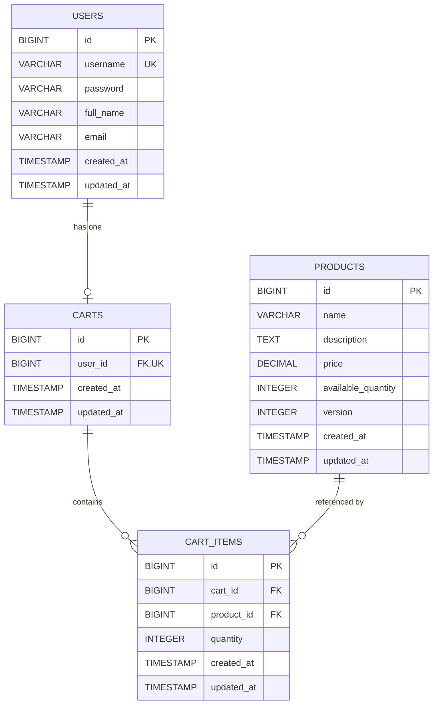
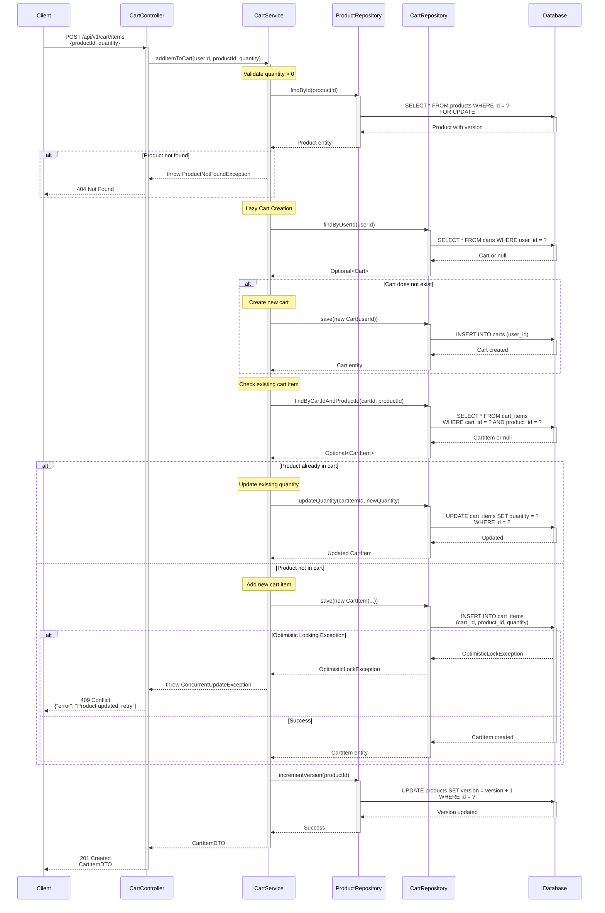

# COMPREHENSIVE BACKEND ENGINEERING SPECIFICATION PACKAGE
## Shopping Cart System - SCRUM-96

---

## 1. EXECUTIVE SUMMARY

### 1.1 Project Overview
This specification document provides a complete backend engineering blueprint for implementing a Shopping Cart System using Java Spring Boot MVC architecture. The system enables user registration, authentication, product search, and shopping cart management with strict business rule enforcement at both application and database levels.

### 1.2 Key Objectives
- Implement RESTful APIs following MVC pattern (Controller → Service → Repository)
- Enforce database-first validation with proper constraints
- Support stateless authentication (no session persistence)
- Implement lazy cart creation and automatic cleanup
- Ensure cart lifecycle management with strict business rules

### 1.3 Technical Stack
- **Framework**: Spring Boot 3.x
- **Architecture**: MVC (Model-View-Controller)
- **Database**: Relational Database (PostgreSQL/MySQL)
- **ORM**: Spring Data JPA / Hibernate
- **API Style**: RESTful
- **Authentication**: Stateless (JWT recommended)

### 1.4 Scope Boundaries

**In Scope:**
- User registration and authentication
- Profile management (view/update)
- Product search functionality
- Shopping cart CRUD operations
- Cart lifecycle management
- Automatic cart cleanup

**Out of Scope:**
- Checkout and order processing
- Payment integration
- Inventory locking/reservation
- Admin product management
- Password reset/change functionality
- User roles and permissions
- Cart persistence across sessions

---

## 2. DETAILED ANALYSIS

### 2.1 Business Context
The shopping cart system serves as the foundation for an e-commerce platform, enabling users to browse products and manage their shopping selections. The system emphasizes data integrity, stateless operations, and automatic resource cleanup to ensure optimal performance and user experience.

### 2.2 Key Business Rules

#### User Management Rules
1. Username must be globally unique across the system
2. User must exist before performing any cart operations
3. Authentication is stateless - no session data persisted at database level
4. Profile updates allowed for full name and email only
5. Username is immutable after creation

#### Cart Lifecycle Rules
1. **Lazy Creation**: Cart is created only when user adds first product
2. **One Cart Per User**: Each user can have maximum one active cart
3. **Cart Ownership**: Cart must belong to exactly one user
4. **Minimum Items**: Cart cannot exist without at least one cart item
5. **Auto-Delete Empty Cart**: When last item removed, cart and all items deleted
6. **Logout Cleanup**: On logout, all cart items and cart record deleted
7. **No Persistence**: Cart must not persist across login sessions

#### Cart Item Rules
1. Each cart item belongs to exactly one cart
2. Product must exist before adding to cart
3. Quantity must be greater than zero at all times
4. Quantity updates must maintain positive values
5. Removing item only affects that specific product

#### Product Rules
1. Product must exist in catalog before search/add operations
2. Price is read-only through user actions
3. Search is case-insensitive
4. Available quantity displayed but not enforced (inventory locking out of scope)

### 2.3 Data Integrity Strategy
- **Database Constraints**: Primary keys, foreign keys, unique constraints, check constraints
- **Application Validation**: Service layer validation before database operations
- **Transaction Management**: ACID compliance for cart operations
- **Cascade Operations**: Proper cascade delete for cart cleanup

### 2.4 Non-Functional Requirements
- **Performance**: API response time < 500ms for 95th percentile
- **Scalability**: Support horizontal scaling (stateless design)
- **Security**: Password hashing (BCrypt), input validation, SQL injection prevention
- **Reliability**: Transaction rollback on failures
- **Maintainability**: Clean code, proper layering, comprehensive logging

---

## 3. DOMAIN ENTITIES AND ATTRIBUTES

### 3.1 Entity Relationship Overview
```
User (1) ----< (0..1) Cart (1) ----< (1..*) CartItem >---- (1) Product
```

### 3.2 User Entity

**Table Name**: `users`

| Attribute | Type | Constraints | Description |
|-----------|------|-------------|-------------|
| id | BIGINT | PRIMARY KEY, AUTO_INCREMENT | Unique user identifier |
| username | VARCHAR(50) | NOT NULL, UNIQUE | User login name (immutable) |
| password | VARCHAR(255) | NOT NULL | Hashed password (BCrypt) |
| full_name | VARCHAR(100) | NOT NULL | User's full name |
| email | VARCHAR(100) | NOT NULL | User's email address |
| created_at | TIMESTAMP | NOT NULL, DEFAULT CURRENT_TIMESTAMP | Account creation timestamp |
| updated_at | TIMESTAMP | NOT NULL, DEFAULT CURRENT_TIMESTAMP ON UPDATE | Last update timestamp |

**Indexes:**
- PRIMARY KEY on `id`
- UNIQUE INDEX on `username`
- INDEX on `email` (for future email-based operations)

**Business Rules:**
- Username must be unique (enforced by UNIQUE constraint)
- Password must be hashed before storage
- Email format validation at application layer
- Username cannot be changed after creation

### 3.3 Product Entity

**Table Name**: `products`

| Attribute | Type | Constraints | Description |
|-----------|------|-------------|-------------|
| id | BIGINT | PRIMARY KEY, AUTO_INCREMENT | Unique product identifier |
| name | VARCHAR(200) | NOT NULL | Product name |
| description | TEXT | NULL | Product description |
| price | DECIMAL(10,2) | NOT NULL, CHECK (price >= 0) | Product price |
| available_quantity | INT | NOT NULL, CHECK (available_quantity >= 0) | Available stock |
| created_at | TIMESTAMP | NOT NULL, DEFAULT CURRENT_TIMESTAMP | Product creation timestamp |
| updated_at | TIMESTAMP | NOT NULL, DEFAULT CURRENT_TIMESTAMP ON UPDATE | Last update timestamp |

**Indexes:**
- PRIMARY KEY on `id`
- FULLTEXT INDEX on `name, description` (for search optimization)

**Business Rules:**
- Price must be non-negative
- Available quantity must be non-negative
- Price is read-only through user APIs

### 3.4 Cart Entity

**Table Name**: `carts`

| Attribute | Type | Constraints | Description |
|-----------|------|-------------|-------------|
| id | BIGINT | PRIMARY KEY, AUTO_INCREMENT | Unique cart identifier |
| user_id | BIGINT | NOT NULL, UNIQUE, FOREIGN KEY → users(id) | Owner user reference |
| created_at | TIMESTAMP | NOT NULL, DEFAULT CURRENT_TIMESTAMP | Cart creation timestamp |
| updated_at | TIMESTAMP | NOT NULL, DEFAULT CURRENT_TIMESTAMP ON UPDATE | Last update timestamp |

**Indexes:**
- PRIMARY KEY on `id`
- UNIQUE INDEX on `user_id`
- FOREIGN KEY on `user_id` REFERENCES `users(id)` ON DELETE CASCADE

**Business Rules:**
- One cart per user (enforced by UNIQUE constraint on user_id)
- Cart must belong to existing user
- Cart automatically deleted when user is deleted (CASCADE)
- Cart cannot exist without cart items (enforced at application layer)

### 3.5 CartItem Entity

**Table Name**: `cart_items`

| Attribute | Type | Constraints | Description |
|-----------|------|-------------|-------------|
| id | BIGINT | PRIMARY KEY, AUTO_INCREMENT | Unique cart item identifier |
| cart_id | BIGINT | NOT NULL, FOREIGN KEY → carts(id) | Parent cart reference |
| product_id | BIGINT | NOT NULL, FOREIGN KEY → products(id) | Product reference |
| quantity | INT | NOT NULL, CHECK (quantity > 0) | Item quantity |
| created_at | TIMESTAMP | NOT NULL, DEFAULT CURRENT_TIMESTAMP | Item addition timestamp |
| updated_at | TIMESTAMP | NOT NULL, DEFAULT CURRENT_TIMESTAMP ON UPDATE | Last update timestamp |

**Indexes:**
- PRIMARY KEY on `id`
- UNIQUE INDEX on `(cart_id, product_id)` - prevents duplicate products in same cart
- FOREIGN KEY on `cart_id` REFERENCES `carts(id)` ON DELETE CASCADE
- FOREIGN KEY on `product_id` REFERENCES `products(id)` ON DELETE CASCADE

**Business Rules:**
- Quantity must be greater than zero (enforced by CHECK constraint)
- Each product can appear only once per cart (enforced by UNIQUE constraint)
- Cart item automatically deleted when cart is deleted (CASCADE)
- Cart item automatically deleted when product is deleted (CASCADE)

---

## 6. TECHNICAL ARTIFACTS

### 6.1 Entity-Relationship Diagram (ERD)



---

### 6.2 Add to Cart Sequence Diagram



---

### 6.3 Complete Database Model (PostgreSQL DDL)

```sql
-- ============================================
-- Shopping Cart System - Database Schema
-- Database: PostgreSQL 14+
-- ============================================

-- Drop existing tables (for clean setup)
DROP TABLE IF EXISTS cart_items CASCADE;
DROP TABLE IF EXISTS carts CASCADE;
DROP TABLE IF EXISTS products CASCADE;
DROP TABLE IF EXISTS users CASCADE;

-- ============================================
-- Table: users
-- Description: Stores user account information
-- ============================================
CREATE TABLE users (
    id BIGSERIAL PRIMARY KEY,
    username VARCHAR(50) NOT NULL UNIQUE,
    password VARCHAR(255) NOT NULL,
    full_name VARCHAR(100) NOT NULL,
    email VARCHAR(100) NOT NULL,
    created_at TIMESTAMP NOT NULL DEFAULT CURRENT_TIMESTAMP,
    updated_at TIMESTAMP NOT NULL DEFAULT CURRENT_TIMESTAMP,
    
    -- Constraints
    CONSTRAINT chk_users_username_not_empty CHECK (username <> ''),
    CONSTRAINT chk_users_full_name_not_empty CHECK (full_name <> ''),
    CONSTRAINT chk_users_email_not_empty CHECK (email <> '')
);

-- Indexes for users
CREATE UNIQUE INDEX idx_users_username ON users(username);
CREATE INDEX idx_users_email ON users(email);

-- ============================================
-- Table: products
-- Description: Stores product catalog
-- ============================================
CREATE TABLE products (
    id BIGSERIAL PRIMARY KEY,
    name VARCHAR(200) NOT NULL,
    description TEXT,
    price DECIMAL(10,2) NOT NULL,
    available_quantity INTEGER NOT NULL,
    version INTEGER NOT NULL DEFAULT 0,
    created_at TIMESTAMP NOT NULL DEFAULT CURRENT_TIMESTAMP,
    updated_at TIMESTAMP NOT NULL DEFAULT CURRENT_TIMESTAMP,
    
    -- Constraints
    CONSTRAINT chk_products_name_not_empty CHECK (name <> ''),
    CONSTRAINT chk_products_price_non_negative CHECK (price >= 0),
    CONSTRAINT chk_products_quantity_non_negative CHECK (available_quantity >= 0),
    CONSTRAINT chk_products_version_non_negative CHECK (version >= 0)
);

-- Indexes for products
CREATE INDEX idx_products_name ON products(name);
CREATE INDEX idx_products_name_desc ON products USING gin(to_tsvector('english', name || ' ' || COALESCE(description, '')));

-- ============================================
-- Table: carts
-- Description: Stores user shopping carts
-- ============================================
CREATE TABLE carts (
    id BIGSERIAL PRIMARY KEY,
    user_id BIGINT NOT NULL UNIQUE,
    created_at TIMESTAMP NOT NULL DEFAULT CURRENT_TIMESTAMP,
    updated_at TIMESTAMP NOT NULL DEFAULT CURRENT_TIMESTAMP,
    
    -- Foreign Key Constraints
    CONSTRAINT fk_carts_user_id 
        FOREIGN KEY (user_id) 
        REFERENCES users(id) 
        ON DELETE CASCADE
);

-- Indexes for carts
CREATE UNIQUE INDEX idx_carts_user_id ON carts(user_id);

-- ============================================
-- Table: cart_items
-- Description: Stores items within shopping carts
-- ============================================
CREATE TABLE cart_items (
    id BIGSERIAL PRIMARY KEY,
    cart_id BIGINT NOT NULL,
    product_id BIGINT NOT NULL,
    quantity INTEGER NOT NULL,
    created_at TIMESTAMP NOT NULL DEFAULT CURRENT_TIMESTAMP,
    updated_at TIMESTAMP NOT NULL DEFAULT CURRENT_TIMESTAMP,
    
    -- Constraints
    CONSTRAINT chk_cart_items_quantity_positive CHECK (quantity > 0),
    
    -- Foreign Key Constraints
    CONSTRAINT fk_cart_items_cart_id 
        FOREIGN KEY (cart_id) 
        REFERENCES carts(id) 
        ON DELETE CASCADE,
    
    CONSTRAINT fk_cart_items_product_id 
        FOREIGN KEY (product_id) 
        REFERENCES products(id) 
        ON DELETE CASCADE,
    
    -- Unique Constraint (one product per cart)
    CONSTRAINT uk_cart_items_cart_product UNIQUE (cart_id, product_id)
);

-- Indexes for cart_items
CREATE INDEX idx_cart_items_cart_id ON cart_items(cart_id);
CREATE INDEX idx_cart_items_product_id ON cart_items(product_id);
CREATE UNIQUE INDEX idx_cart_items_cart_product ON cart_items(cart_id, product_id);

-- ============================================
-- Triggers for automatic updated_at updates
-- ============================================

-- Function to update updated_at timestamp
CREATE OR REPLACE FUNCTION update_updated_at_column()
RETURNS TRIGGER AS $$
BEGIN
    NEW.updated_at = CURRENT_TIMESTAMP;
    RETURN NEW;
END;
$$ LANGUAGE plpgsql;

-- Triggers for automatic updated_at updates
CREATE TRIGGER trg_users_updated_at
    BEFORE UPDATE ON users
    FOR EACH ROW
    EXECUTE FUNCTION update_updated_at_column();

CREATE TRIGGER trg_products_updated_at
    BEFORE UPDATE ON products
    FOR EACH ROW
    EXECUTE FUNCTION update_updated_at_column();

CREATE TRIGGER trg_carts_updated_at
    BEFORE UPDATE ON carts
    FOR EACH ROW
    EXECUTE FUNCTION update_updated_at_column();

CREATE TRIGGER trg_cart_items_updated_at
    BEFORE UPDATE ON cart_items
    FOR EACH ROW
    EXECUTE FUNCTION update_updated_at_column();

-- ============================================
-- Sample Data (Optional - for testing)
-- ============================================

-- Insert sample users
INSERT INTO users (username, password, full_name, email) VALUES
('john_doe', '$2a$10$abcdefghijklmnopqrstuv', 'John Doe', 'john.doe@example.com'),
('jane_smith', '$2a$10$wxyzabcdefghijklmnopqr', 'Jane Smith', 'jane.smith@example.com');

-- Insert sample products
INSERT INTO products (name, description, price, available_quantity) VALUES
('Gaming Laptop', 'High-performance gaming laptop with RTX 4080', 1299.99, 15),
('Business Laptop', 'Professional laptop for business use', 899.99, 25),
('Wireless Mouse', 'Ergonomic wireless mouse', 29.99, 100),
('Mechanical Keyboard', 'RGB mechanical gaming keyboard', 149.99, 50),
('USB-C Hub', '7-in-1 USB-C hub with HDMI and Ethernet', 49.99, 75);

-- ============================================
-- End of Schema
-- ============================================
```

---

**Document Control**

**Version**: 1.1  
**Last Updated**: 2024-01-15  
**Author**: Backend Engineering Team  
**Status**: Enhanced with Technical Artifacts  
**Approved By**: Technical Lead  

---

**End of Document**