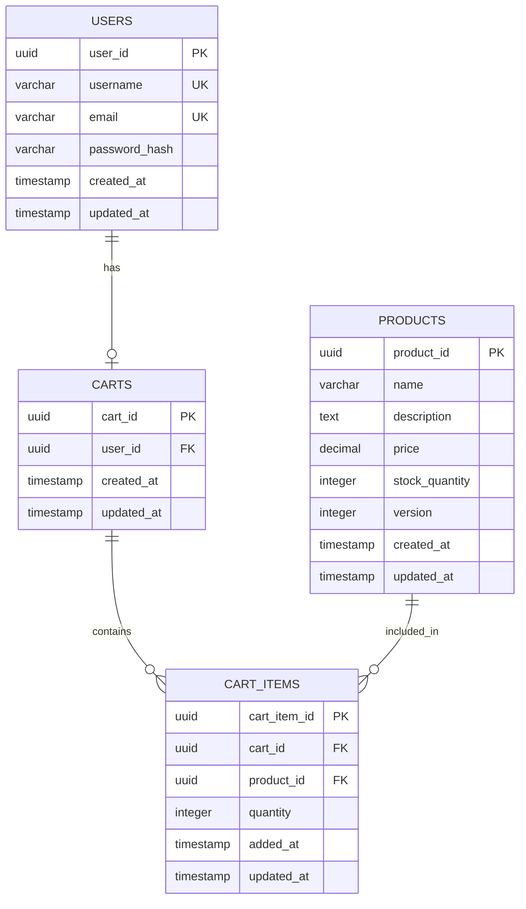

# Low Level Design (LLD) - Shopping Cart System

## Document Information
- **Project**: Shopping Cart System
- **Ticket**: SCRUM-96
- **Version**: 2.0 (Enhanced)
- **Last Updated**: 2024

---

## Executive Summary

This Low Level Design document provides comprehensive technical specifications for the Shopping Cart System. The system enables users to manage shopping carts with products, supporting operations like adding items, updating quantities, and removing items. This enhanced version includes detailed technical artifacts including Entity-Relationship Diagrams, Sequence Diagrams, and complete Database DDL scripts.

---

## Functional Domains

### 1. User Management
- User registration and authentication
- User profile management
- Session management

### 2. Product Management
- Product catalog browsing
- Product details retrieval
- Inventory tracking with optimistic locking

### 3. Cart Management
- Lazy cart creation (cart created on first item addition)
- Add products to cart
- Update product quantities
- Remove products from cart
- View cart contents
- Clear cart

---

## Core Entities

### User Entity
- **user_id**: Unique identifier (Primary Key)
- **username**: User's login name (Unique, Not Null)
- **email**: User's email address (Unique, Not Null)
- **password_hash**: Encrypted password
- **created_at**: Account creation timestamp
- **updated_at**: Last update timestamp

### Product Entity
- **product_id**: Unique identifier (Primary Key)
- **name**: Product name (Not Null)
- **description**: Product description
- **price**: Product price (Not Null, > 0)
- **stock_quantity**: Available inventory (Not Null, >= 0)
- **version**: Optimistic locking version number
- **created_at**: Product creation timestamp
- **updated_at**: Last update timestamp

### Cart Entity
- **cart_id**: Unique identifier (Primary Key)
- **user_id**: Reference to user (Foreign Key, Unique)
- **created_at**: Cart creation timestamp
- **updated_at**: Last update timestamp

### CartItem Entity
- **cart_item_id**: Unique identifier (Primary Key)
- **cart_id**: Reference to cart (Foreign Key)
- **product_id**: Reference to product (Foreign Key)
- **quantity**: Number of items (Not Null, > 0)
- **added_at**: Item addition timestamp
- **updated_at**: Last update timestamp

---

## API Contracts

### 1. Add Item to Cart
**Endpoint**: `POST /api/carts/items`

**Request Body**:
```json
{
  "productId": "string (UUID)",
  "quantity": "integer (positive)"
}
```

**Response** (201 Created):
```json
{
  "cartItemId": "string (UUID)",
  "cartId": "string (UUID)",
  "productId": "string (UUID)",
  "quantity": "integer",
  "addedAt": "timestamp"
}
```

**Error Responses**:
- 400 Bad Request: Invalid input data
- 404 Not Found: Product not found
- 409 Conflict: Insufficient stock or optimistic locking failure
- 401 Unauthorized: User not authenticated

### 2. Update Cart Item Quantity
**Endpoint**: `PUT /api/carts/items/{cartItemId}`

**Request Body**:
```json
{
  "quantity": "integer (positive)"
}
```

**Response** (200 OK):
```json
{
  "cartItemId": "string (UUID)",
  "quantity": "integer",
  "updatedAt": "timestamp"
}
```

### 3. Remove Item from Cart
**Endpoint**: `DELETE /api/carts/items/{cartItemId}`

**Response** (204 No Content)

### 4. Get Cart Contents
**Endpoint**: `GET /api/carts`

**Response** (200 OK):
```json
{
  "cartId": "string (UUID)",
  "userId": "string (UUID)",
  "items": [
    {
      "cartItemId": "string (UUID)",
      "productId": "string (UUID)",
      "productName": "string",
      "price": "decimal",
      "quantity": "integer",
      "subtotal": "decimal"
    }
  ],
  "totalAmount": "decimal",
  "createdAt": "timestamp",
  "updatedAt": "timestamp"
}
```

### 5. Clear Cart
**Endpoint**: `DELETE /api/carts`

**Response** (204 No Content)

---

## Validation Matrix

| Field | Validation Rules | Error Message |
|-------|-----------------|---------------|
| productId | Required, Valid UUID, Must exist | "Invalid or missing product ID" |
| quantity | Required, Integer, > 0, <= stock | "Quantity must be positive and not exceed available stock" |
| cartItemId | Required, Valid UUID, Must exist, Must belong to user | "Invalid cart item or unauthorized access" |
| userId | Required, Valid UUID, Authenticated | "User authentication required" |
| price | Required, Decimal, > 0 | "Price must be positive" |
| stock_quantity | Required, Integer, >= 0 | "Stock quantity cannot be negative" |

---

## Business Rules

1. **Lazy Cart Creation**: A cart is automatically created for a user when they add their first item
2. **One Cart Per User**: Each user can have only one active cart at a time
3. **Stock Validation**: System must verify product availability before adding/updating cart items
4. **Optimistic Locking**: Product updates use version-based optimistic locking to prevent race conditions
5. **Cascade Deletion**: Deleting a cart automatically removes all associated cart items
6. **Quantity Constraints**: Cart item quantities must always be positive integers
7. **Price Consistency**: Product prices are fetched at display time to ensure current pricing

---

## Error Handling Strategy

### Optimistic Locking Conflicts
- Detect version mismatch during product updates
- Return 409 Conflict with retry suggestion
- Client should refetch product data and retry operation

### Insufficient Stock
- Validate stock before cart operations
- Return 409 Conflict with available stock information
- Suggest alternative quantity to user

### Concurrent Cart Modifications
- Use database transactions for cart operations
- Implement row-level locking where necessary
- Ensure ACID properties for all cart modifications

---

## Performance Considerations

1. **Database Indexing**: Index foreign keys (user_id, product_id, cart_id) for faster lookups
2. **Connection Pooling**: Maintain database connection pool for efficient resource usage
3. **Caching Strategy**: Consider caching product information for frequently accessed items
4. **Query Optimization**: Use JOIN operations efficiently when fetching cart with items
5. **Transaction Scope**: Keep transaction boundaries tight to minimize lock duration

---

## Security Considerations

1. **Authentication**: All cart operations require authenticated user session
2. **Authorization**: Users can only access and modify their own carts
3. **Input Validation**: Sanitize and validate all user inputs
4. **SQL Injection Prevention**: Use parameterized queries/prepared statements
5. **Rate Limiting**: Implement rate limiting on cart modification endpoints

---

# Enhanced Technical Artifacts

## 1. Entity-Relationship Diagram (ERD)

The following Mermaid ERD illustrates the database schema with all relationships, primary keys (PK), foreign keys (FK), and the version column for optimistic locking:



**Key Relationships:**
- **USERS to CARTS**: One-to-One relationship (each user has at most one cart)
- **CARTS to CART_ITEMS**: One-to-Many relationship (a cart contains multiple items)
- **PRODUCTS to CART_ITEMS**: One-to-Many relationship (a product can be in multiple carts)
- **Version Column**: The `version` column in PRODUCTS table enables optimistic locking for concurrent stock updates

---

## 2. Sequence Diagram - Add to Cart Flow

The following Mermaid sequence diagram illustrates the complete flow for adding an item to the cart, including lazy cart creation and optimistic locking exception handling:

```mermaid
sequenceDiagram
    participant Client
    participant CartController
    participant CartService
    participant ProductRepository
    participant CartRepository
    participant Database

    Client->>CartController: POST /api/carts/items {productId, quantity}
    activate CartController
    
    CartController->>CartController: Validate request (productId, quantity > 0)
    CartController->>CartService: addItemToCart(userId, productId, quantity)
    activate CartService
    
    CartService->>ProductRepository: findById(productId)
    activate ProductRepository
    ProductRepository->>Database: SELECT * FROM products WHERE product_id = ?
    activate Database
    Database-->>ProductRepository: Product data with version
    deactivate Database
    ProductRepository-->>CartService: Product entity
    deactivate ProductRepository
    
    alt Product not found
        CartService-->>CartController: throw ProductNotFoundException
        CartController-->>Client: 404 Not Found
    end
    
    CartService->>CartService: Validate stock (quantity <= stock_quantity)
    
    alt Insufficient stock
        CartService-->>CartController: throw InsufficientStockException
        CartController-->>Client: 409 Conflict {availableStock}
    end
    
    Note over CartService,CartRepository: Lazy Cart Creation
    CartService->>CartRepository: findByUserId(userId)
    activate CartRepository
    CartRepository->>Database: SELECT * FROM carts WHERE user_id = ?
    activate Database
    Database-->>CartRepository: Cart data or null
    deactivate Database
    CartRepository-->>CartService: Optional<Cart>
    deactivate CartRepository
    
    alt Cart does not exist
        CartService->>CartRepository: createCart(userId)
        activate CartRepository
        CartRepository->>Database: INSERT INTO carts (cart_id, user_id, created_at)
        activate Database
        Database-->>CartRepository: Cart created
        deactivate Database
        CartRepository-->>CartService: New Cart entity
        deactivate CartRepository
    end
    
    CartService->>CartRepository: addCartItem(cartId, productId, quantity)
    activate CartRepository
    
    CartRepository->>Database: BEGIN TRANSACTION
    activate Database
    
    Note over CartRepository,Database: Check for existing cart item
    CartRepository->>Database: SELECT * FROM cart_items WHERE cart_id = ? AND product_id = ?
    Database-->>CartRepository: Existing item or null
    
    alt Item exists
        CartRepository->>Database: UPDATE cart_items SET quantity = quantity + ?
    else Item does not exist
        CartRepository->>Database: INSERT INTO cart_items (cart_item_id, cart_id, product_id, quantity)
    end
    
    Note over CartRepository,Database: Optimistic Locking - Decrement Stock
    CartRepository->>Database: UPDATE products SET stock_quantity = stock_quantity - ?, version = version + 1 WHERE product_id = ? AND version = ?
    Database-->>CartRepository: Rows affected
    
    alt Version mismatch (rows affected = 0)
        CartRepository->>Database: ROLLBACK TRANSACTION
        Database-->>CartRepository: Transaction rolled back
        deactivate Database
        CartRepository-->>CartService: throw OptimisticLockException
        deactivate CartRepository
        CartService-->>CartController: throw OptimisticLockException
        CartController-->>Client: 409 Conflict {message: "Product was updated by another user. Please retry."}
    else Success
        CartRepository->>Database: COMMIT TRANSACTION
        Database-->>CartRepository: Transaction committed
        deactivate Database
        CartRepository-->>CartService: CartItem entity
        deactivate CartRepository
        CartService-->>CartController: CartItem DTO
        deactivate CartService
        CartController-->>Client: 201 Created {cartItemId, cartId, productId, quantity}
        deactivate CartController
    end
```

**Key Flow Points:**
1. **Request Validation**: Controller validates input parameters
2. **Product Verification**: System checks product existence and retrieves current version
3. **Stock Validation**: Ensures sufficient inventory before proceeding
4. **Lazy Cart Creation**: Cart is created automatically if it doesn't exist for the user
5. **Transactional Cart Item Addition**: Cart item is added or updated within a transaction
6. **Optimistic Locking**: Stock update includes version check to prevent race conditions
7. **Exception Handling**: Version mismatch triggers rollback and returns 409 Conflict

---

## 3. Database Model - PostgreSQL DDL Scripts

The following PostgreSQL DDL scripts define the complete database schema with all constraints, indexes, and relationships:

```sql
-- ============================================
-- Shopping Cart System - Database Schema
-- Database: PostgreSQL 12+
-- ============================================

-- Enable UUID extension
CREATE EXTENSION IF NOT EXISTS "uuid-ossp";

-- ============================================
-- Table: USERS
-- Description: Stores user account information
-- ============================================
CREATE TABLE users (
    user_id UUID PRIMARY KEY DEFAULT uuid_generate_v4(),
    username VARCHAR(50) NOT NULL UNIQUE,
    email VARCHAR(255) NOT NULL UNIQUE,
    password_hash VARCHAR(255) NOT NULL,
    created_at TIMESTAMP NOT NULL DEFAULT CURRENT_TIMESTAMP,
    updated_at TIMESTAMP NOT NULL DEFAULT CURRENT_TIMESTAMP,
    
    -- Constraints
    CONSTRAINT chk_username_length CHECK (LENGTH(username) >= 3),
    CONSTRAINT chk_email_format CHECK (email ~* '^[A-Za-z0-9._%+-]+@[A-Za-z0-9.-]+\.[A-Za-z]{2,}$')
);

-- Indexes for USERS table
CREATE INDEX idx_users_username ON users(username);
CREATE INDEX idx_users_email ON users(email);
CREATE INDEX idx_users_created_at ON users(created_at);

-- ============================================
-- Table: PRODUCTS
-- Description: Stores product catalog with optimistic locking
-- ============================================
CREATE TABLE products (
    product_id UUID PRIMARY KEY DEFAULT uuid_generate_v4(),
    name VARCHAR(255) NOT NULL,
    description TEXT,
    price DECIMAL(10, 2) NOT NULL,
    stock_quantity INTEGER NOT NULL DEFAULT 0,
    version INTEGER NOT NULL DEFAULT 0,
    created_at TIMESTAMP NOT NULL DEFAULT CURRENT_TIMESTAMP,
    updated_at TIMESTAMP NOT NULL DEFAULT CURRENT_TIMESTAMP,
    
    -- Constraints
    CONSTRAINT chk_price_positive CHECK (price > 0),
    CONSTRAINT chk_stock_non_negative CHECK (stock_quantity >= 0),
    CONSTRAINT chk_version_non_negative CHECK (version >= 0)
);

-- Indexes for PRODUCTS table
CREATE INDEX idx_products_name ON products(name);
CREATE INDEX idx_products_price ON products(price);
CREATE INDEX idx_products_stock_quantity ON products(stock_quantity);
CREATE INDEX idx_products_created_at ON products(created_at);

-- ============================================
-- Table: CARTS
-- Description: Stores shopping carts (one per user)
-- ============================================
CREATE TABLE carts (
    cart_id UUID PRIMARY KEY DEFAULT uuid_generate_v4(),
    user_id UUID NOT NULL UNIQUE,
    created_at TIMESTAMP NOT NULL DEFAULT CURRENT_TIMESTAMP,
    updated_at TIMESTAMP NOT NULL DEFAULT CURRENT_TIMESTAMP,
    
    -- Foreign Key Constraints
    CONSTRAINT fk_carts_user_id 
        FOREIGN KEY (user_id) 
        REFERENCES users(user_id) 
        ON DELETE CASCADE
);

-- Indexes for CARTS table
CREATE UNIQUE INDEX idx_carts_user_id ON carts(user_id);
CREATE INDEX idx_carts_created_at ON carts(created_at);

-- ============================================
-- Table: CART_ITEMS
-- Description: Stores items within shopping carts
-- ============================================
CREATE TABLE cart_items (
    cart_item_id UUID PRIMARY KEY DEFAULT uuid_generate_v4(),
    cart_id UUID NOT NULL,
    product_id UUID NOT NULL,
    quantity INTEGER NOT NULL,
    added_at TIMESTAMP NOT NULL DEFAULT CURRENT_TIMESTAMP,
    updated_at TIMESTAMP NOT NULL DEFAULT CURRENT_TIMESTAMP,
    
    -- Constraints
    CONSTRAINT chk_quantity_positive CHECK (quantity > 0),
    
    -- Foreign Key Constraints
    CONSTRAINT fk_cart_items_cart_id 
        FOREIGN KEY (cart_id) 
        REFERENCES carts(cart_id) 
        ON DELETE CASCADE,
    
    CONSTRAINT fk_cart_items_product_id 
        FOREIGN KEY (product_id) 
        REFERENCES products(product_id) 
        ON DELETE CASCADE,
    
    -- Unique constraint: one product per cart
    CONSTRAINT uk_cart_product UNIQUE (cart_id, product_id)
);

-- Indexes for CART_ITEMS table
CREATE INDEX idx_cart_items_cart_id ON cart_items(cart_id);
CREATE INDEX idx_cart_items_product_id ON cart_items(product_id);
CREATE INDEX idx_cart_items_added_at ON cart_items(added_at);
CREATE UNIQUE INDEX idx_cart_items_cart_product ON cart_items(cart_id, product_id);

-- ============================================
-- Triggers for automatic updated_at timestamp
-- ============================================

-- Function to update updated_at timestamp
CREATE OR REPLACE FUNCTION update_updated_at_column()
RETURNS TRIGGER AS $$
BEGIN
    NEW.updated_at = CURRENT_TIMESTAMP;
    RETURN NEW;
END;
$$ LANGUAGE plpgsql;

-- Trigger for USERS table
CREATE TRIGGER trg_users_updated_at
    BEFORE UPDATE ON users
    FOR EACH ROW
    EXECUTE FUNCTION update_updated_at_column();

-- Trigger for PRODUCTS table
CREATE TRIGGER trg_products_updated_at
    BEFORE UPDATE ON products
    FOR EACH ROW
    EXECUTE FUNCTION update_updated_at_column();

-- Trigger for CARTS table
CREATE TRIGGER trg_carts_updated_at
    BEFORE UPDATE ON carts
    FOR EACH ROW
    EXECUTE FUNCTION update_updated_at_column();

-- Trigger for CART_ITEMS table
CREATE TRIGGER trg_cart_items_updated_at
    BEFORE UPDATE ON cart_items
    FOR EACH ROW
    EXECUTE FUNCTION update_updated_at_column();

-- ============================================
-- Comments for documentation
-- ============================================

COMMENT ON TABLE users IS 'Stores user account information for authentication and authorization';
COMMENT ON TABLE products IS 'Product catalog with optimistic locking support via version column';
COMMENT ON TABLE carts IS 'Shopping carts with one-to-one relationship to users';
COMMENT ON TABLE cart_items IS 'Items within shopping carts with quantity tracking';

COMMENT ON COLUMN products.version IS 'Optimistic locking version number, incremented on each update';
COMMENT ON COLUMN products.stock_quantity IS 'Available inventory, must be non-negative';
COMMENT ON COLUMN cart_items.quantity IS 'Number of product units in cart, must be positive';

-- ============================================
-- Sample Data (Optional - for testing)
-- ============================================

-- Insert sample users
INSERT INTO users (username, email, password_hash) VALUES
    ('john_doe', 'john.doe@example.com', '$2a$10$abcdefghijklmnopqrstuvwxyz'),
    ('jane_smith', 'jane.smith@example.com', '$2a$10$zyxwvutsrqponmlkjihgfedcba');

-- Insert sample products
INSERT INTO products (name, description, price, stock_quantity, version) VALUES
    ('Laptop', 'High-performance laptop with 16GB RAM', 1299.99, 50, 0),
    ('Wireless Mouse', 'Ergonomic wireless mouse with USB receiver', 29.99, 200, 0),
    ('Mechanical Keyboard', 'RGB mechanical keyboard with blue switches', 89.99, 100, 0),
    ('USB-C Hub', '7-in-1 USB-C hub with HDMI and ethernet', 49.99, 150, 0),
    ('Monitor', '27-inch 4K IPS monitor', 399.99, 75, 0);

-- ============================================
-- Maintenance Queries
-- ============================================

-- Query to check optimistic locking conflicts
-- SELECT product_id, name, version, updated_at 
-- FROM products 
-- WHERE updated_at > NOW() - INTERVAL '1 hour'
-- ORDER BY updated_at DESC;

-- Query to find carts with items
-- SELECT c.cart_id, c.user_id, u.username, COUNT(ci.cart_item_id) as item_count
-- FROM carts c
-- JOIN users u ON c.user_id = u.user_id
-- LEFT JOIN cart_items ci ON c.cart_id = ci.cart_id
-- GROUP BY c.cart_id, c.user_id, u.username;

-- Query to check stock levels
-- SELECT product_id, name, stock_quantity
-- FROM products
-- WHERE stock_quantity < 10
-- ORDER BY stock_quantity ASC;
```

**Key DDL Features:**

1. **Primary Keys**: All tables use UUID primary keys with automatic generation
2. **Foreign Keys with CASCADE**: 
   - `carts.user_id` → `users.user_id` (ON DELETE CASCADE)
   - `cart_items.cart_id` → `carts.cart_id` (ON DELETE CASCADE)
   - `cart_items.product_id` → `products.product_id` (ON DELETE CASCADE)
3. **NOT NULL Constraints**: Applied to all required fields
4. **UNIQUE Constraints**: 
   - `users.username` and `users.email`
   - `carts.user_id` (one cart per user)
   - `cart_items(cart_id, product_id)` (one product per cart)
5. **CHECK Constraints**:
   - `products.price > 0`
   - `products.stock_quantity >= 0`
   - `cart_items.quantity > 0`
   - `users.username` length >= 3
   - `users.email` format validation
6. **Indexes**: Created on all foreign keys and frequently queried columns
7. **Optimistic Locking**: `products.version` column for concurrent update handling
8. **Automatic Timestamps**: Triggers to update `updated_at` on record modifications
9. **UUID Extension**: Enabled for UUID generation support

---

## Conclusion

This enhanced Low Level Design document provides a complete technical specification for the Shopping Cart System, including:

- Comprehensive entity definitions and relationships
- Detailed API contracts with request/response formats
- Complete validation rules and business logic
- Visual Entity-Relationship Diagram showing database structure
- Detailed Sequence Diagram illustrating the Add to Cart flow with lazy creation and optimistic locking
- Production-ready PostgreSQL DDL scripts with all constraints, indexes, and triggers

The design ensures data integrity, handles concurrent access through optimistic locking, and provides a scalable foundation for the shopping cart functionality.

---

**Document End**