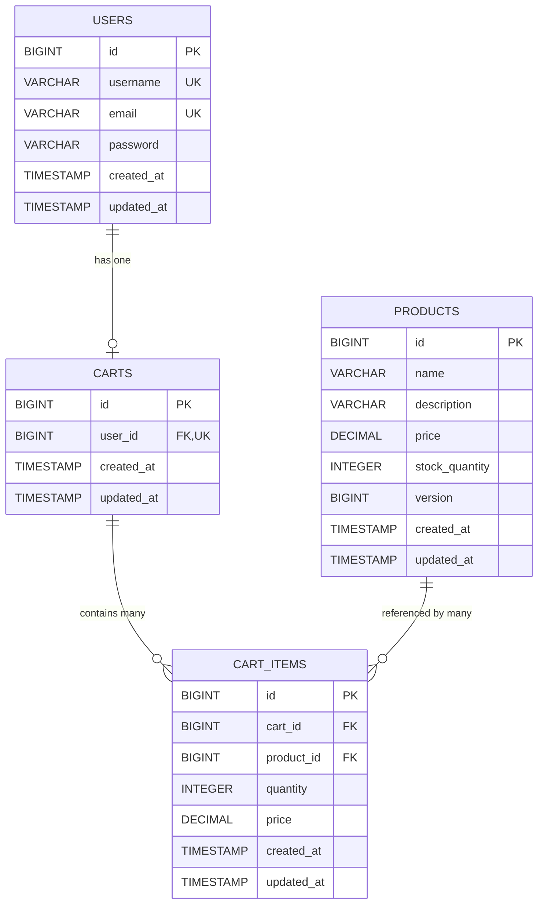

# Low Level Design (LLD) Document
## Shopping Cart System - Spring Boot MVC

---

## Executive Summary

This Low Level Design document provides a comprehensive technical specification for a Shopping Cart System built using Spring Boot MVC architecture. The system enables users to browse products, manage shopping carts, and perform cart operations through a RESTful API interface.

### Key Components:
- **Technology Stack**: Spring Boot 3.x, Spring MVC, JPA/Hibernate, PostgreSQL
- **Architecture Pattern**: MVC (Model-View-Controller)
- **API Style**: RESTful
- **Database**: PostgreSQL with optimistic locking support

---

## Detailed Analysis

### System Overview
The Shopping Cart System is designed as a microservice that handles product catalog management and shopping cart operations. It follows enterprise-grade patterns including:

- **Layered Architecture**: Clear separation between Controller, Service, and Repository layers
- **Domain-Driven Design**: Rich domain entities with business logic encapsulation
- **Optimistic Locking**: Concurrent access control using versioning
- **Lazy Initialization**: Cart creation on-demand to optimize resource usage

### Technical Decisions

1. **Optimistic Locking Strategy**: Using `@Version` annotation on Product entity to handle concurrent updates
2. **Lazy Cart Creation**: Carts are created only when users add their first item
3. **Cascade Operations**: Proper cascade configurations to maintain referential integrity
4. **Validation**: Multi-layer validation (controller and service layers)

---

## Domain Entities

### 1. User Entity

```java
package com.shoppingcart.domain;

import jakarta.persistence.*;
import jakarta.validation.constraints.*;
import lombok.*;
import java.time.LocalDateTime;
import java.util.ArrayList;
import java.util.List;

@Entity
@Table(name = "users")
@Data
@NoArgsConstructor
@AllArgsConstructor
@Builder
public class User {
    
    @Id
    @GeneratedValue(strategy = GenerationType.IDENTITY)
    private Long id;
    
    @NotBlank(message = "Username is required")
    @Size(min = 3, max = 50, message = "Username must be between 3 and 50 characters")
    @Column(nullable = false, unique = true, length = 50)
    private String username;
    
    @NotBlank(message = "Email is required")
    @Email(message = "Email must be valid")
    @Column(nullable = false, unique = true, length = 100)
    private String email;
    
    @NotBlank(message = "Password is required")
    @Size(min = 8, message = "Password must be at least 8 characters")
    @Column(nullable = false)
    private String password;
    
    @Column(name = "created_at", nullable = false, updatable = false)
    private LocalDateTime createdAt;
    
    @Column(name = "updated_at")
    private LocalDateTime updatedAt;
    
    @OneToOne(mappedBy = "user", cascade = CascadeType.ALL, orphanRemoval = true)
    private Cart cart;
    
    @PrePersist
    protected void onCreate() {
        createdAt = LocalDateTime.now();
        updatedAt = LocalDateTime.now();
    }
    
    @PreUpdate
    protected void onUpdate() {
        updatedAt = LocalDateTime.now();
    }
}
```

### 2. Product Entity

```java
package com.shoppingcart.domain;

import jakarta.persistence.*;
import jakarta.validation.constraints.*;
import lombok.*;
import java.math.BigDecimal;
import java.time.LocalDateTime;

@Entity
@Table(name = "products")
@Data
@NoArgsConstructor
@AllArgsConstructor
@Builder
public class Product {
    
    @Id
    @GeneratedValue(strategy = GenerationType.IDENTITY)
    private Long id;
    
    @NotBlank(message = "Product name is required")
    @Size(max = 200, message = "Product name cannot exceed 200 characters")
    @Column(nullable = false, length = 200)
    private String name;
    
    @Size(max = 1000, message = "Description cannot exceed 1000 characters")
    @Column(length = 1000)
    private String description;
    
    @NotNull(message = "Price is required")
    @DecimalMin(value = "0.01", message = "Price must be greater than 0")
    @Column(nullable = false, precision = 10, scale = 2)
    private BigDecimal price;
    
    @NotNull(message = "Stock quantity is required")
    @Min(value = 0, message = "Stock quantity cannot be negative")
    @Column(name = "stock_quantity", nullable = false)
    private Integer stockQuantity;
    
    @Version
    @Column(nullable = false)
    private Long version;
    
    @Column(name = "created_at", nullable = false, updatable = false)
    private LocalDateTime createdAt;
    
    @Column(name = "updated_at")
    private LocalDateTime updatedAt;
    
    @PrePersist
    protected void onCreate() {
        createdAt = LocalDateTime.now();
        updatedAt = LocalDateTime.now();
    }
    
    @PreUpdate
    protected void onUpdate() {
        updatedAt = LocalDateTime.now();
    }
    
    public boolean hasStock(int quantity) {
        return this.stockQuantity >= quantity;
    }
    
    public void decreaseStock(int quantity) {
        if (!hasStock(quantity)) {
            throw new IllegalStateException("Insufficient stock for product: " + name);
        }
        this.stockQuantity -= quantity;
    }
    
    public void increaseStock(int quantity) {
        this.stockQuantity += quantity;
    }
}
```

### 3. Cart Entity

```java
package com.shoppingcart.domain;

import jakarta.persistence.*;
import lombok.*;
import java.math.BigDecimal;
import java.time.LocalDateTime;
import java.util.ArrayList;
import java.util.List;

@Entity
@Table(name = "carts")
@Data
@NoArgsConstructor
@AllArgsConstructor
@Builder
public class Cart {
    
    @Id
    @GeneratedValue(strategy = GenerationType.IDENTITY)
    private Long id;
    
    @OneToOne
    @JoinColumn(name = "user_id", nullable = false, unique = true)
    private User user;
    
    @OneToMany(mappedBy = "cart", cascade = CascadeType.ALL, orphanRemoval = true)
    @Builder.Default
    private List<CartItem> items = new ArrayList<>();
    
    @Column(name = "created_at", nullable = false, updatable = false)
    private LocalDateTime createdAt;
    
    @Column(name = "updated_at")
    private LocalDateTime updatedAt;
    
    @PrePersist
    protected void onCreate() {
        createdAt = LocalDateTime.now();
        updatedAt = LocalDateTime.now();
    }
    
    @PreUpdate
    protected void onUpdate() {
        updatedAt = LocalDateTime.now();
    }
    
    public void addItem(CartItem item) {
        items.add(item);
        item.setCart(this);
    }
    
    public void removeItem(CartItem item) {
        items.remove(item);
        item.setCart(null);
    }
    
    public BigDecimal getTotalPrice() {
        return items.stream()
                .map(CartItem::getSubtotal)
                .reduce(BigDecimal.ZERO, BigDecimal::add);
    }
    
    public int getTotalItems() {
        return items.stream()
                .mapToInt(CartItem::getQuantity)
                .sum();
    }
    
    public void clearItems() {
        items.clear();
    }
}
```

### 4. CartItem Entity

```java
package com.shoppingcart.domain;

import jakarta.persistence.*;
import jakarta.validation.constraints.*;
import lombok.*;
import java.math.BigDecimal;
import java.time.LocalDateTime;

@Entity
@Table(name = "cart_items", 
       uniqueConstraints = @UniqueConstraint(columnNames = {"cart_id", "product_id"}))
@Data
@NoArgsConstructor
@AllArgsConstructor
@Builder
public class CartItem {
    
    @Id
    @GeneratedValue(strategy = GenerationType.IDENTITY)
    private Long id;
    
    @ManyToOne(fetch = FetchType.LAZY)
    @JoinColumn(name = "cart_id", nullable = false)
    private Cart cart;
    
    @ManyToOne(fetch = FetchType.EAGER)
    @JoinColumn(name = "product_id", nullable = false)
    private Product product;
    
    @NotNull(message = "Quantity is required")
    @Min(value = 1, message = "Quantity must be at least 1")
    @Column(nullable = false)
    private Integer quantity;
    
    @NotNull(message = "Price is required")
    @Column(nullable = false, precision = 10, scale = 2)
    private BigDecimal price;
    
    @Column(name = "created_at", nullable = false, updatable = false)
    private LocalDateTime createdAt;
    
    @Column(name = "updated_at")
    private LocalDateTime updatedAt;
    
    @PrePersist
    protected void onCreate() {
        createdAt = LocalDateTime.now();
        updatedAt = LocalDateTime.now();
    }
    
    @PreUpdate
    protected void onUpdate() {
        updatedAt = LocalDateTime.now();
    }
    
    public BigDecimal getSubtotal() {
        return price.multiply(BigDecimal.valueOf(quantity));
    }
    
    public void increaseQuantity(int amount) {
        this.quantity += amount;
    }
    
    public void decreaseQuantity(int amount) {
        if (this.quantity - amount < 1) {
            throw new IllegalArgumentException("Quantity cannot be less than 1");
        }
        this.quantity -= amount;
    }
}
```

---

## Additional Technical Artifacts

### 1. Entity-Relationship Diagram (ERD)



### 2. Sequence Diagram - Add to Cart Flow

```mermaid
sequenceDiagram
    participant Client
    participant CartController
    participant CartService
    participant ProductRepository
    participant CartRepository
    participant Database
    
    Client->>CartController: POST /api/carts/{cartId}/items
    activate CartController
    
    CartController->>CartController: Validate Request Body
    
    CartController->>CartService: addItemToCart(cartId, productId, quantity)
    activate CartService
    
    CartService->>CartRepository: findById(cartId)
    activate CartRepository
    CartRepository->>Database: SELECT * FROM carts WHERE id = ?
    activate Database
    Database-->>CartRepository: Cart data or empty
    deactivate Database
    CartRepository-->>CartService: Optional<Cart>
    deactivate CartRepository
    
    alt Cart not found
        CartService->>CartService: Create new Cart (Lazy Creation)
        CartService->>CartRepository: save(newCart)
        activate CartRepository
        CartRepository->>Database: INSERT INTO carts
        activate Database
        Database-->>CartRepository: Cart created
        deactivate Database
        CartRepository-->>CartService: Saved Cart
        deactivate CartRepository
    end
    
    CartService->>ProductRepository: findById(productId)
    activate ProductRepository
    ProductRepository->>Database: SELECT * FROM products WHERE id = ?
    activate Database
    Database-->>ProductRepository: Product data
    deactivate Database
    ProductRepository-->>CartService: Product
    deactivate ProductRepository
    
    CartService->>CartService: Check stock availability
    
    alt Insufficient stock
        CartService-->>CartController: throw InsufficientStockException
        CartController-->>Client: 400 Bad Request
    end
    
    CartService->>CartService: Check if item exists in cart
    
    alt Item exists
        CartService->>CartService: Update quantity
    else Item does not exist
        CartService->>CartService: Create new CartItem
        CartService->>CartService: cart.addItem(cartItem)
    end
    
    CartService->>ProductRepository: save(product)
    activate ProductRepository
    ProductRepository->>Database: UPDATE products SET stock_quantity = ?, version = version + 1 WHERE id = ? AND version = ?
    activate Database
    
    alt Optimistic Lock Exception
        Database-->>ProductRepository: 0 rows updated (version mismatch)
        deactivate Database
        ProductRepository-->>CartService: throw OptimisticLockException
        deactivate ProductRepository
        CartService-->>CartController: throw ConcurrentUpdateException
        CartController-->>Client: 409 Conflict
    else Success
        Database-->>ProductRepository: 1 row updated
        deactivate Database
        ProductRepository-->>CartService: Updated Product
        deactivate ProductRepository
    end
    
    CartService->>CartRepository: save(cart)
    activate CartRepository
    CartRepository->>Database: UPDATE carts / INSERT cart_items
    activate Database
    Database-->>CartRepository: Success
    deactivate Database
    CartRepository-->>CartService: Updated Cart
    deactivate CartRepository
    
    CartService-->>CartController: CartDTO
    deactivate CartService
    
    CartController-->>Client: 200 OK
    deactivate CartController
```

### 3. Database Model - PostgreSQL DDL Scripts

```sql
-- Shopping Cart System - Database Schema
-- Database: PostgreSQL 14+

-- Drop tables if they exist (for clean setup)
DROP TABLE IF EXISTS cart_items CASCADE;
DROP TABLE IF EXISTS carts CASCADE;
DROP TABLE IF EXISTS products CASCADE;
DROP TABLE IF EXISTS users CASCADE;

-- Table: USERS
CREATE TABLE users (
    id BIGSERIAL PRIMARY KEY,
    username VARCHAR(50) NOT NULL,
    email VARCHAR(100) NOT NULL,
    password VARCHAR(255) NOT NULL,
    created_at TIMESTAMP NOT NULL DEFAULT CURRENT_TIMESTAMP,
    updated_at TIMESTAMP NOT NULL DEFAULT CURRENT_TIMESTAMP,
    
    CONSTRAINT uk_users_username UNIQUE (username),
    CONSTRAINT uk_users_email UNIQUE (email),
    CONSTRAINT chk_users_username_length CHECK (LENGTH(username) >= 3)
);

-- Table: PRODUCTS
CREATE TABLE products (
    id BIGSERIAL PRIMARY KEY,
    name VARCHAR(200) NOT NULL,
    description VARCHAR(1000),
    price DECIMAL(10, 2) NOT NULL,
    stock_quantity INTEGER NOT NULL,
    version BIGINT NOT NULL DEFAULT 0,
    created_at TIMESTAMP NOT NULL DEFAULT CURRENT_TIMESTAMP,
    updated_at TIMESTAMP NOT NULL DEFAULT CURRENT_TIMESTAMP,
    
    CONSTRAINT chk_products_price_positive CHECK (price > 0),
    CONSTRAINT chk_products_stock_non_negative CHECK (stock_quantity >= 0)
);

-- Table: CARTS
CREATE TABLE carts (
    id BIGSERIAL PRIMARY KEY,
    user_id BIGINT NOT NULL,
    created_at TIMESTAMP NOT NULL DEFAULT CURRENT_TIMESTAMP,
    updated_at TIMESTAMP NOT NULL DEFAULT CURRENT_TIMESTAMP,
    
    CONSTRAINT fk_carts_user FOREIGN KEY (user_id) REFERENCES users(id) ON DELETE CASCADE,
    CONSTRAINT uk_carts_user_id UNIQUE (user_id)
);

-- Table: CART_ITEMS
CREATE TABLE cart_items (
    id BIGSERIAL PRIMARY KEY,
    cart_id BIGINT NOT NULL,
    product_id BIGINT NOT NULL,
    quantity INTEGER NOT NULL,
    price DECIMAL(10, 2) NOT NULL,
    created_at TIMESTAMP NOT NULL DEFAULT CURRENT_TIMESTAMP,
    updated_at TIMESTAMP NOT NULL DEFAULT CURRENT_TIMESTAMP,
    
    CONSTRAINT fk_cart_items_cart FOREIGN KEY (cart_id) REFERENCES carts(id) ON DELETE CASCADE,
    CONSTRAINT fk_cart_items_product FOREIGN KEY (product_id) REFERENCES products(id) ON DELETE CASCADE,
    CONSTRAINT uk_cart_items_cart_product UNIQUE (cart_id, product_id),
    CONSTRAINT chk_cart_items_quantity_positive CHECK (quantity > 0),
    CONSTRAINT chk_cart_items_price_positive CHECK (price > 0)
);

-- INDEXES for performance optimization
CREATE INDEX idx_users_email ON users(email);
CREATE INDEX idx_users_username ON users(username);
CREATE INDEX idx_products_name ON products(name);
CREATE INDEX idx_products_price ON products(price);
CREATE INDEX idx_carts_user_id ON carts(user_id);
CREATE INDEX idx_cart_items_cart_id ON cart_items(cart_id);
CREATE INDEX idx_cart_items_product_id ON cart_items(product_id);

-- Sample data for testing
INSERT INTO users (username, email, password) VALUES
('john_doe', 'john@example.com', '$2a$10$encrypted_password_hash_1'),
('jane_smith', 'jane@example.com', '$2a$10$encrypted_password_hash_2');

INSERT INTO products (name, description, price, stock_quantity) VALUES
('Laptop', 'High-performance laptop with 16GB RAM', 999.99, 50),
('Wireless Mouse', 'Ergonomic wireless mouse', 29.99, 200),
('Mechanical Keyboard', 'RGB mechanical keyboard', 89.99, 100);
```

---

**Document Version**: 1.0 Enhanced
**Last Updated**: 2024-01-15
**Status**: Complete with Technical Artifacts