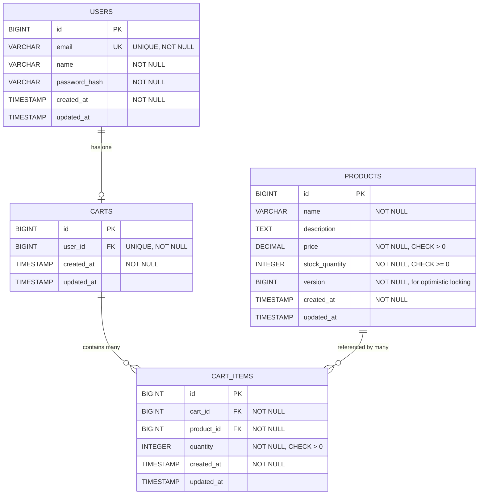
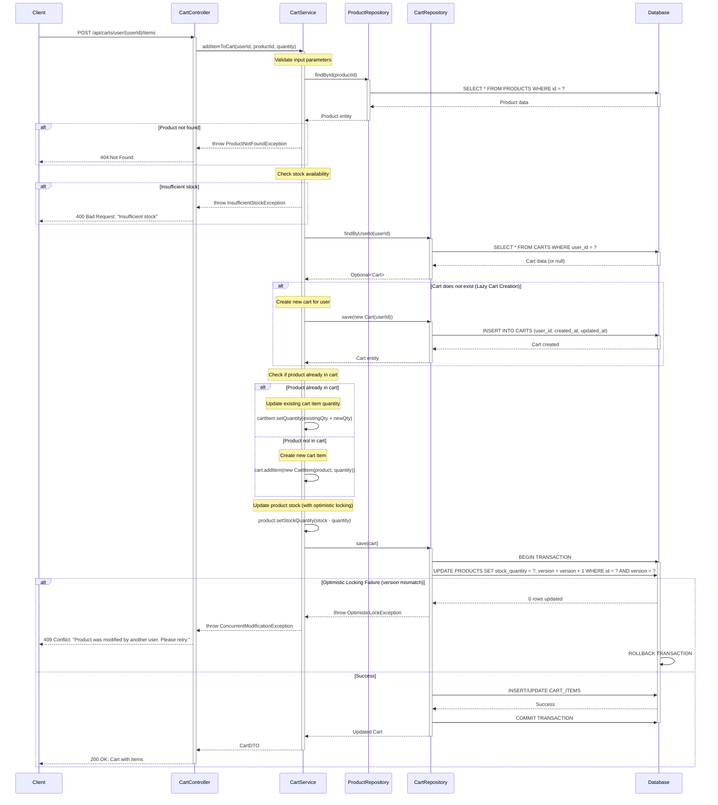

# Low Level Design (LLD) - Shopping Cart System
## SCRUM-96

---

## Executive Summary

This document provides a comprehensive Low Level Design for the Shopping Cart System (SCRUM-96). The system enables users to manage shopping carts, add/remove products, and maintain cart state across sessions. This specification includes domain entities, REST API contracts, validation rules, and technical implementation details.

### Key Features
- User authentication and cart management
- Product catalog with inventory tracking
- Cart operations (add, update, remove items)
- Optimistic locking for concurrent cart updates
- Lazy cart creation strategy

---

## Detailed Analysis

### Functional Domains

#### 1. User Management
- User registration and authentication
- User profile management
- Session management

#### 2. Product Catalog
- Product listing and search
- Product details retrieval
- Inventory management
- Price management

#### 3. Shopping Cart
- Cart creation (lazy initialization)
- Add products to cart
- Update product quantities
- Remove products from cart
- Clear cart
- View cart contents

### Business Rules

1. **Cart Creation**: Carts are created lazily when a user adds their first item
2. **Inventory Validation**: Products can only be added if sufficient inventory exists
3. **Quantity Constraints**: Cart item quantities must be positive integers (> 0)
4. **Optimistic Locking**: Product updates use version-based optimistic locking to prevent concurrent modification issues
5. **Cart Ownership**: Each cart belongs to exactly one user
6. **Cascade Deletion**: Deleting a cart automatically removes all associated cart items

### Out of Scope

- Payment processing
- Order fulfillment
- Shipping calculations
- Tax calculations
- Discount/coupon management
- Wishlist functionality
- Product recommendations

---

## Domain Entities

### 1. User Entity

```java
import javax.persistence.*;
import javax.validation.constraints.*;
import java.time.LocalDateTime;

@Entity
@Table(name = "USERS")
public class User {
    
    @Id
    @GeneratedValue(strategy = GenerationType.IDENTITY)
    private Long id;
    
    @NotNull
    @Email
    @Column(unique = true, nullable = false)
    private String email;
    
    @NotNull
    @Size(min = 2, max = 100)
    @Column(nullable = false)
    private String name;
    
    @NotNull
    @Column(nullable = false)
    private String passwordHash;
    
    @Column(name = "created_at", nullable = false, updatable = false)
    private LocalDateTime createdAt;
    
    @Column(name = "updated_at")
    private LocalDateTime updatedAt;
    
    @OneToOne(mappedBy = "user", cascade = CascadeType.ALL, orphanRemoval = true)
    private Cart cart;
    
    @PrePersist
    protected void onCreate() {
        createdAt = LocalDateTime.now();
        updatedAt = LocalDateTime.now();
    }
    
    @PreUpdate
    protected void onUpdate() {
        updatedAt = LocalDateTime.now();
    }
    
    // Getters and Setters
}
```

### 2. Product Entity

```java
import javax.persistence.*;
import javax.validation.constraints.*;
import java.math.BigDecimal;
import java.time.LocalDateTime;

@Entity
@Table(name = "PRODUCTS")
public class Product {
    
    @Id
    @GeneratedValue(strategy = GenerationType.IDENTITY)
    private Long id;
    
    @NotNull
    @Size(min = 1, max = 200)
    @Column(nullable = false)
    private String name;
    
    @Column(columnDefinition = "TEXT")
    private String description;
    
    @NotNull
    @DecimalMin(value = "0.0", inclusive = false)
    @Column(nullable = false, precision = 10, scale = 2)
    private BigDecimal price;
    
    @NotNull
    @Min(0)
    @Column(nullable = false)
    private Integer stockQuantity;
    
    @Version
    @Column(nullable = false)
    private Long version;
    
    @Column(name = "created_at", nullable = false, updatable = false)
    private LocalDateTime createdAt;
    
    @Column(name = "updated_at")
    private LocalDateTime updatedAt;
    
    @PrePersist
    protected void onCreate() {
        createdAt = LocalDateTime.now();
        updatedAt = LocalDateTime.now();
    }
    
    @PreUpdate
    protected void onUpdate() {
        updatedAt = LocalDateTime.now();
    }
    
    // Getters and Setters
}
```

### 3. Cart Entity

```java
import javax.persistence.*;
import java.time.LocalDateTime;
import java.util.ArrayList;
import java.util.List;

@Entity
@Table(name = "CARTS")
public class Cart {
    
    @Id
    @GeneratedValue(strategy = GenerationType.IDENTITY)
    private Long id;
    
    @OneToOne
    @JoinColumn(name = "user_id", nullable = false, unique = true)
    private User user;
    
    @OneToMany(mappedBy = "cart", cascade = CascadeType.ALL, orphanRemoval = true)
    private List<CartItem> items = new ArrayList<>();
    
    @Column(name = "created_at", nullable = false, updatable = false)
    private LocalDateTime createdAt;
    
    @Column(name = "updated_at")
    private LocalDateTime updatedAt;
    
    @PrePersist
    protected void onCreate() {
        createdAt = LocalDateTime.now();
        updatedAt = LocalDateTime.now();
    }
    
    @PreUpdate
    protected void onUpdate() {
        updatedAt = LocalDateTime.now();
    }
    
    public void addItem(CartItem item) {
        items.add(item);
        item.setCart(this);
    }
    
    public void removeItem(CartItem item) {
        items.remove(item);
        item.setCart(null);
    }
    
    // Getters and Setters
}
```

### 4. CartItem Entity

```java
import javax.persistence.*;
import javax.validation.constraints.*;
import java.time.LocalDateTime;

@Entity
@Table(name = "CART_ITEMS", 
       uniqueConstraints = @UniqueConstraint(columnNames = {"cart_id", "product_id"}))
public class CartItem {
    
    @Id
    @GeneratedValue(strategy = GenerationType.IDENTITY)
    private Long id;
    
    @ManyToOne(fetch = FetchType.LAZY)
    @JoinColumn(name = "cart_id", nullable = false)
    private Cart cart;
    
    @ManyToOne(fetch = FetchType.LAZY)
    @JoinColumn(name = "product_id", nullable = false)
    private Product product;
    
    @NotNull
    @Min(1)
    @Column(nullable = false)
    private Integer quantity;
    
    @Column(name = "created_at", nullable = false, updatable = false)
    private LocalDateTime createdAt;
    
    @Column(name = "updated_at")
    private LocalDateTime updatedAt;
    
    @PrePersist
    protected void onCreate() {
        createdAt = LocalDateTime.now();
        updatedAt = LocalDateTime.now();
    }
    
    @PreUpdate
    protected void onUpdate() {
        updatedAt = LocalDateTime.now();
    }
    
    // Getters and Setters
}
```

---

# Technical Artifacts

## 1. Entity-Relationship Diagram (ERD)



## 2. Sequence Diagram - Add to Cart Flow



## 3. Database Model (PostgreSQL DDL)

```sql
-- Shopping Cart System - Database Schema
-- PostgreSQL DDL Scripts

-- Drop tables if they exist (for clean setup)
DROP TABLE IF EXISTS CART_ITEMS CASCADE;
DROP TABLE IF EXISTS CARTS CASCADE;
DROP TABLE IF EXISTS PRODUCTS CASCADE;
DROP TABLE IF EXISTS USERS CASCADE;

-- Table: USERS
CREATE TABLE USERS (
    id BIGSERIAL PRIMARY KEY,
    email VARCHAR(255) NOT NULL UNIQUE,
    name VARCHAR(100) NOT NULL,
    password_hash VARCHAR(255) NOT NULL,
    created_at TIMESTAMP NOT NULL DEFAULT CURRENT_TIMESTAMP,
    updated_at TIMESTAMP DEFAULT CURRENT_TIMESTAMP,
    
    CONSTRAINT users_email_check CHECK (email ~* '^[A-Za-z0-9._%+-]+@[A-Za-z0-9.-]+\.[A-Za-z]{2,}$'),
    CONSTRAINT users_name_check CHECK (LENGTH(name) >= 2)
);

-- Table: PRODUCTS
CREATE TABLE PRODUCTS (
    id BIGSERIAL PRIMARY KEY,
    name VARCHAR(200) NOT NULL,
    description TEXT,
    price DECIMAL(10, 2) NOT NULL,
    stock_quantity INTEGER NOT NULL,
    version BIGINT NOT NULL DEFAULT 0,
    created_at TIMESTAMP NOT NULL DEFAULT CURRENT_TIMESTAMP,
    updated_at TIMESTAMP DEFAULT CURRENT_TIMESTAMP,
    
    CONSTRAINT products_price_check CHECK (price > 0),
    CONSTRAINT products_stock_check CHECK (stock_quantity >= 0),
    CONSTRAINT products_name_check CHECK (LENGTH(name) >= 1)
);

-- Table: CARTS
CREATE TABLE CARTS (
    id BIGSERIAL PRIMARY KEY,
    user_id BIGINT NOT NULL UNIQUE,
    created_at TIMESTAMP NOT NULL DEFAULT CURRENT_TIMESTAMP,
    updated_at TIMESTAMP DEFAULT CURRENT_TIMESTAMP,
    
    CONSTRAINT fk_carts_user_id 
        FOREIGN KEY (user_id) 
        REFERENCES USERS(id) 
        ON DELETE CASCADE
        ON UPDATE CASCADE
);

-- Table: CART_ITEMS
CREATE TABLE CART_ITEMS (
    id BIGSERIAL PRIMARY KEY,
    cart_id BIGINT NOT NULL,
    product_id BIGINT NOT NULL,
    quantity INTEGER NOT NULL,
    created_at TIMESTAMP NOT NULL DEFAULT CURRENT_TIMESTAMP,
    updated_at TIMESTAMP DEFAULT CURRENT_TIMESTAMP,
    
    CONSTRAINT cart_items_quantity_check CHECK (quantity > 0),
    CONSTRAINT uk_cart_items_cart_product UNIQUE (cart_id, product_id),
    
    CONSTRAINT fk_cart_items_cart_id 
        FOREIGN KEY (cart_id) 
        REFERENCES CARTS(id) 
        ON DELETE CASCADE
        ON UPDATE CASCADE,
    
    CONSTRAINT fk_cart_items_product_id 
        FOREIGN KEY (product_id) 
        REFERENCES PRODUCTS(id) 
        ON DELETE CASCADE
        ON UPDATE CASCADE
);

-- Indexes
CREATE UNIQUE INDEX idx_users_email ON USERS(email);
CREATE INDEX idx_users_created_at ON USERS(created_at);
CREATE INDEX idx_products_name ON PRODUCTS(name);
CREATE INDEX idx_products_price ON PRODUCTS(price);
CREATE INDEX idx_products_stock_quantity ON PRODUCTS(stock_quantity);
CREATE UNIQUE INDEX idx_carts_user_id ON CARTS(user_id);
CREATE INDEX idx_cart_items_cart_id ON CART_ITEMS(cart_id);
CREATE INDEX idx_cart_items_product_id ON CART_ITEMS(product_id);
CREATE UNIQUE INDEX idx_cart_items_cart_product ON CART_ITEMS(cart_id, product_id);

-- Sample Data
INSERT INTO USERS (email, name, password_hash) VALUES
('john.doe@example.com', 'John Doe', '$2a$10$abcdefghijklmnopqrstuvwxyz123456'),
('jane.smith@example.com', 'Jane Smith', '$2a$10$abcdefghijklmnopqrstuvwxyz789012');

INSERT INTO PRODUCTS (name, description, price, stock_quantity, version) VALUES
('Laptop', 'High-performance laptop with 16GB RAM', 999.99, 50, 0),
('Wireless Mouse', 'Ergonomic wireless mouse', 29.99, 200, 0),
('USB-C Cable', '2-meter USB-C charging cable', 12.99, 500, 0);
```

---

## End of Enhanced Low Level Design Document

**Document Version**: 1.1  
**Last Updated**: 2024-01-15  
**Status**: Enhanced with Technical Artifacts  
**JIRA Ticket**: SCRUM-96