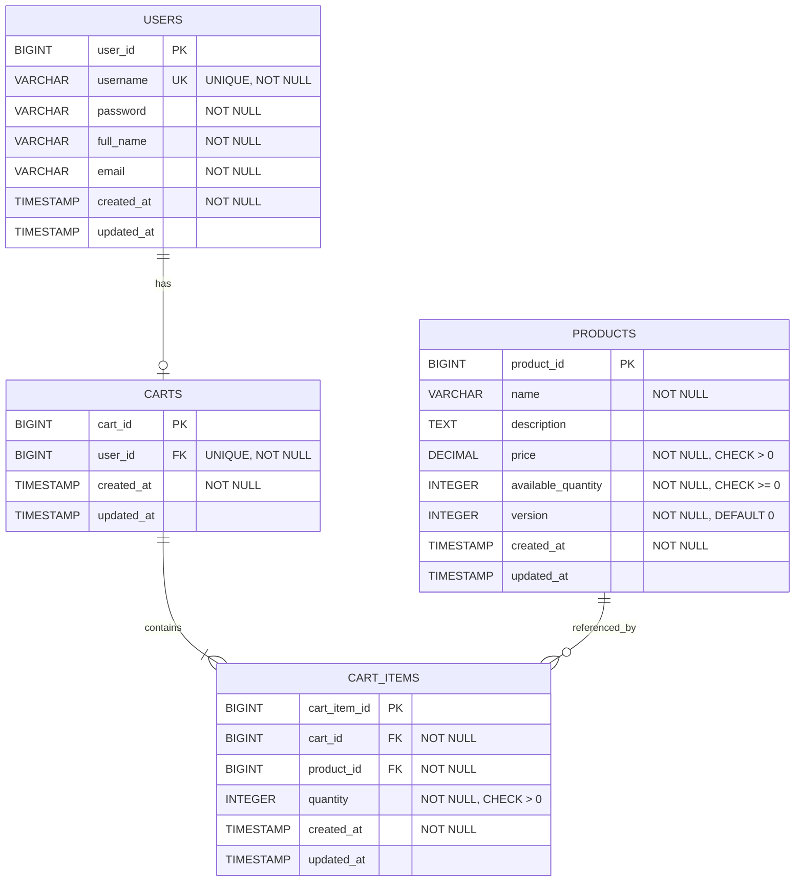
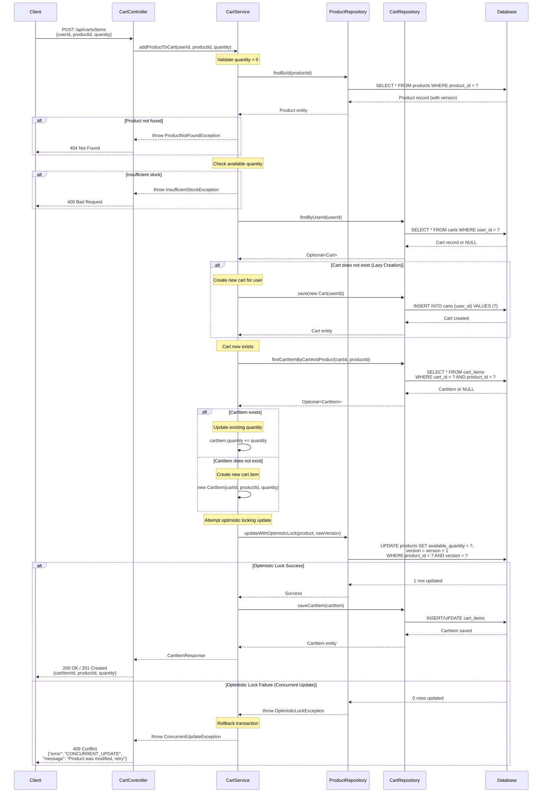

# COMPREHENSIVE BACKEND ENGINEERING SPECIFICATION PACKAGE
## Shopping Cart Backend Services - Spring Boot MVC Implementation

---

## EXECUTIVE SUMMARY

### Project Overview
This document provides a complete Low-Level Design (LLD) specification for implementing core shopping cart backend services using Java Spring Boot MVC architecture. The system supports user management, product search, and shopping cart operations with strict business rules enforced at both service and database levels.

### Key Highlights
- **Architecture**: Spring Boot MVC (Controller → Service → Repository)
- **Persistence**: Relational Database with database-first validation
- **API Style**: RESTful APIs
- **Authentication**: Stateless (no session persistence at DB level)
- **Cart Lifecycle**: Lazy creation, automatic cleanup on logout and empty cart
- **Scope**: User management, product search, cart operations (checkout/payments excluded)

### Critical Business Rules
1. Cart does not persist across logout (stateless sessions)
2. Cart auto-creates only when first product is added (lazy initialization)
3. Empty carts are automatically deleted
4. Username uniqueness enforced at database level
5. All quantities must be greater than zero
6. One active cart per user maximum

---

## DETAILED ANALYSIS

### 1. INITIAL ASSESSMENT

#### 1.1 Functional Domains Identified
Based on the Jira story analysis, the following functional domains have been extracted:

**Domain 1: User Management**
- User Registration (Sign-Up)
- User Authentication (Sign-In)
- Profile Viewing
- Profile Updates
- User Logout

**Domain 2: Product Catalog**
- Product Search

**Domain 3: Shopping Cart Management**
- Cart Creation (Lazy)
- Add Product to Cart
- Update Cart Item Quantity
- Remove Product from Cart
- View Cart
- Cart Cleanup (Auto-delete empty cart)
- Cart Cleanup on Logout

#### 1.2 Out-of-Scope Items
The following functionalities are explicitly excluded:
- Checkout process
- Payment processing
- Inventory locking/reservation
- Admin management interfaces
- Password change/reset functionality
- User roles and permissions
- Cart persistence across sessions
- Order management

#### 1.3 Explicit Business Rules & Guardrails

**User Rules:**
- Username must be unique (database constraint)
- User must exist before any cart operation
- Username is immutable after creation
- Password changes are out of scope

**Cart Rules:**
- One active cart per user
- Cart belongs to exactly one user
- Cart cannot exist without at least one cart item
- No cart exists by default (lazy creation)
- Cart auto-creates when first product is added
- Cart and all items deleted on logout
- Empty carts are automatically deleted

**Cart Item Rules:**
- Each cart item belongs to one cart
- Product must exist before adding to cart
- Quantity must be greater than zero
- Quantity can increase or decrease but must remain > 0

**Product Rules:**
- Product must exist to be searchable
- Price cannot be modified through user actions
- Product search is case-insensitive

**System-Level Rules:**
- Seed users must not automatically receive carts
- Login is stateless at DB level (no session data stored)
- All business rules must be verifiable through database state
- APIs must reflect database outcomes

---

### 2. DOMAIN MODEL

#### 2.1 Domain Entities and Attributes

**Entity: User**
```
Table: users

Attributes:
- user_id: Long (Primary Key, Auto-generated)
- username: String (Unique, Not Null, Immutable)
- password: String (Not Null, Encrypted/Hashed)
- full_name: String (Not Null, Updatable)
- email: String (Not Null, Updatable)
- created_at: Timestamp (Auto-generated, Not Null)
- updated_at: Timestamp (Auto-updated)

Constraints:
- UNIQUE(username)
- NOT NULL on username, password, full_name, email
```

**Entity: Product**
```
Table: products

Attributes:
- product_id: Long (Primary Key, Auto-generated)
- name: String (Not Null)
- description: String (Nullable)
- price: Decimal(10,2) (Not Null, > 0)
- available_quantity: Integer (Not Null, >= 0)
- created_at: Timestamp (Auto-generated)
- updated_at: Timestamp (Auto-updated)

Constraints:
- NOT NULL on name, price, available_quantity
- CHECK(price > 0)
- CHECK(available_quantity >= 0)
```

**Entity: Cart**
```
Table: carts

Attributes:
- cart_id: Long (Primary Key, Auto-generated)
- user_id: Long (Foreign Key → users.user_id, Unique, Not Null)
- created_at: Timestamp (Auto-generated)
- updated_at: Timestamp (Auto-updated)

Constraints:
- FOREIGN KEY(user_id) REFERENCES users(user_id) ON DELETE CASCADE
- UNIQUE(user_id) -- One cart per user
- NOT NULL on user_id
```

**Entity: CartItem**
```
Table: cart_items

Attributes:
- cart_item_id: Long (Primary Key, Auto-generated)
- cart_id: Long (Foreign Key → carts.cart_id, Not Null)
- product_id: Long (Foreign Key → products.product_id, Not Null)
- quantity: Integer (Not Null, > 0)
- created_at: Timestamp (Auto-generated)
- updated_at: Timestamp (Auto-updated)

Constraints:
- FOREIGN KEY(cart_id) REFERENCES carts(cart_id) ON DELETE CASCADE
- FOREIGN KEY(product_id) REFERENCES products(product_id)
- UNIQUE(cart_id, product_id) -- One product per cart
- CHECK(quantity > 0)
- NOT NULL on cart_id, product_id, quantity
```

#### 2.2 Entity Relationships
```
User (1) ←→ (0..1) Cart
Cart (1) ←→ (1..*) CartItem
Product (1) ←→ (0..*) CartItem
```

**Relationship Rules:**
- A User can have zero or one Cart (lazy creation)
- A Cart must belong to exactly one User
- A Cart must have at least one CartItem (enforced at service layer)
- A CartItem belongs to exactly one Cart
- A CartItem references exactly one Product
- A Product can be referenced by zero or many CartItems

---

### 3. REST API CONTRACTS

#### 3.1 User Management APIs

**API 1: User Sign-Up**
```
Endpoint: POST /api/users/signup
Description: Register a new user

Request Body:
{
  "username": "string (required, 3-50 chars, alphanumeric + underscore)",
  "password": "string (required, min 8 chars)",
  "fullName": "string (required, 1-100 chars)",
  "email": "string (required, valid email format)"
}

Success Response (201 Created):
{
  "userId": "long",
  "username": "string",
  "fullName": "string",
  "email": "string",
  "createdAt": "timestamp"
}

Error Responses:
- 400 Bad Request: Invalid input (missing fields, invalid format)
  {
    "error": "VALIDATION_ERROR",
    "message": "Username must be 3-50 alphanumeric characters",
    "field": "username"
  }

- 409 Conflict: Username already exists
  {
    "error": "USERNAME_EXISTS",
    "message": "Username already taken"
  }

Validations:
- username: required, 3-50 chars, alphanumeric + underscore, unique
- password: required, min 8 chars
- fullName: required, 1-100 chars
- email: required, valid email format

Business Logic:
1. Validate all input fields
2. Check username uniqueness
3. Hash password (BCrypt)
4. Create user record in database
5. Return user details (exclude password)

Database Effects:
- INSERT into users table
- Trigger: set created_at, updated_at
```

---

## TECHNICAL ARTIFACTS

### 1. ENTITY-RELATIONSHIP DIAGRAM (ERD)

The following Mermaid ERD illustrates the complete database schema with all entities, attributes, primary keys (PK), foreign keys (FK), and relationships:



**Key ERD Features:**
- **Primary Keys (PK)**: All entities have auto-generated BIGINT primary keys
- **Foreign Keys (FK)**: 
  - `CARTS.user_id` references `USERS.user_id` (ONE-TO-ONE)
  - `CART_ITEMS.cart_id` references `CARTS.cart_id` (ONE-TO-MANY)
  - `CART_ITEMS.product_id` references `PRODUCTS.product_id` (MANY-TO-ONE)
- **Unique Constraints**: 
  - `USERS.username` (business rule: unique usernames)
  - `CARTS.user_id` (business rule: one cart per user)
  - `CART_ITEMS(cart_id, product_id)` (business rule: one product per cart)
- **Version Column**: `PRODUCTS.version` for optimistic locking to handle concurrent updates
- **Cascade Rules**: ON DELETE CASCADE for cart and cart_items relationships

---

### 2. SEQUENCE DIAGRAM - ADD TO CART FLOW

The following Mermaid sequence diagram illustrates the complete "Add to Cart" operation, including lazy cart creation and optimistic locking exception handling:



**Key Sequence Diagram Features:**
- **Lazy Cart Creation**: Cart is created only when the first product is added (if cart doesn't exist)
- **Optimistic Locking**: Uses version column in PRODUCTS table to detect concurrent modifications
- **Exception Handling**: Explicit handling of:
  - Product not found (404)
  - Insufficient stock (400)
  - Concurrent update/optimistic lock failure (409)
- **Transaction Boundaries**: Implicit transaction management ensures atomicity
- **Participants**: All architectural layers from Client to Database

---

### 3. DATABASE MODEL - SQL DDL SCRIPTS

The following PostgreSQL DDL scripts define the complete database schema with all constraints, indexes, and relationships:

```sql
-- ============================================
-- SHOPPING CART DATABASE SCHEMA
-- PostgreSQL DDL Scripts
-- ============================================

-- Drop existing tables (for clean setup)
DROP TABLE IF EXISTS cart_items CASCADE;
DROP TABLE IF EXISTS carts CASCADE;
DROP TABLE IF EXISTS products CASCADE;
DROP TABLE IF EXISTS users CASCADE;

-- ============================================
-- TABLE: users
-- Description: Stores user account information
-- ============================================
CREATE TABLE users (
    user_id BIGSERIAL PRIMARY KEY,
    username VARCHAR(50) NOT NULL,
    password VARCHAR(255) NOT NULL,
    full_name VARCHAR(100) NOT NULL,
    email VARCHAR(100) NOT NULL,
    created_at TIMESTAMP NOT NULL DEFAULT CURRENT_TIMESTAMP,
    updated_at TIMESTAMP DEFAULT CURRENT_TIMESTAMP,
    
    -- Constraints
    CONSTRAINT uk_users_username UNIQUE (username),
    CONSTRAINT chk_users_username_length CHECK (LENGTH(username) >= 3),
    CONSTRAINT chk_users_email_format CHECK (email ~* '^[A-Za-z0-9._%+-]+@[A-Za-z0-9.-]+\.[A-Za-z]{2,}$')
);

-- Index for username lookups (login)
CREATE INDEX idx_users_username ON users(username);

-- Index for email lookups
CREATE INDEX idx_users_email ON users(email);

COMMENT ON TABLE users IS 'User account information for authentication and profile management';
COMMENT ON COLUMN users.username IS 'Unique username, immutable after creation';
COMMENT ON COLUMN users.password IS 'BCrypt hashed password';

-- ============================================
-- TABLE: products
-- Description: Product catalog with inventory
-- ============================================
CREATE TABLE products (
    product_id BIGSERIAL PRIMARY KEY,
    name VARCHAR(200) NOT NULL,
    description TEXT,
    price DECIMAL(10, 2) NOT NULL,
    available_quantity INTEGER NOT NULL,
    version INTEGER NOT NULL DEFAULT 0,
    created_at TIMESTAMP NOT NULL DEFAULT CURRENT_TIMESTAMP,
    updated_at TIMESTAMP DEFAULT CURRENT_TIMESTAMP,
    
    -- Constraints
    CONSTRAINT chk_products_price_positive CHECK (price > 0),
    CONSTRAINT chk_products_quantity_non_negative CHECK (available_quantity >= 0),
    CONSTRAINT chk_products_version_non_negative CHECK (version >= 0)
);

-- Index for product name search (case-insensitive)
CREATE INDEX idx_products_name_lower ON products(LOWER(name));

-- Index for price range queries
CREATE INDEX idx_products_price ON products(price);

-- Index for available products
CREATE INDEX idx_products_available ON products(available_quantity) WHERE available_quantity > 0;

COMMENT ON TABLE products IS 'Product catalog with pricing and inventory information';
COMMENT ON COLUMN products.version IS 'Optimistic locking version for concurrent update control';
COMMENT ON COLUMN products.available_quantity IS 'Current stock level, must be non-negative';

-- ============================================
-- TABLE: carts
-- Description: Shopping carts (one per user)
-- ============================================
CREATE TABLE carts (
    cart_id BIGSERIAL PRIMARY KEY,
    user_id BIGINT NOT NULL,
    created_at TIMESTAMP NOT NULL DEFAULT CURRENT_TIMESTAMP,
    updated_at TIMESTAMP DEFAULT CURRENT_TIMESTAMP,
    
    -- Foreign Key Constraints
    CONSTRAINT fk_carts_user_id 
        FOREIGN KEY (user_id) 
        REFERENCES users(user_id) 
        ON DELETE CASCADE,
    
    -- Unique Constraint: One cart per user
    CONSTRAINT uk_carts_user_id UNIQUE (user_id)
);

-- Index for user_id lookups (frequently accessed)
CREATE INDEX idx_carts_user_id ON carts(user_id);

COMMENT ON TABLE carts IS 'Shopping carts with lazy creation and one-to-one user relationship';
COMMENT ON CONSTRAINT fk_carts_user_id ON carts IS 'Cascade delete: cart deleted when user is deleted';
COMMENT ON CONSTRAINT uk_carts_user_id ON carts IS 'Business rule: one active cart per user maximum';

-- ============================================
-- TABLE: cart_items
-- Description: Items within shopping carts
-- ============================================
CREATE TABLE cart_items (
    cart_item_id BIGSERIAL PRIMARY KEY,
    cart_id BIGINT NOT NULL,
    product_id BIGINT NOT NULL,
    quantity INTEGER NOT NULL,
    created_at TIMESTAMP NOT NULL DEFAULT CURRENT_TIMESTAMP,
    updated_at TIMESTAMP DEFAULT CURRENT_TIMESTAMP,
    
    -- Foreign Key Constraints
    CONSTRAINT fk_cart_items_cart_id 
        FOREIGN KEY (cart_id) 
        REFERENCES carts(cart_id) 
        ON DELETE CASCADE,
    
    CONSTRAINT fk_cart_items_product_id 
        FOREIGN KEY (product_id) 
        REFERENCES products(product_id),
    
    -- Unique Constraint: One product per cart
    CONSTRAINT uk_cart_items_cart_product UNIQUE (cart_id, product_id),
    
    -- Check Constraint: Quantity must be positive
    CONSTRAINT chk_cart_items_quantity_positive CHECK (quantity > 0)
);

-- Index for cart_id lookups (view cart operation)
CREATE INDEX idx_cart_items_cart_id ON cart_items(cart_id);

-- Index for product_id lookups
CREATE INDEX idx_cart_items_product_id ON cart_items(product_id);

-- Composite index for cart-product lookups
CREATE INDEX idx_cart_items_cart_product ON cart_items(cart_id, product_id);

COMMENT ON TABLE cart_items IS 'Line items within shopping carts with quantity constraints';
COMMENT ON CONSTRAINT fk_cart_items_cart_id ON cart_items IS 'Cascade delete: items deleted when cart is deleted';
COMMENT ON CONSTRAINT uk_cart_items_cart_product ON cart_items IS 'Business rule: one product entry per cart (update quantity instead)';
COMMENT ON CONSTRAINT chk_cart_items_quantity_positive ON cart_items IS 'Business rule: quantity must always be greater than zero';

-- ============================================
-- TRIGGERS FOR AUTOMATIC TIMESTAMP UPDATES
-- ============================================

-- Function to update updated_at timestamp
CREATE OR REPLACE FUNCTION update_updated_at_column()
RETURNS TRIGGER AS $$
BEGIN
    NEW.updated_at = CURRENT_TIMESTAMP;
    RETURN NEW;
END;
$$ LANGUAGE plpgsql;

-- Trigger for users table
CREATE TRIGGER trg_users_updated_at
    BEFORE UPDATE ON users
    FOR EACH ROW
    EXECUTE FUNCTION update_updated_at_column();

-- Trigger for products table
CREATE TRIGGER trg_products_updated_at
    BEFORE UPDATE ON products
    FOR EACH ROW
    EXECUTE FUNCTION update_updated_at_column();

-- Trigger for carts table
CREATE TRIGGER trg_carts_updated_at
    BEFORE UPDATE ON carts
    FOR EACH ROW
    EXECUTE FUNCTION update_updated_at_column();

-- Trigger for cart_items table
CREATE TRIGGER trg_cart_items_updated_at
    BEFORE UPDATE ON cart_items
    FOR EACH ROW
    EXECUTE FUNCTION update_updated_at_column();

-- ============================================
-- SAMPLE DATA (OPTIONAL - FOR TESTING)
-- ============================================

-- Insert sample users
INSERT INTO users (username, password, full_name, email) VALUES
('john_doe', '$2a$10$abcdefghijklmnopqrstuvwxyz123456', 'John Doe', 'john.doe@example.com'),
('jane_smith', '$2a$10$abcdefghijklmnopqrstuvwxyz789012', 'Jane Smith', 'jane.smith@example.com');

-- Insert sample products
INSERT INTO products (name, description, price, available_quantity) VALUES
('Laptop', 'High-performance laptop with 16GB RAM', 1299.99, 50),
('Wireless Mouse', 'Ergonomic wireless mouse with USB receiver', 29.99, 200),
('Mechanical Keyboard', 'RGB mechanical keyboard with blue switches', 89.99, 100),
('USB-C Hub', '7-in-1 USB-C hub with HDMI and ethernet', 49.99, 150),
('Monitor', '27-inch 4K IPS monitor', 399.99, 75);

-- ============================================
-- VERIFICATION QUERIES
-- ============================================

-- Verify table creation
SELECT table_name 
FROM information_schema.tables 
WHERE table_schema = 'public' 
AND table_type = 'BASE TABLE'
ORDER BY table_name;

-- Verify constraints
SELECT 
    tc.table_name, 
    tc.constraint_name, 
    tc.constraint_type
FROM information_schema.table_constraints tc
WHERE tc.table_schema = 'public'
ORDER BY tc.table_name, tc.constraint_type;

-- Verify indexes
SELECT 
    tablename, 
    indexname, 
    indexdef
FROM pg_indexes
WHERE schemaname = 'public'
ORDER BY tablename, indexname;

-- Verify foreign key relationships
SELECT
    tc.table_name AS child_table,
    kcu.column_name AS child_column,
    ccu.table_name AS parent_table,
    ccu.column_name AS parent_column,
    rc.delete_rule
FROM information_schema.table_constraints AS tc
JOIN information_schema.key_column_usage AS kcu
    ON tc.constraint_name = kcu.constraint_name
    AND tc.table_schema = kcu.table_schema
JOIN information_schema.constraint_column_usage AS ccu
    ON ccu.constraint_name = tc.constraint_name
    AND ccu.table_schema = tc.table_schema
JOIN information_schema.referential_constraints AS rc
    ON tc.constraint_name = rc.constraint_name
WHERE tc.constraint_type = 'FOREIGN KEY'
    AND tc.table_schema = 'public'
ORDER BY tc.table_name;
```

**Key DDL Features:**

1. **Complete Table Definitions**:
   - All four core tables: `users`, `products`, `carts`, `cart_items`
   - Proper data types (BIGSERIAL for PKs, VARCHAR with limits, DECIMAL for prices)
   - NOT NULL constraints on all required fields

2. **Primary Keys**:
   - Auto-incrementing BIGSERIAL primary keys for all tables
   - Named with descriptive suffixes (_id)

3. **Foreign Keys with Cascade Rules**:
   - `carts.user_id` → `users.user_id` (ON DELETE CASCADE)
   - `cart_items.cart_id` → `carts.cart_id` (ON DELETE CASCADE)
   - `cart_items.product_id` → `products.product_id` (no cascade)

4. **Unique Constraints**:
   - `users.username` (business rule enforcement)
   - `carts.user_id` (one cart per user)
   - `cart_items(cart_id, product_id)` (one product per cart)

5. **Check Constraints**:
   - `products.price > 0` (positive prices)
   - `products.available_quantity >= 0` (non-negative stock)
   - `cart_items.quantity > 0` (positive quantities)
   - Username length validation
   - Email format validation

6. **Optimistic Locking**:
   - `products.version` column (INTEGER, DEFAULT 0)
   - Used for concurrent update detection

7. **Indexes for Performance**:
   - `idx_users_username` - Login lookups
   - `idx_products_name_lower` - Case-insensitive product search
   - `idx_carts_user_id` - Cart retrieval by user
   - `idx_cart_items_cart_id` - View cart operations
   - `idx_cart_items_product_id` - Product reference lookups
   - Composite index for cart-product lookups

8. **Automatic Timestamp Management**:
   - Triggers to auto-update `updated_at` on all tables
   - `created_at` defaults to CURRENT_TIMESTAMP

9. **Documentation**:
   - Table and column comments for clarity
   - Constraint comments explaining business rules

10. **Verification Queries**:
    - Scripts to verify table creation
    - Constraint validation queries
    - Index verification
    - Foreign key relationship checks

---

## DOCUMENT REVISION HISTORY

| Version | Date | Author | Changes |
|---------|------|--------|---------|
| 1.0 | 2024 | Engineering Team | Initial LLD document |
| 1.1 | 2024 | Documentation Agent | Added ERD, Sequence Diagram, and SQL DDL artifacts |

---

**END OF DOCUMENT**