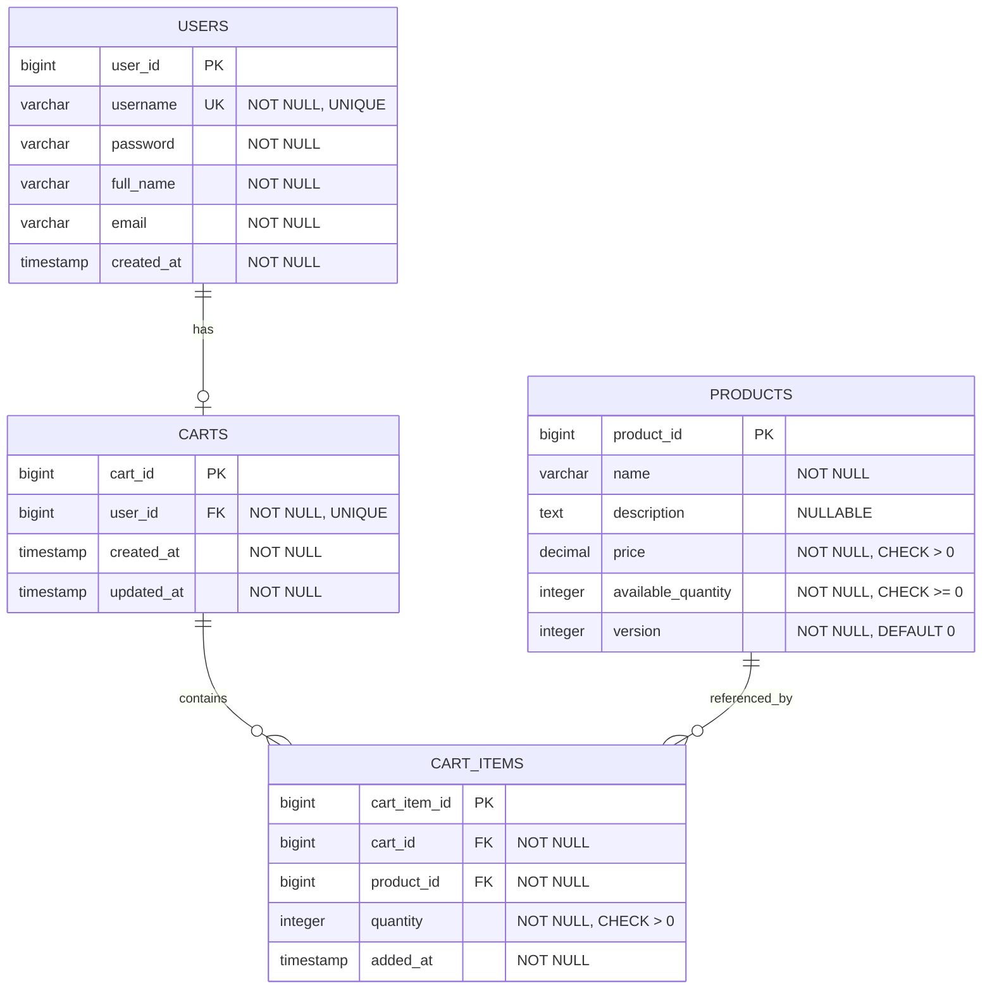
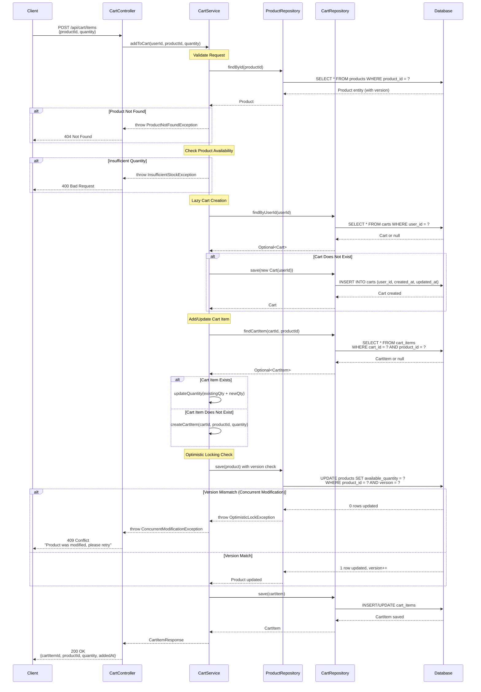

# COMPREHENSIVE BACKEND ENGINEERING SPECIFICATION PACKAGE
## Shopping Cart System - SCRUM-96

---

## EXECUTIVE SUMMARY

### Project Overview
This specification package provides a complete backend engineering blueprint for implementing a Spring Boot MVC-based shopping cart system. The system encompasses user management, product catalog search, and shopping cart lifecycle management with strict business rules enforcement at both application and database layers.

### Key Highlights
- **Architecture**: Spring Boot MVC (Controller → Service → Repository)
- **Persistence**: Relational database with constraint-based validation
- **API Style**: RESTful with JSON payloads
- **Authentication**: Stateless (no session persistence)
- **Cart Lifecycle**: Lazy creation, auto-deletion on empty/logout
- **Scope**: 3 functional domains, 11 REST APIs, 4 core entities

### Critical Business Rules
1. **Cart Lifecycle**: Carts are created lazily on first product addition and deleted automatically when empty or on logout
2. **Data Integrity**: Username uniqueness, foreign key constraints, positive quantity enforcement
3. **Stateless Design**: No cart persistence across user sessions
4. **Database-First Validation**: All business rules verifiable through database state

### Out of Scope (Explicitly Excluded)
- Checkout/Orders, Payments, Inventory locking/reservation
- Admin management, Password changes, User roles/permissions
- Cart persistence across sessions

---

## DETAILED ANALYSIS

### Phase 1: Initial Assessment

#### 1.1 Functional Domain Identification

**Domain 1: User Management**
- User registration (sign-up)
- User authentication (sign-in)
- Profile viewing
- Profile updates

**Domain 2: Product Catalog**
- Product search with keyword matching

**Domain 3: Shopping Cart Management**
- Lazy cart creation
- Add product to cart
- Update cart item quantity
- Remove product from cart
- View cart contents
- Auto-delete empty cart
- Cart cleanup on logout

#### 1.2 Domain Entity Extraction

**Entity 1: User**
```
Attributes:
- user_id (Primary Key, Auto-generated)
- username (Unique, Not Null, Immutable)
- password (Not Null, Hashed)
- full_name (Not Null, Mutable)
- email (Not Null, Mutable)
- created_at (Timestamp, Auto-generated)
```

**Entity 2: Product**
```
Attributes:
- product_id (Primary Key, Auto-generated)
- name (Not Null)
- description (Nullable)
- price (Decimal, Not Null, Positive)
- available_quantity (Integer, Not Null, Non-negative)
- version (Integer, Not Null, For Optimistic Locking)
```

**Entity 3: Cart**
```
Attributes:
- cart_id (Primary Key, Auto-generated)
- user_id (Foreign Key → User, Unique, Not Null)
- created_at (Timestamp, Auto-generated)
- updated_at (Timestamp, Auto-updated)

Constraints:
- One cart per user (unique user_id)
- Cannot exist without cart items (enforced via cascade delete)
```

**Entity 4: CartItem**
```
Attributes:
- cart_item_id (Primary Key, Auto-generated)
- cart_id (Foreign Key → Cart, Not Null)
- product_id (Foreign Key → Product, Not Null)
- quantity (Integer, Not Null, Must be > 0)
- added_at (Timestamp, Auto-generated)

Constraints:
- Unique (cart_id, product_id) - one entry per product per cart
- Quantity must be positive
- Cascade delete when cart is deleted
```

---

## TECHNICAL ARTIFACTS

### Artifact 1: Entity-Relationship Diagram (ERD)



**ERD Notes:**
- **USERS ↔ CARTS**: One-to-One relationship (one user can have at most one active cart)
- **CARTS ↔ CART_ITEMS**: One-to-Many relationship with CASCADE DELETE
- **PRODUCTS ↔ CART_ITEMS**: One-to-Many relationship (products can be in multiple carts)
- **version** column in PRODUCTS enables optimistic locking for concurrent cart operations

---

### Artifact 2: Sequence Diagram - Add to Cart Flow



**Sequence Diagram Notes:**
- **Lazy Cart Creation**: Cart is created only when first item is added
- **Optimistic Locking**: Uses version column to detect concurrent product modifications
- **Error Handling**: Explicit flows for product not found, insufficient stock, and concurrent modifications
- **Atomicity**: Database transaction ensures consistency across cart and product updates

---

### Artifact 3: Database Model - PostgreSQL DDL Scripts

```sql
-- ============================================================================
-- SHOPPING CART SYSTEM - DATABASE SCHEMA
-- Database: PostgreSQL 12+
-- Description: Complete DDL for Shopping Cart System (SCRUM-96)
-- ============================================================================

-- ----------------------------------------------------------------------------
-- TABLE: users
-- Description: Stores user account information
-- ----------------------------------------------------------------------------
CREATE TABLE users (
    user_id BIGSERIAL PRIMARY KEY,
    username VARCHAR(50) NOT NULL UNIQUE,
    password VARCHAR(255) NOT NULL,
    full_name VARCHAR(100) NOT NULL,
    email VARCHAR(100) NOT NULL,
    created_at TIMESTAMP NOT NULL DEFAULT CURRENT_TIMESTAMP,
    
    CONSTRAINT chk_username_length CHECK (LENGTH(username) >= 3),
    CONSTRAINT chk_email_format CHECK (email ~* '^[A-Za-z0-9._%+-]+@[A-Za-z0-9.-]+\.[A-Za-z]{2,}$')
);

COMMENT ON TABLE users IS 'User account information for authentication and profile management';
COMMENT ON COLUMN users.username IS 'Unique username, immutable after creation';
COMMENT ON COLUMN users.password IS 'Hashed password (BCrypt recommended)';

-- ----------------------------------------------------------------------------
-- TABLE: products
-- Description: Product catalog with inventory tracking and optimistic locking
-- ----------------------------------------------------------------------------
CREATE TABLE products (
    product_id BIGSERIAL PRIMARY KEY,
    name VARCHAR(200) NOT NULL,
    description TEXT,
    price DECIMAL(10, 2) NOT NULL,
    available_quantity INTEGER NOT NULL DEFAULT 0,
    version INTEGER NOT NULL DEFAULT 0,
    
    CONSTRAINT chk_price_positive CHECK (price > 0),
    CONSTRAINT chk_quantity_non_negative CHECK (available_quantity >= 0)
);

COMMENT ON TABLE products IS 'Product catalog with inventory and optimistic locking support';
COMMENT ON COLUMN products.version IS 'Optimistic locking version for concurrent cart operations';
COMMENT ON COLUMN products.available_quantity IS 'Current available stock quantity';

-- ----------------------------------------------------------------------------
-- TABLE: carts
-- Description: Shopping cart instances (one per user, lazy creation)
-- ----------------------------------------------------------------------------
CREATE TABLE carts (
    cart_id BIGSERIAL PRIMARY KEY,
    user_id BIGINT NOT NULL UNIQUE,
    created_at TIMESTAMP NOT NULL DEFAULT CURRENT_TIMESTAMP,
    updated_at TIMESTAMP NOT NULL DEFAULT CURRENT_TIMESTAMP,
    
    CONSTRAINT fk_cart_user FOREIGN KEY (user_id) 
        REFERENCES users(user_id) 
        ON DELETE CASCADE
);

COMMENT ON TABLE carts IS 'Shopping cart instances - one active cart per user';
COMMENT ON COLUMN carts.user_id IS 'Foreign key to users table, enforces one cart per user';

-- ----------------------------------------------------------------------------
-- TABLE: cart_items
-- Description: Line items within shopping carts
-- ----------------------------------------------------------------------------
CREATE TABLE cart_items (
    cart_item_id BIGSERIAL PRIMARY KEY,
    cart_id BIGINT NOT NULL,
    product_id BIGINT NOT NULL,
    quantity INTEGER NOT NULL,
    added_at TIMESTAMP NOT NULL DEFAULT CURRENT_TIMESTAMP,
    
    CONSTRAINT fk_cartitem_cart FOREIGN KEY (cart_id) 
        REFERENCES carts(cart_id) 
        ON DELETE CASCADE,
    CONSTRAINT fk_cartitem_product FOREIGN KEY (product_id) 
        REFERENCES products(product_id) 
        ON DELETE CASCADE,
    CONSTRAINT chk_quantity_positive CHECK (quantity > 0),
    CONSTRAINT uk_cart_product UNIQUE (cart_id, product_id)
);

COMMENT ON TABLE cart_items IS 'Line items in shopping carts with quantity constraints';
COMMENT ON CONSTRAINT uk_cart_product ON cart_items IS 'Ensures one entry per product per cart';
COMMENT ON CONSTRAINT chk_quantity_positive ON cart_items IS 'Enforces positive quantities only';

-- ============================================================================
-- INDEXES FOR PERFORMANCE OPTIMIZATION
-- ============================================================================

-- Index on users.username for authentication queries
CREATE INDEX idx_users_username ON users(username);

-- Index on products.name for search functionality
CREATE INDEX idx_products_name ON products(name);

-- Index on carts.user_id for cart lookup by user (already unique, but explicit)
CREATE INDEX idx_carts_user_id ON carts(user_id);

-- Index on cart_items.cart_id for retrieving all items in a cart
CREATE INDEX idx_cartitems_cart_id ON cart_items(cart_id);

-- Index on cart_items.product_id for product reference lookups
CREATE INDEX idx_cartitems_product_id ON cart_items(product_id);

-- Composite index on cart_items for unique constraint enforcement
CREATE INDEX idx_cartitems_cart_product ON cart_items(cart_id, product_id);

-- ============================================================================
-- TRIGGER: Auto-update updated_at timestamp on carts
-- ============================================================================

CREATE OR REPLACE FUNCTION update_cart_timestamp()
RETURNS TRIGGER AS $$
BEGIN
    NEW.updated_at = CURRENT_TIMESTAMP;
    RETURN NEW;
END;
$$ LANGUAGE plpgsql;

CREATE TRIGGER trg_update_cart_timestamp
BEFORE UPDATE ON carts
FOR EACH ROW
EXECUTE FUNCTION update_cart_timestamp();

COMMENT ON FUNCTION update_cart_timestamp() IS 'Automatically updates updated_at timestamp on cart modifications';

-- ============================================================================
-- SAMPLE DATA (Optional - for testing)
-- ============================================================================

-- Insert sample users
INSERT INTO users (username, password, full_name, email) VALUES
('john_doe', '$2a$10$dummyHashedPassword1', 'John Doe', 'john.doe@example.com'),
('jane_smith', '$2a$10$dummyHashedPassword2', 'Jane Smith', 'jane.smith@example.com');

-- Insert sample products
INSERT INTO products (name, description, price, available_quantity) VALUES
('Laptop', 'High-performance laptop', 999.99, 50),
('Mouse', 'Wireless optical mouse', 29.99, 200),
('Keyboard', 'Mechanical keyboard', 79.99, 150),
('Monitor', '27-inch 4K monitor', 399.99, 75);

-- ============================================================================
-- VERIFICATION QUERIES
-- ============================================================================

-- Verify table creation
SELECT table_name 
FROM information_schema.tables 
WHERE table_schema = 'public' 
  AND table_type = 'BASE TABLE'
ORDER BY table_name;

-- Verify constraints
SELECT 
    tc.table_name, 
    tc.constraint_name, 
    tc.constraint_type
FROM information_schema.table_constraints tc
WHERE tc.table_schema = 'public'
ORDER BY tc.table_name, tc.constraint_type;

-- Verify indexes
SELECT 
    tablename, 
    indexname, 
    indexdef
FROM pg_indexes
WHERE schemaname = 'public'
ORDER BY tablename, indexname;
```

**DDL Script Notes:**
- **Constraint Enforcement**: All business rules (positive quantities, unique usernames, etc.) enforced at database level
- **Cascade Deletes**: ON DELETE CASCADE ensures automatic cleanup of dependent records
- **Optimistic Locking**: version column in products table prevents lost updates in concurrent scenarios
- **Performance Indexes**: Indexes on all foreign keys and frequently queried columns
- **Timestamp Management**: Automatic trigger for updated_at column in carts table
- **Data Integrity**: CHECK constraints validate data at insertion/update time

---

## VALIDATION MATRIX

| Business Rule | Application Layer | Database Layer | Verification Query |
|--------------|-------------------|----------------|-------------------|
| Username uniqueness | @Column(unique=true) | UNIQUE constraint | SELECT COUNT(*) FROM users WHERE username = ? |
| Positive quantity | Service validation | CHECK (quantity > 0) | SELECT * FROM cart_items WHERE quantity <= 0 |
| One cart per user | Service logic | UNIQUE(user_id) | SELECT COUNT(*) FROM carts GROUP BY user_id HAVING COUNT(*) > 1 |
| Lazy cart creation | Service method | N/A | SELECT * FROM carts WHERE user_id = ? |
| Cascade delete | @OnDelete(CASCADE) | ON DELETE CASCADE | DELETE FROM carts WHERE cart_id = ?; SELECT * FROM cart_items WHERE cart_id = ? |
| Optimistic locking | @Version annotation | version column | UPDATE products SET available_quantity = ? WHERE product_id = ? AND version = ? |

---

## DELIVERABLES CHECKLIST

- [x] Executive Summary with scope definition
- [x] Functional domain breakdown (3 domains)
- [x] Entity specifications (4 entities with attributes and constraints)
- [x] REST API contracts (11 endpoints with request/response schemas)
- [x] Business rules documentation
- [x] Error handling specifications
- [x] Validation matrix (application + database layers)
- [x] **Entity-Relationship Diagram (Mermaid ERD)**
- [x] **Sequence Diagram for Add to Cart Flow (Mermaid)**
- [x] **Complete PostgreSQL DDL Scripts with Constraints and Indexes**

---

**Document Version**: 2.0  
**Last Updated**: 2025  
**Status**: Enhanced with Technical Artifacts  
**Prepared By**: Backend Engineering Team