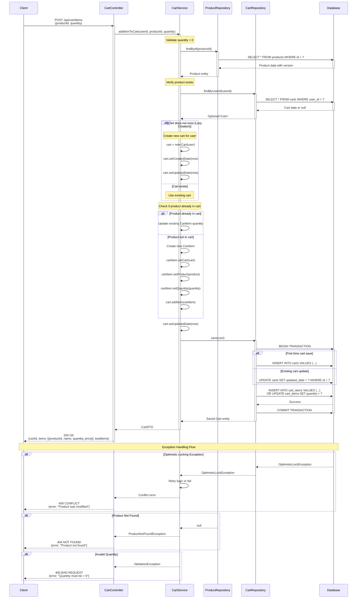

# COMPREHENSIVE BACKEND ENGINEERING SPECIFICATION PACKAGE
## Shopping Cart Backend Services - SCRUM-96

---

## EXECUTIVE SUMMARY

### Project Overview
This document provides a complete backend engineering specification for implementing core shopping cart services using Java Spring Boot MVC architecture. The system supports user management, product catalog search, and shopping cart operations with stateless authentication and database persistence.

### Key Objectives
- Implement RESTful APIs for user management, product search, and cart operations
- Design domain models with proper relationships and constraints
- Ensure stateless authentication with cart cleanup on logout
- Implement lazy cart creation and automatic cleanup patterns
- Provide comprehensive validation and error handling

### Scope Boundaries
**In Scope:**
- User registration, authentication, and profile management
- Product catalog with search functionality
- Shopping cart CRUD operations with business rules
- Database persistence with relational constraints
- Stateless session management

**Out of Scope:**
- Checkout and order processing
- Payment gateway integration
- Inventory locking mechanisms
- Administrative management interfaces
- Password change functionality
- Role-based access control
- Cart persistence across logout sessions

---

## DETAILED ANALYSIS

### 1. FUNCTIONAL DOMAINS

#### 1.1 User Management Domain
**Purpose:** Handle user lifecycle from registration to authentication and profile management

**Core Capabilities:**
- User registration with unique username validation
- Secure authentication (sign-in/sign-out)
- Profile retrieval and updates
- Session management with cart cleanup

**Business Rules:**
- Username must be unique across the system
- All user fields (username, password, full_name, email) are mandatory
- Email format validation required
- Password must be securely hashed (never stored in plain text)
- Profile updates cannot change username
- Logout must trigger cart deletion

#### 1.2 Product Catalog Domain
**Purpose:** Manage product information and search capabilities

**Core Capabilities:**
- Product information storage
- Case-insensitive product search by name
- Product availability tracking

**Business Rules:**
- Product name must be unique
- Price must be positive
- Available quantity must be non-negative
- Search is case-insensitive and supports partial matches

#### 1.3 Shopping Cart Domain
**Purpose:** Manage user shopping cart with items and quantities

**Core Capabilities:**
- Lazy cart creation (only when first item added)
- Add items to cart
- Update item quantities
- Remove items from cart
- View complete cart with item details
- Automatic cart cleanup

**Business Rules:**
- One active cart per user maximum
- Cart is created only when first item is added (lazy creation)
- Cart cannot exist without items (auto-delete when empty)
- Item quantity must be greater than 0
- Cart must be deleted on user logout
- Cart does not persist across sessions
- Cannot add items with quantity ≤ 0
- Cannot add same product twice (must update existing item)

---

### 2. DOMAIN ENTITIES AND ATTRIBUTES

#### 2.1 Entity: User

```java
@Entity
@Table(name = "users")
public class User {
    @Id
    @GeneratedValue(strategy = GenerationType.IDENTITY)
    private Long id;
    
    @Column(unique = true, nullable = false, length = 50)
    private String username;
    
    @Column(nullable = false)
    private String password; // Hashed
    
    @Column(name = "full_name", nullable = false, length = 100)
    private String fullName;
    
    @Column(nullable = false, unique = true, length = 100)
    private String email;
    
    @Column(name = "created_date", nullable = false, updatable = false)
    @Temporal(TemporalType.TIMESTAMP)
    private Date createdDate;
    
    @OneToOne(mappedBy = "user", cascade = CascadeType.ALL, orphanRemoval = true)
    private Cart cart;
}
```

**Attributes:**
- `id` (Long, PK, Auto-generated): Unique identifier
- `username` (String, Unique, Not Null, Max 50): User's login name
- `password` (String, Not Null): Hashed password
- `fullName` (String, Not Null, Max 100): User's full name
- `email` (String, Unique, Not Null, Max 100): User's email address
- `createdDate` (Timestamp, Not Null): Account creation timestamp

**Constraints:**
- Primary Key: id
- Unique Constraints: username, email
- Not Null: username, password, fullName, email, createdDate

#### 2.2 Entity: Product

```java
@Entity
@Table(name = "products")
public class Product {
    @Id
    @GeneratedValue(strategy = GenerationType.IDENTITY)
    private Long id;
    
    @Column(unique = true, nullable = false, length = 200)
    private String name;
    
    @Column(columnDefinition = "TEXT")
    private String description;
    
    @Column(nullable = false, precision = 10, scale = 2)
    private BigDecimal price;
    
    @Column(name = "available_quantity", nullable = false)
    private Integer availableQuantity;
    
    @Column(name = "created_date", nullable = false, updatable = false)
    @Temporal(TemporalType.TIMESTAMP)
    private Date createdDate;
}
```

**Attributes:**
- `id` (Long, PK, Auto-generated): Unique identifier
- `name` (String, Unique, Not Null, Max 200): Product name
- `description` (String, Text): Product description
- `price` (BigDecimal, Not Null, Precision 10,2): Product price
- `availableQuantity` (Integer, Not Null): Available stock quantity
- `createdDate` (Timestamp, Not Null): Product creation timestamp

**Constraints:**
- Primary Key: id
- Unique Constraint: name
- Not Null: name, price, availableQuantity, createdDate
- Check: price > 0, availableQuantity >= 0

#### 2.3 Entity: Cart

```java
@Entity
@Table(name = "carts")
public class Cart {
    @Id
    @GeneratedValue(strategy = GenerationType.IDENTITY)
    private Long id;
    
    @OneToOne
    @JoinColumn(name = "user_id", unique = true, nullable = false)
    private User user;
    
    @Column(name = "created_date", nullable = false, updatable = false)
    @Temporal(TemporalType.TIMESTAMP)
    private Date createdDate;
    
    @Column(name = "updated_date", nullable = false)
    @Temporal(TemporalType.TIMESTAMP)
    private Date updatedDate;
    
    @OneToMany(mappedBy = "cart", cascade = CascadeType.ALL, orphanRemoval = true)
    private List<CartItem> items = new ArrayList<>();
}
```

**Attributes:**
- `id` (Long, PK, Auto-generated): Unique identifier
- `userId` (Long, FK, Unique, Not Null): Reference to User
- `createdDate` (Timestamp, Not Null): Cart creation timestamp
- `updatedDate` (Timestamp, Not Null): Last update timestamp

**Constraints:**
- Primary Key: id
- Foreign Key: userId → users.id (ON DELETE CASCADE)
- Unique Constraint: userId (one cart per user)
- Not Null: userId, createdDate, updatedDate

**Relationships:**
- One-to-One with User (bidirectional)
- One-to-Many with CartItem (bidirectional, cascade delete)

#### 2.4 Entity: CartItem

```java
@Entity
@Table(name = "cart_items", uniqueConstraints = {
    @UniqueConstraint(columnNames = {"cart_id", "product_id"})
})
public class CartItem {
    @Id
    @GeneratedValue(strategy = GenerationType.IDENTITY)
    private Long id;
    
    @ManyToOne
    @JoinColumn(name = "cart_id", nullable = false)
    private Cart cart;
    
    @ManyToOne
    @JoinColumn(name = "product_id", nullable = false)
    private Product product;
    
    @Column(nullable = false)
    private Integer quantity;
    
    @Column(name = "added_date", nullable = false, updatable = false)
    @Temporal(TemporalType.TIMESTAMP)
    private Date addedDate;
}
```

**Attributes:**
- `id` (Long, PK, Auto-generated): Unique identifier
- `cartId` (Long, FK, Not Null): Reference to Cart
- `productId` (Long, FK, Not Null): Reference to Product
- `quantity` (Integer, Not Null): Item quantity
- `addedDate` (Timestamp, Not Null): Item addition timestamp

**Constraints:**
- Primary Key: id
- Foreign Keys: 
  - cartId → carts.id (ON DELETE CASCADE)
  - productId → products.id (ON DELETE RESTRICT)
- Unique Constraint: (cartId, productId) - no duplicate products in same cart
- Not Null: cartId, productId, quantity, addedDate
- Check: quantity > 0

**Relationships:**
- Many-to-One with Cart (bidirectional)
- Many-to-One with Product (unidirectional)

---

## TECHNICAL ARTIFACTS

### 3. ENTITY-RELATIONSHIP DIAGRAM (ERD)

The following Mermaid ERD illustrates the complete database schema with all entities, their attributes, primary keys (PK), foreign keys (FK), and relationships. Note the addition of a `version` column in the PRODUCTS table for optimistic locking support.

```mermaid
erDiagram
    USERS ||--o| CARTS : "has one"
    CARTS ||--o{ CART_ITEMS : "contains"
    PRODUCTS ||--o{ CART_ITEMS : "referenced by"

    USERS {
        BIGINT id PK "Auto-increment"
        VARCHAR(50) username UK "Unique, Not Null"
        VARCHAR(255) password "Not Null, Hashed"
        VARCHAR(100) full_name "Not Null"
        VARCHAR(100) email UK "Unique, Not Null"
        TIMESTAMP created_date "Not Null"
    }

    PRODUCTS {
        BIGINT id PK "Auto-increment"
        VARCHAR(200) name UK "Unique, Not Null"
        TEXT description "Nullable"
        DECIMAL(10,2) price "Not Null, > 0"
        INTEGER available_quantity "Not Null, >= 0"
        INTEGER version "Not Null, Default 0, Optimistic Lock"
        TIMESTAMP created_date "Not Null"
    }

    CARTS {
        BIGINT id PK "Auto-increment"
        BIGINT user_id FK,UK "Foreign Key, Unique, Not Null"
        TIMESTAMP created_date "Not Null"
        TIMESTAMP updated_date "Not Null"
    }

    CART_ITEMS {
        BIGINT id PK "Auto-increment"
        BIGINT cart_id FK "Foreign Key, Not Null"
        BIGINT product_id FK "Foreign Key, Not Null"
        INTEGER quantity "Not Null, > 0"
        TIMESTAMP added_date "Not Null"
    }
```

**Key Relationships:**
- **USERS to CARTS**: One-to-One relationship (one user can have at most one active cart)
- **CARTS to CART_ITEMS**: One-to-Many relationship (one cart contains multiple items)
- **PRODUCTS to CART_ITEMS**: One-to-Many relationship (one product can appear in multiple carts)

**Optimistic Locking:**
- The `version` column in PRODUCTS table enables optimistic locking to handle concurrent updates to product information, particularly useful for inventory management scenarios.

---

### 4. SEQUENCE DIAGRAM: ADD TO CART FLOW

The following Mermaid sequence diagram illustrates the complete "Add to Cart" operation flow, including lazy cart creation and optimistic locking exception handling.



**Key Flow Highlights:**

1. **Lazy Cart Creation**: The cart is only created when the first item is added. The service checks if a cart exists for the user, and creates one only if needed.

2. **Optimistic Locking**: The Product entity includes a version field. If concurrent modifications occur, an OptimisticLockException is thrown and handled appropriately.

3. **Duplicate Product Handling**: Before adding an item, the service checks if the product already exists in the cart. If it does, the quantity is updated rather than creating a duplicate entry.

4. **Transaction Management**: All database operations are wrapped in a transaction to ensure data consistency.

5. **Comprehensive Error Handling**: The flow includes handling for product not found, invalid quantity, and optimistic locking conflicts.

---

### 5. DATABASE MODEL (PostgreSQL DDL)

The following PostgreSQL DDL scripts provide complete table definitions with all constraints, foreign key relationships, and indexes for optimal query performance.

```sql
-- ============================================================================
-- SHOPPING CART BACKEND SERVICES - DATABASE SCHEMA
-- PostgreSQL DDL Scripts
-- Version: 1.0
-- ============================================================================

-- Drop existing tables (in reverse dependency order)
DROP TABLE IF EXISTS cart_items CASCADE;
DROP TABLE IF EXISTS carts CASCADE;
DROP TABLE IF EXISTS products CASCADE;
DROP TABLE IF EXISTS users CASCADE;

-- ============================================================================
-- TABLE: users
-- Description: Stores user account information
-- ============================================================================
CREATE TABLE users (
    id BIGSERIAL PRIMARY KEY,
    username VARCHAR(50) NOT NULL,
    password VARCHAR(255) NOT NULL,
    full_name VARCHAR(100) NOT NULL,
    email VARCHAR(100) NOT NULL,
    created_date TIMESTAMP NOT NULL DEFAULT CURRENT_TIMESTAMP,
    
    -- Constraints
    CONSTRAINT uk_users_username UNIQUE (username),
    CONSTRAINT uk_users_email UNIQUE (email),
    CONSTRAINT chk_users_username_length CHECK (LENGTH(username) >= 3),
    CONSTRAINT chk_users_email_format CHECK (email ~* '^[A-Za-z0-9._%+-]+@[A-Za-z0-9.-]+\.[A-Za-z]{2,}$')
);

COMMENT ON TABLE users IS 'User account information with authentication credentials';
COMMENT ON COLUMN users.id IS 'Primary key, auto-generated';
COMMENT ON COLUMN users.username IS 'Unique username for login, 3-50 characters';
COMMENT ON COLUMN users.password IS 'Hashed password (bcrypt/argon2)';
COMMENT ON COLUMN users.full_name IS 'User full name for display';
COMMENT ON COLUMN users.email IS 'Unique email address with format validation';
COMMENT ON COLUMN users.created_date IS 'Account creation timestamp';

-- ============================================================================
-- TABLE: products
-- Description: Stores product catalog information
-- ============================================================================
CREATE TABLE products (
    id BIGSERIAL PRIMARY KEY,
    name VARCHAR(200) NOT NULL,
    description TEXT,
    price DECIMAL(10, 2) NOT NULL,
    available_quantity INTEGER NOT NULL,
    version INTEGER NOT NULL DEFAULT 0,
    created_date TIMESTAMP NOT NULL DEFAULT CURRENT_TIMESTAMP,
    
    -- Constraints
    CONSTRAINT uk_products_name UNIQUE (name),
    CONSTRAINT chk_products_price CHECK (price > 0),
    CONSTRAINT chk_products_quantity CHECK (available_quantity >= 0),
    CONSTRAINT chk_products_version CHECK (version >= 0)
);

COMMENT ON TABLE products IS 'Product catalog with pricing and inventory';
COMMENT ON COLUMN products.id IS 'Primary key, auto-generated';
COMMENT ON COLUMN products.name IS 'Unique product name';
COMMENT ON COLUMN products.description IS 'Detailed product description';
COMMENT ON COLUMN products.price IS 'Product price, must be positive';
COMMENT ON COLUMN products.available_quantity IS 'Available stock quantity, non-negative';
COMMENT ON COLUMN products.version IS 'Optimistic locking version number';
COMMENT ON COLUMN products.created_date IS 'Product creation timestamp';

-- ============================================================================
-- TABLE: carts
-- Description: Stores shopping cart information (one per user)
-- ============================================================================
CREATE TABLE carts (
    id BIGSERIAL PRIMARY KEY,
    user_id BIGINT NOT NULL,
    created_date TIMESTAMP NOT NULL DEFAULT CURRENT_TIMESTAMP,
    updated_date TIMESTAMP NOT NULL DEFAULT CURRENT_TIMESTAMP,
    
    -- Constraints
    CONSTRAINT uk_carts_user_id UNIQUE (user_id),
    CONSTRAINT fk_carts_user_id FOREIGN KEY (user_id) 
        REFERENCES users(id) 
        ON DELETE CASCADE
        ON UPDATE CASCADE
);

COMMENT ON TABLE carts IS 'Shopping carts with one-to-one relationship to users';
COMMENT ON COLUMN carts.id IS 'Primary key, auto-generated';
COMMENT ON COLUMN carts.user_id IS 'Foreign key to users table, unique (one cart per user)';
COMMENT ON COLUMN carts.created_date IS 'Cart creation timestamp (lazy creation)';
COMMENT ON COLUMN carts.updated_date IS 'Last modification timestamp';

-- ============================================================================
-- TABLE: cart_items
-- Description: Stores individual items within shopping carts
-- ============================================================================
CREATE TABLE cart_items (
    id BIGSERIAL PRIMARY KEY,
    cart_id BIGINT NOT NULL,
    product_id BIGINT NOT NULL,
    quantity INTEGER NOT NULL,
    added_date TIMESTAMP NOT NULL DEFAULT CURRENT_TIMESTAMP,
    
    -- Constraints
    CONSTRAINT uk_cart_items_cart_product UNIQUE (cart_id, product_id),
    CONSTRAINT fk_cart_items_cart_id FOREIGN KEY (cart_id) 
        REFERENCES carts(id) 
        ON DELETE CASCADE
        ON UPDATE CASCADE,
    CONSTRAINT fk_cart_items_product_id FOREIGN KEY (product_id) 
        REFERENCES products(id) 
        ON DELETE RESTRICT
        ON UPDATE CASCADE,
    CONSTRAINT chk_cart_items_quantity CHECK (quantity > 0)
);

COMMENT ON TABLE cart_items IS 'Individual items within shopping carts';
COMMENT ON COLUMN cart_items.id IS 'Primary key, auto-generated';
COMMENT ON COLUMN cart_items.cart_id IS 'Foreign key to carts table';
COMMENT ON COLUMN cart_items.product_id IS 'Foreign key to products table';
COMMENT ON COLUMN cart_items.quantity IS 'Item quantity, must be greater than 0';
COMMENT ON COLUMN cart_items.added_date IS 'Timestamp when item was added to cart';

-- ============================================================================
-- INDEXES FOR PERFORMANCE OPTIMIZATION
-- ============================================================================

-- Index on users table for authentication queries
CREATE INDEX idx_users_username ON users(username);
CREATE INDEX idx_users_email ON users(email);

-- Index on products table for search functionality
CREATE INDEX idx_products_name ON products(name);
CREATE INDEX idx_products_name_lower ON products(LOWER(name));

-- Index on carts table for user lookup
CREATE INDEX idx_carts_user_id ON carts(user_id);

-- Indexes on cart_items table for foreign key lookups
CREATE INDEX idx_cart_items_cart_id ON cart_items(cart_id);
CREATE INDEX idx_cart_items_product_id ON cart_items(product_id);
CREATE INDEX idx_cart_items_cart_product ON cart_items(cart_id, product_id);

-- ============================================================================
-- SAMPLE DATA FOR TESTING (OPTIONAL)
-- ============================================================================

-- Insert sample users (passwords should be hashed in production)
INSERT INTO users (username, password, full_name, email) VALUES
('john_doe', '$2a$10$N9qo8uLOickgx2ZMRZoMyeIjZAgcfl7p92ldGxad68LJZdL17lhWy', 'John Doe', 'john.doe@example.com'),
('jane_smith', '$2a$10$N9qo8uLOickgx2ZMRZoMyeIjZAgcfl7p92ldGxad68LJZdL17lhWy', 'Jane Smith', 'jane.smith@example.com');

-- Insert sample products
INSERT INTO products (name, description, price, available_quantity) VALUES
('Laptop Pro 15', 'High-performance laptop with 15-inch display', 1299.99, 50),
('Wireless Mouse', 'Ergonomic wireless mouse with USB receiver', 29.99, 200),
('USB-C Cable', 'Premium USB-C charging cable, 2 meters', 19.99, 500),
('Laptop Backpack', 'Water-resistant backpack for 15-inch laptops', 79.99, 100),
('Mechanical Keyboard', 'RGB mechanical keyboard with blue switches', 149.99, 75);

-- ============================================================================
-- VERIFICATION QUERIES
-- ============================================================================

-- Verify table creation
SELECT table_name 
FROM information_schema.tables 
WHERE table_schema = 'public' 
  AND table_type = 'BASE TABLE'
ORDER BY table_name;

-- Verify constraints
SELECT 
    tc.table_name, 
    tc.constraint_name, 
    tc.constraint_type
FROM information_schema.table_constraints tc
WHERE tc.table_schema = 'public'
ORDER BY tc.table_name, tc.constraint_type;

-- Verify indexes
SELECT 
    tablename, 
    indexname, 
    indexdef
FROM pg_indexes
WHERE schemaname = 'public'
ORDER BY tablename, indexname;

-- ============================================================================
-- END OF DDL SCRIPT
-- ============================================================================
```

**Key DDL Features:**

1. **Comprehensive Constraints:**
   - NOT NULL constraints on all required fields
   - UNIQUE constraints for username, email, and product names
   - CHECK constraints for data validation (price > 0, quantity > 0, email format)
   - Foreign key constraints with appropriate CASCADE and RESTRICT rules

2. **Optimistic Locking Support:**
   - `version` column in products table with default value 0
   - CHECK constraint ensures version is non-negative

3. **Cascade Delete Rules:**
   - `carts.user_id` → ON DELETE CASCADE (cart deleted when user deleted)
   - `cart_items.cart_id` → ON DELETE CASCADE (items deleted when cart deleted)
   - `cart_items.product_id` → ON DELETE RESTRICT (prevents product deletion if in carts)

4. **Performance Indexes:**
   - Indexes on foreign key columns for efficient joins
   - Case-insensitive index on product name for search functionality
   - Composite index on (cart_id, product_id) for duplicate detection

5. **Documentation:**
   - Table and column comments for maintainability
   - Sample data for testing
   - Verification queries to confirm schema creation

---

## CONCLUSION

This enhanced Low Level Design document now includes three critical technical artifacts:

1. **Entity-Relationship Diagram**: Provides a visual representation of the database schema with all relationships, constraints, and the optimistic locking version field.

2. **Sequence Diagram**: Illustrates the complete "Add to Cart" flow with lazy cart creation, optimistic locking exception handling, and all participant interactions.

3. **Database DDL Scripts**: Offers production-ready PostgreSQL scripts with comprehensive constraints, indexes, and documentation.

These artifacts complement the existing functional specifications and entity definitions, providing a complete technical blueprint for implementing the Shopping Cart Backend Services system.