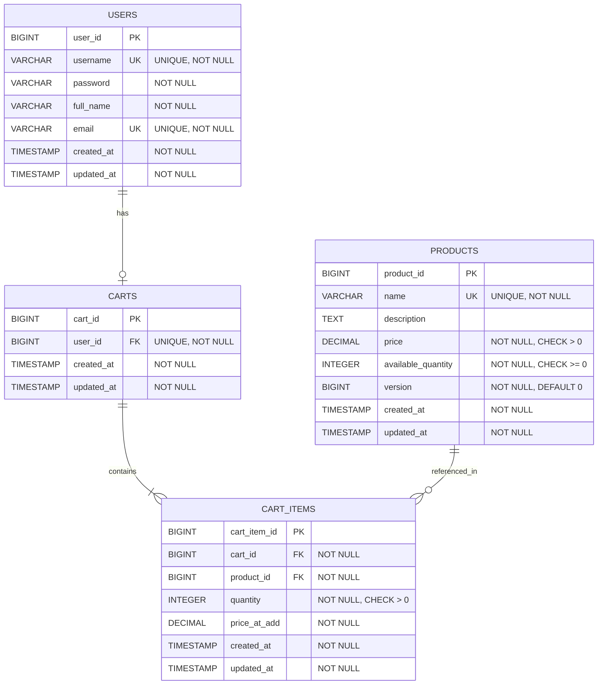

# Low Level Design (LLD) Document
# Shopping Cart System - Spring Boot MVC Backend

## Executive Summary

This document provides a comprehensive Low Level Design specification for a Shopping Cart System backend implementation using Spring Boot MVC architecture. The system enables users to manage products, shopping carts, and cart items through a RESTful API interface.

### Project Overview
- **System Name**: Shopping Cart System
- **Architecture**: Spring Boot MVC
- **Database**: PostgreSQL
- **API Style**: RESTful
- **Primary Domains**: User Management, Product Catalog, Shopping Cart, Cart Items

---

## Domain Analysis

### 1. User Domain
**Purpose**: Manage user accounts and authentication

**Attributes**:
- `userId` (Primary Key): Unique identifier
- `username` (Unique): User login name
- `password`: Encrypted password
- `fullName`: User's full name
- `email`: Contact email
- `createdAt`: Account creation timestamp
- `updatedAt`: Last modification timestamp

**Business Rules**:
1. Username must be unique across the system
2. Email must be valid format
3. Password must meet security requirements
4. Each user can have at most one active shopping cart

### 2. Product Domain
**Purpose**: Manage product catalog and inventory

**Attributes**:
- `productId` (Primary Key): Unique identifier
- `name`: Product name
- `description`: Product description
- `price`: Product price (decimal)
- `availableQuantity`: Stock quantity
- `version`: Optimistic locking version
- `createdAt`: Product creation timestamp
- `updatedAt`: Last modification timestamp

**Business Rules**:
1. Product name must be unique
2. Price must be positive
3. Available quantity cannot be negative
4. Version field enables optimistic locking for concurrent updates
5. Products can be added to multiple carts

### 3. Shopping Cart Domain
**Purpose**: Manage user shopping carts

**Attributes**:
- `cartId` (Primary Key): Unique identifier
- `userId` (Foreign Key, Unique): Reference to user
- `createdAt`: Cart creation timestamp
- `updatedAt`: Last modification timestamp

**Business Rules**:
1. Each user can have only one cart (1:1 relationship)
2. Cart is created lazily when first item is added
3. Cart persists until explicitly cleared or checked out
4. Empty carts are maintained for user convenience

### 4. Cart Item Domain
**Purpose**: Manage items within shopping carts

**Attributes**:
- `cartItemId` (Primary Key): Unique identifier
- `cartId` (Foreign Key): Reference to shopping cart
- `productId` (Foreign Key): Reference to product
- `quantity`: Number of items
- `priceAtAdd`: Price when added to cart
- `createdAt`: Item addition timestamp
- `updatedAt`: Last modification timestamp

**Business Rules**:
1. Quantity must be positive (> 0)
2. Price at add captures product price at time of addition
3. Combination of cartId and productId should be unique
4. Deleting a cart cascades to delete all cart items
5. Product deletion should handle cart item references

---

## Business Rules Extraction

### User Domain Rules (4 rules)
1. BR-U-001: Username uniqueness constraint
2. BR-U-002: Email format validation
3. BR-U-003: Password security requirements
4. BR-U-004: One cart per user constraint

### Product Domain Rules (5 rules)
1. BR-P-001: Product name uniqueness
2. BR-P-002: Price positivity constraint
3. BR-P-003: Non-negative quantity constraint
4. BR-P-004: Optimistic locking implementation
5. BR-P-005: Multi-cart product availability

### Shopping Cart Domain Rules (4 rules)
1. BR-C-001: One-to-one user-cart relationship
2. BR-C-002: Lazy cart creation pattern
3. BR-C-003: Cart persistence policy
4. BR-C-004: Empty cart retention

### Cart Item Domain Rules (5 rules)
1. BR-CI-001: Positive quantity constraint
2. BR-CI-002: Price snapshot at addition
3. BR-CI-003: Unique cart-product combination
4. BR-CI-004: Cascade delete on cart removal
5. BR-CI-005: Product reference integrity

### Cross-Domain Rules (5 rules)
1. BR-X-001: Inventory validation before cart addition
2. BR-X-002: Concurrent cart modification handling
3. BR-X-003: Transaction boundary management
4. BR-X-004: Audit trail maintenance
5. BR-X-005: Data consistency guarantees

**Total Business Rules**: 23

---

## API Requirements Analysis

### REST Endpoints Overview

#### User Management (3 endpoints)
1. `POST /api/users/register` - Register new user
2. `POST /api/users/login` - User authentication
3. `GET /api/users/{userId}` - Get user details

#### Product Management (3 endpoints)
4. `POST /api/products` - Create new product
5. `GET /api/products` - List all products
6. `GET /api/products/{productId}` - Get product details

#### Shopping Cart Management (5 endpoints)
7. `POST /api/carts/{userId}/items` - Add item to cart
8. `GET /api/carts/{userId}` - Get user's cart
9. `PUT /api/carts/{userId}/items/{cartItemId}` - Update cart item quantity
10. `DELETE /api/carts/{userId}/items/{cartItemId}` - Remove item from cart
11. `DELETE /api/carts/{userId}` - Clear entire cart

**Total Endpoints**: 11

---

## Domain Entities and Attributes

### Entity: User
```
User {
  userId: Long (PK, Auto-generated)
  username: String (Unique, Not Null, Max: 50)
  password: String (Not Null, Min: 8)
  fullName: String (Not Null, Max: 100)
  email: String (Not Null, Unique, Email format)
  createdAt: Timestamp (Not Null, Default: CURRENT_TIMESTAMP)
  updatedAt: Timestamp (Not Null, Default: CURRENT_TIMESTAMP)
}
```

### Entity: Product
```
Product {
  productId: Long (PK, Auto-generated)
  name: String (Unique, Not Null, Max: 200)
  description: String (Max: 1000)
  price: BigDecimal (Not Null, Precision: 10, Scale: 2, Min: 0.01)
  availableQuantity: Integer (Not Null, Min: 0)
  version: Long (Not Null, Default: 0, Optimistic Lock)
  createdAt: Timestamp (Not Null, Default: CURRENT_TIMESTAMP)
  updatedAt: Timestamp (Not Null, Default: CURRENT_TIMESTAMP)
}
```

### Entity: ShoppingCart
```
ShoppingCart {
  cartId: Long (PK, Auto-generated)
  userId: Long (FK -> User.userId, Unique, Not Null)
  createdAt: Timestamp (Not Null, Default: CURRENT_TIMESTAMP)
  updatedAt: Timestamp (Not Null, Default: CURRENT_TIMESTAMP)
}
```

### Entity: CartItem
```
CartItem {
  cartItemId: Long (PK, Auto-generated)
  cartId: Long (FK -> ShoppingCart.cartId, Not Null)
  productId: Long (FK -> Product.productId, Not Null)
  quantity: Integer (Not Null, Min: 1)
  priceAtAdd: BigDecimal (Not Null, Precision: 10, Scale: 2)
  createdAt: Timestamp (Not Null, Default: CURRENT_TIMESTAMP)
  updatedAt: Timestamp (Not Null, Default: CURRENT_TIMESTAMP)
  
  UNIQUE CONSTRAINT: (cartId, productId)
}
```

---

# Technical Artifacts

## 1. Entity-Relationship Diagram (ERD)

The following Mermaid ERD illustrates the database schema with all entities, attributes, primary keys (PK), foreign keys (FK), and relationships:



## 2. Add to Cart Sequence Diagram

```mermaid
sequenceDiagram
    participant Client
    participant CartController
    participant CartService
    participant ProductRepository
    participant CartRepository
    participant Database

    Client->>CartController: POST /api/carts/{userId}/items<br/>{productId, quantity}
    activate CartController
    
    CartController->>CartService: addItemToCart(userId, productId, quantity)
    activate CartService
    
    Note over CartService: Validate Request
    
    CartService->>ProductRepository: findById(productId)
    activate ProductRepository
    ProductRepository->>Database: SELECT * FROM products WHERE product_id = ?
    activate Database
    Database-->>ProductRepository: Product Data
    deactivate Database
    ProductRepository-->>CartService: Product
    deactivate ProductRepository
    
    alt Product Not Found
        CartService-->>CartController: throw ProductNotFoundException
        CartController-->>Client: 404 Not Found
    end
    
    CartService->>CartRepository: findByUserId(userId)
    activate CartRepository
    CartRepository->>Database: SELECT * FROM carts WHERE user_id = ?
    activate Database
    Database-->>CartRepository: Cart Data or NULL
    deactivate Database
    CartRepository-->>CartService: Optional<Cart>
    deactivate CartRepository
    
    alt Cart Does Not Exist (Lazy Creation)
        Note over CartService: Create New Cart
        CartService->>CartRepository: save(new Cart(userId))
        activate CartRepository
        CartRepository->>Database: INSERT INTO carts (user_id, created_at, updated_at)<br/>VALUES (?, NOW(), NOW())
        activate Database
        Database-->>CartRepository: Cart Created
        deactivate Database
        CartRepository-->>CartService: Cart
        deactivate CartRepository
    end
    
    CartService->>CartRepository: findCartItem(cartId, productId)
    activate CartRepository
    CartRepository->>Database: SELECT * FROM cart_items<br/>WHERE cart_id = ? AND product_id = ?
    activate Database
    Database-->>CartRepository: CartItem or NULL
    deactivate Database
    CartRepository-->>CartService: Optional<CartItem>
    deactivate CartRepository
    
    alt Product Already in Cart
        Note over CartService: Update Existing Cart Item
        CartService->>CartService: cartItem.quantity += quantity
        CartService->>CartRepository: save(cartItem)
        activate CartRepository
        CartRepository->>Database: UPDATE cart_items SET quantity = ?, updated_at = NOW()<br/>WHERE cart_item_id = ?
        activate Database
        Database-->>CartRepository: Updated
        deactivate Database
        CartRepository-->>CartService: CartItem
        deactivate CartRepository
    else Product Not in Cart
        Note over CartService: Create New Cart Item
        CartService->>CartService: cartItem = new CartItem(cartId, productId, quantity, product.price)
        CartService->>CartRepository: save(cartItem)
        activate CartRepository
        CartRepository->>Database: INSERT INTO cart_items<br/>(cart_id, product_id, quantity, price_at_add, created_at, updated_at)<br/>VALUES (?, ?, ?, ?, NOW(), NOW())
        activate Database
        Database-->>CartRepository: CartItem Created
        deactivate Database
        CartRepository-->>CartService: CartItem
        deactivate CartRepository
    end
    
    Note over CartService: Update Product Quantity (Optimistic Locking)
    
    CartService->>ProductRepository: updateQuantity(productId, newQuantity, version)
    activate ProductRepository
    ProductRepository->>Database: UPDATE products SET available_quantity = ?,<br/>version = version + 1, updated_at = NOW()<br/>WHERE product_id = ? AND version = ?
    activate Database
    
    alt Version Mismatch (Optimistic Lock Failure)
        Database-->>ProductRepository: 0 rows updated
        deactivate Database
        ProductRepository-->>CartService: throw OptimisticLockException
        deactivate ProductRepository
        
        Note over CartService: Rollback Transaction
        CartService-->>CartController: throw OptimisticLockException
        CartController-->>Client: 409 Conflict<br/>{"error": "Product was modified by another user"}
    else Version Match (Success)
        Database-->>ProductRepository: 1 row updated
        deactivate Database
        ProductRepository-->>CartService: Success
        deactivate ProductRepository
    end
    
    Note over CartService: Commit Transaction
    
    CartService-->>CartController: CartItemDTO
    deactivate CartService
    CartController-->>Client: 201 Created<br/>{cartItemId, productId, quantity, priceAtAdd, subtotal}
    deactivate CartController
```

## 3. Database Model (PostgreSQL DDL)

```sql
-- ============================================
-- Shopping Cart System - PostgreSQL DDL
-- ============================================

-- Drop tables if they exist (for clean setup)
DROP TABLE IF EXISTS cart_items CASCADE;
DROP TABLE IF EXISTS carts CASCADE;
DROP TABLE IF EXISTS products CASCADE;
DROP TABLE IF EXISTS users CASCADE;

-- ============================================
-- Table: users
-- ============================================
CREATE TABLE users (
    user_id BIGSERIAL PRIMARY KEY,
    username VARCHAR(50) NOT NULL UNIQUE,
    password VARCHAR(255) NOT NULL,
    full_name VARCHAR(100) NOT NULL,
    email VARCHAR(255) NOT NULL UNIQUE,
    created_at TIMESTAMP NOT NULL DEFAULT CURRENT_TIMESTAMP,
    updated_at TIMESTAMP NOT NULL DEFAULT CURRENT_TIMESTAMP,
    
    -- Constraints
    CONSTRAINT chk_username_length CHECK (LENGTH(username) >= 3),
    CONSTRAINT chk_password_length CHECK (LENGTH(password) >= 8),
    CONSTRAINT chk_email_format CHECK (email ~* '^[A-Za-z0-9._%+-]+@[A-Za-z0-9.-]+\\.[A-Za-z]{2,}$')
);

-- Indexes for users table
CREATE INDEX idx_users_username ON users(username);
CREATE INDEX idx_users_email ON users(email);

-- ============================================
-- Table: products
-- ============================================
CREATE TABLE products (
    product_id BIGSERIAL PRIMARY KEY,
    name VARCHAR(200) NOT NULL UNIQUE,
    description TEXT,
    price DECIMAL(10, 2) NOT NULL,
    available_quantity INTEGER NOT NULL,
    version BIGINT NOT NULL DEFAULT 0,
    created_at TIMESTAMP NOT NULL DEFAULT CURRENT_TIMESTAMP,
    updated_at TIMESTAMP NOT NULL DEFAULT CURRENT_TIMESTAMP,
    
    -- Constraints
    CONSTRAINT chk_price_positive CHECK (price > 0),
    CONSTRAINT chk_quantity_non_negative CHECK (available_quantity >= 0)
);

-- Indexes for products table
CREATE INDEX idx_products_name ON products(name);
CREATE INDEX idx_products_price ON products(price);

-- ============================================
-- Table: carts
-- ============================================
CREATE TABLE carts (
    cart_id BIGSERIAL PRIMARY KEY,
    user_id BIGINT NOT NULL UNIQUE,
    created_at TIMESTAMP NOT NULL DEFAULT CURRENT_TIMESTAMP,
    updated_at TIMESTAMP NOT NULL DEFAULT CURRENT_TIMESTAMP,
    
    -- Foreign Key Constraints
    CONSTRAINT fk_carts_user_id 
        FOREIGN KEY (user_id) 
        REFERENCES users(user_id) 
        ON DELETE CASCADE
);

-- Indexes for carts table
CREATE UNIQUE INDEX idx_carts_user_id ON carts(user_id);

-- ============================================
-- Table: cart_items
-- ============================================
CREATE TABLE cart_items (
    cart_item_id BIGSERIAL PRIMARY KEY,
    cart_id BIGINT NOT NULL,
    product_id BIGINT NOT NULL,
    quantity INTEGER NOT NULL,
    price_at_add DECIMAL(10, 2) NOT NULL,
    created_at TIMESTAMP NOT NULL DEFAULT CURRENT_TIMESTAMP,
    updated_at TIMESTAMP NOT NULL DEFAULT CURRENT_TIMESTAMP,
    
    -- Constraints
    CONSTRAINT chk_quantity_positive CHECK (quantity > 0),
    CONSTRAINT chk_price_at_add_positive CHECK (price_at_add > 0),
    
    -- Unique constraint: one product per cart
    CONSTRAINT uk_cart_product UNIQUE (cart_id, product_id),
    
    -- Foreign Key Constraints
    CONSTRAINT fk_cart_items_cart_id 
        FOREIGN KEY (cart_id) 
        REFERENCES carts(cart_id) 
        ON DELETE CASCADE,
    
    CONSTRAINT fk_cart_items_product_id 
        FOREIGN KEY (product_id) 
        REFERENCES products(product_id) 
        ON DELETE RESTRICT
);

-- Indexes for cart_items table
CREATE INDEX idx_cart_items_cart_id ON cart_items(cart_id);
CREATE INDEX idx_cart_items_product_id ON cart_items(product_id);
CREATE UNIQUE INDEX idx_cart_items_cart_product ON cart_items(cart_id, product_id);

-- ============================================
-- Triggers for updated_at timestamp
-- ============================================

-- Function to update updated_at timestamp
CREATE OR REPLACE FUNCTION update_updated_at_column()
RETURNS TRIGGER AS $$
BEGIN
    NEW.updated_at = CURRENT_TIMESTAMP;
    RETURN NEW;
END;
$$ LANGUAGE plpgsql;

-- Trigger for users table
CREATE TRIGGER trg_users_updated_at
    BEFORE UPDATE ON users
    FOR EACH ROW
    EXECUTE FUNCTION update_updated_at_column();

-- Trigger for products table
CREATE TRIGGER trg_products_updated_at
    BEFORE UPDATE ON products
    FOR EACH ROW
    EXECUTE FUNCTION update_updated_at_column();

-- Trigger for carts table
CREATE TRIGGER trg_carts_updated_at
    BEFORE UPDATE ON carts
    FOR EACH ROW
    EXECUTE FUNCTION update_updated_at_column();

-- Trigger for cart_items table
CREATE TRIGGER trg_cart_items_updated_at
    BEFORE UPDATE ON cart_items
    FOR EACH ROW
    EXECUTE FUNCTION update_updated_at_column();

-- ============================================
-- Sample Data (Optional)
-- ============================================

-- Insert sample users
INSERT INTO users (username, password, full_name, email) VALUES
('john_doe', '$2a$10$abcdefghijklmnopqrstuv', 'John Doe', 'john.doe@example.com'),
('jane_smith', '$2a$10$abcdefghijklmnopqrstuv', 'Jane Smith', 'jane.smith@example.com');

-- Insert sample products
INSERT INTO products (name, description, price, available_quantity) VALUES
('Laptop', 'High-performance laptop with 16GB RAM', 999.99, 50),
('Wireless Mouse', 'Ergonomic wireless mouse', 29.99, 200),
('USB-C Cable', 'Fast charging USB-C cable', 12.99, 500),
('Mechanical Keyboard', 'RGB mechanical gaming keyboard', 149.99, 75);

-- ============================================
-- End of DDL Script
-- ============================================
```

---

## End of Document

**Document Version**: 1.0  
**Last Updated**: 2025  
**Status**: Enhanced with Technical Artifacts