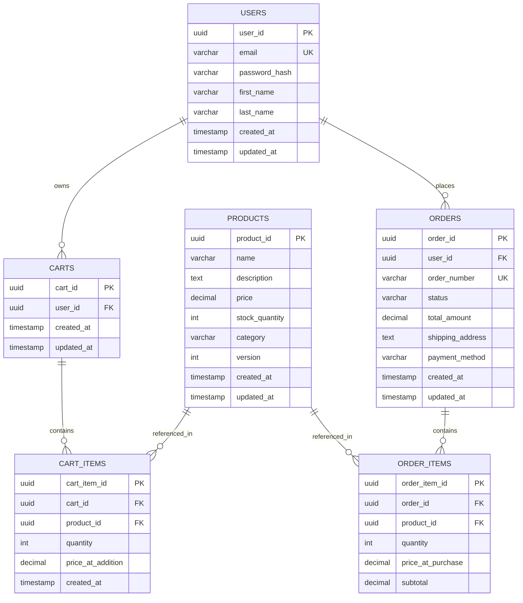
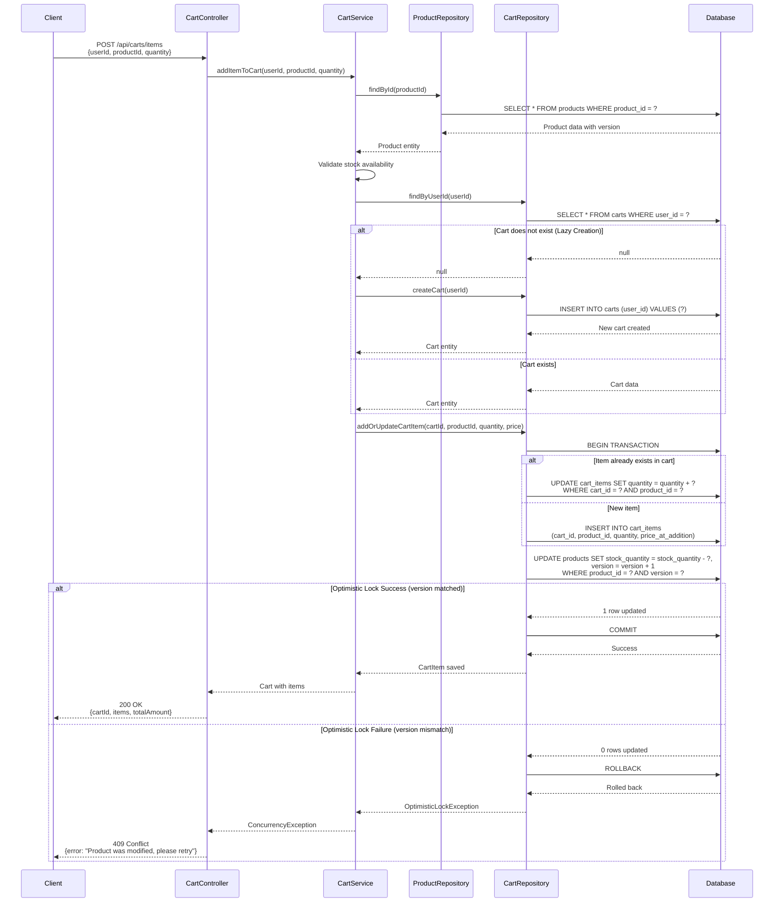

# Enhanced Low Level Design (LLD) - E-Commerce System

## 1. System Overview

This document provides the Low Level Design for a scalable e-commerce platform supporting user management, product catalog, shopping cart, and order processing capabilities.

### 1.1 Technology Stack
- **Backend**: Java 17, Spring Boot 3.x
- **Database**: PostgreSQL 14+
- **API**: RESTful APIs with JSON
- **Concurrency Control**: Optimistic Locking

## 2. System Architecture

### 2.1 Layered Architecture
```
┌─────────────────────────────────────┐
│     Presentation Layer (REST)      │
├─────────────────────────────────────┤
│       Service Layer (Business)      │
├─────────────────────────────────────┤
│    Repository Layer (Data Access)   │
├─────────────────────────────────────┤
│         Database (PostgreSQL)       │
└─────────────────────────────────────┘
```

### 2.2 Core Components

#### 2.2.1 User Management Module
- **UserController**: Handles user registration, authentication, profile management
- **UserService**: Business logic for user operations
- **UserRepository**: Data access for user entities

#### 2.2.2 Product Catalog Module
- **ProductController**: Product CRUD operations, search, filtering
- **ProductService**: Product business logic, inventory management
- **ProductRepository**: Product data access with optimistic locking

#### 2.2.3 Shopping Cart Module
- **CartController**: Cart operations (add, update, remove items)
- **CartService**: Cart business logic, lazy initialization
- **CartRepository**: Cart persistence with transactional support

#### 2.2.4 Order Processing Module
- **OrderController**: Order creation, status tracking
- **OrderService**: Order workflow, payment integration
- **OrderRepository**: Order data persistence

## 3. API Specifications

### 3.1 User APIs

#### POST /api/users/register
**Request:**
```json
{
  "email": "user@example.com",
  "password": "securePassword123",
  "firstName": "John",
  "lastName": "Doe"
}
```
**Response:** `201 Created`
```json
{
  "userId": "uuid",
  "email": "user@example.com",
  "firstName": "John",
  "lastName": "Doe"
}
```

#### POST /api/users/login
**Request:**
```json
{
  "email": "user@example.com",
  "password": "securePassword123"
}
```
**Response:** `200 OK`
```json
{
  "token": "jwt-token",
  "userId": "uuid"
}
```

### 3.2 Product APIs

#### GET /api/products
**Query Parameters:** `page`, `size`, `category`, `minPrice`, `maxPrice`
**Response:** `200 OK`
```json
{
  "content": [
    {
      "productId": "uuid",
      "name": "Product Name",
      "description": "Description",
      "price": 99.99,
      "stockQuantity": 100,
      "category": "Electronics"
    }
  ],
  "totalPages": 10,
  "totalElements": 100
}
```

#### GET /api/products/{productId}
**Response:** `200 OK`
```json
{
  "productId": "uuid",
  "name": "Product Name",
  "description": "Detailed description",
  "price": 99.99,
  "stockQuantity": 100,
  "category": "Electronics",
  "version": 1
}
```

### 3.3 Cart APIs

#### POST /api/carts/items
**Request:**
```json
{
  "userId": "uuid",
  "productId": "uuid",
  "quantity": 2
}
```
**Response:** `200 OK`
```json
{
  "cartId": "uuid",
  "items": [
    {
      "cartItemId": "uuid",
      "productId": "uuid",
      "productName": "Product Name",
      "quantity": 2,
      "price": 99.99,
      "subtotal": 199.98
    }
  ],
  "totalAmount": 199.98
}
```

#### GET /api/carts/{userId}
**Response:** `200 OK`
```json
{
  "cartId": "uuid",
  "userId": "uuid",
  "items": [],
  "totalAmount": 0.00
}
```

#### DELETE /api/carts/items/{cartItemId}
**Response:** `204 No Content`

### 3.4 Order APIs

#### POST /api/orders
**Request:**
```json
{
  "userId": "uuid",
  "shippingAddress": {
    "street": "123 Main St",
    "city": "City",
    "state": "State",
    "zipCode": "12345",
    "country": "Country"
  },
  "paymentMethod": "CREDIT_CARD"
}
```
**Response:** `201 Created`
```json
{
  "orderId": "uuid",
  "orderNumber": "ORD-20240101-001",
  "status": "PENDING",
  "totalAmount": 199.98,
  "createdAt": "2024-01-01T10:00:00Z"
}
```

## 4. Data Model

### 4.1 Entity-Relationship Diagram



### 4.2 Database Schema (PostgreSQL DDL)

```sql
-- Users Table
CREATE TABLE users (
    user_id UUID PRIMARY KEY DEFAULT gen_random_uuid(),
    email VARCHAR(255) NOT NULL UNIQUE,
    password_hash VARCHAR(255) NOT NULL,
    first_name VARCHAR(100) NOT NULL,
    last_name VARCHAR(100) NOT NULL,
    created_at TIMESTAMP NOT NULL DEFAULT CURRENT_TIMESTAMP,
    updated_at TIMESTAMP NOT NULL DEFAULT CURRENT_TIMESTAMP
);

CREATE INDEX idx_users_email ON users(email);

-- Products Table with Optimistic Locking
CREATE TABLE products (
    product_id UUID PRIMARY KEY DEFAULT gen_random_uuid(),
    name VARCHAR(255) NOT NULL,
    description TEXT,
    price DECIMAL(10, 2) NOT NULL CHECK (price >= 0),
    stock_quantity INTEGER NOT NULL DEFAULT 0 CHECK (stock_quantity >= 0),
    category VARCHAR(100),
    version INTEGER NOT NULL DEFAULT 0,
    created_at TIMESTAMP NOT NULL DEFAULT CURRENT_TIMESTAMP,
    updated_at TIMESTAMP NOT NULL DEFAULT CURRENT_TIMESTAMP
);

CREATE INDEX idx_products_category ON products(category);
CREATE INDEX idx_products_price ON products(price);

-- Carts Table
CREATE TABLE carts (
    cart_id UUID PRIMARY KEY DEFAULT gen_random_uuid(),
    user_id UUID NOT NULL UNIQUE,
    created_at TIMESTAMP NOT NULL DEFAULT CURRENT_TIMESTAMP,
    updated_at TIMESTAMP NOT NULL DEFAULT CURRENT_TIMESTAMP,
    CONSTRAINT fk_cart_user FOREIGN KEY (user_id) REFERENCES users(user_id) ON DELETE CASCADE
);

CREATE INDEX idx_carts_user_id ON carts(user_id);

-- Cart Items Table
CREATE TABLE cart_items (
    cart_item_id UUID PRIMARY KEY DEFAULT gen_random_uuid(),
    cart_id UUID NOT NULL,
    product_id UUID NOT NULL,
    quantity INTEGER NOT NULL CHECK (quantity > 0),
    price_at_addition DECIMAL(10, 2) NOT NULL,
    created_at TIMESTAMP NOT NULL DEFAULT CURRENT_TIMESTAMP,
    CONSTRAINT fk_cart_item_cart FOREIGN KEY (cart_id) REFERENCES carts(cart_id) ON DELETE CASCADE,
    CONSTRAINT fk_cart_item_product FOREIGN KEY (product_id) REFERENCES products(product_id) ON DELETE RESTRICT,
    CONSTRAINT uk_cart_product UNIQUE (cart_id, product_id)
);

CREATE INDEX idx_cart_items_cart_id ON cart_items(cart_id);
CREATE INDEX idx_cart_items_product_id ON cart_items(product_id);

-- Orders Table
CREATE TABLE orders (
    order_id UUID PRIMARY KEY DEFAULT gen_random_uuid(),
    user_id UUID NOT NULL,
    order_number VARCHAR(50) NOT NULL UNIQUE,
    status VARCHAR(50) NOT NULL DEFAULT 'PENDING',
    total_amount DECIMAL(10, 2) NOT NULL,
    shipping_address TEXT NOT NULL,
    payment_method VARCHAR(50) NOT NULL,
    created_at TIMESTAMP NOT NULL DEFAULT CURRENT_TIMESTAMP,
    updated_at TIMESTAMP NOT NULL DEFAULT CURRENT_TIMESTAMP,
    CONSTRAINT fk_order_user FOREIGN KEY (user_id) REFERENCES users(user_id) ON DELETE RESTRICT
);

CREATE INDEX idx_orders_user_id ON orders(user_id);
CREATE INDEX idx_orders_status ON orders(status);
CREATE INDEX idx_orders_created_at ON orders(created_at);

-- Order Items Table
CREATE TABLE order_items (
    order_item_id UUID PRIMARY KEY DEFAULT gen_random_uuid(),
    order_id UUID NOT NULL,
    product_id UUID NOT NULL,
    quantity INTEGER NOT NULL CHECK (quantity > 0),
    price_at_purchase DECIMAL(10, 2) NOT NULL,
    subtotal DECIMAL(10, 2) NOT NULL,
    CONSTRAINT fk_order_item_order FOREIGN KEY (order_id) REFERENCES orders(order_id) ON DELETE CASCADE,
    CONSTRAINT fk_order_item_product FOREIGN KEY (product_id) REFERENCES products(product_id) ON DELETE RESTRICT
);

CREATE INDEX idx_order_items_order_id ON order_items(order_id);
CREATE INDEX idx_order_items_product_id ON order_items(product_id);

-- Trigger for updating updated_at timestamp
CREATE OR REPLACE FUNCTION update_updated_at_column()
RETURNS TRIGGER AS $$
BEGIN
    NEW.updated_at = CURRENT_TIMESTAMP;
    RETURN NEW;
END;
$$ LANGUAGE plpgsql;

CREATE TRIGGER update_users_updated_at BEFORE UPDATE ON users
    FOR EACH ROW EXECUTE FUNCTION update_updated_at_column();

CREATE TRIGGER update_products_updated_at BEFORE UPDATE ON products
    FOR EACH ROW EXECUTE FUNCTION update_updated_at_column();

CREATE TRIGGER update_carts_updated_at BEFORE UPDATE ON carts
    FOR EACH ROW EXECUTE FUNCTION update_updated_at_column();

CREATE TRIGGER update_orders_updated_at BEFORE UPDATE ON orders
    FOR EACH ROW EXECUTE FUNCTION update_updated_at_column();
```

## 5. Sequence Diagrams

### 5.1 Add to Cart Flow with Optimistic Locking



## 6. Technical Specifications

### 6.1 Concurrency Control

**Optimistic Locking Implementation:**
- Products table includes `version` column (integer)
- On update, version is checked and incremented atomically
- Prevents lost updates in concurrent scenarios
- Retry logic implemented at service layer

**Example Service Code:**
```java
@Service
public class CartService {
    
    @Transactional
    public Cart addItemToCart(UUID userId, UUID productId, int quantity) {
        // Fetch product with version
        Product product = productRepository.findById(productId)
            .orElseThrow(() -> new ProductNotFoundException());
        
        // Validate stock
        if (product.getStockQuantity() < quantity) {
            throw new InsufficientStockException();
        }
        
        // Lazy cart creation
        Cart cart = cartRepository.findByUserId(userId)
            .orElseGet(() -> cartRepository.save(new Cart(userId)));
        
        // Add or update cart item
        CartItem cartItem = cart.addOrUpdateItem(product, quantity);
        
        // Update product stock with optimistic locking
        int updatedRows = productRepository.decrementStockWithVersion(
            productId, quantity, product.getVersion()
        );
        
        if (updatedRows == 0) {
            throw new OptimisticLockException("Product was modified by another transaction");
        }
        
        return cartRepository.save(cart);
    }
}
```

### 6.2 Error Handling

**HTTP Status Codes:**
- `200 OK`: Successful GET/PUT/DELETE
- `201 Created`: Successful POST
- `204 No Content`: Successful DELETE with no response body
- `400 Bad Request`: Invalid input data
- `401 Unauthorized`: Authentication required
- `404 Not Found`: Resource not found
- `409 Conflict`: Optimistic locking failure, concurrent modification
- `500 Internal Server Error`: Unexpected server error

**Exception Handling Strategy:**
```java
@ControllerAdvice
public class GlobalExceptionHandler {
    
    @ExceptionHandler(OptimisticLockException.class)
    public ResponseEntity<ErrorResponse> handleOptimisticLock(OptimisticLockException ex) {
        return ResponseEntity.status(HttpStatus.CONFLICT)
            .body(new ErrorResponse("CONCURRENT_MODIFICATION", 
                "Resource was modified by another user. Please refresh and retry."));
    }
    
    @ExceptionHandler(InsufficientStockException.class)
    public ResponseEntity<ErrorResponse> handleInsufficientStock(InsufficientStockException ex) {
        return ResponseEntity.status(HttpStatus.BAD_REQUEST)
            .body(new ErrorResponse("INSUFFICIENT_STOCK", ex.getMessage()));
    }
}
```

### 6.3 Performance Considerations

**Database Indexing:**
- Primary keys on all tables (UUID)
- Foreign key indexes for join optimization
- Composite unique index on `cart_items(cart_id, product_id)`
- Index on frequently queried columns: `email`, `category`, `status`

**Caching Strategy:**
- Product catalog cached with Redis (TTL: 1 hour)
- Cart data cached per user session
- Cache invalidation on product updates

**Query Optimization:**
- Pagination for product listings
- Lazy loading for cart items
- Batch operations for order item creation

### 6.4 Security Measures

**Authentication & Authorization:**
- JWT-based authentication
- Role-based access control (RBAC)
- Password hashing with BCrypt

**Data Protection:**
- SQL injection prevention via parameterized queries
- Input validation and sanitization
- HTTPS for all API communications
- Sensitive data encryption at rest

### 6.5 Transaction Management

**ACID Compliance:**
- All cart and order operations wrapped in transactions
- Isolation level: READ_COMMITTED
- Rollback on optimistic lock failures
- Atomic stock updates

## 7. Deployment Considerations

### 7.1 Scalability
- Horizontal scaling of application servers
- Database read replicas for query distribution
- Connection pooling (HikariCP)
- Async processing for order notifications

### 7.2 Monitoring
- Application metrics (Prometheus)
- Database performance monitoring
- API response time tracking
- Error rate alerting

## 8. Conclusion

This Enhanced LLD provides a comprehensive technical blueprint for implementing a robust e-commerce system with proper concurrency control, data integrity, and scalability considerations. The design emphasizes:

- **Data Integrity**: Optimistic locking prevents concurrent modification issues
- **Performance**: Strategic indexing and caching for optimal response times
- **Scalability**: Stateless design enabling horizontal scaling
- **Security**: Multi-layered security approach
- **Maintainability**: Clean architecture with clear separation of concerns

---

**Document Version**: 1.0  
**Last Updated**: 2024  
**Status**: Ready for Implementation