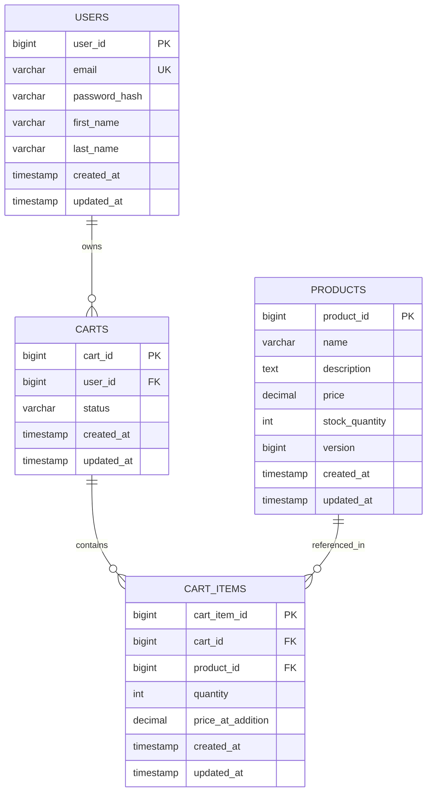
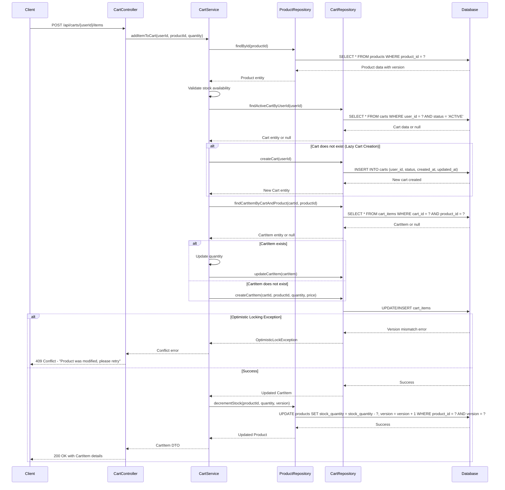

# Low Level Design (LLD) - Shopping Cart Backend Services

## Executive Summary

This document provides the comprehensive Low Level Design for the Shopping Cart Backend Services. The system enables users to manage shopping carts, add/remove products, and proceed to checkout with robust validation and error handling.

### Key Highlights
- RESTful API architecture
- Domain-driven design with 4 core entities
- Comprehensive validation rules
- Optimistic locking for concurrency control
- MVC pattern implementation

## Domain Entities

### 1. User Entity
**Attributes:**
- `userId` (Long, Primary Key): Unique identifier for the user
- `email` (String, Unique, Not Null): User's email address
- `passwordHash` (String, Not Null): Encrypted password
- `firstName` (String, Not Null): User's first name
- `lastName` (String, Not Null): User's last name
- `createdAt` (Timestamp): Account creation timestamp
- `updatedAt` (Timestamp): Last update timestamp

**Business Rules:**
- Email must be unique across the system
- Email format validation required
- Password must meet security requirements (min 8 characters, alphanumeric)

### 2. Product Entity
**Attributes:**
- `productId` (Long, Primary Key): Unique identifier for the product
- `name` (String, Not Null): Product name
- `description` (Text): Detailed product description
- `price` (Decimal, Not Null): Product price (must be >= 0)
- `stockQuantity` (Integer, Not Null): Available stock (must be >= 0)
- `version` (Long): Version number for optimistic locking
- `createdAt` (Timestamp): Product creation timestamp
- `updatedAt` (Timestamp): Last update timestamp

**Business Rules:**
- Price must be non-negative
- Stock quantity must be non-negative
- Version field enables optimistic locking for concurrent updates

### 3. Cart Entity
**Attributes:**
- `cartId` (Long, Primary Key): Unique identifier for the cart
- `userId` (Long, Foreign Key): Reference to the user who owns the cart
- `status` (String, Not Null): Cart status (ACTIVE, CHECKED_OUT, ABANDONED)
- `createdAt` (Timestamp): Cart creation timestamp
- `updatedAt` (Timestamp): Last update timestamp

**Business Rules:**
- Each user can have one ACTIVE cart at a time
- Cart is created lazily when first item is added
- Status transitions: ACTIVE → CHECKED_OUT or ABANDONED

### 4. CartItem Entity
**Attributes:**
- `cartItemId` (Long, Primary Key): Unique identifier for the cart item
- `cartId` (Long, Foreign Key): Reference to the cart
- `productId` (Long, Foreign Key): Reference to the product
- `quantity` (Integer, Not Null): Quantity of the product (must be > 0)
- `priceAtAddition` (Decimal, Not Null): Product price when added to cart
- `createdAt` (Timestamp): Item addition timestamp
- `updatedAt` (Timestamp): Last update timestamp

**Business Rules:**
- Quantity must be positive (> 0)
- Each product can appear only once per cart (unique constraint on cartId + productId)
- Price is captured at addition time for historical accuracy

## REST API Endpoints

### 1. Create User
**Endpoint:** `POST /api/users`

**Request Body:**
```json
{
  "email": "user@example.com",
  "password": "SecurePass123",
  "firstName": "John",
  "lastName": "Doe"
}
```

**Response:** `201 Created`
```json
{
  "userId": 1,
  "email": "user@example.com",
  "firstName": "John",
  "lastName": "Doe",
  "createdAt": "2024-01-15T10:30:00Z"
}
```

**Validation Rules:**
- Email format validation
- Password minimum 8 characters
- All fields required

### 2. Get User by ID
**Endpoint:** `GET /api/users/{userId}`

**Response:** `200 OK`
```json
{
  "userId": 1,
  "email": "user@example.com",
  "firstName": "John",
  "lastName": "Doe",
  "createdAt": "2024-01-15T10:30:00Z"
}
```

**Error Response:** `404 Not Found` if user doesn't exist

### 3. Create Product
**Endpoint:** `POST /api/products`

**Request Body:**
```json
{
  "name": "Laptop",
  "description": "High-performance laptop",
  "price": 999.99,
  "stockQuantity": 50
}
```

**Response:** `201 Created`
```json
{
  "productId": 1,
  "name": "Laptop",
  "description": "High-performance laptop",
  "price": 999.99,
  "stockQuantity": 50,
  "version": 0,
  "createdAt": "2024-01-15T10:35:00Z"
}
```

**Validation Rules:**
- Price must be >= 0
- Stock quantity must be >= 0
- Name is required

### 4. Get Product by ID
**Endpoint:** `GET /api/products/{productId}`

**Response:** `200 OK`
```json
{
  "productId": 1,
  "name": "Laptop",
  "description": "High-performance laptop",
  "price": 999.99,
  "stockQuantity": 50,
  "version": 0
}
```

**Error Response:** `404 Not Found` if product doesn't exist

### 5. Update Product Stock
**Endpoint:** `PATCH /api/products/{productId}/stock`

**Request Body:**
```json
{
  "stockQuantity": 45,
  "version": 0
}
```

**Response:** `200 OK`
```json
{
  "productId": 1,
  "stockQuantity": 45,
  "version": 1
}
```

**Error Response:** `409 Conflict` if version mismatch (optimistic locking)

### 6. Get All Products
**Endpoint:** `GET /api/products`

**Query Parameters:**
- `page` (optional, default: 0)
- `size` (optional, default: 20)

**Response:** `200 OK`
```json
{
  "content": [
    {
      "productId": 1,
      "name": "Laptop",
      "price": 999.99,
      "stockQuantity": 50
    }
  ],
  "page": 0,
  "size": 20,
  "totalElements": 1
}
```

### 7. Add Item to Cart
**Endpoint:** `POST /api/carts/{userId}/items`

**Request Body:**
```json
{
  "productId": 1,
  "quantity": 2
}
```

**Response:** `200 OK` (or `201 Created` if cart was created)
```json
{
  "cartItemId": 1,
  "cartId": 1,
  "productId": 1,
  "productName": "Laptop",
  "quantity": 2,
  "priceAtAddition": 999.99,
  "subtotal": 1999.98
}
```

**Validation Rules:**
- Product must exist
- Quantity must be > 0
- Sufficient stock must be available
- Lazy cart creation if user has no active cart

**Error Responses:**
- `404 Not Found` - Product or User not found
- `400 Bad Request` - Insufficient stock
- `409 Conflict` - Optimistic locking failure

### 8. Update Cart Item Quantity
**Endpoint:** `PUT /api/carts/{userId}/items/{cartItemId}`

**Request Body:**
```json
{
  "quantity": 3
}
```

**Response:** `200 OK`
```json
{
  "cartItemId": 1,
  "quantity": 3,
  "subtotal": 2999.97
}
```

**Validation Rules:**
- Quantity must be > 0
- Sufficient stock must be available

### 9. Remove Item from Cart
**Endpoint:** `DELETE /api/carts/{userId}/items/{cartItemId}`

**Response:** `204 No Content`

**Error Response:** `404 Not Found` if cart item doesn't exist

### 10. Get Cart by User ID
**Endpoint:** `GET /api/carts/{userId}`

**Response:** `200 OK`
```json
{
  "cartId": 1,
  "userId": 1,
  "status": "ACTIVE",
  "items": [
    {
      "cartItemId": 1,
      "productId": 1,
      "productName": "Laptop",
      "quantity": 2,
      "priceAtAddition": 999.99,
      "subtotal": 1999.98
    }
  ],
  "totalAmount": 1999.98,
  "createdAt": "2024-01-15T11:00:00Z",
  "updatedAt": "2024-01-15T11:05:00Z"
}
```

**Error Response:** `404 Not Found` if user has no active cart

### 11. Clear Cart
**Endpoint:** `DELETE /api/carts/{userId}`

**Response:** `204 No Content`

**Business Logic:** Removes all items from the active cart

## Validation Rules Summary

### User Validation
- Email: Valid format, unique, required
- Password: Minimum 8 characters, alphanumeric, required
- First Name: Required, max 100 characters
- Last Name: Required, max 100 characters

### Product Validation
- Name: Required, max 255 characters
- Price: Non-negative, required
- Stock Quantity: Non-negative, required
- Version: Required for updates (optimistic locking)

### Cart Item Validation
- Quantity: Positive integer (> 0), required
- Product ID: Must reference existing product
- Stock availability: Quantity must not exceed available stock

## Error Handling

### HTTP Status Codes
- `200 OK` - Successful GET/PUT/PATCH
- `201 Created` - Successful POST
- `204 No Content` - Successful DELETE
- `400 Bad Request` - Validation errors, insufficient stock
- `404 Not Found` - Resource not found
- `409 Conflict` - Optimistic locking failure, duplicate email
- `500 Internal Server Error` - Unexpected server errors

### Error Response Format
```json
{
  "timestamp": "2024-01-15T11:10:00Z",
  "status": 400,
  "error": "Bad Request",
  "message": "Insufficient stock available",
  "path": "/api/carts/1/items"
}
```

## MVC Mapping

### Controllers
- `UserController` - Handles user-related endpoints
- `ProductController` - Handles product-related endpoints
- `CartController` - Handles cart and cart item endpoints

### Services
- `UserService` - Business logic for user operations
- `ProductService` - Business logic for product operations, stock management
- `CartService` - Business logic for cart operations, lazy cart creation, validation

### Repositories
- `UserRepository` - Data access for User entity
- `ProductRepository` - Data access for Product entity
- `CartRepository` - Data access for Cart entity
- `CartItemRepository` - Data access for CartItem entity

---

## Technical Artifacts

### 1. Entity-Relationship Diagram (ERD)

The following Mermaid diagram illustrates the relationships between the core domain entities:



**Key Relationships:**
- One User can own multiple Carts (one-to-many)
- One Cart contains multiple Cart Items (one-to-many)
- One Product can be referenced in multiple Cart Items (one-to-many)
- The PRODUCTS table includes a `version` column for optimistic locking

### 2. Sequence Diagram - Add to Cart Flow

The following Mermaid sequence diagram illustrates the complete flow for adding an item to a cart, including lazy cart creation and optimistic locking:



**Key Flow Points:**
- **Lazy Cart Creation**: Cart is only created when the first item is added
- **Stock Validation**: Ensures sufficient stock before adding to cart
- **Optimistic Locking**: Version check prevents concurrent modification conflicts
- **Error Handling**: Explicit handling of version mismatch with 409 Conflict response

### 3. Database Model (PostgreSQL DDL)

The following SQL DDL scripts define the complete database schema with all constraints, foreign keys, and indexes:

```sql
-- Create USERS table
CREATE TABLE users (
    user_id BIGSERIAL PRIMARY KEY,
    email VARCHAR(255) NOT NULL UNIQUE,
    password_hash VARCHAR(255) NOT NULL,
    first_name VARCHAR(100) NOT NULL,
    last_name VARCHAR(100) NOT NULL,
    created_at TIMESTAMP NOT NULL DEFAULT CURRENT_TIMESTAMP,
    updated_at TIMESTAMP NOT NULL DEFAULT CURRENT_TIMESTAMP
);

-- Create PRODUCTS table with version column for optimistic locking
CREATE TABLE products (
    product_id BIGSERIAL PRIMARY KEY,
    name VARCHAR(255) NOT NULL,
    description TEXT,
    price DECIMAL(10, 2) NOT NULL CHECK (price >= 0),
    stock_quantity INTEGER NOT NULL CHECK (stock_quantity >= 0),
    version BIGINT NOT NULL DEFAULT 0,
    created_at TIMESTAMP NOT NULL DEFAULT CURRENT_TIMESTAMP,
    updated_at TIMESTAMP NOT NULL DEFAULT CURRENT_TIMESTAMP,
    CONSTRAINT chk_price_positive CHECK (price >= 0),
    CONSTRAINT chk_stock_non_negative CHECK (stock_quantity >= 0)
);

-- Create CARTS table
CREATE TABLE carts (
    cart_id BIGSERIAL PRIMARY KEY,
    user_id BIGINT NOT NULL,
    status VARCHAR(20) NOT NULL DEFAULT 'ACTIVE',
    created_at TIMESTAMP NOT NULL DEFAULT CURRENT_TIMESTAMP,
    updated_at TIMESTAMP NOT NULL DEFAULT CURRENT_TIMESTAMP,
    CONSTRAINT fk_cart_user FOREIGN KEY (user_id) 
        REFERENCES users(user_id) ON DELETE CASCADE,
    CONSTRAINT chk_cart_status CHECK (status IN ('ACTIVE', 'CHECKED_OUT', 'ABANDONED'))
);

-- Create CART_ITEMS table
CREATE TABLE cart_items (
    cart_item_id BIGSERIAL PRIMARY KEY,
    cart_id BIGINT NOT NULL,
    product_id BIGINT NOT NULL,
    quantity INTEGER NOT NULL CHECK (quantity > 0),
    price_at_addition DECIMAL(10, 2) NOT NULL CHECK (price_at_addition >= 0),
    created_at TIMESTAMP NOT NULL DEFAULT CURRENT_TIMESTAMP,
    updated_at TIMESTAMP NOT NULL DEFAULT CURRENT_TIMESTAMP,
    CONSTRAINT fk_cart_item_cart FOREIGN KEY (cart_id) 
        REFERENCES carts(cart_id) ON DELETE CASCADE,
    CONSTRAINT fk_cart_item_product FOREIGN KEY (product_id) 
        REFERENCES products(product_id) ON DELETE CASCADE,
    CONSTRAINT chk_quantity_positive CHECK (quantity > 0),
    CONSTRAINT chk_price_at_addition_non_negative CHECK (price_at_addition >= 0),
    CONSTRAINT uk_cart_product UNIQUE (cart_id, product_id)
);

-- Create indexes for frequently accessed foreign keys
CREATE INDEX idx_carts_user_id ON carts(user_id);
CREATE INDEX idx_carts_status ON carts(status);
CREATE INDEX idx_cart_items_cart_id ON cart_items(cart_id);
CREATE INDEX idx_cart_items_product_id ON cart_items(product_id);
CREATE INDEX idx_users_email ON users(email);

-- Create composite index for cart lookup optimization
CREATE INDEX idx_carts_user_status ON carts(user_id, status);

-- Create index for product stock queries
CREATE INDEX idx_products_stock ON products(stock_quantity);
```

**Key Database Features:**
- **Primary Keys**: Auto-incrementing BIGSERIAL for all tables
- **Foreign Keys**: Explicit ON DELETE CASCADE for referential integrity
- **Constraints**: 
  - NOT NULL constraints on required fields
  - UNIQUE constraint on email and cart_id + product_id combination
  - CHECK constraints for positive quantities and non-negative prices/stock
  - Status enumeration constraint for cart status
- **Indexes**: 
  - Single-column indexes on frequently queried foreign keys
  - Composite index on (user_id, status) for efficient active cart lookups
  - Index on stock_quantity for inventory queries
- **Optimistic Locking**: Version column in products table with default value 0
- **Timestamps**: Automatic timestamp tracking for audit purposes

---

## Document Version
- **Version**: 1.0 Enhanced
- **Last Updated**: 2024-01-15
- **Status**: Complete with Technical Artifacts