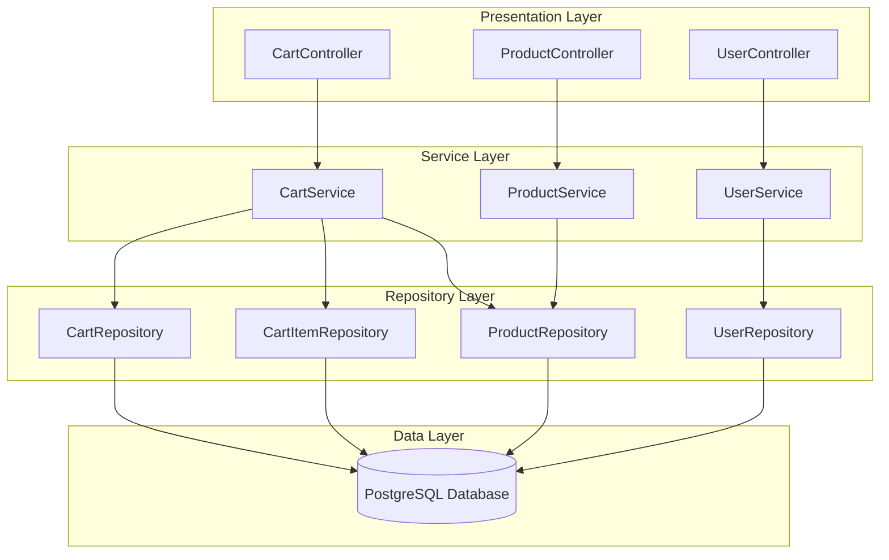
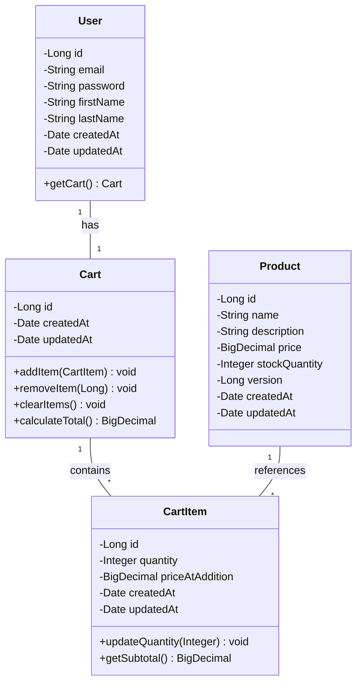
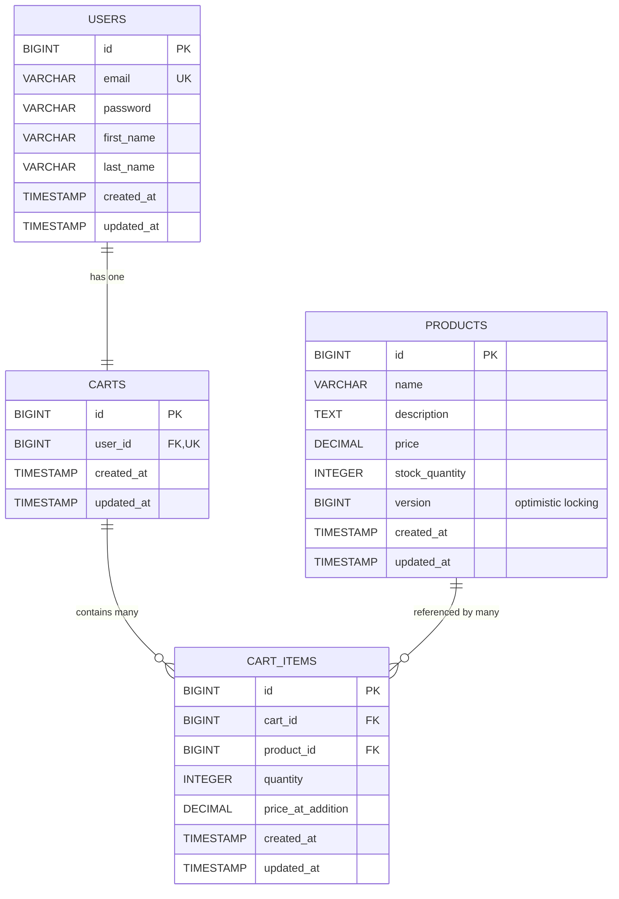
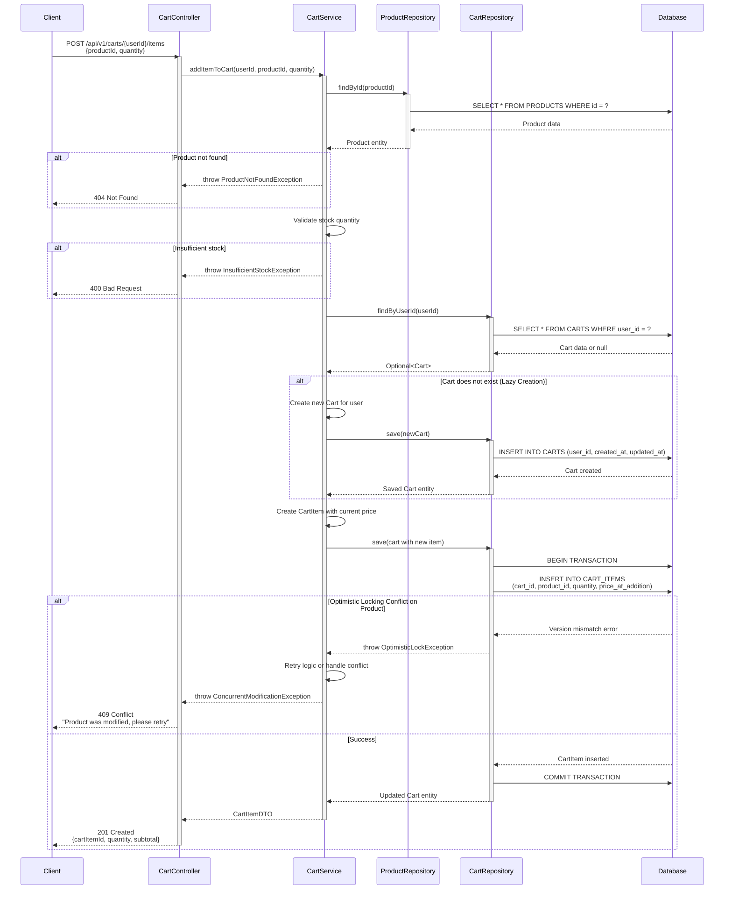

# Low Level Design (LLD) Document
## Shopping Cart System using Spring Boot MVC

---

## 1. Executive Summary

This document provides a comprehensive Low Level Design for a Shopping Cart System built using Spring Boot MVC architecture. The system enables users to manage shopping carts, add/remove products, and handle cart operations with optimistic locking for concurrent access control.

### 1.1 System Overview
- **Technology Stack**: Spring Boot, Spring MVC, JPA/Hibernate, PostgreSQL
- **Architecture Pattern**: MVC (Model-View-Controller)
- **Concurrency Control**: Optimistic Locking using version columns
- **Database**: PostgreSQL with referential integrity constraints

### 1.2 Key Features
- User management and authentication
- Product catalog management
- Shopping cart operations (create, read, update, delete)
- Cart item management with quantity controls
- Optimistic locking for concurrent cart updates
- Lazy cart creation on first item addition

---

## 2. Functional Domain Decomposition

### 2.1 User Management Domain
- User registration and authentication
- User profile management
- User session handling

### 2.2 Product Management Domain
- Product catalog maintenance
- Product inventory tracking
- Product pricing management
- Product availability status

### 2.3 Cart Management Domain
- Cart lifecycle management (create, retrieve, update, delete)
- Lazy cart initialization
- Cart-user association
- Cart state persistence

### 2.4 Cart Item Management Domain
- Add items to cart
- Update item quantities
- Remove items from cart
- Calculate cart totals
- Handle concurrent modifications

---

## 3. Entity Extraction

### 3.1 Core Entities

#### 3.1.1 User Entity
```java
@Entity
@Table(name = "USERS")
public class User {
    @Id
    @GeneratedValue(strategy = GenerationType.IDENTITY)
    private Long id;
    
    @Column(nullable = false, unique = true)
    private String email;
    
    @Column(nullable = false)
    private String password;
    
    @Column(nullable = false)
    private String firstName;
    
    @Column(nullable = false)
    private String lastName;
    
    @OneToOne(mappedBy = "user", cascade = CascadeType.ALL)
    private Cart cart;
    
    @Temporal(TemporalType.TIMESTAMP)
    private Date createdAt;
    
    @Temporal(TemporalType.TIMESTAMP)
    private Date updatedAt;
}
```

#### 3.1.2 Product Entity
```java
@Entity
@Table(name = "PRODUCTS")
public class Product {
    @Id
    @GeneratedValue(strategy = GenerationType.IDENTITY)
    private Long id;
    
    @Column(nullable = false)
    private String name;
    
    @Column(length = 1000)
    private String description;
    
    @Column(nullable = false)
    private BigDecimal price;
    
    @Column(nullable = false)
    private Integer stockQuantity;
    
    @Version
    private Long version; // Optimistic locking
    
    @Temporal(TemporalType.TIMESTAMP)
    private Date createdAt;
    
    @Temporal(TemporalType.TIMESTAMP)
    private Date updatedAt;
}
```

#### 3.1.3 Cart Entity
```java
@Entity
@Table(name = "CARTS")
public class Cart {
    @Id
    @GeneratedValue(strategy = GenerationType.IDENTITY)
    private Long id;
    
    @OneToOne
    @JoinColumn(name = "user_id", nullable = false, unique = true)
    private User user;
    
    @OneToMany(mappedBy = "cart", cascade = CascadeType.ALL, orphanRemoval = true)
    private List<CartItem> items = new ArrayList<>();
    
    @Temporal(TemporalType.TIMESTAMP)
    private Date createdAt;
    
    @Temporal(TemporalType.TIMESTAMP)
    private Date updatedAt;
}
```

#### 3.1.4 CartItem Entity
```java
@Entity
@Table(name = "CART_ITEMS")
public class CartItem {
    @Id
    @GeneratedValue(strategy = GenerationType.IDENTITY)
    private Long id;
    
    @ManyToOne
    @JoinColumn(name = "cart_id", nullable = false)
    private Cart cart;
    
    @ManyToOne
    @JoinColumn(name = "product_id", nullable = false)
    private Product product;
    
    @Column(nullable = false)
    private Integer quantity;
    
    @Column(nullable = false)
    private BigDecimal priceAtAddition;
    
    @Temporal(TemporalType.TIMESTAMP)
    private Date createdAt;
    
    @Temporal(TemporalType.TIMESTAMP)
    private Date updatedAt;
}
```

---

## 4. REST API Contracts

### 4.1 Cart Operations

#### 4.1.1 Get Cart
```
GET /api/v1/carts/{userId}
Response: 200 OK
{
    "cartId": 1,
    "userId": 123,
    "items": [
        {
            "cartItemId": 1,
            "productId": 456,
            "productName": "Product A",
            "quantity": 2,
            "priceAtAddition": 29.99,
            "subtotal": 59.98
        }
    ],
    "totalAmount": 59.98,
    "createdAt": "2024-01-15T10:30:00Z",
    "updatedAt": "2024-01-15T11:45:00Z"
}
```

#### 4.1.2 Add Item to Cart
```
POST /api/v1/carts/{userId}/items
Request Body:
{
    "productId": 456,
    "quantity": 2
}

Response: 201 Created
{
    "cartItemId": 1,
    "cartId": 1,
    "productId": 456,
    "quantity": 2,
    "priceAtAddition": 29.99,
    "message": "Item added to cart successfully"
}
```

#### 4.1.3 Update Cart Item Quantity
```
PUT /api/v1/carts/{userId}/items/{cartItemId}
Request Body:
{
    "quantity": 5
}

Response: 200 OK
{
    "cartItemId": 1,
    "quantity": 5,
    "subtotal": 149.95,
    "message": "Cart item updated successfully"
}
```

#### 4.1.4 Remove Item from Cart
```
DELETE /api/v1/carts/{userId}/items/{cartItemId}

Response: 204 No Content
```

#### 4.1.5 Clear Cart
```
DELETE /api/v1/carts/{userId}

Response: 204 No Content
```

### 4.2 Product Operations

#### 4.2.1 Get Product Details
```
GET /api/v1/products/{productId}

Response: 200 OK
{
    "productId": 456,
    "name": "Product A",
    "description": "High quality product",
    "price": 29.99,
    "stockQuantity": 100,
    "version": 1
}
```

#### 4.2.2 List Products
```
GET /api/v1/products?page=0&size=20

Response: 200 OK
{
    "content": [
        {
            "productId": 456,
            "name": "Product A",
            "price": 29.99,
            "stockQuantity": 100
        }
    ],
    "totalElements": 50,
    "totalPages": 3,
    "currentPage": 0
}
```

---

## 5. Validation Matrix

| Field | Validation Rule | Error Message |
|-------|----------------|---------------|
| User Email | Not null, Valid email format, Unique | "Invalid email format" / "Email already exists" |
| User Password | Not null, Min 8 characters, Contains uppercase, lowercase, digit | "Password must be at least 8 characters with uppercase, lowercase, and digit" |
| Product Name | Not null, Max 255 characters | "Product name is required and must not exceed 255 characters" |
| Product Price | Not null, Greater than 0 | "Product price must be greater than 0" |
| Product Stock Quantity | Not null, Greater than or equal to 0 | "Stock quantity cannot be negative" |
| Cart Item Quantity | Not null, Greater than 0, Less than or equal to stock | "Quantity must be between 1 and available stock" |
| Product ID (Add to Cart) | Not null, Must exist in database | "Product not found" |
| Cart Item ID (Update/Delete) | Not null, Must exist and belong to user's cart | "Cart item not found or access denied" |

---

## 6. Component Architecture Diagram



---

## 7. Class Diagram



---

## 8. Enhanced Technical Artifacts

### 8.1 Entity-Relationship Diagram (ERD)



**Key Relationships:**
- **USERS to CARTS**: One-to-One relationship (user_id in CARTS is both FK and UK)
- **CARTS to CART_ITEMS**: One-to-Many relationship with CASCADE DELETE
- **PRODUCTS to CART_ITEMS**: One-to-Many relationship
- **Optimistic Locking**: PRODUCTS table includes version column for concurrent update control

---

### 8.2 Add to Cart Sequence Diagram



**Key Flow Points:**
1. **Lazy Cart Creation**: Cart is created only when the first item is added
2. **Product Validation**: Checks product existence and stock availability
3. **Optimistic Locking**: Handles concurrent modifications with version checking
4. **Transaction Management**: Ensures data consistency with database transactions
5. **Error Handling**: Comprehensive exception handling for various failure scenarios

---

### 8.3 Database Model (SQL DDL)

```sql
-- ============================================
-- PostgreSQL DDL for Shopping Cart System
-- ============================================

-- Drop tables if they exist (for clean setup)
DROP TABLE IF EXISTS CART_ITEMS CASCADE;
DROP TABLE IF EXISTS CARTS CASCADE;
DROP TABLE IF EXISTS PRODUCTS CASCADE;
DROP TABLE IF EXISTS USERS CASCADE;

-- ============================================
-- USERS Table
-- ============================================
CREATE TABLE USERS (
    id BIGSERIAL PRIMARY KEY,
    email VARCHAR(255) NOT NULL UNIQUE,
    password VARCHAR(255) NOT NULL,
    first_name VARCHAR(100) NOT NULL,
    last_name VARCHAR(100) NOT NULL,
    created_at TIMESTAMP NOT NULL DEFAULT CURRENT_TIMESTAMP,
    updated_at TIMESTAMP NOT NULL DEFAULT CURRENT_TIMESTAMP,
    
    CONSTRAINT chk_email_format CHECK (email ~* '^[A-Za-z0-9._%+-]+@[A-Za-z0-9.-]+\.[A-Z|a-z]{2,}$')
);

-- ============================================
-- PRODUCTS Table
-- ============================================
CREATE TABLE PRODUCTS (
    id BIGSERIAL PRIMARY KEY,
    name VARCHAR(255) NOT NULL,
    description TEXT,
    price DECIMAL(10, 2) NOT NULL,
    stock_quantity INTEGER NOT NULL DEFAULT 0,
    version BIGINT NOT NULL DEFAULT 0,
    created_at TIMESTAMP NOT NULL DEFAULT CURRENT_TIMESTAMP,
    updated_at TIMESTAMP NOT NULL DEFAULT CURRENT_TIMESTAMP,
    
    CONSTRAINT chk_price_positive CHECK (price > 0),
    CONSTRAINT chk_stock_non_negative CHECK (stock_quantity >= 0)
);

-- ============================================
-- CARTS Table
-- ============================================
CREATE TABLE CARTS (
    id BIGSERIAL PRIMARY KEY,
    user_id BIGINT NOT NULL UNIQUE,
    created_at TIMESTAMP NOT NULL DEFAULT CURRENT_TIMESTAMP,
    updated_at TIMESTAMP NOT NULL DEFAULT CURRENT_TIMESTAMP,
    
    CONSTRAINT fk_cart_user 
        FOREIGN KEY (user_id) 
        REFERENCES USERS(id) 
        ON DELETE CASCADE
);

-- ============================================
-- CART_ITEMS Table
-- ============================================
CREATE TABLE CART_ITEMS (
    id BIGSERIAL PRIMARY KEY,
    cart_id BIGINT NOT NULL,
    product_id BIGINT NOT NULL,
    quantity INTEGER NOT NULL,
    price_at_addition DECIMAL(10, 2) NOT NULL,
    created_at TIMESTAMP NOT NULL DEFAULT CURRENT_TIMESTAMP,
    updated_at TIMESTAMP NOT NULL DEFAULT CURRENT_TIMESTAMP,
    
    CONSTRAINT fk_cart_item_cart 
        FOREIGN KEY (cart_id) 
        REFERENCES CARTS(id) 
        ON DELETE CASCADE,
    
    CONSTRAINT fk_cart_item_product 
        FOREIGN KEY (product_id) 
        REFERENCES PRODUCTS(id) 
        ON DELETE CASCADE,
    
    CONSTRAINT chk_quantity_positive CHECK (quantity > 0),
    CONSTRAINT chk_price_at_addition_positive CHECK (price_at_addition > 0),
    CONSTRAINT uk_cart_product UNIQUE (cart_id, product_id)
);

-- ============================================
-- Indexes for Performance Optimization
-- ============================================

-- Index on USERS email for login queries
CREATE INDEX idx_users_email ON USERS(email);

-- Index on PRODUCTS for catalog queries
CREATE INDEX idx_products_name ON PRODUCTS(name);
CREATE INDEX idx_products_price ON PRODUCTS(price);

-- Index on CARTS user_id (already unique, but explicit for clarity)
CREATE INDEX idx_carts_user_id ON CARTS(user_id);

-- Indexes on CART_ITEMS foreign keys for join performance
CREATE INDEX idx_cart_items_cart_id ON CART_ITEMS(cart_id);
CREATE INDEX idx_cart_items_product_id ON CART_ITEMS(product_id);

-- Composite index for cart item lookups
CREATE INDEX idx_cart_items_cart_product ON CART_ITEMS(cart_id, product_id);

-- ============================================
-- Triggers for Updated_At Timestamp
-- ============================================

-- Function to update updated_at timestamp
CREATE OR REPLACE FUNCTION update_updated_at_column()
RETURNS TRIGGER AS $$
BEGIN
    NEW.updated_at = CURRENT_TIMESTAMP;
    RETURN NEW;
END;
$$ LANGUAGE plpgsql;

-- Trigger for USERS table
CREATE TRIGGER trg_users_updated_at
    BEFORE UPDATE ON USERS
    FOR EACH ROW
    EXECUTE FUNCTION update_updated_at_column();

-- Trigger for PRODUCTS table
CREATE TRIGGER trg_products_updated_at
    BEFORE UPDATE ON PRODUCTS
    FOR EACH ROW
    EXECUTE FUNCTION update_updated_at_column();

-- Trigger for CARTS table
CREATE TRIGGER trg_carts_updated_at
    BEFORE UPDATE ON CARTS
    FOR EACH ROW
    EXECUTE FUNCTION update_updated_at_column();

-- Trigger for CART_ITEMS table
CREATE TRIGGER trg_cart_items_updated_at
    BEFORE UPDATE ON CART_ITEMS
    FOR EACH ROW
    EXECUTE FUNCTION update_updated_at_column();

-- ============================================
-- Sample Data for Testing (Optional)
-- ============================================

-- Insert sample users
INSERT INTO USERS (email, password, first_name, last_name) VALUES
('john.doe@example.com', '$2a$10$encrypted_password_hash', 'John', 'Doe'),
('jane.smith@example.com', '$2a$10$encrypted_password_hash', 'Jane', 'Smith');

-- Insert sample products
INSERT INTO PRODUCTS (name, description, price, stock_quantity) VALUES
('Laptop', 'High-performance laptop with 16GB RAM', 1299.99, 50),
('Wireless Mouse', 'Ergonomic wireless mouse', 29.99, 200),
('USB-C Cable', 'Fast charging USB-C cable', 15.99, 500),
('Keyboard', 'Mechanical keyboard with RGB lighting', 89.99, 100);

-- ============================================
-- Database Comments for Documentation
-- ============================================

COMMENT ON TABLE USERS IS 'Stores user account information';
COMMENT ON TABLE PRODUCTS IS 'Product catalog with optimistic locking support';
COMMENT ON TABLE CARTS IS 'Shopping carts associated with users';
COMMENT ON TABLE CART_ITEMS IS 'Items within shopping carts with quantity and price snapshot';

COMMENT ON COLUMN PRODUCTS.version IS 'Version column for optimistic locking to handle concurrent updates';
COMMENT ON COLUMN CART_ITEMS.price_at_addition IS 'Price snapshot at the time item was added to cart';

-- ============================================
-- End of DDL Script
-- ============================================
```

**Key DDL Features:**

1. **Constraints:**
   - NOT NULL constraints on required fields
   - UNIQUE constraints on email and cart-user relationship
   - CHECK constraints for positive quantities and prices
   - Foreign key constraints with ON DELETE CASCADE

2. **Optimistic Locking:**
   - Version column in PRODUCTS table for concurrent update control

3. **Indexes:**
   - Primary key indexes (automatic)
   - Foreign key indexes for join performance
   - Email index for user lookups
   - Composite index for cart-product queries

4. **Referential Integrity:**
   - CASCADE DELETE ensures orphaned records are removed
   - Foreign key relationships maintain data consistency

5. **Triggers:**
   - Automatic updated_at timestamp management
   - Ensures audit trail accuracy

6. **Data Types:**
   - BIGSERIAL for auto-incrementing primary keys
   - DECIMAL(10,2) for precise monetary values
   - TIMESTAMP for temporal data
   - TEXT for variable-length descriptions

---

## 9. Conclusion

This Low Level Design document provides a comprehensive blueprint for implementing a Shopping Cart System using Spring Boot MVC. The design incorporates:

- **Robust entity relationships** with proper normalization
- **RESTful API contracts** following industry standards
- **Optimistic locking** for concurrent access control
- **Lazy cart creation** for improved resource utilization
- **Comprehensive validation** ensuring data integrity
- **Performance-optimized database schema** with appropriate indexes
- **Referential integrity** through foreign key constraints

The system is designed to be scalable, maintainable, and production-ready, with clear separation of concerns across presentation, service, and data layers.

---

**Document Version:** 1.0  
**Last Updated:** 2024  
**Status:** Enhanced with Technical Artifacts