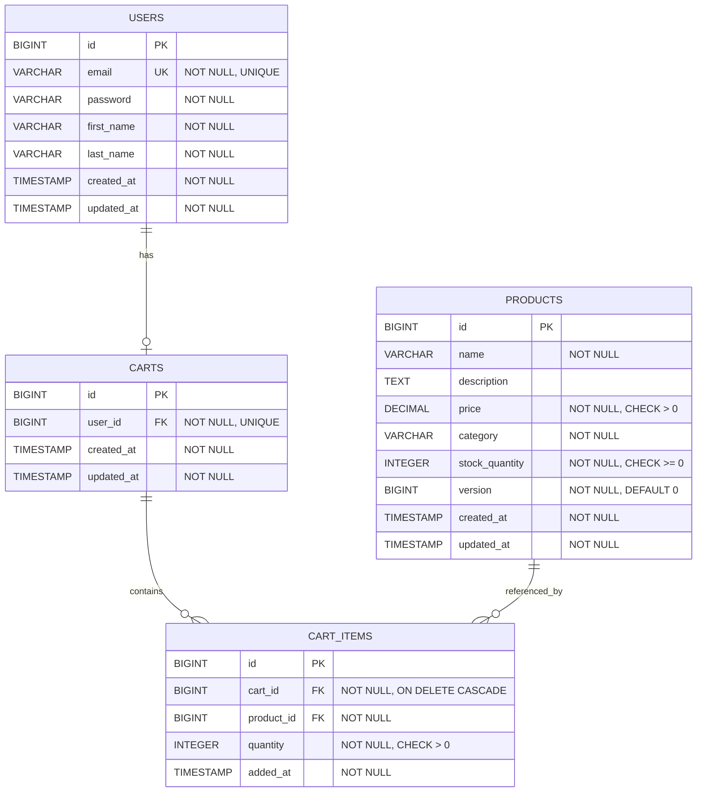

# COMPREHENSIVE BACKEND ENGINEERING SPECIFICATION PACKAGE
## Shopping Cart System - Spring Boot MVC Implementation

**Project:** SCRUM-96 - Implement Core Shopping Cart Backend Services Using Spring Boot MVC  
**Version:** 1.0  
**Date:** 2024  
**Classification:** Production-Ready Engineering Specification

---

## EXECUTIVE SUMMARY

### Project Overview
This specification package provides a complete backend engineering blueprint for implementing a shopping cart system using Java Spring Boot MVC architecture. The system supports user management, product catalog search, and shopping cart operations with strict business rule enforcement and database-first validation.

### Key Characteristics
- **Architecture:** Spring Boot MVC (Stateless)
- **Persistence:** Relational Database (JPA/Hibernate)
- **API Style:** RESTful
- **Authentication:** Stateless (no session persistence)
- **Cart Lifecycle:** Lazy creation, auto-cleanup on logout

### Scope Boundaries

**IN SCOPE:**
- User Management (Sign-Up, Sign-In, Profile Operations)
- Product Catalog (Search functionality)
- Shopping Cart Management (Full CRUD operations)
- Business Rule Enforcement
- Database-First Validation

**OUT OF SCOPE:**
- Checkout Process
- Payment Integration
- Inventory Locking
- Admin Management
- Password Change Functionality

### Critical Business Rules
1. **Cart Lifecycle:** Carts do NOT persist across logout
2. **Lazy Creation:** Carts created only when first item added
3. **Auto-Cleanup:** Empty carts automatically deleted
4. **Stateless Authentication:** No session-based state management
5. **Database-First Validation:** All constraints enforced at DB level

---

## DETAILED ANALYSIS

### 1. FUNCTIONAL DOMAIN DECOMPOSITION

#### Domain 1: User Management
**Purpose:** Handle user registration, authentication, and profile management

**Functional Requirements:**
- **Sign-Up:** Create new user accounts with validation
- **Sign-In:** Authenticate users and provide access tokens
- **View Profile:** Retrieve authenticated user information
- **Update Profile:** Modify user profile data (excluding password)

**Business Rules:**
- Email must be unique across system
- Email format validation required
- Name fields cannot be empty
- Password changes explicitly out of scope

#### Domain 2: Product Catalog
**Purpose:** Enable product discovery and information retrieval

**Functional Requirements:**
- **Product Search:** Query products by name, category, or attributes
- **Product Details:** Retrieve complete product information

**Business Rules:**
- Products are read-only from cart service perspective
- Product availability determined by stock quantity
- Price and stock information must be current

#### Domain 3: Shopping Cart Management
**Purpose:** Manage user shopping cart lifecycle and operations

**Functional Requirements:**
- **Lazy Cart Creation:** Create cart on first item addition
- **Add Product:** Insert products into cart with quantity
- **Update Quantity:** Modify existing cart item quantities
- **Remove Product:** Delete items from cart
- **View Cart:** Retrieve complete cart with items
- **Auto-Delete Empty Cart:** Remove carts with zero items
- **Cart Cleanup on Logout:** Delete cart when user logs out

**Business Rules:**
- One active cart per user maximum
- Cart items must reference valid products
- Quantity must be positive integer
- Cannot exceed available stock
- Empty carts automatically deleted
- Carts deleted on logout (no persistence)

---

## TECHNICAL ARTIFACTS

### 1. ENTITY-RELATIONSHIP DIAGRAM (ERD)



### 2. SEQUENCE DIAGRAM - ADD TO CART FLOW

```mermaid
sequenceDiagram
    participant Client
    participant CartController
    participant CartService
    participant ProductRepository
    participant CartRepository
    participant Database

    Client->>CartController: POST /api/cart/items<br/>{productId, quantity}
    activate CartController
    
    CartController->>CartService: addItemToCart(userId, productId, quantity)
    activate CartService
    
    Note over CartService: Validate Product & Stock
    CartService->>ProductRepository: findById(productId)
    activate ProductRepository
    ProductRepository->>Database: SELECT * FROM PRODUCTS WHERE id = ?
    activate Database
    Database-->>ProductRepository: Product Data (with version)
    deactivate Database
    ProductRepository-->>CartService: Product Entity
    deactivate ProductRepository
    
    alt Product Not Found
        CartService-->>CartController: throw ProductNotFoundException
        CartController-->>Client: 404 Not Found
    else Product Found
        Note over CartService: Check Stock Availability
        alt Insufficient Stock
            CartService-->>CartController: throw InsufficientStockException
            CartController-->>Client: 409 Conflict
        else Stock Available
            Note over CartService: Lazy Cart Creation
            CartService->>CartRepository: findByUserId(userId)
            activate CartRepository
            CartRepository->>Database: SELECT * FROM CARTS WHERE user_id = ?
            activate Database
            Database-->>CartRepository: Cart Data or NULL
            deactivate Database
            CartRepository-->>CartService: Optional<Cart>
            deactivate CartRepository
            
            alt Cart Does Not Exist
                Note over CartService: Create New Cart
                CartService->>CartRepository: save(new Cart(userId))
                activate CartRepository
                CartRepository->>Database: INSERT INTO CARTS (user_id, created_at, updated_at)
                activate Database
                Database-->>CartRepository: Cart Created
                deactivate Database
                CartRepository-->>CartService: Cart Entity
                deactivate CartRepository
            end
            
            Note over CartService: Add/Update Cart Item
            CartService->>CartRepository: saveCartItem(cartId, productId, quantity)
            activate CartRepository
            CartRepository->>Database: INSERT INTO CART_ITEMS<br/>ON CONFLICT UPDATE quantity
            activate Database
            
            alt Optimistic Lock Exception
                Database-->>CartRepository: Version Mismatch
                CartRepository-->>CartService: OptimisticLockException
                deactivate Database
                deactivate CartRepository
                CartService-->>CartController: throw ConcurrentModificationException
                CartController-->>Client: 409 Conflict - Retry Required
            else Success
                Database-->>CartRepository: Cart Item Saved
                deactivate Database
                CartRepository-->>CartService: CartItem Entity
                deactivate CartRepository
                
                CartService-->>CartController: CartResponse DTO
                deactivate CartService
                CartController-->>Client: 201 Created<br/>Cart with Items
                deactivate CartController
            end
        end
    end
```

### 3. DATABASE MODEL - POSTGRESQL DDL

```sql
-- SHOPPING CART SYSTEM - DATABASE SCHEMA
-- Database: PostgreSQL 12+

-- Drop existing tables (for clean setup)
DROP TABLE IF EXISTS CART_ITEMS CASCADE;
DROP TABLE IF EXISTS CARTS CASCADE;
DROP TABLE IF EXISTS PRODUCTS CASCADE;
DROP TABLE IF EXISTS USERS CASCADE;

-- TABLE: USERS
CREATE TABLE USERS (
    id BIGSERIAL PRIMARY KEY,
    email VARCHAR(255) NOT NULL UNIQUE,
    password VARCHAR(255) NOT NULL,
    first_name VARCHAR(100) NOT NULL,
    last_name VARCHAR(100) NOT NULL,
    created_at TIMESTAMP NOT NULL DEFAULT CURRENT_TIMESTAMP,
    updated_at TIMESTAMP NOT NULL DEFAULT CURRENT_TIMESTAMP,
    
    CONSTRAINT chk_email_format CHECK (email ~* '^[A-Za-z0-9._%+-]+@[A-Za-z0-9.-]+\.[A-Za-z]{2,}$'),
    CONSTRAINT chk_first_name_not_empty CHECK (LENGTH(TRIM(first_name)) > 0),
    CONSTRAINT chk_last_name_not_empty CHECK (LENGTH(TRIM(last_name)) > 0)
);

-- TABLE: PRODUCTS
CREATE TABLE PRODUCTS (
    id BIGSERIAL PRIMARY KEY,
    name VARCHAR(255) NOT NULL,
    description TEXT,
    price DECIMAL(10, 2) NOT NULL,
    category VARCHAR(100) NOT NULL,
    stock_quantity INTEGER NOT NULL DEFAULT 0,
    version BIGINT NOT NULL DEFAULT 0,
    created_at TIMESTAMP NOT NULL DEFAULT CURRENT_TIMESTAMP,
    updated_at TIMESTAMP NOT NULL DEFAULT CURRENT_TIMESTAMP,
    
    CONSTRAINT chk_price_positive CHECK (price > 0),
    CONSTRAINT chk_stock_non_negative CHECK (stock_quantity >= 0),
    CONSTRAINT chk_name_not_empty CHECK (LENGTH(TRIM(name)) > 0),
    CONSTRAINT chk_category_not_empty CHECK (LENGTH(TRIM(category)) > 0)
);

-- TABLE: CARTS
CREATE TABLE CARTS (
    id BIGSERIAL PRIMARY KEY,
    user_id BIGINT NOT NULL UNIQUE,
    created_at TIMESTAMP NOT NULL DEFAULT CURRENT_TIMESTAMP,
    updated_at TIMESTAMP NOT NULL DEFAULT CURRENT_TIMESTAMP,
    
    CONSTRAINT fk_carts_user FOREIGN KEY (user_id) 
        REFERENCES USERS(id) 
        ON DELETE CASCADE
);

-- TABLE: CART_ITEMS
CREATE TABLE CART_ITEMS (
    id BIGSERIAL PRIMARY KEY,
    cart_id BIGINT NOT NULL,
    product_id BIGINT NOT NULL,
    quantity INTEGER NOT NULL,
    added_at TIMESTAMP NOT NULL DEFAULT CURRENT_TIMESTAMP,
    
    CONSTRAINT chk_quantity_positive CHECK (quantity > 0),
    CONSTRAINT uq_cart_product UNIQUE (cart_id, product_id),
    
    CONSTRAINT fk_cart_items_cart FOREIGN KEY (cart_id) 
        REFERENCES CARTS(id) 
        ON DELETE CASCADE,
    CONSTRAINT fk_cart_items_product FOREIGN KEY (product_id) 
        REFERENCES PRODUCTS(id) 
        ON DELETE RESTRICT
);

-- INDEXES
CREATE UNIQUE INDEX idx_users_email ON USERS(email);
CREATE INDEX idx_products_category ON PRODUCTS(category);
CREATE INDEX idx_products_name ON PRODUCTS(name);
CREATE UNIQUE INDEX idx_carts_user_id ON CARTS(user_id);
CREATE INDEX idx_cart_items_cart_id ON CART_ITEMS(cart_id);
CREATE INDEX idx_cart_items_product_id ON CART_ITEMS(product_id);
```

---

**END OF ENHANCED LOW LEVEL DESIGN DOCUMENT**