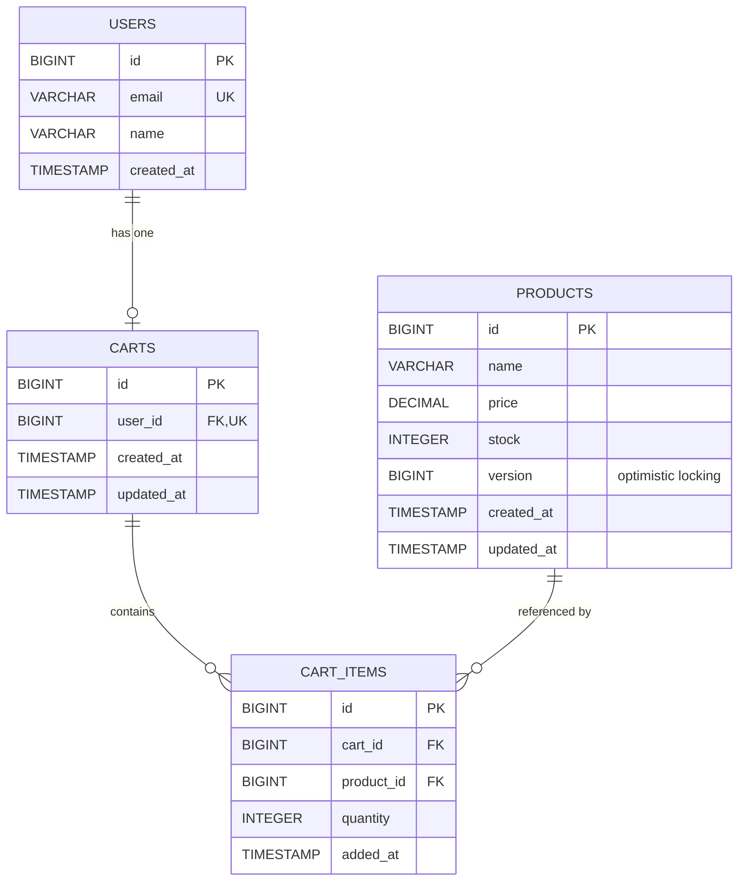
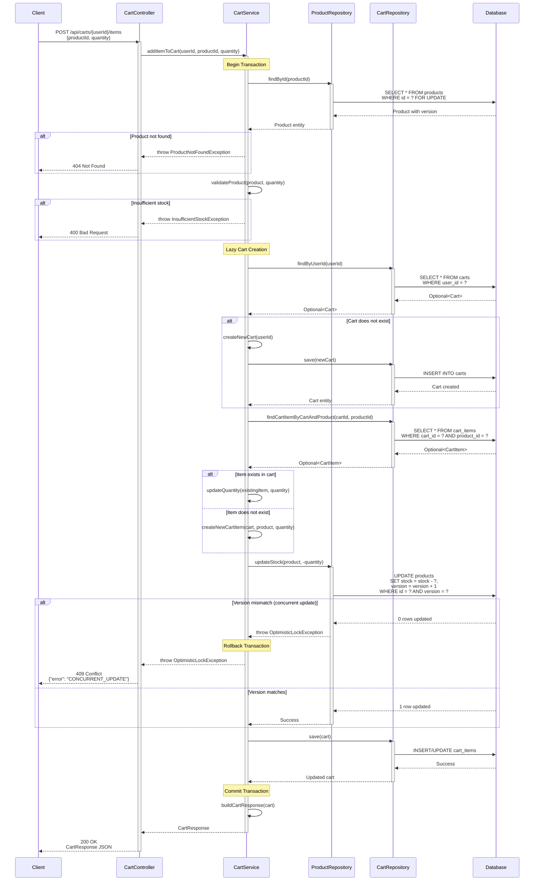

# Low Level Design (LLD) - E-Commerce Cart Management System

## 1. Document Information

**Project Name:** E-Commerce Cart Management System
**Document Version:** 1.0
**Last Updated:** 2024
**Author:** Enterprise Documentation Generation Agent
**Status:** Final

---

## 2. Executive Summary

This Low Level Design document provides comprehensive technical specifications for the E-Commerce Cart Management System. The system enables users to manage shopping carts with features including cart creation, item addition/removal, quantity updates, and cart retrieval.

---

## 3. System Architecture Overview

### 3.1 Architecture Pattern
- **Pattern:** Layered Architecture (MVC)
- **Framework:** Spring Boot
- **Database:** PostgreSQL
- **ORM:** Spring Data JPA with Hibernate

### 3.2 Layer Breakdown

#### Presentation Layer
- REST Controllers
- Request/Response DTOs
- Exception Handlers

#### Business Logic Layer
- Service Classes
- Business Validation
- Transaction Management

#### Data Access Layer
- JPA Repositories
- Entity Models
- Database Interactions

#### Database Layer
- PostgreSQL RDBMS
- Relational Schema
- Constraints and Indexes

---

## 4. Component Design

### 4.1 Controller Layer

#### CartController

**Responsibilities:**
- Handle HTTP requests for cart operations
- Validate request parameters
- Transform DTOs to domain objects
- Return appropriate HTTP responses

**Endpoints:**

```java
@RestController
@RequestMapping("/api/carts")
public class CartController {
    
    @PostMapping("/{userId}/items")
    public ResponseEntity<CartResponse> addItemToCart(
        @PathVariable Long userId,
        @RequestBody AddItemRequest request
    );
    
    @GetMapping("/{userId}")
    public ResponseEntity<CartResponse> getCart(
        @PathVariable Long userId
    );
    
    @PutMapping("/{userId}/items/{productId}")
    public ResponseEntity<CartResponse> updateItemQuantity(
        @PathVariable Long userId,
        @PathVariable Long productId,
        @RequestBody UpdateQuantityRequest request
    );
    
    @DeleteMapping("/{userId}/items/{productId}")
    public ResponseEntity<Void> removeItemFromCart(
        @PathVariable Long userId,
        @PathVariable Long productId
    );
}
```

### 4.2 Service Layer

#### CartService

**Responsibilities:**
- Implement business logic for cart operations
- Manage transactions
- Handle lazy cart creation
- Implement optimistic locking for product updates
- Validate business rules

**Key Methods:**

```java
@Service
@Transactional
public class CartService {
    
    public CartResponse addItemToCart(Long userId, Long productId, Integer quantity);
    
    public CartResponse getCartByUserId(Long userId);
    
    public CartResponse updateItemQuantity(Long userId, Long productId, Integer quantity);
    
    public void removeItemFromCart(Long userId, Long productId);
    
    private Cart getOrCreateCart(Long userId);
    
    private void validateProduct(Product product, Integer quantity);
}
```

**Business Rules:**
1. Cart is created lazily (only when first item is added)
2. Product stock must be sufficient for requested quantity
3. Quantity must be positive (> 0)
4. Duplicate items in cart update quantity instead of creating new entries
5. Optimistic locking prevents concurrent stock updates

### 4.3 Repository Layer

#### CartRepository

```java
@Repository
public interface CartRepository extends JpaRepository<Cart, Long> {
    Optional<Cart> findByUserId(Long userId);
}
```

#### CartItemRepository

```java
@Repository
public interface CartItemRepository extends JpaRepository<CartItem, Long> {
    Optional<CartItem> findByCartIdAndProductId(Long cartId, Long productId);
    List<CartItem> findByCartId(Long cartId);
}
```

#### ProductRepository

```java
@Repository
public interface ProductRepository extends JpaRepository<Product, Long> {
    @Lock(LockModeType.OPTIMISTIC)
    Optional<Product> findById(Long id);
}
```

---

## 5. Data Model Design

### 5.1 Entity Specifications

#### User Entity

```java
@Entity
@Table(name = "users")
public class User {
    @Id
    @GeneratedValue(strategy = GenerationType.IDENTITY)
    private Long id;
    
    @Column(nullable = false, unique = true)
    private String email;
    
    @Column(nullable = false)
    private String name;
    
    @OneToOne(mappedBy = "user", cascade = CascadeType.ALL)
    private Cart cart;
}
```

#### Product Entity

```java
@Entity
@Table(name = "products")
public class Product {
    @Id
    @GeneratedValue(strategy = GenerationType.IDENTITY)
    private Long id;
    
    @Column(nullable = false)
    private String name;
    
    @Column(nullable = false)
    private BigDecimal price;
    
    @Column(nullable = false)
    private Integer stock;
    
    @Version
    private Long version; // For optimistic locking
}
```

#### Cart Entity

```java
@Entity
@Table(name = "carts")
public class Cart {
    @Id
    @GeneratedValue(strategy = GenerationType.IDENTITY)
    private Long id;
    
    @OneToOne
    @JoinColumn(name = "user_id", nullable = false, unique = true)
    private User user;
    
    @OneToMany(mappedBy = "cart", cascade = CascadeType.ALL, orphanRemoval = true)
    private List<CartItem> items = new ArrayList<>();
    
    @Column(name = "created_at", nullable = false)
    private LocalDateTime createdAt;
    
    @Column(name = "updated_at")
    private LocalDateTime updatedAt;
}
```

#### CartItem Entity

```java
@Entity
@Table(name = "cart_items")
public class CartItem {
    @Id
    @GeneratedValue(strategy = GenerationType.IDENTITY)
    private Long id;
    
    @ManyToOne
    @JoinColumn(name = "cart_id", nullable = false)
    private Cart cart;
    
    @ManyToOne
    @JoinColumn(name = "product_id", nullable = false)
    private Product product;
    
    @Column(nullable = false)
    private Integer quantity;
    
    @Column(name = "added_at", nullable = false)
    private LocalDateTime addedAt;
}
```

---

## 6. API Specifications

### 6.1 Add Item to Cart

**Endpoint:** `POST /api/carts/{userId}/items`

**Request Body:**
```json
{
  "productId": 123,
  "quantity": 2
}
```

**Response (200 OK):**
```json
{
  "cartId": 456,
  "userId": 789,
  "items": [
    {
      "productId": 123,
      "productName": "Laptop",
      "price": 999.99,
      "quantity": 2,
      "subtotal": 1999.98
    }
  ],
  "totalAmount": 1999.98,
  "itemCount": 1
}
```

**Error Responses:**
- `404 Not Found`: Product not found
- `400 Bad Request`: Insufficient stock or invalid quantity
- `409 Conflict`: Optimistic locking failure

### 6.2 Get Cart

**Endpoint:** `GET /api/carts/{userId}`

**Response (200 OK):**
```json
{
  "cartId": 456,
  "userId": 789,
  "items": [...],
  "totalAmount": 1999.98,
  "itemCount": 1
}
```

**Error Responses:**
- `404 Not Found`: Cart not found for user

### 6.3 Update Item Quantity

**Endpoint:** `PUT /api/carts/{userId}/items/{productId}`

**Request Body:**
```json
{
  "quantity": 5
}
```

**Response (200 OK):** Same as Add Item response

### 6.4 Remove Item from Cart

**Endpoint:** `DELETE /api/carts/{userId}/items/{productId}`

**Response:** `204 No Content`

---

## 7. Transaction Management

### 7.1 Transaction Boundaries

- All service methods are transactional (`@Transactional`)
- Read operations use `readOnly = true`
- Write operations use default transaction settings

### 7.2 Optimistic Locking Strategy

**Implementation:**
- Product entity includes `@Version` field
- Concurrent updates to product stock trigger `OptimisticLockException`
- Exception is caught and translated to HTTP 409 Conflict

**Flow:**
```
1. Read product with current version
2. Validate stock availability
3. Update stock quantity
4. On commit, Hibernate checks version
5. If version changed, throw OptimisticLockException
6. Client receives 409 and can retry
```

---

## 8. Exception Handling

### 8.1 Global Exception Handler

```java
@RestControllerAdvice
public class GlobalExceptionHandler {
    
    @ExceptionHandler(ProductNotFoundException.class)
    public ResponseEntity<ErrorResponse> handleProductNotFound(ProductNotFoundException ex) {
        return ResponseEntity.status(HttpStatus.NOT_FOUND)
            .body(new ErrorResponse("PRODUCT_NOT_FOUND", ex.getMessage()));
    }
    
    @ExceptionHandler(InsufficientStockException.class)
    public ResponseEntity<ErrorResponse> handleInsufficientStock(InsufficientStockException ex) {
        return ResponseEntity.status(HttpStatus.BAD_REQUEST)
            .body(new ErrorResponse("INSUFFICIENT_STOCK", ex.getMessage()));
    }
    
    @ExceptionHandler(OptimisticLockException.class)
    public ResponseEntity<ErrorResponse> handleOptimisticLock(OptimisticLockException ex) {
        return ResponseEntity.status(HttpStatus.CONFLICT)
            .body(new ErrorResponse("CONCURRENT_UPDATE", "Resource was modified by another transaction"));
    }
}
```

---

## 9. Performance Considerations

### 9.1 Database Indexing

- Index on `carts.user_id` for fast cart lookup
- Index on `cart_items.cart_id` for efficient item retrieval
- Index on `cart_items.product_id` for product-based queries
- Composite index on `(cart_id, product_id)` for duplicate detection

### 9.2 Query Optimization

- Use `@EntityGraph` or JOIN FETCH for eager loading cart items
- Implement pagination for large carts
- Use projection DTOs to avoid loading unnecessary data

### 9.3 Caching Strategy

- Cache product information (rarely changes)
- Consider Redis for session-based cart data
- Implement cache invalidation on product updates

---

## 10. Security Considerations

### 10.1 Authentication & Authorization

- Verify user identity before cart operations
- Ensure users can only access their own carts
- Implement JWT or session-based authentication

### 10.2 Input Validation

- Validate quantity is positive integer
- Sanitize all user inputs
- Implement rate limiting for API endpoints

---

## 11. Testing Strategy

### 11.1 Unit Tests

- Test service layer business logic
- Mock repository dependencies
- Test exception scenarios

### 11.2 Integration Tests

- Test controller endpoints with MockMvc
- Test database interactions with test containers
- Test transaction rollback scenarios

### 11.3 Test Scenarios

1. Add item to new cart (lazy creation)
2. Add duplicate item (quantity update)
3. Add item with insufficient stock
4. Concurrent product updates (optimistic locking)
5. Remove last item from cart
6. Update quantity to zero (should remove item)

---

## 12. Deployment Configuration

### 12.1 Application Properties

```properties
spring.datasource.url=jdbc:postgresql://localhost:5432/ecommerce
spring.datasource.username=${DB_USERNAME}
spring.datasource.password=${DB_PASSWORD}
spring.jpa.hibernate.ddl-auto=validate
spring.jpa.properties.hibernate.dialect=org.hibernate.dialect.PostgreSQLDialect
spring.jpa.properties.hibernate.jdbc.batch_size=20
```

### 12.2 Connection Pooling

```properties
spring.datasource.hikari.maximum-pool-size=10
spring.datasource.hikari.minimum-idle=5
spring.datasource.hikari.connection-timeout=30000
```

---

# ENHANCED TECHNICAL ARTIFACTS

## 13. Entity-Relationship Diagram (ERD)

The following Mermaid diagram illustrates the database schema with all entities, relationships, primary keys (PK), foreign keys (FK), and the version column for optimistic locking:



**Key Relationships:**
- **USERS to CARTS**: One-to-One relationship (one user has at most one cart)
- **CARTS to CART_ITEMS**: One-to-Many relationship (one cart contains multiple items)
- **PRODUCTS to CART_ITEMS**: One-to-Many relationship (one product can be in multiple carts)
- **Optimistic Locking**: PRODUCTS.version column ensures concurrent update safety

---

## 14. Sequence Diagram - Add to Cart Flow

The following Mermaid sequence diagram illustrates the complete "Add to Cart" operation, including lazy cart creation and optimistic locking exception handling:



**Key Flow Points:**
1. **Lazy Cart Creation**: Cart is only created when the first item is added
2. **Optimistic Locking**: Product version is checked during stock update
3. **Concurrent Update Handling**: Version mismatch triggers rollback and 409 response
4. **Transaction Boundary**: Entire operation is wrapped in a single transaction
5. **Duplicate Item Handling**: Existing items have quantity updated instead of creating duplicates

---

## 15. Database Model - PostgreSQL DDL Scripts

The following SQL DDL scripts create the complete database schema with all constraints, indexes, and relationships:

```sql
-- ============================================
-- E-COMMERCE CART MANAGEMENT SYSTEM
-- PostgreSQL Database Schema
-- ============================================

-- Drop existing tables (for clean setup)
DROP TABLE IF EXISTS cart_items CASCADE;
DROP TABLE IF EXISTS carts CASCADE;
DROP TABLE IF EXISTS products CASCADE;
DROP TABLE IF EXISTS users CASCADE;

-- ============================================
-- TABLE: users
-- ============================================
CREATE TABLE users (
    id BIGSERIAL PRIMARY KEY,
    email VARCHAR(255) NOT NULL UNIQUE,
    name VARCHAR(255) NOT NULL,
    created_at TIMESTAMP NOT NULL DEFAULT CURRENT_TIMESTAMP,
    updated_at TIMESTAMP DEFAULT CURRENT_TIMESTAMP,
    
    CONSTRAINT users_email_not_empty CHECK (email <> ''),
    CONSTRAINT users_name_not_empty CHECK (name <> '')
);

COMMENT ON TABLE users IS 'Stores user account information';
COMMENT ON COLUMN users.email IS 'Unique email address for user authentication';
COMMENT ON COLUMN users.version IS 'Version number for optimistic locking';

-- ============================================
-- TABLE: products
-- ============================================
CREATE TABLE products (
    id BIGSERIAL PRIMARY KEY,
    name VARCHAR(255) NOT NULL,
    description TEXT,
    price DECIMAL(10, 2) NOT NULL,
    stock INTEGER NOT NULL DEFAULT 0,
    version BIGINT NOT NULL DEFAULT 0,
    created_at TIMESTAMP NOT NULL DEFAULT CURRENT_TIMESTAMP,
    updated_at TIMESTAMP DEFAULT CURRENT_TIMESTAMP,
    
    CONSTRAINT products_name_not_empty CHECK (name <> ''),
    CONSTRAINT products_price_positive CHECK (price >= 0),
    CONSTRAINT products_stock_non_negative CHECK (stock >= 0)
);

COMMENT ON TABLE products IS 'Stores product catalog information';
COMMENT ON COLUMN products.version IS 'Version number for optimistic locking on stock updates';
COMMENT ON COLUMN products.stock IS 'Available inventory quantity';

-- ============================================
-- TABLE: carts
-- ============================================
CREATE TABLE carts (
    id BIGSERIAL PRIMARY KEY,
    user_id BIGINT NOT NULL UNIQUE,
    created_at TIMESTAMP NOT NULL DEFAULT CURRENT_TIMESTAMP,
    updated_at TIMESTAMP DEFAULT CURRENT_TIMESTAMP,
    
    CONSTRAINT fk_carts_user_id 
        FOREIGN KEY (user_id) 
        REFERENCES users(id) 
        ON DELETE CASCADE
);

COMMENT ON TABLE carts IS 'Stores shopping cart information for users';
COMMENT ON COLUMN carts.user_id IS 'One-to-one relationship with users table';

-- ============================================
-- TABLE: cart_items
-- ============================================
CREATE TABLE cart_items (
    id BIGSERIAL PRIMARY KEY,
    cart_id BIGINT NOT NULL,
    product_id BIGINT NOT NULL,
    quantity INTEGER NOT NULL,
    added_at TIMESTAMP NOT NULL DEFAULT CURRENT_TIMESTAMP,
    
    CONSTRAINT fk_cart_items_cart_id 
        FOREIGN KEY (cart_id) 
        REFERENCES carts(id) 
        ON DELETE CASCADE,
    
    CONSTRAINT fk_cart_items_product_id 
        FOREIGN KEY (product_id) 
        REFERENCES products(id) 
        ON DELETE CASCADE,
    
    CONSTRAINT cart_items_quantity_positive CHECK (quantity > 0),
    CONSTRAINT cart_items_unique_product UNIQUE (cart_id, product_id)
);

COMMENT ON TABLE cart_items IS 'Stores individual items within shopping carts';
COMMENT ON COLUMN cart_items.quantity IS 'Quantity of product in cart (must be > 0)';
COMMENT ON CONSTRAINT cart_items_unique_product ON cart_items IS 'Prevents duplicate products in same cart';

-- ============================================
-- INDEXES FOR PERFORMANCE OPTIMIZATION
-- ============================================

-- Index for fast user lookup by email (authentication)
CREATE INDEX idx_users_email ON users(email);

-- Index for fast cart lookup by user_id
CREATE INDEX idx_carts_user_id ON carts(user_id);

-- Index for fast cart items lookup by cart_id
CREATE INDEX idx_cart_items_cart_id ON cart_items(cart_id);

-- Index for fast cart items lookup by product_id
CREATE INDEX idx_cart_items_product_id ON cart_items(product_id);

-- Composite index for duplicate detection and fast lookup
CREATE INDEX idx_cart_items_cart_product ON cart_items(cart_id, product_id);

-- Index for product name searches
CREATE INDEX idx_products_name ON products(name);

-- ============================================
-- TRIGGERS FOR AUTOMATIC TIMESTAMP UPDATES
-- ============================================

-- Function to update updated_at timestamp
CREATE OR REPLACE FUNCTION update_updated_at_column()
RETURNS TRIGGER AS $$
BEGIN
    NEW.updated_at = CURRENT_TIMESTAMP;
    RETURN NEW;
END;
$$ LANGUAGE plpgsql;

-- Trigger for users table
CREATE TRIGGER trigger_users_updated_at
    BEFORE UPDATE ON users
    FOR EACH ROW
    EXECUTE FUNCTION update_updated_at_column();

-- Trigger for products table
CREATE TRIGGER trigger_products_updated_at
    BEFORE UPDATE ON products
    FOR EACH ROW
    EXECUTE FUNCTION update_updated_at_column();

-- Trigger for carts table
CREATE TRIGGER trigger_carts_updated_at
    BEFORE UPDATE ON carts
    FOR EACH ROW
    EXECUTE FUNCTION update_updated_at_column();

-- ============================================
-- SAMPLE DATA FOR TESTING
-- ============================================

-- Insert sample users
INSERT INTO users (email, name) VALUES
    ('john.doe@example.com', 'John Doe'),
    ('jane.smith@example.com', 'Jane Smith'),
    ('bob.wilson@example.com', 'Bob Wilson');

-- Insert sample products
INSERT INTO products (name, description, price, stock) VALUES
    ('Laptop', 'High-performance laptop with 16GB RAM', 999.99, 50),
    ('Wireless Mouse', 'Ergonomic wireless mouse', 29.99, 200),
    ('USB-C Cable', 'Premium USB-C charging cable', 19.99, 500),
    ('Laptop Bag', 'Durable laptop carrying bag', 49.99, 100),
    ('Keyboard', 'Mechanical keyboard with RGB lighting', 149.99, 75);

-- ============================================
-- VERIFICATION QUERIES
-- ============================================

-- Verify table creation
SELECT 
    table_name, 
    table_type
FROM 
    information_schema.tables
WHERE 
    table_schema = 'public'
    AND table_name IN ('users', 'products', 'carts', 'cart_items')
ORDER BY 
    table_name;

-- Verify indexes
SELECT 
    tablename, 
    indexname, 
    indexdef
FROM 
    pg_indexes
WHERE 
    schemaname = 'public'
    AND tablename IN ('users', 'products', 'carts', 'cart_items')
ORDER BY 
    tablename, indexname;

-- Verify foreign key constraints
SELECT
    tc.table_name,
    tc.constraint_name,
    tc.constraint_type,
    kcu.column_name,
    ccu.table_name AS foreign_table_name,
    ccu.column_name AS foreign_column_name,
    rc.delete_rule
FROM
    information_schema.table_constraints AS tc
    JOIN information_schema.key_column_usage AS kcu
        ON tc.constraint_name = kcu.constraint_name
        AND tc.table_schema = kcu.table_schema
    JOIN information_schema.constraint_column_usage AS ccu
        ON ccu.constraint_name = tc.constraint_name
        AND ccu.table_schema = tc.table_schema
    LEFT JOIN information_schema.referential_constraints AS rc
        ON tc.constraint_name = rc.constraint_name
WHERE
    tc.constraint_type = 'FOREIGN KEY'
    AND tc.table_name IN ('carts', 'cart_items')
ORDER BY
    tc.table_name, tc.constraint_name;

-- ============================================
-- END OF DDL SCRIPT
-- ============================================
```

**Key Database Features:**

1. **Primary Keys**: All tables use BIGSERIAL for auto-incrementing primary keys
2. **Foreign Keys**: Properly defined with ON DELETE CASCADE for referential integrity
3. **Constraints**:
   - NOT NULL constraints on required fields
   - UNIQUE constraints on email and cart-user relationship
   - CHECK constraints for positive quantities and non-negative stock
   - Composite UNIQUE constraint to prevent duplicate products in cart
4. **Optimistic Locking**: version column in products table (default 0, incremented on updates)
5. **Indexes**: Strategic indexes on foreign keys and frequently queried columns
6. **Triggers**: Automatic timestamp updates for updated_at columns
7. **Sample Data**: Initial test data for users and products

---

## 16. Conclusion

This Low Level Design document provides comprehensive technical specifications for implementing the E-Commerce Cart Management System. The design emphasizes:

- **Scalability**: Layered architecture supports horizontal scaling
- **Data Integrity**: Foreign key constraints and optimistic locking
- **Performance**: Strategic indexing and query optimization
- **Maintainability**: Clear separation of concerns and comprehensive documentation
- **Reliability**: Transaction management and exception handling

**Next Steps:**
1. Review and approve design specifications
2. Set up development environment
3. Implement core entities and repositories
4. Develop service layer with business logic
5. Create REST controllers and API endpoints
6. Write comprehensive unit and integration tests
7. Perform load testing and optimization
8. Deploy to staging environment

---

**Document End**