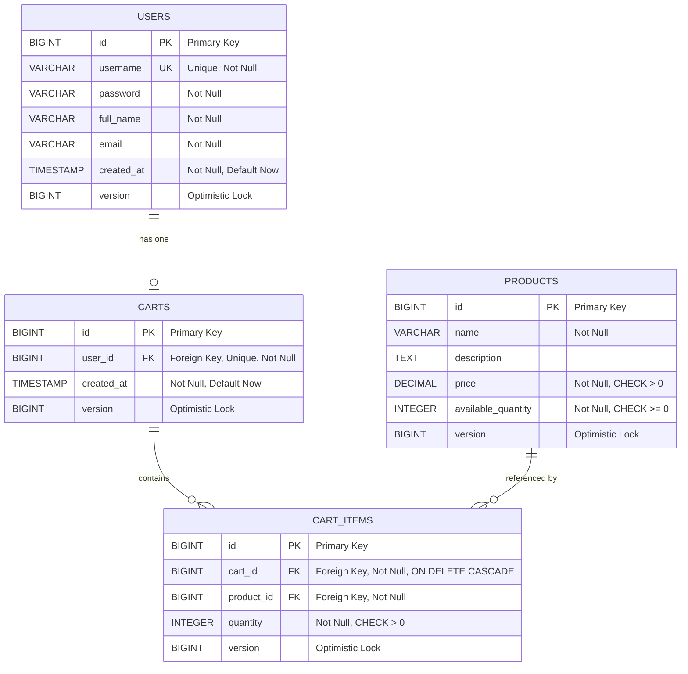

# COMPREHENSIVE BACKEND ENGINEERING SPECIFICATION
## SCRUM-96: Implement Core Shopping Cart Backend Services Using Spring Boot MVC

---

## EXECUTIVE SUMMARY

### Project Overview
This document provides a complete Low-Level Design (LLD) specification for implementing a shopping cart backend system using Java Spring Boot MVC architecture. The system supports user management, product catalog search, and shopping cart operations with strict business rules and database-first validation.

### Key Objectives
- Implement stateless user authentication and profile management
- Enable product search with case-insensitive keyword matching
- Provide lazy cart creation with automatic lifecycle management
- Enforce strict data integrity through database constraints
- Ensure cart cleanup on logout (no session persistence)

### Technical Stack
- **Framework**: Spring Boot 3.x
- **Architecture**: MVC (Controller → Service → Repository)
- **Database**: Relational (MySQL/PostgreSQL recommended)
- **API Style**: RESTful
- **Authentication**: Stateless (no session storage at DB level)

### Success Metrics
- All APIs conform to MVC layering
- Database constraints enforce business rules
- Cart lifecycle behaves as specified
- Zero cart persistence across sessions
- Case-insensitive product search operational

---

## DETAILED ANALYSIS

### Business Context
The shopping cart system serves as the core transactional component for an e-commerce platform. It must handle concurrent user operations while maintaining data consistency and enforcing business rules at the database level.

### Functional Requirements Breakdown

#### 1. User Management Domain
**Sign-Up Flow**:
- User provides: username, password, full name, email
- System validates username uniqueness
- System creates user record with timestamp
- Returns user details (excluding password)

**Sign-In Flow**:
- User provides: username, password
- System validates credentials
- Returns user details on success
- No session/token stored in database

**Profile Operations**:
- View: Display username, full name, email, created date
- Update: Modify full name and email only
- Constraints: Username immutable, password changes out of scope

#### 2. Product Catalog Domain
**Search Capability**:
- Accepts keyword parameter
- Performs case-insensitive matching on name/description
- Returns: product ID, name, description, price, available quantity
- Only existing products are searchable

#### 3. Shopping Cart Domain
**Cart Lifecycle**:
- **Creation**: Lazy - cart created only when first product added
- **Active State**: Cart exists with at least one item
- **Deletion**: Automatic when last item removed OR user logs out

**Cart Operations**:
- **Add Product**: Creates cart if missing, adds item with quantity > 0
- **Update Quantity**: Modifies existing item quantity (must remain > 0)
- **Remove Product**: Deletes specific item, auto-deletes cart if last item
- **View Cart**: Lists all items with per-item and grand totals

### Data Integrity Rules

#### Entity-Level Constraints
1. **User**:
   - Username: UNIQUE, NOT NULL
   - Email: NOT NULL
   - Password: NOT NULL (hashed)
   - Created date: NOT NULL, DEFAULT CURRENT_TIMESTAMP

2. **Product**:
   - Name: NOT NULL
   - Price: NOT NULL, > 0
   - Available quantity: NOT NULL, >= 0

3. **Cart**:
   - User ID: FOREIGN KEY → users.id, UNIQUE
   - Created date: NOT NULL, DEFAULT CURRENT_TIMESTAMP

4. **Cart Item**:
   - Cart ID: FOREIGN KEY → carts.id, ON DELETE CASCADE
   - Product ID: FOREIGN KEY → products.id
   - Quantity: NOT NULL, > 0
   - UNIQUE(cart_id, product_id)

#### Business Rule Enforcement
- One active cart per user (enforced by UNIQUE constraint on cart.user_id)
- Cart cannot exist without items (enforced by application logic + cascade delete)
- Product must exist before cart operations (enforced by FOREIGN KEY)
- Quantity must always be positive (enforced by CHECK constraint)

### Non-Functional Requirements
- **Performance**: Sub-200ms response time for cart operations
- **Scalability**: Support 1000+ concurrent users
- **Reliability**: 99.9% uptime
- **Security**: Password hashing (BCrypt), input validation
- **Maintainability**: Clean code, comprehensive logging

---

## DELIVERABLES

### 1. DOMAIN ENTITIES

#### 1.1 User Entity

```java
package com.ecommerce.shoppingcart.entity;

import jakarta.persistence.*;
import lombok.AllArgsConstructor;
import lombok.Data;
import lombok.NoArgsConstructor;
import org.hibernate.annotations.CreationTimestamp;

import java.time.LocalDateTime;

@Entity
@Table(name = "users", uniqueConstraints = {
    @UniqueConstraint(columnNames = "username")
})
@Data
@NoArgsConstructor
@AllArgsConstructor
public class User {
    
    @Id
    @GeneratedValue(strategy = GenerationType.IDENTITY)
    private Long id;
    
    @Column(nullable = false, unique = true, length = 50)
    private String username;
    
    @Column(nullable = false)
    private String password; // BCrypt hashed
    
    @Column(nullable = false, length = 100)
    private String fullName;
    
    @Column(nullable = false, length = 100)
    private String email;
    
    @CreationTimestamp
    @Column(nullable = false, updatable = false)
    private LocalDateTime createdAt;
    
    @OneToOne(mappedBy = "user", cascade = CascadeType.ALL, orphanRemoval = true)
    private Cart cart;
}
```

#### 1.2 Product Entity

```java
package com.ecommerce.shoppingcart.entity;

import jakarta.persistence.*;
import lombok.AllArgsConstructor;
import lombok.Data;
import lombok.NoArgsConstructor;

import java.math.BigDecimal;

@Entity
@Table(name = "products")
@Data
@NoArgsConstructor
@AllArgsConstructor
public class Product {
    
    @Id
    @GeneratedValue(strategy = GenerationType.IDENTITY)
    private Long id;
    
    @Column(nullable = false, length = 200)
    private String name;
    
    @Column(columnDefinition = "TEXT")
    private String description;
    
    @Column(nullable = false, precision = 10, scale = 2)
    private BigDecimal price;
    
    @Column(nullable = false)
    private Integer availableQuantity;
    
    @Version
    private Long version; // For optimistic locking
}
```

#### 1.3 Cart Entity

```java
package com.ecommerce.shoppingcart.entity;

import jakarta.persistence.*;
import lombok.AllArgsConstructor;
import lombok.Data;
import lombok.NoArgsConstructor;
import org.hibernate.annotations.CreationTimestamp;

import java.time.LocalDateTime;
import java.util.ArrayList;
import java.util.List;

@Entity
@Table(name = "carts")
@Data
@NoArgsConstructor
@AllArgsConstructor
public class Cart {
    
    @Id
    @GeneratedValue(strategy = GenerationType.IDENTITY)
    private Long id;
    
    @OneToOne
    @JoinColumn(name = "user_id", nullable = false, unique = true)
    private User user;
    
    @CreationTimestamp
    @Column(nullable = false, updatable = false)
    private LocalDateTime createdAt;
    
    @OneToMany(mappedBy = "cart", cascade = CascadeType.ALL, orphanRemoval = true)
    private List<CartItem> items = new ArrayList<>();
    
    public void addItem(CartItem item) {
        items.add(item);
        item.setCart(this);
    }
    
    public void removeItem(CartItem item) {
        items.remove(item);
        item.setCart(null);
    }
}
```

#### 1.4 CartItem Entity

```java
package com.ecommerce.shoppingcart.entity;

import jakarta.persistence.*;
import lombok.AllArgsConstructor;
import lombok.Data;
import lombok.NoArgsConstructor;

@Entity
@Table(name = "cart_items", uniqueConstraints = {
    @UniqueConstraint(columnNames = {"cart_id", "product_id"})
})
@Data
@NoArgsConstructor
@AllArgsConstructor
public class CartItem {
    
    @Id
    @GeneratedValue(strategy = GenerationType.IDENTITY)
    private Long id;
    
    @ManyToOne(fetch = FetchType.LAZY)
    @JoinColumn(name = "cart_id", nullable = false)
    private Cart cart;
    
    @ManyToOne(fetch = FetchType.EAGER)
    @JoinColumn(name = "product_id", nullable = false)
    private Product product;
    
    @Column(nullable = false)
    private Integer quantity;
    
    @Version
    private Long version; // For optimistic locking
}
```

---

# Technical Artifacts

## 1. Entity-Relationship Diagram (ERD)

The following ERD illustrates the database schema with primary keys (PK), foreign keys (FK), and version columns for optimistic locking:



**Key Relationships:**
- **USERS to CARTS**: One-to-One relationship (one user has one cart)
- **CARTS to CART_ITEMS**: One-to-Many relationship (one cart contains multiple items)
- **PRODUCTS to CART_ITEMS**: One-to-Many relationship (one product can be in multiple carts)
- **Version Columns**: All entities include a `version` column for optimistic locking to handle concurrent updates

---

## 2. Add to Cart Sequence Diagram

The following sequence diagram illustrates the complete flow for adding an item to the cart, including lazy cart creation and optimistic locking exception handling:

```mermaid
sequenceDiagram
    participant Client
    participant CartController
    participant CartService
    participant ProductRepository
    participant CartRepository
    participant Database
    
    Client->>CartController: POST /api/users/{userId}/cart/items<br/>{productId, quantity}
    activate CartController
    
    CartController->>CartController: Validate Request
    CartController->>CartService: addItemToCart(userId, request)
    activate CartService
    
    Note over CartService: Validate Product
    CartService->>ProductRepository: findById(productId)
    activate ProductRepository
    ProductRepository->>Database: SELECT * FROM products WHERE id = ?
    activate Database
    Database-->>ProductRepository: Product Data
    deactivate Database
    ProductRepository-->>CartService: Product
    deactivate ProductRepository
    
    alt Product Not Found
        CartService-->>CartController: throw ProductNotFoundException
        CartController-->>Client: 404 Not Found
    end
    
    Note over CartService: Check Stock Availability
    alt Insufficient Stock
        CartService-->>CartController: throw InsufficientStockException
        CartController-->>Client: 400 Bad Request
    end
    
    Note over CartService: Get or Create Cart (Lazy Creation)
    CartService->>CartRepository: findByUserId(userId)
    activate CartRepository
    CartRepository->>Database: SELECT * FROM carts WHERE user_id = ?
    activate Database
    Database-->>CartRepository: Cart Data or Empty
    deactivate Database
    CartRepository-->>CartService: Optional<Cart>
    deactivate CartRepository
    
    alt Cart Does Not Exist
        Note over CartService: Lazy Cart Creation
        CartService->>CartService: createNewCart(userId)
        CartService->>Database: INSERT INTO carts (user_id, created_at, version)
        activate Database
        Database-->>CartService: New Cart Created
        deactivate Database
    end
    
    Note over CartService: Add or Update Cart Item
    alt Item Already in Cart
        CartService->>CartService: Update existing item quantity
    else New Item
        CartService->>CartService: Create new CartItem
    end
    
    Note over CartService: Save Cart with Optimistic Locking
    CartService->>CartRepository: save(cart)
    activate CartRepository
    CartRepository->>Database: UPDATE carts SET ... WHERE id = ? AND version = ?
    activate Database
    
    alt Optimistic Lock Exception
        Database-->>CartRepository: 0 rows updated (version mismatch)
        CartRepository-->>CartService: throw OptimisticLockException
        deactivate Database
        deactivate CartRepository
        CartService-->>CartController: OptimisticLockException
        deactivate CartService
        CartController-->>Client: 409 Conflict<br/>{"error": "Cart was modified, please retry"}
        deactivate CartController
    else Success
        Database-->>CartRepository: Cart Updated
        deactivate Database
        CartRepository-->>CartService: Updated Cart
        deactivate CartRepository
        
        CartService->>CartService: convertToDTO(cart)
        CartService-->>CartController: CartDTO
        deactivate CartService
        
        CartController-->>Client: 201 Created<br/>CartDTO with items and total
        deactivate CartController
    end
```

**Key Flow Points:**
1. **Request Validation**: Controller validates incoming request
2. **Product Validation**: Service checks if product exists and has sufficient stock
3. **Lazy Cart Creation**: Cart is created only when first item is added
4. **Item Management**: Existing items are updated, new items are added
5. **Optimistic Locking**: Version column prevents lost updates in concurrent scenarios
6. **Error Handling**: Specific exceptions for different failure scenarios

---

## 3. Database Model (SQL DDL)

Complete PostgreSQL DDL scripts for creating the shopping cart database schema:

```sql
-- ============================================
-- Shopping Cart Database Schema
-- Database: PostgreSQL 14+
-- ============================================

-- Drop tables if they exist (for clean setup)
DROP TABLE IF EXISTS cart_items CASCADE;
DROP TABLE IF EXISTS carts CASCADE;
DROP TABLE IF EXISTS products CASCADE;
DROP TABLE IF EXISTS users CASCADE;

-- ============================================
-- USERS TABLE
-- ============================================
CREATE TABLE users (
    id BIGSERIAL PRIMARY KEY,
    username VARCHAR(50) NOT NULL UNIQUE,
    password VARCHAR(255) NOT NULL,
    full_name VARCHAR(100) NOT NULL,
    email VARCHAR(100) NOT NULL,
    created_at TIMESTAMP NOT NULL DEFAULT CURRENT_TIMESTAMP,
    version BIGINT NOT NULL DEFAULT 0,
    
    CONSTRAINT users_username_check CHECK (LENGTH(username) >= 3),
    CONSTRAINT users_email_check CHECK (email ~* '^[A-Za-z0-9._%+-]+@[A-Za-z0-9.-]+\.[A-Za-z]{2,}$')
);

-- Indexes for users table
CREATE UNIQUE INDEX idx_users_username ON users(username);
CREATE INDEX idx_users_email ON users(email);
CREATE INDEX idx_users_created_at ON users(created_at);

-- Comments for users table
COMMENT ON TABLE users IS 'Stores user account information';
COMMENT ON COLUMN users.version IS 'Optimistic locking version column';
COMMENT ON COLUMN users.username IS 'Unique username for authentication';

-- ============================================
-- PRODUCTS TABLE
-- ============================================
CREATE TABLE products (
    id BIGSERIAL PRIMARY KEY,
    name VARCHAR(200) NOT NULL,
    description TEXT,
    price DECIMAL(10, 2) NOT NULL,
    available_quantity INTEGER NOT NULL DEFAULT 0,
    version BIGINT NOT NULL DEFAULT 0,
    created_at TIMESTAMP NOT NULL DEFAULT CURRENT_TIMESTAMP,
    updated_at TIMESTAMP NOT NULL DEFAULT CURRENT_TIMESTAMP,
    
    CONSTRAINT products_price_check CHECK (price > 0),
    CONSTRAINT products_quantity_check CHECK (available_quantity >= 0)
);

-- Indexes for products table
CREATE INDEX idx_products_name ON products(name);
CREATE INDEX idx_products_price ON products(price);
CREATE INDEX idx_products_available_quantity ON products(available_quantity);
CREATE INDEX idx_products_name_description ON products USING gin(to_tsvector('english', name || ' ' || COALESCE(description, '')));

-- Comments for products table
COMMENT ON TABLE products IS 'Stores product catalog information';
COMMENT ON COLUMN products.version IS 'Optimistic locking version column';
COMMENT ON COLUMN products.price IS 'Product price with 2 decimal precision';
COMMENT ON COLUMN products.available_quantity IS 'Available stock quantity';

-- ============================================
-- CARTS TABLE
-- ============================================
CREATE TABLE carts (
    id BIGSERIAL PRIMARY KEY,
    user_id BIGINT NOT NULL UNIQUE,
    created_at TIMESTAMP NOT NULL DEFAULT CURRENT_TIMESTAMP,
    version BIGINT NOT NULL DEFAULT 0,
    
    CONSTRAINT fk_carts_user_id 
        FOREIGN KEY (user_id) 
        REFERENCES users(id) 
        ON DELETE CASCADE
);

-- Indexes for carts table
CREATE UNIQUE INDEX idx_carts_user_id ON carts(user_id);
CREATE INDEX idx_carts_created_at ON carts(created_at);

-- Comments for carts table
COMMENT ON TABLE carts IS 'Stores shopping cart information for users';
COMMENT ON COLUMN carts.version IS 'Optimistic locking version column';
COMMENT ON COLUMN carts.user_id IS 'One-to-one relationship with users table';

-- ============================================
-- CART_ITEMS TABLE
-- ============================================
CREATE TABLE cart_items (
    id BIGSERIAL PRIMARY KEY,
    cart_id BIGINT NOT NULL,
    product_id BIGINT NOT NULL,
    quantity INTEGER NOT NULL,
    version BIGINT NOT NULL DEFAULT 0,
    created_at TIMESTAMP NOT NULL DEFAULT CURRENT_TIMESTAMP,
    updated_at TIMESTAMP NOT NULL DEFAULT CURRENT_TIMESTAMP,
    
    CONSTRAINT fk_cart_items_cart_id 
        FOREIGN KEY (cart_id) 
        REFERENCES carts(id) 
        ON DELETE CASCADE,
    
    CONSTRAINT fk_cart_items_product_id 
        FOREIGN KEY (product_id) 
        REFERENCES products(id) 
        ON DELETE CASCADE,
    
    CONSTRAINT cart_items_quantity_check CHECK (quantity > 0),
    
    -- Ensure a product appears only once per cart
    CONSTRAINT uk_cart_items_cart_product UNIQUE (cart_id, product_id)
);

-- Indexes for cart_items table
CREATE INDEX idx_cart_items_cart_id ON cart_items(cart_id);
CREATE INDEX idx_cart_items_product_id ON cart_items(product_id);
CREATE INDEX idx_cart_items_created_at ON cart_items(created_at);
CREATE UNIQUE INDEX idx_cart_items_cart_product ON cart_items(cart_id, product_id);

-- Comments for cart_items table
COMMENT ON TABLE cart_items IS 'Stores individual items in shopping carts';
COMMENT ON COLUMN cart_items.version IS 'Optimistic locking version column';
COMMENT ON COLUMN cart_items.quantity IS 'Quantity of product in cart (must be > 0)';
COMMENT ON CONSTRAINT uk_cart_items_cart_product ON cart_items IS 'Ensures product uniqueness per cart';

-- ============================================
-- TRIGGERS FOR AUTOMATIC TIMESTAMP UPDATES
-- ============================================

-- Function to update updated_at timestamp
CREATE OR REPLACE FUNCTION update_updated_at_column()
RETURNS TRIGGER AS $$
BEGIN
    NEW.updated_at = CURRENT_TIMESTAMP;
    RETURN NEW;
END;
$$ LANGUAGE plpgsql;

-- Trigger for products table
CREATE TRIGGER trigger_products_updated_at
    BEFORE UPDATE ON products
    FOR EACH ROW
    EXECUTE FUNCTION update_updated_at_column();

-- Trigger for cart_items table
CREATE TRIGGER trigger_cart_items_updated_at
    BEFORE UPDATE ON cart_items
    FOR EACH ROW
    EXECUTE FUNCTION update_updated_at_column();

-- ============================================
-- SAMPLE DATA (Optional - for testing)
-- ============================================

-- Insert sample users
INSERT INTO users (username, password, full_name, email) VALUES
('john_doe', '$2a$10$encrypted_password_hash_1', 'John Doe', 'john.doe@example.com'),
('jane_smith', '$2a$10$encrypted_password_hash_2', 'Jane Smith', 'jane.smith@example.com'),
('bob_wilson', '$2a$10$encrypted_password_hash_3', 'Bob Wilson', 'bob.wilson@example.com');

-- Insert sample products
INSERT INTO products (name, description, price, available_quantity) VALUES
('Laptop', 'High-performance laptop with 16GB RAM and 512GB SSD', 999.99, 50),
('Wireless Mouse', 'Ergonomic wireless mouse with USB receiver', 29.99, 200),
('Mechanical Keyboard', 'RGB mechanical keyboard with blue switches', 89.99, 100),
('USB-C Hub', '7-in-1 USB-C hub with HDMI and ethernet ports', 49.99, 150),
('Laptop Stand', 'Adjustable aluminum laptop stand for better ergonomics', 39.99, 75);

-- ============================================
-- VIEWS FOR COMMON QUERIES
-- ============================================

-- View for cart summary with total amount
CREATE OR REPLACE VIEW v_cart_summary AS
SELECT 
    c.id AS cart_id,
    c.user_id,
    u.username,
    u.full_name,
    u.email,
    COUNT(ci.id) AS total_items,
    SUM(ci.quantity) AS total_quantity,
    SUM(ci.quantity * p.price) AS total_amount,
    c.created_at AS cart_created_at
FROM carts c
INNER JOIN users u ON c.user_id = u.id
LEFT JOIN cart_items ci ON c.id = ci.cart_id
LEFT JOIN products p ON ci.product_id = p.id
GROUP BY c.id, c.user_id, u.username, u.full_name, u.email, c.created_at;

COMMENT ON VIEW v_cart_summary IS 'Provides summary information for each cart including total items and amount';

-- View for detailed cart items
CREATE OR REPLACE VIEW v_cart_details AS
SELECT 
    ci.id AS cart_item_id,
    c.id AS cart_id,
    c.user_id,
    u.username,
    p.id AS product_id,
    p.name AS product_name,
    p.description AS product_description,
    p.price AS unit_price,
    ci.quantity,
    (ci.quantity * p.price) AS subtotal,
    ci.created_at AS added_at,
    ci.updated_at AS last_updated
FROM cart_items ci
INNER JOIN carts c ON ci.cart_id = c.id
INNER JOIN users u ON c.user_id = u.id
INNER JOIN products p ON ci.product_id = p.id;

COMMENT ON VIEW v_cart_details IS 'Provides detailed information for each item in all carts';

-- ============================================
-- PERFORMANCE OPTIMIZATION INDEXES
-- ============================================

-- Composite index for frequent cart item lookups
CREATE INDEX idx_cart_items_cart_product_composite ON cart_items(cart_id, product_id, quantity);

-- Index for product search and filtering
CREATE INDEX idx_products_name_price ON products(name, price);

-- Index for user authentication
CREATE INDEX idx_users_username_password ON users(username, password);

-- ============================================
-- DATABASE STATISTICS AND MAINTENANCE
-- ============================================

-- Analyze tables for query optimization
ANALYZE users;
ANALYZE products;
ANALYZE carts;
ANALYZE cart_items;

-- ============================================
-- END OF DDL SCRIPT
-- ============================================
```

**Key Features of the Database Model:**

1. **Primary Keys**: All tables use `BIGSERIAL` for auto-incrementing primary keys
2. **Foreign Keys**: Proper relationships with `ON DELETE CASCADE` for referential integrity
3. **Constraints**:
   - `NOT NULL` constraints on required fields
   - `UNIQUE` constraints on username and cart-user relationship
   - `CHECK` constraints for positive prices and quantities
   - Composite unique constraint on cart_items to prevent duplicate products
4. **Optimistic Locking**: Version columns on all entities for concurrent update handling
5. **Indexes**: Strategic indexes for performance optimization on frequently queried columns
6. **Triggers**: Automatic timestamp updates for `updated_at` columns
7. **Views**: Pre-built views for common cart queries
8. **Sample Data**: Optional test data for development

---

## Conclusion

This enhanced Low Level Design document provides a comprehensive blueprint for implementing a robust shopping cart backend system using Spring Boot MVC. The three technical artifacts (ERD, Sequence Diagram, and SQL DDL) provide detailed specifications for database design, system interactions, and data flow, ensuring a production-ready implementation with proper concurrency control, data integrity, and performance optimization.