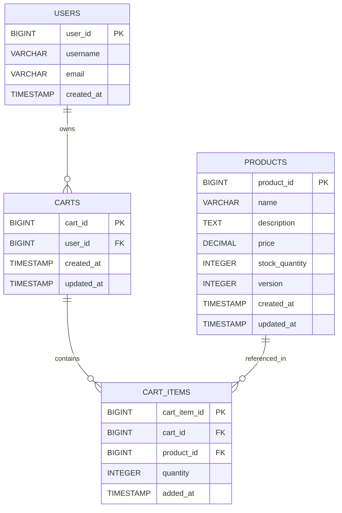
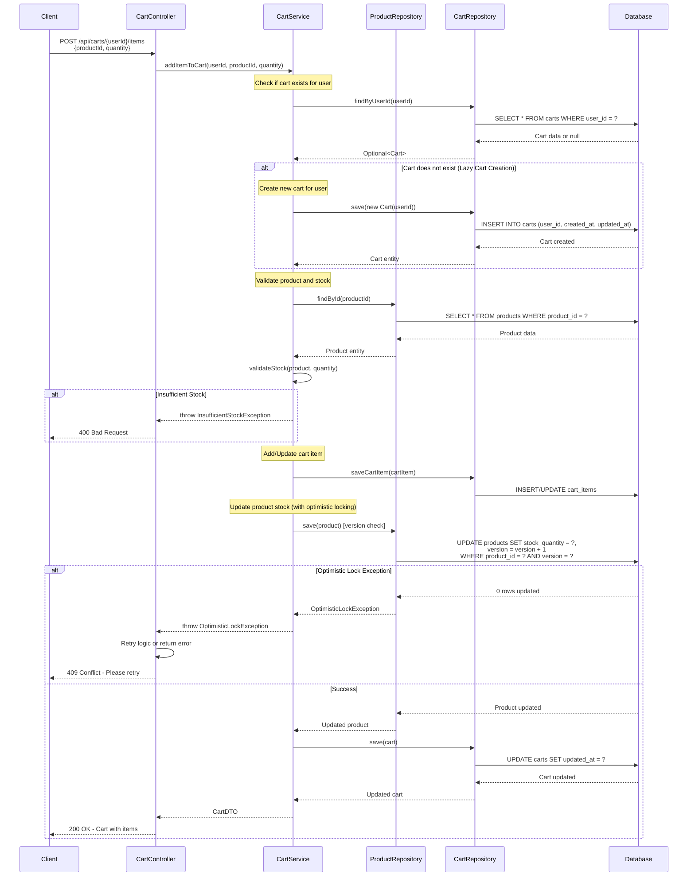

# Low Level Design (LLD) - Shopping Cart System

## Executive Summary

This document provides a comprehensive Low Level Design for a Shopping Cart System built using Spring Boot MVC architecture. The system enables users to manage shopping carts, add/remove products, and handle cart operations with proper concurrency control through optimistic locking.

## System Architecture

The Shopping Cart System follows a layered architecture pattern:
- **Presentation Layer**: REST Controllers
- **Business Logic Layer**: Service classes
- **Data Access Layer**: JPA Repositories
- **Database Layer**: PostgreSQL

## Domain Entities

### User Entity
- Represents system users who can create and manage shopping carts
- Attributes: userId (PK), username, email, createdAt

### Product Entity
- Represents products available for purchase
- Attributes: productId (PK), name, description, price, stockQuantity, version (for optimistic locking)

### Cart Entity
- Represents a user's shopping cart
- Attributes: cartId (PK), userId (FK), createdAt, updatedAt
- Relationship: One-to-Many with CartItem

### CartItem Entity
- Represents individual items within a cart
- Attributes: cartItemId (PK), cartId (FK), productId (FK), quantity, addedAt
- Relationships: Many-to-One with Cart and Product

## REST API Contracts

### Cart Management Endpoints

#### Create/Get Cart
- **GET** `/api/carts/user/{userId}`
- Response: Cart details with items

#### Add Item to Cart
- **POST** `/api/carts/{cartId}/items`
- Request Body: `{ "productId": Long, "quantity": Integer }`
- Response: Updated cart with items

#### Update Cart Item Quantity
- **PUT** `/api/carts/{cartId}/items/{itemId}`
- Request Body: `{ "quantity": Integer }`
- Response: Updated cart item

#### Remove Item from Cart
- **DELETE** `/api/carts/{cartId}/items/{itemId}`
- Response: 204 No Content

#### Clear Cart
- **DELETE** `/api/carts/{cartId}`
- Response: 204 No Content

## Business Logic

### Cart Service
- Implements lazy cart creation (creates cart only when first item is added)
- Handles optimistic locking for product updates
- Validates product availability and stock
- Manages cart item quantities

### Concurrency Control
- Optimistic locking on Product entity using version field
- Prevents overselling and race conditions
- Retry mechanism for failed transactions

## Error Handling

- ProductNotFoundException: 404
- InsufficientStockException: 400
- OptimisticLockException: 409 (Conflict)
- CartNotFoundException: 404

---

## Technical Artifacts

### 1. Entity-Relationship Diagram (ERD)



### 2. Add to Cart Flow - Sequence Diagram



### 3. Database Model (PostgreSQL DDL)

```sql
-- ============================================
-- Shopping Cart System - PostgreSQL DDL
-- ============================================

-- Drop tables if they exist (for clean setup)
DROP TABLE IF EXISTS cart_items CASCADE;
DROP TABLE IF EXISTS carts CASCADE;
DROP TABLE IF EXISTS products CASCADE;
DROP TABLE IF EXISTS users CASCADE;

-- ============================================
-- USERS Table
-- ============================================
CREATE TABLE users (
    user_id BIGSERIAL PRIMARY KEY,
    username VARCHAR(100) NOT NULL UNIQUE,
    email VARCHAR(255) NOT NULL UNIQUE,
    created_at TIMESTAMP NOT NULL DEFAULT CURRENT_TIMESTAMP,
    CONSTRAINT chk_username_length CHECK (LENGTH(username) >= 3),
    CONSTRAINT chk_email_format CHECK (email ~* '^[A-Za-z0-9._%+-]+@[A-Za-z0-9.-]+\.[A-Za-z]{2,}$')
);

-- ============================================
-- PRODUCTS Table
-- ============================================
CREATE TABLE products (
    product_id BIGSERIAL PRIMARY KEY,
    name VARCHAR(255) NOT NULL,
    description TEXT,
    price DECIMAL(10, 2) NOT NULL,
    stock_quantity INTEGER NOT NULL DEFAULT 0,
    version INTEGER NOT NULL DEFAULT 0,
    created_at TIMESTAMP NOT NULL DEFAULT CURRENT_TIMESTAMP,
    updated_at TIMESTAMP NOT NULL DEFAULT CURRENT_TIMESTAMP,
    CONSTRAINT chk_price_positive CHECK (price >= 0),
    CONSTRAINT chk_stock_non_negative CHECK (stock_quantity >= 0),
    CONSTRAINT chk_name_not_empty CHECK (LENGTH(TRIM(name)) > 0)
);

-- ============================================
-- CARTS Table
-- ============================================
CREATE TABLE carts (
    cart_id BIGSERIAL PRIMARY KEY,
    user_id BIGINT NOT NULL,
    created_at TIMESTAMP NOT NULL DEFAULT CURRENT_TIMESTAMP,
    updated_at TIMESTAMP NOT NULL DEFAULT CURRENT_TIMESTAMP,
    CONSTRAINT fk_cart_user FOREIGN KEY (user_id) 
        REFERENCES users(user_id) 
        ON DELETE CASCADE,
    CONSTRAINT uq_user_cart UNIQUE (user_id)
);

-- ============================================
-- CART_ITEMS Table
-- ============================================
CREATE TABLE cart_items (
    cart_item_id BIGSERIAL PRIMARY KEY,
    cart_id BIGINT NOT NULL,
    product_id BIGINT NOT NULL,
    quantity INTEGER NOT NULL,
    added_at TIMESTAMP NOT NULL DEFAULT CURRENT_TIMESTAMP,
    CONSTRAINT fk_cart_item_cart FOREIGN KEY (cart_id) 
        REFERENCES carts(cart_id) 
        ON DELETE CASCADE,
    CONSTRAINT fk_cart_item_product FOREIGN KEY (product_id) 
        REFERENCES products(product_id) 
        ON DELETE CASCADE,
    CONSTRAINT chk_quantity_positive CHECK (quantity > 0),
    CONSTRAINT uq_cart_product UNIQUE (cart_id, product_id)
);

-- ============================================
-- Indexes for Performance Optimization
-- ============================================

-- Index on users email for login queries
CREATE INDEX idx_users_email ON users(email);

-- Index on users username for search queries
CREATE INDEX idx_users_username ON users(username);

-- Index on products name for search functionality
CREATE INDEX idx_products_name ON products(name);

-- Index on products price for filtering and sorting
CREATE INDEX idx_products_price ON products(price);

-- Index on carts user_id for quick cart lookup by user
CREATE INDEX idx_carts_user_id ON carts(user_id);

-- Index on cart_items cart_id for fetching all items in a cart
CREATE INDEX idx_cart_items_cart_id ON cart_items(cart_id);

-- Index on cart_items product_id for product-based queries
CREATE INDEX idx_cart_items_product_id ON cart_items(product_id);

-- Composite index for cart and product lookup
CREATE INDEX idx_cart_items_cart_product ON cart_items(cart_id, product_id);

-- ============================================
-- Triggers for automatic timestamp updates
-- ============================================

-- Function to update updated_at timestamp
CREATE OR REPLACE FUNCTION update_updated_at_column()
RETURNS TRIGGER AS $$
BEGIN
    NEW.updated_at = CURRENT_TIMESTAMP;
    RETURN NEW;
END;
$$ LANGUAGE plpgsql;

-- Trigger for products table
CREATE TRIGGER trg_products_updated_at
    BEFORE UPDATE ON products
    FOR EACH ROW
    EXECUTE FUNCTION update_updated_at_column();

-- Trigger for carts table
CREATE TRIGGER trg_carts_updated_at
    BEFORE UPDATE ON carts
    FOR EACH ROW
    EXECUTE FUNCTION update_updated_at_column();

-- ============================================
-- Sample Data (Optional - for testing)
-- ============================================

-- Insert sample users
INSERT INTO users (username, email) VALUES
    ('john_doe', 'john.doe@example.com'),
    ('jane_smith', 'jane.smith@example.com'),
    ('bob_wilson', 'bob.wilson@example.com');

-- Insert sample products
INSERT INTO products (name, description, price, stock_quantity) VALUES
    ('Laptop', 'High-performance laptop with 16GB RAM', 1299.99, 50),
    ('Wireless Mouse', 'Ergonomic wireless mouse', 29.99, 200),
    ('USB-C Cable', 'Fast charging USB-C cable', 12.99, 500),
    ('Keyboard', 'Mechanical keyboard with RGB lighting', 89.99, 100),
    ('Monitor', '27-inch 4K monitor', 399.99, 75);

-- ============================================
-- Comments for documentation
-- ============================================

COMMENT ON TABLE users IS 'Stores user account information';
COMMENT ON TABLE products IS 'Stores product catalog with optimistic locking support';
COMMENT ON TABLE carts IS 'Stores shopping carts for users (one cart per user)';
COMMENT ON TABLE cart_items IS 'Stores individual items within shopping carts';

COMMENT ON COLUMN products.version IS 'Version number for optimistic locking to prevent concurrent update conflicts';
COMMENT ON COLUMN products.stock_quantity IS 'Current available stock quantity';
COMMENT ON COLUMN cart_items.quantity IS 'Quantity of the product in the cart (must be greater than 0)';
```

---

## Implementation Notes

### Optimistic Locking Strategy
- The `version` column in the PRODUCTS table is automatically incremented by JPA on each update
- When a concurrent update conflict occurs, the application catches `OptimisticLockException`
- The client receives a 409 Conflict response and should retry the operation

### Lazy Cart Creation
- Carts are not pre-created for users
- A cart is automatically created when a user adds their first item
- This approach reduces database overhead for users who browse but don't add items

### Data Integrity
- Foreign key constraints with CASCADE delete ensure referential integrity
- CHECK constraints validate business rules at the database level
- UNIQUE constraints prevent duplicate cart items and ensure one cart per user

### Performance Considerations
- Indexes on foreign keys improve JOIN performance
- Composite index on (cart_id, product_id) optimizes cart item lookups
- Timestamp triggers automatically maintain audit fields

## Conclusion

This enhanced LLD provides a complete technical specification for implementing a robust Shopping Cart System with proper concurrency control, data integrity, and performance optimization.