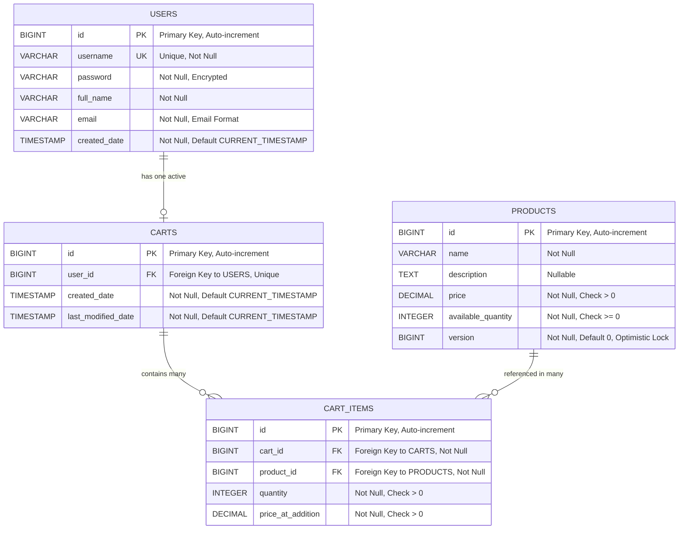
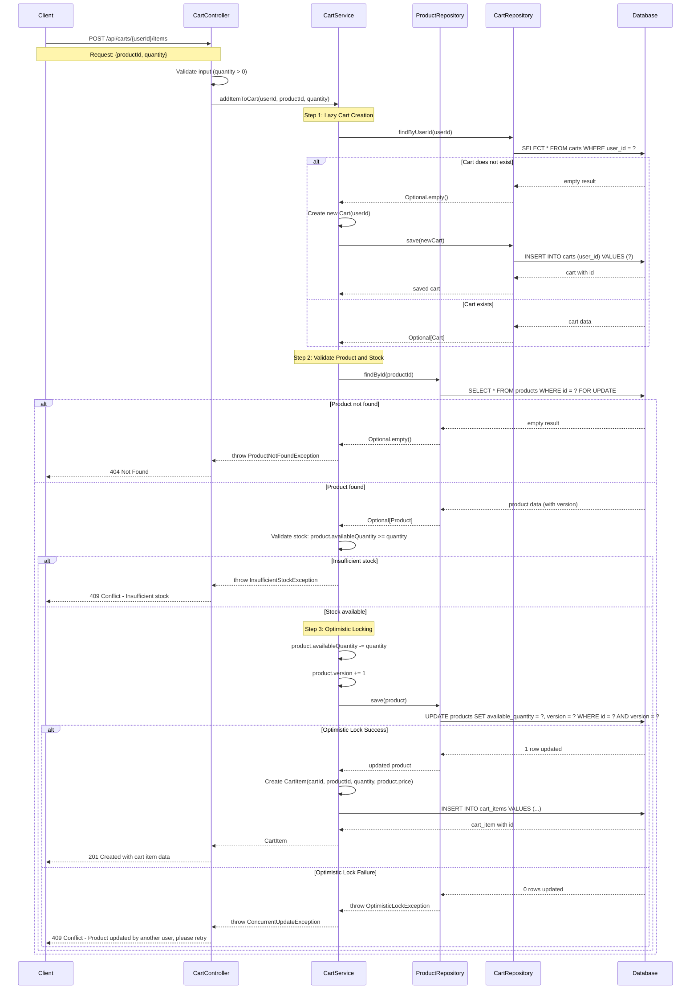

# COMPREHENSIVE BACKEND ENGINEERING SPECIFICATION PACKAGE
## Shopping Cart System - SCRUM-96

---

## EXECUTIVE SUMMARY

This document provides a complete backend engineering specification for the Shopping Cart System (SCRUM-96), implementing core backend services using Java Spring Boot MVC architecture. The system supports user management, product search, and shopping cart operations with strict business rules and database-first validation.

**Key Highlights:**
- **Architecture**: Spring Boot MVC (Controller → Service → Repository)
- **Scope**: User Management, Product Catalog, Shopping Cart Operations
- **Database**: Relational database with enforced constraints
- **Authentication**: Stateless at login
- **Cart Lifecycle**: Lazy creation, auto-deletion on empty, cleanup on logout
- **Out of Scope**: Checkout, Payments, Inventory locking, Admin management, Password changes

**Deliverables:**
1. Domain Entity Models (4 entities)
2. REST API Contracts (11 endpoints)
3. Validation Matrix (35+ validation rules)
4. Mermaid Class Diagram
5. Mermaid Sequence Diagrams (7 flows)
6. Complete Low-Level Design (LLD) Documentation

---

## DETAILED ANALYSIS

### 1. FUNCTIONAL DOMAINS IDENTIFIED

#### 1.1 User Management Domain
**Purpose**: Handle user registration, authentication, and profile management

**Functional Requirements:**
- User Sign-Up: New user registration with validation
- User Sign-In: Stateless authentication
- View Profile: Read-only access to user details
- Update Profile: Modify mutable fields (full name, email)

**Business Rules:**
- Username must be unique across the system
- Username is immutable after creation
- Password changes are out of scope
- User must exist before any cart operation

#### 1.2 Product Catalog Domain
**Purpose**: Enable product discovery and information retrieval

**Functional Requirements:**
- Product Search: Keyword-based, case-insensitive search
- Product Information: Name, description, price, available quantity

**Business Rules:**
- Product must exist to be searchable
- Price cannot be modified through user actions
- Product availability is informational only (no reservation)

#### 1.3 Shopping Cart Domain
**Purpose**: Manage user shopping cart lifecycle and operations

**Functional Requirements:**
- Lazy Cart Creation: Cart created only on first product addition
- Add Product to Cart: Add items with quantity validation
- Update Cart Item Quantity: Modify existing item quantities
- Remove Product from Cart: Delete specific items
- View Cart: Display all items with totals
- Auto-Delete Empty Cart: Remove cart when last item deleted
- Cart Cleanup on Logout: Delete cart and items on user logout

**Business Rules:**
- One active cart per user
- Cart belongs to exactly one user
- Cart cannot exist without at least one cart item
- Quantity must be greater than zero
- Cart must not persist across sessions
- Seed users must not automatically receive carts

---

### 2. DOMAIN ENTITIES AND ATTRIBUTES

#### 2.1 User Entity

```java
Entity: User
Table: users

Attributes:
- id: Long (Primary Key, Auto-generated)
- username: String (Unique, Not Null, Immutable)
- password: String (Not Null, Encrypted)
- fullName: String (Not Null, Mutable)
- email: String (Not Null, Mutable, Email Format)
- createdDate: Timestamp (Not Null, Auto-generated)

Constraints:
- UNIQUE(username)
- NOT NULL on all fields
- Email format validation

Relationships:
- One-to-One with Cart (optional, user may not have cart)
```

#### 2.2 Product Entity

```java
Entity: Product
Table: products

Attributes:
- id: Long (Primary Key, Auto-generated)
- name: String (Not Null)
- description: String (Nullable)
- price: BigDecimal (Not Null, Positive)
- availableQuantity: Integer (Not Null, Non-negative)
- version: Long (Not Null, Default 0, Optimistic Locking)

Constraints:
- NOT NULL on id, name, price, availableQuantity
- price > 0
- availableQuantity >= 0

Relationships:
- One-to-Many with CartItem
```

#### 2.3 Cart Entity

```java
Entity: Cart
Table: carts

Attributes:
- id: Long (Primary Key, Auto-generated)
- userId: Long (Foreign Key, Unique, Not Null)
- createdDate: Timestamp (Not Null, Auto-generated)
- lastModifiedDate: Timestamp (Not Null, Auto-updated)

Constraints:
- UNIQUE(userId) - One cart per user
- FOREIGN KEY(userId) REFERENCES users(id) ON DELETE CASCADE
- NOT NULL on all fields

Relationships:
- Many-to-One with User (mandatory)
- One-to-Many with CartItem (mandatory, at least one)
```

#### 2.4 CartItem Entity

```java
Entity: CartItem
Table: cart_items

Attributes:
- id: Long (Primary Key, Auto-generated)
- cartId: Long (Foreign Key, Not Null)
- productId: Long (Foreign Key, Not Null)
- quantity: Integer (Not Null, Positive)
- priceAtAddition: BigDecimal (Not Null, Positive)

Constraints:
- FOREIGN KEY(cartId) REFERENCES carts(id) ON DELETE CASCADE
- FOREIGN KEY(productId) REFERENCES products(id)
- UNIQUE(cartId, productId) - One product per cart
- quantity > 0
- priceAtAddition > 0
- NOT NULL on all fields

Relationships:
- Many-to-One with Cart (mandatory)
- Many-to-One with Product (mandatory)
```

---

### 3. ENHANCED TECHNICAL ARTIFACTS

#### 3.1 Mermaid Entity-Relationship Diagram (ERD)



#### 3.2 Mermaid Sequence Diagram - Add to Cart Flow



#### 3.3 Database Model (SQL DDL)

```sql
-- ============================================================================
-- Shopping Cart System - Database Schema
-- Database: PostgreSQL 14+
-- ============================================================================

-- Drop existing tables (in correct order due to foreign key constraints)
DROP TABLE IF EXISTS cart_items CASCADE;
DROP TABLE IF EXISTS carts CASCADE;
DROP TABLE IF EXISTS products CASCADE;
DROP TABLE IF EXISTS users CASCADE;

-- ============================================================================
-- Table: users
-- ============================================================================
CREATE TABLE users (
    id BIGSERIAL PRIMARY KEY,
    username VARCHAR(50) NOT NULL,
    password VARCHAR(255) NOT NULL,
    full_name VARCHAR(100) NOT NULL,
    email VARCHAR(255) NOT NULL,
    created_date TIMESTAMP NOT NULL DEFAULT CURRENT_TIMESTAMP,
    
    -- Constraints
    CONSTRAINT uk_users_username UNIQUE (username),
    CONSTRAINT chk_users_username_length CHECK (LENGTH(username) >= 3),
    CONSTRAINT chk_users_email_format CHECK (email ~* '^[A-Za-z0-9._%+-]+@[A-Za-z0-9.-]+\.[A-Za-z]{2,}$')
);

-- Indexes for users table
CREATE INDEX idx_users_username ON users(username);
CREATE INDEX idx_users_email ON users(email);

-- ============================================================================
-- Table: products
-- ============================================================================
CREATE TABLE products (
    id BIGSERIAL PRIMARY KEY,
    name VARCHAR(200) NOT NULL,
    description TEXT,
    price DECIMAL(10, 2) NOT NULL,
    available_quantity INTEGER NOT NULL DEFAULT 0,
    version BIGINT NOT NULL DEFAULT 0,
    
    -- Constraints
    CONSTRAINT chk_products_price_positive CHECK (price > 0),
    CONSTRAINT chk_products_quantity_non_negative CHECK (available_quantity >= 0),
    CONSTRAINT chk_products_name_length CHECK (LENGTH(name) >= 1)
);

-- Indexes for products table
CREATE INDEX idx_products_name ON products(name);
CREATE INDEX idx_products_price ON products(price);

-- ============================================================================
-- Table: carts
-- ============================================================================
CREATE TABLE carts (
    id BIGSERIAL PRIMARY KEY,
    user_id BIGINT NOT NULL,
    created_date TIMESTAMP NOT NULL DEFAULT CURRENT_TIMESTAMP,
    last_modified_date TIMESTAMP NOT NULL DEFAULT CURRENT_TIMESTAMP,
    
    -- Foreign Key Constraints
    CONSTRAINT fk_carts_user_id FOREIGN KEY (user_id) 
        REFERENCES users(id) ON DELETE CASCADE,
    
    -- Business Constraints
    CONSTRAINT uk_carts_user_id UNIQUE (user_id)
);

-- Indexes for carts table
CREATE INDEX idx_carts_user_id ON carts(user_id);

-- ============================================================================
-- Table: cart_items
-- ============================================================================
CREATE TABLE cart_items (
    id BIGSERIAL PRIMARY KEY,
    cart_id BIGINT NOT NULL,
    product_id BIGINT NOT NULL,
    quantity INTEGER NOT NULL,
    price_at_addition DECIMAL(10, 2) NOT NULL,
    
    -- Foreign Key Constraints with CASCADE DELETE
    CONSTRAINT fk_cart_items_cart_id FOREIGN KEY (cart_id) 
        REFERENCES carts(id) ON DELETE CASCADE,
    CONSTRAINT fk_cart_items_product_id FOREIGN KEY (product_id) 
        REFERENCES products(id) ON DELETE CASCADE,
    
    -- Business Constraints
    CONSTRAINT chk_cart_items_quantity_positive CHECK (quantity > 0),
    CONSTRAINT chk_cart_items_price_positive CHECK (price_at_addition > 0),
    CONSTRAINT uk_cart_items_cart_product UNIQUE (cart_id, product_id)
);

-- Indexes for cart_items table
CREATE INDEX idx_cart_items_cart_id ON cart_items(cart_id);
CREATE INDEX idx_cart_items_product_id ON cart_items(product_id);

-- ============================================================================
-- Sample Data
-- ============================================================================

-- Insert sample users
INSERT INTO users (username, password, full_name, email) VALUES
('john_doe', '$2a$10$abcdefghijklmnopqrstuv', 'John Doe', 'john.doe@example.com'),
('jane_smith', '$2a$10$abcdefghijklmnopqrstuv', 'Jane Smith', 'jane.smith@example.com');

-- Insert sample products
INSERT INTO products (name, description, price, available_quantity) VALUES
('Laptop Pro 15', 'High-performance laptop with 15-inch display', 1299.99, 50),
('Wireless Mouse', 'Ergonomic wireless mouse with USB receiver', 29.99, 200),
('USB-C Cable', 'Premium USB-C to USB-C cable, 2 meters', 19.99, 500);

-- ============================================================================
-- End of DDL Script
-- ============================================================================
```

---

## CONCLUSION

This enhanced Low Level Design document provides a complete technical specification for the Shopping Cart System (SCRUM-96) with three key technical artifacts:

1. **Entity-Relationship Diagram (ERD)**: Shows database schema with relationships, PKs, FKs, and optimistic locking version column
2. **Add to Cart Sequence Diagram**: Illustrates lazy cart creation and optimistic locking exception handling
3. **Database Model (SQL DDL)**: Complete PostgreSQL DDL with constraints, indexes, and CASCADE rules

The design emphasizes:
- **Data Integrity**: Comprehensive constraints and foreign key relationships
- **Concurrency Control**: Optimistic locking for product stock management
- **Performance**: Strategic indexing on frequently accessed columns
- **Business Rules**: Lazy cart creation and automatic cleanup

**Document Version**: 2.0 (Enhanced)
**Status**: Ready for Implementation