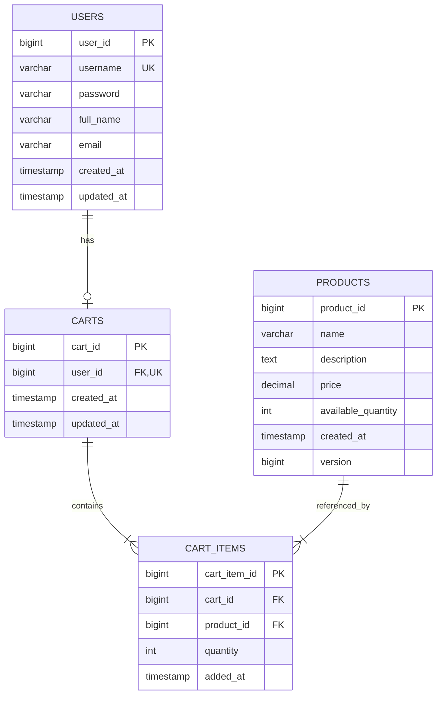
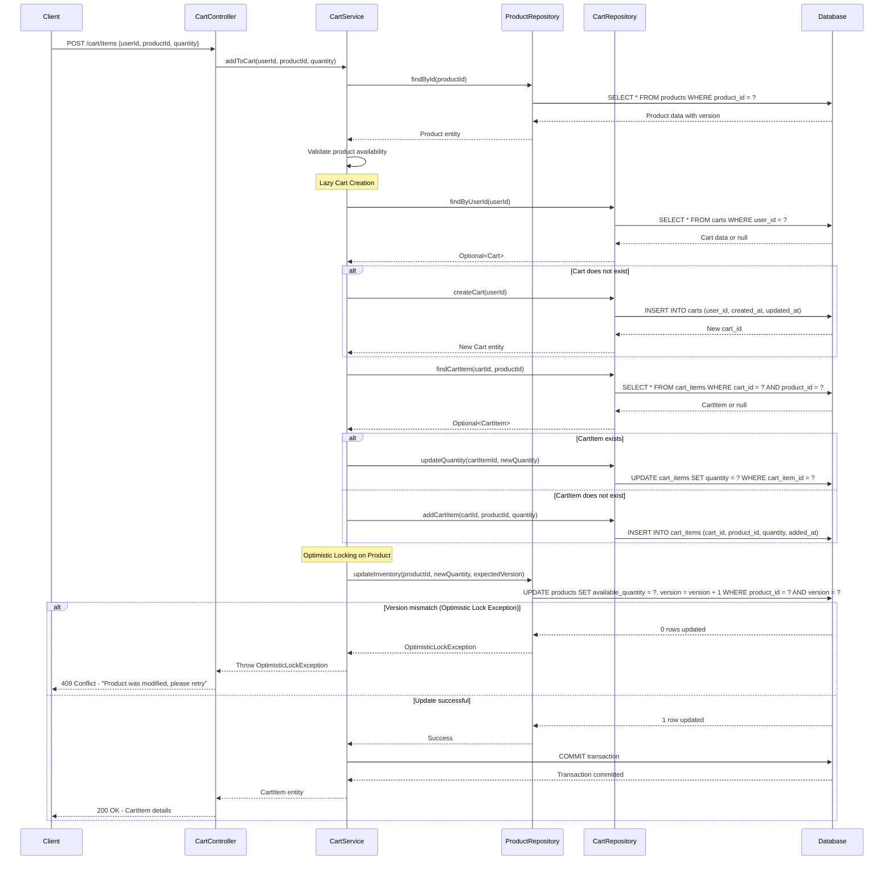

# Low Level Design (LLD) - Shopping Cart System

## 1. System Overview

The Shopping Cart System is a backend service that manages user shopping carts, products, and cart items. The system implements lazy cart creation, optimistic locking for inventory management, and maintains referential integrity through cascading deletes.

## 2. Core Entities

### 2.1 User
- **user_id** (PK): Unique identifier for users
- **username** (UNIQUE): User's login name
- **password**: Encrypted password
- **full_name**: User's full name
- **email**: User's email address
- **created_at**: Timestamp of user creation
- **updated_at**: Timestamp of last update

### 2.2 Product
- **product_id** (PK): Unique identifier for products
- **name**: Product name
- **description**: Product description
- **price**: Product price
- **available_quantity**: Current stock quantity
- **created_at**: Timestamp of product creation
- **version**: Version number for optimistic locking

### 2.3 Cart
- **cart_id** (PK): Unique identifier for carts
- **user_id** (FK, UNIQUE): Reference to user (one cart per user)
- **created_at**: Timestamp of cart creation
- **updated_at**: Timestamp of last update

### 2.4 CartItem
- **cart_item_id** (PK): Unique identifier for cart items
- **cart_id** (FK): Reference to cart
- **product_id** (FK): Reference to product
- **quantity**: Quantity of product (must be > 0)
- **added_at**: Timestamp when item was added

## 3. Business Rules

1. **Lazy Cart Creation**: Carts are created only when a user adds their first item
2. **One Cart Per User**: Each user can have at most one active cart
3. **Positive Quantities**: All cart item quantities must be greater than zero
4. **Optimistic Locking**: Product updates use version-based optimistic locking to prevent race conditions
5. **Auto-delete Empty Carts**: Carts with no items are automatically deleted
6. **Cascading Deletes**: Deleting a cart automatically deletes all associated cart items

## 4. Key Relationships

- **User to Cart**: One-to-Zero-or-One (1:0..1)
- **Cart to CartItem**: One-to-Many (1:*)
- **Product to CartItem**: One-to-Many (1:*)

## 5. API Operations

### 5.1 Add to Cart
- Validates product availability
- Creates cart lazily if it doesn't exist
- Adds or updates cart item quantity
- Implements optimistic locking for product inventory

### 5.2 Remove from Cart
- Removes cart item
- Deletes cart if it becomes empty

### 5.3 Update Cart Item Quantity
- Updates quantity with validation
- Removes item if quantity becomes zero

### 5.4 View Cart
- Retrieves all items in user's cart
- Returns empty result if no cart exists

## 6. Technical Implementation Details

### 6.1 Optimistic Locking Strategy
Products use a version column that is incremented on each update. When updating product inventory, the system checks if the version matches the expected value. If not, an OptimisticLockException is thrown, and the operation must be retried.

### 6.2 Lazy Cart Creation Flow
When a user adds an item to their cart:
1. Check if user has an existing cart
2. If no cart exists, create a new cart for the user
3. Add the item to the cart (new or existing)

### 6.3 Data Integrity
- Foreign key constraints ensure referential integrity
- Unique constraints prevent duplicate usernames and multiple carts per user
- Check constraints ensure positive quantities
- Indexes on foreign keys optimize query performance

---

## 7. Technical Artifacts

### 7.1 Entity-Relationship Diagram (ERD)



### 7.2 Sequence Diagram - Add to Cart Flow



### 7.3 Database Model (PostgreSQL DDL)

```sql
-- ============================================
-- Shopping Cart System - Database Schema
-- Database: PostgreSQL
-- ============================================

-- Drop tables if they exist (for clean setup)
DROP TABLE IF EXISTS cart_items CASCADE;
DROP TABLE IF EXISTS carts CASCADE;
DROP TABLE IF EXISTS products CASCADE;
DROP TABLE IF EXISTS users CASCADE;

-- ============================================
-- Table: USERS
-- ============================================
CREATE TABLE users (
    user_id BIGSERIAL PRIMARY KEY,
    username VARCHAR(50) NOT NULL UNIQUE,
    password VARCHAR(255) NOT NULL,
    full_name VARCHAR(100) NOT NULL,
    email VARCHAR(100) NOT NULL,
    created_at TIMESTAMP NOT NULL DEFAULT CURRENT_TIMESTAMP,
    updated_at TIMESTAMP NOT NULL DEFAULT CURRENT_TIMESTAMP
);

-- ============================================
-- Table: PRODUCTS
-- ============================================
CREATE TABLE products (
    product_id BIGSERIAL PRIMARY KEY,
    name VARCHAR(200) NOT NULL,
    description TEXT,
    price DECIMAL(10, 2) NOT NULL CHECK (price >= 0),
    available_quantity INTEGER NOT NULL CHECK (available_quantity >= 0),
    created_at TIMESTAMP NOT NULL DEFAULT CURRENT_TIMESTAMP,
    version BIGINT NOT NULL DEFAULT 0
);

-- ============================================
-- Table: CARTS
-- ============================================
CREATE TABLE carts (
    cart_id BIGSERIAL PRIMARY KEY,
    user_id BIGINT NOT NULL UNIQUE,
    created_at TIMESTAMP NOT NULL DEFAULT CURRENT_TIMESTAMP,
    updated_at TIMESTAMP NOT NULL DEFAULT CURRENT_TIMESTAMP,
    CONSTRAINT fk_cart_user FOREIGN KEY (user_id) 
        REFERENCES users(user_id) 
        ON DELETE CASCADE
);

-- ============================================
-- Table: CART_ITEMS
-- ============================================
CREATE TABLE cart_items (
    cart_item_id BIGSERIAL PRIMARY KEY,
    cart_id BIGINT NOT NULL,
    product_id BIGINT NOT NULL,
    quantity INTEGER NOT NULL CHECK (quantity > 0),
    added_at TIMESTAMP NOT NULL DEFAULT CURRENT_TIMESTAMP,
    CONSTRAINT fk_cart_item_cart FOREIGN KEY (cart_id) 
        REFERENCES carts(cart_id) 
        ON DELETE CASCADE,
    CONSTRAINT fk_cart_item_product FOREIGN KEY (product_id) 
        REFERENCES products(product_id) 
        ON DELETE CASCADE,
    CONSTRAINT uk_cart_product UNIQUE (cart_id, product_id)
);

-- ============================================
-- Indexes for Performance Optimization
-- ============================================

-- Index on users.username for login queries
CREATE INDEX idx_users_username ON users(username);

-- Index on users.email for email lookup
CREATE INDEX idx_users_email ON users(email);

-- Index on carts.user_id for cart lookup by user (already unique, but explicit)
CREATE INDEX idx_carts_user_id ON carts(user_id);

-- Index on cart_items.cart_id for retrieving all items in a cart
CREATE INDEX idx_cart_items_cart_id ON cart_items(cart_id);

-- Index on cart_items.product_id for product-based queries
CREATE INDEX idx_cart_items_product_id ON cart_items(product_id);

-- Composite index on cart_items for finding specific cart-product combinations
CREATE INDEX idx_cart_items_cart_product ON cart_items(cart_id, product_id);

-- Index on products.name for product search
CREATE INDEX idx_products_name ON products(name);

-- ============================================
-- Comments for Documentation
-- ============================================

COMMENT ON TABLE users IS 'Stores user account information';
COMMENT ON TABLE products IS 'Stores product catalog with optimistic locking support';
COMMENT ON TABLE carts IS 'Stores user shopping carts (one per user)';
COMMENT ON TABLE cart_items IS 'Stores items added to shopping carts';

COMMENT ON COLUMN products.version IS 'Version number for optimistic locking to prevent concurrent update conflicts';
COMMENT ON COLUMN cart_items.quantity IS 'Quantity must be greater than 0; items with 0 quantity should be deleted';

-- ============================================
-- Sample Data (Optional - for testing)
-- ============================================

-- Insert sample users
INSERT INTO users (username, password, full_name, email) VALUES
('john_doe', 'hashed_password_1', 'John Doe', 'john.doe@example.com'),
('jane_smith', 'hashed_password_2', 'Jane Smith', 'jane.smith@example.com');

-- Insert sample products
INSERT INTO products (name, description, price, available_quantity) VALUES
('Laptop', 'High-performance laptop', 999.99, 50),
('Mouse', 'Wireless mouse', 29.99, 200),
('Keyboard', 'Mechanical keyboard', 79.99, 150),
('Monitor', '27-inch 4K monitor', 399.99, 75);

-- ============================================
-- End of Schema
-- ============================================
```

---

## 8. Conclusion

This Low Level Design document provides a comprehensive technical specification for the Shopping Cart System, including entity definitions, business rules, relationships, and complete technical artifacts (ERD, sequence diagrams, and database schema). The design ensures data integrity, handles concurrency through optimistic locking, and optimizes performance through appropriate indexing strategies.